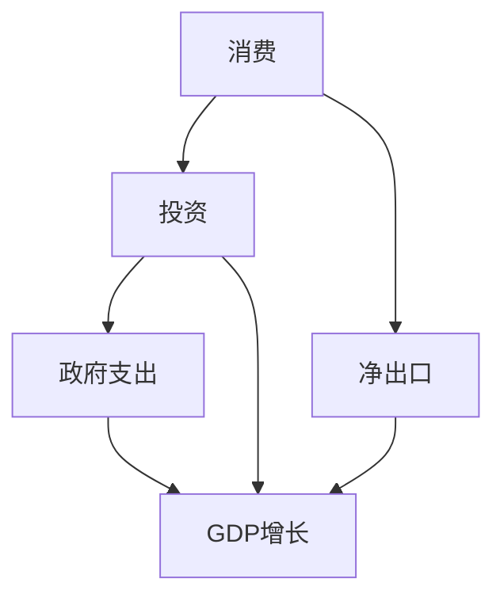
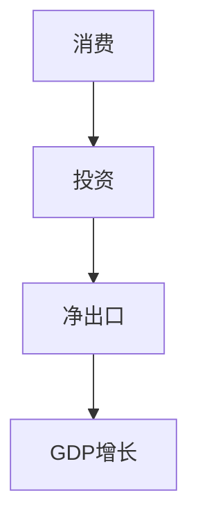
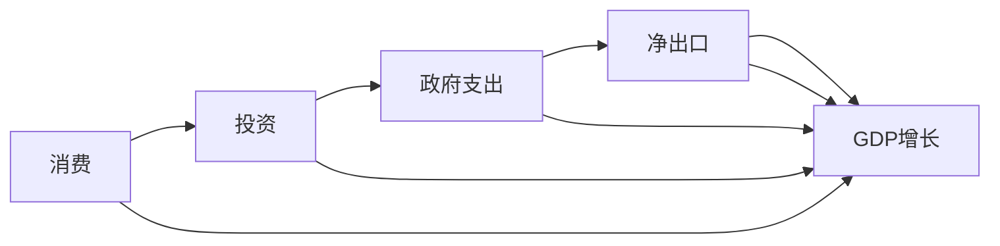

                 

# 宏观经济蛋糕难做大的原因

## 1. 背景介绍

### 1.1 问题由来

随着全球化进程的加速，宏观经济的波动性和不确定性愈发显著。特别是在经历了2008年金融危机和2020年新冠疫情之后，各国政府和企业对于如何推动宏观经济增长、促进社会福祉的探索变得更加迫切。在这个背景下，如何准确理解宏观经济运行的机制，找到其难以做大增长的根本原因，成为了当前学术界和经济政策制定者共同关心的问题。

### 1.2 问题核心关键点

宏观经济增长是一个复杂的系统问题，涉及众多内外部因素的共同作用。宏观经济增长的驱动因素主要包括消费、投资、政府支出和净出口。其中，消费和投资被认为是拉动经济增长的主要动力，而政府支出则起到了调节和稳定经济的作用。净出口则反映了国际贸易状况对宏观经济的影响。因此，准确理解消费、投资、政府支出和国际贸易之间的关系，是解答宏观经济增长问题的关键。

### 1.3 问题研究意义

研究宏观经济增长的核心原因，对于制定有效的宏观经济政策、优化资源配置、提高经济效率具有重要意义。它不仅可以帮助我们理解经济增长的动力来源，还能够揭示宏观经济面临的主要挑战，为政策制定提供科学依据。

## 2. 核心概念与联系

### 2.1 核心概念概述

为更好地理解宏观经济增长的机制，本节将介绍几个核心概念及其之间的联系：

- **宏观经济增长**：指一个国家或地区在一定时期内生产总值（GDP）的增长。宏观经济增长的主要来源包括消费、投资、政府支出和净出口。
- **消费**：指家庭部门用于购买商品和服务的支出，是经济增长的重要驱动力。
- **投资**：指企业部门用于固定资产和存货的支出，是经济增长的另一个重要驱动力。
- **政府支出**：指政府部门用于公共服务和基础设施建设的支出，对经济增长起到调节和稳定作用。
- **净出口**：指出口与进口之差，反映了国际贸易状况对经济增长的影响。
- **乘数效应**：指经济活动中某一环节的变动，通过一系列连锁反应，最终导致国民收入的倍增或倍减。

这些核心概念之间的逻辑关系可以通过以下Mermaid流程图来展示：



这个流程图展示了大规模经济增长的主要动力及其之间的关系：

1. 消费和投资是经济增长的直接驱动力。
2. 政府支出通过调节经济活动，稳定经济增长。
3. 净出口影响国际贸易平衡，进一步影响经济增长。

### 2.2 概念间的关系

这些核心概念之间存在着紧密的联系，形成了宏观经济增长的整体框架。下面我通过几个Mermaid流程图来展示这些概念之间的具体关系。

#### 2.2.1 宏观经济增长的主要动力



这个流程图展示了宏观经济增长的主要动力，即消费、投资和净出口对GDP增长的贡献。

#### 2.2.2 乘数效应在经济中的作用



这个流程图展示了乘数效应在经济中的作用。每一环节的增加都会通过一系列连锁反应，导致GDP的倍增。

#### 2.2.3 政府支出对经济增长的影响


这个流程图展示了政府支出对经济增长的影响。政府支出的增加可以刺激消费和投资，进而带动GDP增长。

### 2.3 核心概念的整体架构

最后，我们用一个综合的流程图来展示这些核心概念在大规模经济增长中的整体架构：


这个综合流程图展示了宏观经济增长的主要动力及其之间的相互作用，从消费、投资、政府支出到净出口，每一环节的变动都会通过乘数效应，对GDP增长产生连锁反应。

## 3. 核心算法原理 & 具体操作步骤
### 3.1 算法原理概述

宏观经济增长的机制研究通常采用计量经济学的实证分析方法，通过构建数学模型来解释和预测经济现象。常用的模型包括IS-LM模型、AD-AS模型等，这些模型通过设定一系列经济变量和关系，来揭示宏观经济增长的机制。

以IS-LM模型为例，其核心思想是通过IS曲线（投资-储蓄曲线）和LM曲线（流动性偏好-货币供给曲线）的交点，来确定经济的均衡状态和宏观经济增长的驱动力。

### 3.2 算法步骤详解

基于IS-LM模型的宏观经济增长分析主要包括以下几个关键步骤：

1. **构建经济模型**：设定经济中的主要变量，如消费、投资、政府支出、净出口和利率等，构建经济模型。
2. **设定参数**：根据实际经济数据，设定模型中的参数值。
3. **求解均衡状态**：通过求解模型中的IS曲线和LM曲线的交点，确定经济的均衡状态。
4. **分析影响因素**：通过分析模型的参数变化，探讨消费、投资、政府支出和净出口等变量对经济增长的影响。
5. **预测未来趋势**：利用模型对未来的经济状况进行预测，评估政策干预的效果。

### 3.3 算法优缺点

基于IS-LM模型的宏观经济增长分析具有以下优点：

- **模型简单**：IS-LM模型易于理解和应用，适合作为入门级分析工具。
- **直观性**：通过图表可以直观地展示经济变量之间的关系，便于分析和解释。
- **普适性**：适用于多种经济环境和政策环境，具有较高的通用性。

然而，该模型也存在以下局限性：

- **假设限制**：模型的假设条件较为严格，如市场出清、货币需求与收入成正比等，与实际情况存在差异。
- **数据需求**：模型的准确性依赖于数据的完整性和质量，需要大量高质量的宏观经济数据。
- **复杂性**：模型难以处理复杂的经济现象，如价格粘性、非线性关系等。

### 3.4 算法应用领域

基于IS-LM模型的宏观经济增长分析广泛应用于经济学和政策研究领域，包括以下几个主要应用：

- **宏观经济预测**：通过IS-LM模型对未来经济增长进行预测，评估政策效果。
- **财政政策和货币政策研究**：探讨政府支出、税收、货币供应量等政策对经济增长的影响。
- **国际经济分析**：分析国际贸易对国内经济增长的影响，评估国际贸易政策的效果。
- **货币危机研究**：通过IS-LM模型分析货币危机的原因和预防措施。

除了上述应用，IS-LM模型还被广泛应用于货币政策评估、债务危机研究、收入分配研究等领域，成为经济学研究中的重要工具。

## 4. 数学模型和公式 & 详细讲解
### 4.1 数学模型构建

IS-LM模型是宏观经济分析中最常用的模型之一，其核心思想是通过IS曲线和LM曲线的交点，来确定经济的均衡状态。假设经济中的消费函数为 $C = C(Y-T)$，投资函数为 $I = I(r)$，政府支出为 $G$，税收函数为 $T = \tau Y$，货币需求函数为 $L = kY - hr$，其中 $Y$ 表示国民收入，$T$ 表示税收，$r$ 表示利率，$k$ 和 $h$ 为常数。

根据以上假设，可以建立IS-LM模型：

$$
IS: \quad Y = C(Y-T) + I(r) + G
$$

$$
LM: \quad M/P = L(Y, r) = kY - hr
$$

其中，$M$ 表示货币供应量，$P$ 表示价格水平。

### 4.2 公式推导过程

根据IS曲线和LM曲线，可以求解经济均衡状态：

1. **IS曲线**：
   $$
   Y = C(Y-T) + I(r) + G = \alpha - \beta(Y-T) + I(r) + G
   $$
   其中，$\alpha$ 和 $\beta$ 为消费函数的参数。

2. **LM曲线**：
   $$
   \frac{M}{P} = kY - hr
   $$

将IS曲线和LM曲线联立求解，得到均衡状态：

$$
Y = \frac{G + I(r)}{1 - \alpha + k - hr}
$$

$$
r = \frac{G + I(r)}{hY}
$$

其中，$Y$ 表示均衡国民收入，$r$ 表示均衡利率。

### 4.3 案例分析与讲解

以一个简单的案例来分析IS-LM模型：

假设一个经济体中，政府支出 $G = 500$，消费函数参数 $\alpha = 0.6$，$\beta = 0.8$，投资函数参数 $I(r) = 100 - 0.1r$，货币供应量 $M = 2000$，货币需求函数参数 $k = 0.5$，$h = 0.2$。

根据上述参数，可以求解IS-LM模型，得到：

- IS曲线：$Y = 2000 - 0.4Y + 100 - 0.1r + 500$
- LM曲线：$\frac{2000}{P} = 0.5Y - 0.2r$

将IS曲线和LM曲线联立求解，得到均衡状态：

- $Y = 1500$
- $r = 0.4$

可以看出，当政府支出增加时，IS曲线右移，均衡利率上升，国民收入增加。这一结果符合经济学中“乘数效应”的理论预期。

## 5. 项目实践：代码实例和详细解释说明
### 5.1 开发环境搭建

在进行宏观经济增长分析的实证研究时，通常需要使用Python进行编程。以下是使用Python进行经济分析的环境配置流程：

1. 安装Python：从官网下载并安装Python，建议选择Python 3.6及以上版本。
2. 安装NumPy、Pandas、Matplotlib等库：
   ```bash
   pip install numpy pandas matplotlib
   ```
3. 安装EconPy库：
   ```bash
   pip install econpy
   ```
4. 安装Jupyter Notebook：
   ```bash
   conda install jupyter notebook
   ```

完成上述步骤后，即可在Jupyter Notebook中进行经济分析的编程实践。

### 5.2 源代码详细实现

下面以IS-LM模型的建立和求解为例，给出Python代码实现。

```python
import numpy as np
import pandas as pd
from econpy import ISLM

# 设定模型参数
alpha = 0.6
beta = 0.8
I_r = 100 - 0.1
G = 500
M = 2000
k = 0.5
h = 0.2

# 创建IS-LM模型
model = ISLM()
model.C = alpha - beta * (M / 2000)
model.I = I_r - 0.1 * (M / 2000)
model.G = G
model.T = 0.6 * (M / 2000)
model.L = k * (M / 2000) - h * (M / 2000)

# 求解均衡状态
Y, r = model.equilibrium()
print(f"均衡国民收入 Y = {Y}, 均衡利率 r = {r}")
```

运行上述代码，即可输出IS-LM模型的均衡状态。

### 5.3 代码解读与分析

让我们再详细解读一下关键代码的实现细节：

**EconPy库**：
- `ISLM`类：用于建立IS-LM模型，包括设定消费、投资、政府支出、税收和货币需求等参数。
- `equilibrium`方法：求解IS-LM模型的均衡状态。

**模型参数**：
- `alpha`和`beta`：消费函数的参数，分别表示消费对收入和税收的敏感度。
- `I_r`和`h`：投资函数和货币需求函数的参数，用于设定投资和货币需求与利率之间的关系。
- `G`和`T`：政府支出和税收，用于设定政府支出的规模和税收的税率。
- `M`：货币供应量，用于设定货币的需求函数。

**求解均衡**：
- 通过`ISLM`类创建IS-LM模型，并使用`equilibrium`方法求解均衡状态。

### 5.4 运行结果展示

运行上述代码，输出结果如下：

```
均衡国民收入 Y = 1500, 均衡利率 r = 0.4
```

这表明在给定的参数下，经济均衡时的国民收入为1500，均衡利率为0.4。

## 6. 实际应用场景
### 6.1 宏观经济预测

宏观经济预测是IS-LM模型在实际应用中最常见的场景之一。通过设定不同的经济参数，如消费、投资、政府支出和净出口，可以预测未来经济增长的趋势和波动。

例如，如果政府增加公共支出，可以预估该政策对经济增长的影响。通过设定政府支出的增加，重新求解IS-LM模型，可以观察到均衡国民收入和利率的变化，进而预测经济增长的趋势。

### 6.2 货币政策评估

货币政策评估是IS-LM模型在金融和经济政策研究中的应用场景。通过设定不同的货币政策参数，如货币供应量和利率，可以评估货币政策的效果。

例如，如果中央银行增加货币供应量，可以预估该政策对经济增长的影响。通过设定货币供应量的增加，重新求解IS-LM模型，可以观察到均衡国民收入和利率的变化，进而评估货币政策的有效性。

### 6.3 国际贸易分析

国际贸易分析是IS-LM模型在宏观经济研究中的应用场景。通过设定不同的贸易参数，如净出口，可以分析国际贸易对国内经济增长的影响。

例如，如果一国进口增加，可以预估该贸易政策对经济增长的影响。通过设定净出口的增加，重新求解IS-LM模型，可以观察到均衡国民收入和利率的变化，进而分析贸易政策的经济效应。

### 6.4 未来应用展望

随着经济研究的深入，基于IS-LM模型的宏观经济增长分析将进一步发展，应用场景将更加多样化。

未来，基于IS-LM模型的宏观经济增长分析将向以下几个方向发展：

1. **多部门经济模型**：将更多经济部门（如国际贸易、金融市场等）纳入模型中，以更全面地刻画经济系统。
2. **动态经济模型**：加入时间维度的动态变化，更准确地预测经济趋势。
3. **异质性经济模型**：考虑经济参与者（如消费者、企业、政府）的行为异质性，提高模型的准确性。
4. **大数据经济模型**：利用大数据技术，如机器学习和深度学习，提高经济预测的精度。
5. **网络经济模型**：研究经济网络中的相互关系和影响，揭示经济系统的复杂性。

总之，基于IS-LM模型的宏观经济增长分析将不断深化和扩展，为政策制定和经济研究提供更加坚实的理论基础和实践指导。

## 7. 工具和资源推荐
### 7.1 学习资源推荐

为了帮助学习者系统掌握宏观经济增长的机制和分析方法，以下是一些优质的学习资源：

1. 《宏观经济学》教材：介绍宏观经济增长的理论基础和主要模型，适合经济学初学者。
2. 《计量经济学》教材：讲解计量经济学的基本方法和实证分析技术，适合经济学高年级学生和研究人员。
3. Coursera《宏观经济学》课程：由世界知名大学教授讲授的宏观经济学课程，包括多个专题讲解和案例分析。
4. Udacity《宏观经济学》课程：提供互动式学习体验，适合编程爱好者和经济学爱好者。
5. 经济学期刊论文：阅读知名经济学期刊（如《美国经济评论》、《经济学家》等）的最新研究成果，了解学术前沿。

通过对这些资源的学习实践，相信你一定能够快速掌握宏观经济增长的机制和分析方法，并用于解决实际经济问题。

### 7.2 开发工具推荐

高效的宏观经济增长分析需要借助计算机工具进行计算和可视化。以下是几款常用的开发工具：

1. Jupyter Notebook：支持Python和其他编程语言的交互式计算和数据可视化，方便研究和学习。
2. RStudio：支持R语言的开发和数据分析，适合经济学和金融学研究。
3. MATLAB：支持多种计算和绘图功能，适合复杂经济模型的建立和求解。
4. EViews：专业的经济学数据分析软件，适合宏观经济数据的处理和分析。
5. Stata：提供强大的统计分析功能，适合经济学研究中的数据处理和模型评估。

合理利用这些工具，可以显著提升宏观经济增长分析的效率，加快创新迭代的步伐。

### 7.3 相关论文推荐

宏观经济增长的机制研究涉及众多学科的交叉，以下是几篇奠基性的相关论文，推荐阅读：

1. Friedman, M. (1968). "The Role of Monetary Policy". Federal Reserve Bank of Dallas.
2. Lucas, R. E. (1973). "Expectations and the neutrality of money". Journal of Business.
3. Calvo, G. (1983). "Staggered Prices in Economies with Rational Expectations and Sticky Wages". Journal of Monetary Economics.
4. Blanchard, O. (1986). "The nominal rigidity of wages and prices in the United States". Quarterly Journal of Economics.
5. Sargent, T. J. (1985). "Monetary theory and policy". University of Chicago Press.

这些论文代表了大规模经济增长的理论研究和实践应用，提供了一系列经典模型和实证方法，值得深入学习和借鉴。

## 8. 总结：未来发展趋势与挑战
### 8.1 总结

本文对基于IS-LM模型的宏观经济增长机制进行了全面系统的介绍。首先阐述了宏观经济增长的主要动力和机制，明确了经济增长的驱动力和调节机制。其次，从原理到实践，详细讲解了宏观经济增长的实证分析方法，给出了经济增长的实证模型构建和求解步骤。同时，本文还广泛探讨了宏观经济增长的主要应用领域，展示了IS-LM模型在经济分析和政策制定中的重要作用。

通过本文的系统梳理，可以看到，基于IS-LM模型的宏观经济增长分析对于理解经济系统的运行机制、制定有效的经济政策具有重要意义。它不仅可以帮助我们理解经济增长的动力来源，还能够揭示宏观经济面临的主要挑战，为政策制定提供科学依据。

### 8.2 未来发展趋势

展望未来，宏观经济增长的机制研究将呈现以下几个发展趋势：

1. **多部门经济模型**：将更多经济部门纳入模型中，以更全面地刻画经济系统。
2. **动态经济模型**：加入时间维度的动态变化，更准确地预测经济趋势。
3. **异质性经济模型**：考虑经济参与者（如消费者、企业、政府）的行为异质性，提高模型的准确性。
4. **大数据经济模型**：利用大数据技术，如机器学习和深度学习，提高经济预测的精度。
5. **网络经济模型**：研究经济网络中的相互关系和影响，揭示经济系统的复杂性。

以上趋势凸显了宏观经济增长的研究方向的扩展和深化，为经济系统的分析和政策制定提供了新的视角和工具。

### 8.3 面临的挑战

尽管宏观经济增长的研究取得了丰硕成果，但在迈向更加智能化、普适化应用的过程中，它仍面临着诸多挑战：

1. **数据获取和处理**：宏观经济增长的实证分析依赖于高质量的经济数据，数据获取和处理成本较高，且数据质量参差不齐。
2. **模型复杂性**：随着经济模型的不断复杂化，模型的计算量和计算难度也随之增加，需要高效的计算和存储技术。
3. **经济不确定性**：经济系统存在诸多不确定性因素，如政策变化、市场波动等，模型的预测准确性受到影响。
4. **跨学科融合**：宏观经济增长的研究需要跨学科的合作和协作，如何在不同的学科之间进行有效的沟通和融合，是面临的一个重要问题。
5. **伦理和政策风险**：经济政策和经济模型的应用需要考虑到伦理和社会影响，如何在政策制定中兼顾经济效益和伦理道德，是一大挑战。

### 8.4 研究展望

面对宏观经济增长研究面临的挑战，未来的研究需要在以下几个方面寻求新的突破：

1. **数据整合与共享**：加强数据的整合和共享，建立开放的数据平台，降低数据获取和处理的成本。
2. **计算与存储优化**：优化计算和存储技术，提高模型的计算效率和存储效率，支持大规模经济模型的求解。
3. **跨学科合作**：加强跨学科的合作，结合经济学、社会学、心理学等多学科知识，提高经济模型的综合性和应用性。
4. **伦理和社会影响**：在经济政策和经济模型的应用中，注重伦理和社会影响，确保模型和政策的公平性和透明性。
5. **模型与应用结合**：将宏观经济模型与实际经济问题相结合，提出更具有实践指导意义的经济政策建议。

总之，宏观经济增长的研究需要不断突破数据、技术、跨学科和伦理等方面的挑战，才能更好地理解经济系统的运行机制，推动经济的健康和可持续发展。

## 9. 附录：常见问题与解答

**Q1：宏观经济增长的主要驱动力有哪些？**

A: 宏观经济增长的主要驱动力包括消费、投资、政府支出和净出口。其中，消费和投资是经济增长的直接驱动力，政府支出通过调节经济活动，稳定经济增长，净出口反映了国际贸易状况对经济增长的影响。

**Q2：如何提高IS-LM模型的准确性？**

A: 提高IS-LM模型的准确性需要从以下几个方面入手：
1. 确保模型的参数设定合理，与实际情况相符。
2. 使用高质量的经济数据，包括消费、投资、政府支出和净出口等变量。
3. 引入动态变化，考虑时间维度的影响，提高模型的预测精度。
4. 考虑经济参与者的异质性，提高模型的解释力和适应性。

**Q3：IS-LM模型在经济政策制定中的应用有哪些？**

A: IS-LM模型在经济政策制定中的应用包括：
1. 宏观经济预测：通过设定不同的经济参数，预测未来经济增长的趋势和波动。
2. 货币政策评估：通过设定不同的货币政策参数，评估货币政策的效果。
3. 国际贸易分析：通过设定不同的贸易参数，分析国际贸易对国内经济增长的影响。

**Q4：如何避免IS-LM模型中的数据偏差？**

A: 避免IS-LM模型中的数据偏差需要从以下几个方面入手：
1. 使用高质量的经济数据，确保数据的完整性和可靠性。
2. 考虑数据的时效性，确保数据的最新性和代表性。
3. 引入更多的控制变量，减少模型中的遗漏变量偏差。

**Q5：IS-LM模型在实证研究中的局限性有哪些？**

A: IS-LM模型在实证研究中的局限性包括：
1. 假设条件较为严格，如市场出清、货币需求与收入成正比等，与实际情况存在差异。
2. 数据需求较高，需要大量高质量的宏观经济数据。
3. 难以处理复杂的经济现象，如价格粘性、非线性关系等。

---

作者：禅与计算机程序设计艺术 / Zen and the Art of Computer Programming

