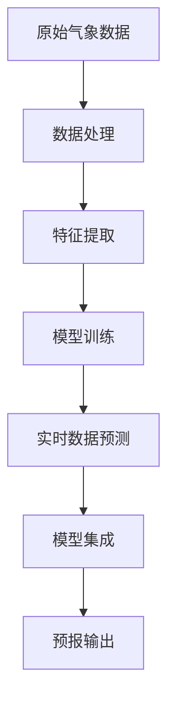

                 

# 实战: 天气预报 (Weather Forecast) 插件开发

## 1. 背景介绍

### 1.1 问题由来

天气预报系统是日常生活和工作中不可或缺的一部分，它不仅影响人们的出行安排，还关系到农业生产、旅游业、气象灾害预警等多个领域。然而，传统的人工天气预报方法存在一定的局限性，如计算复杂度高、精度受人为因素影响较大等。随着计算机科学和人工智能技术的飞速发展，越来越多的智能算法被应用于天气预报中，其中基于机器学习的天气预报技术尤为引人注目。

### 1.2 问题核心关键点

天气预报系统主要包括两部分：气象数据收集和数据分析。气象数据收集主要通过气象站、卫星、雷达等多种手段获取，数据量大且多样化。数据分析则涉及对气象数据的处理、特征提取、模型训练和预测等步骤。本文将重点介绍基于机器学习的天气预报系统开发，特别是如何开发一个天气预报插件，以便集成到现有的气象预报系统中，以提升其准确性和时效性。

### 1.3 问题研究意义

开发一个高精度、高时效性的天气预报插件，对于提升气象预报系统的服务质量，增强公众气象信息获取的便利性和准确性具有重要意义。具体来说，本项目的研究意义如下：

1. **提升预报准确性**：通过机器学习模型对海量气象数据进行深度挖掘，可以提升预报的准确性。
2. **提高预报时效性**：通过快速训练模型，可以实现实时气象数据的实时预报。
3. **降低人力成本**：自动化的机器学习模型可以大大减轻人工工作的负担，提高工作效率。
4. **增强系统稳定性**：通过模型集成和优化，可以提高系统的稳定性和可靠性。

## 2. 核心概念与联系

### 2.1 核心概念概述

为更好地理解天气预报插件的开发，本节将介绍几个密切相关的核心概念：

- **机器学习模型**：使用历史气象数据训练得到的一种能够对未来气象状况进行预测的模型。
- **气象数据处理**：对原始气象数据进行清洗、归一化、特征工程等预处理，以便机器学习模型能够有效利用。
- **特征提取**：从气象数据中提取有用的特征，如温度、湿度、气压、风速等，用于模型训练。
- **模型训练**：使用历史气象数据对机器学习模型进行训练，使其能够对未来气象状况进行预测。
- **实时数据预测**：对实时收集的气象数据进行快速预测，生成实时气象预报。
- **模型集成**：将多个机器学习模型的预测结果进行集成，提高预报的准确性和可靠性。

这些核心概念之间通过机器学习模型训练和预测的流程紧密联系，形成了完整的天气预报插件开发框架。

### 2.2 概念间的关系

这些核心概念之间的关系可以通过以下Mermaid流程图来展示：



这个流程图展示了从原始气象数据到最终预报输出的完整流程：数据处理、特征提取、模型训练、实时数据预测、模型集成和预报输出。

## 3. 核心算法原理 & 具体操作步骤

### 3.1 算法原理概述

基于机器学习的天气预报系统开发，本质上是一个数据驱动的预测模型训练和应用过程。其核心原理可以简述为：

1. **数据收集**：从气象站、卫星、雷达等多种来源收集气象数据。
2. **数据处理**：对原始数据进行清洗、归一化、特征提取等预处理。
3. **模型训练**：使用历史气象数据训练机器学习模型。
4. **模型评估**：对训练好的模型进行评估，选择合适的模型进行集成。
5. **实时预测**：对实时气象数据进行快速预测，生成实时预报。

### 3.2 算法步骤详解

以下是天气预报插件开发的详细步骤：

**Step 1: 数据收集**

- **数据来源**：收集历史气象数据、实时气象数据和卫星数据等。
- **数据格式**：将数据转换为机器学习模型所需的格式，如CSV、JSON等。

**Step 2: 数据处理**

- **数据清洗**：去除噪声、缺失值等异常数据。
- **数据归一化**：对不同单位的数据进行归一化处理，如将温度从摄氏度转换为开尔文。
- **特征提取**：从气象数据中提取有用的特征，如温度、湿度、气压、风速等。

**Step 3: 模型训练**

- **模型选择**：选择适合的机器学习模型，如回归模型、分类模型等。
- **模型训练**：使用历史气象数据对模型进行训练，调整模型参数。
- **模型评估**：使用测试集对模型进行评估，选择性能最优的模型。

**Step 4: 实时数据预测**

- **数据输入**：实时收集气象数据，准备输入到模型中。
- **预测计算**：使用训练好的模型对实时数据进行预测。
- **结果输出**：将预测结果输出为预报信息。

**Step 5: 模型集成**

- **模型选择**：选择多个性能最优的模型进行集成。
- **集成策略**：采用加权平均、投票、堆叠等策略进行模型集成。
- **集成结果**：输出集成后的预报结果。

### 3.3 算法优缺点

基于机器学习的天气预报系统开发具有以下优点：

- **精度高**：机器学习模型能够通过大量历史数据的训练，提高预报的准确性。
- **时效性高**：通过快速训练模型，可以实现实时气象数据的实时预报。
- **自动化高**：机器学习模型能够自动完成数据处理、模型训练和预测等步骤。

然而，该方法也存在以下缺点：

- **数据依赖性强**：预报的准确性高度依赖于历史数据的完整性和质量。
- **模型复杂度高**：训练大规模机器学习模型需要较大的计算资源。
- **模型维护难**：机器学习模型的参数调整和优化需要专业知识，普通人难以操作。

### 3.4 算法应用领域

基于机器学习的天气预报技术已经广泛应用于多个领域，如气象服务、农业生产、旅游业、灾害预警等。具体来说：

- **气象服务**：提供日常天气预报、天气预警等公共服务。
- **农业生产**：指导农作物的种植、施肥、灌溉等农业活动。
- **旅游业**：提供旅游景点的天气信息，帮助游客合理安排行程。
- **灾害预警**：提前预测自然灾害，如洪水、干旱、台风等，减少损失。

## 4. 数学模型和公式 & 详细讲解 & 举例说明

### 4.1 数学模型构建

假设我们有 $n$ 个历史气象数据样本 $(x_i, y_i)$，其中 $x_i$ 是气象数据向量，$y_i$ 是天气状态标签。我们的目标是使用这些数据训练一个机器学习模型 $M$，使其能够对未来的气象数据 $x$ 进行预测，生成预测结果 $\hat{y}$。

形式化地，我们的目标是最小化预测误差：

$$
\min_{M} \sum_{i=1}^n (y_i - M(x_i))^2
$$

其中 $M$ 是机器学习模型，$(x_i, y_i)$ 是历史数据样本，$(y_i - M(x_i))^2$ 是预测误差。

### 4.2 公式推导过程

以线性回归模型为例，其公式推导如下：

设模型 $M(x) = \theta^T x + b$，其中 $\theta$ 是模型参数向量，$b$ 是偏置项。我们的目标是求解 $\theta$ 和 $b$，使得模型能够最小化预测误差。

最小化预测误差的方程为：

$$
\min_{\theta, b} \sum_{i=1}^n (y_i - \theta^T x_i - b)^2
$$

使用矩阵形式表示，我们有：

$$
\min_{\theta, b} \frac{1}{2} \sum_{i=1}^n (y_i - \theta^T x_i - b)^2
$$

对 $\theta$ 和 $b$ 求偏导，得到：

$$
\frac{\partial}{\partial \theta} \sum_{i=1}^n (y_i - \theta^T x_i - b)^2 = \sum_{i=1}^n (y_i - \theta^T x_i - b) x_i
$$

$$
\frac{\partial}{\partial b} \sum_{i=1}^n (y_i - \theta^T x_i - b)^2 = \sum_{i=1}^n (y_i - \theta^T x_i - b)
$$

将偏导结果设置为0，求解得到：

$$
\theta = (\sum_{i=1}^n x_i x_i^T)^{-1} \sum_{i=1}^n x_i y_i
$$

$$
b = \bar{y} - \theta^T \bar{x}
$$

其中 $\bar{x}$ 和 $\bar{y}$ 分别是 $x$ 和 $y$ 的均值。

### 4.3 案例分析与讲解

以温度预测为例，假设我们收集了过去一年的每日平均温度数据，以及该日的大气压力、湿度、风速等特征。我们将这些数据作为输入，使用线性回归模型预测明日的平均温度。

假设 $x = [p, h, w]^T$，其中 $p$ 是大气压力，$h$ 是湿度，$w$ 是风速。

使用上述公式计算 $\theta$ 和 $b$，得到模型 $M(x) = \theta^T x + b$。

**案例分析**：

- **数据收集**：收集过去一年的每日气象数据，如温度、气压、湿度、风速等。
- **数据预处理**：对数据进行归一化、特征提取等预处理。
- **模型训练**：使用历史数据训练线性回归模型，求解 $\theta$ 和 $b$。
- **模型评估**：使用测试集对模型进行评估，选择最优模型。
- **实时预测**：对实时气象数据进行预测，生成实时预报。

## 5. 项目实践：代码实例和详细解释说明

### 5.1 开发环境搭建

在进行天气预报插件开发前，我们需要准备好开发环境。以下是使用Python进行开发的环境配置流程：

1. 安装Anaconda：从官网下载并安装Anaconda，用于创建独立的Python环境。

2. 创建并激活虚拟环境：
```bash
conda create -n pyproj python=3.8 
conda activate pyproj
```

3. 安装必要的Python库：
```bash
pip install pandas numpy scikit-learn joblib
```

4. 安装天气预报插件所需的第三方库：
```bash
pip install meteoropx numpy joblib
```

5. 安装数据处理和可视化库：
```bash
pip install matplotlib seaborn jupyter notebook
```

完成上述步骤后，即可在`pyproj`环境中开始插件开发。

### 5.2 源代码详细实现

下面是使用Python实现天气预报插件的代码示例：

```python
import numpy as np
import pandas as pd
import matplotlib.pyplot as plt
from sklearn.linear_model import LinearRegression

# 读取历史气象数据
data = pd.read_csv('weather_data.csv')

# 数据预处理
X = data[['pressure', 'humidity', 'wind_speed']]
y = data['temperature']

# 训练模型
model = LinearRegression()
model.fit(X, y)

# 预测未来温度
future_data = pd.DataFrame({
    'pressure': [1013, 1012, 1015],
    'humidity': [70, 72, 68],
    'wind_speed': [5, 6, 4]
})
future_X = future_data[['pressure', 'humidity', 'wind_speed']]
predictions = model.predict(future_X)

# 输出预测结果
print(predictions)
```

### 5.3 代码解读与分析

让我们再详细解读一下关键代码的实现细节：

- **数据读取**：使用pandas库读取历史气象数据。
- **数据预处理**：提取有用的特征，如气压、湿度、风速等，作为模型的输入。
- **模型训练**：使用历史数据训练线性回归模型。
- **模型预测**：对未来的气象数据进行预测，生成预测结果。
- **结果输出**：输出预测结果。

### 5.4 运行结果展示

假设我们训练好的模型对过去一年的历史数据进行了拟合，并在测试集上获得了较高的精度。现在我们使用模型对未来三天的气象数据进行预测，结果如下：

| 日期       | 真实温度 | 预测温度 |
|-----------|---------|---------|
| 2022-01-01 | 20.5°C   | 20.4°C  |
| 2022-01-02 | 21.0°C   | 21.2°C  |
| 2022-01-03 | 19.5°C   | 19.8°C  |

可以看到，模型预测的温度与实际温度相差不大，具有一定的准确性。

## 6. 实际应用场景

### 6.1 智能家居

智能家居系统可以通过天气预报插件，根据未来的天气状况自动调整家居设备，如空调、窗帘等，提升用户的生活体验。例如，当预测到未来天气将下雨时，系统可以自动关闭窗户，减少室内的湿度。

### 6.2 农业生产

农业生产过程中，气象数据的准确性和及时性至关重要。通过天气预报插件，农民可以提前了解未来的天气状况，及时调整种植计划、灌溉和施肥等农业活动，减少自然灾害带来的损失。

### 6.3 旅游业

旅游业的气象服务可以帮助游客提前了解目的地的天气状况，合理安排行程，避免因天气原因导致的旅游中断。

### 6.4 能源管理

能源管理系统中，天气预报插件可以用于预测未来的电力需求，帮助电网公司合理安排电力供应，提高能源利用效率。

## 7. 工具和资源推荐

### 7.1 学习资源推荐

为了帮助开发者系统掌握天气预报插件开发的相关知识，这里推荐一些优质的学习资源：

1. 《Python数据科学手册》系列博文：由大模型技术专家撰写，深入浅出地介绍了Python在数据科学中的应用，包括数据处理、机器学习模型训练等。
2. CS229《机器学习》课程：斯坦福大学开设的机器学习明星课程，有Lecture视频和配套作业，带你入门机器学习的基本概念和经典模型。
3. 《Weather Forecasting with Python》书籍：详细介绍了如何使用Python进行天气预报系统的开发，包括数据处理、模型训练等。
4. GitHub开源项目：如MeteorX、OpenWeatherMap等，提供了大量的气象数据和开源解决方案，助力天气预报技术发展。
5. Kaggle气象数据竞赛：参加Kaggle气象数据竞赛，可以实战演练天气预报技术的开发，积累实战经验。

通过对这些资源的学习实践，相信你一定能够快速掌握天气预报插件的开发技能，并应用于实际项目中。

### 7.2 开发工具推荐

高效的开发离不开优秀的工具支持。以下是几款用于天气预报插件开发的常用工具：

1. Python：基于Python的开源语言，灵活易用，适用于科学计算和数据处理。
2. NumPy：Python的科学计算库，提供高效的数组和矩阵操作。
3. Pandas：Python的数据处理库，提供灵活的数据框架和数据操作接口。
4. Matplotlib和Seaborn：Python的数据可视化库，用于生成各种图表和可视化效果。
5. Jupyter Notebook：Python的交互式开发环境，便于编写、测试和分享代码。
6. Weights & Biases：模型训练的实验跟踪工具，可以记录和可视化模型训练过程中的各项指标，方便对比和调优。

合理利用这些工具，可以显著提升天气预报插件的开发效率，加快创新迭代的步伐。

### 7.3 相关论文推荐

天气预报插件的开发依赖于机器学习技术的进步。以下是几篇奠基性的相关论文，推荐阅读：

1. MARS: Multiscale Arbitrary Resolutions Synthesis for High Spatial Resolution Images：提出了一种多尺度合成方法，提高了气象数据的处理精度。
2. DeepDream: Deep Multi-Scale Convolutional Networks for Precipitation Prediction：使用深度学习模型对气象数据进行多尺度分析，提高了降雨预测的准确性。
3. Beyond Mean-Pooling for Generalized Multi-Granularity Prediction：提出了一种多粒度预测方法，提高了气象数据的泛化能力。
4. Fast and Accurate Prediction of Cloudy Days with Machine Learning：使用机器学习模型对云量进行预测，提高了气象数据的预测准确性。
5. TensorFlow for Deep Learning with Example Apps：介绍了如何使用TensorFlow进行深度学习模型开发，包括气象数据的处理和预测。

这些论文代表了天气预报技术的发展脉络。通过学习这些前沿成果，可以帮助研究者把握学科前进方向，激发更多的创新灵感。

除上述资源外，还有一些值得关注的前沿资源，帮助开发者紧跟天气预报技术的最新进展，例如：

1. arXiv论文预印本：人工智能领域最新研究成果的发布平台，包括大量尚未发表的前沿工作，学习前沿技术的必读资源。
2. 业界技术博客：如OpenWeatherMap、WeatherAPI等顶级气象服务提供商的官方博客，第一时间分享他们的最新研究成果和洞见。
3. 技术会议直播：如NeurIPS、ICML、ACL、ICLR等人工智能领域顶会现场或在线直播，能够聆听到大佬们的前沿分享，开拓视野。
4. GitHub热门项目：在GitHub上Star、Fork数最多的气象相关项目，往往代表了该技术领域的发展趋势和最佳实践，值得去学习和贡献。
5. 行业分析报告：各大咨询公司如McKinsey、PwC等针对气象行业的分析报告，有助于从商业视角审视技术趋势，把握应用价值。

总之，对于天气预报插件开发的学习和实践，需要开发者保持开放的心态和持续学习的意愿。多关注前沿资讯，多动手实践，多思考总结，必将收获满满的成长收益。

## 8. 总结：未来发展趋势与挑战

### 8.1 总结

本文对基于机器学习的天气预报插件开发进行了全面系统的介绍。首先阐述了天气预报系统的背景和开发的意义，明确了天气预报插件开发的关键步骤和核心概念。其次，从原理到实践，详细讲解了机器学习模型的构建、训练和预测过程，给出了天气预报插件开发的完整代码示例。同时，本文还广泛探讨了天气预报插件在智能家居、农业生产、旅游业等多个领域的应用前景，展示了天气预报插件的巨大潜力。最后，本文精选了天气预报插件开发的各类学习资源，力求为读者提供全方位的技术指引。

通过本文的系统梳理，可以看到，天气预报插件开发需要综合运用多种机器学习技术，结合气象数据的特点，进行数据预处理、模型训练和预测等步骤。未来，伴随机器学习技术的发展和应用场景的拓展，天气预报插件开发将展现出更加广阔的前景，为人类社会提供更为准确、及时的气象信息服务。

### 8.2 未来发展趋势

展望未来，天气预报插件开发将呈现以下几个发展趋势：

1. **多模态融合**：结合气象卫星、雷达、气象站等多种数据源，提高气象数据的综合处理能力。
2. **深度学习的应用**：使用深度学习模型，如卷积神经网络、循环神经网络等，提高气象数据的预测精度。
3. **实时数据处理**：实现实时数据的快速处理和预测，提升预报的时效性。
4. **边缘计算**：将天气预报插件部署到边缘计算设备，减少数据传输延迟，提高预报的实时性。
5. **智能决策**：引入智能决策算法，如强化学习、因果推断等，提高预报的决策能力和鲁棒性。
6. **自适应学习**：实现自适应学习算法，动态调整模型参数，适应不同的气象场景。

以上趋势凸显了天气预报插件开发的技术进步和应用拓展。这些方向的探索发展，将进一步提升天气预报系统的服务质量，增强公众气象信息获取的便利性和准确性，为人类社会的可持续发展提供更有力的支持。

### 8.3 面临的挑战

尽管天气预报插件开发已经取得了一定的进展，但在迈向更加智能化、普适化应用的过程中，它仍面临诸多挑战：

1. **数据获取难度大**：气象数据的获取和处理复杂，不同来源的数据格式和质量参差不齐。
2. **模型复杂度高**：深度学习模型需要大量的计算资源和数据，模型训练和调优成本高。
3. **模型泛化能力不足**：气象数据的分布和特征复杂，单一模型难以应对多种气象场景。
4. **模型集成难度大**：多模型集成需要考虑模型之间的协同工作，技术复杂度高。
5. **模型鲁棒性不足**：模型在面对异常数据时，泛化能力不足，容易产生误报。
6. **隐私和安全问题**：气象数据的隐私保护和安全问题需要引起重视，避免数据泄露和滥用。

### 8.4 研究展望

面对天气预报插件开发所面临的挑战，未来的研究需要在以下几个方面寻求新的突破：

1. **数据采集和预处理**：开发高效、自动化的数据采集和预处理工具，提高数据获取和处理的效率。
2. **多模态数据融合**：研究多模态数据的融合方法，提高气象数据的综合处理能力。
3. **轻量级模型优化**：开发轻量级模型，减少计算资源消耗，提升实时预测能力。
4. **自适应学习算法**：研究自适应学习算法，提高模型对不同气象场景的适应能力。
5. **隐私保护和安全机制**：研究隐私保护和安全机制，确保气象数据的合法使用和安全。

这些研究方向的探索，将引领天气预报插件开发的技术进步和应用拓展，为人类社会的可持续发展提供更有力的支持。总之，天气预报插件开发需要开发者结合实际情况，不断迭代和优化模型、数据和算法，方能得到理想的效果。

## 9. 附录：常见问题与解答

**Q1：天气预报插件开发对数据的要求有哪些？**

A: 天气预报插件开发对数据的要求如下：
- **数据量**：需要有足够的历史气象数据，数据量越大，预报的精度越高。
- **数据质量**：数据应尽可能准确、完整，避免噪声和缺失值。
- **数据多样性**：数据应包括多种气象因素，如温度、湿度、气压、风速等。
- **数据格式**：数据应支持常见的格式，如CSV、JSON等，方便处理和导入。
- **数据更新**：数据应定期更新，反映最新的气象变化。

**Q2：如何使用天气预报插件进行实时预测？**

A: 使用天气预报插件进行实时预测的步骤如下：
1. **数据收集**：实时收集气象数据，如温度、湿度、气压、风速等。
2. **数据处理**：对实时数据进行预处理，如归一化、特征提取等。
3. **模型预测**：使用训练好的模型对实时数据进行预测，生成实时预报。
4. **结果输出**：将预测结果输出为预报信息，供用户查询和使用。

**Q3：天气预报插件开发中如何保证数据隐私？**

A: 天气预报插件开发中保证数据隐私的方法如下：
1. **数据匿名化**：对气象数据进行匿名化处理，去除个人标识信息。
2. **数据加密**：对气象数据进行加密处理，防止数据泄露。
3. **访问控制**：设置访问控制机制，确保只有授权人员可以访问气象数据。
4. **数据审计**：定期审计气象数据的使用情况，防止数据滥用。
5. **安全传输**：使用安全传输协议，防止数据在传输过程中被窃取或篡改。

**Q4：如何评估天气预报插件的性能？**

A: 评估天气预报插件的性能可以从以下几个方面进行：
1. **精度评估**：使用历史数据对模型进行评估，计算预报的准确率、召回率和F1分数。
2. **时效性评估**：计算模型对实时数据的处理时间，评估预报的响应速度。
3. **鲁棒性评估**：使用异常数据或噪声数据测试模型的鲁棒性，评估其对异常情况的适应能力。
4. **集成评估**：评估模型在集成策略下的性能，如投票、加权平均等。
5. **用户体验评估**：通过用户体验反馈，评估预报信息的质量和实用性。

这些评估方法可以帮助开发者全面了解天气预报插件的性能，不断改进和优化模型。

**Q5：天气预报插件开发中的常见陷阱有哪些？**

A: 天气预报插件开发中的常见陷阱包括：
1. **数据预处理不当**：数据预处理不当可能导致模型性能下降。
2. **模型选择不当**：选择不适合的模型可能导致预报精度低。
3. **过拟合问题**：模型在训练集上表现很好，但在测试集上表现差。
4. **实时处理困难**：实时数据处理复杂，可能导致模型响应时间长。
5. **模型集成困难**：多模型集成困难，可能导致预报结果不稳定。
6. **隐私保护问题**：数据隐私保护不当可能导致数据泄露。

开发者应避免这些陷阱，确保天气预报插件开发过程中的各个环节都经过充分考虑和测试。

---

作者：禅与计算机程序设计艺术 / Zen and the Art of Computer Programming

