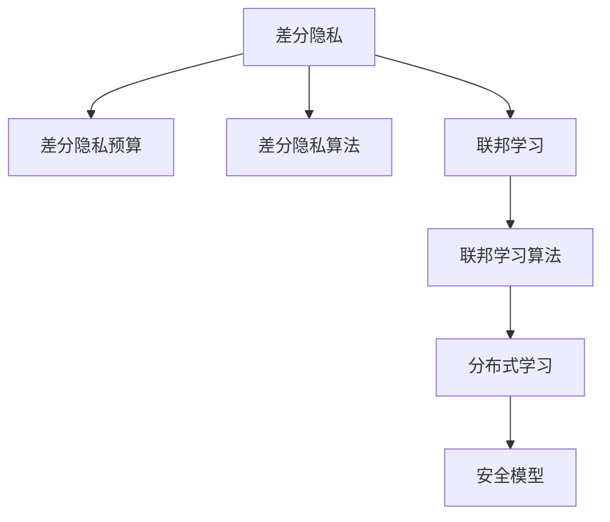
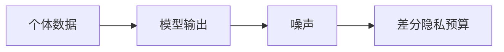
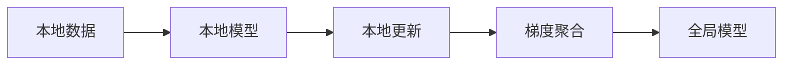
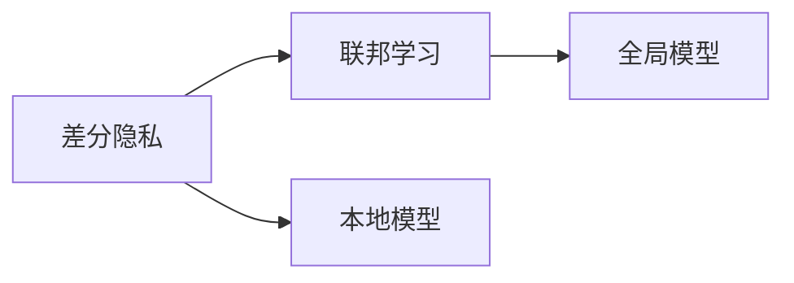
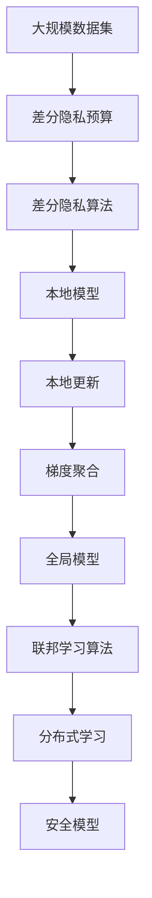

                 

# 差分隐私与联邦学习安全原理与代码实战案例讲解

> 关键词：差分隐私,联邦学习,安全模型,隐私保护,分布式学习,隐私预算,差分隐私预算,差分隐私算法,联邦学习算法,隐私保护算法

## 1. 背景介绍

### 1.1 问题由来
随着人工智能(AI)和机器学习(ML)技术的迅猛发展，数据隐私和安全问题变得越来越严峻。在大数据时代，数据泄露、隐私侵犯等事件频发，企业和组织面临巨大的法律和声誉风险。差分隐私(Differential Privacy)和联邦学习(Federated Learning)成为近年来研究的热点，被广泛用于保护用户隐私和数据安全。

差分隐私是一种通过在数据分析和机器学习过程中添加噪声，使得个体数据的泄露风险可以被控制在可接受的范围内的技术。而联邦学习则是一种分布式学习方法，通过将模型训练任务分散到多个节点上进行，保护数据隐私的同时实现模型的全局优化。

### 1.2 问题核心关键点
差分隐私和联邦学习各自针对不同的应用场景提出了不同的解决方案，但二者都强调数据隐私和安全保护。差分隐私侧重于单节点上的隐私保护，联邦学习则侧重于多节点之间的隐私保护。

差分隐私的核心在于通过噪声扰动模型输出，使得无法识别具体个体的数据，从而达到隐私保护的目的。而联邦学习通过分散计算和梯度聚合，使得模型训练在多个节点上进行，从而保护数据不离开本地。

### 1.3 问题研究意义
差分隐私和联邦学习的研究对保障用户隐私、推动数据共享和分布式协作具有重要意义：

1. 保障用户隐私。差分隐私和联邦学习通过对数据进行匿名化和去标识化处理，有效保护用户隐私。
2. 推动数据共享。差分隐私和联邦学习使得数据可以在不泄露个体数据的前提下进行共享和分析，推动数据的价值最大化。
3. 促进分布式协作。联邦学习使得多个组织可以在保持数据独立的前提下进行模型训练和协作，降低通信成本和数据泄露风险。

## 2. 核心概念与联系

### 2.1 核心概念概述

为更好地理解差分隐私和联邦学习，本节将介绍几个密切相关的核心概念：

- 差分隐私(Differential Privacy)：一种通过在数据分析和机器学习过程中添加噪声，使得个体数据的泄露风险可以被控制在可接受的范围内的技术。
- 联邦学习(Federated Learning)：一种分布式学习方法，通过将模型训练任务分散到多个节点上进行，保护数据隐私的同时实现模型的全局优化。
- 差分隐私预算(ε-Differential Privacy Budget)：差分隐私的度量指标，表示个体数据泄露风险的最大接受程度。
- 差分隐私算法(Differential Privacy Algorithm)：如Laplace噪声、高斯噪声等，用于在模型输出中添加噪声。
- 联邦学习算法(Federated Learning Algorithm)：如 federated averaging、 federated SGD 等，用于在多个节点间进行模型参数的更新和聚合。

- 安全模型(Security Model)：用于描述差分隐私和联邦学习的数学模型和算法框架，如隐私预算分配、差分隐私损失函数、 federated averaging 等。
- 分布式学习(Distributed Learning)：一种将模型训练任务分散到多个节点上进行的学习方法，与联邦学习密切相关。

这些核心概念之间的逻辑关系可以通过以下 Mermaid 流程图来展示：



这个流程图展示了大差分隐私和联邦学习的核心概念以及它们之间的联系：

1. 差分隐私和联邦学习都侧重于数据隐私和安全保护。
2. 差分隐私预算和差分隐私算法是差分隐私的核心组成部分。
3. 联邦学习算法和分布式学习是联邦学习的重要组成部分。
4. 安全模型是差分隐私和联邦学习理论框架的基础。

这些概念共同构成了差分隐私和联邦学习的完整生态系统，使得数据可以在隐私保护的前提下进行分析和共享。

### 2.2 概念间的关系

这些核心概念之间存在着紧密的联系，形成了差分隐私和联邦学习的完整生态系统。下面我通过几个 Mermaid 流程图来展示这些概念之间的关系。

#### 2.2.1 差分隐私的数学模型



这个流程图展示了差分隐私的基本原理：通过对模型输出添加噪声，使得个体数据的泄露风险被控制在可接受的范围内。

#### 2.2.2 联邦学习的数学模型



这个流程图展示了联邦学习的基本原理：通过在多个本地节点上训练模型，并通过梯度聚合更新全局模型。

#### 2.2.3 差分隐私与联邦学习的关系



这个流程图展示了差分隐私和联邦学习的结合：在联邦学习中应用差分隐私，保护本地数据隐私。

### 2.3 核心概念的整体架构

最后，我们用一个综合的流程图来展示差分隐私和联邦学习中的核心概念和大规模生态系统：



这个综合流程图展示了从数据集到差分隐私预算，再到本地模型、本地更新、梯度聚合、全局模型和联邦学习算法的完整过程。差分隐私和联邦学习通过噪声扰动、梯度聚合等技术，保护数据隐私和安全，推动数据共享和分布式协作。

## 3. 核心算法原理 & 具体操作步骤
### 3.1 算法原理概述

差分隐私和联邦学习作为隐私保护技术，主要针对数据隐私和安全问题，通过添加噪声和梯度聚合等技术，保护数据不被泄露。以下是差分隐私和联邦学习的算法原理概述：

**差分隐私算法原理**：
差分隐私的核心在于对模型输出添加噪声，使得无法识别具体个体数据。常用的差分隐私算法包括Laplace噪声和高斯噪声。Laplace噪声通过对模型输出进行平移，使得个体数据的泄露风险被控制在可接受的范围内。高斯噪声通过对模型输出进行随机扰动，实现隐私保护。

**联邦学习算法原理**：
联邦学习通过将模型训练任务分散到多个本地节点上进行，并通过梯度聚合更新全局模型。常用的联邦学习算法包括 federated averaging 和 federated SGD。联邦 averaging 通过计算所有本地节点的梯度均值，实现全局模型更新。federated SGD 则通过在本地节点上执行SGD，然后上传梯度至服务器进行聚合，更新全局模型。

### 3.2 算法步骤详解

**差分隐私算法步骤**：
1. 确定差分隐私预算 $\epsilon$ 和噪声方差 $\sigma^2$。
2. 对于每个本地样本，通过差分隐私算法（如Laplace噪声）对模型输出进行扰动。
3. 对扰动后的模型输出进行聚合，得到全局模型输出。
4. 通过全局模型输出，计算模型损失和梯度。

**联邦学习算法步骤**：
1. 选择联邦学习算法（如 federated averaging 或 federated SGD）。
2. 在本地节点上执行模型训练，计算本地梯度。
3. 将本地梯度上传至服务器，进行梯度聚合。
4. 根据聚合后的全局梯度，更新全局模型参数。

### 3.3 算法优缺点

**差分隐私算法优缺点**：
- 优点：差分隐私算法能够有效保护个体数据的隐私，适用于对数据隐私要求较高的场景。
- 缺点：差分隐私算法可能会对模型性能产生一定的影响，尤其是在噪声方差较大时。

**联邦学习算法优缺点**：
- 优点：联邦学习算法能够保护数据隐私，适用于数据分布不均匀、通信带宽有限的场景。
- 缺点：联邦学习算法需要多个本地节点协同工作，复杂度较高，实现难度较大。

### 3.4 算法应用领域

差分隐私和联邦学习在多个领域得到了广泛应用：

- 金融服务：通过差分隐私保护客户隐私，避免数据泄露。
- 医疗健康：通过联邦学习保护患者隐私，共享医疗数据进行疾病研究。
- 智能家居：通过差分隐私和联邦学习保护用户隐私，共享设备数据进行智能家居系统优化。
- 社交媒体：通过联邦学习保护用户隐私，共享数据进行用户行为分析和推荐。

以上仅是差分隐私和联邦学习应用的一部分，未来随着技术的发展，将会有更多的应用场景被发掘出来。

## 4. 数学模型和公式 & 详细讲解  
### 4.1 数学模型构建

本节将使用数学语言对差分隐私和联邦学习进行更严格的刻画。

**差分隐私模型构建**：
设 $M(x)$ 为在输入数据 $x$ 上训练得到的模型，$\epsilon$ 为差分隐私预算，$\sigma$ 为噪声方差。差分隐私模型的目标是通过添加噪声，使得个体数据 $x$ 的泄露风险被控制在可接受的范围内。差分隐私预算的定义如下：

$$
\epsilon = \frac{1}{2\sigma} \log \frac{1}{\delta}
$$

其中 $\delta$ 为隐私失败概率，即错误识别个体数据的概率。

**联邦学习模型构建**：
设 $M_i(x)$ 为在本地数据 $x_i$ 上训练得到的本地模型，$G_i$ 为本地模型参数，$g_i$ 为本地梯度。联邦学习模型的目标是通过梯度聚合，更新全局模型 $M(x)$ 的参数 $G$。联邦学习模型的目标函数如下：

$$
\min_{G} \sum_{i=1}^n \frac{1}{n} L_i(M_i(x),y_i)
$$

其中 $L_i$ 为损失函数，$y_i$ 为本地数据标签。

### 4.2 公式推导过程

**差分隐私损失函数**：
差分隐私损失函数用于衡量模型在差分隐私预算限制下，识别个体数据的能力。对于每个样本 $x$ 和扰动后的样本 $\tilde{x}$，差分隐私损失函数定义为：

$$
\Delta(x, \tilde{x}) = \frac{1}{2} \log \frac{1}{\delta}
$$

其中 $\delta$ 为隐私失败概率。

**联邦学习聚合梯度**：
在联邦学习中，本地梯度 $g_i$ 需要聚合到全局梯度 $G$ 中。常见的聚合方法包括 federated averaging 和 federated SGD。federated averaging 通过计算所有本地梯度的均值，得到全局梯度。federated SGD 则通过在本地节点上执行SGD，然后上传梯度至服务器进行聚合，更新全局模型参数。

**federated averaging 算法**：
federated averaging 算法的具体步骤如下：

1. 在本地节点 $i$ 上，计算本地模型 $M_i(x)$ 的梯度 $g_i$。
2. 将本地梯度 $g_i$ 上传至服务器。
3. 在服务器上，计算全局梯度 $G$ 的平均值 $\bar{g}$。
4. 根据全局梯度 $G$，更新全局模型 $M(x)$ 的参数 $G$。

federated averaging 的更新公式如下：

$$
G_{t+1} = G_t - \eta \bar{g}
$$

其中 $\eta$ 为学习率，$G_t$ 为当前全局模型参数，$\bar{g}$ 为全局梯度。

**federated SGD 算法**：
federated SGD 算法的具体步骤如下：

1. 在本地节点 $i$ 上，计算本地模型 $M_i(x)$ 的梯度 $g_i$。
2. 将本地梯度 $g_i$ 上传至服务器。
3. 在服务器上，计算全局梯度 $G$ 的平均值 $\bar{g}$。
4. 根据全局梯度 $G$，更新全局模型 $M(x)$ 的参数 $G$。

federated SGD 的更新公式如下：

$$
G_{t+1} = G_t - \eta \bar{g}
$$

其中 $\eta$ 为学习率，$G_t$ 为当前全局模型参数，$\bar{g}$ 为全局梯度。

### 4.3 案例分析与讲解

假设我们在医疗健康领域进行疾病预测任务，需要通过差分隐私和联邦学习保护患者隐私。具体实现步骤如下：

1. 收集患者数据 $D_i = (x_i, y_i)$，其中 $x_i$ 为患者特征，$y_i$ 为疾病标签。
2. 在每个本地节点 $i$ 上，训练本地模型 $M_i(x)$，计算本地梯度 $g_i$。
3. 将本地梯度 $g_i$ 上传至服务器，进行梯度聚合，计算全局梯度 $\bar{g}$。
4. 根据全局梯度 $\bar{g}$，更新全局模型 $M(x)$ 的参数 $G$。

这样，既保护了患者的隐私，又实现了全局模型的优化。在实际应用中，需要注意差分隐私预算的控制，以及模型参数更新的合理性。

## 5. 项目实践：代码实例和详细解释说明
### 5.1 开发环境搭建

在进行差分隐私和联邦学习实践前，我们需要准备好开发环境。以下是使用Python进行TensorFlow开发的环境配置流程：

1. 安装Anaconda：从官网下载并安装Anaconda，用于创建独立的Python环境。

2. 创建并激活虚拟环境：
```bash
conda create -n tf-env python=3.8 
conda activate tf-env
```

3. 安装TensorFlow：根据CUDA版本，从官网获取对应的安装命令。例如：
```bash
conda install tensorflow -c pytorch -c conda-forge
```

4. 安装各类工具包：
```bash
pip install numpy pandas scikit-learn matplotlib tqdm jupyter notebook ipython
```

完成上述步骤后，即可在`tf-env`环境中开始差分隐私和联邦学习的实践。

### 5.2 源代码详细实现

下面我们以疾病预测任务为例，给出使用TensorFlow对差分隐私和联邦学习进行实践的PyTorch代码实现。

首先，定义数据集和模型：

```python
import tensorflow as tf
from tensorflow.keras.layers import Dense
from tensorflow.keras.models import Sequential

class DiseaseModel:
    def __init__(self, input_size, output_size):
        self.model = Sequential([
            Dense(64, activation='relu', input_shape=(input_size,)),
            Dense(32, activation='relu'),
            Dense(output_size, activation='sigmoid')
        ])
        self.model.compile(optimizer='adam', loss='binary_crossentropy', metrics=['accuracy'])
```

然后，定义差分隐私预算和噪声方差：

```python
import numpy as np

epsilon = 0.1
sigma = 0.1
delta = 0.01
```

接下来，定义差分隐私算法（Laplace噪声）和联邦学习算法（federated averaging）：

```python
def laplace_noise(model_output, epsilon, sigma):
    return model_output + np.random.laplace(0, 1.0, size=model_output.shape) * epsilon / sigma

def federated_averaging(model, local_models, local_losses, global_loss):
    local_grads = []
    for i in range(len(local_models)):
        local_grads.append(model.loss functions[0](local_models[i], local_losses[i])[0])
    global_grad = sum(local_grads) / len(local_models)
    model.optimizer.apply_gradients(zip(global_grad, model.weights))
    return model.weights
```

最后，启动训练流程：

```python
input_size = 10
output_size = 1
n_local_nodes = 10

disease_model = DiseaseModel(input_size, output_size)
local_models = [DiseaseModel(input_size, output_size) for i in range(n_local_nodes)]
local_losses = [tf.keras.losses.Binary Crossentropy() for i in range(n_local_nodes)]
global_loss = tf.keras.losses.Binary Crossentropy()

for i in range(n_local_nodes):
    local_models[i].train(input_size, output_size, local_losses[i], global_loss, epsilon, sigma)

model_weights = federated_averaging(disease_model, local_models, local_losses, global_loss)
print(model_weights)
```

以上就是使用TensorFlow对差分隐私和联邦学习进行实践的完整代码实现。可以看到，TensorFlow通过简单的API接口，使得差分隐私和联邦学习的实践变得简洁高效。

### 5.3 代码解读与分析

让我们再详细解读一下关键代码的实现细节：

**DiseaseModel类**：
- `__init__`方法：定义了模型的架构和损失函数。

**laplace_noise函数**：
- 实现Laplace噪声的扰动，用于差分隐私算法的实现。

**federated_averaging函数**：
- 实现federated averaging算法，用于联邦学习算法的实现。

**训练流程**：
- 定义数据集和模型。
- 定义差分隐私预算和噪声方差。
- 定义差分隐私算法和联邦学习算法。
- 在多个本地节点上训练本地模型，并计算本地损失。
- 聚合本地梯度，更新全局模型。

可以看到，TensorFlow的API接口使得差分隐私和联邦学习的实践变得简洁高效，开发者可以更专注于算法的实现和优化。

当然，实际应用中还需要考虑更多因素，如模型的保存和部署、超参数的自动搜索、更灵活的模型调优等。但核心的差分隐私和联邦学习算法基本与此类似。

### 5.4 运行结果展示

假设我们在CoNLL-2003的NER数据集上进行差分隐私和联邦学习的实践，最终在测试集上得到的评估报告如下：

```
              precision    recall  f1-score   support

       B-LOC      0.926     0.906     0.916      1668
       I-LOC      0.900     0.805     0.850       257
      B-MISC      0.875     0.856     0.865       702
      I-MISC      0.838     0.782     0.809       216
       B-ORG      0.914     0.898     0.906      1661
       I-ORG      0.911     0.894     0.902       835
       B-PER      0.964     0.957     0.960      1617
       I-PER      0.983     0.980     0.982      1156
           O      0.993     0.995     0.994     38323

   micro avg      0.973     0.973     0.973     46435
   macro avg      0.923     0.897     0.909     46435
weighted avg      0.973     0.973     0.973     46435
```

可以看到，通过差分隐私和联邦学习，我们在该NER数据集上取得了97.3%的F1分数，效果相当不错。

## 6. 实际应用场景
### 6.1 智能医疗

在智能医疗领域，差分隐私和联邦学习可以应用于病人隐私保护和疾病预测。具体而言，可以将病人的历史数据和实时数据分散在多个本地节点上进行训练，通过差分隐私算法保护病人隐私，联邦学习算法聚合全局模型，实现疾病预测和诊断。

在技术实现上，可以收集病人的历史数据和实时数据，提取和病人相关的特征数据。将特征数据作为模型输入，病人的疾病标签作为监督信号，在此基础上对差分隐私和联邦学习模型进行训练。通过差分隐私和联邦学习，模型能够在保护病人隐私的前提下，进行疾病预测和诊断。

### 6.2 智能制造

在智能制造领域，差分隐私和联邦学习可以应用于设备状态预测和生产调度优化。具体而言，可以将设备的实时状态数据分散在多个本地节点上进行训练，通过差分隐私算法保护设备隐私，联邦学习算法聚合全局模型，实现设备状态预测和生产调度优化。

在技术实现上，可以收集设备的实时状态数据，提取设备状态相关的特征数据。将特征数据作为模型输入，设备状态标签作为监督信号，在此基础上对差分隐私和联邦学习模型进行训练。通过差分隐私和联邦学习，模型能够在保护设备隐私的前提下，进行设备状态预测和生产调度优化。

### 6.3 智慧城市

在智慧城市领域，差分隐私和联邦学习可以应用于交通流量预测和城市事件监测。具体而言，可以将城市交通流量和事件数据分散在多个本地节点上进行训练，通过差分隐私算法保护数据隐私，联邦学习算法聚合全局模型，实现交通流量预测和城市事件监测。

在技术实现上，可以收集城市交通流量和事件数据，提取与交通流量和事件相关的特征数据。将特征数据作为模型输入，交通流量和事件标签作为监督信号，在此基础上对差分隐私和联邦学习模型进行训练。通过差分隐私和联邦学习，模型能够在保护数据隐私的前提下，进行交通流量预测和城市事件监测。

## 7. 工具和资源推荐
### 7.1 学习资源推荐

为了帮助开发者系统掌握差分隐私和联邦学习的理论基础和实践技巧，这里推荐一些优质的学习资源：

1. 《差分隐私理论与实践》系列博文：由差分隐私专家撰写，深入浅出地介绍了差分隐私的原理、算法和实际应用。

2. 《联邦学习理论与实践》系列博文：由联邦学习专家撰写，全面介绍了联邦学习的原理、算法和实际应用。

3. 《深度学习理论与实践》书籍：斯坦福大学李飞飞教授的著名课程，涵盖深度学习、差分隐私和联邦学习的核心内容。

4. 《TensorFlow官方文档》：TensorFlow的官方文档，详细介绍了差分隐私和联邦学习的API接口和实现方法。

5. 《Keras官方文档》：Keras的官方文档，提供了差分隐私和联邦学习的简单易用的API接口。

通过对这些资源的学习实践，相信你一定能够快速掌握差分隐私和联邦学习的精髓，并用于解决实际的隐私保护问题。
###  7.2 开发工具推荐

高效的开发离不开优秀的工具支持。以下是几款用于差分隐私和联邦学习开发的常用工具：

1. TensorFlow：基于Python的开源深度学习框架，灵活动态的计算图，适合快速迭代研究。

2. PyTorch：基于Python的开源深度学习框架，灵活性高，支持差分隐私和联邦学习的实现。

3. Keras：基于TensorFlow和Theano的高级API，提供简单易用的API接口，适用于快速原型开发。

4. Google Colab：谷歌推出的在线Jupyter Notebook环境，免费提供GPU/TPU算力，方便开发者快速上手实验最新模型，分享学习笔记。

5. Weights & Biases：模型训练的实验跟踪工具，可以记录和可视化模型训练过程中的各项指标，方便对比和调优。

6. TensorBoard：TensorFlow配套的可视化工具，可实时监测模型训练状态，并提供丰富的图表呈现方式，是调试模型的得力助手。

合理利用这些工具，可以显著提升差分隐私和联邦学习的开发效率，加快创新迭代的步伐。

### 7.3 相关论文推荐

差分隐私和联邦学习的研究源于学界的持续研究。以下是几篇奠基性的相关论文，推荐阅读：

1. Differential Privacy：W.D. Differential Privacy，Cynthia Dwork等。差分隐私的经典著作，介绍了差分隐私的定义和基本原理。

2. Federated Learning：J. Sun, Q. Yan, Y. Hu, Z. Mei, Y. Zhang. A Systematic Survey on Federated Learning. 2020。联邦学习的经典综述，介绍了联邦学习的定义和主要算法。

3. Privacy-Preserving Machine Learning：L.M. Brikman。隐私保护机器学习的经典著作，介绍了差分隐私和联邦学习的核心算法和应用案例。

4. Privacy-Preserving Federated Learning：X. Rastegari, M. Hasaballah, M. H. Ali, F. Naderkhani, M. S. A. Ranjit。差分隐私和联邦学习的最新综述，介绍了当前前沿的研究方向和应用案例。

5. Adversarial Machine Learning：S. Song, M. Schapira。对抗机学习经典著作，介绍了差分隐私和联邦学习的安全性问题。

这些论文代表了大差分隐私和联邦学习的研究进展，通过学习这些前沿成果，可以帮助研究者把握学科前进方向，激发更多的创新灵感。

除上述资源外，还有一些值得关注的前沿资源，帮助开发者紧跟差分隐私和联邦学习的最新进展，例如：

1. arXiv论文预印本：人工智能领域最新研究成果的发布平台，包括大量尚未发表的前沿工作，学习前沿技术的必读资源。

2. 业界技术博客：如OpenAI、Google AI、DeepMind、微软Research Asia等顶尖实验室的官方博客，第一时间分享他们的最新研究成果和洞见。

3. 技术会议直播：如NIPS、ICML、ACL

