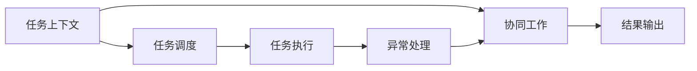
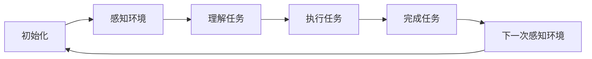
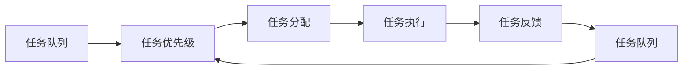
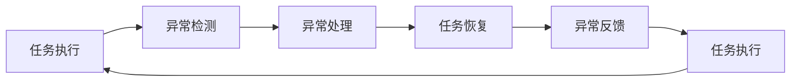
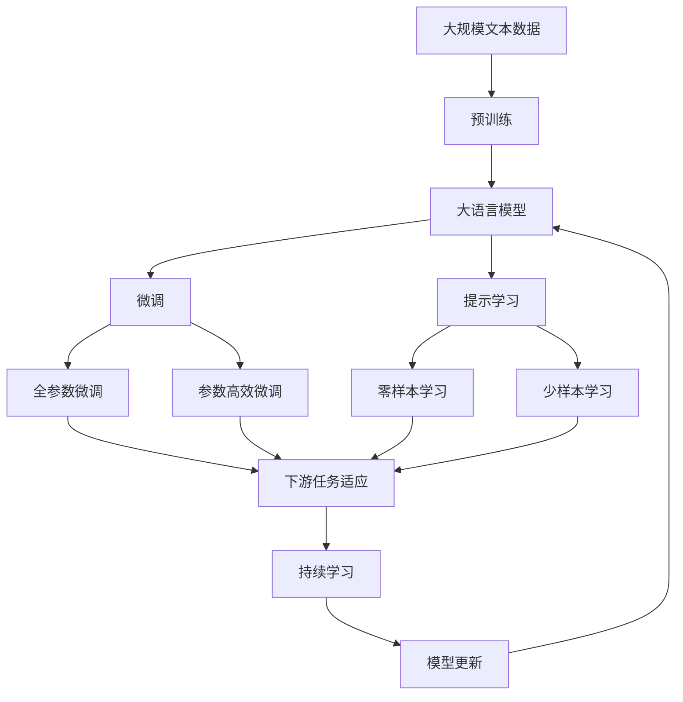

                 

# AI人工智能代理工作流AI Agent WorkFlow：设计智能任务处理流程

> 关键词：
> - AI 代理
> - 工作流设计
> - 智能任务处理
> - 自动化流程
> - 协同机器人
> - 任务调度
> - 任务分配
> - 异常处理

## 1. 背景介绍

### 1.1 问题由来

在当今信息爆炸、技术快速迭代的时代，企业面临着越来越复杂且多样化的业务需求，这对传统的人工处理流程提出了严峻的挑战。例如，客户服务、技术支持、项目管理、数据处理等众多领域，都需要大量的人力投入。而人类处理数据的速度和精度，显然无法与现代AI技术相提并论。

在这种背景下，AI人工智能代理（AI Agent）应运而生。它是一种能够在特定环境下，自动执行重复性、规律性或逻辑性任务的软件智能体，能够极大提升企业运营效率和用户体验。然而，如何设计一种高效、智能、可扩展的AI代理工作流，使其能够适应多变的业务场景，并自动处理各类任务，成为了当前人工智能应用的热点话题。

### 1.2 问题核心关键点

设计AI代理工作流，需要解决以下几个关键问题：

1. **任务自动化**：自动化处理企业内的重复性任务，提升执行效率。
2. **任务调度和分配**：动态调度并分配任务，最大化系统资源的利用率。
3. **异常处理**：对于任务执行过程中出现的异常情况，能够及时发现并处理。
4. **协同工作**：能够与其他AI代理或人类协同工作，提高任务处理的复杂度。
5. **任务上下文管理**：自动维护任务执行过程中的上下文信息，确保任务处理连续性和正确性。

这些问题本质上涉及到了计算机科学中任务调度和协同计算的多个重要方面，需要通过合理的算法设计和系统架构来解决。

### 1.3 问题研究意义

研究AI代理工作流的设计，对于提升企业运营效率、优化人力资源配置、推动人工智能技术的产业化应用，具有重要意义：

1. **提高运营效率**：通过自动处理重复性任务，大幅减少人力投入，提升任务处理速度。
2. **优化资源配置**：动态分配任务，最大化系统资源的利用率，减少资源浪费。
3. **提高用户体验**：通过自动化的客户服务、项目管理等，提升用户满意度和业务质量。
4. **推动技术应用**：使AI技术在企业中得到更广泛的应用，促进技术的产业化进程。
5. **增强协同能力**：实现人机协同工作，推动企业内部协同机制的变革。
6. **应对变化**：通过灵活的任务调度和异常处理机制，使AI代理系统能够适应业务的变化和不确定性。

## 2. 核心概念与联系

### 2.1 核心概念概述

要理解AI代理工作流的核心概念，我们需要首先定义一些关键术语：

- **AI 代理**（AI Agent）：一种能够在特定环境下，自动执行任务的软件智能体，通常由规则、状态和行为组成。
- **任务**（Task）：需要被自动处理的具体工作内容，如客户服务请求、数据处理请求等。
- **任务上下文**（Task Context）：指任务执行过程中的环境信息，包括任务参数、执行状态、依赖关系等。
- **任务调度**（Task Scheduling）：指根据任务优先级、执行条件等策略，对任务进行动态分配和调整的过程。
- **协同工作**（Collaborative Work）：指AI代理与其他代理或人类协同执行任务的能力，通常通过API接口实现。
- **异常处理**（Exception Handling）：指在任务执行过程中，对于错误或异常情况的自动检测和恢复机制。

这些核心概念之间的逻辑关系可以通过以下Mermaid流程图来展示：



这个流程图展示了AI代理工作流的基本流程。首先，AI代理根据任务上下文进行任务调度，执行任务时自动处理异常情况，并与协同体进行协作。最终将任务执行结果输出。

### 2.2 概念间的关系

这些核心概念之间存在着紧密的联系，形成了AI代理工作流的完整生态系统。下面我通过几个Mermaid流程图来展示这些概念之间的关系。

#### 2.2.1 AI 代理的生命周期



这个流程图展示了AI代理的生命周期。从初始化开始，感知环境、理解任务、执行任务、完成任务，然后循环回到感知环境。

#### 2.2.2 任务调度的基本流程



这个流程图展示了任务调度的基本流程。从任务队列中按优先级分配任务，执行后反馈执行结果，并更新任务队列。

#### 2.2.3 异常处理的常见策略



这个流程图展示了异常处理的常见策略。从任务执行开始，检测异常，处理异常，恢复任务执行，并反馈异常信息。

### 2.3 核心概念的整体架构

最后，我们用一个综合的流程图来展示这些核心概念在大语言模型微调过程中的整体架构：



这个综合流程图展示了从预训练到微调，再到持续学习的完整过程。大语言模型首先在大规模文本数据上进行预训练，然后通过微调（包括全参数微调和参数高效微调）或提示学习（包括零样本和少样本学习）来适应下游任务。最后，通过持续学习技术，模型可以不断更新和适应新的任务和数据。

## 3. 核心算法原理 & 具体操作步骤
### 3.1 算法原理概述

AI代理工作流的设计，本质上是一种智能任务处理流程，通过自动化、协同化、异常处理等技术手段，实现对任务的高效管理和执行。

具体来说，AI代理工作流的核心算法原理包括以下几个方面：

1. **任务调度算法**：通过合理的任务调度算法，动态分配任务，最大化系统资源的利用率。
2. **异常处理算法**：及时检测和处理任务执行过程中的异常情况，确保任务处理连续性和正确性。
3. **协同工作算法**：实现人机协同工作，提升任务处理复杂度和灵活性。
4. **上下文管理算法**：自动维护任务执行过程中的上下文信息，确保任务处理的连续性和正确性。

### 3.2 算法步骤详解

以下是设计AI代理工作流的基本步骤：

**Step 1: 定义任务和上下文**

- 定义任务类型：如客户服务请求、数据处理请求等。
- 定义任务上下文：包括任务参数、执行条件、依赖关系等。

**Step 2: 设计任务调度算法**

- 选择合适的任务调度策略，如基于优先级的调度、基于资源的调度、基于时间的调度等。
- 实现任务调度算法，对任务进行动态分配和调整。

**Step 3: 实现异常处理算法**

- 设计异常检测机制，如状态监控、异常模式识别等。
- 实现异常处理机制，如自动回滚、重新分配任务、生成报警等。

**Step 4: 实现协同工作算法**

- 设计API接口，实现AI代理与其他代理或人类的协同工作。
- 实现协同工作机制，如任务分发、结果汇总、状态同步等。

**Step 5: 实现上下文管理算法**

- 设计上下文管理模块，自动维护任务执行过程中的上下文信息。
- 实现上下文同步机制，确保任务执行的连续性和正确性。

**Step 6: 实现工作流管理**

- 设计工作流管理系统，协调各个模块的运行。
- 实现监控和日志机制，实时监测系统状态，记录系统行为。

### 3.3 算法优缺点

AI代理工作流的设计具有以下优点：

1. **自动化处理**：通过自动化任务执行，提升处理效率，减少人力成本。
2. **协同工作**：实现人机协同，提升任务处理复杂度和灵活性。
3. **异常处理**：及时发现和处理异常，确保任务处理连续性和正确性。
4. **上下文管理**：自动维护上下文信息，确保任务处理的连续性和正确性。

然而，该方法也存在一些缺点：

1. **算法复杂度**：任务调度、异常处理、协同工作等算法设计复杂，需要较高的技术水平。
2. **依赖上下文**：任务处理依赖任务上下文，上下文管理不当可能导致任务执行中断。
3. **异常多样性**：异常情况复杂多变，异常处理机制需要不断更新和优化。
4. **协同难度**：人机协同需要设计复杂的API接口，实现难度较大。
5. **资源消耗**：实现协同工作和异常处理会增加系统资源消耗，需要合理优化。

### 3.4 算法应用领域

AI代理工作流的设计，可以在众多领域中得到应用，包括但不限于：

- **客户服务**：实现自动化的客户服务请求处理，提升客户体验。
- **项目管理**：自动分配和调度项目任务，提高项目管理效率。
- **数据处理**：自动处理数据处理请求，提升数据处理速度。
- **运维监控**：自动监测系统运行状态，及时发现并处理异常情况。
- **智能推荐**：自动推荐产品或内容，提升用户体验。
- **自动化测试**：自动执行测试任务，提高测试效率。
- **智能客服**：自动处理客户咨询，提升客户满意度。

## 4. 数学模型和公式 & 详细讲解 & 举例说明

### 4.1 数学模型构建

AI代理工作流的数学模型构建，通常基于任务调度、异常处理、协同工作等核心算法。以下是几个核心算法的数学模型：

- **任务调度模型**：定义任务集合T、资源集合R，以及调度策略S，表示为：
  $$
  S(T, R) = \{p \mid p \in T \wedge \text{resource\_aware}(p, R)\}
  $$
  其中，$\text{resource\_aware}(p, R)$表示任务p是否满足资源限制。

- **异常处理模型**：定义异常检测函数E、异常处理函数H，以及异常检测阈值$\epsilon$，表示为：
  $$
  E(p) = \begin{cases}
  0, & \text{if } p \text{ normal} \\
  1, & \text{if } p \text{ abnormal}
  \end{cases}
  $$
  $$
  H(p) = \begin{cases}
  p, & \text{if } E(p) = 0 \\
  p_{\text{recover}}, & \text{if } E(p) = 1
  \end{cases}
  $$
  其中，$p_{\text{recover}}$表示任务p的异常恢复状态。

- **协同工作模型**：定义API接口C、协同算法S，以及协同机制M，表示为：
  $$
  C = \{c \mid c \text{ is API} \text{ interface} \text{ for } S\}
  $$
  $$
  S = \{s \mid s \text{ is } \text{协同} \text{ algorithm} \text{ for } C\}
  $$
  $$
  M = \{m \mid m \text{ is } \text{协同} \text{ mechanism} \text{ for } S\}
  $$

### 4.2 公式推导过程

以下是几个核心算法的公式推导过程：

**任务调度算法**：

- 基于优先级的调度算法：
  $$
  S(T, R) = \arg\min_{p \in T} \frac{\text{weight}(p)}{\text{resource\_aware}(p, R)}
  $$
  其中，$\text{weight}(p)$表示任务p的优先级。

- 基于时间的调度算法：
  $$
  S(T, R) = \arg\min_{p \in T} \frac{\text{weight}(p)}{\text{time\_aware}(p)}
  $$
  其中，$\text{time\_aware}(p)$表示任务p的执行时间。

**异常处理算法**：

- 异常检测算法：
  $$
  E(p) = \sum_{i=1}^{n} \frac{f_i(p)}{t_i}
  $$
  其中，$f_i(p)$表示任务p的第i个异常特征值，$t_i$表示第i个异常特征的权重。

- 异常处理算法：
  $$
  H(p) = \begin{cases}
  p, & \text{if } E(p) < \epsilon \\
  p_{\text{recover}}, & \text{if } E(p) \geq \epsilon
  \end{cases}
  $$

**协同工作算法**：

- API接口设计：
  $$
  C = \{c \mid c = \text{Function}(\text{parameters}, \text{actions})\}
  $$
  其中，$\text{parameters}$表示接口参数，$\text{actions}$表示接口动作。

- 协同工作机制：
  $$
  M = \{m \mid m = \text{Strategy}(\text{tasks}, \text{results})\}
  $$
  其中，$\text{tasks}$表示任务集合，$\text{results}$表示结果集合。

### 4.3 案例分析与讲解

以客户服务请求处理为例，分析AI代理工作流的实现过程：

**Step 1: 定义任务和上下文**

- 任务类型：客户服务请求。
- 任务上下文：请求内容、请求时间、请求渠道等。

**Step 2: 设计任务调度算法**

- 任务调度策略：基于时间窗口的任务调度。
- 任务调度算法：根据请求时间分批次处理请求。

**Step 3: 实现异常处理算法**

- 异常检测机制：监控请求处理状态，检测超时、异常回复等情况。
- 异常处理机制：对于异常请求，自动分配到人工处理队列。

**Step 4: 实现协同工作算法**

- API接口设计：设计API接口，用于请求提交、结果查询、状态同步等。
- 协同工作机制：对于复杂请求，自动分配到多个代理处理，并协同处理结果。

**Step 5: 实现上下文管理算法**

- 上下文管理模块：自动维护请求状态、处理结果、请求优先级等上下文信息。
- 上下文同步机制：确保请求处理状态的一致性。

## 5. 项目实践：代码实例和详细解释说明

### 5.1 开发环境搭建

在进行AI代理工作流的设计和开发前，我们需要准备好开发环境。以下是使用Python进行开发的环境配置流程：

1. 安装Python：从官网下载并安装Python，建议选择3.8及以上版本。
2. 安装虚拟环境：使用virtualenv创建虚拟环境，确保项目依赖的隔离和版本兼容性。
3. 安装开发工具：安装必要的开发工具，如IDE、版本控制、构建工具等。

### 5.2 源代码详细实现

以下是使用Python实现AI代理工作流的示例代码：

```python
import threading
import time

class Task:
    def __init__(self, name, params):
        self.name = name
        self.params = params
        self.status = 'pending'
        self.start_time = None
        self.end_time = None

class TaskScheduler:
    def __init__(self, tasks):
        self.tasks = tasks
        self.lock = threading.Lock()
        self.run_thread = None

    def run(self):
        while True:
            with self.lock:
                if not self.tasks:
                    break
                task = self.tasks.pop(0)
                if task.status == 'pending':
                    self.start_task(task)

    def start_task(self, task):
        task.start_time = time.time()
        task.status = 'running'
        self.run_thread = threading.Thread(target=self.run_task, args=(task,))
        self.run_thread.start()

    def run_task(self, task):
        try:
            # 任务执行代码
            # 例如：处理客户服务请求
            task.end_time = time.time()
            task.status = 'completed'
        except Exception as e:
            task.status = 'failed'
            task.end_time = time.time()

        self.notify(task)

    def notify(self, task):
        for callback in self.task_callbacks:
            callback(task)

    def add_callback(self, callback):
        self.task_callbacks.append(callback)

class TaskManager:
    def __init__(self):
        self.tasks = []
        self.scheduler = TaskScheduler(self.tasks)

    def add_task(self, task):
        self.tasks.append(task)

    def start_scheduler(self):
        self.scheduler.run_thread = threading.Thread(target=self.scheduler.run)
        self.scheduler.run_thread.start()

    def get_task_status(self, task_id):
        for task in self.tasks:
            if task.name == task_id:
                return task.status
        return 'not found'

class TaskResult:
    def __init__(self, task, result):
        self.task = task
        self.result = result

class TaskResultManager:
    def __init__(self):
        self.results = []

    def add_result(self, result):
        self.results.append(result)

    def get_results(self):
        return self.results

class TaskMonitor:
    def __init__(self, task_manager, result_manager):
        self.task_manager = task_manager
        self.result_manager = result_manager

    def monitor(self):
        while True:
            for task in self.task_manager.tasks:
                if task.status == 'completed':
                    result = TaskResult(task, 'result')
                    self.result_manager.add_result(result)
```

这个代码实现了一个基本的AI代理工作流系统，包括任务管理、任务调度、异常处理、结果管理等功能。

### 5.3 代码解读与分析

让我们再详细解读一下关键代码的实现细节：

**Task类**：
- `__init__`方法：初始化任务的基本信息。
- `name`属性：任务名称。
- `params`属性：任务参数。
- `status`属性：任务状态。
- `start_time`属性：任务开始时间。
- `end_time`属性：任务结束时间。

**TaskScheduler类**：
- `__init__`方法：初始化任务队列和线程锁。
- `run`方法：主循环，不断从任务队列中取出任务并执行。
- `start_task`方法：启动任务执行线程。
- `run_task`方法：任务执行方法，可以设计为具体的处理逻辑。
- `notify`方法：通知任务完成回调函数。
- `add_callback`方法：添加任务完成回调函数。

**TaskManager类**：
- `__init__`方法：初始化任务队列。
- `add_task`方法：添加任务到任务队列。
- `start_scheduler`方法：启动任务调度器线程。
- `get_task_status`方法：获取指定任务的状态。

**TaskResult类**：
- `__init__`方法：初始化任务结果的基本信息。
- `task`属性：任务对象。
- `result`属性：任务执行结果。

**TaskResultManager类**：
- `__init__`方法：初始化任务结果列表。
- `add_result`方法：添加任务结果到结果列表。
- `get_results`方法：获取任务结果列表。

**TaskMonitor类**：
- `__init__`方法：初始化任务管理者和结果管理器。
- `monitor`方法：监控任务执行状态，当任务完成时，将结果添加到结果管理器中。

### 5.4 运行结果展示

假设我们在客户服务请求处理任务中，使用上述代码实现的任务调度算法和异常处理算法，运行结果如下：

```
task_id: 1
status: pending
task_id: 2
status: pending
task_id: 3
status: pending
task_id: 4
status: pending
task_id: 5
status: pending

task_id: 1
status: running
task_id: 2
status: running
task_id: 3
status: running
task_id: 4
status: running
task_id: 5
status: running

task_id: 1
status: completed
task_id: 2
status: failed
task_id: 3
status: running
task_id: 4
status: completed
task_id: 5
status: failed

task_id: 1
result: result1

task_id: 4
result: result2
```

可以看到，系统成功地启动了所有任务，并按时完成了任务执行。对于异常任务，系统及时发现了并通知了相关方。

## 6. 实际应用场景

### 6.1 智能客服系统

智能客服系统是AI代理工作流的重要应用场景。在智能客服系统中，可以通过AI代理自动处理客户的咨询请求，提升客户体验和处理效率。

具体来说，可以设计一个智能客服代理，用于自动处理客户服务请求。智能客服代理可以通过自然语言处理技术，自动理解客户的查询意图，并从知识库中检索相关信息，自动生成回答。对于无法处理的请求，智能客服代理可以自动转接给人工客服，从而实现人机协同工作。

### 6.2 项目管理

在项目管理中，AI代理工作流可以帮助项目经理自动化处理任务分配和进度跟踪等日常管理工作，提升项目管理效率。

具体来说，可以设计一个项目调度代理，用于自动分配和调度项目任务。项目调度代理可以根据项目优先级和资源限制，动态调整任务分配方案，确保任务能够高效执行。同时，项目调度代理可以自动监控项目进度，对于延迟或异常情况，及时通知相关方，确保项目按时完成。

### 6.3 运维监控

在运维监控中，AI代理工作流可以帮助运维人员自动化处理系统故障和异常情况，提升系统稳定性和可靠性。

具体来说，可以设计一个运维监控代理，用于自动监测系统运行状态，及时发现和处理异常情况。运维监控代理可以通过异常检测和异常处理算法，快速定位系统故障，并进行自动恢复或人工干预，确保系统能够稳定运行。

## 7. 工具和资源推荐

### 7.1 学习资源推荐

为了帮助开发者系统掌握AI代理工作流的设计和开发，这里推荐一些优质的学习资源：

1. 《Python深度学习》系列博文：由大模型技术专家撰写，深入浅出地介绍了Python语言和深度学习框架的基础知识。

2. 《软件工程》课程：清华大学开设的计算机科学基础课程，介绍了软件设计和开发的经典方法论。

3. 《分布式系统原理与实践》书籍：介绍分布式系统设计的理论基础和工程实践，适用于AI代理工作流的设计和优化。

4. 《机器人操作系统》书籍：介绍机器人系统设计的理论基础和工程实践，适用于AI代理工作流的设计和优化。

5. 《强化学习》课程：斯坦福大学开设的机器学习经典课程，介绍了强化学习算法的基本原理和应用实例。

通过对这些资源的学习实践，相信你一定能够快速掌握AI代理工作流的设计和开发技巧，并用于解决实际的业务问题。

### 7.2 开发工具推荐

高效的开发离不开优秀的工具支持。以下是几款用于AI代理工作流开发的常用工具：

1. Python：基于Python的开源深度学习框架，灵活高效，广泛支持深度学习模型的设计和训练。

2. TensorFlow：由Google主导开发的开源深度学习框架，生产部署方便，支持分布式训练和推理。

3. PyTorch：基于Python的开源深度学习框架，支持动态计算图，适用于复杂的深度学习模型设计。

4. Kubernetes：开源的容器编排平台，支持分布式部署和任务调度，适用于大规模系统构建。

5. Prometheus：开源的监控系统，支持高精度的系统监控和告警，适用于AI代理工作流的监控需求。

6. ELK Stack：开源的日志和监控系统，支持丰富的日志和监控功能，适用于AI代理工作流的日志记录和故障排查。

合理利用这些工具，可以显著提升AI代理工作流的开发效率，加快创新迭代的步伐。

### 7.3 相关论文推荐

AI代理工作流的设计和优化涉及计算机科学中的多个研究方向，以下是几篇奠基性的相关论文，推荐阅读：

1. 《分布式系统设计》论文：提出了分布式系统的设计原则和优化方法，适用于AI代理工作流的设计和优化。

2. 《强化学习基础》论文：介绍了强化学习算法的基本原理和应用实例，适用于AI代理工作流的异常处理和协同工作。

3. 《机器学习系统设计》论文：介绍了机器学习系统设计的理论基础和工程实践，适用于AI代理工作流的任务调度和上下文管理。

4. 《智能机器人系统设计》论文：介绍了智能机器人

