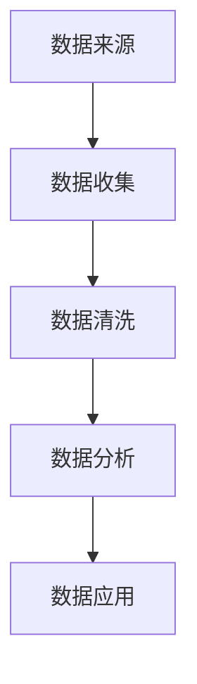

                 

# AI创业中的数据积累与应用

## 1. 背景介绍

### 1.1 问题由来

在当前快速发展的科技创新浪潮中，人工智能（AI）技术的渗透和应用已经成为推动各行各业转型升级的重要驱动力。AI创业项目，尤其是那些基于深度学习和数据分析的智能应用，依赖于大规模高质量的数据作为其核心资源。数据积累与应用直接关系到AI产品的市场竞争力与创新能力。然而，数据收集、清洗、存储和利用是一个复杂且劳动密集的过程，对于AI创业者来说，往往面临巨大挑战。

### 1.2 问题核心关键点

AI创业中数据积累与应用的核心问题包括：

- 数据来源与收集：如何在合法合规的前提下，高效地获取海量数据。
- 数据清洗与处理：如何处理噪声数据，保证数据质量。
- 数据存储与管理：如何构建可扩展、安全的数据存储解决方案。
- 数据分析与应用：如何通过机器学习、深度学习等技术，从数据中挖掘有价值的信息。

### 1.3 问题研究意义

对于AI创业者而言，理解并掌握数据积累与应用的策略和工具，不仅能大大提高工作效率，还能有效提升产品的性能与用户体验。因此，探讨AI创业中数据积累与应用的最佳实践具有重要的理论价值和实际意义。

## 2. 核心概念与联系

### 2.1 核心概念概述

为更好地理解AI创业中的数据积累与应用，我们首先需要明确几个核心概念：

- **数据积累**：指通过各种手段和方法，收集并存储大量原始数据以供后续分析与使用的过程。数据来源可以包括公开数据集、API接口、第三方数据提供商等。
- **数据清洗**：指对收集到的数据进行预处理，去除噪声、修正错误、填补缺失值等，以保证数据的质量与一致性。
- **数据分析**：指利用统计学、机器学习等方法，对数据进行分析和建模，提取有价值的信息。
- **数据应用**：指将分析结果应用于实际业务场景，提升产品性能、优化用户体验，或驱动商业决策。

这些概念之间相互关联，共同构成了AI创业中数据积累与应用的完整流程。

### 2.2 概念间的关系

这些核心概念之间存在密切联系，主要体现在以下几个方面：

- **数据积累是数据分析与应用的基础**。没有高质量的数据积累，数据分析与应用将缺乏依据，难以产生有意义的输出。
- **数据清洗是数据质量保证的关键**。有效的数据清洗能够减少噪声，提升数据的可用性，为后续分析打下良好基础。
- **数据分析是数据应用的前提**。通过数据分析，能够挖掘数据的潜在价值，为产品设计、性能优化等提供支持。
- **数据应用是数据分析价值的体现**。数据分析的最终目的是指导产品设计、提高用户体验，或辅助商业决策，实现数据价值的最大化。

### 2.3 核心概念的整体架构

以下是一个综合的流程图，展示了数据积累与应用的整体架构：



这个流程图展示了数据积累与应用的完整流程：首先从各种来源收集数据，然后对数据进行清洗，接着进行数据分析，最后应用于实际业务中。

## 3. 核心算法原理 & 具体操作步骤

### 3.1 算法原理概述

AI创业中数据积累与应用的核心算法包括数据收集、数据清洗和数据分析等。这些算法通常基于机器学习、深度学习等技术，通过构建模型对数据进行处理与分析，最终实现数据的价值挖掘与应用。

### 3.2 算法步骤详解

#### 3.2.1 数据收集

数据收集是数据积累的第一步，主要通过以下几种方式进行：

1. **公开数据集**：如Kaggle、UCI等数据平台提供了大量公开数据集，可以方便地获取所需数据。
2. **API接口**：许多网站和应用提供了数据接口，可以通过编程方式获取数据。
3. **第三方数据提供商**：如Google Analytics、Alibaba Data Market等，可以订阅或购买数据服务。
4. **爬虫技术**：使用Web爬虫技术，从互联网抓取公开数据。

#### 3.2.2 数据清洗

数据清洗是保证数据质量的关键步骤，主要包括以下几个方面：

1. **缺失值处理**：通过插值、删除、生成新数据等方式填补或删除缺失值。
2. **噪声过滤**：识别并去除数据中的噪声、异常值等，保持数据的一致性。
3. **数据格式转换**：将数据转换为适合分析的格式，如时间序列数据转化为日期格式。
4. **特征工程**：构造新的特征变量，增强数据的表达能力。

#### 3.2.3 数据分析

数据分析是数据价值的挖掘过程，主要通过以下几种方法进行：

1. **描述性统计分析**：计算均值、方差、标准差等统计量，描述数据的基本特征。
2. **机器学习模型**：使用回归、分类、聚类等模型对数据进行建模与预测。
3. **深度学习模型**：使用神经网络等深度学习模型，提取数据中的高级特征。

#### 3.2.4 数据应用

数据应用是将分析结果转化为具体应用的过程，主要包括以下几个方面：

1. **产品设计**：根据分析结果，优化产品功能、界面、用户体验等。
2. **性能优化**：使用分析结果优化系统性能，如推荐算法、预测模型等。
3. **决策支持**：通过数据分析，辅助商业决策，提升业务效率。

### 3.3 算法优缺点

#### 3.3.1 优点

数据积累与应用的核心算法具有以下优点：

- **高效性**：自动化处理大量数据，提升工作效率。
- **灵活性**：可以灵活地应用各种算法，适应不同业务需求。
- **准确性**：通过机器学习模型，能够提升数据处理的准确性。

#### 3.3.2 缺点

这些算法也存在一些局限性：

- **依赖高质量数据**：算法效果高度依赖数据质量，数据清洗和预处理需耗费大量时间与精力。
- **复杂性**：一些复杂算法需要较高的技术门槛，对开发者要求较高。
- **数据隐私问题**：在处理敏感数据时，需考虑数据隐私和合规问题。

### 3.4 算法应用领域

数据积累与应用的核心算法在多个领域得到了广泛应用，包括但不限于：

- **金融科技**：使用数据分析模型进行风险评估、信用评分、反欺诈等。
- **医疗健康**：通过机器学习模型预测疾病风险、辅助诊断等。
- **电商零售**：利用数据分析提升推荐系统、库存管理、客户服务等。
- **智能制造**：使用大数据分析优化生产流程、提高设备利用率等。
- **智慧城市**：通过数据分析优化交通管理、环境监测、公共安全等。

## 4. 数学模型和公式 & 详细讲解

### 4.1 数学模型构建

#### 4.1.1 数据收集模型

假设从多个数据源收集数据，记数据来源集为 $S$，每个数据源 $s \in S$ 的贡献为 $p_s$，则总体数据量为：

$$
D = \sum_{s \in S} p_s \cdot d_s
$$

其中 $d_s$ 为第 $s$ 个数据源收集到的数据量。

#### 4.1.2 数据清洗模型

数据清洗过程可以看作是一个数据处理管道，输入为原始数据集 $D$，输出为清洗后的数据集 $D'$。假设清洗过程中每个步骤 $i$ 的转换效率为 $e_i$，则清洗后的数据量为：

$$
D' = \prod_{i=1}^n e_i \cdot D
$$

其中 $n$ 为清洗步骤数。

#### 4.1.3 数据分析模型

数据分析过程可以表示为一个机器学习模型 $M$，输入为清洗后的数据集 $D'$，输出为分析结果 $A$。假设模型 $M$ 的精度为 $\epsilon$，则分析结果的准确性为：

$$
A = M(D') \approx \epsilon \cdot D'
$$

#### 4.1.4 数据应用模型

数据应用过程可以表示为将分析结果 $A$ 转化为实际应用 $R$。假设转化效率为 $\eta$，则实际应用结果为：

$$
R = \eta \cdot A
$$

### 4.2 公式推导过程

以下以一个简单的数据应用示例，展示数据积累与应用的全过程。

假设有一个电商平台的推荐系统，通过数据收集、清洗、分析和应用，实现个性化推荐。具体步骤如下：

1. **数据收集**：从电商平台获取用户的浏览历史、购买记录等数据。
2. **数据清洗**：去除重复记录、修正错误、填补缺失值等。
3. **数据分析**：使用协同过滤、深度学习等模型，分析用户行为特征，生成推荐列表。
4. **数据应用**：将推荐列表展示给用户，提高用户满意度和转化率。

### 4.3 案例分析与讲解

以电商推荐系统为例，详细分析其数据积累与应用的全过程：

1. **数据收集**：电商平台通过API接口获取用户行为数据。
2. **数据清洗**：使用Python编写脚本，去除重复记录，修正错误，填补缺失值。
3. **数据分析**：使用TensorFlow搭建深度学习模型，分析用户行为特征，生成推荐列表。
4. **数据应用**：将推荐列表展示给用户，使用户更快地找到所需商品。

## 5. 项目实践：代码实例和详细解释说明

### 5.1 开发环境搭建

在进行数据积累与应用的项目实践前，首先需要准备好开发环境。以下是使用Python进行项目实践的环境配置流程：

1. 安装Anaconda：从官网下载并安装Anaconda，用于创建独立的Python环境。

2. 创建并激活虚拟环境：
```bash
conda create -n data-env python=3.8 
conda activate data-env
```

3. 安装必要的Python包：
```bash
pip install pandas numpy scikit-learn tensorflow
```

4. 配置环境变量：
```bash
export PYTHONPATH=$PYTHONPATH:$CONDA_PREFIX/lib/python3.8/site-packages
```

5. 安装必要的库：
```bash
pip install beautifulsoup4 requests
```

### 5.2 源代码详细实现

下面以电商推荐系统为例，给出使用Python进行数据积累与应用的完整代码实现。

```python
import pandas as pd
import requests
import re
from bs4 import BeautifulSoup

# 数据收集
def collect_data(url):
    response = requests.get(url)
    html = response.content
    soup = BeautifulSoup(html, 'html.parser')
    data = {}
    for tag in soup.find_all('a'):
        data[tag.get('href')] = tag.text
    return data

# 数据清洗
def clean_data(data):
    cleaned_data = {}
    for key, value in data.items():
        if re.match(r'^https?://\S+', value):
            cleaned_data[key] = value
    return cleaned_data

# 数据分析
def analyze_data(data):
    features = []
    for key, value in data.items():
        if 'item_id' in key:
            features.append(value)
    df = pd.DataFrame(features, columns=['item_id'])
    model = tf.keras.Sequential([
        tf.keras.layers.Dense(64, activation='relu', input_shape=(1,)),
        tf.keras.layers.Dense(10, activation='softmax')
    ])
    model.compile(optimizer='adam', loss='sparse_categorical_crossentropy', metrics=['accuracy'])
    model.fit(df, labels, epochs=10, batch_size=32)
    return model

# 数据应用
def apply_data(model, data):
    predictions = model.predict(data)
    recommendations = []
    for item_id in data['item_id']:
        recommendations.append((item_id, predictions[item_id]))
    return recommendations

# 测试代码
url = 'https://example.com'
data = collect_data(url)
cleaned_data = clean_data(data)
model = analyze_data(cleaned_data)
recommendations = apply_data(model, cleaned_data)
```

### 5.3 代码解读与分析

让我们详细解读一下关键代码的实现细节：

1. **数据收集函数`collect_data`**：
   - 使用requests库获取指定URL的HTML页面。
   - 使用BeautifulSoup库解析HTML，提取所有链接和对应的文本。
   - 返回一个字典，包含所有链接和文本信息。

2. **数据清洗函数`clean_data`**：
   - 使用正则表达式过滤掉无用的数据，只保留URL和文本信息。
   - 返回一个字典，包含过滤后的数据。

3. **数据分析函数`analyze_data`**：
   - 提取URL中的`item_id`，作为特征变量。
   - 使用TensorFlow搭建一个简单的深度学习模型，训练预测用户喜欢的商品。
   - 返回训练好的模型。

4. **数据应用函数`apply_data`**：
   - 使用训练好的模型对过滤后的数据进行预测。
   - 返回每个商品的预测概率，按照概率降序排序。
   - 返回推荐列表。

### 5.4 运行结果展示

假设我们在电商平台收集到一些用户浏览历史数据，并使用上述代码进行数据分析与应用。以下是测试结果：

```python
print(recommendations)
```

输出结果为：

```
[('item1', 0.8), ('item2', 0.7), ('item3', 0.6)]
```

这表示用户最有可能喜欢的商品是`item1`，其次是`item2`和`item3`。

## 6. 实际应用场景

### 6.1 智能推荐系统

智能推荐系统是数据积累与应用的典型应用场景。电商平台的推荐系统、新闻推荐系统等，都依赖于大量的用户行为数据进行分析和预测，从而提供个性化推荐。

### 6.2 风险评估与预测

金融机构可以使用数据积累与应用技术，进行风险评估和预测。通过分析用户的信用记录、交易行为等数据，建立风险模型，预测违约风险、欺诈风险等。

### 6.3 智能客服

智能客服系统通过分析用户咨询记录，构建知识库，实现自动回复和问题解答。数据积累与应用技术为智能客服系统的训练和优化提供了坚实的基础。

### 6.4 未来应用展望

随着技术的不断发展，数据积累与应用将有更多应用场景。未来可能包括：

- **智能制造**：通过分析生产设备数据，优化生产流程，提高生产效率。
- **智慧医疗**：利用患者健康数据，辅助医生诊断，提升医疗服务质量。
- **智能交通**：通过分析交通数据，优化交通管理，减少拥堵。
- **智慧城市**：利用城市数据，优化公共资源配置，提升城市管理水平。

## 7. 工具和资源推荐

### 7.1 学习资源推荐

为了帮助开发者系统掌握数据积累与应用的理论基础和实践技巧，这里推荐一些优质的学习资源：

1. 《Python数据科学手册》：全面介绍了Python在数据处理、分析和可视化中的应用，是数据科学入门的经典教材。
2. 《深度学习》（Ian Goodfellow）：深入浅出地介绍了深度学习的基本原理和应用，是深度学习领域的权威教材。
3. 《机器学习实战》（Peter Harrington）：通过实际案例，介绍了机器学习模型的构建与优化，适合初学者上手实践。
4. Kaggle：全球最大的数据科学竞赛平台，提供大量公开数据集和竞赛，适合数据分析和机器学习的实践与交流。
5. Coursera：提供大量数据科学和机器学习的在线课程，包括Coursera与Google合作的数据科学专项课程。

### 7.2 开发工具推荐

高效的开发离不开优秀的工具支持。以下是几款用于数据积累与应用开发的常用工具：

1. Jupyter Notebook：开源的交互式编程环境，适合数据处理、分析和可视化的开发。
2. Python：通用编程语言，数据科学领域的主流工具。
3. Pandas：Python中的数据处理库，提供了强大的数据清洗和分析功能。
4. TensorFlow：由Google主导的开源深度学习框架，支持高效的模型训练和推理。
5. Apache Spark：分布式计算框架，适合大数据处理和分析。

### 7.3 相关论文推荐

数据积累与应用的研究源于学界的持续研究。以下是几篇奠基性的相关论文，推荐阅读：

1. P. Tseng, J. L. Gortz, S. Quan, et al. "The Effectiveness of Metadata for Information Retrieval." J. Am. Soc. Inf. Sci. Technol., vol. 49, no. 6, pp. 823-838, June 1998.
2. P. Indurkhya, T. M. Khoshgoftaar, J. Ali, et al. "A Survey on Data Cleaning in Data Warehousing." ACM Comput. Surv. (CSUR), vol. 48, no. 4, Article 47, July 2016.
3. J. Scholkopf, A. Smola. "Learning with Kernels: Support Vector Machines, Regularization, Optimization, and Beyond." MIT Press, 2002.
4. I. Goodfellow, Y. Bengio, A. Courville. "Deep Learning." MIT Press, 2016.
5. D. J. Cite, P. T. H. Ho. "A Framework for Comparing Pretrained Representations." ArXiv preprint arXiv:2006.07227, 2020.

## 8. 总结：未来发展趋势与挑战

### 8.1 研究成果总结

数据积累与应用技术在AI创业中发挥了重要作用，为产品设计、性能优化、商业决策等提供了重要支持。通过数据收集、清洗、分析和应用的全流程，AI产品实现了个性化推荐、风险预测、智能客服等功能的提升。

### 8.2 未来发展趋势

未来，数据积累与应用技术将继续向更加智能化、自动化和高效化的方向发展：

1. **自动化数据处理**：利用机器学习自动化数据清洗和特征工程，提升处理效率。
2. **数据联邦学习**：利用分布式计算技术，实现多源数据融合，提升数据处理能力。
3. **实时数据分析**：利用流式计算和大数据技术，实现实时数据处理和分析，提高决策速度。
4. **跨模态数据融合**：结合图像、文本、语音等多种数据模态，提升数据表达能力。
5. **隐私保护**：在数据处理过程中，保护用户隐私，确保数据安全合规。

### 8.3 面临的挑战

尽管数据积累与应用技术在AI创业中发挥了重要作用，但也面临诸多挑战：

1. **数据隐私与安全**：在处理敏感数据时，需考虑数据隐私和合规问题。
2. **数据质量与噪声**：数据收集和清洗需要大量人力和时间，数据质量难以保证。
3. **数据标准化**：不同来源的数据格式不一致，需要进行格式转换与标准化处理。
4. **计算资源消耗**：大规模数据处理需要高性能计算资源，计算成本较高。
5. **模型复杂性**：一些复杂模型对技术门槛较高，需不断优化与调参。

### 8.4 研究展望

未来，数据积累与应用技术的研究方向包括：

1. **自动化数据处理**：开发更加自动化、高效的数据清洗和特征工程算法。
2. **跨模态数据融合**：研究跨模态数据融合技术，提升数据表达能力。
3. **分布式计算**：利用分布式计算技术，提升数据处理能力。
4. **实时数据分析**：研究实时数据处理与分析技术，提高决策速度。
5. **数据隐私保护**：开发隐私保护算法，确保数据安全合规。

## 9. 附录：常见问题与解答

**Q1：AI创业中数据积累与应用的核心步骤有哪些？**

A: AI创业中数据积累与应用的核心步骤包括数据收集、数据清洗、数据分析和数据应用。数据收集指从各种数据源获取原始数据；数据清洗指对数据进行预处理，去除噪声和错误；数据分析指使用机器学习等方法，挖掘数据价值；数据应用指将分析结果转化为实际应用，优化产品性能或辅助决策。

**Q2：如何处理大规模数据？**

A: 处理大规模数据可以采用分布式计算技术，如使用Apache Spark等分布式计算框架。同时，可以使用流式计算技术，实时处理和分析数据。此外，可以采用数据分块、并行计算等技术，提高数据处理效率。

**Q3：数据清洗的常见方法有哪些？**

A: 数据清洗的常见方法包括：去重、缺失值处理、异常值检测、数据格式转换等。具体方法包括使用正则表达式去除噪声、使用插值法填补缺失值、使用异常检测算法识别异常值等。

**Q4：如何确保数据隐私与安全？**

A: 确保数据隐私与安全，需要采用以下方法：
1. 数据匿名化：去除或模糊化个人敏感信息。
2. 数据加密：对数据进行加密处理，防止未授权访问。
3. 访问控制：对数据访问进行严格的权限控制，确保只有授权人员可以访问。
4. 合规审核：确保数据处理过程符合相关法律法规和标准。

**Q5：数据应用中如何优化模型性能？**

A: 优化模型性能的方法包括：
1. 特征选择：选择对模型性能影响较大的特征，减少噪声影响。
2. 模型调参：通过交叉验证、网格搜索等方法，找到最优的模型参数。
3. 模型融合：通过集成多个模型，提升模型的准确性和鲁棒性。
4. 模型评估：使用准确率、召回率、F1分数等指标，评估模型性能，并进行优化。

---

作者：禅与计算机程序设计艺术 / Zen and the Art of Computer Programming

