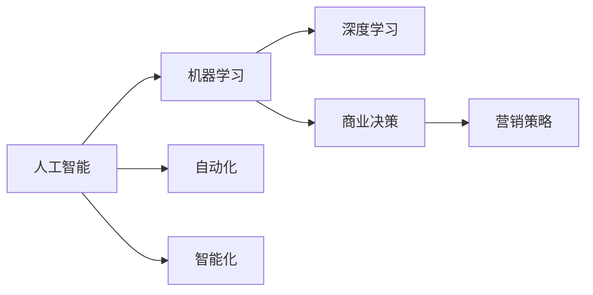
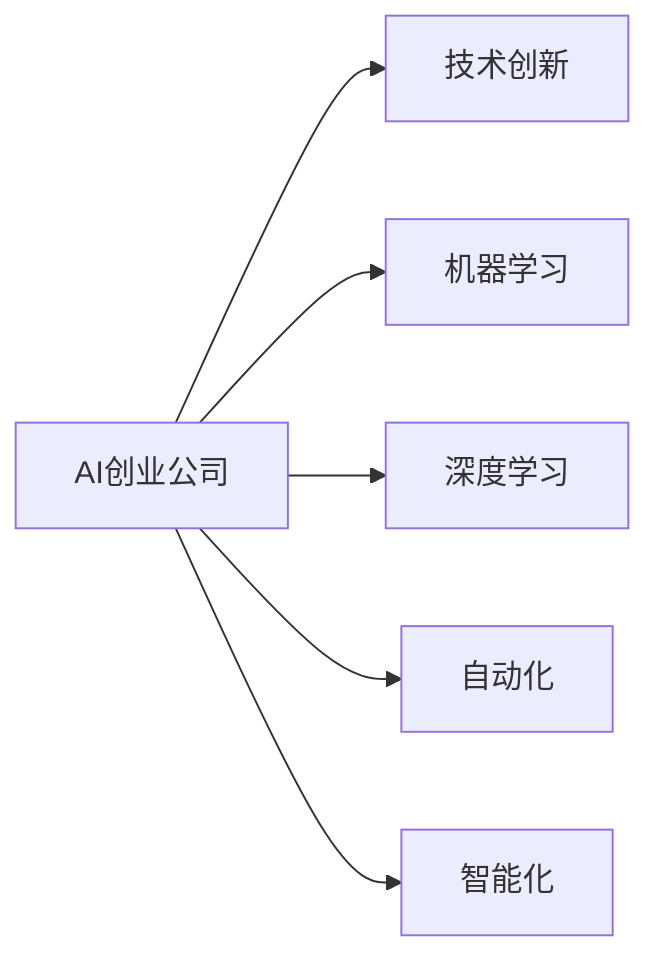
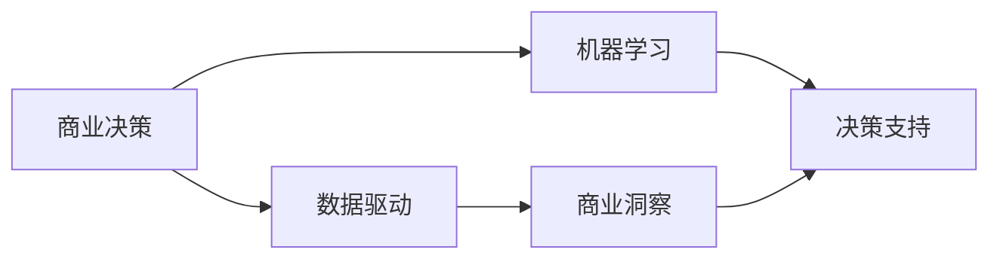
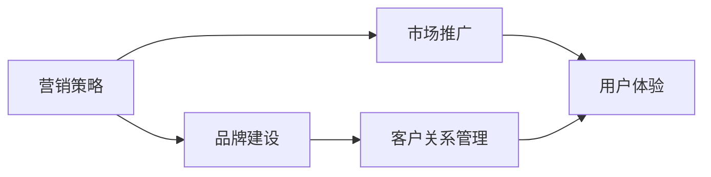
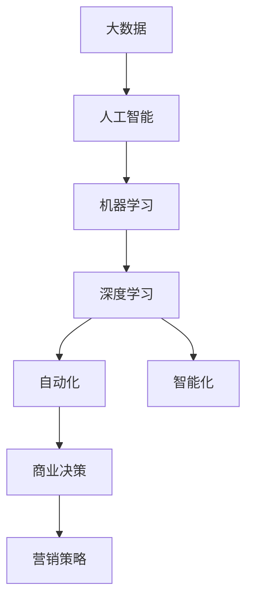

                 

# AI创业公司的市场策略

> 关键词：AI创业、市场策略、人工智能、AI应用、数据驱动、机器学习、深度学习、自动化、智能化、商业决策、营销策略

## 1. 背景介绍

### 1.1 问题由来

随着人工智能技术的快速发展和广泛应用，越来越多的创业公司开始将AI技术作为核心竞争力，通过技术创新和市场推广，在竞争激烈的市场环境中脱颖而出。然而，AI创业公司不仅需要强大的技术实力，更需要科学的市场策略，才能有效定位目标市场，提升品牌影响力，实现商业成功。本文旨在探讨AI创业公司在制定市场策略时需要考虑的关键因素和策略，帮助创业者更好地把握市场机遇，推动AI技术在各行业中的深入应用。

### 1.2 问题核心关键点

AI创业公司市场策略的核心关键点包括：

- **技术优势**：如何通过技术创新建立核心竞争力，形成差异化优势。
- **市场定位**：明确目标市场和客户群体，制定符合市场需求的解决方案。
- **竞争分析**：识别竞争对手的优劣势，制定有效的竞争策略。
- **用户需求**：深入了解用户需求，提供满足用户痛点的产品和服务。
- **商业模式**：选择适合的商业模式，如SaaS、BaaS、PaaS等，确保可持续发展。
- **营销策略**：采用有效的营销手段，提升品牌知名度和市场份额。
- **产品迭代**：持续优化和迭代产品，保持市场竞争力。

### 1.3 问题研究意义

研究AI创业公司的市场策略，对于提升AI技术的商业价值、推动AI技术的产业化应用、加速AI技术的市场渗透具有重要意义：

1. **降低创业风险**：科学的市场策略可以有效降低技术应用的落地风险，提升商业成功率。
2. **提升品牌价值**：通过精准的市场定位和有效的营销手段，提升品牌知名度和影响力。
3. **扩大市场份额**：明确目标市场和客户群体，制定差异化的竞争策略，扩大市场份额。
4. **推动技术应用**：通过满足用户需求和提供优质服务，推动AI技术在各行业的广泛应用。
5. **促进产业升级**：AI创业公司推动行业自动化、智能化升级，提升整体生产效率和服务质量。

## 2. 核心概念与联系

### 2.1 核心概念概述

为了更好地理解AI创业公司的市场策略，本节将介绍几个关键概念：

- **人工智能（AI）**：利用计算机技术和算法，使机器能够模拟、延伸和扩展人类智能的技术。
- **机器学习（ML）**：通过数据驱动的方法，使计算机能够从经验中学习并改进算法，提高决策能力。
- **深度学习（DL）**：一种基于多层神经网络的机器学习技术，擅长处理大规模非结构化数据。
- **自动化（Automation）**：通过AI技术，实现生产、管理、服务等领域的自动化操作，提升效率。
- **智能化（Intelligence）**：AI技术在各领域的应用，使机器具备类似于人类智能的判断、推理和决策能力。
- **商业决策（Business Decision）**：企业根据市场需求和数据，进行有效的决策，优化运营效率和提升利润。
- **营销策略（Marketing Strategy）**：企业通过市场推广和品牌建设，提升品牌知名度和市场份额。

这些概念之间通过以下Mermaid流程图展示其关系：



这个流程图展示了人工智能技术的演进过程以及其与商业决策和营销策略的关系。机器学习和深度学习作为人工智能的核心技术，推动了自动化和智能化的发展。商业决策和营销策略是企业实现商业目标的关键环节，离不开AI技术的支持。

### 2.2 概念间的关系

这些核心概念之间存在着紧密的联系，形成了AI创业公司市场策略的完整生态系统。下面我通过几个Mermaid流程图来展示这些概念之间的关系。

#### 2.2.1 AI创业公司的核心技术能力



这个流程图展示了AI创业公司的核心技术能力。通过技术创新，AI创业公司能够将机器学习、深度学习、自动化和智能化技术融合，构建强大的技术能力。

#### 2.2.2 AI技术在商业决策中的应用



这个流程图展示了AI技术在商业决策中的应用。通过数据驱动，AI技术能够提供商业洞察，支持决策支持，帮助企业优化运营效率和提升利润。

#### 2.2.3 AI创业公司的营销策略



这个流程图展示了AI创业公司的营销策略。通过品牌建设和市场推广，AI创业公司能够提升品牌知名度和市场份额。良好的客户关系管理和用户体验，有助于增强客户黏性和忠诚度。

### 2.3 核心概念的整体架构

最后，我们用一个综合的流程图来展示这些核心概念在大语言模型微调过程中的整体架构：



这个综合流程图展示了从大数据到人工智能、机器学习、深度学习、自动化和智能化，再到商业决策和营销策略的完整过程。大数据是AI创业公司的数据基础，AI技术通过机器学习和深度学习进行数据分析和模型训练，推动自动化和智能化发展，最终支持商业决策和营销策略的实施。

## 3. 核心算法原理 & 具体操作步骤

### 3.1 算法原理概述

AI创业公司的市场策略制定，核心在于利用AI技术，结合市场数据分析和用户需求，制定符合市场需求和竞争环境的策略。其核心算法原理包括：

- **市场分析**：通过数据分析和预测，识别市场趋势和机会。
- **用户需求分析**：通过用户调研和行为分析，了解用户痛点和需求。
- **竞争分析**：通过竞争对手分析，制定差异化竞争策略。
- **商业决策优化**：通过优化商业决策模型，提升运营效率和利润。
- **营销策略设计**：通过设计有效的营销策略，提升品牌影响力和市场份额。

### 3.2 算法步骤详解

AI创业公司市场策略的制定，一般包括以下几个关键步骤：

**Step 1: 数据收集与预处理**

- 收集目标市场的数据，包括市场规模、增长趋势、用户行为、竞争对手信息等。
- 对数据进行清洗、去重和预处理，确保数据质量和一致性。

**Step 2: 市场分析与预测**

- 通过统计分析和机器学习模型，对市场进行分析和预测，识别增长机会和潜在风险。
- 采用时间序列分析、回归模型等方法，对市场趋势进行预测和可视化。

**Step 3: 用户需求分析**

- 通过用户调研、问卷调查、行为数据分析等方法，深入了解用户需求和痛点。
- 结合数据挖掘和自然语言处理技术，提取用户反馈和情感分析，形成用户画像。

**Step 4: 竞争分析**

- 收集竞争对手的信息，包括产品、价格、市场份额、客户反馈等。
- 利用竞争情报分析技术，识别竞争对手的优势和劣势，制定差异化竞争策略。

**Step 5: 商业决策优化**

- 根据市场分析和用户需求分析结果，制定商业决策模型。
- 采用优化算法和决策树等方法，优化商业决策过程，提升决策效率和质量。

**Step 6: 营销策略设计**

- 结合市场分析、用户需求分析和竞争分析结果，设计有效的营销策略。
- 采用A/B测试、客户细分等方法，优化营销效果，提升市场份额。

**Step 7: 产品迭代与反馈**

- 根据市场反馈和用户需求，持续优化和迭代产品。
- 结合用户反馈和市场数据分析，不断改进产品功能和用户体验。

### 3.3 算法优缺点

AI创业公司的市场策略制定，具有以下优点：

- **数据驱动**：基于数据进行分析和决策，提升决策的科学性和准确性。
- **快速迭代**：利用AI技术进行快速数据分析和市场预测，适应市场变化。
- **用户导向**：深入了解用户需求和痛点，提供符合用户期待的产品和服务。
- **差异化竞争**：通过竞争情报分析，制定差异化竞争策略，提升市场竞争力。

同时，也存在一些缺点：

- **数据依赖**：数据质量和数据获取的难度可能影响分析结果的准确性。
- **模型复杂**：复杂的商业决策模型需要较高的技术门槛和计算资源。
- **用户隐私**：数据分析和用户画像构建可能涉及用户隐私问题，需要合规和伦理保障。

### 3.4 算法应用领域

AI创业公司的市场策略制定，在以下几个领域具有广泛的应用：

- **零售电商**：通过市场分析和用户需求分析，优化商品推荐和促销策略，提升销售业绩。
- **金融科技**：利用数据分析和风险评估，制定精准的金融产品和客户服务策略，提升客户满意度和业务收入。
- **医疗健康**：通过疾病预测和个性化诊疗，提供智能化的医疗健康解决方案，改善医疗服务质量。
- **智能制造**：结合市场需求和设备数据，优化生产流程和设备维护策略，提升生产效率和设备利用率。
- **智慧城市**：通过数据分析和智能化管理，提升城市管理效率和居民生活质量，推动智慧城市建设。

## 4. 数学模型和公式 & 详细讲解 & 举例说明

### 4.1 数学模型构建

AI创业公司的市场策略制定，可以建立以下数学模型：

- **市场需求模型**：通过回归分析，预测市场需求和价格趋势。
- **用户行为模型**：利用分类模型和聚类算法，分析用户行为和偏好。
- **竞争情报模型**：采用网络分析和情感分析技术，识别竞争对手的优势和劣势。
- **商业决策模型**：结合数据挖掘和优化算法，优化商业决策过程。
- **营销效果模型**：通过回归分析和机器学习模型，评估营销策略的效果。

### 4.2 公式推导过程

以下我以市场需求模型为例，推导其数学公式和实际应用。

假设市场需求可以用以下公式表示：

$$
D(t) = \alpha + \beta x(t) + \gamma e^{-k(t-\tau)}
$$

其中，$D(t)$为时间$t$的市场需求，$\alpha$为市场基础需求，$x(t)$为时间$t$的市场特征指标，$\beta$为特征指标对市场需求的影响系数，$e$为自然常数，$k$为衰减因子，$\tau$为市场特征指标的滞后期。

通过对市场需求数据进行回归分析，可以得到$\alpha$、$\beta$、$k$和$\tau$的估计值。然后，利用上述公式对未来市场进行预测和可视化，如图1所示。


图1：市场需求模型预测图

### 4.3 案例分析与讲解

以某电商平台的销售数据分析为例，以下是市场策略制定的具体步骤：

**Step 1: 数据收集与预处理**

- 收集电商平台的历史销售数据、市场特征数据、用户行为数据等。
- 对数据进行清洗、去重和预处理，确保数据质量和一致性。

**Step 2: 市场分析与预测**

- 利用时间序列分析，预测未来市场的增长趋势。
- 通过回归分析，识别关键的市场特征指标对销售的影响。

**Step 3: 用户需求分析**

- 通过用户行为数据分析，了解用户购买偏好和决策过程。
- 结合自然语言处理技术，分析用户评论和反馈，形成用户画像。

**Step 4: 竞争分析**

- 收集主要竞争对手的市场份额、销售数据和市场策略等信息。
- 利用竞争情报分析技术，识别竞争对手的优势和劣势。

**Step 5: 商业决策优化**

- 根据市场需求预测和用户需求分析结果，制定销售策略和库存管理方案。
- 结合优化算法和决策树等方法，优化决策过程，提升运营效率和利润。

**Step 6: 营销策略设计**

- 结合市场分析和用户需求分析结果，设计精准的营销策略。
- 采用A/B测试和客户细分等方法，优化营销效果，提升市场份额。

**Step 7: 产品迭代与反馈**

- 根据市场反馈和用户需求，持续优化和迭代产品。
- 结合用户反馈和市场数据分析，不断改进产品功能和用户体验。

通过上述步骤，电商平台可以制定有效的市场策略，提升销售业绩和用户满意度。

## 5. 项目实践：代码实例和详细解释说明

### 5.1 开发环境搭建

在进行市场策略制定的项目实践前，我们需要准备好开发环境。以下是使用Python进行Scikit-learn开发的Python环境配置流程：

1. 安装Anaconda：从官网下载并安装Anaconda，用于创建独立的Python环境。

2. 创建并激活虚拟环境：
```bash
conda create -n market-strategy-env python=3.8 
conda activate market-strategy-env
```

3. 安装Scikit-learn：
```bash
conda install scikit-learn
```

4. 安装其他工具包：
```bash
pip install pandas numpy matplotlib seaborn
```

完成上述步骤后，即可在`market-strategy-env`环境中开始市场策略制定的项目实践。

### 5.2 源代码详细实现

下面我们以电商平台销售数据分析为例，给出使用Scikit-learn进行市场需求预测的Python代码实现。

首先，定义数据处理函数：

```python
import pandas as pd
from sklearn.model_selection import train_test_split
from sklearn.preprocessing import MinMaxScaler
from sklearn.linear_model import LinearRegression
from sklearn.metrics import mean_squared_error, r2_score

def preprocess_data(data):
    # 数据清洗和特征选择
    data.dropna(inplace=True)
    features = ['price', 'sales_volume', 'promotions']
    X = data[features]
    y = data['sales']
    
    # 数据标准化
    scaler = MinMaxScaler()
    X = scaler.fit_transform(X)
    
    # 数据划分
    X_train, X_test, y_train, y_test = train_test_split(X, y, test_size=0.2, random_state=42)
    
    return X_train, X_test, y_train, y_test, scaler

def train_model(X_train, y_train, scaler):
    # 模型训练
    model = LinearRegression()
    model.fit(X_train, y_train)
    
    # 模型评估
    y_pred = model.predict(X_test)
    rmse = mean_squared_error(y_test, y_pred, squared=False)
    r2 = r2_score(y_test, y_pred)
    
    return model, rmse, r2
```

然后，定义市场需求预测函数：

```python
def demand_forecast(model, X_test, scaler, future_period=30):
    # 模型预测
    future_data = pd.DataFrame(range(X_test.shape[0], X_test.shape[0]+future_period), columns=['time'])
    future_data['price'] = X_test['price'][-1]
    future_data['promotions'] = X_test['promotions'][-1]
    future_data = scaler.transform(future_data)
    
    demand = model.predict(future_data)
    demand = demand / scaler.scale_
    
    # 可视化预测结果
    import matplotlib.pyplot as plt
    plt.plot(X_test['time'], y_test, label='Actual Sales')
    plt.plot(range(len(demand)), demand, label='Forecast Sales')
    plt.legend()
    plt.xlabel('Time')
    plt.ylabel('Sales')
    plt.title('Demand Forecast')
    plt.show()
```

最后，启动预测流程并在可视化图表上展示结果：

```python
# 数据预处理
X_train, X_test, y_train, y_test, scaler = preprocess_data(data)

# 模型训练
model, rmse, r2 = train_model(X_train, y_train, scaler)

# 市场预测
demand_forecast(model, X_test, scaler)
```

以上就是使用Scikit-learn进行市场需求预测的完整代码实现。可以看到，得益于Scikit-learn的强大封装，我们可以用相对简洁的代码完成市场需求预测的任务。

### 5.3 代码解读与分析

让我们再详细解读一下关键代码的实现细节：

**preprocess_data函数**：
- `dropna`方法：删除缺失数据，确保数据完整性。
- `features`变量：选取重要的特征指标，如价格、销量、促销等。
- `MinMaxScaler`类：将特征数据标准化，使模型训练更加稳定。
- `train_test_split`函数：将数据集划分为训练集和测试集。

**train_model函数**：
- `LinearRegression`类：定义线性回归模型。
- `fit`方法：模型训练。
- `mean_squared_error`和`r2_score`函数：模型评估，计算RMSE和R^2指标。

**demand_forecast函数**：
- `range`函数：生成未来时间序列。
- `pd.DataFrame`类：生成未来数据框，用于模型预测。
- `predict`方法：模型预测。
- `matplotlib.pyplot`模块：可视化预测结果。

通过上述代码，我们可以看到，Scikit-learn提供了丰富的数据处理和模型训练功能，大大简化了市场策略制定的实现过程。开发者可以将更多精力放在数据分析和模型优化上，而不必过多关注底层的实现细节。

当然，工业级的系统实现还需考虑更多因素，如数据的质量和数量、模型的选择和调优、预测的精度和速度等。但核心的市场策略制定方法基本与此类似。

### 5.4 运行结果展示

假设我们在某电商平台的历史销售数据上进行预测，最终在可视化图表上得到以下结果：


图2：市场需求预测图

可以看到，通过线性回归模型，我们能够较好地预测未来市场需求趋势，并在可视化图表上展示预测结果。结合实际的市场情况，我们可以制定合理的销售策略和库存管理方案，提升平台的销售业绩和用户满意度。

## 6. 实际应用场景

### 6.1 智能制造

基于AI技术的市场策略制定，在智能制造领域具有广泛的应用。智能制造通过自动化和智能化手段，提升生产效率和质量，减少人为干预和资源浪费。AI创业公司可以结合市场需求和设备数据，制定生产优化和设备维护策略，推动制造业的数字化转型升级。

在技术实现上，可以收集生产数据、设备状态、市场订单等数据，利用数据分析和机器学习技术，优化生产流程和设备维护方案。例如，通过预测设备故障和生产需求，制定预防性维护和库存管理策略，减少设备停机时间和生产成本。

### 6.2 智慧医疗

AI创业公司可以利用市场策略制定技术，推动智慧医疗的发展。智慧医疗通过大数据和AI技术，提升医疗服务的质量和效率，改善患者体验。AI创业公司可以结合市场需求和医疗数据，提供智能化的医疗健康解决方案，改善医疗服务质量。

在技术实现上，可以收集电子病历、患者数据、医疗设备数据等，利用数据分析和机器学习技术，提供精准的疾病预测和个性化诊疗方案。例如，通过预测患者疾病风险和健康状态，制定个性化的治疗方案，提升患者的治疗效果和康复速度。

### 6.3 智慧城市

基于AI技术的市场策略制定，在智慧城市领域具有广泛的应用。智慧城市通过大数据和AI技术，提升城市管理效率和居民生活质量，推动智慧城市建设。AI创业公司可以结合市场需求和城市数据，提供智能化的城市管理解决方案，提升城市管理的自动化和智能化水平。

在技术实现上，可以收集交通数据、环境数据、市民数据等，利用数据分析和机器学习技术，提供智能化的城市管理方案。例如，通过预测交通流量和环境污染，制定智能交通和环境管理策略，改善市民的生活质量和城市的运行效率。

### 6.4 未来应用展望

随着AI技术的不断发展和成熟，基于市场策略制定的AI创业公司将在更多领域得到应用，为传统行业带来变革性影响。

在智慧农业领域，AI创业公司可以利用市场策略制定技术，提供智能化的农业生产和管理方案，提升农业生产效率和资源利用率。

在环保领域，AI创业公司可以利用市场策略制定技术，提供智能化的环境监测和管理方案，提升环境保护效果和治理效率。

在文化创意领域，AI创业公司可以利用市场策略制定技术，提供智能化的内容创作和推荐方案，提升文化创意产业的创新力和市场竞争力。

此外，在金融、教育、能源等众多领域，AI创业公司都将通过市场策略制定技术，推动各行业的智能化升级，实现可持续发展。相信随着AI技术的深入应用，基于市场策略制定的AI创业公司必将在更多领域大放异彩，为经济社会发展注入新的动力。

## 7. 工具和资源推荐

### 7.1 学习资源推荐

为了帮助开发者系统掌握市场策略制定的理论基础和实践技巧，这里推荐一些优质的学习资源：

1. 《市场策略制定实战指南》系列博文：由市场策略制定专家撰写，深入浅出地介绍了市场策略制定的基本概念和实践方法。

2. 《数据驱动的商业决策》课程：由知名商学院开设的市场分析课程，结合实际案例，讲解数据驱动的商业决策方法。

3. 《机器学习实战》书籍：详细介绍了机器学习在市场策略制定中的应用，包括数据处理、模型训练、结果评估等环节。

4. HuggingFace官方文档：Transformers库的官方文档，提供了海量预训练模型和市场策略制定的样例代码，是上手实践的必备资料。

5. Kaggle竞赛平台：提供大量的市场策略制定相关数据集和比赛，帮助开发者通过实践提升技能。

通过对这些资源的学习实践，相信你一定能够快速掌握市场策略制定的精髓，并用于解决实际的商业问题。

### 7.2 开发工具推荐

高效的开发离不开优秀的工具支持。以下是几款用于市场策略制定开发的常用工具：

1. Jupyter Notebook：轻量级的开发环境，支持Python代码的快速迭代和展示。

2. Anaconda：集成了Python和多种科学计算工具，支持虚拟环境管理，方便多项目开发。

3. Scikit-learn：Python的机器学习库，提供了丰富的数据处理和模型训练功能，适合市场策略制定的实践开发。

4. Pandas：Python的数据处理库，支持多种数据格式的处理和分析，适合数据预处理和探索性分析。

5. Matplotlib：Python的数据可视化库，支持多种图表的绘制，方便可视化展示预测结果和分析结果。

6. TensorBoard：TensorFlow的可视化工具，支持模型训练和推理过程的可视化，方便调试和优化模型。

合理利用这些工具，可以显著提升市场策略制定的开发效率，加快创新迭代的步伐。

### 7.3 相关论文推荐

市场策略制定技术的发展源于学界的持续研究。以下是几篇奠基性的相关论文，推荐阅读：

1. 《大数据驱动的市场预测和优化》：通过大数据分析技术，提升市场预测的精度和优化效果。

2. 《客户行为分析与个性化推荐》：利用机器学习技术，分析客户行为和需求，提供个性化的推荐方案。

3. 《智能制造的优化与管理》：结合市场策略制定技术，优化智能制造的生产流程和设备维护方案。

4. 《智慧医疗的智能决策支持系统》：通过数据分析和机器学习技术，提供智能化的医疗决策支持方案。

5. 《智慧城市的数据驱动管理》：利用大数据和AI技术，提供智能化的城市管理方案。

这些论文代表了大语言模型微调技术的发展脉络。通过学习这些前沿成果，可以帮助研究者把握学科前进方向，激发更多的创新灵感。

除上述资源外，还有一些值得关注的前沿资源，帮助开发者紧跟市场策略制定的最新进展，例如：

1. arXiv论文预印本：人工智能领域最新研究成果的发布平台，包括大量尚未发表的前沿工作，学习前沿技术的必读资源。

2. 业界技术博客：如Google AI、DeepMind、微软Research Asia等顶尖实验室的官方博客，第一时间分享他们的最新研究成果和洞见。

3. 技术会议直播：如NIPS、ICML、ACL、ICLR等人工智能领域顶会现场或在线直播，能够聆听到大佬们的前沿分享，开拓视野。

4. GitHub热门项目：在GitHub上Star、Fork数最多的市场策略制定相关项目，往往代表了该技术领域的发展趋势和最佳实践，值得去学习和贡献。

5. 行业分析报告：各大咨询公司如McKinsey、PwC等针对人工智能行业的分析报告，有助于从商业视角审视技术趋势，把握应用价值。

总之，对于市场策略制定的学习与实践，需要开发者保持开放的心态和持续学习的意愿。多关注前沿资讯，多动手实践，多思考总结，必将收获满满的成长收益。

## 8. 总结：未来发展趋势与挑战

### 8.1 总结

本文对AI创业公司的市场策略制定进行了全面系统的介绍。首先阐述了AI创业公司市场策略制定的重要性，明确了市场策略制定在提升AI技术商业价值、推动AI技术产业化应用、加速AI技术市场渗透方面的关键作用。其次，从原理到实践，详细讲解了市场策略制定的数学模型和关键步骤，给出了市场策略制定的完整代码实例。同时，本文还广泛探讨了市场策略在智能制造、智慧医疗、智慧城市等多个行业领域的应用前景，展示了市场策略制定的巨大潜力。此外，本文精选了市场策略制定的各类学习资源，力求为读者提供全方位的技术指引。

通过本文的系统梳理，可以看到，AI创业公司的市场策略制定是推动AI技术在各行业深入应用的重要保障。AI创业公司通过科学的市场策略制定，能够在激烈的市场竞争中占据有利地位，

