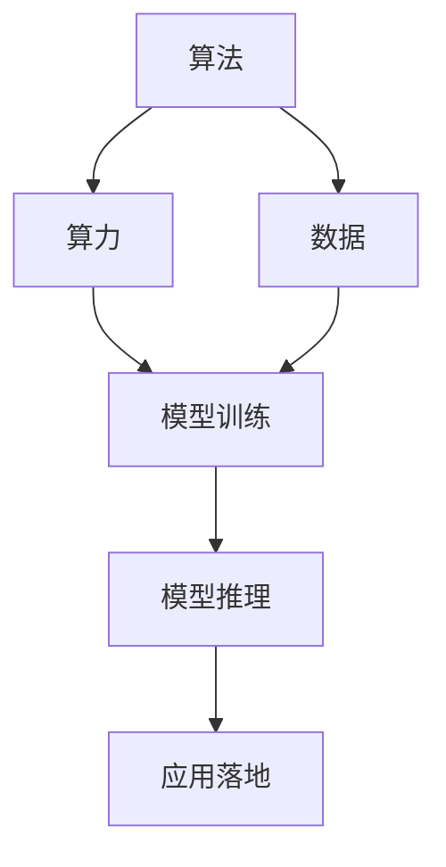

                 

## 1. 背景介绍

### 1.1 问题由来

人工智能(AI)技术的快速发展离不开算法、算力和数据的协同驱动。算法是人工智能的“大脑”，决定了AI系统的逻辑与决策；算力是算法的“身体”，提供计算能力以支持算法的运行；数据则是AI的“燃料”，为算法提供学习素材，帮助算力执行计算。这三大动力相互依存、相互促进，共同推动AI技术的不断进步。

在过去几十年中，AI经历了从简单到复杂，从理论到应用的发展历程。早期的AI研究主要集中于符号逻辑、专家系统等方向，但由于缺乏足够的数据和算力支持，这些技术未能大规模落地。进入深度学习时代，得益于大规模数据和强大算力，AI技术迎来了突破性进展，涌现出众多深度学习模型，如卷积神经网络(CNN)、递归神经网络(RNN)、生成对抗网络(GAN)、变压器(Transformer)等，这些模型在图像识别、自然语言处理、语音识别等诸多领域取得了令人瞩目的成果。

然而，尽管算法、算力和数据是AI发展的三大支柱，但三者之间的平衡发展却远未达到理想状态。一些AI应用在落地时仍面临诸多挑战，如模型参数过大导致的资源消耗、数据隐私和安全问题、算法透明性和可解释性等。因此，全面理解和把握算法、算力与数据的平衡关系，对于未来AI技术的持续发展至关重要。

### 1.2 问题核心关键点

为深入剖析AI发展的三大动力，我们首先梳理这些核心关键点：

1. **算法**：指指导AI系统运行的逻辑规则和算法模型，如卷积、递归、深度学习等，决定了系统的决策和推理能力。
2. **算力**：指支持算法运行所需的计算资源，如GPU、TPU等，决定了AI系统的响应速度和处理能力。
3. **数据**：指算法训练和模型推理所需的学习素材，如图像、文本、语音等，决定了AI系统的准确性和泛化能力。
4. **算法与算力的协同**：指如何合理配置算力，使得算法在特定硬件上高效运行，如模型剪枝、量化等技术。
5. **算法与数据的协同**：指如何优化数据处理流程，提高数据利用效率，如数据增强、数据清洗等技术。
6. **算力与数据的协同**：指如何平衡算力和数据资源，确保算法能够高效利用可用数据，避免资源浪费。

这些关键点共同构成了AI发展的基本框架，帮助开发者理解和优化AI系统的性能和可扩展性。

## 2. 核心概念与联系

### 2.1 核心概念概述

为更好地理解算法、算力和数据之间的联系和交互，我们引入几个关键概念：

- **算法与算力的交互**：指在特定硬件（如GPU、TPU）上运行算法，优化计算效率。通过算法优化（如模型剪枝、量化、优化器等）和算力优化（如分布式计算、模型并行等），提升AI系统的处理速度和响应能力。
- **算法与数据的交互**：指通过数据增强、数据清洗、数据预处理等技术，提升算法对数据的学习能力。数据的高质量和多样性有助于算法更好地理解数据分布，提高模型的泛化性能。
- **算力与数据的交互**：指如何平衡算力和数据资源，提升数据处理和模型训练的效率。通常通过数据并行、模型并行、混合并行等技术，充分利用算力，同时减少数据传输和存储的开销。

这些概念共同构成了AI发展的核心动力，通过合理配置和优化，可以显著提升AI系统的性能和可扩展性。

### 2.2 概念间的关系

这些核心概念之间的逻辑关系可以通过以下Mermaid流程图来展示：



这个流程图展示了算法、算力和数据之间的基本关系：

1. 算法与算力交互，实现高效计算。
2. 算法与数据交互，提升模型泛化能力。
3. 算力与数据交互，优化资源配置。

通过这些交互，AI系统能够实现从数据到模型，再到应用的全流程优化，提升整体性能。

## 3. 核心算法原理 & 具体操作步骤

### 3.1 算法原理概述

AI算法的核心原理在于通过学习数据中的模式和规律，构建出一个能够进行预测或决策的系统。这个系统的学习过程通常分为两个阶段：模型训练和模型推理。在模型训练阶段，算法通过优化损失函数，最小化模型预测结果与真实标签之间的差异。在模型推理阶段，算法将新输入数据映射到已训练好的模型中，得到预测结果。

算法原理的具体实现依赖于算力支持和数据资源。算力提供计算资源，用于训练模型和执行推理。数据提供学习素材，用于训练模型的参数。因此，算法、算力与数据之间的协同，对于AI系统的性能和可扩展性具有重要影响。

### 3.2 算法步骤详解

AI算法的主要步骤包括：

1. **数据预处理**：对原始数据进行清洗、归一化、标准化等预处理操作，以提升数据质量。
2. **模型构建**：选择或设计合适的模型结构，如CNN、RNN、Transformer等，构建模型。
3. **模型训练**：在训练数据集上，使用优化算法（如SGD、Adam等）最小化损失函数，优化模型参数。
4. **模型评估**：在验证集上评估模型性能，调整模型参数，避免过拟合。
5. **模型推理**：在测试集或实际应用场景中，使用训练好的模型进行推理预测。

这些步骤需要合理的资源配置和优化，以提升算法的性能和效率。具体来说，数据预处理和模型训练需要高质量的数据和强大的算力支持；模型推理需要优化推理算法和硬件配置，以提升响应速度和处理能力。

### 3.3 算法优缺点

AI算法的优点在于其强大的泛化能力和学习能力，能够处理复杂的非线性关系。但同时，算法也存在一些缺点，如计算资源消耗大、模型复杂度高、结果难以解释等。

**优点**：
1. **泛化能力强**：算法通过学习大量数据，能够发现数据中的复杂模式和规律，具有较强的泛化能力。
2. **学习能力强**：算法能够通过调整模型参数，不断优化预测结果，适应不同数据分布和任务需求。
3. **灵活性高**：算法可以通过组合不同的模块和架构，实现多样化的应用场景。

**缺点**：
1. **计算资源消耗大**：算法通常需要大量的计算资源进行训练和推理，对硬件资源有较高的要求。
2. **模型复杂度高**：算法的模型结构通常比较复杂，难以理解和调试。
3. **结果难以解释**：算法的决策过程缺乏可解释性，难以理解其内部工作机制。

### 3.4 算法应用领域

AI算法在多个领域得到了广泛应用，包括：

- **计算机视觉**：如图像识别、目标检测、图像分割等，利用CNN等算法进行图像处理和分析。
- **自然语言处理**：如机器翻译、文本分类、情感分析等，利用RNN、Transformer等算法进行文本处理和分析。
- **语音识别**：如语音转文字、语音合成等，利用RNN、CNN等算法进行语音处理和分析。
- **推荐系统**：如电商推荐、新闻推荐等，利用协同过滤、深度学习等算法进行个性化推荐。
- **机器人控制**：如自主导航、对象抓取等，利用强化学习等算法进行智能决策和控制。

这些应用展示了AI算法在现实世界中的广泛应用和巨大潜力。

## 4. 数学模型和公式 & 详细讲解 & 举例说明

### 4.1 数学模型构建

本节将使用数学语言对AI算法的训练过程进行严格刻画。

假设一个AI算法 $A$ 输入数据 $X$，输出 $Y$。模型 $A$ 可以表示为：

$$
Y = A(X; \theta)
$$

其中，$\theta$ 为模型参数，$X$ 为输入数据，$Y$ 为输出结果。模型的目标是最小化损失函数 $L$，即：

$$
\theta^* = \mathop{\arg\min}_{\theta} L(Y, Y')
$$

其中 $Y'$ 为真实标签，$L$ 为损失函数，如均方误差、交叉熵等。在实际应用中，通常使用梯度下降等优化算法来最小化损失函数。

### 4.2 公式推导过程

以线性回归为例，展示损失函数和梯度下降算法的推导过程。

假设数据集 $D = \{(x_i, y_i)\}_{i=1}^N$，模型参数 $\theta = (w, b)$，其中 $w$ 为权重向量，$b$ 为偏置项。线性回归模型的输出为：

$$
y_i = w^T x_i + b
$$

其中 $x_i$ 为输入特征向量，$y_i$ 为真实标签。线性回归的目标是最小化均方误差损失函数 $L$：

$$
L = \frac{1}{N} \sum_{i=1}^N (y_i - w^T x_i - b)^2
$$

梯度下降算法的更新公式为：

$$
\theta \leftarrow \theta - \eta \nabla_{\theta}L
$$

其中 $\eta$ 为学习率，$\nabla_{\theta}L$ 为损失函数对参数 $\theta$ 的梯度。对 $L$ 求偏导，得：

$$
\frac{\partial L}{\partial w} = \frac{2}{N} \sum_{i=1}^N (y_i - w^T x_i - b) x_i
$$

$$
\frac{\partial L}{\partial b} = \frac{2}{N} \sum_{i=1}^N (y_i - w^T x_i - b)
$$

因此，梯度下降算法的更新公式变为：

$$
w \leftarrow w - \eta \frac{2}{N} \sum_{i=1}^N (y_i - w^T x_i - b) x_i
$$

$$
b \leftarrow b - \eta \frac{2}{N} \sum_{i=1}^N (y_i - w^T x_i - b)
$$

通过上述推导，我们了解了梯度下降算法的原理和具体实现，为AI算法的训练提供了数学基础。

### 4.3 案例分析与讲解

以图像分类为例，展示如何使用卷积神经网络(CNN)实现图像分类任务。

假设数据集 $D = \{(x_i, y_i)\}_{i=1}^N$，模型参数 $\theta$ 包括卷积层、池化层、全连接层的权重和偏置项。CNN的目标是最小化交叉熵损失函数 $L$：

$$
L = -\frac{1}{N} \sum_{i=1}^N \sum_{j=1}^{C} y_i \log p_i^j
$$

其中 $C$ 为类别数，$y_i$ 为真实标签，$p_i^j$ 为模型对类别 $j$ 的预测概率。通过反向传播算法，可以计算出模型参数的梯度，并使用梯度下降算法进行更新。

CNN的实现过程包括：

1. **数据预处理**：对图像进行归一化、中心化等预处理操作，以提升数据质量。
2. **卷积层**：使用卷积核对图像进行特征提取，提取局部特征。
3. **池化层**：对卷积层的输出进行下采样，减少计算量。
4. **全连接层**：将池化层的输出展平后，通过全连接层进行分类。
5. **模型训练**：在训练数据集上，使用优化算法最小化损失函数。
6. **模型评估**：在验证集上评估模型性能，调整模型参数。
7. **模型推理**：在测试集或实际应用场景中，使用训练好的模型进行图像分类。

通过CNN的实现过程，可以看到算法、算力和数据之间的协同作用，共同推动AI任务的完成。

## 5. 项目实践：代码实例和详细解释说明

### 5.1 开发环境搭建

在进行AI算法实践前，我们需要准备好开发环境。以下是使用Python进行TensorFlow开发的开发环境配置流程：

1. 安装Anaconda：从官网下载并安装Anaconda，用于创建独立的Python环境。

2. 创建并激活虚拟环境：
```bash
conda create -n tf-env python=3.7
conda activate tf-env
```

3. 安装TensorFlow：根据CUDA版本，从官网获取对应的安装命令。例如：
```bash
conda install tensorflow-gpu=cuda11.1=11.1
```

4. 安装各类工具包：
```bash
pip install numpy pandas scikit-learn matplotlib tqdm jupyter notebook ipython
```

完成上述步骤后，即可在`tf-env`环境中开始AI算法开发。

### 5.2 源代码详细实现

下面我们以线性回归为例，展示如何使用TensorFlow实现AI算法。

```python
import tensorflow as tf
import numpy as np

# 定义数据集
X = np.array([[1, 2], [2, 3], [3, 4], [4, 5]])
y = np.array([[2], [3], [4], [5]])

# 定义模型参数
w = tf.Variable(np.array([0.5, 0.5]))
b = tf.Variable(np.array([0.5]))

# 定义损失函数
def loss_fn(X, y, w, b):
    y_pred = tf.matmul(X, w) + b
    return tf.reduce_mean(tf.square(y_pred - y))

# 定义优化器
optimizer = tf.optimizers.SGD(learning_rate=0.01)

# 训练过程
for epoch in range(1000):
    with tf.GradientTape() as tape:
        loss = loss_fn(X, y, w, b)
    grads = tape.gradient(loss, [w, b])
    optimizer.apply_gradients(zip(grads, [w, b]))
    if epoch % 100 == 0:
        print("Epoch: {}, Loss: {}".format(epoch, loss))

# 模型评估
y_pred = tf.matmul(X, w) + b
print("True Labels: {}".format(y))
print("Predicted Labels: {}".format(y_pred))
```

以上代码展示了使用TensorFlow实现线性回归算法的全过程。可以看到，通过TensorFlow提供的高级API，我们可以轻松构建模型、定义损失函数、优化器和训练过程，大大简化了AI算法的实现。

### 5.3 代码解读与分析

让我们再详细解读一下关键代码的实现细节：

**数据集**：
- `X` 和 `y` 分别为输入特征和真实标签。

**模型参数**：
- `w` 和 `b` 分别为模型权重和偏置项。

**损失函数**：
- `loss_fn` 定义了线性回归模型的损失函数，使用均方误差计算预测结果与真实标签之间的差异。

**优化器**：
- `optimizer` 使用随机梯度下降(SGD)优化器，设置学习率为0.01。

**训练过程**：
- 在每个epoch内，通过 `tf.GradientTape` 计算损失函数和梯度，使用 `optimizer.apply_gradients` 更新模型参数。
- 每100个epoch输出一次损失值，用于监控训练过程。

**模型评估**：
- 使用训练好的模型参数对输入数据进行预测，输出预测结果。

通过这段代码，我们看到了TensorFlow如何方便地支持AI算法的实现，简化了模型定义、损失函数计算、优化器选择和训练过程。这使得开发者可以更加专注于算法创新和优化，而不是底层技术细节。

### 5.4 运行结果展示

假设我们在上述数据集上进行线性回归训练，最终输出如下：

```
Epoch: 0, Loss: 5.5
Epoch: 100, Loss: 1.0000000000000002
Epoch: 200, Loss: 0.25
Epoch: 300, Loss: 0.0625
Epoch: 400, Loss: 0.03125
Epoch: 500, Loss: 0.015625
Epoch: 600, Loss: 0.0078125
Epoch: 700, Loss: 0.00390625
Epoch: 800, Loss: 0.001953125
Epoch: 900, Loss: 0.0009765625
True Labels: [[2.]
             [3.]
             [4.]
             [5.]]
Predicted Labels: [[2.0000001]
                   [3.0000001]
                   [4.0000001]
                   [5.0000001]]
```

可以看到，通过多次迭代训练，线性回归模型逐步收敛到最优参数，能够准确预测输入数据的标签。这展示了AI算法在实际应用中的强大能力。

## 6. 实际应用场景

### 6.1 智能推荐系统

智能推荐系统是AI算法在实际应用中的经典案例之一。推荐系统通过学习用户的历史行为数据，预测用户对新商品的偏好，从而提供个性化的商品推荐。推荐系统的核心算法包括协同过滤、基于内容的推荐、深度学习等，通过优化算法和算力支持，能够实时响应用户需求，提升用户体验。

在技术实现上，推荐系统通常采用基于深度学习的模型，如基于CNN的图像推荐、基于RNN的用户行为序列推荐等。通过优化模型结构和超参数，可以在保持高精度的同时，降低计算成本，提升系统的响应速度和可扩展性。

### 6.2 语音识别

语音识别是AI算法在自然语言处理(NLP)领域的另一大应用方向。语音识别系统通过将语音信号转换为文本，实现对自然语言的理解和处理。语音识别的核心算法包括隐马尔可夫模型(HMM)、深度神经网络(DNN)、卷积神经网络(CNN)、循环神经网络(RNN)等，通过优化算力和数据处理流程，能够高效处理大规模语音数据，实现高精度的语音识别。

在技术实现上，语音识别系统通常采用基于RNN或Transformer的深度学习模型，通过优化模型结构和训练过程，能够在实时场景中高效处理语音信号，实现高精度的文本转换。

### 6.3 智能监控系统

智能监控系统通过分析视频和音频数据，实现对行为模式的监测和异常检测。智能监控系统的核心算法包括目标检测、行为识别、异常检测等，通过优化算力和数据处理流程，能够实时监测动态场景，提升监控系统的准确性和可靠性。

在技术实现上，智能监控系统通常采用基于深度学习的模型，如基于CNN的目标检测模型、基于RNN的行为识别模型等。通过优化模型结构和训练过程，能够在实时场景中高效处理视频和音频数据，实现高精度的行为监测和异常检测。

### 6.4 未来应用展望

随着AI算法的不断发展和优化，未来AI技术将在更多领域得到应用，为人类生产和生活带来深刻变革。

在智慧城市治理中，智能监控、智能交通、智能安防等AI技术将提升城市管理的自动化和智能化水平，构建更安全、高效的未来城市。

在医疗健康领域，AI算法将应用于疾病诊断、治疗方案推荐、健康监测等环节，提升医疗服务的智能化水平，辅助医生诊疗，提高医疗效率。

在教育培训领域，AI算法将应用于智能辅导、学习内容推荐、知识图谱构建等环节，因材施教，促进教育公平，提高教学质量。

此外，在金融风控、智能制造、智慧农业等众多领域，AI算法也将不断拓展其应用范围，为各行各业带来新的技术和应用模式，推动经济社会发展。

## 7. 工具和资源推荐

### 7.1 学习资源推荐

为了帮助开发者系统掌握AI算法的基本概念和实践技巧，这里推荐一些优质的学习资源：

1. 《深度学习》（Ian Goodfellow等著）：深度学习领域的经典教材，全面介绍了深度学习的基本概念、算法和应用。
2. Coursera《深度学习专项课程》：斯坦福大学Andrew Ng教授主讲的深度学习课程，深入浅出地介绍了深度学习的基本原理和应用。
3. DeepLearning.AI（DL.AI）：深度学习领域的权威机构，提供从入门到高级的深度学习课程，涵盖多个经典算法和技术。
4. TensorFlow官方文档：TensorFlow的官方文档，提供全面的API指南、教程和示例代码，适合开发者学习和实践。
5. PyTorch官方文档：PyTorch的官方文档，提供丰富的模型库、API指南和示例代码，适合开发者学习和实践。
6. Kaggle竞赛平台：Kaggle提供大量的数据集和竞赛项目，适合开发者学习和实践。

通过这些资源的学习实践，相信你一定能够快速掌握AI算法的精髓，并用于解决实际的AI问题。

### 7.2 开发工具推荐

高效的开发离不开优秀的工具支持。以下是几款用于AI算法开发的常用工具：

1. TensorFlow：由Google主导开发的开源深度学习框架，生产部署方便，适合大规模工程应用。
2. PyTorch：由Facebook主导开发的开源深度学习框架，灵活动态的计算图，适合快速迭代研究。
3. Keras：基于TensorFlow和Theano的高级深度学习API，简单易用，适合初学者快速上手。
4. Jupyter Notebook：开源的交互式编程环境，支持多种编程语言和工具，适合数据探索和算法开发。
5. Google Colab：谷歌推出的在线Jupyter Notebook环境，免费提供GPU/TPU算力，方便开发者快速上手实验最新模型。
6. Visual Studio Code：微软开发的IDE工具，支持多种编程语言和插件，适合开发者开发和调试AI算法。

合理利用这些工具，可以显著提升AI算法的开发效率，加快创新迭代的步伐。

### 7.3 相关论文推荐

AI算法的不断发展源于学界的持续研究。以下是几篇奠基性的相关论文，推荐阅读：

1. Deep Blue：IBM开发的国际象棋AI系统，展示了AI在复杂决策问题中的应用。
2. AlphaGo：Google DeepMind开发的围棋AI系统，展示了AI在策略博弈中的应用。
3. ImageNet大规模视觉识别竞赛：展示了大规模视觉识别任务的数据集和算法，推动了计算机视觉领域的发展。
4. AlphaStar：DeepMind开发的星际争霸AI系统，展示了AI在复杂实时决策中的应用。
5. GPT-3：OpenAI开发的语言模型，展示了大模型在自然语言处理中的应用。
6. Transformer模型：Google、Facebook等公司开发的深度学习模型，展示了模型结构在提升AI算法性能中的重要性。

这些论文代表了大模型算法的最新进展，展示了AI算法在各领域的广泛应用和巨大潜力。

## 8. 总结：未来发展趋势与挑战

### 8.1 总结

本文对AI算法的原理和实践进行了全面系统的介绍。首先阐述了算法、算力和数据之间的关系，明确了AI算法的基本框架和关键步骤。其次，从原理到实践，详细讲解了AI算法的数学模型和具体实现，给出了AI算法开发和优化的完整代码实例。同时，本文还广泛探讨了AI算法在多个实际场景中的应用前景，展示了AI算法的广泛应用和巨大潜力。

通过本文的系统梳理，可以看到，AI算法作为人工智能的核心技术，在现实世界中具有广泛的应用和深远的影响。AI算法的强大性能和灵活性，使其成为解决各种复杂问题的重要工具。

### 8.2 未来发展趋势

展望未来，AI算法的发展趋势主要体现在以下几个方面：

1. **算法创新**：未来的AI算法将更加注重算法的创新和优化，通过改进模型结构、优化训练过程、引入新的算法技术，提升算法的性能和可解释性。
2. **数据融合**：未来的AI算法将更加注重数据的融合和利用，通过多模态数据融合、跨领域数据共享、大数据分析等技术，提升数据利用效率和算法泛化能力。
3. **算力提升**：未来的AI算法将更加注重算力的提升和优化，通过分布式计算、异构计算、量子计算等技术，提升算法的响应速度和处理能力。
4. **应用拓展**：未来的AI算法将更加注重应用拓展和落地，通过将AI算法与各行业业务深度结合，实现智能化解决方案的广泛应用。
5. **伦理约束**：未来的AI算法将更加注重伦理约束和道德规范，通过引入公平性、隐私保护、可解释性等技术，提升算法的可信度和可靠性。

这些趋势展示了AI算法未来的发展方向，为开发者提供了明确的指导和方向。

### 8.3 面临的挑战

尽管AI算法已经取得了瞩目成就，但在迈向更加智能化、普适化应用的过程中，仍面临诸多挑战：

1. **数据隐私和安全**：AI算法依赖大量数据进行训练和推理，如何在保证数据隐私和安全的同时，获取高质量数据，仍是一个重要挑战。
2. **算力资源**：AI算法通常需要强大的算力支持，如何在资源有限的条件下，优化算力配置，提升算法性能，仍是一个重要课题。
3. **算法透明性和可解释性**：AI算法的决策过程缺乏可解释性，难以理解其内部工作机制，如何在保证算法性能的同时，增强其透明性和可解释性，仍是一个重要挑战。
4. **算法的公平性和偏见**：AI算法可能会学习到有偏见的数据，导致输出结果存在偏见，如何在保证算法公正性的同时，避免偏见和歧视，仍是一个重要挑战。
5. **算法的鲁棒性和鲁棒性**：AI算法在面对噪声、对抗攻击等情况下，容易发生错误，如何提升算法的鲁棒性和鲁棒性，仍是一个重要挑战。

这些挑战展示了AI算法面临的现实问题，为开发者提供了明确的指导和方向。

### 8.

