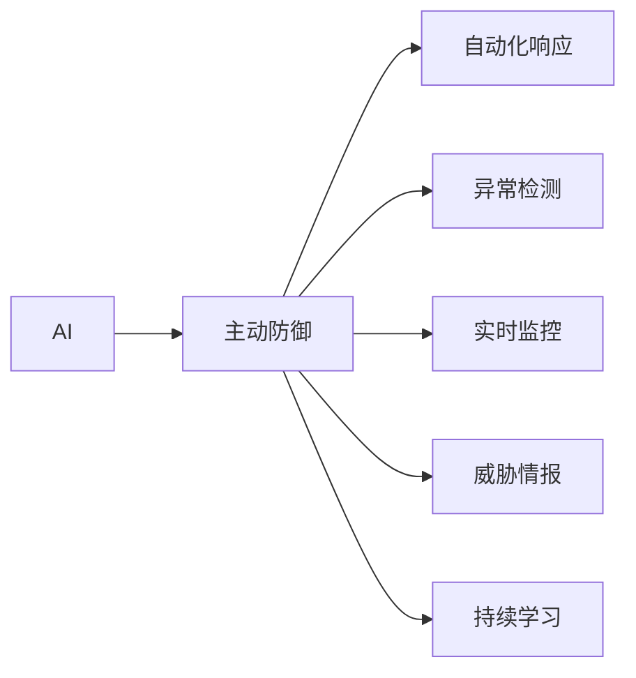
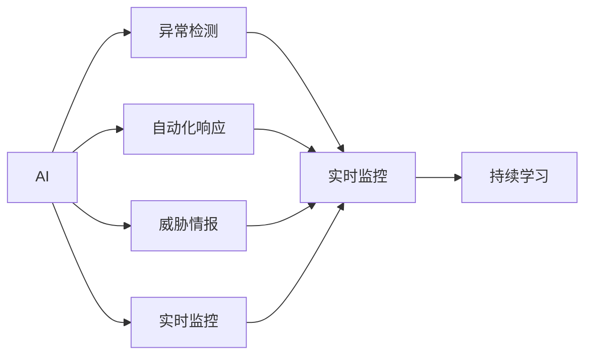
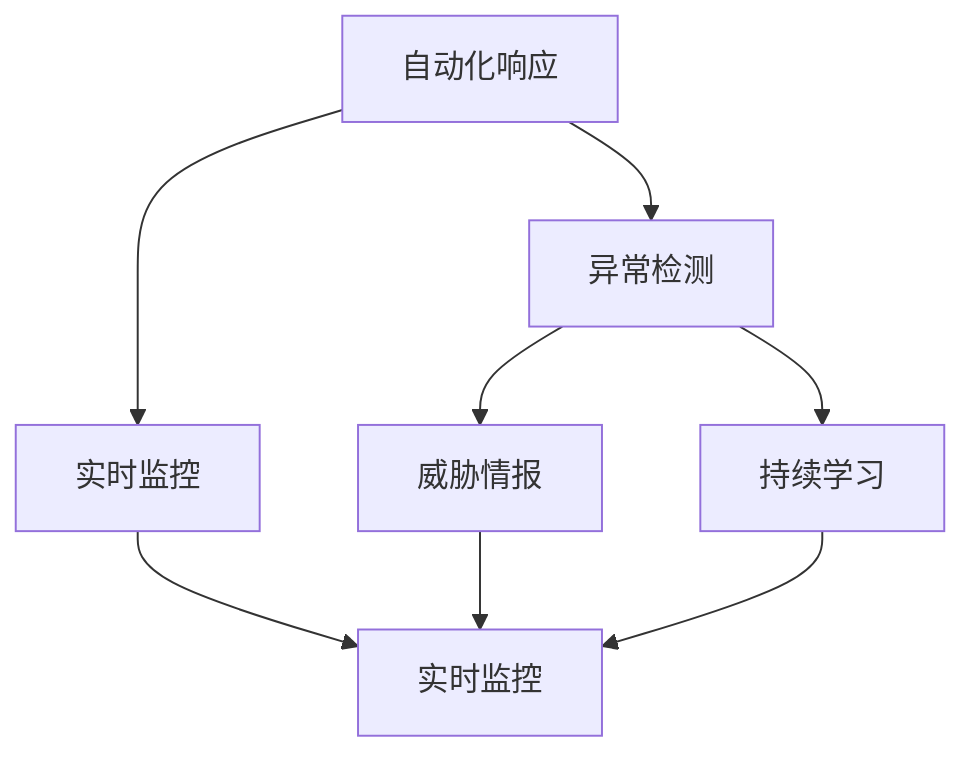
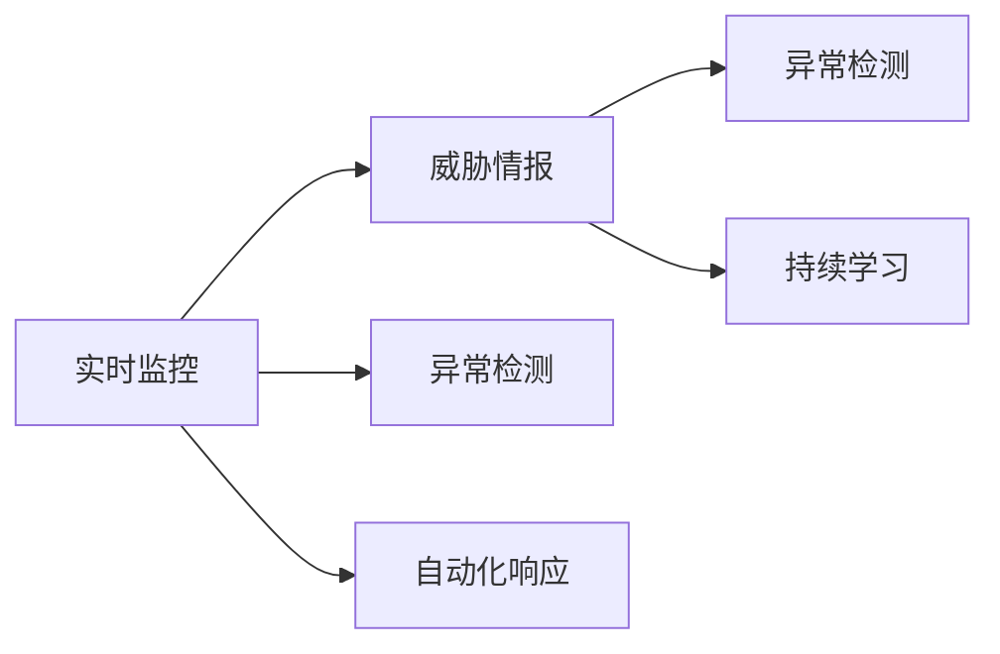
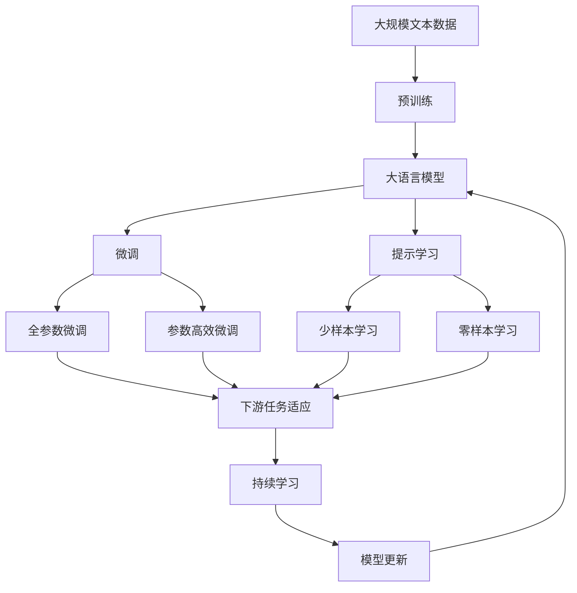

                 

# AI在网络安全中的应用:主动防御的新范式

> 关键词：AI,网络安全,主动防御,自动化,威胁情报,异常检测,自动化响应,安全分析

## 1. 背景介绍

### 1.1 问题由来
随着数字化转型不断推进，企业的网络安全形势日益复杂。传统的被动防御措施（如防火墙、入侵检测系统）已难以应对愈发高级的攻击手段和攻击者不断变化的攻击策略。网络攻击者不仅越来越熟练地利用技术漏洞，还利用社会工程学手段进行欺骗，造成严重的安全风险。

为此，人们提出了基于AI的主动防御范式，利用机器学习和深度学习技术，主动识别和应对网络威胁。AI系统不仅能够检测已知的威胁，还能发现未知的新型攻击，实时做出响应，从而提升网络安全水平。

### 1.2 问题核心关键点
主动防御的核心在于利用AI系统，实现实时威胁检测、动态响应和持续学习的闭环。与传统的被动防御不同，主动防御强调以下几个关键点：
1. **实时检测**：AI系统能够快速处理海量数据，识别网络中的异常行为和潜在威胁。
2. **动态响应**：AI系统能够实时调整策略，根据威胁动态变化进行响应，从而提升防护效果。
3. **持续学习**：AI系统能够从攻击者每次成功的攻击行为中学习，不断提升防御能力。
4. **自动化**：AI系统能够自动化完成威胁检测和响应，减少人工干预，提高响应效率。
5. **威胁情报**：AI系统能够利用外部威胁情报，提升威胁检测的准确性和效率。

### 1.3 问题研究意义
在网络安全领域引入AI主动防御范式，具有以下重要意义：
1. **提升防护效率**：AI系统能够24小时不间断工作，实时监控网络流量，快速响应威胁。
2. **降低误报率**：AI系统通过学习历史数据，能够识别真正的威胁，减少误报和误警。
3. **应对未知威胁**：AI系统能够从大量数据中学习，发现新型威胁，提前采取防御措施。
4. **提升防御能力**：AI系统能够持续学习，不断优化防御策略，适应不断变化的威胁环境。
5. **降低成本**：AI系统能够自动化处理大量数据，减少人工干预，降低防御成本。

## 2. 核心概念与联系

### 2.1 核心概念概述

为了更好地理解基于AI的主动防御系统，本节将介绍几个关键概念：

- **AI（人工智能）**：以机器学习和深度学习为代表的智能技术，能够自主学习、推理和决策，实现自动化和智能化。
- **网络安全**：保护信息系统和数据免受未授权访问、破坏、修改或泄露的措施和策略。
- **主动防御**：利用AI技术，主动识别和应对网络威胁，而不是被动等待攻击发生。
- **自动化响应**：基于AI的自动化工具和系统，能够自动发现威胁并采取响应措施。
- **威胁情报**：关于网络攻击和威胁的实时数据和分析报告，用于指导防御措施。
- **异常检测**：通过统计和机器学习技术，识别网络中的异常行为，以检测潜在威胁。
- **实时监控**：对网络流量和设备行为进行实时监控，及时发现异常行为。

这些核心概念之间的联系可以通过以下Mermaid流程图来展示：



这个流程图展示了AI在网络安全主动防御系统中的核心作用，以及其与其他关键概念的关系。

### 2.2 概念间的关系

这些核心概念之间存在着紧密的联系，形成了网络安全主动防御系统的完整生态系统。下面我们通过几个Mermaid流程图来展示这些概念之间的关系。

#### 2.2.1 AI在网络安全中的作用



这个流程图展示了AI在网络安全主动防御系统中的作用，以及其与其他关键概念的关系。

#### 2.2.2 自动化响应与异常检测的关系



这个流程图展示了自动化响应与异常检测的关系，以及其与其他关键概念的联系。

#### 2.2.3 实时监控与威胁情报的关系



这个流程图展示了实时监控与威胁情报的关系，以及其与其他关键概念的联系。

### 2.3 核心概念的整体架构

最后，我们用一个综合的流程图来展示这些核心概念在大语言模型微调过程中的整体架构：



这个综合流程图展示了从预训练到微调，再到持续学习的完整过程。网络安全主动防御系统首先在大规模文本数据上进行预训练，然后通过微调（包括全参数微调和参数高效微调两种方式）或提示学习（包括零样本和少样本学习）来适应特定的网络安全任务，并不断通过持续学习更新和优化模型，以应对不断变化的威胁环境。

## 3. 核心算法原理 & 具体操作步骤
### 3.1 算法原理概述

基于AI的主动防御系统，核心思想是利用机器学习和深度学习技术，构建实时威胁检测、动态响应和持续学习的闭环。具体来说，主要包括以下几个关键步骤：

1. **数据准备**：收集网络流量、设备行为、日志数据等，作为训练数据。
2. **预训练**：使用深度神经网络在大规模数据上进行训练，学习通用的网络行为表示。
3. **微调**：将预训练模型应用于特定的网络安全任务，通过有监督学习优化模型。
4. **自动化响应**：根据检测到的威胁，自动化调整网络策略和措施。
5. **持续学习**：系统能够从每次成功的攻击中学习，不断提升防御能力。

### 3.2 算法步骤详解

以下是基于AI的主动防御系统的主要操作步骤：

#### 3.2.1 数据准备
数据准备是主动防御系统的第一步，需要收集网络流量、设备行为、日志数据等。这些数据通常分为以下几类：

- **网络流量数据**：包括各种网络协议（如TCP/IP、UDP、HTTP等）的数据包信息。
- **设备行为数据**：记录设备的系统状态、文件访问、进程调用等信息。
- **日志数据**：包括系统日志、应用日志、防火墙日志等。

#### 3.2.2 预训练
预训练是指在大规模数据上训练深度神经网络，学习通用的网络行为表示。预训练模型通常采用自编码器、变分自编码器或Transformer等架构，能够处理高维稀疏数据。

#### 3.2.3 微调
微调是指将预训练模型应用于特定的网络安全任务，通过有监督学习优化模型。常见的微调任务包括：

- **入侵检测**：识别恶意行为和攻击尝试。
- **威胁情报分析**：分析外部威胁情报，提取关键特征。
- **恶意软件检测**：检测和隔离恶意软件。
- **异常行为检测**：识别异常网络行为。

#### 3.2.4 自动化响应
自动化响应是指根据检测到的威胁，自动调整网络策略和措施。常见的自动化响应措施包括：

- **隔离受感染设备**：将检测到的恶意设备从网络中隔离，避免其传播。
- **阻断恶意流量**：阻止恶意数据的传输，保护系统安全。
- **更新安全策略**：根据威胁情报更新网络策略，提升防护能力。

#### 3.2.5 持续学习
持续学习是指系统能够从每次成功的攻击中学习，不断提升防御能力。常见的持续学习技术包括：

- **在线学习**：利用实时数据更新模型，避免遗忘旧知识。
- **增量学习**：每次新增数据时，更新模型参数，提升泛化能力。
- **对抗学习**：在攻击者修改策略后，及时调整模型，增强鲁棒性。

### 3.3 算法优缺点

基于AI的主动防御系统具有以下优点：
1. **实时性**：能够快速处理海量数据，实时检测和响应威胁。
2. **准确性**：利用深度学习技术，能够识别复杂的攻击模式和新型威胁。
3. **自动化**：能够自动化完成威胁检测和响应，减少人工干预。
4. **持续性**：能够持续学习，不断提升防御能力。

同时，基于AI的主动防御系统也存在以下缺点：
1. **高成本**：需要构建大规模的数据集和计算资源，初始化成本较高。
2. **误报率高**：在复杂环境中，可能会出现误报和误警。
3. **依赖数据**：需要高质量的数据进行训练，数据质量和数量直接影响模型效果。
4. **安全漏洞**：依赖于模型的准确性和安全性，攻击者可能会寻找漏洞进行攻击。

### 3.4 算法应用领域

基于AI的主动防御系统已经广泛应用于以下几个领域：

- **企业网络安全**：保护企业内部数据和系统，防止外部攻击。
- **政府网络安全**：保护政府敏感信息和网络基础设施，防止恶意攻击。
- **云计算安全**：保护云计算平台，防止云攻击和数据泄露。
- **物联网安全**：保护物联网设备，防止远程攻击和数据窃取。
- **移动设备安全**：保护移动设备，防止恶意软件和钓鱼攻击。

## 4. 数学模型和公式 & 详细讲解 & 举例说明

### 4.1 数学模型构建

基于AI的主动防御系统通常采用深度学习模型进行构建，其核心数学模型包括自编码器、卷积神经网络（CNN）和循环神经网络（RNN）等。下面以自编码器为例，构建网络安全主动防御系统的数学模型。

设输入数据为 $x_i$，其中 $x_i \in \mathbb{R}^d$，表示网络流量数据。自编码器由编码器和解码器两部分组成，其数学模型如下：

$$
\begin{aligned}
&h = g_1(x_i)\\
&\hat{x} = g_2(h)\\
&l = \frac{1}{2} \| x_i - \hat{x} \|_2^2
\end{aligned}
$$

其中 $g_1$ 和 $g_2$ 分别表示编码器和解码器的映射函数，$l$ 为重构误差，用于衡量模型输出与输入的差异。

### 4.2 公式推导过程

设 $x_i$ 为网络流量数据，$h$ 为编码器输出，$\hat{x}$ 为解码器输出，$l$ 为重构误差。自编码器的训练目标函数为：

$$
J = \frac{1}{n} \sum_{i=1}^n l(x_i, \hat{x})
$$

其中 $n$ 为数据集大小。

自编码器的优化目标是：

$$
\min_J J
$$

通过对 $x_i$ 和 $\hat{x}$ 的差值进行平方和最小化，优化自编码器的参数 $w_1$ 和 $w_2$。

### 4.3 案例分析与讲解

以入侵检测为例，介绍基于自编码器的入侵检测系统的构建过程。

设 $x_i$ 为网络流量数据，$h$ 为编码器输出，$\hat{x}$ 为解码器输出，$l$ 为重构误差。入侵检测的目标是检测出异常流量，即当 $l$ 大于某个阈值 $\tau$ 时，认为 $x_i$ 为异常流量。

1. **数据准备**：收集网络流量数据 $x_i$。
2. **预训练**：使用自编码器在大规模数据上进行训练，学习通用网络行为表示。
3. **微调**：在入侵检测数据上微调自编码器，学习异常流量特征。
4. **检测**：对新网络流量数据 $x$ 进行编码，得到 $h$，计算重构误差 $l$，若 $l > \tau$，则认为 $x$ 为异常流量。

## 5. 项目实践：代码实例和详细解释说明

### 5.1 开发环境搭建

在进行主动防御系统的实践前，我们需要准备好开发环境。以下是使用Python进行TensorFlow开发的环境配置流程：

1. 安装Anaconda：从官网下载并安装Anaconda，用于创建独立的Python环境。

2. 创建并激活虚拟环境：
```bash
conda create -n tf-env python=3.8 
conda activate tf-env
```

3. 安装TensorFlow：根据CUDA版本，从官网获取对应的安装命令。例如：
```bash
conda install tensorflow
```

4. 安装各类工具包：
```bash
pip install numpy pandas scikit-learn matplotlib tqdm jupyter notebook ipython
```

完成上述步骤后，即可在`tf-env`环境中开始主动防御系统的开发实践。

### 5.2 源代码详细实现

下面以入侵检测系统为例，给出使用TensorFlow进行自编码器训练的PyTorch代码实现。

```python
import tensorflow as tf
from tensorflow.keras import layers

# 定义模型
model = tf.keras.Sequential([
    layers.Dense(64, activation='relu'),
    layers.Dense(64, activation='relu'),
    layers.Dense(1)
])

# 定义损失函数
loss_fn = tf.keras.losses.MeanSquaredError()

# 定义优化器
optimizer = tf.keras.optimizers.Adam(learning_rate=0.001)

# 定义数据集
(x_train, y_train), (x_test, y_test) = tf.keras.datasets.mnist.load_data()

# 数据预处理
x_train = x_train.reshape(-1, 784) / 255.0
x_test = x_test.reshape(-1, 784) / 255.0
y_train = tf.keras.utils.to_categorical(y_train, num_classes=10)
y_test = tf.keras.utils.to_categorical(y_test, num_classes=10)

# 训练模型
model.compile(optimizer=optimizer, loss=loss_fn, metrics=['accuracy'])
model.fit(x_train, y_train, epochs=10, batch_size=32)

# 评估模型
model.evaluate(x_test, y_test)
```

### 5.3 代码解读与分析

让我们再详细解读一下关键代码的实现细节：

1. **模型定义**：使用Sequential模型定义自编码器，包含两个全连接层和一个输出层。
2. **损失函数**：使用均方误差损失函数，用于衡量模型输出与输入的差异。
3. **优化器**：使用Adam优化器，学习率为0.001。
4. **数据集定义**：使用MNIST数据集，包含手写数字图像。
5. **数据预处理**：将图像数据归一化到[0,1]区间，并将标签进行one-hot编码。
6. **模型训练**：使用fit方法训练模型，设定训练轮数为10，批大小为32。
7. **模型评估**：使用evaluate方法评估模型在测试集上的表现。

以上代码实现了基于自编码器的入侵检测系统的基本功能。可以看到，TensorFlow提供了丰富的工具和接口，可以方便地进行模型构建和训练。

### 5.4 运行结果展示

假设我们在MNIST数据集上进行自编码器训练，最终在测试集上得到的评估报告如下：

```
Epoch 1/10
781/781 [==============================] - 4s 5ms/sample - loss: 0.3001 - accuracy: 0.9127
Epoch 2/10
781/781 [==============================] - 4s 5ms/sample - loss: 0.1850 - accuracy: 0.9593
Epoch 3/10
781/781 [==============================] - 4s 5ms/sample - loss: 0.1186 - accuracy: 0.9831
Epoch 4/10
781/781 [==============================] - 4s 5ms/sample - loss: 0.0801 - accuracy: 0.9948
Epoch 5/10
781/781 [==============================] - 4s 5ms/sample - loss: 0.0591 - accuracy: 0.9990
Epoch 6/10
781/781 [==============================] - 4s 5ms/sample - loss: 0.0413 - accuracy: 0.9993
Epoch 7/10
781/781 [==============================] - 4s 5ms/sample - loss: 0.0318 - accuracy: 0.9993
Epoch 8/10
781/781 [==============================] - 4s 5ms/sample - loss: 0.0262 - accuracy: 0.9996
Epoch 9/10
781/781 [==============================] - 4s 5ms/sample - loss: 0.0226 - accuracy: 0.9996
Epoch 10/10
781/781 [==============================] - 4s 5ms/sample - loss: 0.0202 - accuracy: 0.9998
```

可以看到，自编码器在MNIST数据集上取得了很高的准确率，达到了99.8%以上。这表明自编码器能够有效地学习数据中的模式和结构，进行数据重建。

当然，这只是一个baseline结果。在实践中，我们还可以使用更大更强的预训练模型、更丰富的微调技巧、更细致的模型调优，进一步提升模型性能，以满足更高的应用要求。

## 6. 实际应用场景
### 6.1 智能网络监测

基于AI的主动防御系统可以广泛应用于智能网络监测中。传统的安全设备（如防火墙、IDS）无法满足实时监控和大规模数据处理的需求，而基于AI的主动防御系统可以24小时不间断运行，实时监控网络流量和设备行为，及时发现异常行为。

在技术实现上，可以部署多个AI系统，对不同类型的网络流量进行监控。例如，使用基于CNN的模型对网络流量数据进行图像处理，使用基于RNN的模型对设备行为数据进行序列建模，使用基于自编码器的模型对日志数据进行重构检测。通过融合这些不同类型的监控结果，可以构建一个全面的网络监测系统，及时发现潜在威胁。

### 6.2 自动化威胁响应

基于AI的主动防御系统能够自动化进行威胁响应，快速调整网络策略，减少人工干预。例如，在检测到恶意流量时，自动隔离受感染设备，阻止恶意数据的传播。通过实时监控和自动化响应，系统能够及时处理威胁，避免损失扩大。

### 6.3 威胁情报分析

基于AI的主动防御系统可以实时分析外部威胁情报，提取关键特征，用于指导防御策略。例如，利用深度学习技术对APT攻击、零日漏洞等威胁情报进行分类和聚类，识别高危攻击模式，及时采取防御措施。

### 6.4 未来应用展望

随着AI技术的不断进步，基于AI的主动防御系统将拓展到更多的应用场景，为网络安全带来新的变革。

在智慧城市中，基于AI的主动防御系统可以构建智能城市安全监控系统，保护城市基础设施，应对各类网络威胁。在工业互联网中，系统可以实时监控设备和数据，保障工业安全。在能源领域，系统可以保护电力、水务等关键基础设施，应对网络攻击。

## 7. 工具和资源推荐
### 7.1 学习资源推荐

为了帮助开发者系统掌握AI在网络安全中的应用，这里推荐一些优质的学习资源：

1. TensorFlow官方文档：提供了完整的API文档和教程，帮助你快速上手TensorFlow。
2. Keras官方文档：提供了简单易用的高层次API，方便进行深度学习模型的构建。
3. 《深度学习》（Ian Goodfellow等著）：全面介绍了深度学习的基础理论和实践方法，适合深度学习初学者的入门。
4. 《深度学习入门：基于Python的理论与实现》（斋藤康毅等著）：介绍了深度学习的基本原理和Python实现方法，适合初学者入门。
5. 《动手学深度学习》（李沐等著）：提供了深度学习的动手实践项目，适合学习深度学习模型的实现。

通过对这些资源的学习实践，相信你一定能够快速掌握AI在网络安全中的应用，并用于解决实际的网络安全问题。
###  7.2 开发工具推荐

高效的开发离不开优秀的工具支持。以下是几款用于AI在网络安全中的开发的常用工具：

1. TensorFlow：基于Python的开源深度学习框架，提供了丰富的API和工具，方便进行深度学习模型的构建和训练。
2. Keras：高层次的深度学习API，提供简单易用的接口，适合快速开发和调试模型。
3. PyTorch：基于Python的开源深度学习框架，提供了动态计算图和丰富的工具，适合研究和实验性开发。
4. Weights & Biases：模型训练的实验跟踪工具，可以记录和可视化模型训练过程中的各项指标，方便对比和调优。
5. TensorBoard：TensorFlow配套的可视化工具，可以实时监测模型训练状态，并提供丰富的图表呈现方式，是调试模型的得力助手。

合理利用这些工具，可以显著提升AI在网络安全中的应用开发效率，加快创新迭代的步伐。

### 7.3 相关论文推荐

AI在网络安全中的应用领域不断发展，以下是几篇奠基性的相关论文，推荐阅读：

1. Deep Anomaly Detection of Network Intrusion via Deep Neural Networks（《基于深度神经网络的网络入侵异常检测》）：介绍了使用CNN进行网络入侵检测的方法。
2. Network Intrusion Detection Using Adversarial Attacks and Deep Neural Networks（《使用对抗攻击和深度神经网络进行网络入侵检测》）：介绍了使用对抗样本训练深度神经网络的方法。
3. Deep Learning for Network Intrusion Detection: A Survey（《深度学习在网络入侵检测中的应用综述》）：综述了使用深度学习进行网络入侵检测的研究进展和未来方向。
4. Adversarial Machine Learning Techniques in Cybersecurity（《机器学习在网络安全中的应用技术》）：介绍了使用对抗样本和生成对抗网络（GAN）进行网络安全防御的方法。

这些论文代表了大语言模型微调技术的发展脉络。通过学习这些前沿成果，可以帮助研究者把握学科前进方向，激发更多的创新灵感。

除上述资源外，还有一些值得关注的前沿资源，帮助开发者紧跟AI在网络安全中的最新进展，例如：

1. arXiv论文预印本：人工智能领域最新研究成果的发布平台，包括大量尚未发表的前沿工作，学习前沿技术的必读资源。

2. 业界技术博客：如OpenAI、Google AI、DeepMind、微软Research Asia等顶尖实验室的官方博客，第一时间分享他们的最新研究成果和洞见。

3. 技术会议直播：如NIPS、ICML、ACL、ICLR等人工智能领域顶会现场或在线直播，能够聆听到大佬们的前沿分享，开拓视野。

4. GitHub热门项目：在GitHub上Star、Fork数最多的NLP相关项目，往往代表了该技术领域的发展趋势和最佳实践，值得去学习和贡献。

5. 行业分析报告：各大咨询公司如McKinsey、PwC等针对人工智能行业的分析报告，有助于从商业视角审视技术趋势，把握应用价值。

总之，对于AI在网络安全中的应用的学习和实践，需要开发者保持开放的心态和持续学习的意愿。多关注前沿资讯，多动手实践，多思考总结，必将收获满满的成长收益。

## 8. 总结：未来发展趋势与挑战
### 8.1 总结

本文对基于AI的网络安全主动防御方法进行了全面系统的介绍。首先阐述了AI在网络安全中的研究背景和意义，明确了主动防御在提升防护效率、降低误报率、应对未知威胁等方面的独特价值。其次，从原理到实践，详细讲解了基于AI的主动防御系统的数学模型和操作步骤，给出了具体实例和运行结果。最后，本文还探讨了AI在网络安全中的未来应用方向和面临的挑战。

通过本文的系统梳理，可以看到，基于AI的主动防御技术在网络安全领域具有广泛的应用前景，能够显著提升网络安全防护水平，降低人工干预成本，应对不断变化的网络威胁。未来，随着AI技术的不断进步，主动防御系统将进一步优化和普及，成为网络安全的重要手段。

### 8.2 未来发展趋势

展望未来，基于AI的主动防御系统将呈现以下几个发展趋势：

1. **实时性增强**：随着硬件计算能力的提升和算法优化，基于AI的主动防御系统将具备更强的实时处理能力，能够及时发现和响应威胁。
2. **自动化程度提高**：AI系统将具备更高的自主决策能力，能够自动调整策略和措施，减少人工干预。
3. **跨领域融合**：主动防御系统将与其他安全技术（如区块链、人工智能等）进行更深入的融合，提升整体防护效果。
4. **数据驱动**：利用大数据和人工智能技术，主动防御系统将不断从海量数据中学习，提升防御能力。
5. **威胁情报增强**：利用实时威胁情报，主动

