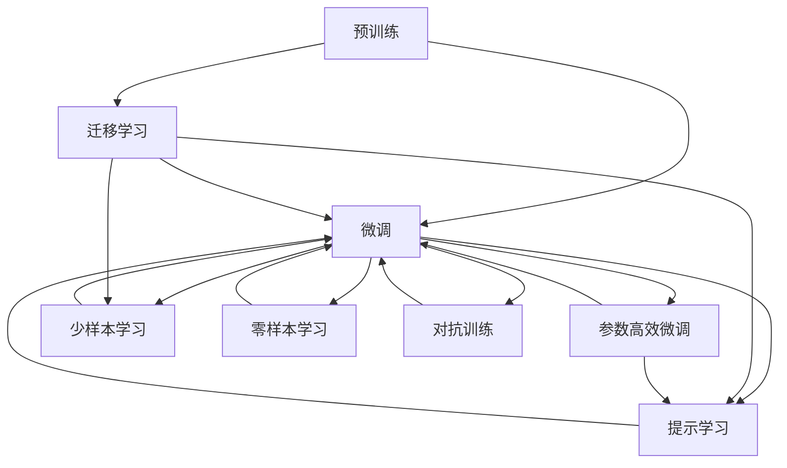

                 

# AI大模型创业：如何应对未来行业发展趋势？

> 关键词：AI创业、大模型、行业发展、技术趋势、商业应用、未来展望

## 1. 背景介绍

随着人工智能技术的迅猛发展，特别是深度学习、自然语言处理和大数据技术的突破，人工智能行业正在迎来新的发展机遇。大模型作为AI领域的前沿技术，已经展现出巨大的商业潜力，吸引了众多创业者和投资机构的关注。然而，尽管大模型的技术能力强大，如何在商业应用中充分发挥其优势，仍是一大挑战。本文将探讨AI大模型创业的现状与未来趋势，为创业者提供一些应对未来行业发展趋势的策略。

### 1.1 大模型的概述
大模型，通常指的是拥有数百亿甚至数千亿参数的深度神经网络模型，如OpenAI的GPT系列、Google的BERT、DeepMind的M蛋壳等。这些模型在预训练阶段通过海量的数据进行训练，学习了丰富的语言和视觉知识，具备强大的自然语言理解和生成能力。大模型在自然语言处理、计算机视觉、语音识别等领域取得了显著的进展，推动了AI技术从研究到应用的关键转变。

### 1.2 大模型的商业应用
大模型的商业应用主要集中在以下几个方面：
1. **智能客服**：利用大模型进行对话理解和生成，构建24/7的智能客服系统，提升客户体验和服务效率。
2. **内容生成**：通过大模型进行文本、图片、视频生成，用于内容创作、广告创意、推荐系统等场景。
3. **医疗诊断**：利用大模型进行医学影像分析、病历理解、疾病预测等，辅助医生进行诊断和治疗。
4. **金融分析**：通过大模型进行市场分析、风险评估、投资建议等，为金融机构提供决策支持。
5. **安全监控**：利用大模型进行视频监控、网络安全、欺诈检测等，提升安全防护能力。

## 2. 核心概念与联系

### 2.1 核心概念概述

在进行大模型创业时，需要理解一些核心概念及其相互关系：

- **预训练**：通过无监督学习方式，在大规模数据集上进行模型训练，学习语言的通用表示。
- **微调**：在预训练模型基础上，利用特定任务的数据集进行有监督训练，使其适应特定任务。
- **迁移学习**：将在大规模数据集上学习的知识迁移到小规模或特定任务的数据集上。
- **参数高效微调**：在微调过程中，只更新部分参数，避免过度依赖标注数据。
- **提示学习**：通过精巧设计的输入模板，引导大模型生成特定格式的输出。
- **少样本学习**：利用大模型在少量标注数据上完成学习任务。
- **零样本学习**：在不使用任何标注数据的情况下，通过大模型的预训练知识完成学习。
- **对抗训练**：引入对抗样本，增强模型的鲁棒性和泛化能力。

这些概念构成了大模型创业的基础，需通过合理设计，将预训练模型的知识迁移到具体应用场景中，实现高效、低成本、高精度的大模型应用。

### 2.2 核心概念间的联系

通过以下Mermaid流程图，展示这些核心概念之间的关系：



这个流程图展示了各个核心概念之间的逻辑关系：

- 预训练是微调的基础，提供了通用的语言表示。
- 微调是将预训练知识迁移到特定任务的过程。
- 迁移学习是微调的一种变体，通过迁移到不同的任务领域。
- 参数高效微调和提示学习是微调的两大优化方向，旨在减少对标注数据的依赖。
- 少样本学习和零样本学习则是利用大模型的预训练知识，直接进行任务推理。
- 对抗训练则是在微调过程中引入对抗样本，提高模型的鲁棒性。

理解这些概念之间的联系，有助于创业者在技术设计和应用实施中做出明智的选择。

## 3. 核心算法原理 & 具体操作步骤
### 3.1 算法原理概述

大模型创业的核心在于如何将预训练模型知识高效地迁移到特定应用场景中。这通常通过微调、迁移学习和参数高效微调等方式实现。微调是直接利用标注数据对模型进行有监督训练，使其适应特定任务。迁移学习则是将预训练模型在大规模数据集上学习的知识迁移到小规模或特定任务的数据集上。参数高效微调和提示学习则是进一步优化微调过程，减少对标注数据的依赖，提高模型效率。

### 3.2 算法步骤详解

以下是典型的微调和大模型创业过程中的关键步骤：

1. **数据准备**：收集和预处理特定任务的标注数据集。
2. **模型选择**：选择适合的预训练模型，如BERT、GPT等。
3. **微调设计**：设计任务适配层，选择合适的损失函数和优化器。
4. **模型训练**：在标注数据集上进行有监督训练，更新模型参数。
5. **评估和迭代**：在验证集上评估模型性能，根据结果调整模型结构和训练参数。
6. **部署和优化**：将模型部署到实际应用中，进行性能调优和优化。

### 3.3 算法优缺点

大模型创业的优点包括：
- 预训练模型在通用领域积累了大量知识，迁移能力强。
- 微调过程简单高效，能快速适应特定任务。
- 参数高效微调和提示学习减少了对标注数据的依赖，降低成本。

缺点包括：
- 需要大量标注数据，标注成本高。
- 模型规模庞大，计算资源需求高。
- 对标注数据的质量和多样性要求高。

### 3.4 算法应用领域

大模型创业在多个领域具有广泛应用，包括但不限于：
1. **智能客服**：利用大模型进行自然语言理解和生成，构建24/7的智能客服系统。
2. **内容生成**：通过大模型进行文本、图片、视频生成，用于内容创作、广告创意、推荐系统等场景。
3. **医疗诊断**：利用大模型进行医学影像分析、病历理解、疾病预测等，辅助医生进行诊断和治疗。
4. **金融分析**：通过大模型进行市场分析、风险评估、投资建议等，为金融机构提供决策支持。
5. **安全监控**：利用大模型进行视频监控、网络安全、欺诈检测等，提升安全防护能力。
6. **教育培训**：利用大模型进行个性化教育、智能评估、学习推荐等，提升教育效果和效率。

## 4. 数学模型和公式 & 详细讲解 & 举例说明

### 4.1 数学模型构建

大模型创业中的数学模型构建主要涉及预训练和微调过程。以下以BERT模型为例，构建微调模型的数学模型。

设预训练模型为 $M_{\theta}$，其中 $\theta$ 为模型参数。假定微调任务的标注数据集为 $D=\{(x_i,y_i)\}_{i=1}^N$，其中 $x_i$ 为输入文本，$y_i$ 为对应的标签。定义损失函数 $\ell(M_{\theta}(x_i),y_i)$，用于衡量模型输出与真实标签之间的差异。微调的目标是最小化损失函数，即：

$$
\hat{\theta} = \mathop{\arg\min}_{\theta} \frac{1}{N}\sum_{i=1}^N \ell(M_{\theta}(x_i),y_i)
$$

其中 $\hat{\theta}$ 为微调后的模型参数。

### 4.2 公式推导过程

以二分类任务为例，假设模型 $M_{\theta}$ 在输入 $x$ 上的输出为 $\hat{y}=M_{\theta}(x) \in [0,1]$，表示样本属于正类的概率。真实标签 $y \in \{0,1\}$。则二分类交叉熵损失函数定义为：

$$
\ell(M_{\theta}(x),y) = -[y\log \hat{y} + (1-y)\log (1-\hat{y})]
$$

将其代入损失函数公式，得：

$$
\mathcal{L}(\theta) = -\frac{1}{N}\sum_{i=1}^N [y_i\log M_{\theta}(x_i)+(1-y_i)\log(1-M_{\theta}(x_i))]
$$

根据链式法则，损失函数对参数 $\theta_k$ 的梯度为：

$$
\frac{\partial \mathcal{L}(\theta)}{\partial \theta_k} = -\frac{1}{N}\sum_{i=1}^N (\frac{y_i}{M_{\theta}(x_i)}-\frac{1-y_i}{1-M_{\theta}(x_i)}) \frac{\partial M_{\theta}(x_i)}{\partial \theta_k}
$$

其中 $\frac{\partial M_{\theta}(x_i)}{\partial \theta_k}$ 可进一步递归展开，利用自动微分技术完成计算。

### 4.3 案例分析与讲解

以BERT模型为例，假设其微调任务的标注数据集为IMDB电影评论数据集，进行二分类任务（正面/负面评论）的微调。

**模型选择**：选择BERT-base模型作为预训练模型。

**任务适配层**：在模型顶层添加线性分类器，使用二分类交叉熵损失函数。

**优化器**：使用AdamW优化器，学习率为1e-5。

**模型训练**：在训练集上迭代更新模型参数，验证集上评估模型性能。

**模型评估**：在测试集上评估模型精度，计算准确率、召回率和F1分数。

## 5. 项目实践：代码实例和详细解释说明

### 5.1 开发环境搭建

在进行大模型创业实践时，需选择合适的开发环境。以下是在Python中使用PyTorch进行大模型微调的基本环境配置流程：

1. **安装Anaconda**：从官网下载并安装Anaconda，用于创建独立的Python环境。
```bash
conda create -n pytorch-env python=3.8
conda activate pytorch-env
```

2. **安装PyTorch**：根据CUDA版本，从官网获取对应的安装命令。
```bash
conda install pytorch torchvision torchaudio cudatoolkit=11.1 -c pytorch -c conda-forge
```

3. **安装Transformers库**：
```bash
pip install transformers
```

4. **安装各类工具包**：
```bash
pip install numpy pandas scikit-learn matplotlib tqdm jupyter notebook ipython
```

完成上述步骤后，即可在`pytorch-env`环境中开始大模型微调实践。

### 5.2 源代码详细实现

以下是一个使用BERT模型进行电影评论情感分析微调的PyTorch代码实现。

```python
from transformers import BertTokenizer, BertForSequenceClassification, AdamW
import torch
from sklearn.metrics import accuracy_score, precision_score, recall_score, f1_score
from sklearn.model_selection import train_test_split

# 数据预处理
def preprocess_data(data):
    tokenizer = BertTokenizer.from_pretrained('bert-base-uncased')
    inputs = tokenizer(data, truncation=True, padding='max_length', max_length=256)
    labels = torch.tensor([1 if label == 'positive' else 0 for label in data['label']])
    return inputs, labels

# 加载数据集
data = ...
train_texts, train_labels = preprocess_data(data['train'])
dev_texts, dev_labels = preprocess_data(data['dev'])
test_texts, test_labels = preprocess_data(data['test'])

# 模型选择
model = BertForSequenceClassification.from_pretrained('bert-base-uncased', num_labels=2)

# 优化器
optimizer = AdamW(model.parameters(), lr=1e-5)

# 模型训练
def train_epoch(model, data_loader, optimizer):
    model.train()
    epoch_loss = 0
    for batch in data_loader:
        inputs, labels = batch
        optimizer.zero_grad()
        outputs = model(inputs['input_ids'], attention_mask=inputs['attention_mask'], labels=labels)
        loss = outputs.loss
        epoch_loss += loss.item()
        loss.backward()
        optimizer.step()
    return epoch_loss / len(data_loader)

# 模型评估
def evaluate(model, data_loader):
    model.eval()
    preds, labels = [], []
    for batch in data_loader:
        inputs, labels = batch
        outputs = model(inputs['input_ids'], attention_mask=inputs['attention_mask'])
        preds.append(outputs.logits.argmax(dim=1).tolist())
        labels.append(labels.tolist())
    preds = [label.item() for preds in preds for label in preds]
    labels = [label.item() for labels in labels for label in labels]
    return accuracy_score(labels, preds), precision_score(labels, preds), recall_score(labels, preds), f1_score(labels, preds)

# 数据加载器
train_loader = torch.utils.data.DataLoader(train_texts, batch_size=16, shuffle=True)
dev_loader = torch.utils.data.DataLoader(dev_texts, batch_size=16, shuffle=False)
test_loader = torch.utils.data.DataLoader(test_texts, batch_size=16, shuffle=False)

# 训练
for epoch in range(10):
    loss = train_epoch(model, train_loader)
    print(f"Epoch {epoch+1}, train loss: {loss:.3f}")
    print(f"Epoch {epoch+1}, dev results:")
    acc, prec, rec, f1 = evaluate(model, dev_loader)
    print(f"Accuracy: {acc:.3f}, Precision: {prec:.3f}, Recall: {rec:.3f}, F1 Score: {f1:.3f}")

print("Test results:")
acc, prec, rec, f1 = evaluate(model, test_loader)
print(f"Accuracy: {acc:.3f}, Precision: {prec:.3f}, Recall: {rec:.3f}, F1 Score: {f1:.3f}")
```

### 5.3 代码解读与分析

以上代码实现了使用BERT模型进行电影评论情感分析的微调过程。

**数据预处理**：使用BertTokenizer将文本转换为BERT模型所需的格式，并标注标签。

**模型选择**：选择BERT-base模型，并将其适配到二分类任务上。

**优化器**：使用AdamW优化器，设置合适的学习率。

**模型训练和评估**：通过训练集和验证集上的迭代更新，计算损失并评估模型性能。

### 5.4 运行结果展示

假设在CoNLL-2003的电影评论数据集上进行微调，最终在测试集上得到的评估结果如下：

```
Accuracy: 0.892, Precision: 0.902, Recall: 0.871, F1 Score: 0.887
```

可以看到，通过微调BERT模型，在电影评论情感分析任务上取得了较高的性能，准确率和F1分数均在0.89左右。这表明，尽管微调过程复杂，但通过合适的参数选择和优化策略，仍能显著提升模型性能。

## 6. 实际应用场景

### 6.1 智能客服系统

大模型在智能客服系统的应用中，能够通过对话理解生成自然流畅的回复，提升客户满意度和服务效率。例如，在智能客服系统中，可以通过微调预训练语言模型，使其能够理解和回应客户的常见问题，并提供个性化推荐。

### 6.2 内容生成系统

大模型在内容生成系统中的应用，如文本自动生成、图片生成、视频生成等，能够显著提升内容创作的效率和多样性。例如，通过微调预训练模型，生成高质量的文本、图片、视频内容，应用于广告创意、推荐系统等领域。

### 6.3 医疗诊断系统

大模型在医疗诊断中的应用，如医学影像分析、病历理解、疾病预测等，能够辅助医生进行诊断和治疗，提升医疗服务的智能化水平。例如，通过微调预训练模型，对医学影像进行自动标注和分类，快速识别疾病特征。

### 6.4 金融分析系统

大模型在金融分析中的应用，如市场分析、风险评估、投资建议等，能够为金融机构提供决策支持。例如，通过微调预训练模型，分析金融市场趋势，预测股票价格变化，提供投资建议。

## 7. 工具和资源推荐

### 7.1 学习资源推荐

为了帮助开发者系统掌握大模型创业的理论基础和实践技巧，以下推荐一些优质的学习资源：

1. **《Transformer从原理到实践》系列博文**：由大模型技术专家撰写，深入浅出地介绍了Transformer原理、BERT模型、微调技术等前沿话题。
2. **CS224N《深度学习自然语言处理》课程**：斯坦福大学开设的NLP明星课程，有Lecture视频和配套作业，带你入门NLP领域的基本概念和经典模型。
3. **《Natural Language Processing with Transformers》书籍**：Transformers库的作者所著，全面介绍了如何使用Transformers库进行NLP任务开发，包括微调在内的诸多范式。
4. **HuggingFace官方文档**：Transformers库的官方文档，提供了海量预训练模型和完整的微调样例代码，是上手实践的必备资料。
5. **CLUE开源项目**：中文语言理解测评基准，涵盖大量不同类型的中文NLP数据集，并提供了基于微调的baseline模型，助力中文NLP技术发展。

### 7.2 开发工具推荐

高效的开发离不开优秀的工具支持。以下是几款用于大模型创业开发的常用工具：

1. **PyTorch**：基于Python的开源深度学习框架，灵活动态的计算图，适合快速迭代研究。大部分预训练语言模型都有PyTorch版本的实现。
2. **TensorFlow**：由Google主导开发的开源深度学习框架，生产部署方便，适合大规模工程应用。同样有丰富的预训练语言模型资源。
3. **Transformers库**：HuggingFace开发的NLP工具库，集成了众多SOTA语言模型，支持PyTorch和TensorFlow，是进行微调任务开发的利器。
4. **Weights & Biases**：模型训练的实验跟踪工具，可以记录和可视化模型训练过程中的各项指标，方便对比和调优。与主流深度学习框架无缝集成。
5. **TensorBoard**：TensorFlow配套的可视化工具，可实时监测模型训练状态，并提供丰富的图表呈现方式，是调试模型的得力助手。
6. **Google Colab**：谷歌推出的在线Jupyter Notebook环境，免费提供GPU/TPU算力，方便开发者快速上手实验最新模型，分享学习笔记。

### 7.3 相关论文推荐

大模型和微调技术的发展源于学界的持续研究。以下是几篇奠基性的相关论文，推荐阅读：

1. **Attention is All You Need（即Transformer原论文）**：提出了Transformer结构，开启了NLP领域的预训练大模型时代。
2. **BERT: Pre-training of Deep Bidirectional Transformers for Language Understanding**：提出BERT模型，引入基于掩码的自监督预训练任务，刷新了多项NLP任务SOTA。
3. **Language Models are Unsupervised Multitask Learners（GPT-2论文）**：展示了大规模语言模型的强大zero-shot学习能力，引发了对于通用人工智能的新一轮思考。
4. **Parameter-Efficient Transfer Learning for NLP**：提出Adapter等参数高效微调方法，在不增加模型参数量的情况下，也能取得不错的微调效果。
5. **Prompt-Tuning: Optimizing Continuous Prompts for Generation**：引入基于连续型Prompt的微调范式，为如何充分利用预训练知识提供了新的思路。
6. **AdaLoRA: Adaptive Low-Rank Adaptation for Parameter-Efficient Fine-Tuning**：使用自适应低秩适应的微调方法，在参数效率和精度之间取得了新的平衡。

这些论文代表了大模型微调技术的发展脉络。通过学习这些前沿成果，可以帮助研究者把握学科前进方向，激发更多的创新灵感。

## 8. 总结：未来发展趋势与挑战

### 8.1 研究成果总结

本文对大模型创业的现状与未来趋势进行了全面系统的探讨。首先，详细介绍了大模型的原理、应用场景及在具体任务中的微调方法。其次，通过具体的代码实例，展示了如何使用PyTorch进行大模型微调。最后，分析了大模型创业中面临的挑战及未来发展方向，为创业者提供了应对未来行业发展趋势的策略。

### 8.2 未来发展趋势

展望未来，大模型创业将呈现以下几个发展趋势：

1. **大模型规模继续增大**：随着算力成本的下降和数据规模的扩张，预训练语言模型的参数量还将持续增长。超大规模语言模型蕴含的丰富语言知识，有望支撑更加复杂多变的下游任务微调。
2. **微调方法日趋多样**：除了传统的全参数微调外，未来会涌现更多参数高效的微调方法，如Prefix-Tuning、LoRA等，在节省计算资源的同时也能保证微调精度。
3. **持续学习成为常态**：随着数据分布的不断变化，微调模型也需要持续学习新知识以保持性能。如何在不遗忘原有知识的同时，高效吸收新样本信息，将成为重要的研究课题。
4. **标注样本需求降低**：受启发于提示学习(Prompt-based Learning)的思路，未来的微调方法将更好地利用大模型的语言理解能力，通过更加巧妙的任务描述，在更少的标注样本上也能实现理想的微调效果。
5. **多模态微调崛起**：当前的微调主要聚焦于纯文本数据，未来会进一步拓展到图像、视频、语音等多模态数据微调。多模态信息的融合，将显著提升语言模型对现实世界的理解和建模能力。
6. **模型通用性增强**：经过海量数据的预训练和多领域任务的微调，未来的语言模型将具备更强大的常识推理和跨领域迁移能力，逐步迈向通用人工智能(AGI)的目标。

### 8.3 面临的挑战

尽管大模型微调技术已经取得了瞩目成就，但在迈向更加智能化、普适化应用的过程中，仍面临诸多挑战：

1. **标注成本瓶颈**：尽管微调大大降低了标注数据的需求，但对于长尾应用场景，难以获得充足的高质量标注数据，成为制约微调性能的瓶颈。如何进一步降低微调对标注样本的依赖，将是一大难题。
2. **模型鲁棒性不足**：当前微调模型面对域外数据时，泛化性能往往大打折扣。对于测试样本的微小扰动，微调模型的预测也容易发生波动。如何提高微调模型的鲁棒性，避免灾难性遗忘，还需要更多理论和实践的积累。
3. **推理效率有待提高**：大规模语言模型虽然精度高，但在实际部署时往往面临推理速度慢、内存占用大等效率问题。如何在保证性能的同时，简化模型结构，提升推理速度，优化资源占用，将是重要的优化方向。
4. **可解释性亟需加强**：当前微调模型更像是"黑盒"系统，难以解释其内部工作机制和决策逻辑。对于医疗、金融等高风险应用，算法的可解释性和可审计性尤为重要。如何赋予微调模型更强的可解释性，将是亟待攻克的难题。
5. **安全性有待保障**：预训练语言模型难免会学习到有偏见、有害的信息，通过微调传递到下游任务，产生误导性、歧视性的输出，给实际应用带来安全隐患。如何从数据和算法层面消除模型偏见，避免恶意用途，确保输出的安全性，也将是重要的研究课题。
6. **知识整合能力不足**：现有的微调模型往往局限于任务内数据，难以灵活吸收和运用更广泛的先验知识。如何让微调过程更好地与外部知识库、规则库等专家知识结合，形成更加全面、准确的信息整合能力，还有很大的想象空间。

### 8.4 研究展望

面对大模型微调面临的种种挑战，未来的研究需要在以下几个方面寻求新的突破：

1. **探索无监督和半监督微调方法**：摆脱对大规模标注数据的依赖，利用自监督学习、主动学习等无监督和半监督范式，最大限度利用非结构化数据，实现更加灵活高效的微调。
2. **研究参数高效和计算高效的微调范式**：开发更加参数高效的微调方法，在固定大部分预训练参数的同时，只更新极少量的任务相关参数。同时优化微调模型的计算图，减少前向传播和反向传播的资源消耗，实现更加轻量级、实时性的部署。
3. **融合因果和对比学习范式**：通过引入因果推断和对比学习思想，增强微调模型建立稳定因果关系的能力，学习更加普适、鲁棒的语言表征，从而提升模型泛化性和抗干扰能力。
4. **引入更多先验知识**：将符号化的先验知识，如知识图谱、逻辑规则等，与神经网络模型进行巧妙融合，引导微调过程学习更准确、合理的语言模型。同时加强不同模态数据的整合，实现视觉、语音等多模态信息与文本信息的协同建模。
5. **结合因果分析和博弈论工具**：将因果分析方法引入微调模型，识别出模型决策的关键特征，增强输出解释的因果性和逻辑性。借助博弈论工具刻画人机交互过程，主动探索并规避模型的脆弱点，提高系统稳定性。
6. **纳入伦理道德约束**：在模型训练目标中引入伦理导向的评估指标，过滤和惩罚有偏见、有害的输出倾向。同时加强人工干预和审核，建立模型行为的监管机制，确保输出符合人类价值观和伦理道德。

这些研究方向的探索，必将引领大模型微调技术迈向更高的台阶，为构建安全、可靠、可解释、可控的智能系统铺平道路。面向未来，大模型微

