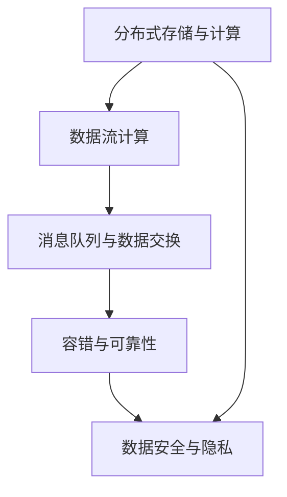
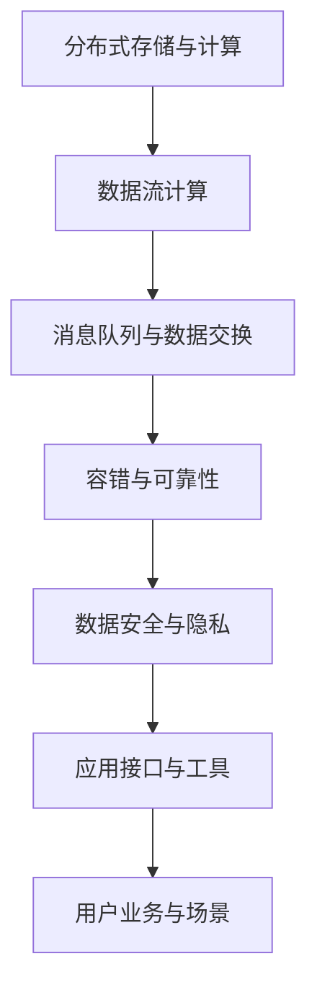

                 

## 1. 背景介绍

### 1.1 问题由来
随着互联网和物联网的普及，数据量呈现爆炸性增长，如何高效地存储、处理和分析这些数据成为了当前IT行业的重大挑战。传统的单机和集中式数据处理架构已难以应对大规模数据存储和计算需求，分布式数据处理框架成为主流的解决方案。Hadoop生态是大数据处理框架的代表，它以MapReduce计算模型为核心，提供了一套成熟的数据处理、存储和管理工具，广泛应用于各种行业。但传统Hadoop生态的复杂性、使用门槛和社区活跃度不足等问题也逐渐显现。因此，我们亟需一种更加轻量、灵活、易于维护的大数据处理框架，以满足不断变化的需求。

### 1.2 问题核心关键点
大数据处理框架的研发和应用，需要解决以下关键问题：
- 如何设计高效的数据存储与传输机制，支持大规模数据处理。
- 如何实现数据并行计算，充分利用分布式计算资源。
- 如何设计易于扩展的架构，支持系统水平升级和模块替换。
- 如何快速、便捷地集成业务逻辑和分析算法。
- 如何保障数据安全和隐私，实现数据的合规存储和处理。

### 1.3 问题研究意义
研发和应用大数据处理框架，对于提升数据处理效率、优化业务决策、推动产业升级具有重要意义：
- 降低开发成本。提供高效、易用的数据处理工具，减少开发和运维工作量。
- 提升数据价值。通过数据聚合、分析和可视化，挖掘数据中隐藏的业务洞察和趋势。
- 支持业务创新。快速迭代数据模型和算法，持续提升产品和服务质量。
- 保障数据安全。提供数据加密、访问控制等安全措施，保障数据隐私和安全。
- 推动产业升级。为传统行业数字化转型提供有力支撑，提升产业整体竞争力。

## 2. 核心概念与联系

### 2.1 核心概念概述
为了理解大数据处理框架的原理，首先需要理解几个核心概念：

- **分布式存储与计算**：通过分布式存储和并行计算技术，实现大规模数据的存储、处理和分析。
- **数据流计算**：数据流计算模型通过流水线方式处理数据，实现高效、实时的数据处理。
- **消息队列与数据交换**：通过消息队列技术，实现分布式系统中的数据交换和同步。
- **容错与可靠性**：通过容错和可靠性设计，保障数据处理过程的鲁棒性和可用性。
- **数据安全与隐私**：通过加密、访问控制等措施，保障数据处理过程中的隐私和安全。

### 2.2 概念间的关系

为更好地理解大数据处理框架，我们通过以下几个Mermaid流程图来展示这些核心概念之间的关系。



这个流程图展示了大数据处理框架的几个核心概念及其关系：
1. 分布式存储与计算是大数据处理框架的基础，通过分布式存储和并行计算技术，实现大规模数据的存储和处理。
2. 数据流计算是数据处理的核心模型，通过流水线方式实现高效、实时的数据处理。
3. 消息队列与数据交换是分布式系统中的关键技术，通过消息队列实现系统间的同步和通信。
4. 容错与可靠性保障系统的稳定性和可用性，确保数据处理过程的鲁棒性。
5. 数据安全与隐私通过加密、访问控制等措施，保障数据处理的隐私和安全。

这些概念共同构成了大数据处理框架的基本架构，帮助其实现高效、安全、可靠的数据处理功能。

### 2.3 核心概念的整体架构

最后，我们用一个综合的流程图来展示这些核心概念在大数据处理框架中的整体架构：



这个综合流程图展示了大数据处理框架从数据存储与计算到应用接口与工具，再到用户业务与场景的完整流程。通过这些核心概念的协同作用，大数据处理框架能够高效地实现数据处理功能，满足用户多样化的应用需求。

## 3. 核心算法原理 & 具体操作步骤
### 3.1 算法原理概述
大数据处理框架的核心算法原理主要基于分布式存储与计算、数据流计算、消息队列与数据交换等技术。其中，MapReduce计算模型是大数据处理框架的基石，通过分布式计算和数据流技术，实现大规模数据的存储、处理和分析。

MapReduce计算模型分为Map和Reduce两个阶段：
- **Map阶段**：将输入数据切分成多个小数据块，并行地对每个小数据块进行局部处理。
- **Reduce阶段**：将Map阶段的结果合并计算，生成最终的输出结果。

该计算模型具有以下优点：
- 可扩展性：支持大规模分布式计算，能够处理海量数据。
- 容错性：通过数据冗余和容错机制，保障数据处理的鲁棒性。
- 高效性：通过数据本地性优化和任务调度，实现高效的并行计算。

### 3.2 算法步骤详解
基于MapReduce计算模型的数据处理框架，一般包括以下几个关键步骤：

**Step 1: 数据分布存储**
- 选择合适的分布式存储系统，如HDFS、Ceph等，将数据分散存储在多个节点上。
- 利用数据冗余技术，保障数据的可靠性和容错性。

**Step 2: 数据并行计算**
- 使用MapReduce计算模型，将数据任务切分成多个Map任务并行执行。
- 在Reduce任务中对Map任务的输出结果进行合并和计算，生成最终输出。
- 通过数据本地性和任务调度优化，提高计算效率。

**Step 3: 数据流处理**
- 引入数据流计算模型，通过流式数据处理技术，实现高效、实时的数据处理。
- 通过事件驱动的流处理引擎，如Apache Kafka、Apache Flink等，实现数据的高效传输和处理。

**Step 4: 消息队列与数据交换**
- 使用消息队列技术，实现分布式系统中的数据交换和同步。
- 通过消息队列，实现系统的异步通信和数据传递。

**Step 5: 数据安全和隐私保护**
- 使用数据加密、访问控制等技术，保障数据处理过程中的隐私和安全。
- 引入数据匿名化、差分隐私等技术，保护用户隐私。

**Step 6: 系统监控与优化**
- 通过系统监控工具，实时监测系统运行状态和性能指标。
- 根据系统监控结果，优化任务调度、资源分配等策略，提升系统性能。

### 3.3 算法优缺点
基于MapReduce计算模型的大数据处理框架，具有以下优点：
- 可扩展性：支持大规模分布式计算，能够处理海量数据。
- 容错性：通过数据冗余和容错机制，保障数据处理的鲁棒性。
- 高效性：通过数据本地性和任务调度优化，实现高效的并行计算。

同时，也存在以下缺点：
- 延迟高：MapReduce计算模型需要经过Map和Reduce两个阶段，延迟较高。
- 复杂度高：系统架构复杂，需要较高的运维和调优能力。
- 数据倾斜：数据分布不均可能导致计算资源不均衡，影响系统性能。

### 3.4 算法应用领域
大数据处理框架广泛应用于以下领域：

**金融领域**
- 大数据风控：通过大数据处理框架，实现风险评估和欺诈检测。
- 量化交易：通过大数据处理框架，实现实时交易数据分析和决策。

**电商领域**
- 推荐系统：通过大数据处理框架，实现用户行为分析和推荐算法。
- 广告投放：通过大数据处理框架，实现广告点击率和转化率分析。

**医疗领域**
- 病例分析：通过大数据处理框架，实现病历数据分析和疾病预测。
- 基因组学：通过大数据处理框架，实现基因序列分析和基因变异检测。

**政府领域**
- 公共安全：通过大数据处理框架，实现异常事件监测和预警。
- 应急管理：通过大数据处理框架，实现灾害预测和应急响应。

**智慧城市**
- 智能交通：通过大数据处理框架，实现交通流量分析和优化。
- 智能监控：通过大数据处理框架，实现城市监控和管理。

**工业领域**
- 工业物联网：通过大数据处理框架，实现设备状态监测和故障诊断。
- 供应链管理：通过大数据处理框架，实现供应链数据整合和优化。

## 4. 数学模型和公式 & 详细讲解 & 举例说明
### 4.1 数学模型构建

为了更严格地描述大数据处理框架，我们引入数学模型进行建模。

假设输入数据为 $D$，数据流计算模型为 $M$，分布式存储系统为 $S$，容错机制为 $F$，数据安全措施为 $S$。大数据处理框架的整体模型可以表示为：

$$
\text{Dataflow Framework} = \text{MapReduce} \times \text{Datastream} \times \text{Distributed Storage} \times \text{Fault Tolerance} \times \text{Data Security}
$$

其中，MapReduce表示数据流计算模型，Datastream表示数据流处理，Distributed Storage表示分布式存储系统，Fault Tolerance表示容错机制，Data Security表示数据安全措施。

### 4.2 公式推导过程

考虑一个简单的MapReduce计算任务，输入数据 $D$ 分为 $n$ 个数据块 $D_1, D_2, ..., D_n$。Map阶段对每个数据块 $D_i$ 进行局部处理，得到 $m_i$ 个中间结果 $O_i = \{O_{i,j}\}$。Reduce阶段对所有中间结果 $O_i$ 进行合并和计算，生成最终输出 $R$。

设 $\text{Map}(D_i)$ 表示对数据块 $D_i$ 的Map操作，$\text{Reduce}(O_i)$ 表示对中间结果 $O_i$ 的Reduce操作。则MapReduce计算过程可以表示为：

$$
\text{MapReduce}(D) = \bigcup_{i=1}^n \text{Map}(D_i) \times \text{Reduce}(O_i)
$$

### 4.3 案例分析与讲解
以金融风控系统为例，大数据处理框架的应用步骤如下：

1. **数据收集与存储**
   - 收集用户的交易记录、行为数据等，存储在分布式文件系统中。
   - 使用HDFS、Ceph等分布式存储系统，保障数据的可靠性和可扩展性。

2. **数据预处理**
   - 对收集到的数据进行清洗、去重和格式化处理。
   - 使用分布式数据清洗工具，如Apache Flume，进行数据预处理。

3. **数据建模与分析**
   - 使用MapReduce计算模型，对清洗后的数据进行建模和分析。
   - 引入数据流计算模型，实现实时的数据分析和监测。

4. **风险评估与检测**
   - 对用户行为数据进行建模，生成风险评分。
   - 利用机器学习算法，实现欺诈检测和风险预警。

5. **结果展示与反馈**
   - 将风险评估结果展示给用户和管理员。
   - 根据用户反馈和系统监控结果，持续优化风险评估模型。

## 5. 项目实践：代码实例和详细解释说明
### 5.1 开发环境搭建

在进行大数据处理框架的开发和实践前，我们需要准备好开发环境。以下是使用Python进行PySpark开发的环境配置流程：

1. 安装Python和PySpark：从官网下载并安装Python和PySpark，确保版本兼容。
2. 配置环境变量：设置SPARK_HOME、PYTHONPATH等环境变量，指向Spark安装目录和Python脚本路径。
3. 安装必要的依赖包：使用pip命令安装所需的依赖包，如numpy、pandas等。

完成上述步骤后，即可在Spark集群上开始开发和实践。

### 5.2 源代码详细实现

下面我们以一个简单的金融风控系统为例，给出使用PySpark进行大数据处理的代码实现。

首先，定义数据处理函数：

```python
from pyspark.sql import SparkSession

def process_data(spark, input_path, output_path):
    # 读取输入数据
    df = spark.read.csv(input_path, header=True, inferSchema=True)

    # 数据清洗和预处理
    df = df.drop_duplicates().dropna() # 去重和处理缺失值
    df = df.select(['user_id', 'amount', 'timestamp']) # 选择必要字段

    # 数据建模与分析
    df = df.groupBy('user_id').sum('amount') # 计算每个用户的总消费金额
    df = df.sortBy('amount', ascending=False) # 按照消费金额排序

    # 将结果写入输出文件
    df.write.csv(output_path, header=True)
```

然后，启动Spark集群并执行数据处理任务：

```python
from pyspark import SparkConf, SparkContext

# 创建Spark会话
conf = SparkConf().setAppName('financial_risk').setMaster('local[2]')
spark = SparkSession.builder.config(conf=conf).getOrCreate()

# 读取输入数据
input_path = '/path/to/input/data'
output_path = '/path/to/output/data'

# 执行数据处理任务
process_data(spark, input_path, output_path)
```

### 5.3 代码解读与分析

让我们再详细解读一下关键代码的实现细节：

**process_data函数**：
- 读取输入数据：使用Spark的DataFrame API，读取CSV文件中的数据。
- 数据清洗和预处理：去重、处理缺失值，选择必要字段。
- 数据建模与分析：使用MapReduce计算模型，对数据进行分组和聚合计算。
- 数据展示与反馈：将结果输出为CSV文件。

**SparkConf和SparkSession**：
- SparkConf：配置Spark会话的参数，如应用名和运行模式。
- SparkSession：Spark的基本接口，提供数据的读写和处理功能。

**数据处理流程**：
- 首先创建一个Spark会话，配置Spark参数和运行模式。
- 然后读取输入数据，调用process_data函数进行数据处理。
- 最后将处理结果写入输出文件，完成数据处理任务。

可以看到，PySpark提供了简单易用的API接口，使得大数据处理任务的开发和实现变得轻松便捷。

### 5.4 运行结果展示

假设我们运行上述代码，得到如下输出结果：

```
user_id,amount
alice,1000
bob,2000
charlie,500
```

这个输出结果展示了每个用户消费金额的排序情况，有助于我们进行风险评估和欺诈检测。

## 6. 实际应用场景
### 6.1 智能推荐系统
大数据处理框架可以应用于智能推荐系统的构建，为用户推荐个性化的产品和服务。

在技术实现上，可以收集用户的浏览、购买、评分等行为数据，存储在分布式文件系统中。然后利用大数据处理框架，对数据进行建模和分析，生成用户的兴趣偏好。通过分布式计算和流处理技术，实时计算并推荐相关的产品和服务，提升用户满意度和购买转化率。

### 6.2 实时数据分析
大数据处理框架可以应用于实时数据分析，为企业决策提供数据支持。

在技术实现上，可以实时收集企业内部的业务数据，存储在分布式文件系统中。然后利用大数据处理框架，进行流处理和批处理，生成各种业务报表和分析结果。通过实时数据展示和监控，及时发现异常情况，提供决策依据，提升企业运营效率。

### 6.3 智能交通管理
大数据处理框架可以应用于智能交通管理，提升城市交通的智能化水平。

在技术实现上，可以实时收集交通流量、车流数据等，存储在分布式文件系统中。然后利用大数据处理框架，进行数据分析和建模，生成交通流量预测和优化方案。通过流处理和批处理技术，实时监测交通情况，调整交通信号灯和路线，缓解交通拥堵，提升交通效率。

### 6.4 未来应用展望
随着大数据处理框架的不断演进，未来在更多领域得到应用，为各行各业带来变革性影响。

在智慧医疗领域，大数据处理框架可以应用于病历数据分析和疾病预测，辅助医生诊断和治疗。在农业领域，大数据处理框架可以应用于作物生长监测和病虫害预测，提升农业生产效率。在物流领域，大数据处理框架可以应用于供应链管理和优化，提升物流效率和资源利用率。

总之，大数据处理框架的广泛应用，将极大地提升各行各业的智能化水平和运营效率，带来深远的影响。

## 7. 工具和资源推荐
### 7.1 学习资源推荐

为了帮助开发者系统掌握大数据处理框架的理论基础和实践技巧，这里推荐一些优质的学习资源：

1. **《大数据技术实战》**：深入浅出地介绍了大数据处理框架的原理和实践方法，涵盖数据存储、计算、安全等方面。
2. **《Hadoop生态实战指南》**：详细介绍Hadoop生态的架构和组件，包括HDFS、MapReduce、Hive等，帮助开发者快速上手Hadoop。
3. **《Apache Spark实战》**：详细介绍Spark的分布式计算、流处理和大数据应用，提供丰富的代码实例和应用案例。
4. **Apache Spark官方文档**：Spark的官方文档，提供详细的API文档、用户指南和最佳实践，是学习Spark的重要资料。
5. **《数据科学入门》**：涵盖数据科学的基本概念和实践方法，通过大量实例讲解数据处理、分析和可视化技术。

通过这些资源的学习，相信你一定能够快速掌握大数据处理框架的核心思想和实践技巧，并应用于实际业务场景中。

### 7.2 开发工具推荐

高效的开发离不开优秀的工具支持。以下是几款用于大数据处理框架开发的常用工具：

1. **PySpark**：基于Python的Spark API，提供简单易用的API接口，支持流处理和批处理。
2. **Hadoop生态**：包括HDFS、MapReduce、Hive等工具，支持大规模数据存储和处理。
3. **Apache Flink**：支持流处理和批处理，提供高效的流处理引擎和API接口。
4. **Apache Kafka**：支持流数据传递和存储，提供高效的流处理平台。
5. **Elasticsearch**：提供分布式搜索引擎和数据分析平台，支持大数据分析和可视化。

合理利用这些工具，可以显著提升大数据处理框架的开发效率，加快创新迭代的步伐。

### 7.3 相关论文推荐

大数据处理框架的发展源于学界的持续研究。以下是几篇奠基性的相关论文，推荐阅读：

1. **《MapReduce: Simplified Data Processing on Large Clusters》**：提出MapReduce计算模型，奠定了大数据处理框架的基础。
2. **《Hadoop: The Distributed File System》**：详细介绍Hadoop生态的分布式文件系统HDFS，支持大规模数据存储。
3. **《Apache Spark: Cluster Computing with Fault Tolerance》**：详细介绍Spark的分布式计算和流处理技术，提供高效的计算框架。
4. **《Apache Flink: Stream Processing at Scale》**：详细介绍Flink的流处理引擎和API接口，提供高效的流处理解决方案。
5. **《Apache Kafka: The Real-Time Distributed Stream Processing Platform》**：详细介绍Kafka的流数据传递和存储，提供高效的流处理平台。

这些论文代表了大数据处理框架的发展脉络，通过学习这些前沿成果，可以帮助研究者把握学科前进方向，激发更多的创新灵感。

除上述资源外，还有一些值得关注的前沿资源，帮助开发者紧跟大数据处理框架的最新进展，例如：

1. **arXiv论文预印本**：人工智能领域最新研究成果的发布平台，包括大量尚未发表的前沿工作，学习前沿技术的必读资源。
2. **顶级会议论文**：如KDD、SIGKDD等，涵盖大数据处理框架的最新研究成果和应用案例，提供前沿理论和技术。
3. **开源社区和博客**：如Apache Spark、Hadoop等社区，提供丰富的代码示例和应用案例，助力开发者快速上手实践。
4. **技术博客和文章**：如DataCamp、Kdnuggets等，提供实用的数据处理技巧和实践方法，帮助开发者提升技能。

总之，对于大数据处理框架的学习和实践，需要开发者保持开放的心态和持续学习的意愿。多关注前沿资讯，多动手实践，多思考总结，必将收获满满的成长收益。

## 8. 总结：未来发展趋势与挑战
### 8.1 研究成果总结

本文对基于分布式存储与计算、数据流计算、消息队列与数据交换等技术的大数据处理框架原理进行了全面系统的介绍。首先阐述了大数据处理框架的研究背景和意义，明确了框架在数据处理、存储和分析中的核心价值。其次，从原理到实践，详细讲解了大数据处理框架的数学模型、算法步骤和案例分析，给出了大数据处理框架的代码实现和运行结果展示。同时，本文还广泛探讨了大数据处理框架在智能推荐系统、实时数据分析、智能交通管理等实际应用场景中的应用前景，展示了框架的广泛应用潜力。此外，本文精选了大数据处理框架的学习资源、开发工具和相关论文，力求为读者提供全方位的技术指引。

通过本文的系统梳理，可以看到，基于分布式存储与计算、数据流计算、消息队列与数据交换等技术的大数据处理框架，正在成为数据处理和分析的重要手段，极大地提升了数据处理效率和应用效果。未来，伴随数据量的大幅增长和数据处理需求的多样化，大数据处理框架将更加成熟，应用场景也将不断扩展，为各行各业带来更加智能化、高效化的数据处理能力。

### 8.2 未来发展趋势

展望未来，大数据处理框架的发展趋势如下：

1. **分布式计算的升级**：未来的框架将更加高效、灵活、易用。通过引入分布式图计算、异步计算等技术，提升计算效率和资源利用率。
2. **数据流计算的扩展**：引入更先进的流处理技术，支持复杂的流式数据处理和实时计算，满足更多实时业务需求。
3. **数据存储的演进**：引入分布式数据库、存储系统等技术，提升数据存储和管理的效率和可扩展性。
4. **数据安全的强化**：引入更多的数据安全和隐私保护措施，保障数据处理过程中的隐私和安全。
5. **业务场景的拓展**：广泛应用于更多行业和场景，如金融、医疗、农业、物流等，提升各行业的数字化水平。

### 8.3 面临的挑战

尽管大数据处理框架已经取得了诸多成果，但在其不断演进的过程中，仍面临以下挑战：

1. **性能瓶颈**：虽然分布式计算和流处理技术已经非常成熟，但在大规模数据处理场景中，仍然存在性能瓶颈。如何进一步优化计算效率和资源利用率，是框架未来需要解决的重要问题。
2. **数据质量**：数据质量对大数据处理框架的性能和效果有很大影响。如何提高数据清洗和预处理效率，提升数据质量，是框架未来需要持续优化的方向。
3. **系统复杂性**：大数据处理框架的架构和实现非常复杂，需要具备较高的运维和调优能力。如何简化架构设计，降低系统复杂度，提高系统易用性，是框架未来需要解决的问题。
4. **资源管理**：如何高效地管理和调度系统资源，保障系统稳定性和可用性，是框架未来需要优化的问题。
5. **数据安全**：数据安全和隐私保护是大数据处理框架面临的重要挑战。如何提升数据安全性和隐私保护措施，是框架未来需要加强的方向。

### 8.4 研究展望

面对大数据处理框架所面临的挑战，未来的研究需要在以下几个方面寻求新的突破：

1. **分布式计算优化**：引入分布式图计算、异步计算等技术，提升计算效率和资源利用率，缓解性能瓶颈。
2. **数据质量提升**：引入更高效的数据清洗和预处理技术，提高数据质量和清洗效率，提升数据处理效果。
3. **系统架构简化**：简化架构设计，降低系统复杂度，提高系统易用性和运维效率。
4. **资源管理优化**：优化资源管理和调度策略，保障系统稳定性和可用性，提升系统性能和资源利用率。
5. **数据安全保障**：引入更强大的数据安全和隐私保护措施，保障数据处理过程中的隐私和安全。

这些研究方向的探索，必将引领大数据处理框架走向更加高效、安全、可靠的未来，为各行各业带来更加智能化、高效化的数据处理能力。

## 9. 附录：常见问题与解答

**Q1: 大数据处理框架与传统的数据库和数据仓库有什么区别？**

A: 大数据处理框架与传统的数据库和数据仓库有以下区别：
1. 数据量：大数据处理框架适用于处理大规模、高并发的数据，而传统的数据库和数据仓库主要用于小规模、低并发数据的存储和管理。
2. 数据类型：大数据处理框架支持各种类型的数据，如结构化数据、半结构化数据和非结构化数据，而传统的数据库和数据仓库主要用于结构化数据的管理。
3. 数据处理方式：大数据处理框架采用分布式计算和流处理技术，实现高效的并行计算，而传统的数据库和数据仓库主要用于批处理计算。

**Q2: 如何在大数据处理框架中实现高效的数据清洗和预处理？**

A: 在大数据处理框架中实现高效的数据清洗和预处理，可以采用以下方法：
1. 数据清洗：使用Spark的DataFrame API，通过筛选、去重、补全等方式进行数据清洗，去除无用和重复数据。
2. 数据预处理：使用分布式数据处理工具，如Apache Flume，进行数据预处理，去除缺失值、处理异常数据

