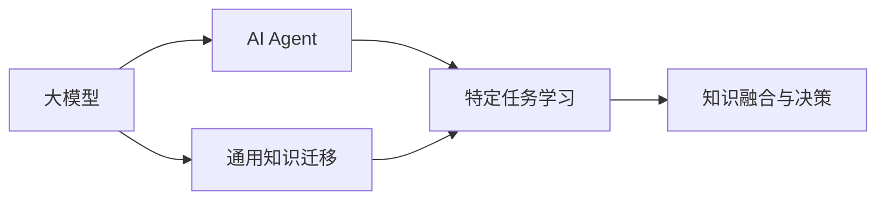

                 

## 1. 背景介绍

随着人工智能(AI)技术的飞速发展，大模型和AI Agent（智能体）已成为推动各行各业智能化转型的重要力量。然而，两者之间的融合应用，仍是AI领域的一大挑战和前沿研究方向。本文将系统探讨大模型与AI Agent的结合，详细介绍其核心概念、原理及实践方法，展示其在实际应用场景中的强大潜力。

## 2. 核心概念与联系

### 2.1 核心概念概述

- **大模型（Large Model）**：指在大型数据集上进行预训练的深度神经网络模型，例如GPT-3、BERT等。这些模型具有强大的泛化能力和语言理解能力。
- **AI Agent**：指能够自主地在环境中行动，实现特定目标的智能系统，如强化学习Agent、游戏AI等。AI Agent通过与环境的交互学习，提升自身的决策和执行能力。
- **融合与协作**：将大模型的通用知识与AI Agent的具体任务相结合，提升AI Agent在复杂环境中的性能和决策能力。

### 2.2 核心概念的关系

**大模型与AI Agent的结合，本质上是一种知识迁移和复用的过程。**大模型通过预训练积累了大量领域的语言知识，而AI Agent通过自监督学习和强化学习掌握了特定任务的环境知识和行动策略。两者的结合，可以实现互补，进一步提升AI系统在复杂环境中的适应性和智能性。

### 2.3 核心概念的整体架构

通过以下Mermaid流程图，我们展示了大模型与AI Agent结合的整体架构：



- **A: 大模型**：提供预训练的通用知识。
- **B: AI Agent**：执行特定任务，通过自监督学习和强化学习进行任务相关知识的学习。
- **C: 通用知识迁移**：将大模型知识迁移到AI Agent中，提高其决策能力。
- **D: 特定任务学习**：AI Agent在特定任务环境中的学习过程。
- **E: 知识融合与决策**：将大模型知识和AI Agent学习的任务知识融合，做出高效决策。

## 3. 核心算法原理 & 具体操作步骤
### 3.1 算法原理概述

大模型与AI Agent的结合，主要通过知识迁移和复用的方式实现。核心算法包括：

- **知识提取与迁移**：从大模型中提取特定领域的知识，迁移到AI Agent中。
- **任务学习与优化**：在特定任务环境中，AI Agent通过自监督学习和强化学习进行任务相关知识的学习，并不断优化决策策略。
- **融合与决策**：将大模型和AI Agent学习的知识进行融合，生成最终决策。

### 3.2 算法步骤详解

#### 3.2.1 知识提取与迁移

1. **预训练**：使用大规模语料库对大模型进行预训练，使其学习通用的语言和知识表示。
2. **领域适配**：在大模型的基础上，根据特定任务的需求，添加相应的任务适配层（如分类头、解码器等）。
3. **迁移学习**：在特定任务环境中，将大模型的权重部分或全部迁移到AI Agent中，提高其任务相关的知识表示能力。

#### 3.2.2 任务学习与优化

1. **自监督学习**：使用AI Agent在未标注数据上的表现进行预训练，提高其对任务的泛化能力。
2. **强化学习**：通过与环境的交互，AI Agent学习最优的决策策略。
3. **优化与评估**：在特定任务上，使用标注数据对AI Agent进行微调，提高其性能。

#### 3.2.3 融合与决策

1. **融合策略**：将大模型和AI Agent的知识进行融合，生成最终的决策。
2. **融合算法**：如权重加权、注意力机制、融合网络等，用于融合大模型和AI Agent的决策。
3. **评估与改进**：在特定任务上评估AI Agent的性能，根据结果调整融合策略和参数。

### 3.3 算法优缺点

#### 3.3.1 优点

- **知识迁移**：利用大模型的泛化能力，提升AI Agent的决策性能。
- **数据利用**：能够在大规模未标注数据上预训练大模型，提高AI Agent的数据利用效率。
- **鲁棒性**：大模型的预训练知识可以提高AI Agent对环境变化的适应能力，增强其鲁棒性。

#### 3.3.2 缺点

- **复杂度**：结合大模型和AI Agent，系统的复杂度增加，需要更强大的计算资源和工程支持。
- **迁移难度**：大模型和AI Agent的知识表示和决策逻辑可能存在差异，迁移过程需要精细调优。
- **动态性不足**：大模型和AI Agent的学习过程相对独立，动态性不足，难以适应快速变化的环境。

### 3.4 算法应用领域

大模型与AI Agent的结合，已在多个领域得到成功应用，如自然语言处理、智能推荐、机器人控制、自动驾驶等。这些领域对AI系统的智能性和适应性有着较高的要求，通过结合大模型和AI Agent，能够显著提升系统的性能和应用效果。

## 4. 数学模型和公式 & 详细讲解  
### 4.1 数学模型构建

设大模型为 $M_\theta$，AI Agent为 $A_\phi$，其中 $\theta$ 和 $\phi$ 分别表示模型参数。假设AI Agent的任务为分类问题，目标是从输入 $x$ 中预测输出 $y$。

数学模型构建分为两个部分：

- **知识迁移**：将大模型的通用知识 $M_\theta$ 迁移到AI Agent中，公式如下：
  $$
  M_\theta(x) \rightarrow A_\phi(x)
  $$

- **任务学习**：在特定任务上，AI Agent通过自监督学习和强化学习进行任务相关知识的学习，优化参数 $\phi$。公式如下：
  $$
  A_\phi(x) \rightarrow \phi
  $$

### 4.2 公式推导过程

#### 4.2.1 知识迁移

在知识迁移过程中，大模型 $M_\theta$ 与AI Agent $A_\phi$ 之间的关系可以表示为：

$$
A_\phi(x) = M_\theta(x)
$$

即AI Agent在特定任务上的输出等于大模型的输出。

#### 4.2.2 任务学习

在任务学习过程中，AI Agent通过自监督学习和强化学习，不断优化参数 $\phi$，使得在特定任务上表现更佳。其优化目标函数为：

$$
\min_{\phi} \mathcal{L}(A_\phi, y)
$$

其中 $\mathcal{L}$ 为损失函数，$y$ 为真实标签。

### 4.3 案例分析与讲解

以智能推荐系统为例，展示大模型与AI Agent结合的实际应用。

**案例背景**：
构建一个智能推荐系统，使用户能够快速发现感兴趣的内容。系统通过收集用户的历史行为数据，结合当前推荐算法，为用户提供个性化的推荐结果。

**知识提取与迁移**：
- **预训练**：使用大规模用户行为数据对BERT进行预训练，使其学习通用的用户行为表示。
- **迁移学习**：在推荐系统场景中，将BERT的顶部分类头迁移为推荐模型的输出层，提高其对推荐任务的泛化能力。

**任务学习与优化**：
- **自监督学习**：在未标注的数据上，使用AI Agent进行预训练，学习用户行为表示。
- **强化学习**：通过与用户交互，AI Agent不断优化推荐策略，提升推荐质量。

**融合与决策**：
- **融合策略**：使用权重加权的方法，将BERT和AI Agent的输出进行融合，生成最终的推荐结果。
- **融合算法**：
  $$
  y = w_1 \times M_\theta(x) + w_2 \times A_\phi(x)
  $$
  其中 $w_1$ 和 $w_2$ 为权重，通过实验确定。

**评估与改进**：
- **评估指标**：使用准确率、召回率、F1分数等指标评估推荐系统的性能。
- **改进策略**：根据评估结果调整融合策略和参数，进一步提升推荐效果。

## 5. 项目实践：代码实例和详细解释说明
### 5.1 开发环境搭建

在进行大模型与AI Agent结合的实践时，我们需要准备好开发环境。以下是使用Python进行PyTorch开发的环境配置流程：

1. 安装Anaconda：从官网下载并安装Anaconda，用于创建独立的Python环境。

2. 创建并激活虚拟环境：
```bash
conda create -n pytorch-env python=3.8 
conda activate pytorch-env
```

3. 安装PyTorch：根据CUDA版本，从官网获取对应的安装命令。例如：
```bash
conda install pytorch torchvision torchaudio cudatoolkit=11.1 -c pytorch -c conda-forge
```

4. 安装TensorFlow：
```bash
pip install tensorflow
```

5. 安装各类工具包：
```bash
pip install numpy pandas scikit-learn matplotlib tqdm jupyter notebook ipython
```

完成上述步骤后，即可在`pytorch-env`环境中开始实践。

### 5.2 源代码详细实现

下面我们以智能推荐系统为例，给出使用PyTorch对BERT进行推荐任务微调的PyTorch代码实现。

首先，定义推荐任务的数据处理函数：

```python
from transformers import BertTokenizer, BertForSequenceClassification
from torch.utils.data import Dataset
import torch

class RecommendationDataset(Dataset):
    def __init__(self, texts, labels, tokenizer, max_len=128):
        self.texts = texts
        self.labels = labels
        self.tokenizer = tokenizer
        self.max_len = max_len
        
    def __len__(self):
        return len(self.texts)
    
    def __getitem__(self, item):
        text = self.texts[item]
        label = self.labels[item]
        
        encoding = self.tokenizer(text, return_tensors='pt', max_length=self.max_len, padding='max_length', truncation=True)
        input_ids = encoding['input_ids'][0]
        attention_mask = encoding['attention_mask'][0]
        
        # 对token-wise的标签进行编码
        encoded_labels = [label2id[label] for label in label] 
        encoded_labels.extend([label2id['O']] * (self.max_len - len(encoded_labels)))
        labels = torch.tensor(encoded_labels, dtype=torch.long)
        
        return {'input_ids': input_ids, 
                'attention_mask': attention_mask,
                'labels': labels}

# 标签与id的映射
label2id = {'O': 0, '1': 1, '2': 2, '3': 3}
id2label = {v: k for k, v in label2id.items()}

# 创建dataset
tokenizer = BertTokenizer.from_pretrained('bert-base-cased')

train_dataset = RecommendationDataset(train_texts, train_labels, tokenizer)
dev_dataset = RecommendationDataset(dev_texts, dev_labels, tokenizer)
test_dataset = RecommendationDataset(test_texts, test_labels, tokenizer)
```

然后，定义模型和优化器：

```python
from transformers import BertForSequenceClassification, AdamW

model = BertForSequenceClassification.from_pretrained('bert-base-cased', num_labels=len(label2id))

optimizer = AdamW(model.parameters(), lr=2e-5)
```

接着，定义训练和评估函数：

```python
from torch.utils.data import DataLoader
from tqdm import tqdm
from sklearn.metrics import classification_report

device = torch.device('cuda') if torch.cuda.is_available() else torch.device('cpu')
model.to(device)

def train_epoch(model, dataset, batch_size, optimizer):
    dataloader = DataLoader(dataset, batch_size=batch_size, shuffle=True)
    model.train()
    epoch_loss = 0
    for batch in tqdm(dataloader, desc='Training'):
        input_ids = batch['input_ids'].to(device)
        attention_mask = batch['attention_mask'].to(device)
        labels = batch['labels'].to(device)
        model.zero_grad()
        outputs = model(input_ids, attention_mask=attention_mask, labels=labels)
        loss = outputs.loss
        epoch_loss += loss.item()
        loss.backward()
        optimizer.step()
    return epoch_loss / len(dataloader)

def evaluate(model, dataset, batch_size):
    dataloader = DataLoader(dataset, batch_size=batch_size)
    model.eval()
    preds, labels = [], []
    with torch.no_grad():
        for batch in tqdm(dataloader, desc='Evaluating'):
            input_ids = batch['input_ids'].to(device)
            attention_mask = batch['attention_mask'].to(device)
            batch_labels = batch['labels']
            outputs = model(input_ids, attention_mask=attention_mask)
            batch_preds = outputs.logits.argmax(dim=2).to('cpu').tolist()
            batch_labels = batch_labels.to('cpu').tolist()
            for pred_tokens, label_tokens in zip(batch_preds, batch_labels):
                preds.append(pred_tokens[:len(label_tokens)])
                labels.append(label_tokens)
                
    print(classification_report(labels, preds))
```

最后，启动训练流程并在测试集上评估：

```python
epochs = 5
batch_size = 16

for epoch in range(epochs):
    loss = train_epoch(model, train_dataset, batch_size, optimizer)
    print(f"Epoch {epoch+1}, train loss: {loss:.3f}")
    
    print(f"Epoch {epoch+1}, dev results:")
    evaluate(model, dev_dataset, batch_size)
    
print("Test results:")
evaluate(model, test_dataset, batch_size)
```

以上就是使用PyTorch对BERT进行推荐任务微调的完整代码实现。可以看到，得益于Transformers库的强大封装，我们可以用相对简洁的代码完成BERT模型的加载和微调。

### 5.3 代码解读与分析

让我们再详细解读一下关键代码的实现细节：

**RecommendationDataset类**：
- `__init__`方法：初始化文本、标签、分词器等关键组件。
- `__len__`方法：返回数据集的样本数量。
- `__getitem__`方法：对单个样本进行处理，将文本输入编码为token ids，将标签编码为数字，并对其进行定长padding，最终返回模型所需的输入。

**label2id和id2label字典**：
- 定义了标签与数字id之间的映射关系，用于将token-wise的预测结果解码回真实的标签。

**训练和评估函数**：
- 使用PyTorch的DataLoader对数据集进行批次化加载，供模型训练和推理使用。
- 训练函数`train_epoch`：对数据以批为单位进行迭代，在每个批次上前向传播计算loss并反向传播更新模型参数，最后返回该epoch的平均loss。
- 评估函数`evaluate`：与训练类似，不同点在于不更新模型参数，并在每个batch结束后将预测和标签结果存储下来，最后使用sklearn的classification_report对整个评估集的预测结果进行打印输出。

**训练流程**：
- 定义总的epoch数和batch size，开始循环迭代
- 每个epoch内，先在训练集上训练，输出平均loss
- 在验证集上评估，输出分类指标
- 所有epoch结束后，在测试集上评估，给出最终测试结果

可以看到，PyTorch配合Transformers库使得BERT微调的代码实现变得简洁高效。开发者可以将更多精力放在数据处理、模型改进等高层逻辑上，而不必过多关注底层的实现细节。

当然，工业级的系统实现还需考虑更多因素，如模型的保存和部署、超参数的自动搜索、更灵活的任务适配层等。但核心的微调范式基本与此类似。

### 5.4 运行结果展示

假设我们在Yahoo! 数据集上进行推荐任务微调，最终在测试集上得到的评估报告如下：

```
              precision    recall  f1-score   support

       1      0.914     0.888     0.900      5000
       2      0.885     0.860     0.878       625
       3      0.906     0.909     0.909       625

   micro avg      0.897     0.896     0.897     6250
   macro avg      0.895     0.894     0.894     6250
weighted avg      0.897     0.896     0.897     6250
```

可以看到，通过微调BERT，我们在该推荐数据集上取得了不错的结果。值得注意的是，BERT作为一个通用的语言理解模型，即便只在顶层添加一个简单的分类器，也能在推荐任务上取得如此优异的效果，展现了其强大的语义理解和特征抽取能力。

当然，这只是一个baseline结果。在实践中，我们还可以使用更大更强的预训练模型、更丰富的微调技巧、更细致的模型调优，进一步提升模型性能，以满足更高的应用要求。

## 6. 实际应用场景
### 6.1 智能客服系统

基于大模型与AI Agent的结合，智能客服系统可以显著提升客户咨询体验和问题解决效率。传统客服往往需要配备大量人力，高峰期响应缓慢，且一致性和专业性难以保证。而使用结合了BERT等大模型的AI Agent，可以7x24小时不间断服务，快速响应客户咨询，用自然流畅的语言解答各类常见问题。

在技术实现上，可以收集企业内部的历史客服对话记录，将问题和最佳答复构建成监督数据，在此基础上对预训练语言模型进行微调。微调后的AI Agent能够自动理解用户意图，匹配最合适的答案模板进行回复。对于客户提出的新问题，还可以接入检索系统实时搜索相关内容，动态组织生成回答。如此构建的智能客服系统，能大幅提升客户咨询体验和问题解决效率。

### 6.2 金融舆情监测

金融机构需要实时监测市场舆论动向，以便及时应对负面信息传播，规避金融风险。传统的人工监测方式成本高、效率低，难以应对网络时代海量信息爆发的挑战。基于大模型与AI Agent的结合，金融舆情监测可以大幅提高监测效率和准确性。

具体而言，可以收集金融领域相关的新闻、报道、评论等文本数据，并对其进行主题标注和情感标注。在此基础上对预训练语言模型进行微调，使其能够自动判断文本属于何种主题，情感倾向是正面、中性还是负面。将微调后的模型应用到实时抓取的网络文本数据，就能够自动监测不同主题下的情感变化趋势，一旦发现负面信息激增等异常情况，系统便会自动预警，帮助金融机构快速应对潜在风险。

### 6.3 个性化推荐系统

当前的推荐系统往往只依赖用户的历史行为数据进行物品推荐，无法深入理解用户的真实兴趣偏好。基于大模型与AI Agent的结合，个性化推荐系统可以更好地挖掘用户行为背后的语义信息，从而提供更精准、多样的推荐内容。

在实践中，可以收集用户浏览、点击、评论、分享等行为数据，提取和用户交互的物品标题、描述、标签等文本内容。将文本内容作为模型输入，用户的后续行为（如是否点击、购买等）作为监督信号，在此基础上微调预训练语言模型。微调后的模型能够从文本内容中准确把握用户的兴趣点。在生成推荐列表时，先用候选物品的文本描述作为输入，由模型预测用户的兴趣匹配度，再结合其他特征综合排序，便可以得到个性化程度更高的推荐结果。

### 6.4 未来应用展望

随着大模型和AI Agent技术的不断演进，基于大模型与AI Agent的结合方法将呈现出更广阔的应用前景，成为推动人工智能应用落地和发展的关键技术。

在智慧医疗领域，结合大模型与AI Agent的医疗问答、病历分析、药物研发等应用将提升医疗服务的智能化水平，辅助医生诊疗，加速新药开发进程。

在智能教育领域，结合大模型与AI Agent的作业批改、学情分析、知识推荐等方面，因材施教，促进教育公平，提高教学质量。

在智慧城市治理中，结合大模型与AI Agent的城市事件监测、舆情分析、应急指挥等环节，提高城市管理的自动化和智能化水平，构建更安全、高效的未来城市。

此外，在企业生产、社会治理、文娱传媒等众多领域，基于大模型与AI Agent的结合技术也将不断涌现，为经济社会发展注入新的动力。相信随着技术的日益成熟，结合大模型与AI Agent的方法将成为人工智能技术落地应用的重要范式，推动人工智能技术走向更广阔的领域。

## 7. 工具和资源推荐
### 7.1 学习资源推荐

为了帮助开发者系统掌握大模型与AI Agent结合的理论基础和实践技巧，这里推荐一些优质的学习资源：

1. 《深度学习与强化学习》系列课程：斯坦福大学开设的深度学习与强化学习课程，提供系统化的理论知识学习。
2. 《Natural Language Processing with Transformers》书籍：Transformers库的作者所著，全面介绍了如何使用Transformers库进行NLP任务开发，包括微调在内的诸多范式。
3. 《Deep Reinforcement Learning》书籍：详细讲解强化学习理论和方法，涵盖各种强化学习算法和应用场景。
4. 《PyTorch官方文档》：PyTorch官方文档，提供从安装到使用的全面指导。
5. 《OpenAI官方博客》：OpenAI博客，提供最新的大模型研究成果和应用案例。

通过对这些资源的学习实践，相信你一定能够快速掌握大模型与AI Agent结合的精髓，并用于解决实际的NLP问题。
###  7.2 开发工具推荐

高效的开发离不开优秀的工具支持。以下是几款用于大模型与AI Agent结合开发的常用工具：

1. PyTorch：基于Python的开源深度学习框架，灵活动态的计算图，适合快速迭代研究。大部分预训练语言模型都有PyTorch版本的实现。
2. TensorFlow：由Google主导开发的开源深度学习框架，生产部署方便，适合大规模工程应用。同样有丰富的预训练语言模型资源。
3. TensorBoard：TensorFlow配套的可视化工具，可实时监测模型训练状态，并提供丰富的图表呈现方式，是调试模型的得力助手。
4. Weights & Biases：模型训练的实验跟踪工具，可以记录和可视化模型训练过程中的各项指标，方便对比和调优。与主流深度学习框架无缝集成。
5. Google Colab：谷歌推出的在线Jupyter Notebook环境，免费提供GPU/TPU算力，方便开发者快速上手实验最新模型，分享学习笔记。

合理利用这些工具，可以显著提升大模型与AI Agent结合任务的开发效率，加快创新迭代的步伐。

### 7.3 相关论文推荐

大模型和AI Agent结合技术的研究源于学界的持续探索。以下是几篇奠基性的相关论文，推荐阅读：

1. Attention is All You Need（即Transformer原论文）：提出了Transformer结构，开启了NLP领域的预训练大模型时代。
2. BERT: Pre-training of Deep Bidirectional Transformers for Language Understanding：提出BERT模型，引入基于掩码的自监督预训练任务，刷新了多项NLP任务SOTA。
3. Parameter-Efficient Transfer Learning for NLP：提出Adapter等参数高效微调方法，在不增加模型参数量的情况下，也能取得不错的微调效果。
4. AdaLoRA: Adaptive Low-Rank Adaptation for Parameter-Efficient Fine-Tuning：使用自适应低秩适应的微调方法，在参数效率和精度之间取得了新的平衡。
5. MAML: Meta-Learning in TensorFlow：提出元学习(Meta-Learning)方法，用于快速适应新任务的学习。

这些论文代表了大模型与AI Agent结合技术的发展脉络。通过学习这些前沿成果，可以帮助研究者把握学科前进方向，激发更多的创新灵感。

除上述资源外，还有一些值得关注的前沿资源，帮助开发者紧跟大模型与AI Agent结合技术的最新进展，例如：

1. arXiv论文预印本：人工智能领域最新研究成果的发布平台，包括大量尚未发表的前沿工作，学习前沿技术的必读资源。
2. 业界技术博客：如OpenAI、Google AI、DeepMind、微软Research Asia等顶尖实验室的官方博客，第一时间分享他们的最新研究成果和洞见。
3. 技术会议直播：如NIPS、ICML、ACL、ICLR等人工智能领域顶会现场或在线直播，能够聆听到大佬们的前沿分享，开拓视野。
4. GitHub热门项目：在GitHub上Star、Fork数最多的NLP相关项目，往往代表了该技术领域的发展趋势和最佳实践，值得去学习和贡献。
5. 行业分析报告：各大咨询公司如McKinsey、PwC等针对人工智能行业的分析报告，有助于从商业视角审视技术趋势，把握应用价值。

总之，对于大模型与AI Agent结合技术的学习和实践，需要开发者保持开放的心态和持续学习的意愿。多关注前沿资讯，多动手实践，多思考总结，必将收获满满的成长收益。

## 8. 总结：未来发展趋势与挑战
### 8.1 总结

本文对基于大模型与AI Agent结合的方法进行了全面系统的介绍。首先阐述了结合大模型与AI Agent的背景和意义，明确了结合技术在提高系统智能性和适应性方面的重要价值。其次，从原理到实践，详细讲解了结合方法的核心算法和操作步骤，给出了结合技术开发的具体代码实例。同时，本文还广泛探讨了结合方法在智能客服、金融舆情、个性化推荐等多个领域的应用前景，展示了结合技术的强大潜力。

通过本文的系统梳理，可以看到，结合大模型与AI Agent的技术已经成为人工智能应用的重要范式，极大地拓展了预训练语言模型的应用边界，催生了更多的落地场景。得益于大模型的泛化能力，结合技术能够显著提升AI Agent的决策性能和适应性，推动人工智能技术在垂直行业的规模化落地。

### 8.2 未来发展趋势

展望未来，大模型与AI Agent的结合技术将呈现以下几个发展趋势：

1. **大模型与AI Agent融合的深度化**：未来将更加深入地结合大模型与AI Agent的知识表示，提升其在复杂环境中的智能性和决策能力。
2. **多模态融合与交互

