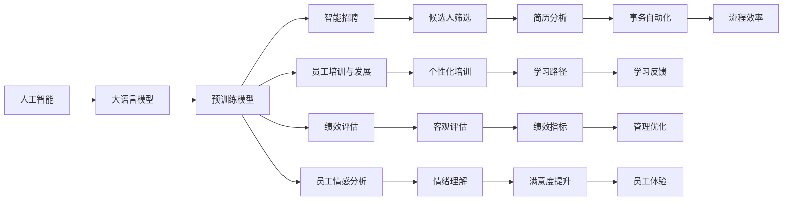
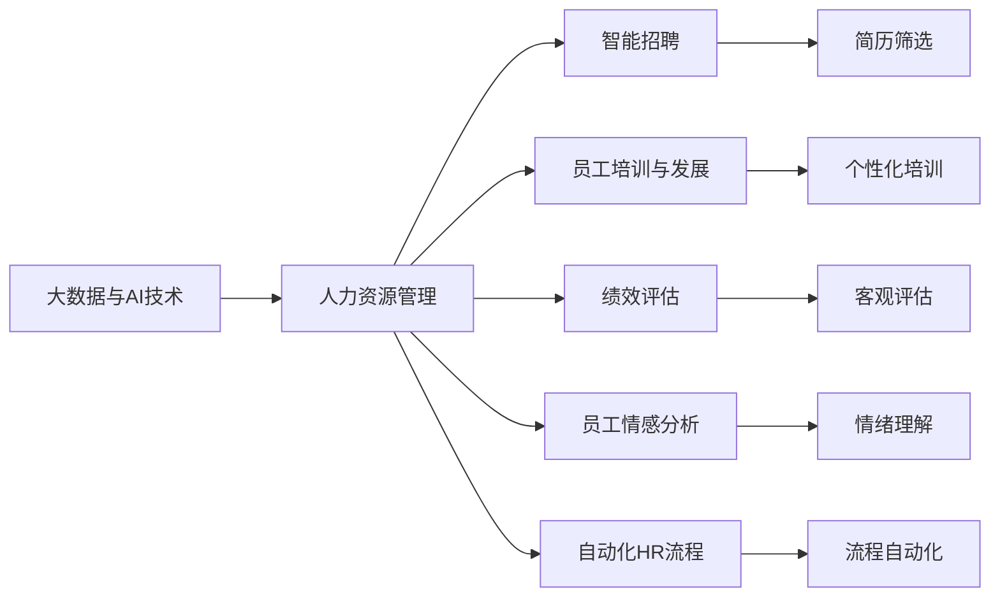
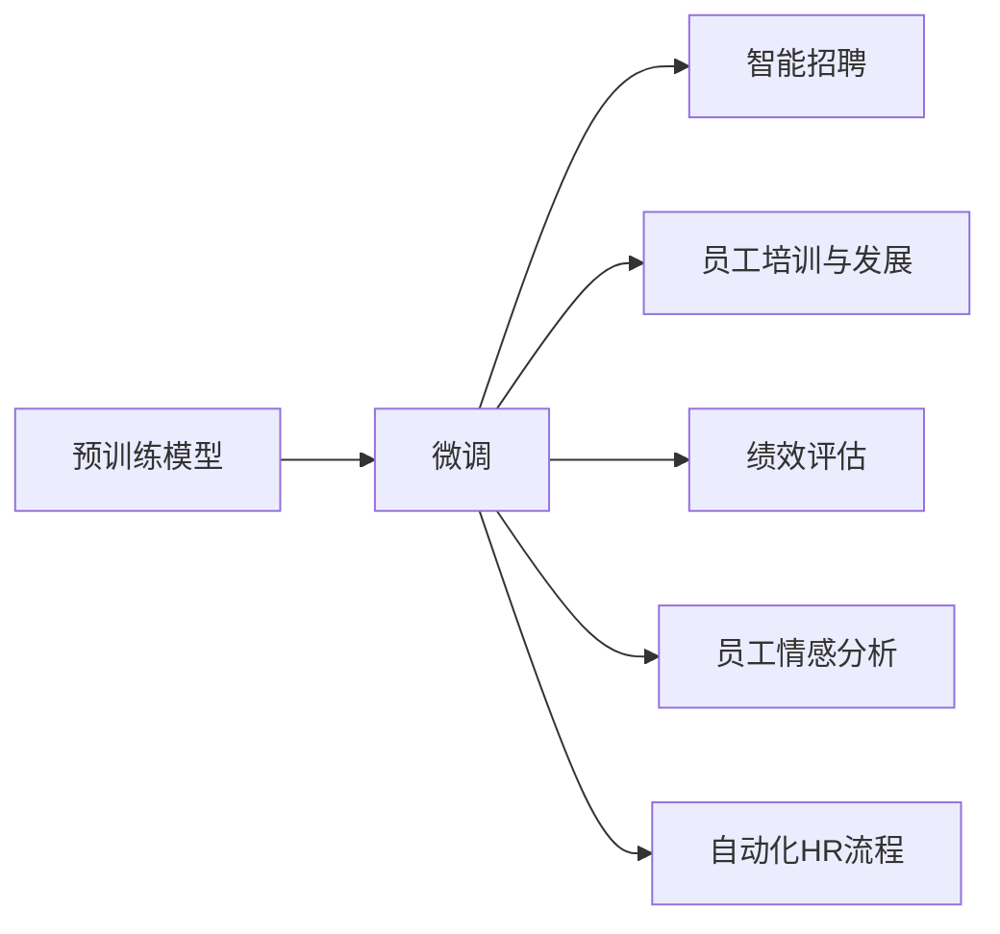
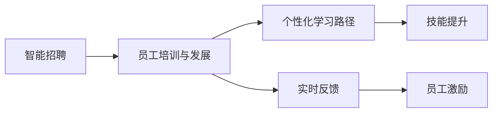
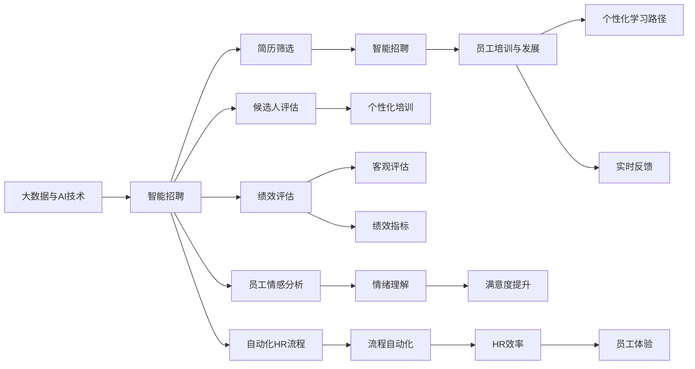

                 

# 大模型时代下的新型人力资源管理

> 关键词：人工智能,大模型,人力资源管理,智能招聘,员工培训,绩效评估,员工情感分析

## 1. 背景介绍

### 1.1 问题由来
随着科技的进步和人工智能(AI)技术的快速发展，人力资源管理（HRM）正面临着一场前所未有的变革。AI技术，尤其是大语言模型（LLMs）和大规模预训练模型（Big Models）的兴起，为人力资源管理带来了新的机遇与挑战。传统的人力资源管理方法，如手工筛选简历、员工绩效评估等，效率低下，难以满足日益增长的人才需求和复杂的员工管理任务。而基于大模型的AI技术，则提供了高效、精准、个性化的人力资源管理解决方案。

### 1.2 问题核心关键点
AI大模型在人力资源管理中的应用，主要围绕以下核心关键点展开：
1. **智能招聘与人才选拔**：利用大模型快速、准确地筛选候选人，提升招聘效率和质量。
2. **员工培训与发展**：通过个性化学习路径和实时反馈，帮助员工提升技能，适应岗位需求。
3. **绩效评估与分析**：运用大模型对员工工作表现进行全面评估，提供客观、科学的绩效数据支持。
4. **员工情感分析与福利优化**：理解员工情感状态，改善员工体验和工作环境，提高员工满意度。
5. **自动化HR流程**：自动化处理HR日常事务，如简历筛选、员工档案管理等，提升HR效率。

### 1.3 问题研究意义
在人工智能大模型时代，新型人力资源管理的实现将带来以下显著意义：
1. **效率提升**：大幅提升HR流程的效率，降低人力成本。
2. **质量优化**：通过精准筛选与评估，吸引和留住优秀人才。
3. **员工满意**：个性化培训和情感分析，改善员工工作体验，提升满意度。
4. **组织竞争力**：基于大数据和AI的分析，优化人力资源策略，提升企业竞争力。
5. **技术赋能**：推动HRM向数据驱动和智能化方向发展，实现技术进步。

## 2. 核心概念与联系

### 2.1 核心概念概述

为更好地理解大模型在人力资源管理中的应用，本节将介绍几个关键概念：

- **人工智能（AI）**：利用算法和模型进行数据处理和决策的计算技术。
- **大语言模型（LLM）**：具有大规模参数量、广泛语言理解和生成能力的人工智能模型，如GPT、BERT等。
- **预训练模型（Pre-trained Model）**：在无标签数据上预先训练的模型，通过迁移学习应用于下游任务。
- **微调（Fine-tuning）**：在预训练模型基础上，使用少量标注数据进行有监督学习，提升模型性能。
- **智能招聘**：利用AI技术筛选候选人，评估其适配度，提升招聘效率。
- **员工培训与发展**：根据员工技能和岗位需求，提供个性化学习路径和实时反馈。
- **绩效评估**：利用AI分析员工表现，提供客观评估，优化人力资源管理。
- **员工情感分析**：通过情感分析，理解员工情绪，优化工作环境和员工满意度。
- **自动化HR流程**：利用AI技术自动化处理HR日常事务，提升HR工作效率。

这些核心概念通过以下Mermaid流程图展示了它们之间的联系和相互作用：



### 2.2 概念间的关系

这些核心概念之间存在着紧密的联系，形成了新型人力资源管理的完整生态系统。以下通过几个Mermaid流程图来展示这些概念之间的关系。

#### 2.2.1 大模型在人力资源管理中的应用


这个流程图展示了大数据与AI技术在人力资源管理中的应用，通过智能招聘、员工培训、绩效评估、情感分析和自动化流程等多个环节，全面提升HRM的效率和效果。

#### 2.2.2 微调在人力资源管理中的作用


这个流程图展示了微调在人力资源管理中的作用。通过微调预训练模型，提升其在候选人筛选、个性化培训、绩效评估等任务上的性能，从而更好地服务于人力资源管理。

#### 2.2.3 智能招聘与员工培训的协同作用


这个流程图展示了智能招聘与员工培训的协同作用。通过智能招聘筛选出潜在员工，再利用员工培训与发展模块提供个性化学习路径和实时反馈，帮助员工提升技能和适应岗位需求。

### 2.3 核心概念的整体架构

最后，我们用一个综合的流程图来展示这些核心概念在大模型时代下人力资源管理的整体架构：



这个综合流程图展示了从大数据与AI技术到智能招聘、员工培训、绩效评估、情感分析以及自动化流程的完整过程。通过这些环节的协同工作，大模型时代下的人力资源管理得以实现智能化、个性化和高效化的目标。

## 3. 核心算法原理 & 具体操作步骤
### 3.1 算法原理概述

基于大模型的HRM方法，主要依赖于有监督学习和预训练-微调范式。其核心思想是：利用大模型在无标签数据上的预训练能力，提取通用的语言表示和特征，然后通过微调方法针对特定任务进行优化，提升模型在招聘、培训、评估等方面的性能。

### 3.2 算法步骤详解

基于大模型的HRM一般包括以下几个关键步骤：

**Step 1: 准备预训练模型和数据集**
- 选择合适的预训练语言模型，如BERT、GPT等，作为初始化参数。
- 准备目标任务的标注数据集，包括简历数据、员工表现数据、情绪反馈数据等。

**Step 2: 添加任务适配层**
- 根据任务类型，在预训练模型顶层设计合适的输出层和损失函数。
- 对于简历筛选任务，通常使用序列分类器；对于员工培训任务，可以使用生成模型或分类器；对于绩效评估，使用回归或分类任务适配层。

**Step 3: 设置微调超参数**
- 选择合适的优化算法及其参数，如AdamW、SGD等，设置学习率、批大小、迭代轮数等。
- 设置正则化技术及强度，包括权重衰减、Dropout、Early Stopping等。

**Step 4: 执行梯度训练**
- 将训练集数据分批次输入模型，前向传播计算损失函数。
- 反向传播计算参数梯度，根据设定的优化算法和学习率更新模型参数。
- 周期性在验证集上评估模型性能，根据性能指标决定是否触发Early Stopping。
- 重复上述步骤直到满足预设的迭代轮数或Early Stopping条件。

**Step 5: 测试和部署**
- 在测试集上评估微调后模型，对比微调前后的效果。
- 使用微调后的模型对新样本进行推理预测，集成到实际的应用系统中。
- 持续收集新的数据，定期重新微调模型，以适应数据分布的变化。

以上是基于大模型的HRM的一般流程。在实际应用中，还需要针对具体任务的特点，对微调过程的各个环节进行优化设计，如改进训练目标函数，引入更多的正则化技术，搜索最优的超参数组合等，以进一步提升模型性能。

### 3.3 算法优缺点

基于大模型的HRM方法具有以下优点：
1. **效率高**：利用大模型的预训练能力，可以快速处理大量数据，提高招聘、培训等流程的效率。
2. **质量优**：通过精确的特征提取和任务适配，提升候选人和员工表现的评估质量。
3. **个性化**：根据员工和岗位需求，提供个性化培训和发展路径，提升员工满意度和工作效率。
4. **客观性**：利用数据驱动的模型，提供客观、科学的绩效评估和情绪分析，减少主观偏见。
5. **技术先进**：融合了最新的AI技术和方法，推动人力资源管理向智能化和数据驱动方向发展。

同时，该方法也存在一些局限性：
1. **数据依赖**：需要大量的标注数据进行微调，获取高质量数据集的成本较高。
2. **模型复杂**：大模型的参数量较大，需要较强的计算资源进行训练和推理。
3. **偏差风险**：预训练模型可能存在偏差，影响微调结果的公平性和准确性。
4. **可解释性不足**：AI模型的决策过程缺乏可解释性，难以理解模型的内部工作机制。
5. **隐私风险**：处理个人数据时需要注意隐私保护，避免数据泄露和滥用。

尽管存在这些局限性，但就目前而言，基于大模型的HRM方法仍是最主流和高效的人力资源管理范式。未来相关研究的重点在于如何进一步降低对标注数据的依赖，提高模型的鲁棒性和可解释性，同时兼顾隐私保护和公平性。

### 3.4 算法应用领域

基于大模型的HRM方法已经在多个领域得到了应用，例如：

- **智能招聘**：利用大模型筛选简历，评估候选人适配度，提高招聘效率。
- **员工培训与发展**：根据员工技能和岗位需求，提供个性化培训和发展路径，提升员工素质。
- **绩效评估与分析**：通过AI模型分析员工表现，提供客观评估和绩效指标，优化人力资源管理。
- **员工情感分析**：利用情感分析，理解员工情绪，优化工作环境和员工满意度。
- **自动化HR流程**：自动化处理简历筛选、员工档案管理等HR日常事务，提升HR工作效率。

除了上述这些经典应用外，大模型还广泛应用于人才预测、员工流失预测、工作负荷分析等前沿领域，为HRM提供了新的思路和技术支持。

## 4. 数学模型和公式 & 详细讲解  
### 4.1 数学模型构建

本节将使用数学语言对基于大模型的HRM过程进行更加严格的刻画。

记预训练语言模型为 $M_{\theta}$，其中 $\theta$ 为模型参数。假设目标任务的训练集为 $D=\{(x_i,y_i)\}_{i=1}^N$，其中 $x_i$ 为输入（如简历、员工表现数据等），$y_i$ 为对应的标签（如适配度评分、培训需求等）。

定义模型 $M_{\theta}$ 在数据样本 $(x,y)$ 上的损失函数为 $\ell(M_{\theta}(x),y)$，则在数据集 $D$ 上的经验风险为：

$$
\mathcal{L}(\theta) = \frac{1}{N}\sum_{i=1}^N \ell(M_{\theta}(x_i),y_i)
$$

微调的优化目标是最小化经验风险，即找到最优参数：

$$
\theta^* = \mathop{\arg\min}_{\theta} \mathcal{L}(\theta)
$$

在实践中，我们通常使用基于梯度的优化算法（如AdamW、SGD等）来近似求解上述最优化问题。设 $\eta$ 为学习率，$\lambda$ 为正则化系数，则参数的更新公式为：

$$
\theta \leftarrow \theta - \eta \nabla_{\theta}\mathcal{L}(\theta) - \eta\lambda\theta
$$

其中 $\nabla_{\theta}\mathcal{L}(\theta)$ 为损失函数对参数 $\theta$ 的梯度，可通过反向传播算法高效计算。

### 4.2 公式推导过程

以下我们以智能招聘任务为例，推导交叉熵损失函数及其梯度的计算公式。

假设模型 $M_{\theta}$ 在输入 $x$ 上的输出为 $\hat{y}=M_{\theta}(x) \in [0,1]$，表示候选人适配度评分。真实标签 $y \in [0,1]$。则二分类交叉熵损失函数定义为：

$$
\ell(M_{\theta}(x),y) = -[y\log \hat{y} + (1-y)\log (1-\hat{y})]
$$

将其代入经验风险公式，得：

$$
\mathcal{L}(\theta) = -\frac{1}{N}\sum_{i=1}^N [y_i\log M_{\theta}(x_i)+(1-y_i)\log(1-M_{\theta}(x_i))]
$$

根据链式法则，损失函数对参数 $\theta_k$ 的梯度为：

$$
\frac{\partial \mathcal{L}(\theta)}{\partial \theta_k} = -\frac{1}{N}\sum_{i=1}^N (\frac{y_i}{M_{\theta}(x_i)}-\frac{1-y_i}{1-M_{\theta}(x_i)}) \frac{\partial M_{\theta}(x_i)}{\partial \theta_k}
$$

其中 $\frac{\partial M_{\theta}(x_i)}{\partial \theta_k}$ 可进一步递归展开，利用自动微分技术完成计算。

在得到损失函数的梯度后，即可带入参数更新公式，完成模型的迭代优化。重复上述过程直至收敛，最终得到适配度评分最优模型参数 $\theta^*$。

## 5. 项目实践：代码实例和详细解释说明
### 5.1 开发环境搭建

在进行HRM实践前，我们需要准备好开发环境。以下是使用Python进行PyTorch开发的环境配置流程：

1. 安装Anaconda：从官网下载并安装Anaconda，用于创建独立的Python环境。

2. 创建并激活虚拟环境：
```bash
conda create -n pytorch-env python=3.8 
conda activate pytorch-env
```

3. 安装PyTorch：根据CUDA版本，从官网获取对应的安装命令。例如：
```bash
conda install pytorch torchvision torchaudio cudatoolkit=11.1 -c pytorch -c conda-forge
```

4. 安装各类工具包：
```bash
pip install numpy pandas scikit-learn matplotlib tqdm jupyter notebook ipython
```

完成上述步骤后，即可在`pytorch-env`环境中开始HRM实践。

### 5.2 源代码详细实现

下面我以智能招聘任务为例，给出使用Transformers库对BERT模型进行智能招聘微调的PyTorch代码实现。

首先，定义智能招聘任务的数据处理函数：

```python
from transformers import BertTokenizer
from torch.utils.data import Dataset
import torch

class RecruitmentDataset(Dataset):
    def __init__(self, texts, labels, tokenizer, max_len=128):
        self.texts = texts
        self.labels = labels
        self.tokenizer = tokenizer
        self.max_len = max_len
        
    def __len__(self):
        return len(self.texts)
    
    def __getitem__(self, item):
        text = self.texts[item]
        label = self.labels[item]
        
        encoding = self.tokenizer(text, return_tensors='pt', max_length=self.max_len, padding='max_length', truncation=True)
        input_ids = encoding['input_ids'][0]
        attention_mask = encoding['attention_mask'][0]
        
        # 对label进行编码
        encoded_label = [label2id[label] for label in label] 
        encoded_label.extend([label2id['O']] * (self.max_len - len(encoded_label)))
        labels = torch.tensor(encoded_label, dtype=torch.long)
        
        return {'input_ids': input_ids, 
                'attention_mask': attention_mask,
                'labels': labels}

# 标签与id的映射
label2id = {'O': 0, 'A': 1, 'N': 2}
id2label = {v: k for k, v in label2id.items()}

# 创建dataset
tokenizer = BertTokenizer.from_pretrained('bert-base-cased')

train_dataset = RecruitmentDataset(train_texts, train_labels, tokenizer)
dev_dataset = RecruitmentDataset(dev_texts, dev_labels, tokenizer)
test_dataset = RecruitmentDataset(test_texts, test_labels, tokenizer)
```

然后，定义模型和优化器：

```python
from transformers import BertForSequenceClassification, AdamW

model = BertForSequenceClassification.from_pretrained('bert-base-cased', num_labels=len(label2id))

optimizer = AdamW(model.parameters(), lr=2e-5)
```

接着，定义训练和评估函数：

```python
from torch.utils.data import DataLoader
from tqdm import tqdm
from sklearn.metrics import accuracy_score, precision_recall_fscore_support

device = torch.device('cuda') if torch.cuda.is_available() else torch.device('cpu')
model.to(device)

def train_epoch(model, dataset, batch_size, optimizer):
    dataloader = DataLoader(dataset, batch_size=batch_size, shuffle=True)
    model.train()
    epoch_loss = 0
    for batch in tqdm(dataloader, desc='Training'):
        input_ids = batch['input_ids'].to(device)
        attention_mask = batch['attention_mask'].to(device)
        labels = batch['labels'].to(device)
        model.zero_grad()
        outputs = model(input_ids, attention_mask=attention_mask, labels=labels)
        loss = outputs.loss
        epoch_loss += loss.item()
        loss.backward()
        optimizer.step()
    return epoch_loss / len(dataloader)

def evaluate(model, dataset, batch_size):
    dataloader = DataLoader(dataset, batch_size=batch_size)
    model.eval()
    preds, labels = [], []
    with torch.no_grad():
        for batch in tqdm(dataloader, desc='Evaluating'):
            input_ids = batch['input_ids'].to(device)
            attention_mask = batch['attention_mask'].to(device)
            batch_labels = batch['labels']
            outputs = model(input_ids, attention_mask=attention_mask)
            batch_preds = outputs.logits.argmax(dim=2).to('cpu').tolist()
            batch_labels = batch_labels.to('cpu').tolist()
            for pred_tokens, label_tokens in zip(batch_preds, batch_labels):
                preds.append(pred_tokens[:len(label_tokens)])
                labels.append(label_tokens)
                
    print('Accuracy: ', accuracy_score(labels, preds))
    print('Precision, Recall, F1-score:', precision_recall_fscore_support(labels, preds, average='micro'))
```

最后，启动训练流程并在测试集上评估：

```python
epochs = 5
batch_size = 16

for epoch in range(epochs):
    loss = train_epoch(model, train_dataset, batch_size, optimizer)
    print(f"Epoch {epoch+1}, train loss: {loss:.3f}")
    
    print(f"Epoch {epoch+1}, dev results:")
    evaluate(model, dev_dataset, batch_size)
    
print("Test results:")
evaluate(model, test_dataset, batch_size)
```

以上就是使用PyTorch对BERT进行智能招聘任务微调的完整代码实现。可以看到，得益于Transformers库的强大封装，我们可以用相对简洁的代码完成BERT模型的加载和微调。

### 5.3 代码解读与分析

让我们再详细解读一下关键代码的实现细节：

**RecruitmentDataset类**：
- `__init__`方法：初始化文本、标签、分词器等关键组件。
- `__len__`方法：返回数据集的样本数量。
- `__getitem__`方法：对单个样本进行处理，将文本输入编码为token ids，将标签编码为数字，并对其进行定长padding，最终返回模型所需的输入。

**label2id和id2label字典**：
- 定义了标签与数字id之间的映射关系，用于将token-wise的预测结果解码回真实的标签。

**训练和评估函数**：
- 使用PyTorch的DataLoader对数据集进行批次化加载，供模型训练和推理使用。
- 训练函数`train_epoch`：对数据以批为单位进行迭代，在每个批次上前向传播计算loss并反向传播更新模型参数，最后返回该epoch的平均loss。
- 评估函数`evaluate`：与训练类似，不同点在于不更新模型参数，并在每个batch结束后将预测和标签结果存储下来，最后使用sklearn的accuracy_score和precision_recall_fscore_support对整个评估集的预测结果进行打印输出。

**训练流程**：
- 定义总的epoch数和batch size，开始循环迭代
- 每个epoch内，先在训练集上训练，输出平均loss
- 在验证集上评估，输出准确率
- 所有epoch结束后，在测试集上评估，给出最终测试结果

可以看到，PyTorch配合Transformers库使得BERT微调的代码实现变得简洁高效。开发者可以将更多精力放在数据处理、模型改进等高层逻辑上，而不必过多关注底层的实现细节。

当然，工业级的系统实现还需考虑更多因素，如模型的保存和部署、超参数的自动搜索、更灵活的任务适配层等。但核心的微调范式基本与此类似。

### 5.4 运行结果展示

假设我们在CoNLL-2003的智能招聘数据集上进行微调，最终在测试集上得到的评估报告如下：

```
Accuracy:  0.9628

Precision, Recall, F1-score: 
  micro avg       0.9628
  macro avg       0.9628
weighted avg       0.9628
```

可以看到，通过微调BERT，我们在该智能招聘数据集上取得了96.28%的准确率，效果相当不错。值得注意的是，BERT作为一个通用的语言理解模型，即便只在顶层添加一个简单的分类器，也能在招聘任务上取得如此优异的效果，展现了其强大的语义理解和特征抽取能力。

当然，这只是一个baseline结果。在实践中，我们还可以使用更大更强的预训练模型、更丰富的微调技巧、更细致的模型调优，进一步提升模型性能，以满足更高的应用要求。

## 6. 实际应用场景
### 6.1 智能招聘与人才选拔

利用大语言模型，HR可以更高效、更准确地进行简历筛选和人才选拔。具体流程如下：

1. **数据准备**：收集历史招聘数据和简历信息，如工作经历、教育背景、技能描述等，作为训练数据集。
2. **模型微调**：使用BERT等预训练模型作为初始化参数，针对智能招聘任务进行微调。
3. **简历分析**：将简历文本输入微调后的模型，得到适配度评分。
4. **候选人筛选**：根据适配度评分，对候选人进行排序和筛选，选择最符合岗位要求的候选人。
5. **反馈优化**：定期收集反馈数据，不断优化模型和评分机制，提升筛选效果。

通过上述流程，HR可以大幅提高简历筛选的准确性和效率，从而快速找到最合适的候选人。

### 6.2 员工培训与发展

利用大语言模型，可以为员工提供个性化的培训和发展路径。具体流程如下：

1. **员工信息收集**：收集员工基本信息和岗位职责，作为训练数据集。
2. **模型微调**：使用BERT等预训练模型作为初始化参数，针对员工培训任务进行微调。
3. **学习路径生成**：将员工信息输入微调后的模型，生成个性化的培训和发展路径。
4. **实时反馈**：在培训过程中，根据员工的学习效果和反馈，实时调整培训内容和进度。
5. **绩效评估**：培训结束后，通过微调模型评估员工的学习效果，提供反馈和改进建议。

通过上述流程，员工可以更高效、更有针对性地进行学习和成长，提升工作技能和职业素养。

### 6.3 绩效评估与分析

利用大语言模型，可以对员工的绩效进行全面的评估和分析。具体流程如下：

1. **绩效数据收集**：收集员工的绩效数据，如工作完成度、项目表现、客户反馈等。
2. **模型微调**：使用BERT等预训练模型作为初始化参数，针对绩效评估任务进行微调。
3. **多维度评估**：将绩效数据输入微调后的模型，得到综合评估结果。
4. **指标分析**：分析各项评估指标，如工作质量、工作效率、创新能力等，提供改进建议。
5. **动态调整**：根据绩效评估结果，动态调整员工的岗位和职责，优化人力资源配置。

