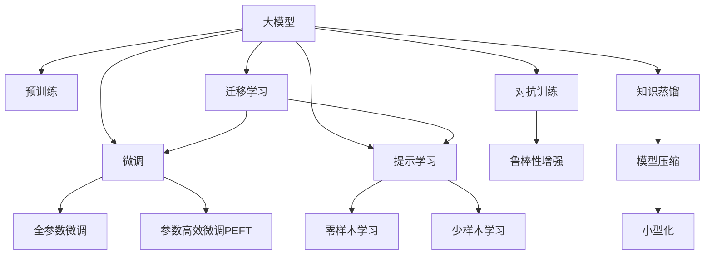

                 

## 1. 背景介绍

随着深度学习和大数据技术的不断发展，人工智能领域进入了“大模型”时代。“大模型”（Large Model）指的是具有数十亿或更多参数的深度学习模型，其显著特点在于通过在海量数据上进行预训练，学习到丰富的特征表示，并在特定任务上进行微调或直接应用，展现出强大的泛化能力和性能。目前，谷歌、OpenAI、Meta等大厂纷纷推出各自的“大模型”，如谷歌的GPT-3、OpenAI的DALL-E、Meta的GPT-3.5等。这些模型不仅在科学研究领域引起了广泛关注，也在工业界引起了轰动，引发了一股对“大模型”的讨论热潮。

本文将从市场定位和技术创新两个角度，探讨“大模型”的发展趋势、应用场景、技术优势和面临的挑战，同时提出一些未来发展的方向和建议。

## 2. 核心概念与联系

### 2.1 核心概念概述

**大模型（Large Model）**：指具有数十亿或更多参数的深度学习模型。这些模型通过大规模数据预训练，学习到丰富的特征表示，能够完成多种复杂的任务，如自然语言处理、图像识别、语音识别等。

**预训练（Pre-training）**：指在大规模无标签数据上进行自监督学习，学习通用特征表示的过程。常见的预训练任务包括语言建模、图像生成、自编码等。

**微调（Fine-tuning）**：指在大规模预训练模型的基础上，使用特定任务的有标签数据进行有监督学习，以提高模型在该任务上的性能。

**迁移学习（Transfer Learning）**：指在源任务上学习到的知识，迁移到目标任务上的学习过程。通过迁移学习，可以利用大规模预训练模型，在大规模数据上学习到的通用知识，来提升在特定任务上的性能。

**对抗训练（Adversarial Training）**：指在训练过程中，加入对抗样本，提高模型对输入数据的鲁棒性和泛化能力。

**知识蒸馏（Knowledge Distillation）**：指将大型模型的知识蒸馏到小型模型上，提高小型模型的性能。

**零样本学习（Zero-shot Learning）**：指模型在没有见过特定任务的训练样本的情况下，仅凭任务描述就能够执行新任务的能力。

**少样本学习（Few-shot Learning）**：指模型在只有少量训练样本的情况下，能够快速适应新任务。

**参数高效微调（Parameter-Efficient Fine-tuning, PEFT）**：指在微调过程中，只更新少量的模型参数，而固定大部分预训练权重不变。

**提示学习（Prompt Learning）**：通过在输入文本中添加提示模板，引导大模型进行特定任务的推理和生成。

这些概念构成了“大模型”的核心，它们相互联系，共同支持大模型在多个领域的广泛应用。

### 2.2 核心概念间的联系

这些核心概念之间存在紧密的联系，形成了一个完整的“大模型”生态系统。下面通过几个Mermaid流程图来展示这些概念之间的关系：



这个流程图展示了“大模型”从预训练到微调、对抗训练、知识蒸馏、提示学习等多个过程，并最终实现零样本和少样本学习的完整生态系统。通过这个系统，大模型可以在多个任务上进行高效、高效、鲁棒和灵活的应用。

## 3. 核心算法原理 & 具体操作步骤

### 3.1 算法原理概述

“大模型”的核心算法原理基于深度学习模型在大量数据上的预训练和微调。预训练过程通过自监督学习，学习到通用的特征表示，微调过程通过有监督学习，针对特定任务进行优化，从而提升模型在该任务上的性能。

具体来说，大模型通常采用自回归模型（如GPT）或自编码模型（如BERT）作为基础结构。在预训练阶段，模型在大量无标签数据上进行自监督学习，学习到语言、图像、语音等多种数据类型的通用特征表示。在微调阶段，针对特定任务（如问答、分类、生成等），使用有标签数据进行有监督学习，优化模型的输出结果，使其适应新任务。

### 3.2 算法步骤详解

1. **数据准备**：收集并处理大规模无标签数据和特定任务的有标签数据，准备预训练和微调所需的数据集。

2. **模型构建**：选择合适的预训练模型作为基础，如BERT、GPT等。同时，设计适当的模型结构和任务适配层，以便于后续的微调。

3. **预训练**：在大量无标签数据上使用自监督学习任务进行预训练，学习到通用的特征表示。

4. **微调**：在特定任务的有标签数据上进行微调，通过优化模型参数，使其适应新任务。

5. **评估和优化**：在验证集上评估微调后的模型性能，根据性能指标进行调整，直至达到最优。

6. **部署和应用**：将微调后的模型部署到实际应用场景中，进行推理和预测。

### 3.3 算法优缺点

**优点**：
- 性能优越：大模型通过在大规模数据上进行预训练，学习到丰富的特征表示，能够在多个任务上取得优秀的性能。
- 可迁移性强：预训练模型可以迁移到不同的任务上，提升模型在不同领域的应用能力。
- 鲁棒性强：大模型经过预训练后，对输入数据的鲁棒性和泛化能力更强，能够应对多种变化和噪声。
- 灵活度高：大模型可以通过微调、提示学习、参数高效微调等技术，灵活调整模型结构，适应各种应用场景。

**缺点**：
- 资源消耗大：大模型的参数量较大，需要大量计算资源和存储空间进行训练和推理。
- 训练时间长：大规模模型的训练时间较长，需要高性能计算设备。
- 过拟合风险高：大模型容易过拟合，需要采用各种正则化技术，避免过拟合。
- 依赖数据：大模型需要大量高质量的数据进行预训练和微调，数据获取和处理成本较高。

### 3.4 算法应用领域

大模型在多个领域具有广泛的应用前景，如：

1. **自然语言处理（NLP）**：大模型在NLP领域具有广泛的应用，如文本分类、情感分析、机器翻译、问答系统等。通过预训练和微调，大模型可以学习到丰富的语言知识和特征，提升任务的性能。

2. **计算机视觉（CV）**：大模型在CV领域也有重要应用，如图像识别、目标检测、图像生成等。通过预训练和微调，大模型可以学习到丰富的图像特征和知识，提升图像处理能力。

3. **语音处理（ASR）**：大模型在语音识别、语音生成等任务上也有很好的表现。通过预训练和微调，大模型可以学习到丰富的语音特征和知识，提升语音处理能力。

4. **推荐系统**：大模型在推荐系统上也有重要应用，如个性化推荐、协同过滤等。通过预训练和微调，大模型可以学习到用户行为和物品特征，提升推荐系统的精度和效果。

5. **自动驾驶**：大模型在自动驾驶领域也有重要应用，如环境感知、路径规划、行为决策等。通过预训练和微调，大模型可以学习到丰富的环境特征和知识，提升自动驾驶系统的安全性和可靠性。

6. **医疗诊断**：大模型在医疗诊断领域也有重要应用，如医学影像分析、病理分析等。通过预训练和微调，大模型可以学习到丰富的医学知识和特征，提升诊断系统的准确性和效率。

## 4. 数学模型和公式 & 详细讲解 & 举例说明

### 4.1 数学模型构建

大模型通常采用Transformer架构，其数学模型可以表示为：

$$
\text{Model}(x) = \text{Encoder}(\text{Embed}(x)) \text{Decoder}(\text{Embed}(y))
$$

其中，$\text{Model}$ 表示整个模型，$\text{Encoder}$ 表示编码器，$\text{Decoder}$ 表示解码器，$\text{Embed}$ 表示嵌入层，$x$ 表示输入数据，$y$ 表示输出数据。

### 4.2 公式推导过程

以BERT为例，其预训练任务为遮蔽语言模型（Masked Language Model, MLM），公式可以表示为：

$$
\mathcal{L}_{\text{MLM}}(x) = -\log\left(p(y|\text{BERT}(x))\right)
$$

其中，$y$ 表示掩蔽词汇，$\text{BERT}(x)$ 表示BERT模型对输入$x$的预测，$\log$表示对数函数。

在微调阶段，可以使用交叉熵损失函数进行训练，公式可以表示为：

$$
\mathcal{L}_{\text{task}}(y,\text{Model}(x)) = -\log\left(\text{Softmax}(\text{Model}(x))(y)\right)
$$

其中，$y$ 表示任务标签，$\text{Model}(x)$ 表示模型对输入$x$的预测，$\text{Softmax}$表示softmax函数。

### 4.3 案例分析与讲解

假设我们有一个情感分析任务，使用BERT进行微调。具体步骤如下：

1. **数据准备**：收集包含正面和负面情感的文本数据，并标注好情感标签。

2. **模型构建**：使用BERT作为预训练模型，设计适当的任务适配层，如全连接层和Softmax层。

3. **预训练**：在无标签数据上使用MLM任务进行预训练，学习到通用的语言特征。

4. **微调**：在标注数据上使用交叉熵损失函数进行微调，优化模型在情感分类任务上的性能。

5. **评估**：在验证集上评估模型性能，如准确率、F1分数等，根据评估结果调整模型超参数。

6. **部署**：将微调后的模型部署到实际应用中，进行情感分析推理。

## 5. 项目实践：代码实例和详细解释说明

### 5.1 开发环境搭建

在进行大模型项目开发前，需要搭建合适的开发环境。以下是使用Python和PyTorch进行项目开发的流程：

1. **安装Python和PyTorch**：确保Python和PyTorch已经安装并配置好，可以通过conda或pip安装。

2. **安装Transformer库**：Transformer是HuggingFace开源的NLP库，包含大量预训练模型和工具。

3. **数据处理**：收集并预处理数据集，将其转换为模型所需的格式。

4. **模型构建**：选择合适的预训练模型，设计适当的任务适配层。

5. **模型训练**：使用PyTorch进行模型训练，并在训练过程中进行必要的优化和调试。

6. **模型评估和部署**：在测试集上评估模型性能，并将其部署到实际应用中。

### 5.2 源代码详细实现

以下是使用PyTorch对BERT进行情感分析任务微调的代码实现：

```python
import torch
import torch.nn as nn
import torch.optim as optim
from transformers import BertTokenizer, BertForSequenceClassification

# 数据处理
tokenizer = BertTokenizer.from_pretrained('bert-base-uncased')
# 将文本转换为token ids
def tokenize(text):
    return tokenizer.encode(text, add_special_tokens=True)

# 模型构建
class Model(nn.Module):
    def __init__(self, num_labels):
        super(Model, self).__init__()
        self.bert = BertForSequenceClassification.from_pretrained('bert-base-uncased', num_labels=num_labels)
    
    def forward(self, input_ids, attention_mask):
        output = self.bert(input_ids=input_ids, attention_mask=attention_mask)
        return output

# 模型训练
model = Model(num_labels=2)
optimizer = optim.Adam(model.parameters(), lr=2e-5)
criterion = nn.CrossEntropyLoss()

for epoch in range(5):
    total_loss = 0
    for batch in train_dataset:
        input_ids = batch['input_ids']
        attention_mask = batch['attention_mask']
        targets = batch['labels']
        output = model(input_ids, attention_mask)
        loss = criterion(output, targets)
        optimizer.zero_grad()
        loss.backward()
        optimizer.step()
        total_loss += loss.item()
    print(f'Epoch {epoch+1}, loss: {total_loss/len(train_dataset)}')

# 模型评估
model.eval()
with torch.no_grad():
    eval_loss = 0
    correct = 0
    for batch in eval_dataset:
        input_ids = batch['input_ids']
        attention_mask = batch['attention_mask']
        targets = batch['labels']
        output = model(input_ids, attention_mask)
        loss = criterion(output, targets)
        eval_loss += loss.item()
        _, predicted = output.max(1)
        correct += (predicted == targets).sum().item()
    print(f'Evaluation loss: {eval_loss/len(eval_dataset)}, accuracy: {correct/len(eval_dataset)}')

# 模型部署
model = Model(num_labels=2)
model.eval()
with torch.no_grad():
    while True:
        text = input('Enter text: ')
        tokens = tokenize(text)
        input_ids = torch.tensor(tokens).unsqueeze(0)
        attention_mask = torch.ones_like(input_ids)
        output = model(input_ids, attention_mask)
        _, predicted = output.max(1)
        print(f'Prediction: {id2label[predicted.item()] if predicted.item() == 1 else 'Negative' if predicted.item() == 0 else None}')
```

以上代码展示了使用BERT进行情感分析任务微调的完整流程，包括数据处理、模型构建、训练、评估和推理等步骤。

### 5.3 代码解读与分析

**数据处理**：
- 使用BertTokenizer将文本转换为token ids，并添加特殊标记。

**模型构建**：
- 定义了一个包含BERT模型的模型类，通过from_pretrained方法加载预训练模型。

**模型训练**：
- 使用Adam优化器进行模型参数更新，使用交叉熵损失函数进行训练。

**模型评估**：
- 在测试集上进行模型评估，计算损失和准确率。

**模型部署**：
- 使用微调后的模型进行实时推理，返回情感分析结果。

## 6. 实际应用场景

大模型在多个领域具有广泛的应用场景，如：

1. **智能客服**：大模型可以用于构建智能客服系统，提升客户体验和满意度。

2. **金融分析**：大模型可以用于金融数据分析和风险评估，提升金融决策的准确性。

3. **医疗诊断**：大模型可以用于医疗影像分析和病理诊断，提升医疗诊断的效率和准确性。

4. **推荐系统**：大模型可以用于个性化推荐和协同过滤，提升推荐系统的精度和效果。

5. **自动驾驶**：大模型可以用于环境感知和路径规划，提升自动驾驶的安全性和可靠性。

6. **文本生成**：大模型可以用于文本生成和内容创作，提升内容创作的质量和效率。

## 7. 工具和资源推荐

### 7.1 学习资源推荐

为了帮助开发者掌握大模型的相关技术，以下是一些推荐的学习资源：

1. **《深度学习》（Ian Goodfellow等）**：深度学习领域的经典教材，涵盖了深度学习的理论和实践。

2. **《Transformers: From Experiments to State-of-the-Art》**：HuggingFace官方博客，介绍了Transformer架构和预训练模型的实现方法。

3. **《自然语言处理综述》（Sebastian Ruder）**：综述了自然语言处理领域的前沿技术和应用。

4. **《PyTorch官方文档》**：PyTorch官方文档，提供了深度学习模型的实现方法和教程。

5. **《TensorFlow官方文档》**：TensorFlow官方文档，提供了深度学习模型的实现方法和教程。

### 7.2 开发工具推荐

以下是一些推荐的大模型开发工具：

1. **PyTorch**：PyTorch是深度学习领域的主流框架之一，支持动态图和静态图，易于调试和部署。

2. **TensorFlow**：TensorFlow是Google开发的深度学习框架，支持大规模分布式训练和部署。

3. **HuggingFace Transformers库**：HuggingFace开发的NLP库，包含大量预训练模型和工具，易于使用和扩展。

4. **Jupyter Notebook**：Jupyter Notebook是一个交互式的Python开发环境，支持代码运行和数据可视化。

5. **TensorBoard**：TensorBoard是TensorFlow配套的可视化工具，可以实时监测模型训练状态和性能。

### 7.3 相关论文推荐

以下是一些推荐的大模型相关论文：

1. **《Attention is All You Need》（Vaswani等）**：Transformer架构的原始论文，提出了自注意力机制，提高了模型的计算效率和效果。

2. **《BERT: Pre-training of Deep Bidirectional Transformers for Language Understanding》（Devlin等）**：BERT模型的原始论文，提出了预训练任务Masked Language Model，提升了模型的理解能力。

3. **《GPT-3: Language Models are Unsupervised Multitask Learners》（Brown等）**：GPT-3模型的原始论文，提出了无监督学习的大模型，提升了模型的泛化能力和应用范围。

4. **《Knowledge Distillation》（Hinton等）**：知识蒸馏技术的原始论文，提出了将大型模型的知识蒸馏到小型模型的方法，提升了模型的性能和鲁棒性。

5. **《Adversarial Examples in the Physical World》（Madry等）**：对抗训练技术的原始论文，提出了在训练过程中加入对抗样本，提升了模型的鲁棒性和泛化能力。

## 8. 总结：未来发展趋势与挑战

### 8.1 研究成果总结

大模型的研究在过去几年取得了显著进展，在多个领域取得了令人瞩目的成果。未来，随着计算资源的不断提升和数据量的不断增加，大模型的规模和性能将进一步提升，应用范围将进一步扩大。

### 8.2 未来发展趋势

1. **更大规模的模型**：未来的大模型将会继续朝着更大规模的方向发展，通过预训练和微调，学习到更丰富的语言特征和知识。

2. **更高效的模型**：未来的大模型将更加高效，能够在更短的时间内完成训练和推理，同时保持高性能。

3. **更广泛的应用**：未来的大模型将更加广泛应用于多个领域，如医疗、金融、教育等，提升各行业的效率和准确性。

4. **更灵活的模型**：未来的大模型将更加灵活，可以通过微调、提示学习等方法，适应各种不同的任务和应用场景。

5. **更鲁棒的模型**：未来的大模型将更加鲁棒，能够在多种复杂和噪声环境中保持稳定的性能。

### 8.3 面临的挑战

1. **计算资源瓶颈**：大规模模型的训练和推理需要大量的计算资源，如何优化计算资源的使用是一个重要挑战。

2. **数据质量问题**：大模型的性能依赖于高质量的数据，如何获取和处理高质量的数据是一个重要问题。

3. **过拟合风险**：大模型容易过拟合，如何避免过拟合，提升模型的泛化能力是一个重要问题。

4. **公平性和伦理问题**：大模型可能存在偏见和歧视，如何保障模型的公平性和伦理性是一个重要问题。

5. **实时性和可靠性**：如何提升模型的实时性和可靠性，满足实际应用的需求是一个重要问题。

### 8.4 研究展望

未来的大模型研究需要在以下几个方面寻求突破：

1. **优化计算资源**：开发更加高效的计算模型，如混合精度训练、模型并行等，提升计算资源的利用效率。

2. **提升数据质量**：开发更加高效的数据处理和增强方法，提升数据的质量和多样性。

3. **减少过拟合风险**：开发更加鲁棒的模型和训练方法，减少过拟合的风险。

4. **保障公平性和伦理**：开发更加公平和伦理的模型，避免偏见和歧视。

5. **提升实时性和可靠性**：开发更加高效的推理和部署方法，提升模型的实时性和可靠性。

总之，大模型的研究需要在计算资源、数据质量、模型性能、公平性和伦理性等多个方面进行深入研究，推动大模型技术的不断进步和发展。未来的大模型必将在更多的领域发挥重要作用，推动人工智能技术的不断发展和普及。

## 9. 附录：常见问题与解答

**Q1：大模型和传统的深度学习模型有什么区别？**

A: 大模型和传统的深度学习模型有以下区别：

1. 参数规模：大模型通常具有数十亿或更多参数，而传统的深度学习模型只有百万或千万参数。

2. 预训练过程：大模型通常采用自监督学习任务进行预训练，学习到通用的特征表示，而传统的深度学习模型通常直接从有标签数据上进行训练。

3. 微调方法：大模型通常通过微调来适应特定的任务，而传统的深度学习模型通常需要从头开始训练。

4. 应用场景：大模型适用于大规模数据和高复杂度的任务，而传统的深度学习模型适用于小规模数据和简单任务。

**Q2：大模型是否需要大量的标注数据？**

A: 大模型通常需要大量的标注数据进行微调，以便模型能够适应特定的任务。但近年来，一些基于无监督学习和半监督学习的方法，如自适应学习、零样本学习等，逐渐兴起，能够在大规模无标签数据上取得不错的效果，减少了对标注数据的依赖。

**Q3：如何提高大模型的鲁棒性？**

A: 提高大模型的鲁棒性可以通过以下方法：

1. 对抗训练：在训练过程中加入对抗样本，提高模型的鲁棒性。

2. 正则化：使用L2正则化、Dropout等方法，减少过拟合风险。

3. 多模型集成：训练多个模型，取平均输出，抑制过拟合风险。

4. 数据增强：通过回译、近义替换等方式扩充训练集，提升模型的泛化能力。

**Q4：大模型在落地部署时需要注意哪些问题？**

A: 大模型在落地部署时需要注意以下几个问题：

1. 模型裁剪：去除不必要的层和参数，减小模型尺寸，加快推理速度。

2. 量化加速：将浮点模型转为定点模型，压缩存储空间，提高计算效率。

3. 服务化封装：将模型封装为标准化服务接口，便于集成调用。

4. 弹性伸缩：根据请求流量动态调整资源配置，平衡服务质量和成本。

5. 监控告警：实时采集系统指标，设置异常告警阈值，确保服务稳定性。

6. 安全防护：采用访问鉴权、数据脱敏等措施，保障数据和模型安全。

总之，大模型在落地部署时需要综合考虑计算资源、模型大小、服务接口、安全性和稳定性等多个因素，确保模型的性能和可靠性。

