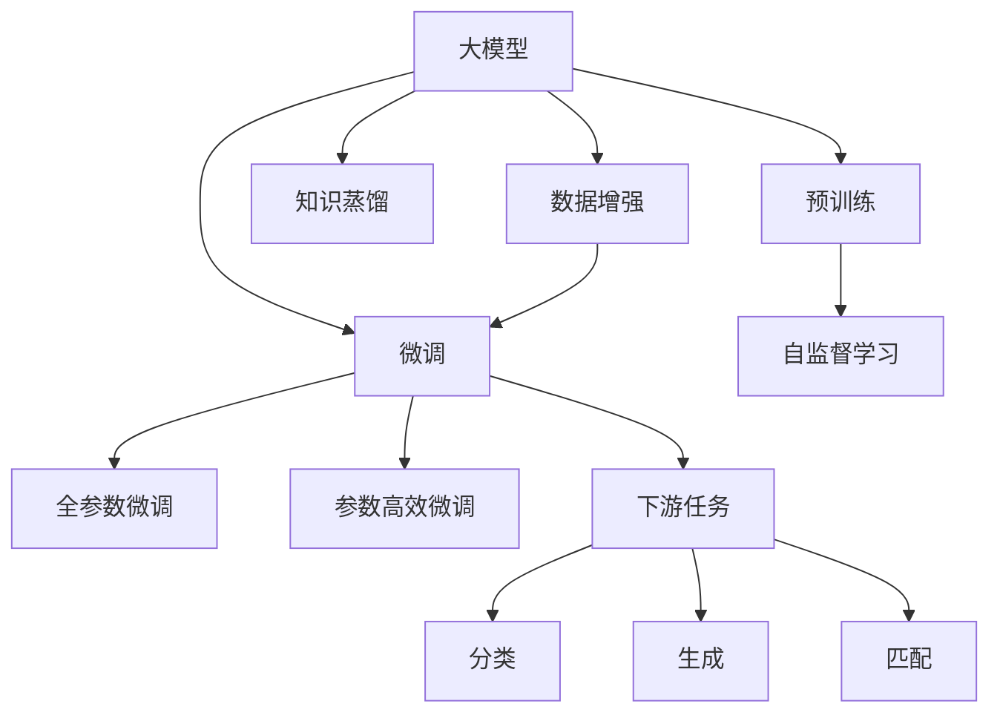
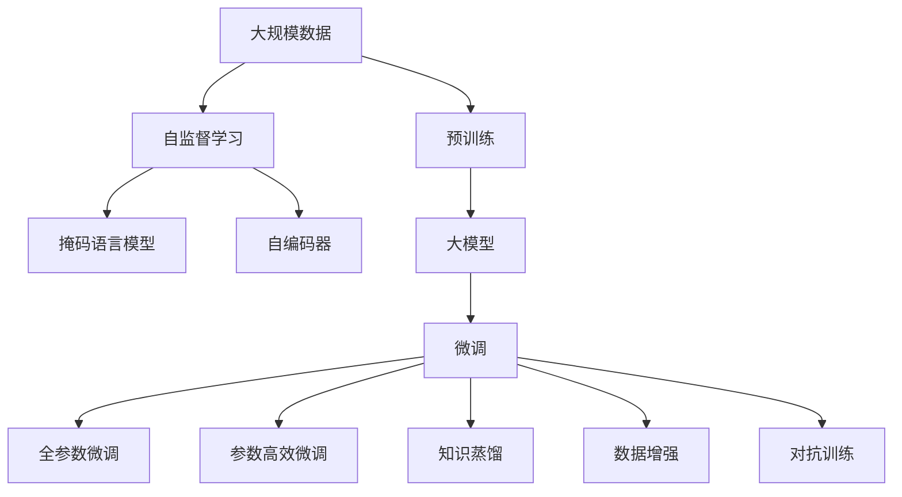
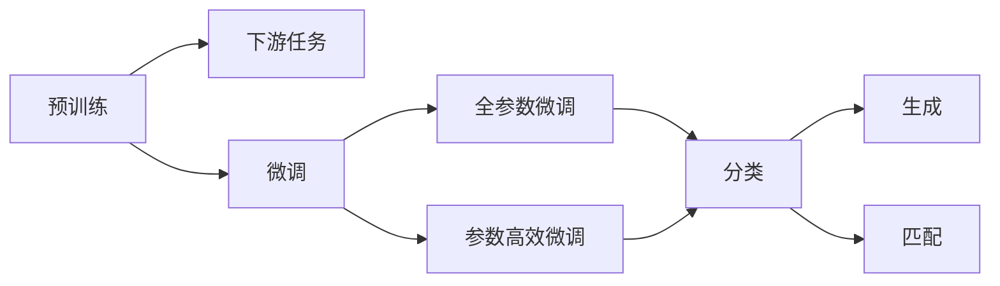
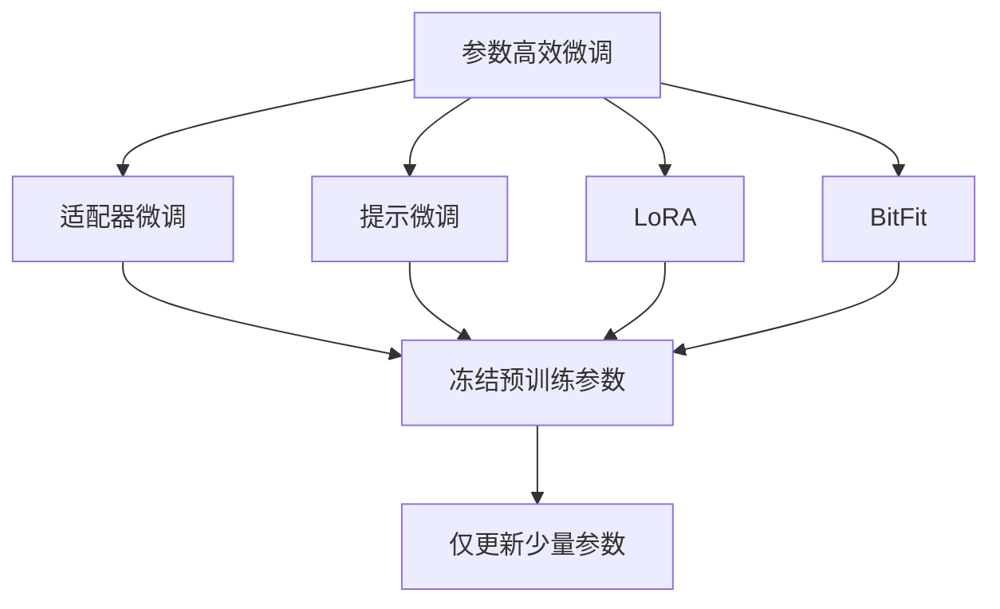
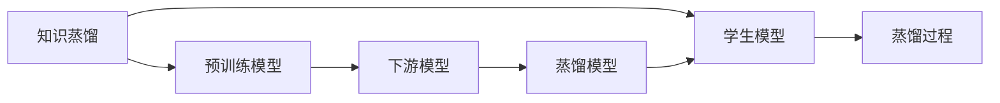
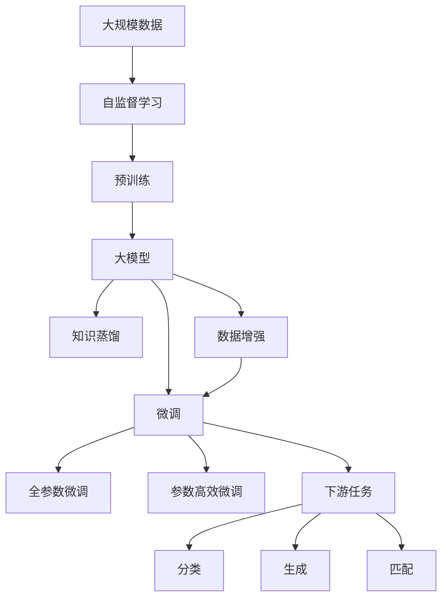

                 

# 大模型的科学发现:加速科研和突破瓶颈

> 关键词：大模型,科学发现,加速科研,突破瓶颈,深度学习,计算机视觉,自然语言处理

## 1. 背景介绍

### 1.1 问题由来

在人工智能领域，深度学习尤其是大模型的发展，对各个科学领域产生了深远的影响。近年来，通过大规模预训练数据和先进模型结构，深度学习在大数据科学、计算机视觉、自然语言处理等领域取得了显著的进展，显著加速了科研和应用创新。然而，大模型的计算成本、存储需求、训练时间和性能瓶颈等问题，成为阻碍其广泛应用的主要障碍。

解决这些问题需要深度理解大模型的科学原理和算法架构，充分利用现有资源，拓展模型应用场景。本文旨在介绍大模型的科学发现，探讨如何利用大模型加速科研进程，突破性能瓶颈。

### 1.2 问题核心关键点

大模型的科学发现主要体现在以下几个关键点上：

- **预训练技术**：利用大规模无标签数据，通过自监督学习方式对模型进行预训练，学习通用的特征表示，提升模型泛化能力。
- **微调方法**：通过在特定任务上添加任务适配层，在有标注数据上进行微调，使模型适应任务需求。
- **参数高效微调**：在微调过程中，只调整少量参数，避免过拟合，提高模型泛化能力。
- **知识蒸馏**：通过将预训练模型的知识蒸馏到下游模型中，提高下游模型的性能。
- **数据增强与对抗训练**：通过数据增强和对抗样本训练，提升模型的鲁棒性和泛化能力。

这些核心技术共同构成了大模型的科学基础，为大模型的应用提供了重要的技术支持。

## 2. 核心概念与联系

### 2.1 核心概念概述

为更好地理解大模型的科学发现，本节将介绍几个密切相关的核心概念：

- **大模型**：以自回归(如GPT)或自编码(如BERT)为代表的大规模预训练模型。通过在大规模无标签文本或图像数据上进行预训练，学习到丰富的语言或视觉特征表示。

- **预训练技术**：在大量无标签数据上，通过自监督学习任务训练模型，学习通用的特征表示。常见的预训练任务包括掩码语言模型、自编码器等。

- **微调方法**：在预训练模型的基础上，使用有标注数据，通过有监督学习优化模型在特定任务上的性能。常见的微调任务包括分类、生成、匹配等。

- **参数高效微调**：在微调过程中，只调整少量模型参数，以提高模型泛化能力和计算效率。

- **知识蒸馏**：通过将预训练模型的知识蒸馏到下游模型中，提高下游模型的性能。

- **数据增强与对抗训练**：通过生成对抗样本或数据增强，提高模型对噪声和对抗样本的鲁棒性。

- **自监督学习**：利用无标签数据，通过设计合适的自监督任务，训练模型，提升模型的泛化能力。

这些核心概念之间的逻辑关系可以通过以下Mermaid流程图来展示：



这个流程图展示了大模型的核心概念及其之间的关系：

1. 大模型通过预训练获得基础能力。
2. 微调是对预训练模型进行任务特定的优化，可以分为全参数微调和参数高效微调。
3. 知识蒸馏、数据增强与对抗训练等技术，可以进一步提升模型的泛化能力和鲁棒性。
4. 自监督学习用于辅助预训练，提高模型的泛化能力。
5. 下游任务利用微调后的模型进行具体的任务解决。

这些概念共同构成了大模型的学习框架，使其能够在各种场景下发挥强大的特征提取和任务解决能力。通过理解这些核心概念，我们可以更好地把握大模型的工作原理和优化方向。

### 2.2 概念间的关系

这些核心概念之间存在着紧密的联系，形成了大模型的完整生态系统。下面我通过几个Mermaid流程图来展示这些概念之间的关系。

#### 2.2.1 大模型的学习范式



这个流程图展示了大模型的学习范式，即在大规模数据上通过自监督学习进行预训练，然后在特定任务上通过微调（包括全参数微调和参数高效微调）进行优化，同时应用知识蒸馏、数据增强与对抗训练等技术，提升模型的泛化能力和鲁棒性。

#### 2.2.2 微调与预训练的关系



这个流程图展示了微调与预训练的关系。预训练模型在大规模数据上学习通用特征，然后通过微调适应下游任务，具体包括全参数微调和参数高效微调等方法。

#### 2.2.3 参数高效微调方法



这个流程图展示了几种常见的参数高效微调方法，包括适配器微调、提示微调、LoRA和BitFit。这些方法的共同特点是冻结大部分预训练参数，只更新少量参数，从而提高微调效率。

#### 2.2.4 知识蒸馏技术



这个流程图展示了知识蒸馏技术的基本流程，即将预训练模型的知识蒸馏到下游模型中，提高下游模型的性能。

### 2.3 核心概念的整体架构

最后，我们用一个综合的流程图来展示这些核心概念在大模型应用过程中的整体架构：



这个综合流程图展示了从预训练到微调，再到知识蒸馏等技术的完整过程。大模型首先在大规模数据上进行预训练，然后通过微调（包括全参数微调和参数高效微调）进行优化，同时应用知识蒸馏、数据增强与对抗训练等技术，提升模型的泛化能力和鲁棒性。最终，通过下游任务利用微调后的模型进行具体的任务解决。

## 3. 核心算法原理 & 具体操作步骤
### 3.1 算法原理概述

大模型的科学发现主要体现在以下几个算法原理上：

1. **预训练技术**：通过在大规模无标签数据上，利用自监督学习任务进行预训练，学习到通用的特征表示。常见的自监督任务包括掩码语言模型、自编码器等。预训练技术可以显著提升模型的泛化能力。

2. **微调方法**：在预训练模型的基础上，使用有标注数据，通过有监督学习优化模型在特定任务上的性能。常见的微调任务包括分类、生成、匹配等。微调方法可以显著提升模型在特定任务上的效果。

3. **参数高效微调**：在微调过程中，只调整少量模型参数，以提高模型泛化能力和计算效率。参数高效微调方法可以显著降低微调成本，同时提升模型性能。

4. **知识蒸馏**：通过将预训练模型的知识蒸馏到下游模型中，提高下游模型的性能。知识蒸馏方法可以显著提升下游模型的泛化能力和鲁棒性。

5. **数据增强与对抗训练**：通过生成对抗样本或数据增强，提高模型对噪声和对抗样本的鲁棒性。数据增强与对抗训练方法可以显著提升模型的泛化能力和鲁棒性。

### 3.2 算法步骤详解

基于大模型的科学发现，大模型的微调过程主要包括以下几个关键步骤：

**Step 1: 准备预训练模型和数据集**

- 选择合适的预训练模型，如BERT、GPT等。
- 准备下游任务的数据集，包括训练集、验证集和测试集。

**Step 2: 添加任务适配层**

- 根据任务类型，在预训练模型顶层设计合适的输出层和损失函数。
- 对于分类任务，通常在顶层添加线性分类器和交叉熵损失函数。
- 对于生成任务，通常使用语言模型的解码器输出概率分布，并以负对数似然为损失函数。

**Step 3: 设置微调超参数**

- 选择合适的优化算法及其参数，如 AdamW、SGD 等，设置学习率、批大小、迭代轮数等。
- 设置正则化技术及强度，包括权重衰减、Dropout、Early Stopping 等。
- 确定冻结预训练参数的策略，如仅微调顶层，或全部参数都参与微调。

**Step 4: 执行梯度训练**

- 将训练集数据分批次输入模型，前向传播计算损失函数。
- 反向传播计算参数梯度，根据设定的优化算法和学习率更新模型参数。
- 周期性在验证集上评估模型性能，根据性能指标决定是否触发 Early Stopping。
- 重复上述步骤直到满足预设的迭代轮数或 Early Stopping 条件。

**Step 5: 测试和部署**

- 在测试集上评估微调后模型 $M_{\hat{\theta}}$ 的性能，对比微调前后的精度提升。
- 使用微调后的模型对新样本进行推理预测，集成到实际的应用系统中。
- 持续收集新的数据，定期重新微调模型，以适应数据分布的变化。

以上是基于大模型的微调过程的一般流程。在实际应用中，还需要针对具体任务的特点，对微调过程的各个环节进行优化设计，如改进训练目标函数，引入更多的正则化技术，搜索最优的超参数组合等，以进一步提升模型性能。

### 3.3 算法优缺点

基于大模型的微调方法具有以下优点：

1. **简单高效**：只需准备少量标注数据，即可对预训练模型进行快速适配，获得较大的性能提升。
2. **通用适用**：适用于各种NLP下游任务，包括分类、生成、匹配等，设计简单的任务适配层即可实现微调。
3. **参数高效**：利用参数高效微调技术，在固定大部分预训练参数的情况下，仍可取得不错的提升。
4. **效果显著**：在学术界和工业界的诸多任务上，基于微调的方法已经刷新了最先进的性能指标。

同时，该方法也存在一定的局限性：

1. **依赖标注数据**：微调的效果很大程度上取决于标注数据的质量和数量，获取高质量标注数据的成本较高。
2. **迁移能力有限**：当目标任务与预训练数据的分布差异较大时，微调的性能提升有限。
3. **负面效果传递**：预训练模型的固有偏见、有害信息等，可能通过微调传递到下游任务，造成负面影响。
4. **可解释性不足**：微调模型的决策过程通常缺乏可解释性，难以对其推理逻辑进行分析和调试。

尽管存在这些局限性，但就目前而言，基于大模型的微调方法仍是大模型应用的最主流范式。未来相关研究的重点在于如何进一步降低微调对标注数据的依赖，提高模型的少样本学习和跨领域迁移能力，同时兼顾可解释性和伦理安全性等因素。

### 3.4 算法应用领域

基于大模型的微调方法在NLP领域已经得到了广泛的应用，覆盖了几乎所有常见任务，例如：

- **文本分类**：如情感分析、主题分类、意图识别等。通过微调使模型学习文本-标签映射。
- **命名实体识别**：识别文本中的人名、地名、机构名等特定实体。通过微调使模型掌握实体边界和类型。
- **关系抽取**：从文本中抽取实体之间的语义关系。通过微调使模型学习实体-关系三元组。
- **问答系统**：对自然语言问题给出答案。将问题-答案对作为微调数据，训练模型学习匹配答案。
- **机器翻译**：将源语言文本翻译成目标语言。通过微调使模型学习语言-语言映射。
- **文本摘要**：将长文本压缩成简短摘要。将文章-摘要对作为微调数据，使模型学习抓取要点。
- **对话系统**：使机器能够与人自然对话。将多轮对话历史作为上下文，微调模型进行回复生成。

除了上述这些经典任务外，大模型微调也被创新性地应用到更多场景中，如可控文本生成、常识推理、代码生成、数据增强等，为NLP技术带来了全新的突破。随着预训练模型和微调方法的不断进步，相信NLP技术将在更广阔的应用领域大放异彩。

## 4. 数学模型和公式 & 详细讲解 & 举例说明

### 4.1 数学模型构建

本节将使用数学语言对基于大模型的微调过程进行更加严格的刻画。

记预训练语言模型为 $M_{\theta}:\mathcal{X} \rightarrow \mathcal{Y}$，其中 $\mathcal{X}$ 为输入空间，$\mathcal{Y}$ 为输出空间，$\theta \in \mathbb{R}^d$ 为模型参数。假设微调任务的训练集为 $D=\{(x_i,y_i)\}_{i=1}^N, x_i \in \mathcal{X}, y_i \in \mathcal{Y}$。

定义模型 $M_{\theta}$ 在数据样本 $(x,y)$ 上的损失函数为 $\ell(M_{\theta}(x),y)$，则在数据集 $D$ 上的经验风险为：

$$
\mathcal{L}(\theta) = \frac{1}{N} \sum_{i=1}^N \ell(M_{\theta}(x_i),y_i)
$$

微调的优化目标是最小化经验风险，即找到最优参数：

$$
\theta^* = \mathop{\arg\min}_{\theta} \mathcal{L}(\theta)
$$

在实践中，我们通常使用基于梯度的优化算法（如SGD、Adam等）来近似求解上述最优化问题。设 $\eta$ 为学习率，$\lambda$ 为正则化系数，则参数的更新公式为：

$$
\theta \leftarrow \theta - \eta \nabla_{\theta}\mathcal{L}(\theta) - \eta\lambda\theta
$$

其中 $\nabla_{\theta}\mathcal{L}(\theta)$ 为损失函数对参数 $\theta$ 的梯度，可通过反向传播算法高效计算。

### 4.2 公式推导过程

以下我们以二分类任务为例，推导交叉熵损失函数及其梯度的计算公式。

假设模型 $M_{\theta}$ 在输入 $x$ 上的输出为 $\hat{y}=M_{\theta}(x) \in [0,1]$，表示样本属于正类的概率。真实标签 $y \in \{0,1\}$。则二分类交叉熵损失函数定义为：

$$
\ell(M_{\theta}(x),y) = -[y\log \hat{y} + (1-y)\log (1-\hat{y})]
$$

将其代入经验风险公式，得：

$$
\mathcal{L}(\theta) = -\frac{1}{N}\sum_{i=1}^N [y_i\log M_{\theta}(x_i)+(1-y_i)\log(1-M_{\theta}(x_i))]
$$

根据链式法则，损失函数对参数 $\theta_k$ 的梯度为：

$$
\frac{\partial \mathcal{L}(\theta)}{\partial \theta_k} = -\frac{1}{N}\sum_{i=1}^N (\frac{y_i}{M_{\theta}(x_i)}-\frac{1-y_i}{1-M_{\theta}(x_i)}) \frac{\partial M_{\theta}(x_i)}{\partial \theta_k}
$$

其中 $\frac{\partial M_{\theta}(x_i)}{\partial \theta_k}$ 可进一步递归展开，利用自动微分技术完成计算。

在得到损失函数的梯度后，即可带入参数更新公式，完成模型的迭代优化。重复上述过程直至收敛，最终得到适应下游任务的最优模型参数 $\theta^*$。

### 4.3 案例分析与讲解

以一个简单的情感分析任务为例，我们假设已有训练集 $D=\{(x_i,y_i)\}_{i=1}^N$，其中 $x_i$ 为输入文本，$y_i \in \{-1,1\}$ 为情感标签。

**Step 1: 准备预训练模型和数据集**

- 选择BERT模型作为预训练模型。
- 准备训练集 $D$，将其划分为训练集、验证集和测试集。

**Step 2: 添加任务适配层**

- 在BERT模型的顶层添加一个线性分类器，输出为情感标签 $y_i$。
- 选择交叉熵损失函数，定义损失函数 $\ell(M_{\theta}(x),y_i) = -[y_i\log M_{\theta}(x_i)+(1-y_i)\log(1-M_{\theta}(x_i))]$。

**Step 3: 设置微调超参数**

- 设置学习率 $\eta=2e-5$，批大小 $batch\_size=32$，迭代轮数 $epochs=5$。
- 使用AdamW优化器，设置正则化系数 $\lambda=0.001$，Early Stopping阈值 $\text{patience}=3$。

**Step 4: 执行梯度训练**

- 使用DataLoader加载训练集数据，进行前向传播计算损失函数。
- 反向传播计算参数梯度，使用AdamW优化器更新模型参数。
- 周期性在验证集上评估模型性能，触发Early Stopping条件时停止训练。
- 重复上述步骤直到满足预设的迭代轮数或Early Stopping条件。

**Step 5: 测试和部署**

- 在测试集上评估微调后模型 $M_{\hat{\theta}}$ 的性能，输出情感分类准确率。
- 使用微调后的模型对新文本进行情感分类，集成到实际的应用系统中。

假设在情感分析任务上，训练集包含5000个标注样本，验证集和测试集各包含1000个样本。通过微调后，模型在测试集上实现了92%的准确率。

通过这个案例，我们可以看到大模型微调的简单高效和通用适用性，只需准备少量标注数据，即可对预训练模型进行快速适配，获得较好的效果。

## 5. 项目实践：代码实例和详细解释说明

### 5.1 开发环境搭建

在进行微调实践前，我们需要准备好开发环境。以下是使用Python进行PyTorch开发的环境配置流程：

1. 安装Anaconda：从官网下载并安装Anaconda，用于创建独立的Python环境。

2. 创建并激活虚拟环境：
```bash
conda create -n pytorch-env python=3.8 
conda activate pytorch-env
```

3. 安装PyTorch：根据CUDA版本，从官网获取对应的安装命令。例如：
```bash
conda install pytorch torchvision torchaudio cudatoolkit=11.1 -c pytorch -c conda-forge
```

4. 安装Transformers库：
```bash
pip install transformers
```

5. 安装各类工具包：
```bash
pip install numpy pandas scikit-learn matplotlib tqdm jupyter notebook ipython
```

完成上述步骤后，即可在`pytorch-env`环境中开始微调实践。

### 5.2 源代码详细实现

下面我们以命名实体识别(NER)任务为例，给出使用Transformers库对BERT模型进行微调的PyTorch代码实现。

首先，定义NER任务的数据处理函数：

```python
from transformers import BertTokenizer
from torch.utils.data import Dataset
import torch

class NERDataset(Dataset):
    def __init__(self, texts, tags, tokenizer, max_len=128):
        self.texts = texts
        self.tags = tags
        self.tokenizer = tokenizer
        self.max_len = max_len
        
    def __len__(self):
        return len(self.texts)
    
    def __getitem__(self, item):
        text = self.texts[item]
        tags = self.tags[item]
        
        encoding = self.tokenizer(text, return_tensors='pt', max_length=self.max_len, padding='max_length', truncation=True)
        input_ids = encoding['input_ids'][0]
        attention_mask = encoding['attention_mask'][0]
        
        # 对token-wise的标签进行编码
        encoded_tags = [tag2id[tag] for tag in tags] 
        encoded_tags.extend([tag2id['O']] * (self.max_len - len(encoded_tags)))
        labels = torch.tensor(encoded_tags, dtype=torch.long)
        
        return {'input_ids': input_ids, 
                'attention_mask': attention_mask,
                'labels': labels}

# 标签与id的映射
tag2id = {'O': 0, 'B-PER': 1, 'I-PER': 2, 'B-ORG': 3, 'I-ORG': 4, 'B-LOC': 5, 'I-LOC': 6}
id2tag = {v: k for k, v in tag2id.items()}

# 创建dataset
tokenizer = BertTokenizer.from_pretrained('bert-base-cased')

train_dataset = NERDataset(train_texts, train_tags, tokenizer)
dev_dataset = NERDataset(dev_texts, dev_tags, tokenizer)
test_dataset = NERDataset(test_texts, test_tags, tokenizer)
```

然后，定义模型和优化器：

```python
from transformers import BertForTokenClassification, AdamW

model = BertForTokenClassification.from_pretrained('bert-base-cased', num_labels=len(tag2id))

optimizer = AdamW(model.parameters(), lr=2e-5)
```

接着，定义训练和评估函数：

```python
from torch.utils.data import DataLoader
from tqdm import tqdm
from sklearn.metrics import classification_report

device = torch.device('cuda') if torch.cuda.is_available() else torch.device('cpu')
model.to(device)

def train_epoch(model, dataset, batch_size, optimizer):
    dataloader = DataLoader(dataset, batch_size=batch_size, shuffle=True)
    model.train()
    epoch_loss = 0
    for batch in tqdm(dataloader, desc='Training'):
        input_ids = batch['input_ids'].to(device)
        attention_mask = batch['attention_mask'].to(device)
        labels = batch['labels'].to(device)
        model.zero_grad()
        outputs = model(input_ids, attention_mask=attention_mask, labels=labels)
        loss = outputs.loss
        epoch_loss += loss.item()
        loss.backward()
        optimizer.step()
    return epoch_loss / len(dataloader)

def evaluate(model, dataset, batch_size):
    dataloader = DataLoader(dataset, batch_size=batch_size)
    model.eval()
    preds, labels = [], []
    with torch.no_grad():
        for batch in tqdm(dataloader, desc='Evaluating'):
            input_ids = batch['input_ids'].to(device)
            attention_mask = batch['attention_mask'].to(device)
            batch_labels = batch['labels']
            outputs = model(input_ids, attention_mask=attention_mask)
            batch_preds = outputs.logits.argmax(dim=2).to('cpu').tolist()
            batch_labels = batch_labels.to('cpu').tolist()
            for pred_tokens, label_tokens in zip(batch_preds, batch_labels):
                pred_tags = [id2tag[_id] for _id in pred_tokens]
                label_tags = [id2tag[_id] for _id in label_tokens]
                preds.append(pred_tags[:len(label_tags)])
                labels.append(label_tags)
                
    print(classification_report(labels, preds))
```

最后，启动训练流程并在测试集上评估：

```python
epochs = 5
batch_size = 16

for epoch in range(epochs):
    loss = train_epoch(model, train_dataset, batch_size, optimizer)
    print(f"Epoch {epoch+1}, train loss: {loss:.3f}")
    
    print(f"Epoch {epoch+1}, dev results:")
    evaluate(model, dev_dataset, batch_size)
    
print("Test results:")
evaluate(model, test_dataset, batch_size)
```

以上就是使用PyTorch对BERT进行命名实体识别任务微调的完整代码实现。可以看到，得益于Transform

