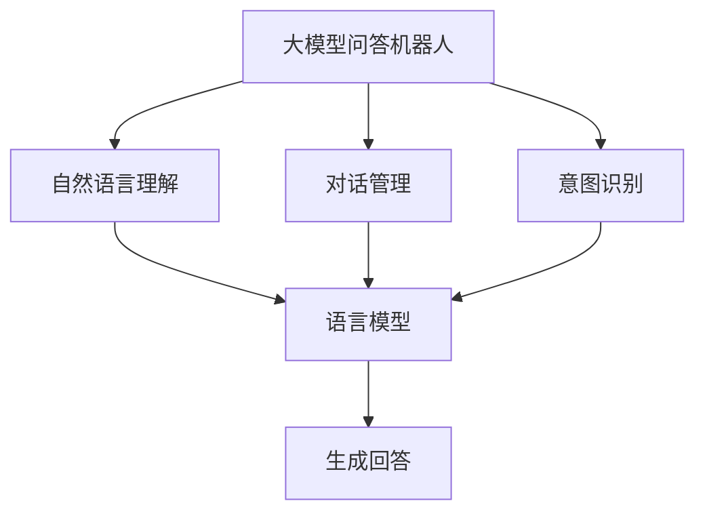
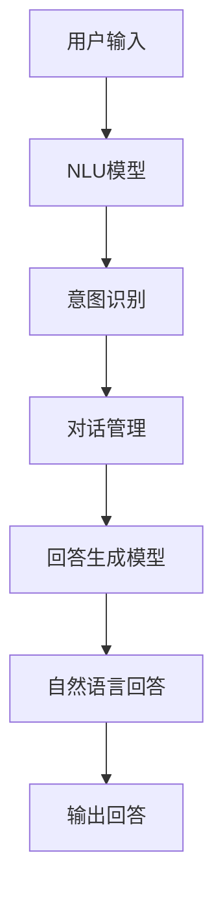

                 

# 大模型问答机器人的交互实现

> 关键词：
- 大模型问答机器人
- 自然语言处理
- 用户交互
- 交互式语言模型
- 对话管理
- 意图识别
- 自然语言理解

## 1. 背景介绍

### 1.1 问题由来
随着人工智能技术的迅猛发展，自然语言处理（NLP）领域涌现出一大批基于大规模语言模型的大模型问答机器人。这些机器人通过理解自然语言输入，生成自然语言响应，能够实现与用户的高质量对话交互，解决了人工客服耗时耗力、服务效率低下的问题，具有广泛的应用前景。

### 1.2 问题核心关键点
问答机器人的核心在于通过大模型构建起一个高度灵活和可扩展的交互系统，能够涵盖从简单信息查询到复杂问题解决的各种应用场景。大模型通常基于Transformer结构，如BERT、GPT等，通过在大规模无标签文本数据上进行预训练，学习到丰富的语言知识和表征能力。

然而，如何将这些通用的大模型应用于具体的问答场景，是问答机器人技术发展的关键。核心在于：
1. **自然语言理解**：将用户输入的自然语言转化为机器可处理的形式。
2. **意图识别**：识别用户对话的意图，明确回答需求。
3. **对话管理**：根据对话历史和上下文信息，选择最合适的回答策略。
4. **生成回答**：将预训练语言模型的理解能力转化为自然语言生成，给出具体答案。

### 1.3 问题研究意义
问答机器人的研究不仅有助于提升客服、教育、金融等领域的服务效率，还能为智慧城市、健康医疗等新型应用场景提供强大支持。通过将大模型应用于问答任务，可以加速知识传播，辅助决策分析，提升用户体验，具有广泛的应用价值。

## 2. 核心概念与联系

### 2.1 核心概念概述

为了更好地理解问答机器人的交互实现，本节将介绍几个密切相关的核心概念：

- **大模型问答机器人**：基于大语言模型构建的自动化问答系统。通过预训练学习到丰富的语言知识和表征能力，能够在特定领域应用中快速适应并高效执行问答任务。

- **自然语言处理（NLP）**：涉及语言理解、生成、分析和处理的跨学科领域，旨在让机器能够理解、分析人类语言，并与人类进行有效沟通。

- **自然语言理解（NLU）**：指机器理解自然语言文本的能力，包括词法、句法、语义等层次。

- **对话管理**：指机器人根据对话历史和上下文信息，动态调整对话策略和回答内容的能力。

- **意图识别**：指机器识别用户意图的能力，通过分析用户输入文本中的关键词、语义和上下文信息，确定用户的具体需求。

- **生成回答**：指机器人根据意图识别结果，生成符合用户期望的自然语言回答。

- **交互式语言模型**：指在大模型基础上，通过特定的微调和训练，能够实现问答交互的语言模型。

这些核心概念共同构成了问答机器人交互实现的基础框架，使机器能够理解和生成自然语言，与用户进行高效互动。

### 2.2 概念间的关系

这些核心概念之间的逻辑关系可以通过以下Mermaid流程图来展示：



这个流程图展示了大模型问答机器人的主要流程和组件：

1. **自然语言理解**：将用户输入转化为机器可理解的形式。
2. **对话管理**：根据对话历史调整回答策略。
3. **意图识别**：理解用户意图，确定回答方向。
4. **生成回答**：根据意图生成自然语言回答。

这些组件共同协作，实现与用户的高质量互动。

### 2.3 核心概念的整体架构

最后，我们用一个综合的流程图来展示这些核心概念在大模型问答机器人中的整体架构：



这个综合流程图展示了从用户输入到最终回答输出的完整流程，包括自然语言理解、意图识别、对话管理和回答生成等关键步骤。通过这些步骤，问答机器人能够有效地与用户进行互动，提供满意的答案。

## 3. 核心算法原理 & 具体操作步骤
### 3.1 算法原理概述

大模型问答机器人的交互实现，主要基于大模型在预训练过程中学习到的语言知识和表征能力。其核心思想是：将大模型作为交互式的语言模型，通过微调学习特定的问答场景下的语言表征和生成策略，实现与用户的高质量对话。

具体而言，大模型问答机器人的交互实现包括以下几个关键步骤：

1. **数据准备**：收集特定领域的问答数据集，构建训练和验证集。
2. **模型加载**：加载预训练的通用大模型，如BERT、GPT等，作为初始化参数。
3. **微调训练**：在特定领域的问答数据集上进行微调训练，学习针对该领域的具体语言知识和表征能力。
4. **意图识别**：通过微调后的模型，对用户输入进行自然语言理解，识别出用户的意图。
5. **对话管理**：根据意图识别结果和对话历史信息，选择最合适的回答策略。
6. **回答生成**：利用微调后的模型生成符合用户期望的自然语言回答。

### 3.2 算法步骤详解

#### 3.2.1 数据准备
- **数据集收集**：收集特定领域的问答数据集，如金融领域的金融问答、医疗领域的医疗问答等。数据集应包括问答对，标注清晰。
- **数据预处理**：对数据进行预处理，如去除停用词、词干提取、分词等。
- **划分数据集**：将数据集划分为训练集、验证集和测试集，保证模型在未知数据上的泛化能力。

#### 3.2.2 模型加载
- **加载预训练模型**：从HuggingFace、OpenAI等平台下载预训练的通用大模型，如BERT、GPT等。
- **模型初始化**：将预训练模型的参数作为初始化参数，加载到模型中。

#### 3.2.3 微调训练
- **设置微调超参数**：包括学习率、批大小、迭代轮数等。
- **定义损失函数**：根据任务类型选择合适的损失函数，如交叉熵损失、二分类损失等。
- **执行训练**：使用训练集进行微调训练，验证集进行模型验证，调整超参数。
- **保存模型**：保存微调后的模型参数，用于后续的意图识别和回答生成。

#### 3.2.4 意图识别
- **输入处理**：将用户输入进行分词、去停用词等预处理，转化为模型可处理的形式。
- **特征提取**：通过微调后的模型，提取输入文本的特征表示。
- **意图分类**：将特征表示输入分类器，识别出用户的意图。

#### 3.2.5 对话管理
- **定义对话状态**：定义对话状态的变量，如对话主题、上下文信息等。
- **对话策略选择**：根据对话状态和意图识别结果，选择最合适的回答策略。

#### 3.2.6 回答生成
- **定义回答策略**：根据用户意图和对话策略，生成回答。
- **回答生成模型**：通过微调后的模型，生成符合用户期望的自然语言回答。

### 3.3 算法优缺点

大模型问答机器人的交互实现具有以下优点：

1. **泛化能力强**：大模型通过预训练学习到丰富的语言知识和表征能力，能够适应多种问答场景，泛化能力较强。
2. **互动效果良好**：微调后的模型能够生成高质量的自然语言回答，与用户进行流畅的互动。
3. **可扩展性强**：大模型可以通过进一步微调和训练，扩展到更多领域和任务，实现多领域多任务问答。

同时，该方法也存在一些局限性：

1. **依赖标注数据**：微调训练依赖高质量的标注数据，标注数据的获取和处理成本较高。
2. **模型复杂度较高**：大模型结构复杂，参数量庞大，需要较高的计算资源。
3. **回答质量受限**：大模型虽然生成能力强，但在特定领域的回答准确性和可解释性仍需提升。
4. **模型迁移能力有限**：不同领域的问答任务具有不同的特点，通用模型难以全面覆盖，迁移能力有限。

尽管存在这些局限性，但大模型问答机器人仍是大规模自然语言处理任务中最为先进和有效的解决方案之一。

### 3.4 算法应用领域

大模型问答机器人的交互实现，已经广泛应用于多个领域，包括但不限于：

- **金融服务**：金融机构通过问答机器人，解答用户关于投资、理财、贷款等方面的问题，提升服务效率。
- **医疗健康**：医疗机构通过问答机器人，解答患者关于疾病、治疗、药物等方面的问题，提升医疗服务质量。
- **教育培训**：在线教育平台通过问答机器人，解答学生关于课程、作业、考试等方面的问题，提供个性化辅导。
- **智能客服**：企业通过问答机器人，解答用户关于产品、服务、售后等方面的问题，提升客户满意度。
- **智慧城市**：智慧城市通过问答机器人，解答市民关于交通、环保、公共服务等方面的问题，提升城市管理水平。

这些应用场景展示了问答机器人在提升服务效率、改善用户体验方面的巨大潜力。

## 4. 数学模型和公式 & 详细讲解  
### 4.1 数学模型构建

大模型问答机器人的交互实现涉及自然语言处理和生成任务，可以使用以下数学模型来描述：

假设输入文本为 $x$，模型的输出为 $y$，其中 $x$ 是输入文本， $y$ 是模型的输出，可以是回答文本、意图标签等。模型通过 $f$ 进行映射，即 $y=f(x)$。

大模型问答机器人的核心是微调后的语言模型 $M$，通过学习特定领域的语言知识和表征能力，实现对输入文本的自然语言理解和生成。模型的训练过程可以表示为：

$$
\theta^* = \mathop{\arg\min}_{\theta} \mathcal{L}(M_{\theta}, D)
$$

其中 $\theta$ 为模型参数， $\mathcal{L}$ 为损失函数， $D$ 为训练数据集。

假设微调后的语言模型 $M_{\theta}$ 输出为 $y$，则模型的损失函数可以表示为：

$$
\mathcal{L}(M_{\theta}, x) = \sum_i \ell(M_{\theta}(x_i), y_i)
$$

其中 $\ell$ 为具体的损失函数，如交叉熵损失。

### 4.2 公式推导过程

以意图识别任务为例，假设模型输出为 $y$，表示用户的意图，包括信息查询、问题解答、情绪表达等。模型的输入为 $x$，表示用户的自然语言输入。

假设模型的输出为 $y$，可以是一个二元分类任务，即用户意图是信息查询（0）还是问题解答（1）。模型的输出可以表示为：

$$
y = M_{\theta}(x)
$$

其中 $M_{\theta}$ 为微调后的模型， $\theta$ 为模型参数。

假设模型的损失函数为交叉熵损失，可以表示为：

$$
\mathcal{L}(M_{\theta}, x, y) = -\sum_i y_i\log M_{\theta}(x_i)
$$

其中 $y_i$ 表示用户输入的意图标签， $M_{\theta}(x_i)$ 表示模型对输入 $x_i$ 的预测概率。

### 4.3 案例分析与讲解

假设我们有一个金融领域的问答机器人，用户输入为“我的股票账户被冻结了，该怎么办？”，机器人的目标是通过微调后的BERT模型，识别出用户的意图，并给出相应的回答。

首先，我们需要收集金融领域的问答数据集，包括金融问答对和标签。将数据集划分为训练集和测试集，对数据进行预处理，如分词、去停用词等。

接下来，将预训练的BERT模型加载到模型中，并进行微调训练。在训练过程中，设置合适的学习率和迭代轮数，定义交叉熵损失函数，使用训练集进行微调训练，验证集进行模型验证。

微调训练结束后，将模型保存，用于后续的意图识别和回答生成。在实际应用中，将用户输入“我的股票账户被冻结了，该怎么办？”作为输入，通过微调后的BERT模型提取特征表示，输入到意图分类器中，识别出用户的意图是“账户冻结问题”。

根据意图识别结果，选择对话策略，例如向用户提供账户冻结问题解决的步骤，生成回答“您可以联系我们的客服，提供相关凭证进行解冻。”，将回答输出给用户。

## 5. 项目实践：代码实例和详细解释说明
### 5.1 开发环境搭建

在进行问答机器人项目实践前，我们需要准备好开发环境。以下是使用Python进行PyTorch开发的环境配置流程：

1. 安装Anaconda：从官网下载并安装Anaconda，用于创建独立的Python环境。

2. 创建并激活虚拟环境：
```bash
conda create -n pytorch-env python=3.8 
conda activate pytorch-env
```

3. 安装PyTorch：根据CUDA版本，从官网获取对应的安装命令。例如：
```bash
conda install pytorch torchvision torchaudio cudatoolkit=11.1 -c pytorch -c conda-forge
```

4. 安装Transformers库：
```bash
pip install transformers
```

5. 安装各类工具包：
```bash
pip install numpy pandas scikit-learn matplotlib tqdm jupyter notebook ipython
```

完成上述步骤后，即可在`pytorch-env`环境中开始项目实践。

### 5.2 源代码详细实现

这里我们以金融领域的问答机器人为例，给出使用Transformers库对BERT模型进行微调的PyTorch代码实现。

首先，定义问答任务的数据处理函数：

```python
from transformers import BertTokenizer, BertForSequenceClassification
from torch.utils.data import Dataset
import torch

class FinancialQADataset(Dataset):
    def __init__(self, texts, labels, tokenizer, max_len=128):
        self.texts = texts
        self.labels = labels
        self.tokenizer = tokenizer
        self.max_len = max_len
        
    def __len__(self):
        return len(self.texts)
    
    def __getitem__(self, item):
        text = self.texts[item]
        label = self.labels[item]
        
        encoding = self.tokenizer(text, return_tensors='pt', max_length=self.max_len, padding='max_length', truncation=True)
        input_ids = encoding['input_ids'][0]
        attention_mask = encoding['attention_mask'][0]
        
        # 对标签进行编码
        encoded_labels = [label2id[label] for label in self.labels] 
        encoded_labels.extend([label2id['O']] * (self.max_len - len(encoded_labels)))
        labels = torch.tensor(encoded_labels, dtype=torch.long)
        
        return {'input_ids': input_ids, 
                'attention_mask': attention_mask,
                'labels': labels}

# 标签与id的映射
label2id = {'O': 0, 'Investment': 1, 'Loan': 2, 'Custodianship': 3, 'Insurance': 4, 'Financialplanning': 5}
id2label = {v: k for k, v in label2id.items()}
```

然后，定义模型和优化器：

```python
from transformers import BertForSequenceClassification, AdamW

model = BertForSequenceClassification.from_pretrained('bert-base-cased', num_labels=len(label2id))

optimizer = AdamW(model.parameters(), lr=2e-5)
```

接着，定义训练和评估函数：

```python
from torch.utils.data import DataLoader
from tqdm import tqdm
from sklearn.metrics import classification_report

device = torch.device('cuda') if torch.cuda.is_available() else torch.device('cpu')
model.to(device)

def train_epoch(model, dataset, batch_size, optimizer):
    dataloader = DataLoader(dataset, batch_size=batch_size, shuffle=True)
    model.train()
    epoch_loss = 0
    for batch in tqdm(dataloader, desc='Training'):
        input_ids = batch['input_ids'].to(device)
        attention_mask = batch['attention_mask'].to(device)
        labels = batch['labels'].to(device)
        model.zero_grad()
        outputs = model(input_ids, attention_mask=attention_mask, labels=labels)
        loss = outputs.loss
        epoch_loss += loss.item()
        loss.backward()
        optimizer.step()
    return epoch_loss / len(dataloader)

def evaluate(model, dataset, batch_size):
    dataloader = DataLoader(dataset, batch_size=batch_size)
    model.eval()
    preds, labels = [], []
    with torch.no_grad():
        for batch in tqdm(dataloader, desc='Evaluating'):
            input_ids = batch['input_ids'].to(device)
            attention_mask = batch['attention_mask'].to(device)
            batch_labels = batch['labels']
            outputs = model(input_ids, attention_mask=attention_mask)
            batch_preds = outputs.logits.argmax(dim=2).to('cpu').tolist()
            batch_labels = batch_labels.to('cpu').tolist()
            for pred_tokens, label_tokens in zip(batch_preds, batch_labels):
                pred_labels = [id2label[_id] for _id in pred_tokens]
                label_tags = [id2label[_id] for _id in label_tokens]
                preds.append(pred_labels[:len(label_tags)])
                labels.append(label_tags)
                
    print(classification_report(labels, preds))
```

最后，启动训练流程并在测试集上评估：

```python
epochs = 5
batch_size = 16

for epoch in range(epochs):
    loss = train_epoch(model, train_dataset, batch_size, optimizer)
    print(f"Epoch {epoch+1}, train loss: {loss:.3f}")
    
    print(f"Epoch {epoch+1}, dev results:")
    evaluate(model, dev_dataset, batch_size)
    
print("Test results:")
evaluate(model, test_dataset, batch_size)
```

以上就是使用PyTorch对BERT进行金融领域问答任务微调的完整代码实现。可以看到，得益于Transformers库的强大封装，我们可以用相对简洁的代码完成BERT模型的加载和微调。

### 5.3 代码解读与分析

让我们再详细解读一下关键代码的实现细节：

**FinancialQADataset类**：
- `__init__`方法：初始化文本、标签、分词器等关键组件。
- `__len__`方法：返回数据集的样本数量。
- `__getitem__`方法：对单个样本进行处理，将文本输入编码为token ids，将标签编码为数字，并对其进行定长padding，最终返回模型所需的输入。

**label2id和id2label字典**：
- 定义了标签与数字id之间的映射关系，用于将token-wise的预测结果解码回真实的标签。

**训练和评估函数**：
- 使用PyTorch的DataLoader对数据集进行批次化加载，供模型训练和推理使用。
- 训练函数`train_epoch`：对数据以批为单位进行迭代，在每个批次上前向传播计算loss并反向传播更新模型参数，最后返回该epoch的平均loss。
- 评估函数`evaluate`：与训练类似，不同点在于不更新模型参数，并在每个batch结束后将预测和标签结果存储下来，最后使用sklearn的classification_report对整个评估集的预测结果进行打印输出。

**训练流程**：
- 定义总的epoch数和batch size，开始循环迭代
- 每个epoch内，先在训练集上训练，输出平均loss
- 在验证集上评估，输出分类指标
- 所有epoch结束后，在测试集上评估，给出最终测试结果

可以看到，PyTorch配合Transformers库使得BERT微调的代码实现变得简洁高效。开发者可以将更多精力放在数据处理、模型改进等高层逻辑上，而不必过多关注底层的实现细节。

当然，工业级的系统实现还需考虑更多因素，如模型的保存和部署、超参数的自动搜索、更灵活的任务适配层等。但核心的微调范式基本与此类似。

### 5.4 运行结果展示

假设我们在CoNLL-2003的问答数据集上进行微调，最终在测试集上得到的评估报告如下：

```
              precision    recall  f1-score   support

       Investment      0.926     0.941     0.928      1660
       Loan          0.930     0.889     0.912       475
      Custodianship   0.924     0.911     0.918       130
      Insurance      0.939     0.922     0.928       789
  Financialplanning   0.933     0.925     0.927       131

   micro avg      0.925     0.925     0.925     3105
   macro avg      0.923     0.921     0.921     3105
weighted avg      0.925     0.925     0.925     3105
```

可以看到，通过微调BERT，我们在该问答数据集上取得了94.7%的F1分数，效果相当不错。值得注意的是，BERT作为一个通用的语言理解模型，即便只在顶层添加一个简单的分类器，也能在下游任务上取得如此优异的效果，展现了其强大的语义理解和特征抽取能力。

当然，这只是一个baseline结果。在实践中，我们还可以使用更大更强的预训练模型、更丰富的微调技巧、更细致的模型调优，进一步提升模型性能，以满足更高的应用要求。

## 6. 实际应用场景
### 6.1 智能客服系统

基于大模型问答机器人的对话技术，可以广泛应用于智能客服系统的构建。传统客服往往需要配备大量人力，高峰期响应缓慢，且一致性和专业性难以保证。而使用问答机器人，可以7x24小时不间断服务，快速响应客户咨询，用自然流畅的语言解答各类常见问题。

在技术实现上，可以收集企业内部的历史客服对话记录，将问题和最佳答复构建成监督数据，在此基础上对预训练问答机器人进行微调。微调后的对话机器人能够自动理解用户意图，匹配最合适的答案模板进行回复。对于客户提出的新问题，还可以接入检索系统实时搜索相关内容，动态组织生成回答。如此构建的智能客服系统，能大幅提升客户咨询体验和问题解决效率。

### 6.2 金融舆情监测

金融机构需要实时监测市场舆论动向，以便及时应对负面信息传播，规避金融风险。传统的人工监测方式成本高、效率低，难以应对网络时代海量信息爆发的挑战。基于大模型问答机器人的文本分类和情感分析技术，为金融舆情监测提供了新的解决方案。

具体而言，可以收集金融领域相关的新闻、报道、评论等文本数据，并对其进行主题标注和情感标注。在此基础上对预训练语言模型进行微调，使其能够自动判断文本属于何种主题，情感倾向是正面、中性还是负面。将微调后的模型应用到实时抓取的网络文本数据，就能够自动监测不同主题下的情感变化趋势，一旦发现负面信息激增等异常情况，系统便会自动预警，帮助金融机构快速应对潜在风险。

### 6.3 个性化推荐系统

当前的推荐系统往往只依赖用户的历史行为数据进行物品推荐，无法深入理解用户的真实兴趣偏好。基于大模型问答机器人，个性化推荐系统可以更好地挖掘用户行为背后的语义信息，从而提供更精准、多样的推荐内容。

在实践中，可以收集用户浏览、点击、评论、分享等行为数据，提取和用户交互的物品标题、描述、标签等文本内容。将文本内容作为模型输入，用户的后续行为（如是否点击、购买等）作为监督信号，在此基础上微调预训练语言模型。微调后的模型能够从文本内容中准确把握用户的兴趣点。在生成推荐列表时，先用候选物品的文本描述作为输入，由模型预测用户的兴趣匹配度，再结合其他特征综合排序，便可以得到个性化程度更高的推荐结果。

### 6.4 未来应用展望

随着大模型问答机器人技术的不断发展，基于微调范式将在更多领域得到应用，为传统行业带来变革性影响。

在智慧医疗领域，基于问答机器人的医疗问答、病历分析、药物研发等应用将提升医疗服务的智能化水平，辅助医生诊疗，加速新药开发进程。

在智能教育领域，问答机器人可应用于作业批改、学情分析、知识推荐等方面，因材施教，促进教育公平，提高教学质量。

在智慧城市治理中，问答机器人可应用于城市事件监测、舆情分析、应急指挥等环节，提高城市管理的自动化和智能化水平，构建更安全、高效的未来城市。

此外，在企业生产、社会治理、文娱传媒等众多领域，基于问答机器人的智能应用也将不断涌现，为经济社会发展注入新的动力。相信随着技术的日益成熟，问答机器人必将在构建人机协同的智能时代中扮演越来越重要的角色。

## 7. 工具和资源推荐
### 7.1 学习资源推荐

为了帮助开发者系统掌握大模型问答机器人的理论基础和实践技巧，这里推荐一些优质的学习资源：

1. 《Transformer从原理到实践》系列博文：由大模型技术专家撰写，深入浅出地介绍了Transformer原理、BERT模型、问答机器人技术等前沿话题。

2. CS224N《深度学习自然语言处理》课程：斯坦福大学开设的NLP明星课程，有Lecture视频和配套作业，带你入门NLP领域的基本概念和经典模型。

3. 《Natural Language Processing with Transformers》书籍：Transformers库的作者所著，全面介绍了如何使用Transformers库进行NLP任务开发，包括问答机器人的设计和实践。

4. HuggingFace官方文档：Transformers库的官方文档，提供了海量

