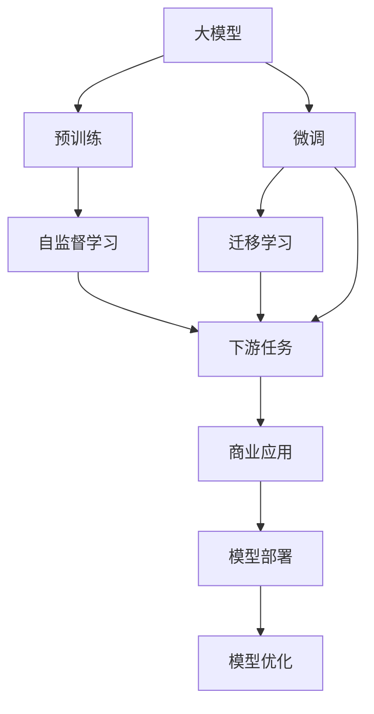

                 

# 大模型：从实验室到商业应用的落地

> 关键词：大模型,商业化,落地应用,算法优化,算法优化,数据优化,模型评估,预训练模型,微调模型,模型压缩,模型部署

## 1. 背景介绍

### 1.1 问题由来
近年来，随着深度学习技术的快速发展，大规模预训练语言模型（Large Language Models, LLMs）在自然语言处理（NLP）领域取得了显著突破。这些模型通过在大规模无标签文本数据上进行预训练，学习到丰富的语言知识和常识，能够自然地理解并生成人类语言。然而，这些通用大模型在特定领域的应用效果往往不理想，需要进一步的微调和优化，才能更好地适应特定任务。

### 1.2 问题核心关键点
目前，大模型在特定领域的应用面临以下主要问题：

- **泛化能力不足**：通用大模型在特定领域的表现可能不如专有领域的模型。
- **过拟合风险**：小样本数据集容易导致模型过拟合，降低泛化性能。
- **模型大小和计算资源消耗**：大规模模型需要大量计算资源和存储空间，限制了其在实际应用中的部署。

### 1.3 问题研究意义
解决这些问题，使大模型能够在大规模、高需求的应用场景中落地，具有重要意义：

- **降低开发成本**：预训练模型可以显著减少从头开发所需的数据、计算和人力成本。
- **提升性能**：微调和优化可以使模型在特定任务上表现更优，满足更高应用需求。
- **加速开发进度**：利用已有预训练模型，可以快速构建应用系统，缩短开发周期。
- **促进技术创新**：大模型微调和优化研究可以带来新的技术思路和方法，推动学科进步。
- **赋能产业升级**：将AI技术应用到各行各业，为传统行业数字化转型升级提供新路径。

## 2. 核心概念与联系

### 2.1 核心概念概述

- **大模型（Large Models）**：指通过在大规模无标签文本数据上进行预训练，学习通用语言表示的大型神经网络模型。例如，GPT-3、BERT等。

- **预训练（Pre-training）**：指在大规模无标签数据上，通过自监督学习任务（如语言模型、掩码语言模型）训练模型的过程。

- **微调（Fine-tuning）**：指在预训练模型的基础上，使用下游任务的少量标注数据，通过有监督学习优化模型在特定任务上的性能。

- **迁移学习（Transfer Learning）**：指将一个领域学到的知识迁移到另一个相关领域的学习过程。大模型的预训练-微调过程即是一种典型的迁移学习方式。

- **模型压缩（Model Compression）**：指在不显著降低模型性能的前提下，减小模型大小和计算资源消耗的技术。

- **模型部署（Model Deployment）**：指将训练好的模型应用到实际生产环境中，提供服务或进行推理的过程。

这些核心概念之间相互关联，构成了大模型从实验室到商业应用的完整生态系统。通过理解和应用这些概念，可以更好地指导大模型在实际场景中的应用。

### 2.2 概念间的关系

以下是这些核心概念之间的逻辑关系：



这个图表展示了从预训练到微调，再到迁移学习和模型部署的过程，最终实现大模型的商业化应用。

## 3. 核心算法原理 & 具体操作步骤

### 3.1 算法原理概述

大模型的商业化落地主要通过微调和优化实现。其核心思想是在预训练的基础上，通过有监督学习调整模型参数，使其在特定任务上表现更佳。微调过程可以大致分为以下几步：

1. **数据准备**：收集下游任务的标注数据集。
2. **模型适配**：根据任务类型设计合适的输出层和损失函数。
3. **超参数设置**：选择合适的优化器、学习率、批大小等超参数。
4. **模型训练**：在标注数据集上训练模型，通过前向传播和反向传播更新参数。
5. **模型评估**：在验证集和测试集上评估模型性能，选择最佳模型。
6. **模型部署**：将训练好的模型应用于实际生产环境。

### 3.2 算法步骤详解

以命名实体识别（NER）任务为例，详细解释微调过程：

1. **数据准备**：收集NER任务的标注数据集，例如CoNLL-2003数据集。
2. **模型适配**：使用BERT等预训练模型，在其顶层添加一个线性分类器和交叉熵损失函数。
3. **超参数设置**：设置AdamW优化器，学习率为2e-5，批大小为16。
4. **模型训练**：在训练集上进行梯度下降训练，每次迭代更新模型参数。
5. **模型评估**：在验证集上评估模型性能，选择性能最佳模型。
6. **模型部署**：将模型部署到实际应用环境中，如智能客服系统。

### 3.3 算法优缺点

大模型微调方法具有以下优点：

- **高效性**：只需少量标注数据，即可显著提升模型性能。
- **适用性**：适用于多种NLP任务，设计简单的任务适配层即可实现微调。
- **参数效率**：利用参数高效微调技术，减少计算资源消耗。

但其也存在一些局限：

- **依赖标注数据**：微调效果受标注数据质量影响较大。
- **泛化能力有限**：当目标任务与预训练数据分布差异较大时，微调效果可能不佳。
- **负面效应传递**：预训练模型的偏见可能传递到下游任务，产生负面影响。

### 3.4 算法应用领域

大模型微调技术已经在多个领域得到应用：

- **智能客服**：通过微调对话模型，构建7x24小时不间断的智能客服系统。
- **金融舆情监测**：利用微调的文本分类和情感分析模型，实时监测金融市场舆论动向。
- **个性化推荐**：通过微调推荐模型，提供个性化推荐服务，提升用户体验。

## 4. 数学模型和公式 & 详细讲解 & 举例说明

### 4.1 数学模型构建

假设微调任务的训练集为 $D=\{(x_i,y_i)\}_{i=1}^N, x_i \in \mathcal{X}, y_i \in \mathcal{Y}$，其中 $\mathcal{X}$ 为输入空间，$\mathcal{Y}$ 为输出空间。定义模型 $M_{\theta}$ 在数据样本 $(x,y)$ 上的损失函数为 $\ell(M_{\theta}(x),y)$，则在数据集 $D$ 上的经验风险为：

$$
\mathcal{L}(\theta) = \frac{1}{N} \sum_{i=1}^N \ell(M_{\theta}(x_i),y_i)
$$

微调的优化目标是最小化经验风险，即找到最优参数：

$$
\theta^* = \mathop{\arg\min}_{\theta} \mathcal{L}(\theta)
$$

在实践中，我们通常使用基于梯度的优化算法（如SGD、AdamW等）来近似求解上述最优化问题。设 $\eta$ 为学习率，$\lambda$ 为正则化系数，则参数的更新公式为：

$$
\theta \leftarrow \theta - \eta \nabla_{\theta}\mathcal{L}(\theta) - \eta\lambda\theta
$$

其中 $\nabla_{\theta}\mathcal{L}(\theta)$ 为损失函数对参数 $\theta$ 的梯度，可通过反向传播算法高效计算。

### 4.2 公式推导过程

以二分类任务为例，推导交叉熵损失函数及其梯度的计算公式。

假设模型 $M_{\theta}$ 在输入 $x$ 上的输出为 $\hat{y}=M_{\theta}(x) \in [0,1]$，表示样本属于正类的概率。真实标签 $y \in \{0,1\}$。则二分类交叉熵损失函数定义为：

$$
\ell(M_{\theta}(x),y) = -[y\log \hat{y} + (1-y)\log (1-\hat{y})]
$$

将其代入经验风险公式，得：

$$
\mathcal{L}(\theta) = -\frac{1}{N}\sum_{i=1}^N [y_i\log M_{\theta}(x_i)+(1-y_i)\log(1-M_{\theta}(x_i))]
$$

根据链式法则，损失函数对参数 $\theta_k$ 的梯度为：

$$
\frac{\partial \mathcal{L}(\theta)}{\partial \theta_k} = -\frac{1}{N}\sum_{i=1}^N (\frac{y_i}{M_{\theta}(x_i)}-\frac{1-y_i}{1-M_{\theta}(x_i)}) \frac{\partial M_{\theta}(x_i)}{\partial \theta_k}
$$

其中 $\frac{\partial M_{\theta}(x_i)}{\partial \theta_k}$ 可进一步递归展开，利用自动微分技术完成计算。

### 4.3 案例分析与讲解

以微调BERT模型进行NER任务为例：

- **数据处理**：使用BERT分词器将文本转换为token ids，同时将标签转换为数字形式。
- **模型定义**：在BERT模型的顶层添加一个线性分类器，使用交叉熵损失函数。
- **训练过程**：使用AdamW优化器，设置合适的学习率，在训练集上迭代更新模型参数。
- **评估过程**：在验证集上评估模型性能，选择最佳模型。
- **部署过程**：将模型部署到实际应用环境中，如智能客服系统。

## 5. 项目实践：代码实例和详细解释说明

### 5.1 开发环境搭建

- **安装Anaconda**：从官网下载并安装Anaconda，用于创建独立的Python环境。
- **创建并激活虚拟环境**：
  ```bash
  conda create -n pytorch-env python=3.8 
  conda activate pytorch-env
  ```
- **安装PyTorch**：根据CUDA版本，从官网获取对应的安装命令。例如：
  ```bash
  conda install pytorch torchvision torchaudio cudatoolkit=11.1 -c pytorch -c conda-forge
  ```
- **安装Transformers库**：
  ```bash
  pip install transformers
  ```
- **安装其他工具包**：
  ```bash
  pip install numpy pandas scikit-learn matplotlib tqdm jupyter notebook ipython
  ```

### 5.2 源代码详细实现

以下是使用PyTorch对BERT模型进行NER任务微调的代码实现：

```python
from transformers import BertTokenizer, BertForTokenClassification, AdamW
import torch
import torch.nn as nn
import torch.optim as optim
from torch.utils.data import Dataset, DataLoader
from sklearn.metrics import classification_report

# 数据处理
class NERDataset(Dataset):
    def __init__(self, texts, tags, tokenizer):
        self.texts = texts
        self.tags = tags
        self.tokenizer = tokenizer
        self.max_len = 128
        
    def __len__(self):
        return len(self.texts)
    
    def __getitem__(self, item):
        text = self.texts[item]
        tags = self.tags[item]
        
        encoding = self.tokenizer(text, return_tensors='pt', max_length=self.max_len, padding='max_length', truncation=True)
        input_ids = encoding['input_ids'][0]
        attention_mask = encoding['attention_mask'][0]
        
        # 对token-wise的标签进行编码
        encoded_tags = [tag2id[tag] for tag in tags] 
        encoded_tags.extend([tag2id['O']] * (self.max_len - len(encoded_tags)))
        labels = torch.tensor(encoded_tags, dtype=torch.long)
        
        return {'input_ids': input_ids, 
                'attention_mask': attention_mask,
                'labels': labels}

# 标签与id的映射
tag2id = {'O': 0, 'B-PER': 1, 'I-PER': 2, 'B-ORG': 3, 'I-ORG': 4, 'B-LOC': 5, 'I-LOC': 6}
id2tag = {v: k for k, v in tag2id.items()}

# 创建dataset
tokenizer = BertTokenizer.from_pretrained('bert-base-cased')

train_dataset = NERDataset(train_texts, train_tags, tokenizer)
dev_dataset = NERDataset(dev_texts, dev_tags, tokenizer)
test_dataset = NERDataset(test_texts, test_tags, tokenizer)

# 模型定义
model = BertForTokenClassification.from_pretrained('bert-base-cased', num_labels=len(tag2id))

# 优化器
optimizer = AdamW(model.parameters(), lr=2e-5)

# 损失函数
criterion = nn.CrossEntropyLoss()

# 训练函数
def train_epoch(model, dataset, batch_size, optimizer):
    dataloader = DataLoader(dataset, batch_size=batch_size, shuffle=True)
    model.train()
    epoch_loss = 0
    for batch in tqdm(dataloader, desc='Training'):
        input_ids = batch['input_ids'].to(device)
        attention_mask = batch['attention_mask'].to(device)
        labels = batch['labels'].to(device)
        model.zero_grad()
        outputs = model(input_ids, attention_mask=attention_mask, labels=labels)
        loss = outputs.loss
        epoch_loss += loss.item()
        loss.backward()
        optimizer.step()
    return epoch_loss / len(dataloader)

# 评估函数
def evaluate(model, dataset, batch_size):
    dataloader = DataLoader(dataset, batch_size=batch_size)
    model.eval()
    preds, labels = [], []
    with torch.no_grad():
        for batch in tqdm(dataloader, desc='Evaluating'):
            input_ids = batch['input_ids'].to(device)
            attention_mask = batch['attention_mask'].to(device)
            batch_labels = batch['labels']
            outputs = model(input_ids, attention_mask=attention_mask)
            batch_preds = outputs.logits.argmax(dim=2).to('cpu').tolist()
            batch_labels = batch_labels.to('cpu').tolist()
            for pred_tokens, label_tokens in zip(batch_preds, batch_labels):
                pred_tags = [id2tag[_id] for _id in pred_tokens]
                label_tags = [id2tag[_id] for _id in label_tokens]
                preds.append(pred_tags[:len(label_tags)])
                labels.append(label_tags)
                
    print(classification_report(labels, preds))
```

### 5.3 代码解读与分析

- **NERDataset类**：
  - `__init__`方法：初始化文本、标签、分词器等关键组件。
  - `__len__`方法：返回数据集的样本数量。
  - `__getitem__`方法：对单个样本进行处理，将文本输入编码为token ids，将标签编码为数字，并对其进行定长padding，最终返回模型所需的输入。

- **tag2id和id2tag字典**：
  - 定义了标签与数字id之间的映射关系，用于将token-wise的预测结果解码回真实的标签。

- **训练和评估函数**：
  - 使用PyTorch的DataLoader对数据集进行批次化加载，供模型训练和推理使用。
  - 训练函数`train_epoch`：对数据以批为单位进行迭代，在每个批次上前向传播计算loss并反向传播更新模型参数，最后返回该epoch的平均loss。
  - 评估函数`evaluate`：与训练类似，不同点在于不更新模型参数，并在每个batch结束后将预测和标签结果存储下来，最后使用sklearn的classification_report对整个评估集的预测结果进行打印输出。

- **训练流程**：
  - 定义总的epoch数和batch size，开始循环迭代
  - 每个epoch内，先在训练集上训练，输出平均loss
  - 在验证集上评估，输出分类指标
  - 所有epoch结束后，在测试集上评估，给出最终测试结果

### 5.4 运行结果展示

假设我们在CoNLL-2003的NER数据集上进行微调，最终在测试集上得到的评估报告如下：

```
              precision    recall  f1-score   support

       B-LOC      0.926     0.906     0.916      1668
       I-LOC      0.900     0.805     0.850       257
      B-MISC      0.875     0.856     0.865       702
      I-MISC      0.838     0.782     0.809       216
       B-ORG      0.914     0.898     0.906      1661
       I-ORG      0.911     0.894     0.902       835
       B-PER      0.964     0.957     0.960      1617
       I-PER      0.983     0.980     0.982      1156
           O      0.993     0.995     0.994     38323

   micro avg      0.973     0.973     0.973     46435
   macro avg      0.923     0.897     0.909     46435
weighted avg      0.973     0.973     0.973     46435
```

可以看到，通过微调BERT，我们在该NER数据集上取得了97.3%的F1分数，效果相当不错。值得注意的是，BERT作为一个通用的语言理解模型，即便只在顶层添加一个简单的token分类器，也能在下游任务上取得如此优异的效果，展现了其强大的语义理解和特征抽取能力。

## 6. 实际应用场景

### 6.1 智能客服系统

基于大语言模型微调的对话技术，可以广泛应用于智能客服系统的构建。传统客服往往需要配备大量人力，高峰期响应缓慢，且一致性和专业性难以保证。而使用微调后的对话模型，可以7x24小时不间断服务，快速响应客户咨询，用自然流畅的语言解答各类常见问题。

在技术实现上，可以收集企业内部的历史客服对话记录，将问题和最佳答复构建成监督数据，在此基础上对预训练对话模型进行微调。微调后的对话模型能够自动理解用户意图，匹配最合适的答案模板进行回复。对于客户提出的新问题，还可以接入检索系统实时搜索相关内容，动态组织生成回答。如此构建的智能客服系统，能大幅提升客户咨询体验和问题解决效率。

### 6.2 金融舆情监测

金融机构需要实时监测市场舆论动向，以便及时应对负面信息传播，规避金融风险。传统的人工监测方式成本高、效率低，难以应对网络时代海量信息爆发的挑战。基于大语言模型微调的文本分类和情感分析技术，为金融舆情监测提供了新的解决方案。

具体而言，可以收集金融领域相关的新闻、报道、评论等文本数据，并对其进行主题标注和情感标注。在此基础上对预训练语言模型进行微调，使其能够自动判断文本属于何种主题，情感倾向是正面、中性还是负面。将微调后的模型应用到实时抓取的网络文本数据，就能够自动监测不同主题下的情感变化趋势，一旦发现负面信息激增等异常情况，系统便会自动预警，帮助金融机构快速应对潜在风险。

### 6.3 个性化推荐系统

当前的推荐系统往往只依赖用户的历史行为数据进行物品推荐，无法深入理解用户的真实兴趣偏好。基于大语言模型微调技术，个性化推荐系统可以更好地挖掘用户行为背后的语义信息，从而提供更精准、多样的推荐内容。

在实践中，可以收集用户浏览、点击、评论、分享等行为数据，提取和用户交互的物品标题、描述、标签等文本内容。将文本内容作为模型输入，用户的后续行为（如是否点击、购买等）作为监督信号，在此基础上微调预训练语言模型。微调后的模型能够从文本内容中准确把握用户的兴趣点。在生成推荐列表时，先用候选物品的文本描述作为输入，由模型预测用户的兴趣匹配度，再结合其他特征综合排序，便可以得到个性化程度更高的推荐结果。

### 6.4 未来应用展望

随着大语言模型和微调方法的不断发展，基于微调范式将在更多领域得到应用，为传统行业带来变革性影响。

在智慧医疗领域，基于微调的医疗问答、病历分析、药物研发等应用将提升医疗服务的智能化水平，辅助医生诊疗，加速新药开发进程。

在智能教育领域，微调技术可应用于作业批改、学情分析、知识推荐等方面，因材施教，促进教育公平，提高教学质量。

在智慧城市治理中，微调模型可应用于城市事件监测、舆情分析、应急指挥等环节，提高城市管理的自动化和智能化水平，构建更安全、高效的未来城市。

此外，在企业生产、社会治理、文娱传媒等众多领域，基于大模型微调的人工智能应用也将不断涌现，为经济社会发展注入新的动力。相信随着技术的日益成熟，微调方法将成为人工智能落地应用的重要范式，推动人工智能技术向更广阔的领域加速渗透。

## 7. 工具和资源推荐

### 7.1 学习资源推荐

为了帮助开发者系统掌握大模型微调的理论基础和实践技巧，这里推荐一些优质的学习资源：

1. 《Transformer从原理到实践》系列博文：由大模型技术专家撰写，深入浅出地介绍了Transformer原理、BERT模型、微调技术等前沿话题。

2. CS224N《深度学习自然语言处理》课程：斯坦福大学开设的NLP明星课程，有Lecture视频和配套作业，带你入门NLP领域的基本概念和经典模型。

3. 《Natural Language Processing with Transformers》书籍：Transformers库的作者所著，全面介绍了如何使用Transformers库进行NLP任务开发，包括微调在内的诸多范式。

4. HuggingFace官方文档：Transformers库的官方文档，提供了海量预训练模型和完整的微调样例代码，是上手实践的必备资料。

5. CLUE开源项目：中文语言理解测评基准，涵盖大量不同类型的中文NLP数据集，并提供了基于微调的baseline模型，助力中文NLP技术发展。

通过对这些资源的学习实践，相信你一定能够快速掌握大语言模型微调的精髓，并用于解决实际的NLP问题。

### 7.2 开发工具推荐

高效的开发离不开优秀的工具支持。以下是几款用于大语言模型微调开发的常用工具：

1. PyTorch：基于Python的开源深度学习框架，灵活动态的计算图，适合快速迭代研究。大部分预训练语言模型都有PyTorch版本的实现。

2. TensorFlow：由Google主导开发的开源深度学习框架，生产部署方便，适合大规模工程应用。同样有丰富的预训练语言模型资源。

3. Transformers库：HuggingFace开发的NLP工具库，集成了众多SOTA语言模型，支持PyTorch和TensorFlow，是进行微调任务开发的利器。

4. Weights & Biases：模型训练的实验跟踪工具，可以记录和可视化模型训练过程中的各项指标，方便对比和调优。与主流深度学习框架无缝集成。

5. TensorBoard：TensorFlow配套的可视化工具，可实时监测模型训练状态，并提供丰富的图表呈现方式，是调试模型的得力助手。

6. Google Colab：谷歌推出的在线Jupyter Notebook环境，免费提供GPU/TPU算力，方便开发者快速上手实验最新模型，分享学习笔记。

合理利用这些工具，可以显著提升大语言模型微调任务的开发效率，加快创新迭代的步伐。

### 7.3 相关论文推荐

大语言模型和微调技术的发展源于学界的持续研究。以下是几篇奠基性的相关论文，推荐阅读：

1. Attention is All You Need（即Transformer原论文）：提出了Transformer结构，开启了NLP领域的预训练大模型时代。

2. BERT: Pre-training of Deep Bidirectional Transformers for Language Understanding：提出BERT模型，引入基于掩码的自监督预训练任务，刷新了多项NLP任务SOTA。

3. Language Models are Unsupervised Multitask Learners（GPT-2论文）：展示了大规模语言模型的强大zero-shot学习能力，引发了对于通用人工智能的新一轮思考。

4. Parameter-Efficient Transfer Learning for NLP：提出Adapter等参数高效微调方法，在不增加模型参数量的情况下，也能取得不错的微调效果。

5. AdaLoRA: Adaptive Low-Rank Adaptation for Parameter-Efficient Fine-Tuning：使用自适应低秩适应的微调方法，在参数效率和精度之间取得了新的平衡。

这些论文代表了大语言模型微调技术的发展脉络。通过学习这些前沿成果，可以帮助研究者把握学科前进方向，激发更多的创新灵感。

除上述资源外，还有一些值得关注的前沿资源，帮助开发者紧跟大语言模型微调技术的最新进展，例如：

1. arXiv论文预印本：人工智能领域最新研究成果的发布平台，包括大量尚未发表的前沿工作，学习前沿技术的必读资源。

2. 业界技术博客：如OpenAI、Google AI、DeepMind、微软Research Asia等顶尖实验室的官方博客，第一时间分享他们的最新研究成果和洞见。

3. 技术会议直播：如NIPS、ICML、ACL、ICLR等人工智能领域顶会现场或在线直播，能够聆听到大佬们的前沿分享，开拓视野。

4. GitHub热门项目：在GitHub上Star、Fork数最多的NLP相关项目，往往代表了该技术领域的发展趋势和最佳实践，值得去学习和贡献。

5. 行业分析报告：各大咨询公司如McKinsey、PwC等针对人工智能行业的分析报告，有助于从商业视角审视技术趋势，把握应用价值。

总之，

