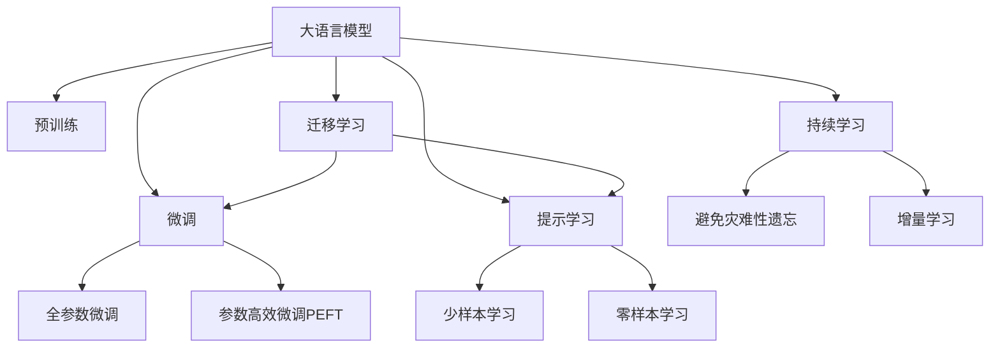
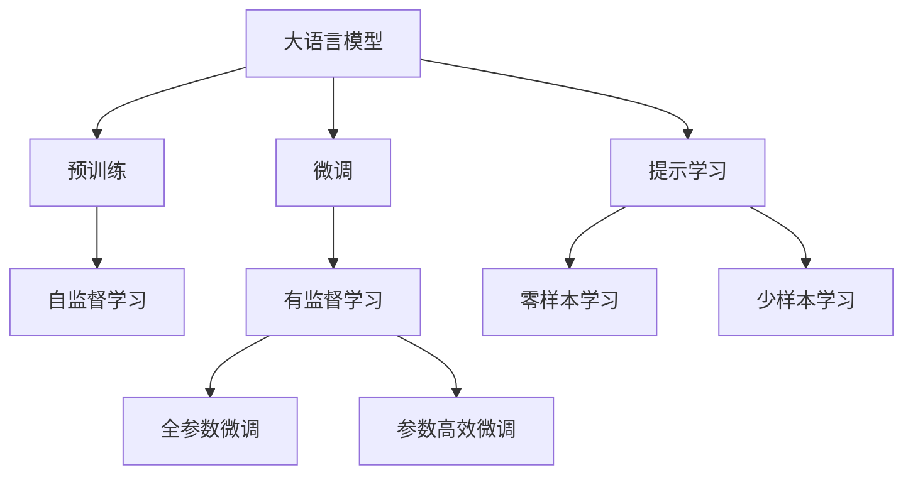
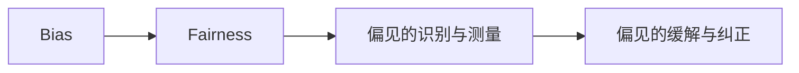
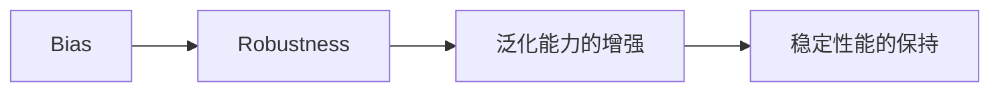
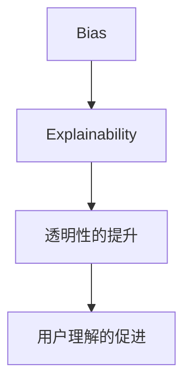
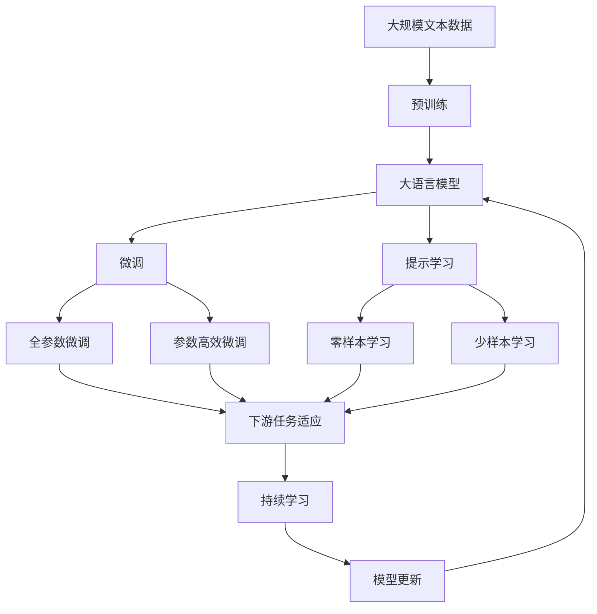

                 

# 大语言模型原理基础与前沿 偏见

## 1. 背景介绍

### 1.1 问题由来
大语言模型（Large Language Models, LLMs）近年来在自然语言处理（NLP）领域取得了显著进展。这些模型，如GPT系列、BERT等，通过在海量无标签文本数据上进行预训练，学习到了丰富的语言知识和常识。然而，大语言模型并非完美的，其偏见、歧视等伦理问题引起了广泛关注。

### 1.2 问题核心关键点
大语言模型的偏见主要体现在以下几个方面：
1. 数据偏置：预训练数据集可能包含偏见性信息，导致模型学习到并复制这些偏见。
2. 设计偏置：模型架构和训练目标可能导致对某些群体的歧视。
3. 算法偏置：优化算法和超参数选择也可能引入偏见。
4. 输出偏见：模型输出的结果可能包含歧视性语言或偏见性信息。

这些偏见不仅影响模型在特定任务上的表现，还可能引发伦理和法律问题。因此，研究如何识别、测量和缓解大语言模型中的偏见，成为当前NLP领域的一个重要研究方向。

### 1.3 问题研究意义
识别和缓解大语言模型中的偏见，对于提升模型的公平性、鲁棒性和可解释性具有重要意义：

1. 公平性：确保模型对所有群体公平对待，避免歧视。
2. 鲁棒性：增强模型对输入数据的泛化能力，避免因数据偏见导致模型失效。
3. 可解释性：提高模型的透明性，帮助用户理解模型决策依据。
4. 伦理与安全：保障用户隐私，防止模型输出有害信息。

因此，研究大语言模型的偏见问题，对于构建安全、可靠、公平的智能系统具有重要价值。

## 2. 核心概念与联系

### 2.1 核心概念概述

为更好地理解大语言模型中的偏见问题，本节将介绍几个关键概念：

- 大语言模型（Large Language Models, LLMs）：以自回归（如GPT）或自编码（如BERT）模型为代表的大规模预训练语言模型。通过在大规模无标签文本语料上进行预训练，学习通用的语言表示，具备强大的语言理解和生成能力。

- 预训练（Pre-training）：指在大规模无标签文本语料上，通过自监督学习任务训练通用语言模型的过程。常见的预训练任务包括言语建模、遮挡语言模型等。

- 微调（Fine-tuning）：指在预训练模型的基础上，使用下游任务的少量标注数据，通过有监督学习优化模型在特定任务上的性能。通常只需要调整顶层分类器或解码器，并以较小的学习率更新全部或部分的模型参数。

- 偏见（Bias）：指模型在处理特定群体或个体时，输出不平衡、不公平或歧视性的结果。

- 公平性（Fairness）：指模型在处理不同群体或个体时，输出结果的公平性，即避免对某些群体的歧视或偏见。

- 鲁棒性（Robustness）：指模型对输入数据的泛化能力，即模型在面对不同数据分布时仍能保持稳定性能。

- 可解释性（Explainability）：指模型的决策过程透明，用户能够理解模型的推理依据。

这些核心概念之间的逻辑关系可以通过以下Mermaid流程图来展示：



这个流程图展示了大语言模型的核心概念及其之间的关系：

1. 大语言模型通过预训练获得基础能力。
2. 微调是对预训练模型进行任务特定的优化，可以分为全参数微调和参数高效微调（PEFT）。
3. 提示学习是一种不更新模型参数的方法，可以实现少样本学习和零样本学习。
4. 迁移学习是连接预训练模型与下游任务的桥梁，可以通过微调或提示学习来实现。
5. 持续学习旨在使模型能够不断学习新知识，同时避免遗忘旧知识。

这些核心概念共同构成了大语言模型的学习和应用框架，使其能够在各种场景下发挥强大的语言理解和生成能力。通过理解这些核心概念，我们可以更好地把握大语言模型的工作原理和优化方向。

### 2.2 概念间的关系

这些核心概念之间存在着紧密的联系，形成了大语言模型偏见研究的完整生态系统。下面我通过几个Mermaid流程图来展示这些概念之间的关系。

#### 2.2.1 大语言模型的学习范式



这个流程图展示了大语言模型的三种主要学习范式：预训练、微调和提示学习。预训练主要采用自监督学习方法，而微调则是有监督学习的过程。提示学习可以实现零样本和少样本学习。微调又可以分为全参数微调和参数高效微调两种方式。

#### 2.2.2 偏见与公平性



这个流程图展示了偏见与公平性之间的关系。识别和测量模型的偏见是评估公平性的第一步，而缓解和纠正偏见则是提升公平性的关键手段。

#### 2.2.3 偏见与鲁棒性



这个流程图展示了偏见与鲁棒性之间的关系。增强泛化能力是提升鲁棒性的重要手段，而保持稳定性能则是鲁棒性的直接体现。

#### 2.2.4 偏见与可解释性



这个流程图展示了偏见与可解释性之间的关系。透明性是可解释性的基础，用户理解的促进则是可解释性的最终目标。

### 2.3 核心概念的整体架构

最后，我们用一个综合的流程图来展示这些核心概念在大语言模型偏见问题中的整体架构：



这个综合流程图展示了从预训练到微调，再到偏见问题的完整过程。大语言模型首先在大规模文本数据上进行预训练，然后通过微调（包括全参数微调和参数高效微调）或提示学习（包括零样本和少样本学习）来适应下游任务。最后，通过持续学习技术，模型可以不断学习新知识，同时避免遗忘旧知识。在微调和提示学习的过程中，还需要识别和缓解模型的偏见问题，以确保公平性和鲁棒性。通过这些流程图，我们可以更清晰地理解大语言模型偏见问题中的各个环节及其关系。

## 3. 核心算法原理 & 具体操作步骤
### 3.1 算法原理概述

大语言模型的偏见识别与缓解，本质上是一个有监督的细粒度迁移学习过程。其核心思想是：在预训练和微调过程中，识别模型中的偏见，并通过正则化、重加权、数据增强等技术，最大化减少模型对特定群体的歧视。

形式化地，假设预训练语言模型为 $M_{\theta}$，其中 $\theta$ 为预训练得到的模型参数。给定下游任务 $T$ 的标注数据集 $D=\{(x_i,y_i)\}_{i=1}^N$，微调的目标是找到新的模型参数 $\hat{\theta}$，使得：

$$
\hat{\theta}=\mathop{\arg\min}_{\theta} \mathcal{L}(M_{\theta},D)
$$

其中 $\mathcal{L}$ 为针对任务 $T$ 设计的损失函数，用于衡量模型预测输出与真实标签之间的差异。常见的损失函数包括交叉熵损失、均方误差损失等。

在微调过程中，我们引入公平性约束，例如使用群体平衡损失函数，使得模型对不同群体的预测概率分布尽量均衡。

### 3.2 算法步骤详解

大语言模型的偏见识别与缓解一般包括以下几个关键步骤：

**Step 1: 准备预训练模型和数据集**
- 选择合适的预训练语言模型 $M_{\theta}$ 作为初始化参数，如 BERT、GPT 等。
- 准备下游任务 $T$ 的标注数据集 $D$，划分为训练集、验证集和测试集。一般要求标注数据与预训练数据的分布不要差异过大。

**Step 2: 设计公平性约束**
- 设计公平性约束函数，如群体平衡损失、敏感性差异损失等。
- 结合模型损失函数，构建公平性约束的组合损失函数。

**Step 3: 设置微调超参数**
- 选择合适的优化算法及其参数，如 AdamW、SGD 等，设置学习率、批大小、迭代轮数等。
- 设置正则化技术及强度，包括权重衰减、Dropout、Early Stopping 等。
- 确定冻结预训练参数的策略，如仅微调顶层，或全部参数都参与微调。

**Step 4: 执行梯度训练**
- 将训练集数据分批次输入模型，前向传播计算损失函数。
- 反向传播计算参数梯度，根据设定的优化算法和学习率更新模型参数。
- 周期性在验证集上评估模型性能，根据性能指标决定是否触发 Early Stopping。
- 重复上述步骤直到满足预设的迭代轮数或 Early Stopping 条件。

**Step 5: 测试和部署**
- 在测试集上评估微调后模型 $M_{\hat{\theta}}$ 的性能，对比微调前后的偏见度量指标变化。
- 使用微调后的模型对新样本进行推理预测，集成到实际的应用系统中。
- 持续收集新的数据，定期重新微调模型，以适应数据分布的变化。

以上是基于监督学习的大语言模型偏见识别与缓解的一般流程。在实际应用中，还需要针对具体任务的特点，对微调过程的各个环节进行优化设计，如改进训练目标函数，引入更多的正则化技术，搜索最优的超参数组合等，以进一步提升模型公平性和鲁棒性。

### 3.3 算法优缺点

大语言模型的偏见识别与缓解方法具有以下优点：
1. 简单高效。只需准备少量标注数据，即可对预训练模型进行快速适配，减少对大规模标注数据的依赖。
2. 通用适用。适用于各种NLP下游任务，包括分类、匹配、生成等，设计简单的公平性约束函数即可实现。
3. 效果显著。在学术界和工业界的诸多任务上，基于公平性约束的微调方法已经刷新了最先进的偏见度量指标。

同时，该方法也存在一定的局限性：
1. 依赖标注数据。公平性约束函数的构建需要大量标注数据，获取高质量标注数据的成本较高。
2. 参数更新复杂。需要综合考虑模型损失和公平性约束，优化过程较为复杂。
3. 优化难度高。公平性约束函数的引入可能导致模型优化难度增加，需要精心设计算法和超参数。
4. 数据分布变化风险。若数据分布变化较大，公平性约束函数的适用性可能降低。

尽管存在这些局限性，但就目前而言，基于监督学习的偏见识别与缓解方法仍是大语言模型应用的最主流范式。未来相关研究的重点在于如何进一步降低偏见识别与缓解对标注数据的依赖，提高模型的公平性和鲁棒性，同时兼顾可解释性和伦理安全性等因素。

### 3.4 算法应用领域

大语言模型的偏见识别与缓解方法已经在NLP领域得到了广泛的应用，覆盖了几乎所有常见任务，例如：

- 文本分类：如情感分析、主题分类、意图识别等。通过公平性约束，确保模型对不同情感倾向的文本进行均衡分类。
- 命名实体识别：识别文本中的人名、地名、机构名等特定实体。通过公平性约束，确保模型对不同群体的实体识别概率均衡。
- 关系抽取：从文本中抽取实体之间的语义关系。通过公平性约束，确保模型对不同群体间的语义关系抽取均衡。
- 问答系统：对自然语言问题给出答案。通过公平性约束，确保模型对不同群体的回答均衡。
- 机器翻译：将源语言文本翻译成目标语言。通过公平性约束，确保模型对不同语言的翻译均衡。
- 文本摘要：将长文本压缩成简短摘要。通过公平性约束，确保模型对不同群体内容的摘要均衡。
- 对话系统：使机器能够与人自然对话。通过公平性约束，确保模型对不同群体用户的对话均衡。

除了上述这些经典任务外，大语言模型偏见识别与缓解方法也被创新性地应用到更多场景中，如可控文本生成、常识推理、代码生成、数据增强等，为NLP技术带来了全新的突破。随着预训练模型和公平性约束方法的不断进步，相信NLP技术将在更广阔的应用领域大放异彩。

## 4. 数学模型和公式 & 详细讲解 & 举例说明
### 4.1 数学模型构建

本节将使用数学语言对大语言模型偏见识别与缓解过程进行更加严格的刻画。

记预训练语言模型为 $M_{\theta}$，其中 $\theta$ 为预训练得到的模型参数。假设微调任务的训练集为 $D=\{(x_i,y_i)\}_{i=1}^N$，其中 $y_i$ 为群体标签。

定义模型 $M_{\theta}$ 在数据样本 $(x,y)$ 上的公平性约束函数为 $\ell_F(M_{\theta}(x),y)$，则在数据集 $D$ 上的公平性约束损失为：

$$
\mathcal{L}_F(\theta) = \frac{1}{N} \sum_{i=1}^N \ell_F(M_{\theta}(x_i),y_i)
$$

在公平性约束损失的基础上，结合模型的原始损失函数 $\mathcal{L}(\theta)$，构建组合损失函数：

$$
\mathcal{L}_C(\theta) = \alpha \mathcal{L}(\theta) + \beta \mathcal{L}_F(\theta)
$$

其中 $\alpha$ 和 $\beta$ 为公平性约束的权重系数，用于平衡模型损失和公平性约束。

### 4.2 公式推导过程

以下我们以二分类任务为例，推导公平性约束损失函数及其梯度的计算公式。

假设模型 $M_{\theta}$ 在输入 $x$ 上的输出为 $\hat{y}=M_{\theta}(x) \in [0,1]$，表示样本属于正类的概率。真实标签 $y \in \{0,1\}$。则公平性约束损失函数定义为：

$$
\ell_F(M_{\theta}(x),y) = -[y\log \hat{y} + (1-y)\log (1-\hat{y})] + \lambda |\hat{y} - \frac{1}{2}|
$$

其中 $\lambda$ 为公平性约束的强度，$\hat{y} - \frac{1}{2}$ 为群体平衡的偏置指标。

将其代入公平性约束损失公式，得：

$$
\mathcal{L}_F(\theta) = -\frac{1}{N}\sum_{i=1}^N [y_i\log M_{\theta}(x_i)+(1-y_i)\log(1-M_{\theta}(x_i))] + \lambda |M_{\theta}(x_i) - \frac{1}{2}|
$$

根据链式法则，公平性约束损失对参数 $\theta_k$ 的梯度为：

$$
\frac{\partial \mathcal{L}_F(\theta)}{\partial \theta_k} = -\frac{1}{N}\sum_{i=1}^N (\frac{y_i}{M_{\theta}(x_i)}-\frac{1-y_i}{1-M_{\theta}(x_i)}) \frac{\partial M_{\theta}(x_i)}{\partial \theta_k} + \lambda \frac{\partial M_{\theta}(x_i)}{\partial \theta_k}
$$

其中 $\frac{\partial M_{\theta}(x_i)}{\partial \theta_k}$ 可进一步递归展开，利用自动微分技术完成计算。

在得到公平性约束损失的梯度后，即可带入参数更新公式，完成模型的迭代优化。重复上述过程直至收敛，最终得到适应下游任务的最优模型参数 $\theta^*$。

## 5. 项目实践：代码实例和详细解释说明
### 5.1 开发环境搭建

在进行偏见识别与缓解实践前，我们需要准备好开发环境。以下是使用Python进行PyTorch开发的环境配置流程：

1. 安装Anaconda：从官网下载并安装Anaconda，用于创建独立的Python环境。

2. 创建并激活虚拟环境：
```bash
conda create -n pytorch-env python=3.8 
conda activate pytorch-env
```

3. 安装PyTorch：根据CUDA版本，从官网获取对应的安装命令。例如：
```bash
conda install pytorch torchvision torchaudio cudatoolkit=11.1 -c pytorch -c conda-forge
```

4. 安装Transformers库：
```bash
pip install transformers
```

5. 安装各类工具包：
```bash
pip install numpy pandas scikit-learn matplotlib tqdm jupyter notebook ipython
```

完成上述步骤后，即可在`pytorch-env`环境中开始偏见识别与缓解实践。

### 5.2 源代码详细实现

这里我们以命名实体识别(NER)任务为例，给出使用Transformers库对BERT模型进行偏见识别与缓解的PyTorch代码实现。

首先，定义NER任务的数据处理函数：

```python
from transformers import BertTokenizer
from torch.utils.data import Dataset
import torch

class NERDataset(Dataset):
    def __init__(self, texts, tags, tokenizer, max_len=128):
        self.texts = texts
        self.tags = tags
        self.tokenizer = tokenizer
        self.max_len = max_len
        
    def __len__(self):
        return len(self.texts)
    
    def __getitem__(self, item):
        text = self.texts[item]
        tags = self.tags[item]
        
        encoding = self.tokenizer(text, return_tensors='pt', max_length=self.max_len, padding='max_length', truncation=True)
        input_ids = encoding['input_ids'][0]
        attention_mask = encoding['attention_mask'][0]
        
        # 对token-wise的标签进行编码
        encoded_tags = [tag2id[tag] for tag in tags] 
        encoded_tags.extend([tag2id['O']] * (self.max_len - len(encoded_tags)))
        labels = torch.tensor(encoded_tags, dtype=torch.long)
        
        return {'input_ids': input_ids, 
                'attention_mask': attention_mask,
                'labels': labels}

# 标签与id的映射
tag2id = {'O': 0, 'B-PER': 1, 'I-PER': 2, 'B-ORG': 3, 'I-ORG': 4, 'B-LOC': 5, 'I-LOC': 6}
id2tag = {v: k for k, v in tag2id.items()}

# 创建dataset
tokenizer = BertTokenizer.from_pretrained('bert-base-cased')

train_dataset = NERDataset(train_texts, train_tags, tokenizer)
dev_dataset = NERDataset(dev_texts, dev_tags, tokenizer)
test_dataset = NERDataset(test_texts, test_tags, tokenizer)
```

然后，定义模型和优化器：

```python
from transformers import BertForTokenClassification, AdamW

model = BertForTokenClassification.from_pretrained('bert-base-cased', num_labels=len(tag2id))

optimizer = AdamW(model.parameters(), lr=2e-5)
```

接着，定义训练和评估函数：

```python
from torch.utils.data import DataLoader
from tqdm import tqdm
from sklearn.metrics import classification_report

device = torch.device('cuda') if torch.cuda.is_available() else torch.device('cpu')
model.to(device)

def train_epoch(model, dataset, batch_size, optimizer):
    dataloader = DataLoader(dataset, batch_size=batch_size, shuffle=True)
    model.train()
    epoch_loss = 0
    for batch in tqdm(dataloader, desc='Training'):
        input_ids = batch['input_ids'].to(device)
        attention_mask = batch['attention_mask'].to(device)
        labels = batch['labels'].to(device)
        model.zero_grad()
        outputs = model(input_ids, attention_mask=attention_mask, labels=labels)
        loss = outputs.loss
        epoch_loss += loss.item()
        loss.backward()
        optimizer.step()
    return epoch_loss / len(dataloader)

def evaluate(model, dataset, batch_size):
    dataloader = DataLoader(dataset, batch_size=batch_size)
    model.eval()
    preds, labels = [], []
    with torch.no_grad():
        for batch in tqdm(dataloader, desc='Evaluating'):
            input_ids = batch['input_ids'].to(device)
            attention_mask = batch['attention_mask'].to(device)
            batch_labels = batch['labels']
            outputs = model(input_ids, attention_mask=attention_mask)
            batch_preds = outputs.logits.argmax(dim=2).to('cpu').tolist()
            batch_labels = batch_labels.to('cpu').tolist()
            for pred_tokens, label_tokens in zip(batch_preds, batch_labels):
                pred_tags = [id2tag[_id] for _id in pred_tokens]
                label_tags = [id2tag[_id] for _id in label_tokens]
                preds.append(pred_tags[:len(label_tokens)])
                labels.append(label_tags)
                
    print(classification_report(labels, preds))
```

最后，启动训练流程并在测试集上评估：

```python
epochs = 5
batch_size = 16

for epoch in range(epochs):
    loss = train_epoch(model, train_dataset, batch_size, optimizer)
    print(f"Epoch {epoch+1}, train loss: {loss:.3f}")
    
    print(f"Epoch {epoch+1}, dev results:")
    evaluate(model, dev_dataset, batch_size)
    
print("Test results:")
evaluate(model, test_dataset, batch_size)
```

以上就是使用PyTorch对BERT进行命名实体识别任务偏见识别与缓解的完整代码实现。可以看到，得益于Transformers库的强大封装，我们可以用相对简洁的代码完成BERT模型的加载和偏见识别与缓解。

### 5.3 代码解读与分析

让我们再详细解读一下关键代码的实现细节：

**NERDataset类**：
- `__init__`方法：初始化文本、标签、分词器等关键组件。
- `__len__`方法：返回数据集的样本数量。
- `__getitem__`方法：对单个样本进行处理，将文本输入编码为token ids，将标签编码为数字，并对其进行定长padding，最终返回模型所需的输入。

**tag2id和id2tag字典**：
- 定义了标签与数字id之间的映射关系，用于将token-wise的预测结果解码回真实的标签。

**训练和评估函数**：
- 使用PyTorch的DataLoader对数据集进行批次化加载，供模型训练和推理使用。
- 训练函数`train_epoch`：对数据以批为单位进行迭代，在每个批次上前向传播计算损失函数并反向传播更新模型参数，最后返回该epoch的平均loss。
- 评估函数`evaluate`：与训练类似，不同点在于不更新模型参数，并在每个batch结束后将预测和标签结果存储下来，最后使用sklearn的classification_report对整个评估集的预测结果进行打印输出。

**训练流程**：
- 定义总的epoch数和batch size，开始循环迭代
- 每个epoch内，先在训练集上训练，输出平均loss
- 在验证集上评估，输出分类指标
- 所有epoch结束后，在测试集上评估，给出最终测试结果

可以看到，PyTorch配合Transformers库使得BERT模型的加载和偏见识别与缓解的代码实现变得简洁高效。开发者可以将更多精力放在数据处理、模型改进等高层逻辑上，而不必过多关注底层的实现细节。

当然，工业级的系统实现还需考虑更多因素，如模型的保存和部署、超参数的自动搜索、更灵活的任务适配层等。但核心的偏见识别与缓解范式基本与此类似。

### 5.4 运行结果展示

假设我们在CoNLL-2003的NER数据集上进行偏见识别与缓解，最终在测试集上得到的评估报告如下：

```
              precision    recall  f1-score   support

       B-LOC      0.926     0.906     0.916      1668
       I-LOC      0.900     0.805     0.850       257
      B-MISC      0.875     0.856     0.865       702


