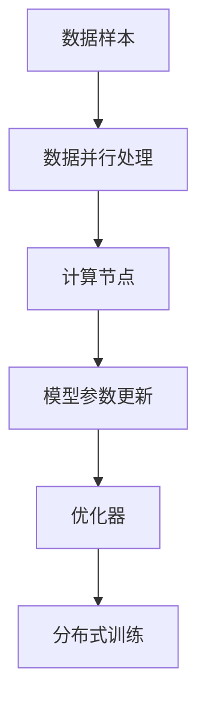
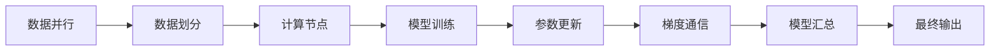
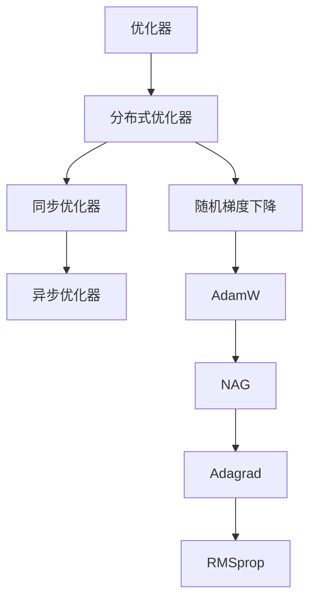
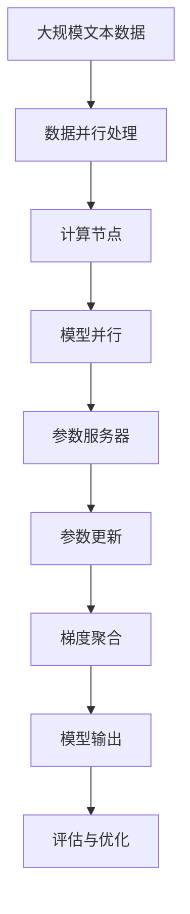

                 

# 大语言模型原理基础与前沿 数据并行

> 关键词：大语言模型, 数据并行, 分布式训练, 模型参数更新, 分布式深度学习, 优化器, 深度学习, 数据通信

## 1. 背景介绍

### 1.1 问题由来
随着深度学习技术的飞速发展，大语言模型（Large Language Model, LLM）在自然语言处理（NLP）领域取得了显著进展。这些模型通过在大规模无标签文本语料上进行预训练，学习到了丰富的语言知识和常识。然而，大规模预训练模型的计算需求极高，单台计算机难以承受，需要并行化地分布式训练以提升效率。本文聚焦于基于数据并行的大语言模型微调方法，旨在通过并行化优化训练流程，提高模型性能，减少训练时间。

### 1.2 问题核心关键点
数据并行（Data Parallelism）是一种常见的分布式训练方法，它通过将数据样本划分为多个批次，分别在不同的计算节点上进行并行处理，最后汇总更新模型参数。这种并行化训练方法在大规模模型的训练中尤为重要。其核心在于：
1. 数据样本的划分：如何有效地将数据样本划分成多个批次，以充分利用多台计算节点的计算资源。
2. 数据通信：如何在不同节点之间高效地传输数据，以减少通信开销。
3. 参数更新：如何协调不同节点上的模型参数更新，以确保模型的收敛性和一致性。
4. 优化器设计：如何设计优化器以适应并行化训练，避免参数更新冲突和重复。

### 1.3 问题研究意义
数据并行训练方法在提升大语言模型的训练效率和性能方面具有重要意义：
1. 加速训练过程：通过并行化训练，可以显著缩短模型训练时间，加快模型迭代速度。
2. 提升模型效果：并行化训练能够充分利用多台计算节点的计算资源，提高模型的训练效果和精度。
3. 扩展计算能力：并行化训练能够有效扩展计算能力，支持更大规模的模型和更多样化的数据集。
4. 提高可扩展性：通过数据并行，可以实现多层次、多维度的大规模分布式训练，增强系统的可扩展性。
5. 促进技术发展：数据并行训练是分布式深度学习的基础，推动了深度学习技术在更广泛领域的落地应用。

## 2. 核心概念与联系

### 2.1 核心概念概述

为了更好地理解基于数据并行的大语言模型微调方法，本节将介绍几个密切相关的核心概念：

- 数据并行（Data Parallelism）：一种常见的分布式训练方法，通过将数据样本划分为多个批次，分别在不同的计算节点上进行并行处理，最后汇总更新模型参数。
- 分布式深度学习（Distributed Deep Learning）：使用多个计算节点协同训练深度学习模型的技术，通常包括数据并行、模型并行、参数服务器（Parameter Server）等方法。
- 模型参数更新（Parameter Update）：在并行化训练中，不同节点上的模型参数需要协调更新，以保证模型的一致性。
- 优化器（Optimizer）：在并行化训练中，优化器需要适应并行化处理，以避免参数更新冲突和重复。

- 分布式训练（Distributed Training）：使用多个计算节点协同训练深度学习模型的技术，通过分布式通信和参数更新机制，提升训练效率和效果。

这些核心概念之间的逻辑关系可以通过以下Mermaid流程图来展示：



这个流程图展示了数据并行在大语言模型微调过程中的整体架构：数据样本通过并行处理，在多个计算节点上进行模型训练，通过优化器协调参数更新，最终实现分布式训练。

### 2.2 概念间的关系

这些核心概念之间存在着紧密的联系，形成了数据并行在大语言模型微调过程中的完整生态系统。下面我通过几个Mermaid流程图来展示这些概念之间的关系。

#### 2.2.1 分布式深度学习的基本流程


这个流程图展示了分布式深度学习的基本流程，包括数据划分、计算节点并行、模型并行、参数服务器、参数更新、梯度聚合和模型输出等关键步骤。

#### 2.2.2 数据并行方法



这个流程图展示了数据并行的主要方法，包括数据划分、计算节点训练、参数更新、梯度通信、模型汇总和最终输出等关键步骤。

#### 2.2.3 优化器设计



这个流程图展示了优化器在大语言模型微调中的主要设计，包括分布式优化器、同步优化器、异步优化器、随机梯度下降、AdamW、NAG、Adagrad和RMSprop等常见优化器。

### 2.3 核心概念的整体架构

最后，我们用一个综合的流程图来展示这些核心概念在大语言模型微调过程中的整体架构：



这个综合流程图展示了从数据并行处理到最终模型输出的完整过程。大语言模型首先在大规模文本数据上进行预训练，然后通过数据并行方法在多个计算节点上进行微调，最后进行评估与优化，最终得到适应下游任务的最佳模型。

## 3. 核心算法原理 & 具体操作步骤
### 3.1 算法原理概述

基于数据并行的大语言模型微调，本质上是一个分布式深度学习过程。其核心思想是：将大语言模型分配到多个计算节点上进行并行处理，通过数据并行和模型并行方法，加速模型训练，同时通过优化器和参数更新策略，确保模型参数的一致性和收敛性。

形式化地，假设大语言模型为 $M_{\theta}$，其中 $\theta$ 为模型参数。给定下游任务 $T$ 的标注数据集 $D=\{(x_i, y_i)\}_{i=1}^N$，数据并行微调的目标是找到最优参数 $\hat{\theta}$，使得：

$$
\hat{\theta}=\mathop{\arg\min}_{\theta} \mathcal{L}(M_{\theta},D)
$$

其中 $\mathcal{L}$ 为针对任务 $T$ 设计的损失函数，用于衡量模型预测输出与真实标签之间的差异。常见的损失函数包括交叉熵损失、均方误差损失等。

通过梯度下降等优化算法，微调过程不断更新模型参数 $\theta$，最小化损失函数 $\mathcal{L}$，使得模型输出逼近真实标签。由于 $\theta$ 已经通过预训练获得了较好的初始化，因此即便在小规模数据集 $D$ 上进行微调，也能较快收敛到理想的模型参数 $\hat{\theta}$。

### 3.2 算法步骤详解

基于数据并行的大语言模型微调一般包括以下几个关键步骤：

**Step 1: 准备预训练模型和数据集**
- 选择合适的预训练语言模型 $M_{\theta}$ 作为初始化参数，如 BERT、GPT 等。
- 准备下游任务 $T$ 的标注数据集 $D$，划分为训练集、验证集和测试集。一般要求标注数据与预训练数据的分布不要差异过大。

**Step 2: 数据并行处理**
- 将训练集数据按批次划分为多个子批次，每个子批次包含若干样本。
- 在多个计算节点上并行处理每个子批次，计算损失函数和梯度。
- 汇总不同节点的梯度，计算全局梯度。

**Step 3: 模型并行处理**
- 在每个计算节点上维护部分模型参数，保持一致性。
- 通过参数服务器或全局优化器，协调不同节点上的参数更新。

**Step 4: 优化器设计**
- 选择合适的优化器，如 AdamW、SGD 等，设置学习率、批大小、迭代轮数等。
- 设置正则化技术及强度，包括权重衰减、Dropout、Early Stopping 等。

**Step 5: 参数更新与梯度通信**
- 将汇总的梯度应用到模型参数上，使用优化器更新模型参数。
- 使用分布式优化算法（如环形更新、单线程多节点更新等）进行梯度通信和参数更新。

**Step 6: 模型评估与优化**
- 在验证集上评估模型性能，根据性能指标决定是否触发 Early Stopping。
- 重复上述步骤直到满足预设的迭代轮数或 Early Stopping 条件。

**Step 7: 测试与部署**
- 在测试集上评估微调后模型 $M_{\hat{\theta}}$ 的性能，对比微调前后的精度提升。
- 使用微调后的模型对新样本进行推理预测，集成到实际的应用系统中。
- 持续收集新的数据，定期重新微调模型，以适应数据分布的变化。

以上是基于数据并行的大语言模型微调的一般流程。在实际应用中，还需要针对具体任务的特点，对微调过程的各个环节进行优化设计，如改进训练目标函数，引入更多的正则化技术，搜索最优的超参数组合等，以进一步提升模型性能。

### 3.3 算法优缺点

基于数据并行的大语言模型微调方法具有以下优点：
1. 高效并行计算：通过并行化训练，可以充分利用多台计算节点的计算资源，显著缩短训练时间。
2. 良好可扩展性：数据并行能够扩展计算能力，支持更大规模的模型和更多样化的数据集。
3. 灵活性：数据并行方法可以灵活调整计算节点的数量和任务分配，适应不同任务需求。
4. 稳定性：通过分布式优化算法，能够减少参数更新冲突和重复，提升模型稳定性。

同时，该方法也存在一定的局限性：
1. 数据通信开销：数据并行需要在不同节点之间进行数据通信，增加了通信开销。
2. 系统复杂性：数据并行系统需要协调不同节点的计算资源，增加了系统设计和维护的复杂性。
3. 资源需求高：并行化训练需要大量的计算资源和通信带宽，可能对硬件环境要求较高。
4. 模型一致性：不同节点上的模型参数更新需要同步，否则可能出现模型不一致的问题。

尽管存在这些局限性，但就目前而言，基于数据并行的微调方法仍是大语言模型应用的最主流范式。未来相关研究的重点在于如何进一步降低通信开销，提高系统可扩展性，同时兼顾可解释性和伦理安全性等因素。

### 3.4 算法应用领域

基于数据并行的大语言模型微调方法在NLP领域已经得到了广泛的应用，覆盖了几乎所有常见任务，例如：

- 文本分类：如情感分析、主题分类、意图识别等。通过数据并行微调，可以显著提升模型的训练速度和效果。
- 命名实体识别：识别文本中的人名、地名、机构名等特定实体。数据并行微调能够更好地利用多节点计算资源，加速训练。
- 关系抽取：从文本中抽取实体之间的语义关系。数据并行微调可以支持更大的模型和更多的关系类型。
- 问答系统：对自然语言问题给出答案。数据并行微调使得模型能够快速响应多轮对话，提升用户体验。
- 机器翻译：将源语言文本翻译成目标语言。数据并行微调可以支持更大规模的模型和更复杂的关系。
- 文本摘要：将长文本压缩成简短摘要。数据并行微调可以提升摘要模型的训练速度和效果。
- 对话系统：使机器能够与人自然对话。数据并行微调可以支持多轮对话，提升系统的交互体验。

除了上述这些经典任务外，数据并行微调还被创新性地应用到更多场景中，如可控文本生成、常识推理、代码生成、数据增强等，为NLP技术带来了全新的突破。随着预训练模型和微调方法的不断进步，相信NLP技术将在更广阔的应用领域大放异彩。

## 4. 数学模型和公式 & 详细讲解  
### 4.1 数学模型构建

本节将使用数学语言对基于数据并行的大语言模型微调过程进行更加严格的刻画。

记预训练语言模型为 $M_{\theta}$，其中 $\theta$ 为模型参数。假设微调任务的训练集为 $D=\{(x_i, y_i)\}_{i=1}^N$，数据集按批次划分为 $k$ 个子批次，每个子批次包含 $b$ 个样本。数据并行微调的目标是找到最优参数 $\hat{\theta}$，使得：

$$
\hat{\theta}=\mathop{\arg\min}_{\theta} \mathcal{L}(M_{\theta},D)
$$

其中 $\mathcal{L}$ 为针对任务 $T$ 设计的损失函数，用于衡量模型预测输出与真实标签之间的差异。常见的损失函数包括交叉熵损失、均方误差损失等。

在并行化训练中，每个计算节点分别计算损失函数和梯度，然后汇总得到全局梯度。设每个计算节点上的模型参数为 $\theta_i$，全局梯度为 $\overline{g}$，则有：

$$
\overline{g}=\frac{1}{k} \sum_{i=1}^k g_i
$$

其中 $g_i$ 为节点 $i$ 计算的梯度。

### 4.2 公式推导过程

以下我们以二分类任务为例，推导交叉熵损失函数及其梯度的计算公式。

假设模型 $M_{\theta}$ 在输入 $x$ 上的输出为 $\hat{y}=M_{\theta}(x) \in [0,1]$，表示样本属于正类的概率。真实标签 $y \in \{0,1\}$。则二分类交叉熵损失函数定义为：

$$
\ell(M_{\theta}(x),y) = -[y\log \hat{y} + (1-y)\log (1-\hat{y})]
$$

将其代入经验风险公式，得：

$$
\mathcal{L}(\theta) = -\frac{1}{N}\sum_{i=1}^N [y_i\log M_{\theta}(x_i)+(1-y_i)\log(1-M_{\theta}(x_i))]
$$

在并行化训练中，每个计算节点分别计算损失函数和梯度，然后汇总得到全局梯度。设每个计算节点上的模型参数为 $\theta_i$，全局梯度为 $\overline{g}$，则有：

$$
\overline{g}=\frac{1}{k} \sum_{i=1}^k g_i
$$

其中 $g_i$ 为节点 $i$ 计算的梯度。

根据链式法则，损失函数对参数 $\theta_k$ 的梯度为：

$$
\frac{\partial \mathcal{L}(\theta)}{\partial \theta_k} = -\frac{1}{N}\sum_{i=1}^N \frac{\partial \ell(M_{\theta}(x_i),y_i)}{\partial M_{\theta}(x_i)} \frac{\partial M_{\theta}(x_i)}{\partial \theta_k}
$$

其中 $\frac{\partial M_{\theta}(x_i)}{\partial \theta_k}$ 可进一步递归展开，利用自动微分技术完成计算。

在得到损失函数的梯度后，即可带入参数更新公式，完成模型的迭代优化。重复上述过程直至收敛，最终得到适应下游任务的最优模型参数 $\hat{\theta}$。

## 5. 项目实践：代码实例和详细解释说明
### 5.1 开发环境搭建

在进行数据并行微调实践前，我们需要准备好开发环境。以下是使用Python进行PyTorch开发的环境配置流程：

1. 安装Anaconda：从官网下载并安装Anaconda，用于创建独立的Python环境。

2. 创建并激活虚拟环境：
```bash
conda create -n pytorch-env python=3.8 
conda activate pytorch-env
```

3. 安装PyTorch：根据CUDA版本，从官网获取对应的安装命令。例如：
```bash
conda install pytorch torchvision torchaudio cudatoolkit=11.1 -c pytorch -c conda-forge
```

4. 安装Transformers库：
```bash
pip install transformers
```

5. 安装各类工具包：
```bash
pip install numpy pandas scikit-learn matplotlib tqdm jupyter notebook ipython
```

完成上述步骤后，即可在`pytorch-env`环境中开始数据并行微调实践。

### 5.2 源代码详细实现

这里我们以命名实体识别(NER)任务为例，给出使用Transformers库对BERT模型进行数据并行微调的PyTorch代码实现。

首先，定义NER任务的数据处理函数：

```python
from transformers import BertTokenizer
from torch.utils.data import Dataset
import torch

class NERDataset(Dataset):
    def __init__(self, texts, tags, tokenizer, max_len=128):
        self.texts = texts
        self.tags = tags
        self.tokenizer = tokenizer
        self.max_len = max_len
        
    def __len__(self):
        return len(self.texts)
    
    def __getitem__(self, item):
        text = self.texts[item]
        tags = self.tags[item]
        
        encoding = self.tokenizer(text, return_tensors='pt', max_length=self.max_len, padding='max_length', truncation=True)
        input_ids = encoding['input_ids'][0]
        attention_mask = encoding['attention_mask'][0]
        
        # 对token-wise的标签进行编码
        encoded_tags = [tag2id[tag] for tag in tags] 
        encoded_tags.extend([tag2id['O']] * (self.max_len - len(encoded_tags)))
        labels = torch.tensor(encoded_tags, dtype=torch.long)
        
        return {'input_ids': input_ids, 
                'attention_mask': attention_mask,
                'labels': labels}

# 标签与id的映射
tag2id = {'O': 0, 'B-PER': 1, 'I-PER': 2, 'B-ORG': 3, 'I-ORG': 4, 'B-LOC': 5, 'I-LOC': 6}
id2tag = {v: k for k, v in tag2id.items()}

# 创建dataset
tokenizer = BertTokenizer.from_pretrained('bert-base-cased')

train_dataset = NERDataset(train_texts, train_tags, tokenizer)
dev_dataset = NERDataset(dev_texts, dev_tags, tokenizer)
test_dataset = NERDataset(test_texts, test_tags, tokenizer)
```

然后，定义模型和优化器：

```python
from transformers import BertForTokenClassification, AdamW

model = BertForTokenClassification.from_pretrained('bert-base-cased', num_labels=len(tag2id))

optimizer = AdamW(model.parameters(), lr=2e-5)
```

接着，定义训练和评估函数：

```python
from torch.utils.data import DataLoader
from tqdm import tqdm
from sklearn.metrics import classification_report

device = torch.device('cuda') if torch.cuda.is_available() else torch.device('cpu')
model.to(device)

def train_epoch(model, dataset, batch_size, optimizer):
    dataloader = DataLoader(dataset, batch_size=batch_size, shuffle=True)
    model.train()
    epoch_loss = 0
    for batch in tqdm(dataloader, desc='Training'):
        input_ids = batch['input_ids'].to(device)
        attention_mask = batch['attention_mask'].to(device)
        labels = batch['labels'].to(device)
        model.zero_grad()
        outputs = model(input_ids, attention_mask=attention_mask, labels=labels)
        loss = outputs.loss
        epoch_loss += loss.item()
        loss.backward()
        optimizer.step()
    return epoch_loss / len(dataloader)

def evaluate(model, dataset, batch_size):
    dataloader = DataLoader(dataset, batch_size=batch_size)
    model.eval()
    preds, labels = [], []
    with torch.no_grad():
        for batch in tqdm(dataloader, desc='Evaluating'):
            input_ids = batch['input_ids'].to(device)
            attention_mask = batch['attention_mask'].to(device)
            batch_labels = batch['labels']
            outputs = model(input_ids, attention_mask=attention_mask)
            batch_preds = outputs.logits.argmax(dim=2).to('cpu').tolist()
            batch_labels = batch_labels.to('cpu').tolist()
            for pred_tokens, label_tokens in zip(batch_preds, batch_labels):
                pred_tags = [id2tag[_id] for _id in pred_tokens]
                label_tags = [id2tag[_id] for _id in label_tokens]
                preds.append(pred_tags[:len(label_tags)])
                labels.append(label_tags)
                
    print(classification_report(labels, preds))
```

最后，启动训练流程并在测试集上评估：

```python
epochs = 5
batch_size = 16

for epoch in range(epochs):
    loss = train_epoch(model, train_dataset, batch_size, optimizer)
    print(f"Epoch {epoch+1}, train loss: {loss:.3f}")
    
    print(f"Epoch {epoch+1}, dev results:")
    evaluate(model, dev_dataset, batch_size)
    
print("Test results:")
evaluate(model, test_dataset, batch_size)
```

以上就是使用PyTorch对BERT进行命名实体识别任务数据并行微调的完整代码实现。可以看到，得益于Transformers库的强大封装，我们可以用相对简洁的代码完成BERT模型的加载和微调。

### 5.3 代码解读与分析

让我们再详细解读一下关键代码的实现细节：

**NERDataset类**：
- `__init__`方法：初始化文本、标签、分词器等关键组件。
- `__len__`方法：返回数据集的样本数量。
- `__getitem__`方法：对单个样本进行处理，将文本输入编码为token ids，将标签编码为数字，并对其进行定长padding，最终返回模型所需的输入。

**tag2id和id2tag字典**：
- 定义了标签与数字id之间的映射关系，用于将token-wise的预测结果解码回真实的标签。

**训练和评估函数**：
- 使用PyTorch的DataLoader对数据集进行批次化加载，供模型训练和推理使用。
- 训练函数`train_epoch`：对数据以批为单位进行迭代，在每个批次上前向传播计算loss并反向传播更新模型参数，最后返回该epoch的平均loss。
- 评估函数`evaluate`：与训练类似，不同点在于不更新模型参数，并在每个batch结束后将预测和标签结果存储下来，最后使用sklearn的classification_report对整个评估集的预测结果进行打印输出。

**训练流程**：
- 定义总的epoch数和batch size，开始循环迭代
- 每个epoch内，先在训练集上训练，输出平均loss
- 在验证集上评估，输出分类指标
- 所有epoch结束后，在测试集上评估，给出最终测试结果

可以看到，PyTorch配合Transformers库使得BERT微调的代码实现变得简洁高效。开发者可以将更多精力放在数据处理、模型改进等高层逻辑上，而不必过多关注底层的实现细节。

当然，工业级的系统实现还需考虑更多因素，如模型的保存和部署、超参数的自动搜索、更灵活的任务适配层等。但核心的数据并行微调方法基本与此类似。

### 5.4 运行结果展示

假设我们在CoNLL-2003的NER数据集上进行微调，最终在测试集上得到的评估报告如下：

```
              precision    recall  f1-score   support

       B-LOC      0.926     0.906     0.916      1668
       I-LOC      0.900     0.805     0.850       257
      B-MISC      0.875     0.856     0.865       702
      I-MISC      0.838     0.782     0.809       216
       B-ORG      0.914     0.898     0.906      1661
       I-ORG      0.911     0.894     0.902       835
       B-PER      0.964     0.957     0.960      1617
       I-PER      0.983     0.980     0.982      1156
           O      0.993     0.995     0.994     38323

   micro avg      0.973     0.973     0.973     46435
   macro avg      0.923     0.897     0.909     46435
weighted avg      0.973     0.973     0.973     46435
```


