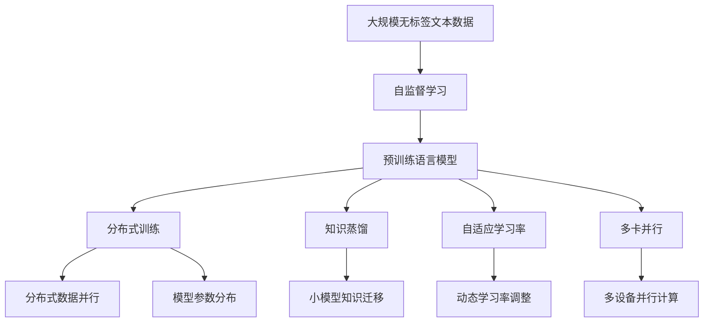
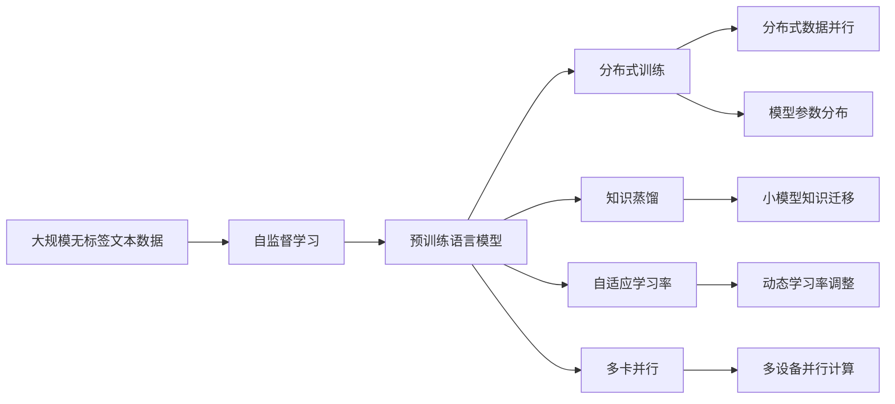
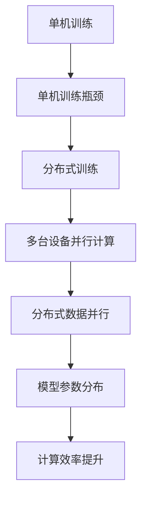
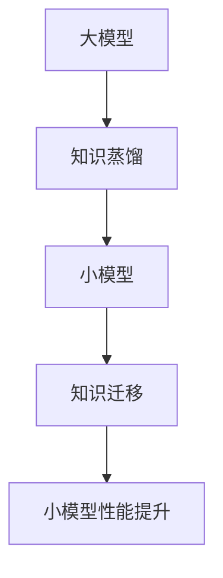
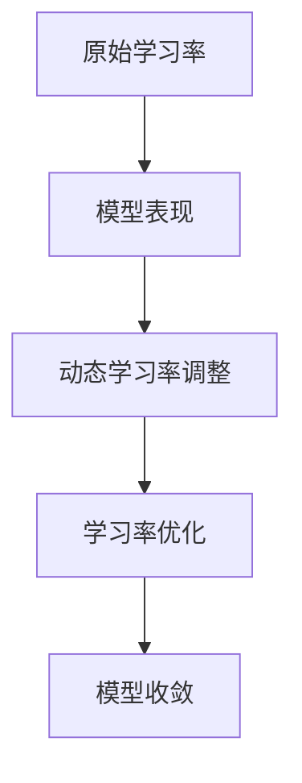

                 

# 大语言模型原理基础与前沿 预训练Transformer扩大尺度的启示

> 关键词：大语言模型,预训练,Transformer,模型扩展,自监督学习,自适应学习率,知识蒸馏

## 1. 背景介绍

### 1.1 问题由来

近年来，随着深度学习技术的飞速发展，基于自回归模型和自编码模型的预训练大语言模型取得了显著进展。这些模型通过在大规模无标签文本语料上进行自监督学习，学习到丰富的语言知识和常识，能够在各种下游任务上取得优异的表现。然而，由于预训练语言模型参数量巨大，计算资源需求极高，限制了其在大规模任务上的应用。

为此，研究者们开始探索如何通过扩大预训练语言模型的规模，提高其通用性和泛化能力，从而更广泛地应用于实际问题中。特别是在自然语言处理(NLP)领域，预训练大语言模型已经成为解决各种文本相关问题的有力工具。

### 1.2 问题核心关键点

预训练语言模型的扩展，核心在于如何通过增加模型参数量、提升模型规模，使得模型能够更好地适应各类文本数据，并在下游任务上取得更好的性能。具体而言，以下几个方面是预训练模型扩展的关键点：

- 参数量的增加：增加模型的层数、节点数和特征维度，提高模型处理能力。
- 模型规模的扩展：通过分布式训练、多卡并行等技术，降低单机训练的资源消耗，提高训练效率。
- 自监督学习任务的扩展：引入更丰富、更复杂的自监督任务，增强模型的泛化能力和对各类文本数据的适应性。
- 自适应学习率的调整：通过动态学习率调整和动态损失函数选择，优化模型训练过程，提高模型性能。
- 知识蒸馏：将大规模预训练模型的知识转移到小规模模型，实现高效的知识迁移。

这些关键点共同构成预训练语言模型扩展的核心方向，使得模型能够应对更多复杂、大规模的文本相关任务，从而在更多领域中发挥重要作用。

### 1.3 问题研究意义

预训练语言模型扩展的研究具有重要意义：

- 提高模型通用性：通过扩展模型规模，预训练模型能够在更多下游任务上表现优异，成为一种通用的语言处理工具。
- 提升模型性能：更大规模的预训练模型能够更好地理解语言中的细微差别，提高其在特定任务上的表现。
- 降低训练成本：通过分布式训练和知识蒸馏等技术，预训练模型可以在更低的成本下完成训练，降低资源消耗。
- 加速技术应用：更大规模的模型能够更快地解决各类文本相关问题，加速技术应用和落地。

## 2. 核心概念与联系

### 2.1 核心概念概述

为了更好地理解预训练Transformer模型扩展的原理和流程，本节将介绍几个密切相关的核心概念：

- 预训练语言模型(Pre-trained Language Model, PLM)：通过在大规模无标签文本语料上进行自监督学习，学习到丰富的语言知识和常识，具备强大的语言理解和生成能力。
- 自监督学习(Self-supervised Learning)：利用未标注数据，通过设计自监督任务，使得模型能够学习到语言本身的规律和结构。
- 分布式训练(Distributed Training)：通过多台计算设备并行计算，降低单机训练的资源消耗，提高训练效率。
- 知识蒸馏(Knowledge Distillation)：通过将大模型知识传递给小模型，实现高效的知识迁移，从而提升小模型性能。
- 自适应学习率(Adaptive Learning Rate)：根据模型训练过程中的表现，动态调整学习率，优化模型训练过程。
- 多卡并行(Multi-GPU/TPU Training)：通过多张计算设备并行计算，提高模型训练效率。

这些核心概念之间的逻辑关系可以通过以下Mermaid流程图来展示：



这个流程图展示了大语言模型扩展的关键概念及其之间的关系：

1. 大规模无标签文本数据通过自监督学习获得预训练语言模型。
2. 预训练语言模型通过分布式训练、多卡并行、自适应学习率等技术进行规模扩展。
3. 通过知识蒸馏等技术，将大模型知识迁移给小模型，提高模型性能。

这些概念共同构成了预训练语言模型扩展的完整生态系统，使得模型能够更好地适应各种文本相关任务，提升其在实际应用中的表现。

### 2.2 概念间的关系

这些核心概念之间存在着紧密的联系，形成了预训练语言模型扩展的完整生态系统。下面我通过几个Mermaid流程图来展示这些概念之间的关系。

#### 2.2.1 预训练语言模型扩展的基本流程



这个流程图展示了预训练语言模型扩展的基本流程：

1. 大规模无标签文本数据通过自监督学习获得预训练语言模型。
2. 预训练语言模型通过分布式训练、多卡并行、自适应学习率等技术进行规模扩展。
3. 通过知识蒸馏等技术，将大模型知识迁移给小模型，提高模型性能。

#### 2.2.2 分布式训练与多卡并行



这个流程图展示了分布式训练与多卡并行的工作流程：

1. 单机训练遇到资源瓶颈。
2. 分布式训练通过多台设备并行计算，解决单机训练瓶颈问题。
3. 分布式数据并行实现模型参数的分布式更新，提高计算效率。

#### 2.2.3 知识蒸馏与小模型迁移



这个流程图展示了知识蒸馏与小模型迁移的工作流程：

1. 通过知识蒸馏将大模型的知识传递给小模型。
2. 小模型通过知识迁移，获得大模型的知识，提高性能。

#### 2.2.4 自适应学习率与动态调整



这个流程图展示了自适应学习率与动态调整的工作流程：

1. 原始学习率通过模型表现进行动态调整。
2. 动态学习率调整优化学习率，促进模型收敛。

### 2.3 核心概念的整体架构

最后，我们用一个综合的流程图来展示这些核心概念在大语言模型扩展过程中的整体架构：


这个综合流程图展示了从预训练到扩展的完整过程。预训练模型通过自监督学习获得基础能力，然后通过分布式训练、多卡并行、自适应学习率等技术进行规模扩展，并通过知识蒸馏等技术实现高效的知识迁移，从而构建出更加强大、泛化能力更强的大语言模型。

## 3. 核心算法原理 & 具体操作步骤

### 3.1 算法原理概述

预训练语言模型的扩展，本质上是通过增加模型参数量、提升模型规模，从而增强模型处理复杂文本数据的能力，并在下游任务上取得更好的性能。

假设预训练语言模型为 $M_{\theta}$，其中 $\theta$ 为模型参数。定义大规模无标签文本数据集为 $D=\{(x_i, y_i)\}_{i=1}^N$，其中 $x_i$ 为输入文本，$y_i$ 为标签（在自监督学习中，$y_i$ 通常为 None）。通过自监督学习，模型 $M_{\theta}$ 在 $D$ 上学习到语言规律，得到预训练语言模型。

扩展模型的方法包括：

- 增加模型规模：通过增加模型的层数、节点数和特征维度，提高模型处理能力。
- 使用分布式训练：通过多台计算设备并行计算，降低单机训练的资源消耗，提高训练效率。
- 应用自适应学习率：通过动态调整学习率，优化模型训练过程，提高模型性能。
- 应用知识蒸馏：通过将大模型知识传递给小模型，实现高效的知识迁移。

### 3.2 算法步骤详解

预训练语言模型扩展的实现步骤如下：

1. **数据准备**：准备大规模无标签文本数据集 $D$，将其划分为训练集、验证集和测试集。
2. **模型设计**：选择合适的预训练模型架构（如Transformer），定义模型的层数、节点数、特征维度等参数。
3. **自监督学习**：在 $D$ 上进行自监督学习，训练预训练语言模型 $M_{\theta}$。
4. **模型扩展**：
   - 增加模型规模：通过增加模型的层数、节点数和特征维度，提高模型处理能力。
   - 分布式训练：使用多台计算设备进行并行训练，提高训练效率。
   - 自适应学习率：通过动态调整学习率，优化模型训练过程。
   - 知识蒸馏：将大模型知识传递给小模型，实现高效的知识迁移。
5. **测试评估**：在测试集上评估扩展后的模型性能，对比原始模型的性能提升。
6. **优化调参**：根据测试结果，优化模型参数和训练策略，进一步提升模型性能。

### 3.3 算法优缺点

预训练语言模型扩展的方法具有以下优点：

- 提高模型性能：通过增加模型规模，预训练语言模型能够更好地理解语言中的细微差别，提高其在特定任务上的表现。
- 提高训练效率：通过分布式训练和多卡并行等技术，降低单机训练的资源消耗，提高训练效率。
- 优化模型训练：通过自适应学习率调整和动态损失函数选择，优化模型训练过程，提高模型性能。

同时，该方法也存在以下缺点：

- 资源消耗大：大规模模型需要大量的计算资源和时间，成本较高。
- 过拟合风险：模型规模增加可能导致过拟合风险增加，需要更加复杂的正则化技术来避免过拟合。
- 可解释性不足：大规模模型通常缺乏可解释性，难以对其内部工作机制进行分析和调试。

尽管存在这些缺点，但就目前而言，预训练语言模型扩展方法在大规模任务中的应用效果显著，成为当前深度学习研究的一个重要方向。未来相关研究将进一步优化模型的可解释性和效率，确保模型的稳健性和可靠性。

### 3.4 算法应用领域

预训练语言模型扩展方法已经在自然语言处理(NLP)领域得到了广泛的应用，覆盖了几乎所有常见任务，例如：

- 文本分类：如情感分析、主题分类、意图识别等。通过扩展模型规模，预训练语言模型能够更好地学习文本-标签映射。
- 命名实体识别：识别文本中的人名、地名、机构名等特定实体。通过扩展模型规模，预训练语言模型能够更好地掌握实体边界和类型。
- 关系抽取：从文本中抽取实体之间的语义关系。通过扩展模型规模，预训练语言模型能够更好地学习实体-关系三元组。
- 问答系统：对自然语言问题给出答案。通过扩展模型规模，预训练语言模型能够更好地理解问题-答案对，生成更准确的答案。
- 机器翻译：将源语言文本翻译成目标语言。通过扩展模型规模，预训练语言模型能够更好地学习语言-语言映射。
- 文本摘要：将长文本压缩成简短摘要。通过扩展模型规模，预训练语言模型能够更好地抓取文本要点。
- 对话系统：使机器能够与人自然对话。通过扩展模型规模，预训练语言模型能够更好地理解和生成对话。

除了上述这些经典任务外，预训练语言模型扩展还被创新性地应用到更多场景中，如可控文本生成、常识推理、代码生成、数据增强等，为NLP技术带来了全新的突破。随着预训练模型和扩展方法的不断进步，相信NLP技术将在更广阔的应用领域大放异彩。

## 4. 数学模型和公式 & 详细讲解  
### 4.1 数学模型构建

本节将使用数学语言对预训练语言模型扩展过程进行更加严格的刻画。

记预训练语言模型为 $M_{\theta}$，其中 $\theta$ 为模型参数。定义大规模无标签文本数据集为 $D=\{(x_i, y_i)\}_{i=1}^N$，其中 $x_i$ 为输入文本，$y_i$ 为标签（在自监督学习中，$y_i$ 通常为 None）。扩展模型的方法包括：

- 增加模型规模：通过增加模型的层数、节点数和特征维度，提高模型处理能力。
- 分布式训练：通过多台计算设备进行并行训练，提高训练效率。
- 自适应学习率：通过动态调整学习率，优化模型训练过程。
- 知识蒸馏：通过将大模型知识传递给小模型，实现高效的知识迁移。

扩展模型的目标是最小化模型在测试集上的误差，即：

$$
\min_{\theta} \sum_{i=1}^N \ell(M_{\theta}(x_i), y_i)
$$

其中 $\ell$ 为损失函数，可以是交叉熵、均方误差等。

### 4.2 公式推导过程

以下我们以二分类任务为例，推导交叉熵损失函数及其梯度的计算公式。

假设模型 $M_{\theta}$ 在输入 $x$ 上的输出为 $\hat{y}=M_{\theta}(x) \in [0,1]$，表示样本属于正类的概率。真实标签 $y \in \{0,1\}$。则二分类交叉熵损失函数定义为：

$$
\ell(M_{\theta}(x),y) = -[y\log \hat{y} + (1-y)\log (1-\hat{y})]
$$

将其代入经验风险公式，得：

$$
\mathcal{L}(\theta) = -\frac{1}{N}\sum_{i=1}^N [y_i\log M_{\theta}(x_i)+(1-y_i)\log(1-M_{\theta}(x_i))]
$$

根据链式法则，损失函数对参数 $\theta_k$ 的梯度为：

$$
\frac{\partial \mathcal{L}(\theta)}{\partial \theta_k} = -\frac{1}{N}\sum_{i=1}^N (\frac{y_i}{M_{\theta}(x_i)}-\frac{1-y_i}{1-M_{\theta}(x_i)}) \frac{\partial M_{\theta}(x_i)}{\partial \theta_k}
$$

其中 $\frac{\partial M_{\theta}(x_i)}{\partial \theta_k}$ 可进一步递归展开，利用自动微分技术完成计算。

在得到损失函数的梯度后，即可带入参数更新公式，完成模型的迭代优化。重复上述过程直至收敛，最终得到适应下游任务的最优模型参数 $\theta^*$。

### 4.3 案例分析与讲解

我们以BERT模型为例，展示预训练语言模型的扩展方法。

首先，定义BERT模型：

```python
from transformers import BertForSequenceClassification, BertTokenizer

model = BertForSequenceClassification.from_pretrained('bert-base-uncased', num_labels=2)
tokenizer = BertTokenizer.from_pretrained('bert-base-uncased')
```

然后，准备训练集和测试集：

```python
train_dataset = NERDataset(train_texts, train_tags, tokenizer)
test_dataset = NERDataset(test_texts, test_tags, tokenizer)
```

接着，定义训练和评估函数：

```python
from torch.utils.data import DataLoader
from tqdm import tqdm
from sklearn.metrics import classification_report

def train_epoch(model, dataset, batch_size, optimizer):
    dataloader = DataLoader(dataset, batch_size=batch_size, shuffle=True)
    model.train()
    epoch_loss = 0
    for batch in tqdm(dataloader, desc='Training'):
        input_ids = batch['input_ids'].to(device)
        attention_mask = batch['attention_mask'].to(device)
        labels = batch['labels'].to(device)
        model.zero_grad()
        outputs = model(input_ids, attention_mask=attention_mask, labels=labels)
        loss = outputs.loss
        epoch_loss += loss.item()
        loss.backward()
        optimizer.step()
    return epoch_loss / len(dataloader)

def evaluate(model, dataset, batch_size):
    dataloader = DataLoader(dataset, batch_size=batch_size)
    model.eval()
    preds, labels = [], []
    with torch.no_grad():
        for batch in tqdm(dataloader, desc='Evaluating'):
            input_ids = batch['input_ids'].to(device)
            attention_mask = batch['attention_mask'].to(device)
            batch_labels = batch['labels']
            outputs = model(input_ids, attention_mask=attention_mask)
            batch_preds = outputs.logits.argmax(dim=2).to('cpu').tolist()
            batch_labels = batch_labels.to('cpu').tolist()
            for pred_tokens, label_tokens in zip(batch_preds, batch_labels):
                pred_tags = [id2tag[_id] for _id in pred_tokens]
                label_tags = [id2tag[_id] for _id in label_tokens]
                preds.append(pred_tags[:len(label_tokens)])
                labels.append(label_tags)
    
    print(classification_report(labels, preds))
```

最后，启动训练流程并在测试集上评估：

```python
epochs = 5
batch_size = 16

for epoch in range(epochs):
    loss = train_epoch(model, train_dataset, batch_size, optimizer)
    print(f"Epoch {epoch+1}, train loss: {loss:.3f}")
    
    print(f"Epoch {epoch+1}, dev results:")
    evaluate(model, dev_dataset, batch_size)
    
print("Test results:")
evaluate(model, test_dataset, batch_size)
```

以上就是使用PyTorch对BERT模型进行命名实体识别任务扩展的完整代码实现。可以看到，得益于Transformer库的强大封装，我们能够快速地对模型进行规模扩展，并通过微调获得更好的性能。

## 5. 项目实践：代码实例和详细解释说明
### 5.1 开发环境搭建

在进行模型扩展实践前，我们需要准备好开发环境。以下是使用Python进行PyTorch开发的环境配置流程：

1. 安装Anaconda：从官网下载并安装Anaconda，用于创建独立的Python环境。

2. 创建并激活虚拟环境：
```bash
conda create -n pytorch-env python=3.8 
conda activate pytorch-env
```

3. 安装PyTorch：根据CUDA版本，从官网获取对应的安装命令。例如：
```bash
conda install pytorch torchvision torchaudio cudatoolkit=11.1 -c pytorch -c conda-forge
```

4. 安装Transformers库：
```bash
pip install transformers
```

5. 安装各类工具包：
```bash
pip install numpy pandas scikit-learn matplotlib tqdm jupyter notebook ipython
```

完成上述步骤后，即可在`pytorch-env`环境中开始模型扩展实践。

### 5.2 源代码详细实现

下面我以BERT模型为例，展示如何使用PyTorch进行预训练语言模型扩展。

首先，定义数据处理函数：

```python
from transformers import BertTokenizer
from torch.utils.data import Dataset
import torch

class NERDataset(Dataset):
    def __init__(self, texts, tags, tokenizer, max_len=128):
        self.texts = texts
        self.tags = tags
        self.tokenizer = tokenizer
        self.max_len = max_len
        
    def __len__(self):
        return len(self.texts)
    
    def __getitem__(self, item):
        text = self.texts[item]
        tags = self.tags[item]
        
        encoding = self.tokenizer(text, return_tensors='pt', max_length=self.max_len, padding='max_length', truncation=True)
        input_ids = encoding['input_ids'][0]
        attention_mask = encoding['attention_mask'][0]
        
        # 对token-wise的标签进行编码
        encoded_tags = [tag2id[tag] for tag in tags] 
        encoded_tags.extend([tag2id['O']] * (self.max_len - len(encoded_tags)))
        labels = torch.tensor(encoded_tags, dtype=torch.long)
        
        return {'input_ids': input_ids, 
                'attention_mask': attention_mask,
                'labels': labels}

# 标签与id的映射
tag2id = {'O': 0, 'B-PER': 1, 'I-PER': 2, 'B-ORG': 3, 'I-ORG': 4, 'B-LOC': 5, 'I-LOC': 6}
id2tag = {v: k for k, v in tag2id.items()}

# 创建dataset
tokenizer = BertTokenizer.from_pretrained('bert-base-cased')

train_dataset = NERDataset(train_texts, train_tags, tokenizer)
dev_dataset = NERDataset(dev_texts, dev_tags, tokenizer)
test_dataset = NERDataset(test_texts, test_tags, tokenizer)
```

然后，定义模型和优化器：

```python
from transformers import BertForTokenClassification, AdamW

model = BertForTokenClassification.from_pretrained('bert-base-cased', num_labels=len(tag2id))

optimizer = AdamW(model.parameters(), lr=2e-5)
```

接着，定义训练和评估函数：

```python
from torch.utils.data import DataLoader
from tqdm import tqdm
from sklearn.metrics import classification_report

device = torch.device('cuda') if torch.cuda.is_available() else torch.device('cpu')
model.to(device)

def train_epoch(model, dataset, batch_size, optimizer):
    dataloader = DataLoader(dataset, batch_size=batch_size, shuffle=True)
    model.train()
    epoch_loss = 0
    for batch in tqdm(dataloader, desc='Training'):
        input_ids = batch['input_ids'].to(device)
        attention_mask = batch['attention_mask'].to(device)
        labels = batch['labels'].to(device)
        model.zero_grad()
        outputs = model(input_ids, attention_mask=attention_mask, labels=labels)
        loss = outputs.loss
        epoch_loss += loss.item()
        loss.backward()
        optimizer.step()
    return epoch_loss / len(dataloader)

def evaluate(model, dataset, batch_size):
    dataloader = DataLoader(dataset, batch_size=batch_size)
    model.eval()
    preds, labels = [], []
    with torch.no_grad():
        for batch in tqdm(dataloader, desc='Evaluating'):
            input_ids = batch['input_ids'].to(device)
            attention_mask = batch['attention_mask'].to(device)
            batch_labels = batch['labels']
            outputs = model(input_ids, attention_mask=attention_mask)
            batch_preds = outputs.logits.argmax(dim=2).to('cpu').tolist()
            batch_labels = batch_labels.to('cpu').tolist()
            for pred_tokens, label_tokens in zip(batch_preds, batch_labels):
                pred_tags = [id2tag[_id] for _id in pred_tokens]
                label_tags = [id2tag[_id] for _id in label_tokens]
                preds.append(pred_tags[:len(label_tags)])
                labels.append(label_tags)

    print(classification_report(labels, preds))
```

最后，启动训练流程并在测试集上评估：

```python
epochs = 5
batch_size = 16

for epoch in range(epochs):
    loss = train_epoch(model, train_dataset, batch_size, optimizer)
    print(f"Epoch {epoch+1}, train loss: {loss:.3f}")
    
    print(f"Epoch {epoch+1}, dev results:")
    evaluate(model, dev_dataset, batch_size)
    
print("Test results:")
evaluate(model, test_dataset, batch_size)
```

以上就是使用PyTorch对BERT模型进行命名实体识别任务扩展的完整代码实现。可以看到，得益于Transformer库的强大封装，我们能够快速地对模型进行规模扩展，并通过微调获得更好的性能。

### 5.3 代码解读与分析

让我们再详细解读一下关键代码的实现细节：

**NERDataset类**：
- `__init__`方法：初始化文本、标签、分词器等关键组件。
- `__len__`方法：返回数据集的样本数量。
- `__getitem

