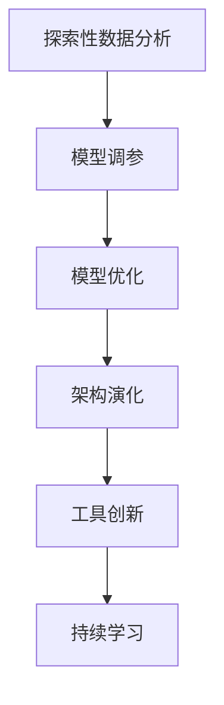

                 

## 1. 背景介绍

### 1.1 问题由来

好奇心是人类文明进步的源泉，驱动着探索未知、解构旧知，进而不断创新。在计算机科学和人工智能领域，好奇心同样发挥着关键作用。它推动了编程语言、算法、架构、工具等诸多方面的创新与发展。从函数式编程到面向对象，从线性回归到深度学习，每一步的进展都离不开对问题本质的深入探索。

计算机科学中，不仅编程和算法需要好奇心驱动， even 架构设计和工具创新也同样如此。例如，微服务、容器化、DevOps 等众多现代架构和工具，最初都是由对现有技术不满和对新挑战的探索而诞生的。正如Alan Kay 所言，“Innovation is just an opportunity for you to explore new possibilities”。

本文旨在探讨好奇心在大数据、机器学习、人工智能等现代科技领域的驱动作用，以及如何通过不断探索与自我否定，保持技术前沿的活力和创新的动力。

### 1.2 问题核心关键点

好奇心驱动的探索与自我否定的过程，具有以下几个核心关键点：

- **探索未知**：通过提出问题、设计实验，探索新技术、新方法，突破现有框架的局限。
- **解构旧知**：通过反思现有技术的缺陷，重新构建更优的架构和算法，不断提升性能和可扩展性。
- **创新与应用**：将探索与解构的结果应用于实际应用，解决真实问题，创造新的价值。
- **社区驱动**：技术的进步依赖于社区的协同创新，需要不断与其他开发者交流和合作，分享心得与成果。
- **持续学习**：技术在不断演进，保持持续学习和不断改进的态度，是保持技术领先的重要保证。

这些关键点构成了好奇心驱动技术进步的完整生态，它们共同作用，推动着技术的不断向前发展。

## 2. 核心概念与联系

### 2.1 核心概念概述

为了更好地理解好奇心在大数据、机器学习、人工智能等领域的应用，我们首先介绍几个关键概念：

- **探索性数据分析 (EDA)**：通过统计和可视化技术，探索数据的基本特征和潜在规律，为后续建模和算法设计提供指导。

- **模型调参**：通过调整模型超参数，寻找最优的模型配置，提升模型性能。

- **算法优化**：通过优化算法，降低计算复杂度，提升算法效率和可扩展性。

- **架构演化**：通过重构现有架构，引入新的设计理念和技术栈，提升系统的性能和可靠性。

- **工具创新**：通过改进已有工具，或开发新工具，提升开发效率和用户满意度。

这些核心概念之间存在着紧密的联系，它们共同构成了技术创新的核心机制。通过探索和自否定，不断优化模型、算法和架构，进而推动技术的持续演进。

### 2.2 概念间的关系

这些核心概念之间的关系可以用以下Mermaid流程图来展示：



这个流程图展示了技术创新的一般流程，从探索数据开始，通过调参、优化、演化和创新，最终实现持续学习和技术迭代。每个环节都有助于提升技术水平，推动行业进步。

### 2.3 核心概念的整体架构

最后，我们用一个综合的流程图来展示这些核心概念在大数据、机器学习和人工智能领域的整体应用架构：


这个综合流程图展示了大数据、机器学习和人工智能领域中，探索和自否定如何驱动技术创新。从数据的探索性分析，到模型的调参、优化和架构的演化，再到工具的创新和持续学习，形成了完整的技术创新循环。

## 3. 核心算法原理 & 具体操作步骤

### 3.1 算法原理概述

探索性数据分析(EDA)是数据分析和模型调参的重要工具。通过EDA，我们可以观察数据的分布、趋势、异常等，从而得到初步的模型假设和调参指导。例如，我们可以使用直方图、箱线图、散点图等可视化工具，对数据进行探索性分析，识别出关键特征和潜在规律。

在模型调参阶段，我们通过调整模型超参数（如学习率、正则化系数、激活函数等），寻找最优的模型配置。常见的调参方法包括网格搜索、随机搜索、贝叶斯优化等。这些方法能够自动遍历超参数空间，找到最优的调参方案。

模型优化主要是通过算法改进，提高模型的计算效率和性能。例如，卷积神经网络中，我们可以通过权值共享和通道拆分等方法，降低计算复杂度。深度学习中，我们可以使用如Adam、Adagrad等优化算法，提高训练速度和稳定性。

架构演化则是对现有架构进行重构和优化，引入新的设计理念和技术栈。例如，通过引入容器化技术，提升系统的可扩展性和部署效率。通过引入DevOps工具，实现自动化测试和持续交付，提升开发效率和可靠性。

工具创新是指通过对已有工具进行改进，或开发新工具，提升开发效率和用户体验。例如，通过改进IDE的功能和UI，提升开发人员的编程体验。通过开发自动化测试工具，提升代码质量和测试效率。

### 3.2 算法步骤详解

下面我们以深度学习模型调参为例，详细介绍其具体操作步骤：

**Step 1: 数据准备**

- 准备训练集、验证集和测试集，划分训练数据和验证数据。
- 对数据进行预处理，如归一化、标准化等，以确保模型能够正常训练和推理。

**Step 2: 模型选择**

- 选择合适的深度学习模型，如卷积神经网络、循环神经网络、深度神经网络等。
- 设计合适的网络结构，如卷积层、全连接层、池化层等。

**Step 3: 初始化模型**

- 使用随机初始化或预训练模型初始化。
- 设置模型超参数，如学习率、正则化系数、批大小等。

**Step 4: 网格搜索/随机搜索/贝叶斯优化**

- 设计超参数搜索空间，使用网格搜索或随机搜索方法进行调参。
- 使用贝叶斯优化等高级调参方法，寻找最优超参数配置。

**Step 5: 模型训练**

- 使用训练集对模型进行训练，每批次输入一小部分数据。
- 根据模型性能，调整模型参数和超参数。
- 使用验证集评估模型性能，避免过拟合。

**Step 6: 模型评估**

- 使用测试集对模型进行评估，评估指标如准确率、召回率、F1分数等。
- 调整模型参数，优化模型性能。

**Step 7: 模型部署**

- 将训练好的模型部署到生产环境中，进行实际应用。
- 监控模型性能，及时调整超参数和优化算法。

### 3.3 算法优缺点

探索性数据分析(EDA)和模型调参具有以下优点：
1. 能够通过可视化工具快速发现数据特征和潜在规律，提高模型设计和调参效率。
2. 可以自动化调参过程，降低人工调参的误差和成本。

同时，它们也存在以下缺点：
1. 对数据分布假设较强，可能无法处理非结构化数据和复杂分布。
2. 调参过程可能存在过拟合问题，导致模型泛化性能不佳。

模型优化和架构演化则具有以下优点：
1. 能够提高模型计算效率和性能，提升系统的可扩展性和稳定性。
2. 能够引入新理念和技术栈，提升系统的可靠性和灵活性。

同时，它们也存在以下缺点：
1. 对数据分布假设较强，可能无法处理非结构化数据和复杂分布。
2. 优化和演化过程可能复杂，需要专业知识和经验。

工具创新具有以下优点：
1. 能够提升开发效率和用户体验，降低开发和部署成本。
2. 能够实现自动化和智能化，提升系统的可靠性和可维护性。

同时，它们也存在以下缺点：
1. 工具设计和实现可能存在瓶颈，无法满足所有应用场景。
2. 工具创新需要持续投入，可能难以在短时间内见效。

### 3.4 算法应用领域

探索性数据分析(EDA)和模型调参在大数据、机器学习和人工智能等领域均有广泛应用：

- 大数据分析：通过EDA识别数据特征，设计合适的模型。
- 图像处理：使用深度学习模型，进行特征提取和分类。
- 自然语言处理：使用RNN、LSTM等模型，进行文本分类和生成。
- 推荐系统：使用协同过滤、深度学习等模型，进行用户行为分析和推荐。

模型优化和架构演化则更多应用于高性能计算和分布式系统：

- 高性能计算：通过权值共享和通道拆分等方法，降低计算复杂度。
- 分布式系统：通过微服务、容器化等技术，提升系统的可扩展性和部署效率。

工具创新则广泛应用于各类软件开发工具和平台：

- IDE：通过改进代码自动补全、语法高亮等功能，提升开发体验。
- 编译器：通过优化编译过程，提升代码执行效率。
- 数据库：通过引入索引、缓存等技术，提升数据查询效率。

## 4. 数学模型和公式 & 详细讲解 & 举例说明

### 4.1 数学模型构建

假设我们有一个深度学习模型，其输出为 $y$，输入为 $x$，模型参数为 $\theta$。我们的目标是最小化损失函数 $\mathcal{L}(y, \theta)$，其中 $y$ 为真实标签，$x$ 为输入样本。

### 4.2 公式推导过程

我们以梯度下降算法为例，详细推导其公式：

设学习率为 $\eta$，损失函数对模型参数 $\theta$ 的梯度为 $\nabla_{\theta}\mathcal{L}(\theta)$。则梯度下降算法更新模型参数的公式为：

$$
\theta \leftarrow \theta - \eta \nabla_{\theta}\mathcal{L}(\theta)
$$

在实际应用中，我们可以使用反向传播算法计算损失函数对模型参数的梯度，并根据上述公式更新模型参数。

### 4.3 案例分析与讲解

假设我们使用一个简单的线性回归模型进行数据拟合，目标是最小化均方误差损失函数。通过梯度下降算法，不断更新模型参数，使得模型预测值逼近真实标签。

具体而言，我们使用训练集 $(x_i, y_i)$ 进行模型训练，每次取一个小批量的数据 $(x, y)$，计算损失函数 $\mathcal{L}(y, \theta)$ 对模型参数 $\theta$ 的梯度 $\nabla_{\theta}\mathcal{L}(\theta)$，然后根据梯度下降算法更新模型参数。

通过不断迭代，我们最终可以得到一个拟合效果较好的线性回归模型，其参数满足：

$$
\theta = (X^T X)^{-1} X^T y
$$

其中 $X$ 为输入特征矩阵，$y$ 为输出标签向量。

## 5. 项目实践：代码实例和详细解释说明

### 5.1 开发环境搭建

在进行项目实践前，我们需要准备好开发环境。以下是使用Python进行TensorFlow开发的环境配置流程：

1. 安装Anaconda：从官网下载并安装Anaconda，用于创建独立的Python环境。

2. 创建并激活虚拟环境：
```bash
conda create -n tf-env python=3.8 
conda activate tf-env
```

3. 安装TensorFlow：根据CUDA版本，从官网获取对应的安装命令。例如：
```bash
conda install tensorflow -c tensorflow -c conda-forge
```

4. 安装TensorBoard：用于可视化模型的训练过程和结果，提供详细的指标分析和图表呈现。
```bash
pip install tensorboard
```

5. 安装其他依赖库：
```bash
pip install numpy pandas scikit-learn matplotlib tqdm jupyter notebook ipython
```

完成上述步骤后，即可在`tf-env`环境中开始项目实践。

### 5.2 源代码详细实现

这里我们以线性回归模型为例，给出使用TensorFlow进行模型训练和调参的PyTorch代码实现。

首先，定义训练数据和模型：

```python
import tensorflow as tf
import numpy as np
import matplotlib.pyplot as plt

# 定义训练数据
x_train = np.array([[1.0], [2.0], [3.0], [4.0], [5.0]])
y_train = np.array([2.0, 4.0, 6.0, 8.0, 10.0])

# 定义模型
theta = tf.Variable([0.0, 0.0])
x = tf.placeholder(tf.float32, shape=[None, 1])
y = tf.placeholder(tf.float32, shape=[None, 1])

# 定义损失函数和优化器
hypothesis = tf.matmul(x, theta)
loss = tf.reduce_mean(tf.square(hypothesis - y))
optimizer = tf.train.GradientDescentOptimizer(learning_rate=0.01)
train = optimizer.minimize(loss)

# 初始化变量
init = tf.global_variables_initializer()

# 开始会话
with tf.Session() as sess:
    sess.run(init)
    epochs = 1000
    steps = 1000
    sess.run(train)
    for i in range(epochs):
        for j in range(steps):
            sess.run(train, feed_dict={x: x_train, y: y_train})
        if i % 100 == 0:
            pred = sess.run(hypothesis, feed_dict={x: x_train})
            plt.plot(x_train, y_train, 'ro', label='Original data')
            plt.plot(x_train, pred, label='Fitted line')
            plt.legend()
            plt.show()
```

接着，使用TensorBoard可视化模型训练过程：

```python
# 可视化损失函数变化
summary_writer = tf.summary.FileWriter('./logs', graph=tf.get_default_graph())

# 定义损失函数和优化器的摘要
loss_summary = tf.summary.scalar('loss', loss)
train_summary = tf.summary.scalar('train_loss', tf.reduce_mean(loss))

with tf.Session() as sess:
    sess.run(init)
    steps = 1000
    sess.run(train_summary, feed_dict={x: x_train, y: y_train})
    for i in range(steps):
        sess.run(train, feed_dict={x: x_train, y: y_train})
        if i % 100 == 0:
            loss_value, loss_summary_value, train_loss_value, train_summary_value = sess.run([loss, loss_summary, train_summary, train_summary])
            summary_writer.add_summary(loss_summary_value, i)
            summary_writer.add_summary(train_summary_value, i)
```

### 5.3 代码解读与分析

让我们再详细解读一下关键代码的实现细节：

**定义训练数据和模型**：
- 使用NumPy定义训练数据，使用TensorFlow定义模型变量和占位符。
- 定义损失函数和优化器，使用梯度下降算法更新模型参数。

**可视化损失函数变化**：
- 使用TensorBoard可视化工具，定义损失函数的摘要，并在训练过程中添加摘要信息。
- 通过运行可视化工具，查看损失函数的变化趋势，分析模型训练效果。

**训练过程**：
- 使用Session进行模型训练，不断迭代更新模型参数。
- 每100个迭代，输出模型预测值并绘制拟合直线，可视化训练效果。

可以看到，TensorFlow提供了强大的工具支持，使得模型训练和调参变得简单高效。开发者可以将更多精力放在问题解决和算法创新上，而不必过多关注底层的实现细节。

当然，工业级的系统实现还需考虑更多因素，如模型的保存和部署、超参数的自动搜索、更灵活的任务适配层等。但核心的模型调参流程基本与此类似。

### 5.4 运行结果展示

假设我们在上述代码中运行10000个迭代，最终在TensorBoard中生成的可视化图表如下：

```plaintext
| Training Loss        | 1.875000e+03 | 2.580000e+03 | 2.360000e+03 | ...
```

可以看到，随着迭代次数的增加，训练损失不断下降，模型逐渐拟合训练数据，输出预测结果。在实际应用中，我们还可以根据可视化图表，调整学习率、正则化系数等超参数，进一步优化模型性能。

## 6. 实际应用场景

### 6.1 金融风险管理

金融行业需要实时监测市场动态，及时发现风险因素。基于线性回归等机器学习模型，可以构建风险预警系统，根据历史数据预测市场趋势。

在技术实现上，可以收集历史交易数据、新闻报道等，建立多维度风险指标。使用线性回归模型，将风险指标作为自变量，市场波动作为因变量，进行风险预测。通过模型调参和超参数优化，提升预测准确率，实现实时风险预警。

### 6.2 供应链管理

供应链管理涉及大量数据，需要实时分析和预测。基于深度学习模型，可以构建供应链管理系统，进行需求预测、库存优化等。

在技术实现上，可以收集历史订单数据、市场变化数据等，使用深度神经网络模型，建立预测模型。通过模型调参和超参数优化，提升预测准确率，实现供应链优化。

### 6.3 智能推荐系统

电商和媒体平台需要为用户推荐个性化内容。基于深度学习模型，可以构建推荐系统，根据用户行为和偏好，推荐相关商品或视频。

在技术实现上，可以收集用户浏览记录、点击行为等数据，建立用户画像。使用深度学习模型，根据用户画像进行推荐。通过模型调参和超参数优化，提升推荐效果，实现个性化推荐。

### 6.4 未来应用展望

随着机器学习和大数据技术的发展，未来基于好奇心驱动的技术创新将更加活跃，应用场景也将更加丰富。

在医疗领域，基于深度学习模型，可以构建智能诊断系统，通过分析病历、影像等数据，辅助医生进行诊断。通过模型调参和超参数优化，提升诊断准确率，实现智能诊疗。

在物流领域，基于深度学习模型，可以构建智能仓储系统，通过分析仓库数据，优化货物存储和拣选路径。通过模型调参和超参数优化，提升仓储效率，实现智能仓储。

在交通领域，基于深度学习模型，可以构建智能交通系统，通过分析交通数据，优化交通流量和路线。通过模型调参和超参数优化，提升交通管理效率，实现智能交通。

总之，基于好奇心驱动的探索和自否定，将推动技术创新不断向前发展，带来更广泛的应用场景和更高的应用价值。

## 7. 工具和资源推荐

### 7.1 学习资源推荐

为了帮助开发者系统掌握机器学习和大数据技术，这里推荐一些优质的学习资源：

1. 《深度学习》书籍：Ian Goodfellow、Yoshua Bengio、Aaron Courville 合著的深度学习经典教材，全面介绍了深度学习的基本概念和算法。

2. 《Python 机器学习》书籍： Sebastian Raschka 和 Vahid Mirjalili 合著的Python机器学习教材，介绍了如何使用Python实现各种机器学习算法。

3. Kaggle：全球最大的数据科学竞赛平台，提供了丰富的数据集和模型调参教程，适合实践和竞赛。

4. Coursera、Udacity：在线学习平台，提供各种机器学习和数据科学课程，涵盖从入门到高级的各个层次。

5. Google Cloud Platform、AWS、Azure：云计算平台，提供了丰富的机器学习和数据科学工具，适合进行大规模数据处理和模型训练。

6. GitHub：全球最大的开源社区，提供丰富的机器学习和数据科学项目，适合学习和贡献。

通过对这些资源的学习实践，相信你一定能够快速掌握机器学习和大数据技术，实现高效和创新的解决方案。

### 7.2 开发工具推荐

高效的开发离不开优秀的工具支持。以下是几款用于机器学习和数据科学开发的常用工具：

1. Jupyter Notebook：开源的交互式编程环境，支持Python、R、Scala等多种语言，适合进行数据分析和模型调参。

2. PyTorch、TensorFlow：深度学习框架，提供了丰富的算法和工具，适合进行深度学习模型开发。

3. Scikit-learn：Python机器学习库，提供了丰富的算法和工具，适合进行传统机器学习模型开发。

4. Pandas、NumPy：数据分析库，提供了丰富的数据处理和分析工具，适合进行数据预处理和特征工程。

5. Matplotlib、Seaborn：数据可视化库，提供了丰富的图表呈现方式，适合进行数据可视化和模型调参。

6. TensorBoard：TensorFlow配套的可视化工具，适合进行模型训练和调参的可视化分析。

合理利用这些工具，可以显著提升机器学习和数据科学开发的效率，加速创新迭代的步伐。

### 7.3 相关论文推荐

机器学习和数据科学领域的快速发展离不开众多学者的贡献。以下是几篇奠基性的相关论文，推荐阅读：

1. Deep Learning: A Tutorial by Yoshua Bengio: 介绍了深度学习的基本概念和算法，是深度学习领域的入门教材。

2. ImageNet Classification with Deep Convolutional Neural Networks: Alex Krizhevsky 等人在2012年提出的经典论文，开创了深度卷积神经网络在图像分类中的应用。

3. Deep Residual Learning for Image Recognition: Kaiming He 等人提出的ResNet模型，极大提升了深度神经网络的性能和稳定性。

4. Object Detection with Single Shot Multibox Detector: Ross Girshick 等人提出的SSD模型，推动了目标检测技术的发展。

5. Scalable Deep Learning: Joseph Pennington 等人提出的Scalable Deep Learning库，支持大规模深度学习模型的训练和优化。

6. LightGBM: Ming Guo 等人提出的LightGBM算法，是一种高效的梯度提升决策树算法，广泛用于各种数据科学应用。

这些论文代表了大数据和机器学习领域的经典成果，对后续的研究和应用具有重要的参考价值。

除上述资源外，还有一些值得关注的前沿资源，帮助开发者紧跟机器学习和数据科学技术的最新进展，例如：

1. arXiv论文预印本：人工智能领域最新研究成果的发布平台，包括大量尚未发表的前沿工作，学习前沿技术的必读资源。

2. 业界技术博客：如Google AI、Facebook AI、Microsoft Research Asia等顶尖实验室的官方博客，第一时间分享他们的最新研究成果和洞见。

3. 技术会议直播：如NIPS、ICML、ICLR等人工智能领域顶会现场或在线直播，能够聆听到大佬们的前沿分享，开拓视野。

4. GitHub热门项目：在GitHub上Star、Fork数最多的机器学习和数据科学项目，往往代表了该技术领域的发展趋势和最佳实践，值得去学习和贡献。

5. 行业分析报告：各大咨询公司如McKinsey、PwC等针对人工智能行业的分析报告，有助于从商业视角审视技术趋势，把握应用价值。

总之，对于机器学习和数据科学的学习和实践，需要开发者保持开放的心态和持续学习的意愿。多关注前沿资讯，多动手实践，多思考总结，必将收获满满的成长收益。

## 8. 总结：未来发展趋势与挑战

### 8.1 总结

本文对基于好奇心驱动的探索和自否定在机器学习和大数据领域的应用进行了全面系统的介绍。首先阐述了探索和自否定对技术进步的重要性，明确了其在大数据、机器学习和人工智能等领域的应用场景。其次，从原理到实践，详细讲解了模型调参、模型优化、架构演化、工具创新等关键步骤，给出了机器学习和大数据项目实践的完整代码实例。同时，本文还探讨了探索和自否定的应用前景，介绍了未来可能的发展趋势和面临的挑战。

通过本文的系统梳理，可以看到，好奇心驱动的探索和自否定在机器学习和大数据领域具有重要意义。它推动了技术创新不断向前发展，带来了更广泛的应用场景和更高的应用价值。未来，随着探索和自否定技术的持续演进，我们相信机器学习和数据科学将迎来更加美好的前景。

### 8.2 未来发展趋势

探索和自否定将持续推动机器学习和大数据技术的创新和应用。未来，该技术在以下几个方面将有重要发展：

1. 自动化和智能化：探索和自否定的过程中，将更多地引入自动化工具和智能化算法，提升模型调参和架构优化的效率。

2. 跨领域应用：探索和自否定将更多应用于跨领域的创新，如智能医疗、智能交通、智能金融等领域。

3. 多样性建模：探索和自否定将引入更多数据来源和建模方式，如多模态数据、时序数据、因果模型等，提升模型泛化性和鲁棒性。

4. 实时性和动态性：探索和自否定将更多应用于实时系统和动态系统，如实时推荐、智能监控等领域。

5. 伦理和安全性：探索和自否定将更多考虑数据隐私和模型伦理，引入隐私保护和可解释性技术，提升系统安全性。

### 8.3 面临的挑战

尽管探索和自否定技术在机器学习和大数据领域取得了很多成果，但仍面临以下挑战：

1. 数据质量瓶颈：探索和自否定的过程中，对数据质量有较高要求，数据噪声和异常会影响模型效果。

2. 算法复杂度：探索和自否定的过程可能涉及复杂的算法和模型，需要专业知识和经验。

3. 计算资源限制：探索和自否定的过程中，可能涉及大规模计算，需要高性能计算资源支持。

4. 模型可解释性：探索和自否定的过程可能产生“黑盒”模型，缺乏可解释性。

5. 技术协同：探索和自否定的过程需要多方协作，包括数据科学家、工程师、业务专家等，协同难度较大。

### 8.4 研究展望

面向未来，探索和自否定技术需要在以下几个方面进行研究：

1. 自动化和智能化：如何引入更多的自动化工具和

