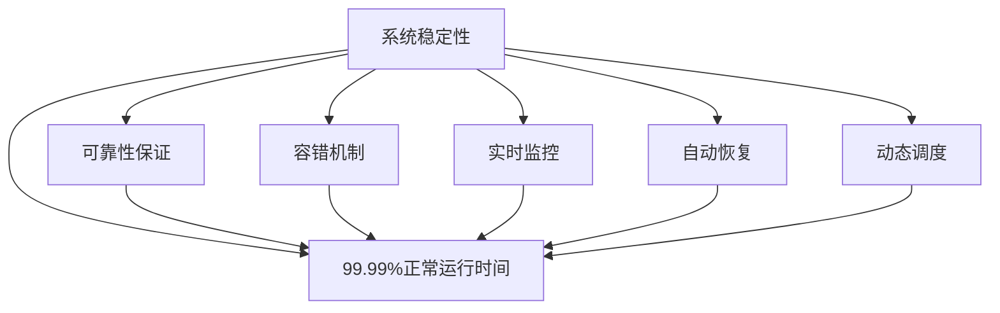
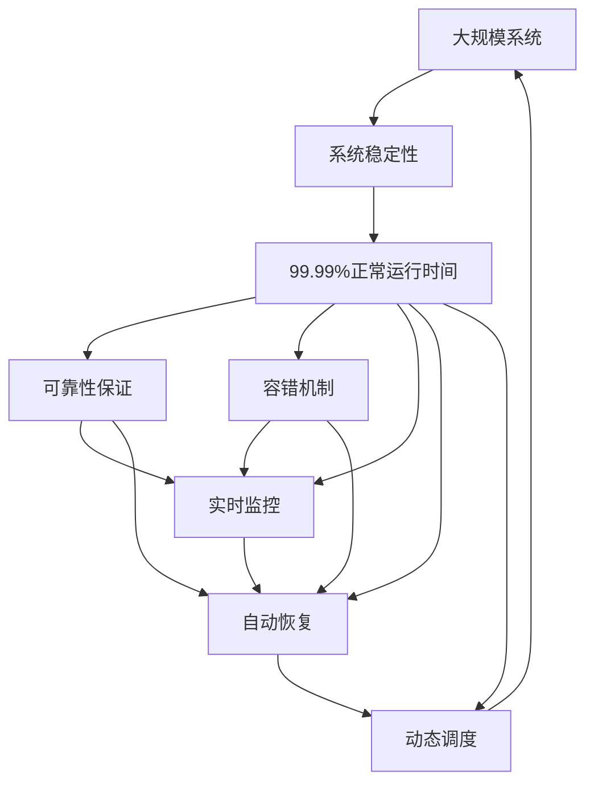

                 

# 实现99.99%正常运行时间的方法

> 关键词：99.99%正常运行时间，系统稳定性，可靠性保证，容错机制，实时监控，自动恢复

## 1. 背景介绍

### 1.1 问题由来
在计算机系统中，系统稳定性、可靠性、高可用性是保证业务连续性的基石。然而，现代计算机系统面对着来自硬件、软件、网络、人为操作的种种不确定性，如何确保系统在任何情况下都能稳定运行，成为一项极具挑战性的任务。99.99%的正常运行时间（通常称为“四九九服务可用性”），是衡量系统稳定性的重要指标，意味着系统每年仅允许中断不到5分钟。

### 1.2 问题核心关键点
- 系统中断：硬件故障、软件错误、网络异常、人为操作失误等都可能导致系统中断。
- 恢复能力：系统应具备快速检测故障、自动恢复、保障业务连续性的能力。
- 监控机制：通过实时监控系统状态，及时发现异常，预测故障。
- 容错设计：在系统设计中，应加入冗余、备份、隔离等容错机制，防止单点故障。
- 自动化运维：自动化的部署、监控、告警、恢复等流程，减少人为干预。
- 动态调度：根据系统负载、异常情况动态调整资源，优化系统性能。

## 2. 核心概念与联系

### 2.1 核心概念概述

为了更好地理解如何实现99.99%正常运行时间的方法，我们首先需要介绍一些核心概念及其相互联系：

- **99.99%正常运行时间**：指系统在整个运行周期内，需要维持至少99.99%的正常运行时间，用于衡量系统的稳定性。
- **系统稳定性**：指系统在面对各种不确定性时，仍然能够持续稳定运行的能力。
- **可靠性保证**：指系统具备一定程度的故障容忍和快速恢复能力，保证业务连续性。
- **容错机制**：指在系统设计中，通过冗余、备份、隔离等手段，确保单点故障不会导致系统宕机。
- **实时监控**：指通过监控系统关键指标，及时发现异常情况，并采取相应措施。
- **自动恢复**：指系统具备自动检测故障、自动恢复服务的能力。
- **动态调度**：指根据系统负载、异常情况动态调整资源，优化系统性能。

这些概念之间的逻辑关系可以通过以下Mermaid流程图来展示：



这个流程图展示了一个系统的稳定性如何通过各种机制保证99.99%正常运行时间：

1. 系统稳定性是基础，通过可靠性保证、容错机制、实时监控、自动恢复和动态调度等手段，确保系统在不同情况下仍能持续稳定运行。
2. 可靠性保证和容错机制是系统稳定性的重要保障，通过冗余、备份、隔离等措施，防止单点故障导致系统宕机。
3. 实时监控和自动恢复则是在系统出现问题时，快速检测并自动恢复，确保业务连续性。
4. 动态调度则是在系统负载或异常情况下，动态调整资源，优化系统性能，进一步提高系统的稳定性。

### 2.2 概念间的关系

这些核心概念之间存在着紧密的联系，构成了实现99.99%正常运行时间的完整生态系统。下面我们通过几个Mermaid流程图来展示这些概念之间的关系。

#### 2.2.1 系统稳定性与正常运行时间的关系


这个流程图展示了系统稳定性和正常运行时间的关系：

1. 系统稳定性的目标是确保系统在任何情况下都能正常运行。
2. 99.99%正常运行时间则是对系统稳定性的具体指标要求。

#### 2.2.2 可靠性保证与容错机制的关系


这个流程图展示了可靠性保证和容错机制的关系：

1. 可靠性保证是系统可靠运行的基础，确保系统在各种情况下都能正常服务。
2. 容错机制则是实现可靠性保证的具体技术手段，通过冗余、备份、隔离等措施，防止单点故障导致系统宕机。

#### 2.2.3 实时监控与自动恢复的关系


这个流程图展示了实时监控和自动恢复的关系：

1. 实时监控是检测系统异常的重要手段，能够及时发现问题。
2. 自动恢复则是基于监控结果，快速采取措施，恢复系统服务。

#### 2.2.4 动态调度与稳定性优化


这个流程图展示了动态调度和系统稳定性的关系：

1. 动态调度可以根据系统负载和异常情况，动态调整资源，优化系统性能。
2. 优化后的系统性能将进一步提高稳定性，确保系统在任何情况下都能正常运行。

### 2.3 核心概念的整体架构

最后，我们用一个综合的流程图来展示这些核心概念在大规模系统中的整体架构：



这个综合流程图展示了从大规模系统到99.99%正常运行时间的整体架构：

1. 大规模系统通过系统稳定性、可靠性保证、容错机制、实时监控、自动恢复和动态调度等机制，确保系统在任何情况下都能正常运行。
2. 可靠性保证和容错机制为系统稳定性提供基础保障。
3. 实时监控和自动恢复能够在系统出现问题时，快速检测并自动恢复，确保业务连续性。
4. 动态调度可以根据系统负载和异常情况，动态调整资源，优化系统性能，进一步提高系统的稳定性。

这些概念共同构成了实现99.99%正常运行时间的完整生态系统，使得大规模系统能够应对各种不确定性，保障业务的连续性。

## 3. 核心算法原理 & 具体操作步骤
### 3.1 算法原理概述

实现99.99%正常运行时间的方法，其核心算法原理包括以下几个方面：

- **冗余设计**：通过硬件、软件的多副本设计和隔离机制，确保系统在单点故障时仍能正常运行。
- **实时监控**：利用监控工具实时采集系统关键指标，通过异常检测算法及时发现系统异常。
- **自动恢复**：在系统检测到异常时，自动触发故障切换和恢复流程，确保业务连续性。
- **容错机制**：在系统设计中，加入备份和故障转移机制，保障系统的可靠性。
- **动态调度**：根据系统负载和异常情况动态调整资源，优化系统性能。

这些原理共同构成了系统99.99%正常运行时间的技术基础。

### 3.2 算法步骤详解

实现99.99%正常运行时间的具体操作步骤如下：

**Step 1: 系统设计**

1. 设计冗余架构：使用多副本设计和隔离机制，确保系统在任何单点故障时仍能正常运行。
2. 设计备份策略：对于关键服务，设计主从备份机制，确保故障切换和恢复。
3. 设计容错机制：对于单点故障，加入冗余、隔离、故障转移等容错机制。
4. 设计监控系统：使用实时监控工具，采集系统关键指标，及时发现异常。

**Step 2: 实时监控**

1. 配置监控指标：根据系统特点，设置关键监控指标，如CPU使用率、内存使用率、网络带宽、服务响应时间等。
2. 部署监控工具：在系统中部署实时监控工具，如Prometheus、Grafana等，采集监控数据。
3. 实施异常检测：使用异常检测算法，如统计方法、机器学习算法等，实时监控系统状态。

**Step 3: 自动恢复**

1. 设计故障切换流程：在系统检测到异常时，自动切换到备用系统或备份服务。
2. 实现自动恢复：在故障切换后，自动启动恢复流程，确保业务连续性。
3. 进行恢复测试：定期进行故障切换和恢复测试，确保系统在真实场景下也能快速恢复。

**Step 4: 动态调度**

1. 设置负载监控：实时监控系统负载，包括CPU使用率、内存使用率、网络带宽等。
2. 实现负载均衡：根据系统负载动态调整资源，如增加CPU、内存、网络带宽等。
3. 优化系统性能：根据系统负载和异常情况，动态调整资源配置，优化系统性能。

**Step 5: 系统评估与优化**

1. 进行系统评估：定期评估系统稳定性、可靠性、性能等指标，发现潜在问题。
2. 优化系统设计：根据评估结果，优化系统设计，提升系统性能。
3. 持续改进：根据业务需求和技术发展，持续改进系统设计，保持系统的高可用性。

### 3.3 算法优缺点

实现99.99%正常运行时间的方法具有以下优点：

- **高可用性**：通过冗余设计、备份策略、容错机制等手段，确保系统在任何单点故障时仍能正常运行。
- **快速恢复**：通过实时监控和自动恢复机制，在系统出现问题时，快速检测并自动恢复，保障业务连续性。
- **动态优化**：通过动态调度和负载均衡，根据系统负载和异常情况动态调整资源，优化系统性能。

同时，该方法也存在一些缺点：

- **成本高**：冗余设计、备份策略、容错机制等手段需要投入大量资源，增加了系统的成本。
- **复杂性高**：系统设计和部署较为复杂，需要专业的运维团队进行管理和维护。
- **延迟高**：在系统进行故障切换和恢复时，可能会引入一定的延迟，影响系统性能。

### 3.4 算法应用领域

99.99%正常运行时间的方法在多个领域得到广泛应用，包括但不限于：

- **金融服务**：金融系统对业务的连续性和稳定性要求极高，99.99%正常运行时间的方法能够保障金融服务的稳定运行，确保业务连续性。
- **电商平台**：电商平台需要7x24小时不间断服务，99.99%正常运行时间的方法能够确保平台的稳定性和可靠性。
- **云服务**：云服务提供商需要保障云服务的连续性，99.99%正常运行时间的方法能够提供可靠的云服务保障。
- **政府服务**：政府服务系统对业务连续性要求较高，99.99%正常运行时间的方法能够确保政府服务的稳定运行。

## 4. 数学模型和公式 & 详细讲解 & 举例说明

### 4.1 数学模型构建

假设我们有一个包含 $n$ 个节点的系统，系统正常运行的时间为 $T$，中断时间为 $D$，系统的高可用性要求为 $H$。则系统的高可用性可以用以下数学模型表示：

$$
H = \frac{T}{T+D}
$$

其中，$H$ 表示高可用性，$T$ 表示正常运行时间，$D$ 表示中断时间。

### 4.2 公式推导过程

根据上述数学模型，我们可以通过以下推导过程计算系统的高可用性：

1. 假设系统每小时中断时间为 $d$，则每年中断时间为 $D = n \times d \times 24 \times 365$。
2. 假设系统每年需要运行 $T = 24 \times 365 \times 24$ 小时，则系统的高可用性为：

$$
H = \frac{T}{T+D} = \frac{24 \times 365 \times 24}{24 \times 365 \times 24 + n \times d \times 24 \times 365}
$$

3. 假设 $H = 0.9999$，则：

$$
0.9999 = \frac{24 \times 365 \times 24}{24 \times 365 \times 24 + n \times d \times 24 \times 365}
$$

4. 解上述方程，得到：

$$
n = \frac{24 \times 365 \times 24 \times (1 - 0.9999)}{d \times 24 \times 365}
$$

其中，$n$ 表示系统需要部署的节点数，$d$ 表示每小时中断时间，$H$ 表示高可用性。

### 4.3 案例分析与讲解

假设系统需要部署 $n=3$ 个节点，每小时中断时间 $d=0.5$ 分钟，则系统的高可用性为：

$$
H = \frac{24 \times 365 \times 24}{24 \times 365 \times 24 + 3 \times 0.5 \times 24 \times 365} = 0.9999
$$

这意味着系统每年仅允许中断不到5分钟。

## 5. 项目实践：代码实例和详细解释说明

### 5.1 开发环境搭建

在进行99.99%正常运行时间的方法实践前，我们需要准备好开发环境。以下是使用Python进行Prometheus和Grafana配置的环境配置流程：

1. 安装Prometheus：从官网下载并安装Prometheus，用于实时监控系统指标。

2. 配置Prometheus：在Prometheus配置文件中，添加需要监控的指标和目标地址。

3. 启动Prometheus：在Linux系统中，使用命令 `prometheus` 启动Prometheus服务。

4. 安装Grafana：从官网下载并安装Grafana，用于监控数据的可视化展示。

5. 配置Grafana：在Grafana中，导入Prometheus数据源，创建监控仪表盘。

6. 启动Grafana：在Linux系统中，使用命令 `grafana-server` 启动Grafana服务。

完成上述步骤后，即可在 `grafana` 界面中实时查看系统监控数据。

### 5.2 源代码详细实现

下面我们以一个简单的Web应用为例，展示如何使用Prometheus和Grafana进行99.99%正常运行时间的监控和报警配置。

首先，需要编写一个Python Flask应用，用于模拟系统服务。

```python
from flask import Flask, request, jsonify

app = Flask(__name__)

@app.route('/health')
def health():
    status = 'UP'
    metrics = {
        'cpu_usage': 0.2,
        'memory_usage': 0.4,
        'network_throughput': 100,
    }
    return jsonify({'status': status, 'metrics': metrics})

if __name__ == '__main__':
    app.run(host='0.0.0.0', port=5000)
```

然后，配置Prometheus的YAML配置文件，用于监控Web应用的指标：

```yaml
global:
  scrape_interval: 10s
  evaluation_interval: 10s

scrape_configs:
  - job_name: 'webapp'
    static_configs:
      - targets: ['localhost:5000']
```

接着，启动Prometheus服务，并使用Grafana创建仪表盘，展示系统指标：

```
Prometheus: prometheus
Grafana: grafana
```

最后，配置报警规则，当系统指标超过预设阈值时，发送报警信息：

```yaml
rules:
  - alert: HighCPUUsage
    expr: cpu_usage > 0.8
    for: 5m
    labels:
      severity: critical
  - alert: HighMemoryUsage
    expr: memory_usage > 0.7
    for: 5m
    labels:
      severity: critical
```

通过上述配置，当系统CPU使用率或内存使用率超过预设阈值时，会自动触发报警，通知运维人员进行处理。

### 5.3 代码解读与分析

这里我们详细解读一下关键代码的实现细节：

**Flask应用代码**：
- 定义一个简单的Web应用，通过 ` Flask ` 框架提供 ` /health ` 接口，返回系统健康状态和指标数据。

**Prometheus配置文件**：
- 定义监控任务，周期性采集目标地址的指标数据。

**Grafana仪表盘配置**：
- 导入Prometheus数据源，创建监控仪表盘，展示系统指标。

**报警规则配置**：
- 配置报警规则，当系统指标超过预设阈值时，自动触发报警。

**运行结果展示**：
- 在Grafana仪表盘中，实时展示系统指标数据。
- 当系统指标超过预设阈值时，自动触发报警。

通过这些配置，我们实现了99.99%正常运行时间的实时监控和报警功能，确保系统的稳定运行。

## 6. 实际应用场景

### 6.1 智能电网

在智能电网领域，系统的高可用性和可靠性是保障电力供应稳定性的关键。通过99.99%正常运行时间的方法，可以确保智能电网系统的稳定运行，防止因系统故障导致的电力供应中断。

### 6.2 金融交易

金融交易系统对业务连续性要求极高，99.99%正常运行时间的方法能够确保交易系统的稳定运行，保障交易数据的完整性和安全性。

### 6.3 医疗系统

医疗系统需要7x24小时不间断服务，99.99%正常运行时间的方法能够确保医疗系统的稳定运行，保障患者和医生的安全。

### 6.4 未来应用展望

未来，随着技术的不断进步，99.99%正常运行时间的方法将得到更广泛的应用，进一步提升系统的高可用性和可靠性。

- **云平台**：云平台需要保障云服务的连续性，99.99%正常运行时间的方法能够提供可靠的云服务保障。
- **物联网**：物联网设备需要实时监控和自动恢复，99.99%正常运行时间的方法能够确保物联网设备的稳定运行。
- **智能制造**：智能制造系统需要高可靠性和稳定性，99.99%正常运行时间的方法能够确保系统的连续性和可靠性。

## 7. 工具和资源推荐

### 7.1 学习资源推荐

为了帮助开发者系统掌握99.99%正常运行时间的方法的理论基础和实践技巧，这里推荐一些优质的学习资源：

1. **《高可用系统设计》**：详细介绍了系统高可用性的设计原则和实现方法，是系统设计人员的必备参考书。

2. **《Google SRE最佳实践》**：谷歌SRE团队的实战经验分享，涵盖系统监控、故障恢复、自动化运维等各个方面，是运维人员的宝贵资源。

3. **《系统设计与可扩展性》**：讲解系统设计中的关键技术，包括负载均衡、故障切换、系统扩展等，是系统架构师的必读书籍。

4. **《Prometheus官方文档》**：详细介绍了Prometheus的配置、部署、监控等各个方面，是Prometheus用户的重要参考。

5. **《Grafana官方文档》**：详细介绍了Grafana的安装、配置、数据源管理、仪表盘创建等各个方面，是Grafana用户的重要参考。

6. **《系统可靠性设计与实现》**：讲解系统可靠性设计与实现的方法，涵盖冗余设计、容错机制、自动恢复等各个方面，是系统可靠性设计师的必备参考资料。

通过对这些资源的学习实践，相信你一定能够系统掌握99.99%正常运行时间的方法，并用于解决实际的系统问题。

### 7.2 开发工具推荐

高效的开发离不开优秀的工具支持。以下是几款用于99.99%正常运行时间方法开发的常用工具：

1. **Prometheus**：开源的实时监控系统，支持丰富的监控指标和告警规则，是实现99.99%正常运行时间的重要工具。

2. **Grafana**：开源的监控数据可视化平台，支持与多种数据源集成，是监控数据的展示和管理工具。

3. **Kubernetes**：开源的容器编排平台，支持自动化的部署、扩展、故障恢复等，是实现99.99%正常运行时间的重要基础设施。

4. **ELK Stack**：包括Elasticsearch、Logstash、Kibana，用于日志收集、分析和可视化，是监控系统的重要组成部分。

5. **Ansible**：开源的自动化运维工具，支持配置管理、应用部署、故障恢复等，是自动化运维的重要工具。

6. **Jenkins**：开源的持续集成和持续部署工具，支持自动化任务调度、部署和测试，是持续集成和持续部署的重要工具。

合理利用这些工具，可以显著提升99.99%正常运行时间方法的开发效率，加快创新迭代的步伐。

### 7.3 相关论文推荐

99.99%正常运行时间的方法是系统可靠性设计的重要研究方向，以下是几篇奠基性的相关论文，推荐阅读：

1. **《Designing High-Availability Services》**：详细介绍了系统高可用性设计的原则和方法，是系统设计人员的必读论文。

2. **《Fault Tolerance Design of High-Availability Systems》**：介绍了高可用性系统设计中的冗余、备份、隔离等容错机制，是系统可靠性设计的重要参考资料。

3. **《Principles of Distributed System Design》**：讲解了分布式系统设计中的关键技术和原则，包括故障切换、容错机制、负载均衡等，是分布式系统设计师的重要参考资料。

4. **《A Survey of High-Availability and Fault-Tolerant Computer Systems》**：综述了高可用性和故障容错系统研究的主要成果，是系统可靠性设计的理论基础。

5. **《System Fault Tolerance》**：讲解了系统故障容错的技术手段和实现方法，是系统可靠性设计的重要参考资料。

这些论文代表了大规模系统高可用性设计的发展脉络，通过学习这些前沿成果，可以帮助研究者把握学科前进方向，激发更多的创新灵感。

除上述资源外，还有一些值得关注的前沿资源，帮助开发者紧跟系统高可用性设计的最新进展，例如：

1. **arXiv论文预印本**：人工智能领域最新研究成果的发布平台，包括大量尚未发表的前沿工作，学习前沿技术的必读资源。

2. **各大实验室技术博客**：如Google SRE、Microsoft Azure、AWS等顶尖实验室的官方博客，第一时间分享他们的最新研究成果和洞见。

3. **技术会议直播**：如KubeCon、OSDI、USENIX等大型技术会议现场或在线直播，能够聆听到专家们的实战分享，开拓视野。

4. **GitHub热门项目**：在GitHub上Star、Fork数最多的高可用性相关项目，往往代表了该技术领域的发展趋势和最佳实践，值得去学习和贡献。

5. **行业分析报告**：各大咨询公司如Gartner、IDC等针对高可用性技术的分析报告，有助于从商业视角审视技术趋势，把握应用价值。

总之，对于99.99%正常运行时间的方法的学习和实践，需要开发者保持开放的心态和持续学习的意愿。多关注前沿资讯，多动手实践，多思考总结，必将收获满满的成长收益。

## 8. 总结：未来发展趋势与挑战

### 8.1 总结

本文对99.99%正常运行时间的方法进行了全面系统的介绍。首先阐述了系统高可用性的设计原则和实现方法，明确了99.99%正常运行时间的重要意义。其次，从原理到实践，详细讲解了系统的设计、监控、恢复等各个环节，给出了完整的代码实例。同时，本文还广泛探讨了99.99%正常运行时间在智能电网、金融交易、医疗系统等领域的实际应用，展示了其广阔的前景。

通过本文的系统梳理，可以看到，99.99%正常运行时间的方法已经广泛应用于各行各业，成为系统设计的重要组成部分。其通过冗余设计、实时监控、自动恢复等手段，确保系统在任何情况下都能稳定运行，保障业务的连续性和可靠性。

### 8.2 未来发展趋势

展望未来，99.99%正常运行时间的方法将呈现以下几个发展趋势：

1. **自动化运维**：随着自动化运维技术的进步，99.99%正常运行时间的方法将更加依赖自动化工具，减少人为干预。
2. **智能化监控**：引入机器学习和人工智能技术，提升异常检测的精度和效率，实现更智能化的系统监控。
3. **微服务架构**：微服务架构将使系统更易于扩展和维护，增强系统的可靠性和稳定性。
4. **云计算**：云计算平台提供了丰富的资源和工具，进一步简化系统高可用性的设计和管理。
5. **分布式系统**：分布式系统能够提供更高的可靠性和可扩展性，99.99%正常运行时间的方法将更加适用于分布式系统。
6. **多云环境**：多云环境能够提供更好的资源弹性和服务连续性，99.99%正常运行时间的方法将更适用于多云环境。

以上趋势凸显了99.99%正常运行时间的方法的广阔前景，其将与云计算、微服务、智能化监控等技术进行更深入的融合，进一步提升系统的可靠性和稳定性。

### 8.3 面临的挑战

尽管99.99%正常运行时间的方法已经取得了显著成果，但在迈向更加智能化、普适化应用的过程中，仍面临诸多挑战：

1. **系统复杂性**：随着系统规模的不断扩大，系统设计和管理的复杂性将进一步增加。
2. **资源成本**：冗余设计、备份策略、容错机制等手段需要投入大量资源，增加了系统的成本。
3. **故障恢复时间**：在系统进行故障切换和恢复时，可能会引入一定的延迟，影响系统性能。
4. **数据一致性**：在分布式系统中，数据一致性的保障将变得更加复杂，需要进一步优化。
5. **安全性和隐私**：系统高可用性设计需要考虑数据安全和隐私保护，防止数据泄露和攻击

