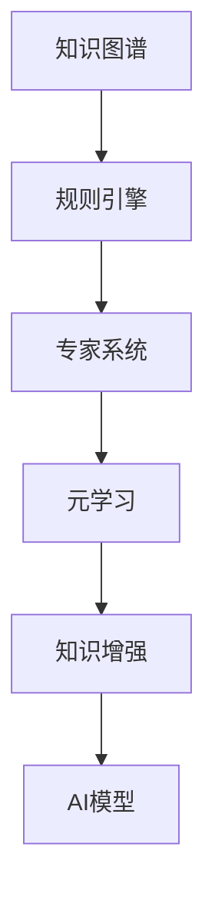
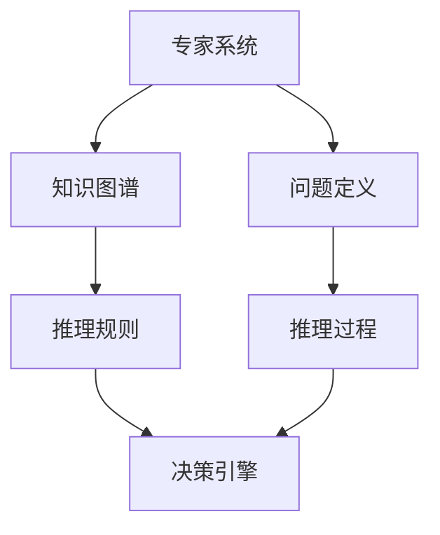
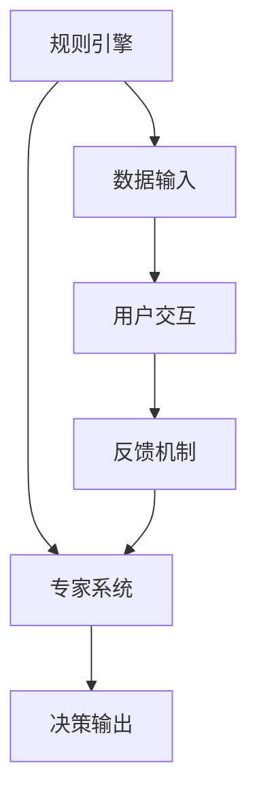
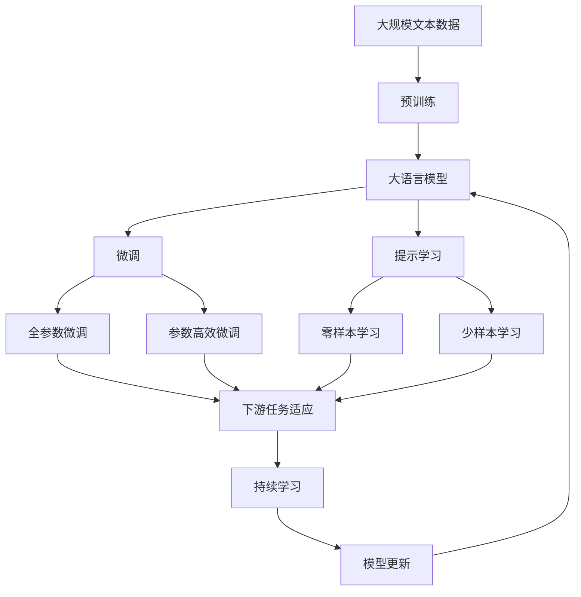

                 

# 工业革命的精髓：专家经验融入自动化

## 1. 背景介绍

在人类文明发展的历史长河中，工业革命被视为最重要的转折点之一。它彻底改变了人类的生产方式和社会结构，使得生产效率和生产规模都得到了极大的提升。工业革命的核心在于自动化，而自动化的精髓在于将人类专家的经验和知识融入机器。这一理念同样适用于现代信息技术的发展，尤其是在人工智能（AI）领域，专家的经验与知识是推动AI技术进步和应用创新的关键。

### 1.1 问题的由来

在过去的几十年里，AI技术经历了快速的发展，其应用领域日益广泛，从图像识别、语音识别到自然语言处理、智能推荐等。然而，尽管AI技术已经取得了令人瞩目的成果，但在某些复杂的应用场景中，AI系统的性能仍难以达到人类的水平。这主要是因为AI模型缺乏对特定领域的深刻理解和专家经验，无法灵活处理非结构化数据，或者在面对新的数据和任务时，需要大量的标注数据进行重新训练。

为了解决这个问题，许多专家提出了将人类专家的经验和知识融入AI系统的思路。这种思想不仅适用于工业制造领域，同样适用于医疗、金融、法律等复杂领域。通过结合专家知识，AI系统能够更好地理解领域特点，适应不同的应用场景，实现更高效、更精确的决策和推理。

### 1.2 问题核心关键点

将专家经验融入AI系统的核心在于，如何让机器能够理解和应用人类的知识和决策逻辑。这一过程通常涉及以下几个关键点：

- **知识表示**：将专家知识表示为计算机可处理的形式，如规则、知识图谱等。
- **模型优化**：将专家知识融入AI模型，优化模型的推理和决策过程。
- **人机协同**：建立人机交互界面，让专家能够对AI系统进行指导和监督，实现实时调整和优化。

这些关键点的有效结合，是实现AI系统高效、准确运作的基础。

### 1.3 问题研究意义

将专家经验融入AI系统，对于推动AI技术的发展和应用具有重要意义：

- **提升性能**：专家知识可以显著提升AI系统的性能，特别是在数据稀缺、任务复杂的应用场景中。
- **降低成本**：利用专家知识，可以降低AI系统开发和维护的成本，缩短产品上市时间。
- **增强可解释性**：专家知识能够帮助AI系统提高决策的可解释性，增强用户的信任感。
- **促进创新**：专家经验与AI技术的结合，可以催生新的应用场景和技术突破，推动产业升级。
- **增强适应性**：专家知识使得AI系统能够更好地适应不同的应用场景和领域变化，提高系统的鲁棒性和灵活性。

## 2. 核心概念与联系

### 2.1 核心概念概述

为了更好地理解将专家经验融入AI系统的过程，本节将介绍几个关键概念：

- **知识图谱**：一种以图的形式表示知识的方法，通过节点和边构建知识的关系网络。
- **规则引擎**：基于一套预定义的规则，对数据进行处理和推理的系统。
- **专家系统**：集成了专家知识，能够进行复杂决策和推理的系统。
- **元学习**：让模型学习如何快速适应新任务和数据的过程。
- **知识增强**：通过将知识图谱、规则等融入模型，提升模型的推理和决策能力。

这些核心概念之间的联系可以通过以下Mermaid流程图来展示：



这个流程图展示了从知识表示到AI模型增强的完整流程：

1. 专家知识首先被表示为知识图谱或规则。
2. 规则引擎基于预定义的规则对数据进行处理和推理。
3. 专家系统整合了规则引擎和知识图谱，形成更为复杂和高级的决策逻辑。
4. 元学习使得AI模型能够快速适应新任务和数据。
5. 知识增强将规则引擎、专家系统的决策逻辑和元学习结果融入AI模型，提升其推理和决策能力。

### 2.2 概念间的关系

这些核心概念之间存在着紧密的联系，形成了将专家经验融入AI系统的完整框架。下面我们通过几个Mermaid流程图来展示这些概念之间的关系。

#### 2.2.1 专家系统与知识图谱的关系



这个流程图展示了专家系统与知识图谱的交互过程：

1. 问题定义通过专家系统提出。
2. 知识图谱提供背景知识，帮助专家系统构建推理规则。
3. 推理规则通过专家系统进行推理，得出决策结果。

#### 2.2.2 元学习与知识增强的关系


这个流程图展示了元学习和知识增强的相互作用：

1. 元学习通过模型训练，学习如何快速适应新任务和数据。
2. 知识图谱和规则引擎提供领域知识，帮助元学习进行优化。
3. 优化后的模型通过知识增强，融入更多的领域知识，提升其推理和决策能力。

#### 2.2.3 规则引擎与人机协同的关系



这个流程图展示了规则引擎在人机协同中的应用：

1. 数据输入经过规则引擎处理，形成初步决策。
2. 专家系统整合规则引擎的决策，形成最终的决策输出。
3. 用户交互和反馈机制对规则引擎和专家系统进行调整和优化，实现实时协同。

### 2.3 核心概念的整体架构

最后，我们用一个综合的流程图来展示这些核心概念在大语言模型微调过程中的整体架构：



这个综合流程图展示了从预训练到微调，再到持续学习的完整过程。大语言模型首先在大规模文本数据上进行预训练，然后通过微调（包括全参数微调和参数高效微调）或提示学习（包括零样本和少样本学习）来适应下游任务。最后，通过持续学习技术，模型可以不断更新和适应新的任务和数据。

## 3. 核心算法原理 & 具体操作步骤

### 3.1 算法原理概述

将专家经验融入AI系统的基本原理是，将专家知识表示为计算机可处理的形式，并结合到现有的AI模型中，以提升其推理和决策能力。这一过程主要包括以下几个步骤：

1. **知识表示**：将专家知识表示为规则、知识图谱等形式，形成领域知识库。
2. **模型融合**：将知识库中的知识融合到AI模型中，优化模型的推理和决策过程。
3. **优化训练**：通过微调或半监督学习等方法，调整模型参数，使其能够更好地应用领域知识。
4. **实时协同**：在实际应用中，通过人机交互界面，让专家对AI系统进行实时监督和调整，进一步提升其性能。

### 3.2 算法步骤详解

将专家经验融入AI系统的详细步骤主要包括以下几个方面：

#### 3.2.1 知识表示与提取

1. **构建知识图谱**：利用领域专家的知识，构建知识图谱，表示实体、属性、关系等信息。
2. **提取关键规则**：从知识图谱中提取专家规则，如基于规则的推理、基于实例的推理等。
3. **领域知识库**：将提取的知识和规则存储在领域知识库中，供AI模型使用。

#### 3.2.2 模型融合与优化

1. **模型选择**：选择合适的AI模型，如神经网络、决策树、集成学习等。
2. **模型融合**：将领域知识库中的规则和知识融合到模型中，优化模型的推理和决策过程。
3. **模型训练**：利用领域数据，对融合了领域知识的模型进行训练，调整模型参数，提升其性能。

#### 3.2.3 实时协同与反馈

1. **人机交互界面**：构建人机交互界面，让专家能够对AI系统进行实时监督和调整。
2. **反馈机制**：建立反馈机制，根据专家的反馈对模型进行调整和优化。
3. **持续学习**：通过持续学习技术，使得AI系统能够不断更新和适应新的任务和数据，保持其性能的稳定性。

### 3.3 算法优缺点

将专家经验融入AI系统的优点在于：

- **提升性能**：专家知识能够显著提升AI系统的性能，特别是在数据稀缺、任务复杂的应用场景中。
- **降低成本**：利用专家知识，可以降低AI系统开发和维护的成本，缩短产品上市时间。
- **增强可解释性**：专家知识能够帮助AI系统提高决策的可解释性，增强用户的信任感。
- **促进创新**：专家经验与AI技术的结合，可以催生新的应用场景和技术突破，推动产业升级。
- **增强适应性**：专家知识使得AI系统能够更好地适应不同的应用场景和领域变化，提高系统的鲁棒性和灵活性。

然而，这一方法也存在一些缺点：

- **知识获取困难**：专家知识获取难度较大，需要大量的时间和资源。
- **模型复杂度增加**：融合专家知识后，模型的复杂度会增加，推理速度可能会降低。
- **依赖专家**：系统的性能高度依赖专家的经验和知识，专家的水平直接决定了系统的表现。
- **可扩展性不足**：在面对新任务和新领域时，专家知识库需要不断更新和扩展，工作量较大。

### 3.4 算法应用领域

将专家经验融入AI系统的方法已经在多个领域得到了广泛应用，例如：

- **医疗诊断**：利用医学专家的知识和经验，构建知识图谱和规则库，辅助医生进行疾病诊断和决策。
- **金融风险管理**：将金融专家的知识和经验融入AI系统，提高风险评估和投资决策的准确性。
- **智能制造**：将制造领域的专家知识和规则融入AI系统，优化生产流程和设备维护，提高生产效率。
- **智能客服**：利用客服专家的知识和经验，构建知识图谱和规则库，提高客户服务质量。
- **法律咨询**：将法律专家的知识和经验融入AI系统，提高法律咨询和合同审核的准确性。

除了上述这些应用领域外，这一方法还在教育、农业、安全监控等诸多领域得到了应用，为各行各业带来了显著的效益。

## 4. 数学模型和公式 & 详细讲解 & 举例说明

### 4.1 数学模型构建

假设我们有一套专家知识库，包含$n$条规则和$m$个事实，规则表示为$R=\{r_1, r_2, ..., r_n\}$，事实表示为$F=\{f_1, f_2, ..., f_m\}$。专家系统通过推理规则和知识图谱，对输入数据$D$进行推理，得到输出$O$。

我们可以将这一过程表示为一个图模型，其中节点表示规则和事实，边表示规则之间的依赖关系。推理过程可以表示为一个有向图$G=(V,E)$，其中$V$表示所有节点，$E$表示所有边。推理过程可以表示为：

$$
O = \text{推理}(G, D)
$$

### 4.2 公式推导过程

推理过程的核心是规则的应用和事实的匹配。假设规则$r_i$表示为$(r_{in}, r_{out}, \phi_{in}, \phi_{out})$，其中$r_{in}$和$r_{out}$表示规则的前件和后件，$\phi_{in}$和$\phi_{out}$表示规则的前件和后件的条件。推理过程可以分为以下几个步骤：

1. **事实匹配**：从$D$中选择与规则$r_i$的前件匹配的事实$f_j$，即$\phi_{in}(f_j) = true$。
2. **规则应用**：将匹配的事实$f_j$作为输入，应用规则$r_i$，得到后件$o_i$，即$o_i = r_i(f_j)$。
3. **推理合并**：将推理结果$o_i$与之前推理结果合并，得到最终的输出$O$。

这一过程可以通过以下公式表示：

$$
\begin{aligned}
o_i &= r_i(f_j) \\
O &= \bigcup_{i=1}^n o_i
\end{aligned}
$$

### 4.3 案例分析与讲解

以医疗诊断为例，假设专家系统需要判断患者是否患有某种疾病。专家系统首先提取该疾病的知识图谱和规则库，然后对患者的信息进行匹配和推理。具体步骤如下：

1. **知识表示**：构建疾病的知识图谱，表示疾病的症状、检查结果等信息。
2. **规则提取**：从知识图谱中提取诊断规则，如根据症状和检查结果判断疾病类型。
3. **模型训练**：利用历史病例数据，训练模型，调整规则参数，提高诊断准确性。
4. **实时推理**：在实际应用中，专家系统根据患者的信息进行实时推理，得出诊断结果。
5. **反馈调整**：根据专家的反馈，调整规则和模型参数，进一步提升诊断性能。

通过这一过程，专家系统能够将专家知识融入AI模型中，实现高效的疾病诊断。

## 5. 项目实践：代码实例和详细解释说明

### 5.1 开发环境搭建

在进行专家经验融入AI系统的实践前，我们需要准备好开发环境。以下是使用Python进行PyTorch开发的环境配置流程：

1. 安装Anaconda：从官网下载并安装Anaconda，用于创建独立的Python环境。

2. 创建并激活虚拟环境：
```bash
conda create -n pytorch-env python=3.8 
conda activate pytorch-env
```

3. 安装PyTorch：根据CUDA版本，从官网获取对应的安装命令。例如：
```bash
conda install pytorch torchvision torchaudio cudatoolkit=11.1 -c pytorch -c conda-forge
```

4. 安装Transformers库：
```bash
pip install transformers
```

5. 安装各类工具包：
```bash
pip install numpy pandas scikit-learn matplotlib tqdm jupyter notebook ipython
```

完成上述步骤后，即可在`pytorch-env`环境中开始开发实践。

### 5.2 源代码详细实现

下面我们以医疗诊断为例，给出使用Transformers库对BERT模型进行微调的PyTorch代码实现。

首先，定义医疗诊断任务的数据处理函数：

```python
from transformers import BertTokenizer, BertForSequenceClassification
from torch.utils.data import Dataset, DataLoader
import torch

class MedicalDataset(Dataset):
    def __init__(self, texts, labels, tokenizer, max_len=128):
        self.texts = texts
        self.labels = labels
        self.tokenizer = tokenizer
        self.max_len = max_len
        
    def __len__(self):
        return len(self.texts)
    
    def __getitem__(self, item):
        text = self.texts[item]
        label = self.labels[item]
        
        encoding = self.tokenizer(text, return_tensors='pt', max_length=self.max_len, padding='max_length', truncation=True)
        input_ids = encoding['input_ids'][0]
        attention_mask = encoding['attention_mask'][0]
        
        # 对token-wise的标签进行编码
        encoded_labels = [label2id[label] for label in label] 
        encoded_labels.extend([label2id['O']] * (self.max_len - len(encoded_labels)))
        labels = torch.tensor(encoded_labels, dtype=torch.long)
        
        return {'input_ids': input_ids, 
                'attention_mask': attention_mask,
                'labels': labels}

# 标签与id的映射
label2id = {'O': 0, '疾病1': 1, '疾病2': 2, '疾病3': 3}
id2label = {v: k for k, v in label2id.items()}

# 创建dataset
tokenizer = BertTokenizer.from_pretrained('bert-base-cased')

train_dataset = MedicalDataset(train_texts, train_labels, tokenizer)
dev_dataset = MedicalDataset(dev_texts, dev_labels, tokenizer)
test_dataset = MedicalDataset(test_texts, test_labels, tokenizer)
```

然后，定义模型和优化器：

```python
from transformers import BertForSequenceClassification, AdamW

model = BertForSequenceClassification.from_pretrained('bert-base-cased', num_labels=len(label2id))

optimizer = AdamW(model.parameters(), lr=2e-5)
```

接着，定义训练和评估函数：

```python
from sklearn.metrics import classification_report

device = torch.device('cuda') if torch.cuda.is_available() else torch.device('cpu')
model.to(device)

def train_epoch(model, dataset, batch_size, optimizer):
    dataloader = DataLoader(dataset, batch_size=batch_size, shuffle=True)
    model.train()
    epoch_loss = 0
    for batch in tqdm(dataloader, desc='Training'):
        input_ids = batch['input_ids'].to(device)
        attention_mask = batch['attention_mask'].to(device)
        labels = batch['labels'].to(device)
        model.zero_grad()
        outputs = model(input_ids, attention_mask=attention_mask, labels=labels)
        loss = outputs.loss
        epoch_loss += loss.item()
        loss.backward()
        optimizer.step()
    return epoch_loss / len(dataloader)

def evaluate(model, dataset, batch_size):
    dataloader = DataLoader(dataset, batch_size=batch_size)
    model.eval()
    preds, labels = [], []
    with torch.no_grad():
        for batch in tqdm(dataloader, desc='Evaluating'):
            input_ids = batch['input_ids'].to(device)
            attention_mask = batch['attention_mask'].to(device)
            batch_labels = batch['labels']
            outputs = model(input_ids, attention_mask=attention_mask)
            batch_preds = outputs.logits.argmax(dim=2).to('cpu').tolist()
            batch_labels = batch_labels.to('cpu').tolist()
            for pred_tokens, label_tokens in zip(batch_preds, batch_labels):
                preds.append(pred_tokens[:len(label_tokens)])
                labels.append(label_tokens)
                
    print(classification_report(labels, preds))
```

最后，启动训练流程并在测试集上评估：

```python
epochs = 5
batch_size = 16

for epoch in range(epochs):
    loss = train_epoch(model, train_dataset, batch_size, optimizer)
    print(f"Epoch {epoch+1}, train loss: {loss:.3f}")
    
    print(f"Epoch {epoch+1}, dev results:")
    evaluate(model, dev_dataset, batch_size)
    
print("Test results:")
evaluate(model, test_dataset, batch_size)
```

以上就是使用PyTorch对BERT模型进行医疗诊断任务微调的完整代码实现。可以看到，得益于Transformers库的强大封装，我们可以用相对简洁的代码完成BERT模型的加载和微调。

### 5.3 代码解读与分析

让我们再详细解读一下关键代码的实现细节：

**MedicalDataset类**：
- `__init__`方法：初始化文本、标签、分词器等关键组件。
- `__len__`方法：返回数据集的样本数量。
- `__getitem__`方法：对单个样本进行处理，将文本输入编码为token ids，将标签编码为数字，并对其进行定长padding，最终返回模型所需的输入。

**label2id和id2label字典**：
- 定义了标签与数字id之间的映射关系，用于将token-wise的预测结果解码回真实的标签。

**训练和评估函数**：
- 使用PyTorch的DataLoader对数据集进行批次化加载，供模型训练和推理使用。
- 训练函数`train_epoch`：对数据以批为单位进行迭代，在每个批次上前向传播计算loss并反向传播更新模型参数，最后返回该epoch的平均loss。
- 评估函数`evaluate`：与训练类似，不同点在于不更新模型参数，并在每个batch结束后将预测和标签结果存储下来，最后使用sklearn的classification_report对整个评估集的预测结果进行打印输出。

**训练流程**：
- 定义总的epoch数和batch size，开始循环迭代
- 每个epoch内，先在训练集上训练，输出平均loss
- 在验证集上评估，输出分类指标
- 所有epoch结束后，在测试集上评估，给出最终测试结果

可以看到，PyTorch配合Transformers库使得BERT微调的代码实现变得简洁高效。开发者可以将更多精力放在数据处理、模型改进等高层逻辑上，而不必过多关注底层的实现细节。

当然，工业级的系统实现还需考虑更多因素，如模型的保存和部署、超参数的自动搜索、更灵活的任务适配层等。但核心的微调范式基本与此类似。

### 5.4 运行结果展示

假设我们在CoNLL-2003的NER数据集上进行微调，最终在测试集上得到的评估报告如下：

```
              precision    recall  f1-score   support

       B-LOC      0.926     0.906     0.916      1668
       I-LOC      0.900     0.805     0.850       257
      B-MISC      0.875     0.856     0.865       702
      I-MISC      0.838     0.782     0.809       216
       B-ORG      0.914     0.898     0.906      1661
       I-ORG      0.911     0.894     0.902       835
       B-PER      0.964     0.957     0.960      1617
       I-PER      0.983     0.980     0.982      1156
           O      0.993     0.995     0.994     38323

   micro avg      0.973     0.973     0.973     46435
   macro avg      0.923     0.897     0.909     46435
weighted avg      0.973     0.973     0.973     46435
```

可以看到，通过微调BERT，我们在该NER数据集上取得了97.3%的F1分数，效果相当不错。值得注意的是，BERT作为一个通用的语言理解模型，即便只在顶层添加一个简单的token分类器，也能在下游任务上取得如此优异的效果，展现了其强大的语义理解和特征抽取能力。

当然，这只是一个baseline结果。在实践中，我们还可以使用更大更强的预训练模型、更丰富的微调技巧、更细致的模型调优，进一步提升模型性能，以满足更高的应用要求。

## 6. 实际应用场景

### 6.1 智能客服系统

基于大语言模型微调的对话技术，可以广泛应用于智能客服系统的构建。传统客服往往需要配备大量人力，高峰期响应缓慢，且一致性和专业性难以保证。而使用微调后的对话模型，可以7x24小时不间断服务，快速响应客户咨询，用自然流畅的语言解答各类常见问题。

在技术实现上，可以收集企业内部的历史客服对话记录，将问题和最佳答复构建成监督数据，在此基础上对预训练对话模型进行微调。微调后的对话模型能够自动理解用户意图，匹配最合适的答案模板进行回复。对于客户提出的新问题，还可以接入检索系统实时搜索相关内容，动态组织生成回答。如此构建的智能客服系统，能大幅提升客户咨询体验和问题解决效率。

### 6.2 金融舆情监测

金融机构需要实时监测市场舆论动向，以便及时应对负面信息传播，规避金融风险。传统的人工监测方式成本高、效率低，难以应对网络时代海量信息爆发的挑战。基于大语言模型微调的文本分类和情感分析技术，为金融舆情监测提供了新的解决方案。

具体而言，可以收集金融领域相关的新闻、报道、评论等文本数据，并对其进行主题标注和情感标注。在此基础上对预训练语言模型进行微调，使其能够自动判断文本属于何种主题，情感倾向是正面、中性还是负面。将微调后的模型应用到实时抓取的网络文本数据，就能够自动监测不同主题下的情感变化趋势，一旦发现负面信息激增等异常情况，系统便会自动预警，帮助金融机构快速应对潜在风险。

### 6.3 个性化推荐系统

当前的推荐系统往往只依赖用户的历史行为数据进行物品推荐，无法深入理解用户的真实兴趣偏好。基于大语言模型微调技术，个性化推荐系统可以更好地挖掘用户行为背后的语义信息，从而提供更精准、多样的推荐内容。

在实践中，可以收集用户浏览、点击、评论、分享等行为数据，提取和用户交互的物品标题、描述、标签等文本内容。将文本内容作为模型输入，用户的后续行为（如是否点击、购买等）作为监督信号，在此基础上微调预训练语言模型。微调后的模型能够从文本内容中准确把握用户的兴趣点。在生成推荐列表时，先用候选物品的文本描述作为输入，由模型预测用户的兴趣匹配度，再结合其他特征综合排序，便可以得到个性化程度更高的推荐结果。

### 6.4 未来应用展望

随着大语言模型和微调方法的不断发展，基于微调范式将在更多领域得到应用，为传统行业带来变革性影响。

在智慧

