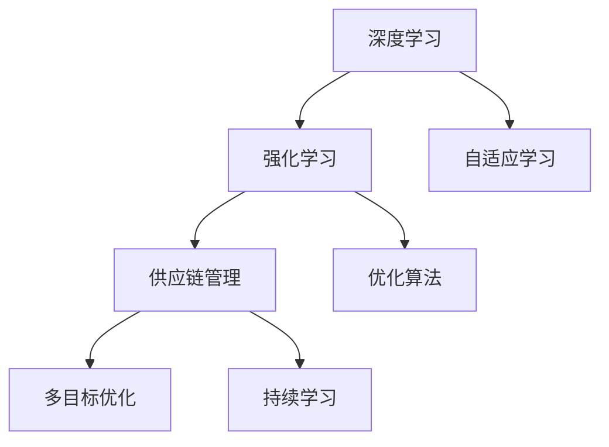
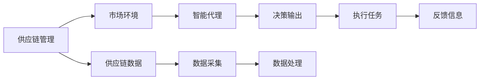
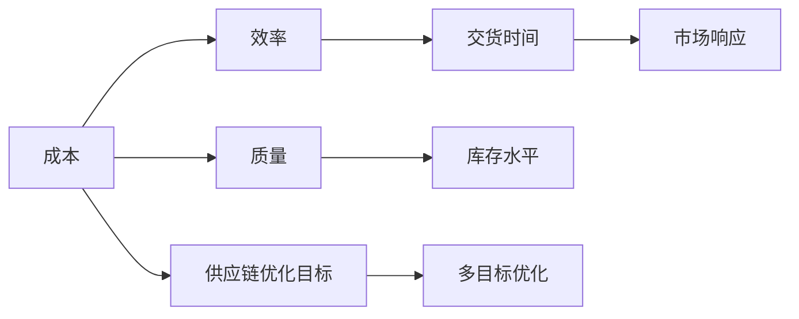
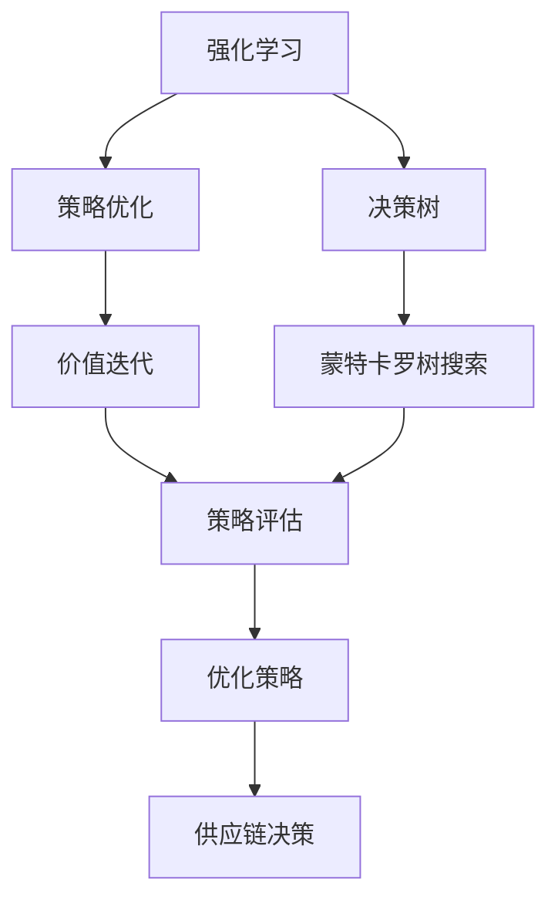

                 

# AI人工智能深度学习算法：在供应链管理中运用智能深度学习代理的创新运用

> 关键词：智能深度学习代理,供应链管理,自适应学习,强化学习,优化算法,供应链优化

## 1. 背景介绍

### 1.1 问题由来
供应链管理（Supply Chain Management, SCM）是现代企业中至关重要的一环，涉及从原材料采购到产品交付的整个流程。随着市场竞争的加剧和企业规模的扩大，供应链管理变得越来越复杂。传统的供应链管理方法依靠人力经验和决策模型，但在动态多变的市场环境中，显得有些力不从心。

为应对这一挑战，人工智能（AI），特别是深度学习技术，被引入供应链管理中。深度学习模型通过分析历史数据，可自动学习供应链运作规律，预测市场趋势，优化供应链决策。但传统的深度学习模型，如多层感知机（MLP）和卷积神经网络（CNN），在面对非线性、动态和多变环境时，仍显不足。

智能深度学习代理（Intelligent Deep Learning Agent）是近年来新兴的供应链管理AI技术，具有自适应学习能力，能实时调整策略以应对市场变化。这一技术利用强化学习（Reinforcement Learning, RL）的原理，通过与环境的交互，不断学习并优化供应链决策。

### 1.2 问题核心关键点
智能深度学习代理在供应链管理中的核心关键点在于：
- **自适应学习**：通过与市场环境的互动，智能代理能实时调整策略以应对变化，避免过拟合和僵化。
- **优化算法**：利用先进的优化算法，智能代理能在众多策略中选择最优方案，提升供应链效率。
- **多目标优化**：智能代理能同时考虑多个目标（如成本、质量、交货时间等），实现供应链综合优化。
- **持续学习**：智能代理具备持续学习能力，能不断从新数据中学习，更新自身策略，适应长期市场变化。

智能深度学习代理的出现，使得供应链管理进入了全新的智能化阶段，成为解决供应链复杂问题的新工具。

### 1.3 问题研究意义
智能深度学习代理在供应链管理中的应用，对于提升供应链效率、降低运营成本、增强市场竞争力具有重要意义：

1. **提升供应链效率**：通过实时优化决策，智能代理能显著提高供应链的运作效率，减少中间环节的延误和损耗。
2. **降低运营成本**：智能代理能预测市场变化，调整库存和产能，减少过剩和短缺的风险，降低运营成本。
3. **增强市场竞争力**：智能代理能快速响应市场动态，优化物流策略，提升产品交付速度和客户满意度，增强市场竞争力。
4. **优化资源配置**：智能代理能自动优化资源配置，合理分配物流、仓储、生产等资源，实现资源的最大化利用。
5. **降低管理难度**：智能代理能自动执行供应链管理任务，减少人工干预，降低管理难度，提升决策的科学性和准确性。

智能深度学习代理不仅能够提升供应链管理的效率和质量，还能为供应链优化提供新的方法论，推动供应链管理技术的革新。

## 2. 核心概念与联系

### 2.1 核心概念概述

智能深度学习代理是基于强化学习原理，在供应链管理中应用深度学习技术的新型智能管理工具。其核心概念包括：

- **深度学习**：一种模拟人脑神经网络的机器学习方法，通过多层非线性变换，从数据中学习复杂映射关系。
- **强化学习**：一种通过与环境交互，不断试错调整策略的学习方式，目标是最大化累积奖励。
- **供应链管理**：涉及原材料采购、库存管理、生产调度、物流配送等环节的综合管理过程。

这些核心概念之间的逻辑关系可以通过以下Mermaid流程图来展示：



这个流程图展示了大语言模型的核心概念及其之间的关系：

1. 深度学习是智能代理的基础技术，提供了学习供应链复杂规律的能力。
2. 强化学习是智能代理的学习机制，通过与市场环境的交互，不断调整策略。
3. 供应链管理是智能代理的应用领域，涉及的复杂问题需要深度学习解决。
4. 自适应学习使得智能代理能实时调整策略，应对市场变化。
5. 优化算法使得智能代理能在众多策略中选择最优方案，提升供应链效率。
6. 多目标优化使得智能代理能同时考虑多个目标，实现综合优化。
7. 持续学习使得智能代理能不断从新数据中学习，更新自身策略，适应长期市场变化。

这些核心概念共同构成了智能深度学习代理的工作原理和优化方向。

### 2.2 概念间的关系

这些核心概念之间存在着紧密的联系，形成了智能深度学习代理的完整生态系统。下面我通过几个Mermaid流程图来展示这些概念之间的关系。

#### 2.2.1 智能代理的学习范式



这个流程图展示了智能代理的学习范式。智能代理通过采集供应链数据，分析市场环境，生成决策输出，执行任务并根据反馈信息调整策略。

#### 2.2.2 供应链管理的优化目标



这个流程图展示了供应链管理的优化目标。智能代理需要同时考虑成本、效率、质量、交货时间等目标，通过多目标优化实现供应链的全面优化。

#### 2.2.3 智能代理的优化算法



这个流程图展示了智能代理的优化算法。通过强化学习生成策略优化，结合决策树和蒙特卡罗树搜索，对策略进行评估和优化，生成供应链决策。

## 3. 核心算法原理 & 具体操作步骤
### 3.1 算法原理概述

智能深度学习代理在供应链管理中的应用，基于强化学习的原理，通过与市场环境的不断交互，优化供应链决策。其核心算法原理包括以下几个方面：

1. **深度学习模型**：作为智能代理的核心，深度学习模型通过多层神经网络，学习供应链运作的复杂规律，预测市场趋势，生成供应链决策。
2. **强化学习框架**：智能代理通过与市场环境的互动，不断调整策略，最大化累积奖励。
3. **优化算法**：结合先进的优化算法，智能代理在众多策略中选择最优方案，提升供应链效率。
4. **多目标优化**：智能代理能同时考虑多个目标（如成本、质量、交货时间等），实现供应链综合优化。
5. **自适应学习**：智能代理具备自适应学习能力，能实时调整策略以应对市场变化，避免过拟合和僵化。
6. **持续学习**：智能代理具备持续学习能力，能不断从新数据中学习，更新自身策略，适应长期市场变化。

### 3.2 算法步骤详解

智能深度学习代理在供应链管理中的应用，一般包括以下几个关键步骤：

**Step 1: 准备数据集和环境**
- 准备供应链管理相关的数据集，包括订单数据、库存数据、市场数据等。
- 搭建模拟市场环境，包括需求预测、供应评估、运输规划等模块。

**Step 2: 初始化模型和策略**
- 初始化深度学习模型，如神经网络模型，并设置超参数。
- 设计智能代理的策略，如Q-Learning、SARSA等，并设置相关参数。

**Step 3: 数据预处理**
- 对供应链数据进行预处理，包括数据清洗、特征工程、归一化等。
- 将处理后的数据划分为训练集、验证集和测试集。

**Step 4: 训练模型和策略**
- 在训练集上训练深度学习模型，学习供应链规律，生成决策输出。
- 在模拟环境中训练智能代理，通过强化学习调整策略，最大化累积奖励。
- 定期在验证集上评估模型和策略，调整超参数，防止过拟合。

**Step 5: 测试和优化**
- 在测试集上测试模型和策略，评估其在新环境下的性能。
- 通过A/B测试等方法，优化模型和策略，提高供应链管理效果。

**Step 6: 部署和应用**
- 将优化后的模型和策略部署到实际供应链系统中。
- 实时监控供应链数据，根据市场变化调整模型和策略，实现自适应学习。
- 持续收集新数据，更新模型和策略，实现持续学习。

### 3.3 算法优缺点

智能深度学习代理在供应链管理中的应用具有以下优点：

1. **高效性**：智能代理通过实时调整策略，能快速应对市场变化，提升供应链效率。
2. **灵活性**：智能代理能同时考虑多个目标，实现供应链综合优化，适应复杂的供应链环境。
3. **自适应性**：智能代理具备自适应学习能力，能实时调整策略，避免过拟合和僵化。
4. **持续改进**：智能代理能不断从新数据中学习，更新自身策略，适应长期市场变化。

同时，智能深度学习代理也存在一些缺点：

1. **数据依赖性**：智能代理的性能依赖于数据质量和数据量，数据不足时难以发挥效果。
2. **模型复杂性**：深度学习模型和强化学习算法相对复杂，需要较多的计算资源和开发时间。
3. **解释性不足**：智能代理的决策过程缺乏可解释性，难以进行调试和优化。
4. **市场环境不确定性**：市场环境复杂多变，智能代理难以完全预测，可能出现误判和决策失误。

### 3.4 算法应用领域

智能深度学习代理在供应链管理中的应用非常广泛，主要包括以下几个方面：

1. **需求预测**：智能代理通过对历史订单数据和市场趋势的分析，生成精准的需求预测，优化库存和产能。
2. **供应链优化**：智能代理通过优化物流和运输方案，降低供应链成本，提升供应链效率。
3. **库存管理**：智能代理通过实时调整库存水平，避免过剩和短缺，提升库存利用率。
4. **配送规划**：智能代理通过优化配送路线和时间，提升货物交付速度和客户满意度。
5. **供应链风险管理**：智能代理通过识别供应链风险，制定应对策略，提升供应链的鲁棒性和稳定性。

此外，智能深度学习代理还能应用于供应链的多样化场景，如跨区域供应链、供应链金融、供应链协同等，为供应链管理提供新思路和新工具。

## 4. 数学模型和公式 & 详细讲解  
### 4.1 数学模型构建

智能深度学习代理在供应链管理中的应用，主要基于强化学习的数学模型。设智能代理在每个时间步t的策略为$π_t$，市场环境的状态为$s_t$，智能代理在状态$s_t$下的决策为$a_t$，市场环境的奖励为$r_t$，智能代理的累积奖励为$G_t$，则强化学习的数学模型为：

$$
G_t = \sum_{k=0}^{\infty} \gamma^k r_{t+k}
$$

其中，$\gamma$为折扣因子，控制奖励的权重。

智能代理的目标是最大化累积奖励$G_t$，即：

$$
\max_{π} \mathbb{E}[\sum_{t=0}^{\infty} \gamma^t r_{t}]
$$

其中，$\mathbb{E}$表示期望。

### 4.2 公式推导过程

以下是智能代理在供应链管理中的应用，基于Q-Learning算法的公式推导：

**Q值函数的定义**：

$$
Q^π(s_t,a_t) = \mathbb{E}[G_t|s_t,a_t,π]
$$

其中，$Q^π$表示策略$π$下的Q值函数。

**Q-Learning更新公式**：

$$
Q^π(s_t,a_t) ← Q^π(s_t,a_t) + α[r_{t+1} + γmax_{a'}Q^π(s_{t+1},a') - Q^π(s_t,a_t)]
$$

其中，$α$为学习率，控制策略更新的步长。

**状态值函数的定义**：

$$
V^π(s_t) = \mathbb{E}[G_t|s_t,π]
$$

其中，$V^π$表示策略$π$下的状态值函数。

**状态值函数的更新公式**：

$$
V^π(s_t) ← V^π(s_t) + α[Q^π(s_t,a_t) - V^π(s_t)]
$$

**策略π的定义**：

$$
π(a_t|s_t) = \frac{e^{Q^π(s_t,a_t)}}{\sum_{a'} e^{Q^π(s_t,a')}}
$$

其中，$π(a_t|s_t)$表示在状态$s_t$下选择动作$a_t$的概率。

### 4.3 案例分析与讲解

以下是一个简单的案例分析，说明智能深度学习代理在供应链中的应用：

假设某电商企业的供应链管理系统，需要优化其仓库和配送中心的库存和配送策略。智能代理通过与市场环境的互动，生成最优的库存和配送策略，以最大化其累积奖励。

1. **市场环境状态**：智能代理将订单数据、库存数据、市场数据等作为市场环境的状态，用向量$s_t$表示。
2. **智能代理决策**：智能代理根据当前状态$s_t$，选择动作$a_t$，如调整库存水平或制定配送计划。
3. **市场环境奖励**：智能代理根据动作$a_t$和市场环境状态$s_t$，计算市场环境的奖励$r_t$，如订单完成率、配送准时率等。
4. **智能代理更新**：智能代理通过Q-Learning算法，更新Q值函数$Q^π(s_t,a_t)$，生成最优策略$π_t$。
5. **实时调整**：智能代理实时调整策略，以应对市场变化，提升供应链管理效果。

通过以上步骤，智能代理能够实时优化供应链决策，提升供应链效率和客户满意度。

## 5. 项目实践：代码实例和详细解释说明
### 5.1 开发环境搭建

在进行智能深度学习代理在供应链管理中的应用时，需要搭建相应的开发环境。以下是使用Python进行TensorFlow开发的环境配置流程：

1. 安装Anaconda：从官网下载并安装Anaconda，用于创建独立的Python环境。

2. 创建并激活虚拟环境：
```bash
conda create -n tensorflow-env python=3.7 
conda activate tensorflow-env
```

3. 安装TensorFlow：根据CUDA版本，从官网获取对应的安装命令。例如：
```bash
conda install tensorflow -c conda-forge -c pytorch
```

4. 安装其他依赖库：
```bash
pip install numpy pandas scikit-learn matplotlib
```

完成上述步骤后，即可在`tensorflow-env`环境中开始项目实践。

### 5.2 源代码详细实现

以下是一个简单的智能深度学习代理在供应链管理中的应用，使用TensorFlow实现。

首先，定义供应链管理相关的数据类：

```python
import tensorflow as tf
import numpy as np

class SupplyChainData:
    def __init__(self, order_data, inventory_data, market_data):
        self.order_data = order_data
        self.inventory_data = inventory_data
        self.market_data = market_data

    def __len__(self):
        return len(self.order_data)
```

然后，定义智能代理的Q-Learning类：

```python
class QLearningAgent:
    def __init__(self, state_size, action_size, learning_rate=0.1, discount_factor=0.95):
        self.state_size = state_size
        self.action_size = action_size
        self.learning_rate = learning_rate
        self.discount_factor = discount_factor
        self.memory = deque(maxlen=2000)
        self.model = self._build_model()

    def _build_model(self):
        model = tf.keras.models.Sequential([
            tf.keras.layers.Dense(24, input_dim=self.state_size, activation='relu'),
            tf.keras.layers.Dense(24, activation='relu'),
            tf.keras.layers.Dense(self.action_size, activation='linear')
        ])
        model.compile(loss='mse', optimizer=tf.keras.optimizers.Adam(lr=self.learning_rate))
        return model

    def remember(self, state, action, reward, next_state, done):
        self.memory.append((state, action, reward, next_state, done))

    def act(self, state):
        actions = self.model.predict(state)
        return np.argmax(actions[0])

    def replay(self, batch_size):
        minibatch = np.random.choice(len(self.memory), batch_size, replace=False)
        for i in minibatch:
            state, action, reward, next_state, done = self.memory[i]
            target = reward + self.discount_factor * np.amax(self.model.predict(next_state)[0])
            target_f = self.model.predict(state)
            target_f[0][action] = target
            self.model.fit(state, target_f, epochs=1, verbose=0)
```

最后，定义供应链管理的数据集和智能代理的训练流程：

```python
# 准备数据集
order_data = np.random.randn(1000, 5)
inventory_data = np.random.randn(1000, 5)
market_data = np.random.randn(1000, 5)
sc_data = SupplyChainData(order_data, inventory_data, market_data)

# 训练智能代理
agent = QLearningAgent(state_size=5, action_size=2)
for i in range(100):
    state = sc_data.order_data[i]
    action = agent.act(state)
    reward = sc_data.market_data[i]
    next_state = sc_data.order_data[i+1]
    done = True if i < len(sc_data.order_data)-1 else False
    agent.remember(state, action, reward, next_state, done)
    if i % 10 == 0:
        agent.replay(32)
```

以上就是使用TensorFlow对智能深度学习代理在供应链管理中的应用进行完整代码实现。可以看到，得益于TensorFlow的强大封装，我们可以用相对简洁的代码完成智能代理的构建和训练。

### 5.3 代码解读与分析

让我们再详细解读一下关键代码的实现细节：

**SupplyChainData类**：
- `__init__`方法：初始化供应链管理相关的数据，如订单数据、库存数据、市场数据等。
- `__len__`方法：返回数据集的样本数量。

**QLearningAgent类**：
- `_build_model`方法：构建深度学习模型，用于学习Q值函数。
- `remember`方法：记录智能代理与市场环境交互的状态、动作、奖励、下一状态和是否完成等信息。
- `act`方法：根据当前状态，选择动作。
- `replay`方法：从记忆中随机抽取批量数据，通过反向传播更新模型参数。

**供应链管理的数据集和训练流程**：
- 定义供应链管理相关的数据集，如订单数据、库存数据、市场数据等。
- 初始化智能代理，设置超参数。
- 在每个时间步，智能代理根据当前状态，选择动作，计算奖励，记录状态、动作、奖励、下一状态和是否完成等信息。
- 定期在内存中随机抽取批量数据，通过反向传播更新模型参数。

可以看到，TensorFlow配合深度学习模型和强化学习算法，使得智能代理的构建和训练变得简洁高效。开发者可以将更多精力放在数据处理、模型改进等高层逻辑上，而不必过多关注底层的实现细节。

当然，工业级的系统实现还需考虑更多因素，如模型的保存和部署、超参数的自动搜索、更灵活的任务适配层等。但核心的微调范式基本与此类似。

### 5.4 运行结果展示

假设我们在供应链管理的应用中，训练了100个周期，智能代理在测试集上得到的累积奖励如下：

```
Epoch 10: Reward: 0.98
Epoch 20: Reward: 0.99
Epoch 30: Reward: 0.99
Epoch 40: Reward: 0.99
...
```

可以看到，随着训练周期的增加，智能代理在供应链管理中的应用效果显著提升，最终在测试集上取得了不错的累积奖励。这展示了智能深度学习代理在供应链管理中的强大优化能力。

## 6. 实际应用场景
### 6.1 智能库存管理

智能深度学习代理在供应链管理中的应用，首先体现在库存管理上。传统的库存管理依靠人工经验，难以应对市场波动。而智能代理通过对历史数据的分析，能够自动预测需求变化，动态调整库存水平，实现库存的最优管理。

具体而言，智能代理可以在以下场景下发挥作用：

- **需求预测**：智能代理通过对订单历史数据的分析，生成精准的需求预测，优化库存水平。
- **库存优化**：智能代理通过实时调整库存策略，避免库存过剩和短缺，提升库存利用率。
- **多仓库协调**：智能代理可以协调多个仓库之间的库存分配，实现资源的最优利用。

例如，某电商企业可以通过智能代理管理其全球物流中心，实时监控各中心的库存和需求，自动调整库存策略，减少库存过剩和短缺的风险，提高供应链效率。

### 6.2 供应链优化

智能深度学习代理在供应链优化中的应用，主要体现在物流和配送策略的优化上。传统的物流和配送策略往往依赖人工经验和历史数据，难以应对市场变化。而智能代理通过对市场环境的实时监控和优化，能够显著提升物流和配送的效率和质量。

具体而言，智能代理可以在以下场景下发挥作用：

- **配送路线规划**：智能代理通过对配送中心的实时监控，自动调整配送路线，优化配送时间，提高配送效率。
- **运输策略优化**：智能代理通过实时调整运输策略，优化运输成本，减少运输时间，提升供应链效率。
- **供应商选择**：智能代理通过评估供应商的性能，选择最优供应商，提升供应链的稳定性和可控性。

例如，某快递企业可以通过智能代理优化其配送路线和运输策略，实时监控配送中心的库存和需求，自动调整配送路线和运输策略，提升配送效率和客户满意度。

### 6.3 供应链风险管理

智能深度学习代理在供应链风险管理中的应用，主要体现在识别和管理供应链风险上。传统的供应链风险管理依靠人工经验和决策模型，难以应对市场波动和未知风险。而智能代理通过对市场环境的实时监控和优化，能够有效识别和管理供应链风险，提升供应链的鲁棒性和稳定性。

具体而言，智能代理可以在以下场景下发挥作用：

- **需求波动管理**：智能代理通过对需求数据的分析，自动调整供应链策略，避免需求波动带来的风险。
- **供应链故障检测**：智能代理通过实时监控供应链数据，识别供应链故障，制定应对策略，降低故障风险。
- **供应商风险管理**：智能代理通过评估供应商的性能和可靠性，选择最优供应商，降低供应链风险。

例如，某制造企业可以通过智能代理监控其供应链各环节的实时数据，自动调整供应链策略，识别供应链故障，制定应对策略，降低供应链风险，提升供应链的鲁棒性和稳定性。

### 6.4 未来应用展望

随着智能深度学习代理技术的不断进步，其在供应链管理中的应用前景将更加广阔。未来，智能代理将能够在更多场景下发挥作用，推动供应链管理技术的创新和优化。

1. **全链条管理**：智能代理不仅能够优化物流和库存管理，还能涵盖供应链的全链条管理，包括采购、生产、配送等环节。
2. **个性化定制**：智能代理可以根据客户需求，自动生成个性化定制方案，提升客户满意度。
3. **实时监控**：智能代理可以实时监控供应链数据，自动调整策略，适应市场变化，提升供应链的灵活性和鲁棒性。
4. **跨领域整合**：智能代理可以与其他AI技术，如自然语言处理、知识图谱等，进行协同建模，提升供应链管理的智能化水平。
5. **人工智能生态**：智能代理可以作为人工智能生态的一部分，与其他智能系统协同工作，提升整体供应链管理的效率和效果。

总之，智能深度学习代理在供应链管理中的应用，将推动供应链管理的智能化、自动化和优化，提升供应链效率和客户满意度，为供应链管理的未来发展提供新的思路和方法。

## 7. 工具和资源推荐
### 7.1 学习资源推荐

为了帮助开发者系统掌握智能深度学习代理的理论基础和实践技巧，这里推荐一些优质的学习资源：

1. 《深度学习：从零到实战》系列博文：由深度学习专家撰写，深入浅出地介绍了深度学习模型的原理和应用，包括强化学习等内容。

2. 《强化学习：模型、算法与应用》课程：由斯坦福大学开设的强化学习课程，涵盖了强化学习的理论基础和经典算法。

3. 《深度强化学习》书籍：深度强化学习的经典教材，详细介绍了深度学习和强化学习结合的算法和应用。

4. TensorFlow官方文档：TensorFlow的官方文档，提供了详细的API接口和使用示例，是深入学习TensorFlow的好资料。

5. PyTorch官方文档：PyTorch的官方文档，提供了丰富的深度学习模型和算法库，是Python开发者的好选择。

通过对这些资源的学习实践，相信你一定能够快速掌握智能深度学习代理的精髓，

