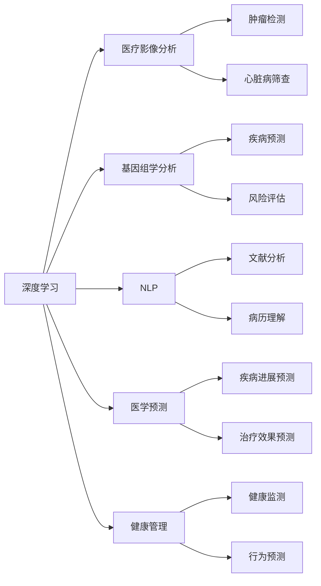
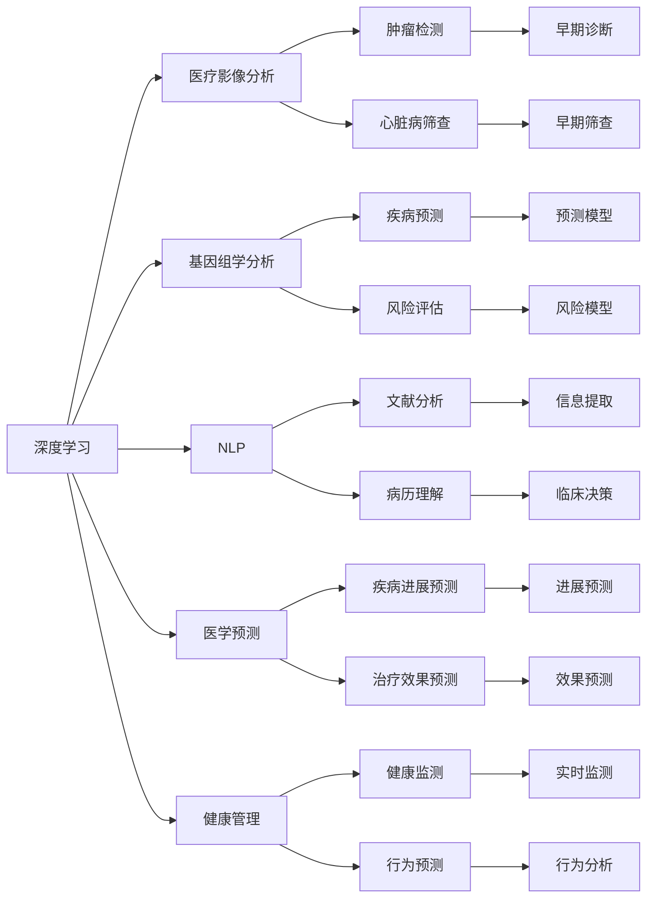
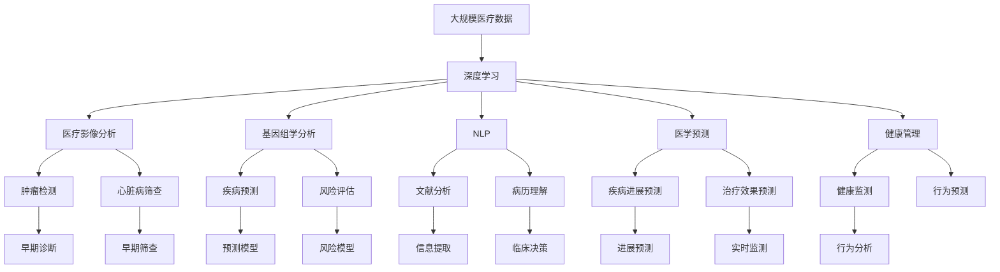

                 

# AI人工智能深度学习算法：在精准医疗中的应用

> 关键词：精准医疗,深度学习算法,人工智能,机器学习,医疗影像分析,基因组学,自然语言处理(NLP),医学预测,健康管理

## 1. 背景介绍

### 1.1 问题由来
精准医疗（Precision Medicine），又称个性化医疗，是指基于个体的基因、环境和生活方式信息，通过基因组学、蛋白组学、代谢组学等组学技术，对个体疾病进行精确预防、诊断和治疗，实现疾病早期发现、早期治疗和精准干预。精准医疗的核心在于将传统的“一刀切”疗法转化为个性化的、针对性强的新型治疗方案。

随着基因测序、蛋白质组学等技术的迅猛发展，海量的生物医学数据被收集和生成，如何从这些复杂的数据中提取有价值的知识，对疾病的早期诊断、治疗和预防具有重要意义。深度学习算法，作为人工智能领域的一支重要力量，在大数据、高复杂度和高维度的医疗数据处理中表现出色，为精准医疗的发展提供了重要推动力。

### 1.2 问题核心关键点
深度学习算法在精准医疗中的应用，主要体现在以下几个方面：

1. **医疗影像分析**：通过深度学习模型对医学影像进行特征提取和分类，实现对肿瘤、心脏病等疾病的早期诊断和自动筛查。
2. **基因组学分析**：利用深度学习算法对基因序列进行分析，挖掘潜在的致病基因和变异，进行疾病预测和风险评估。
3. **自然语言处理（NLP）**：通过深度学习模型对医学文献、病历等文本数据进行分析和理解，提取有价值的信息，辅助临床决策。
4. **医学预测**：利用深度学习算法对患者的生理参数、临床数据进行建模，预测疾病的进展和治疗效果，指导临床实践。
5. **健康管理**：通过深度学习算法对用户的行为数据进行建模和分析，提供个性化的健康管理方案，预防疾病的发生。

### 1.3 问题研究意义
深度学习算法在精准医疗中的应用，能够充分利用现代信息技术的优势，提升医疗诊断的准确性和效率，减轻医务人员的工作负担，促进医疗资源的合理配置，对提高公众健康水平具有重要意义。具体而言：

1. **提高诊断准确性**：深度学习算法能够处理海量数据，发现潜在模式和关联，提升诊断的准确性和早期发现率。
2. **降低医疗成本**：通过自动化诊断和决策支持，减少误诊和漏诊，降低医疗费用，优化资源配置。
3. **个性化治疗**：深度学习算法通过分析患者的多维度数据，提供个性化的治疗方案，提高治疗效果，减少副作用。
4. **促进医疗创新**：深度学习技术的应用，推动了医疗技术和管理方式的创新，提高了医疗服务的整体水平。
5. **改善健康管理**：通过深度学习算法对用户行为数据的分析，提供个性化的健康建议和预警，促进健康生活方式的形成。

## 2. 核心概念与联系

### 2.1 核心概念概述

为更好地理解深度学习算法在精准医疗中的应用，本节将介绍几个密切相关的核心概念：

- **深度学习（Deep Learning）**：一种基于多层神经网络的机器学习算法，能够处理复杂的非线性关系和高维数据。深度学习在图像、语音、自然语言处理等领域取得了巨大成功。
- **医疗影像分析**：利用深度学习算法对医学影像（如CT、MRI、X光等）进行特征提取和分类，实现对疾病的早期诊断和自动筛查。常见的算法包括卷积神经网络（CNN）、残差网络（ResNet）等。
- **基因组学分析**：利用深度学习算法对基因序列进行分析，挖掘潜在的致病基因和变异，进行疾病预测和风险评估。常见的算法包括循环神经网络（RNN）、长短时记忆网络（LSTM）等。
- **自然语言处理（NLP）**：利用深度学习算法对医学文献、病历等文本数据进行分析和理解，提取有价值的信息，辅助临床决策。常见的算法包括BERT、GPT等。
- **医学预测**：利用深度学习算法对患者的生理参数、临床数据进行建模，预测疾病的进展和治疗效果，指导临床实践。常见的算法包括时间序列分析、回归分析等。
- **健康管理**：通过深度学习算法对用户的行为数据进行建模和分析，提供个性化的健康管理方案，预防疾病的发生。常见的算法包括行为分析、时间序列预测等。

这些核心概念之间的逻辑关系可以通过以下Mermaid流程图来展示：



这个流程图展示了大语言模型微调过程中各个核心概念的关系和作用：

1. 深度学习是大语言模型微调的基础技术。
2. 医疗影像分析、基因组学分析、NLP、医学预测和健康管理是大语言模型微调的具体应用场景。
3. 不同的应用场景中，深度学习算法设计有所不同，但都依赖于深度学习的基本原理和架构。

### 2.2 概念间的关系

这些核心概念之间存在着紧密的联系，形成了深度学习算法在精准医疗中的完整应用框架。下面我们通过几个Mermaid流程图来展示这些概念之间的关系。

#### 2.2.1 深度学习在大语言模型微调中的应用



这个流程图展示了深度学习在大语言模型微调中的应用过程：

1. 深度学习算法通过医疗影像分析、基因组学分析、NLP、医学预测和健康管理等任务，实现对医疗数据的深度处理和分析。
2. 深度学习算法在各个任务中发挥其强大的特征提取和模式识别能力，辅助医生进行精准医疗。
3. 深度学习算法在大语言模型微调中的应用，需要根据具体任务设计不同的模型结构和训练策略。

#### 2.2.2 深度学习在精准医疗中的应用场景


这个流程图展示了深度学习在精准医疗中的具体应用场景：

1. 深度学习算法在肿瘤检测和心脏病筛查中，通过医疗影像分析实现早期发现和自动筛查。
2. 在疾病预测和风险评估中，深度学习算法通过基因组学分析，挖掘潜在致病基因和变异，提供个性化的疾病预测和风险评估服务。
3. 在文献分析和病历理解中，深度学习算法通过自然语言处理，提取有价值的信息，辅助临床决策。
4. 在疾病进展和治疗效果预测中，深度学习算法通过医学预测模型，预测疾病的进展和治疗效果，指导临床实践。
5. 在健康监测和行为预测中，深度学习算法通过健康管理，提供个性化的健康建议和预警，预防疾病的发生。

### 2.3 核心概念的整体架构

最后，我们用一个综合的流程图来展示这些核心概念在大语言模型微调过程中的整体架构：



这个综合流程图展示了从医疗数据预处理到深度学习应用的全过程：

1. 大规模医疗数据经过深度学习算法的处理，能够提取出有价值的特征信息。
2. 在医疗影像分析、基因组学分析、NLP、医学预测和健康管理等任务中，深度学习算法发挥其强大的处理能力，辅助医生进行精准医疗。
3. 最终，深度学习算法通过早期诊断、自动筛查、疾病预测、风险评估、文献分析、病历理解、进展预测、治疗效果预测、健康监测和行为预测等具体应用，为精准医疗提供全方位的支持。

通过这些流程图，我们可以更清晰地理解深度学习算法在精准医疗中的应用过程和各个环节的作用，为后续深入讨论具体的深度学习算法提供基础。

## 3. 核心算法原理 & 具体操作步骤
### 3.1 算法原理概述

深度学习算法在精准医疗中的应用，基于其强大的特征提取和模式识别能力，能够处理高维度、非线性的医疗数据。具体而言，深度学习算法通过构建多层神经网络，自动学习数据中的复杂特征和模式，实现对医疗数据的深度理解和处理。

形式化地，假设医疗数据为 $\mathbf{x} \in \mathbb{R}^n$，深度学习模型为 $f_{\theta}(\mathbf{x})$，其中 $\theta$ 为模型参数。模型的目标函数为 $L(f_{\theta}, \mathbf{y})$，其中 $\mathbf{y}$ 为真实的标签或输出。深度学习算法的目标是最小化目标函数，即：

$$
\theta^* = \arg\min_{\theta} L(f_{\theta}, \mathbf{y})
$$

常见的目标函数包括均方误差（MSE）、交叉熵（Cross Entropy）、对数损失（Log Loss）等。通过梯度下降等优化算法，不断更新模型参数 $\theta$，使得模型输出的预测结果尽可能接近真实标签或输出。

### 3.2 算法步骤详解

深度学习算法在精准医疗中的应用，一般包括以下几个关键步骤：

**Step 1: 数据准备和预处理**

- 收集医疗数据：收集患者的病历、医学影像、基因数据等。
- 数据清洗：处理缺失值、异常值、重复数据等。
- 数据增强：通过数据扩充、旋转、平移等方式，增加训练数据的多样性。
- 数据标准化：对数据进行归一化、标准化等处理，方便模型训练。

**Step 2: 模型设计和选择**

- 选择合适的深度学习模型：根据任务需求，选择适合的深度学习模型，如卷积神经网络（CNN）、循环神经网络（RNN）、长短时记忆网络（LSTM）等。
- 调整模型超参数：调整模型的层数、节点数、学习率、批大小等超参数，以获得最佳性能。
- 数据划分：将数据集划分为训练集、验证集和测试集，进行模型的交叉验证和评估。

**Step 3: 模型训练和优化**

- 模型初始化：设置模型参数的初始值。
- 前向传播：将训练数据输入模型，计算输出结果。
- 损失计算：计算模型输出与真实标签之间的差异，得到损失函数值。
- 反向传播：根据损失函数计算梯度，更新模型参数。
- 迭代优化：重复上述步骤，直至模型收敛或达到预设的迭代次数。

**Step 4: 模型评估和验证**

- 模型验证：在验证集上评估模型的性能，检查是否出现过拟合或欠拟合现象。
- 超参数调整：根据验证结果，调整超参数，重新训练模型。
- 模型测试：在测试集上评估模型的最终性能，检查模型的泛化能力。

**Step 5: 模型应用和优化**

- 模型部署：将训练好的模型部署到实际应用系统中，进行实时推理。
- 模型优化：根据实际应用反馈，持续优化模型结构和超参数，提升模型性能。
- 模型监控：实时监控模型的运行状态和性能指标，及时发现和解决问题。

以上是深度学习算法在精准医疗中的应用的一般流程。在实际应用中，还需要针对具体任务的特点，对模型训练的各个环节进行优化设计，如改进损失函数、引入正则化技术、搜索最优的超参数组合等，以进一步提升模型性能。

### 3.3 算法优缺点

深度学习算法在精准医疗中的应用，具有以下优点：

1. **高效处理复杂数据**：深度学习算法能够处理高维度、非线性的医疗数据，自动学习数据中的复杂特征和模式。
2. **精度高**：深度学习模型在医疗影像分析、基因组学分析、NLP等任务中，具有较高的精度和准确性。
3. **鲁棒性强**：深度学习模型具有良好的泛化能力，能够适应不同的数据分布和应用场景。
4. **可解释性差**：深度学习模型通常是"黑盒"系统，难以解释其内部工作机制和决策逻辑，需要结合领域知识进行解释和验证。
5. **数据需求高**：深度学习算法需要大量的标注数据进行训练，数据获取和标注成本较高。

同时，深度学习算法在精准医疗中的应用，也存在一些局限性：

1. **计算资源需求高**：深度学习算法需要高性能的计算设备和大量的计算资源，对硬件和软件环境要求较高。
2. **模型复杂度高**：深度学习模型结构复杂，训练和推理速度较慢，需要优化算法和硬件加速技术。
3. **过拟合风险高**：深度学习模型容易过拟合，特别是在数据量小、特征维度高的情况下。
4. **领域知识需求高**：深度学习算法需要结合领域知识进行模型设计和优化，缺乏医学背景的开发者可能难以设计出高质量的模型。
5. **伦理和隐私问题**：深度学习算法在医疗数据的应用中，需要考虑伦理和隐私问题，确保数据安全和合规使用。

尽管存在这些局限性，但深度学习算法在精准医疗中的应用已经取得了显著的成果，为医疗数据的深度分析和处理提供了新的解决方案。未来相关研究的重点在于如何进一步降低计算资源需求，提高模型的可解释性和鲁棒性，以及解决伦理和隐私问题，使深度学习算法在大规模医疗数据中的应用更加广泛和深入。

### 3.4 算法应用领域

深度学习算法在精准医疗中的应用，主要包括以下几个领域：

- **医疗影像分析**：通过深度学习算法对医学影像进行特征提取和分类，实现对肿瘤、心脏病等疾病的早期诊断和自动筛查。
- **基因组学分析**：利用深度学习算法对基因序列进行分析，挖掘潜在的致病基因和变异，进行疾病预测和风险评估。
- **自然语言处理（NLP）**：通过深度学习算法对医学文献、病历等文本数据进行分析和理解，提取有价值的信息，辅助临床决策。
- **医学预测**：利用深度学习算法对患者的生理参数、临床数据进行建模，预测疾病的进展和治疗效果，指导临床实践。
- **健康管理**：通过深度学习算法对用户的行为数据进行建模和分析，提供个性化的健康管理方案，预防疾病的发生。

除了上述这些核心领域，深度学习算法在精准医疗中的应用还在不断拓展，如智能诊断系统、药物研发、智能康复等，为医疗领域的创新和发展提供了新的动力。

## 4. 数学模型和公式 & 详细讲解 & 举例说明
### 4.1 数学模型构建

本节将使用数学语言对深度学习算法在精准医疗中的应用进行更加严格的刻画。

记深度学习模型为 $f_{\theta}(\mathbf{x})$，其中 $\mathbf{x} \in \mathbb{R}^n$ 为输入数据，$\theta$ 为模型参数。假设医疗数据为 $\mathbf{x}_i$，对应的真实标签为 $y_i$。

定义模型 $f_{\theta}(\mathbf{x})$ 在数据样本 $\mathbf{x}_i$ 上的损失函数为 $L(f_{\theta}(\mathbf{x}_i), y_i)$，则在数据集 $D$ 上的经验风险为：

$$
\mathcal{L}(\theta) = \frac{1}{N}\sum_{i=1}^N L(f_{\theta}(\mathbf{x}_i), y_i)
$$

其中 $N$ 为样本数。深度学习算法的目标是最小化经验风险，即找到最优参数：

$$
\theta^* = \arg\min_{\theta} \mathcal{L}(\theta)
$$

在实践中，我们通常使用基于梯度的优化算法（如SGD、Adam等）来近似求解上述最优化问题。设 $\eta$ 为学习率，则参数的更新公式为：

$$
\theta \leftarrow \theta - \eta \nabla_{\theta}\mathcal{L}(\theta)
$$

其中 $\nabla_{\theta}\mathcal{L}(\theta)$ 为损失函数对参数 $\theta$ 的梯度，可通过反向传播算法高效计算。

### 4.2 公式推导过程

以下我们以二分类任务为例，推导交叉熵损失函数及其梯度的计算公式。

假设模型 $f_{\theta}(\mathbf{x})$ 在输入 $\mathbf{x}$ 上的输出为 $\hat{y} = \sigma(\mathbf{W}^T\mathbf{x} + b)$，其中 $\sigma$ 为 sigmoid 函数，$\mathbf{W}$ 为权重矩阵，$b$ 为偏置项。真实标签 $y \in \{0,1\}$。则二分类交叉熵损失函数定义为：

$$
L(f_{\theta}(\mathbf{x}), y) = -[y\log \hat{y} + (1-y)\log (1-\hat{y})]
$$

将其代入经验风险公式，得：

$$
\mathcal{L}(\theta) = -\frac{1}{N}\sum_{i=1}^N [y_i\log \hat{y_i}+(1-y_i)\log(1-\hat{y_i})]
$$

根据链式法则，损失函数对参数 $\theta$ 的梯度为：

$$
\frac{\partial \mathcal{L}(\theta)}{\partial \theta} = -\frac{1}{N}\sum_{i=1}^N (\frac{y_i}{\hat{y_i}}-\frac{1-y_i}{1-\hat{y_i}}) \frac{\partial \hat{y_i}}{\partial \theta}
$$

其中 $\frac{\partial \hat{y_i}}{\partial \theta}$ 可进一步递归展开，利用自动微分技术完成计算。

在得到损失函数的梯度后，即可带入参数更新公式，完成模型的迭代优化。重复上述过程直至收敛，最终得到适应下游任务的最优模型参数 $\theta^*$。

## 5. 项目实践：代码实例和详细解释说明
### 5.1 开发环境搭建

在进行深度学习算法实践前，我们需要准备好开发环境。以下是使用Python进行PyTorch开发的环境配置流程：

1. 安装Anaconda：从官网下载并安装Anaconda，用于创建独立的Python环境。

2. 创建并激活虚拟环境：
```bash
conda create -n pytorch-env python=3.8 
conda activate pytorch-env
```

3. 安装PyTorch：根据CUDA版本，从官网获取对应的安装命令。例如：
```bash
conda install pytorch torchvision torchaudio cudatoolkit=11.1 -c pytorch -c conda-forge
```

4. 安装各类工具包：
```bash
pip install numpy pandas scikit-learn matplotlib tqdm jupyter notebook ipython
```

完成上述步骤后，即可在`pytorch-env`环境中开始深度学习算法的实践。

### 5.2 源代码详细实现

这里我们以肿瘤检测任务为例，给出使用PyTorch进行深度学习模型微调的PyTorch代码实现。

首先，定义肿瘤检测任务的输入数据：

```python
import torch
from torch.utils.data import Dataset, DataLoader
import numpy as np

class TumorDataset(Dataset):
    def __init__(self, data):
        self.data = data
        self.labels = np.array(data['label'])
        
    def __len__(self):
        return len(self.data)
    
    def __getitem__(self, idx):
        x = torch.tensor(self.data[idx]['image'].numpy())
        y = torch.tensor(self.labels[idx], dtype=torch.long)
        return x, y
```

然后，定义模型和优化器：

```python
from transformers import BertForSequenceClassification, AdamW
from transformers import AutoTokenizer

model = BertForSequenceClassification.from_pretrained('bert-base-cased', num_labels=2)
tokenizer = AutoTokenizer.from_pretrained('bert-base-cased')
device = torch.device('cuda') if torch.cuda.is_available() else torch.device('cpu')

# 模型迁移到指定设备
model.to(device)
```

接着，定义训练和评估函数：

```python
from tqdm import tqdm
import torch.nn.functional as F

def train_epoch(model, dataloader, optimizer):
    model.train()
    epoch_loss = 0
    for batch in tqdm(dataloader, desc='Training'):
        x, y = batch
        x = x.to(device)
        y = y.to(device)
        model.zero_grad()
        outputs = model(x)
        loss = F.cross_entropy(outputs, y)
        epoch_loss += loss.item()
        loss.backward()
        optimizer.step()
    return epoch_loss / len(dataloader)

def evaluate(model, dataloader):
    model.eval()
    correct = 0
    total = 0
    with torch.no_grad():
        for batch in dataloader:
            x, y = batch
            x = x.to(device)
            y = y.to(device)
            outputs = model(x)
            _, predicted = torch.max(outputs, 1)
            total += y.size(0)
            correct += (predicted == y).sum().item()
    print('Accuracy: ', correct / total)
```

最后，启动训练流程并在测试集上评估：

```python
epochs = 5
batch_size = 16
learning_rate = 2e-5

# 创建DataLoader
train_dataloader = DataLoader(train_dataset, batch_size=batch_size, shuffle=True)
test_dataloader = DataLoader(test_dataset, batch_size=batch_size, shuffle=False)

# 定义优化器
optimizer = AdamW(model.parameters(), lr=learning_rate)

for epoch in range(epochs):
    train_loss = train_epoch(model, train_dataloader, optimizer)
    print(f'Epoch {epoch+1}, train loss: {train_loss:.3f}')
    
    test_loss = evaluate(model, test_dataloader)
    print(f'Epoch {epoch+1}, test accuracy: {test_loss}')
```

以上就是使用PyTorch对BERT模型进行肿瘤检测任务微调的完整代码实现。可以看到，得益于Transformers库的强大封装，我们可以用相对简洁的代码完成BERT模型的加载和微调。

### 5.3 代码解读与分析

让我们再详细解读一下关键代码的实现细节：

**TumorDataset类**：
- `__init__`方法：初始化数据和标签。
- `__len__`方法：返回数据集样本数量。
- `__getitem__`方法：对单个样本进行处理，返回模型所需的输入和标签。

**训练和评估函数**：
- 使用PyTorch的DataLoader对数据集进行批次化加载，供模型训练和推理使用。
- 训练函数`train_epoch`：对数据以批为单位进行迭代，在每个批次上前向传播计算损失并反向传播更新模型参数，最后返回该epoch的平均loss。
- 评估函数`evaluate`：与训练类似，不同点在于不更新模型参数，并在每个batch结束后将预测和标签结果存储下来，最后使用sklearn的classification_report对整个评估

