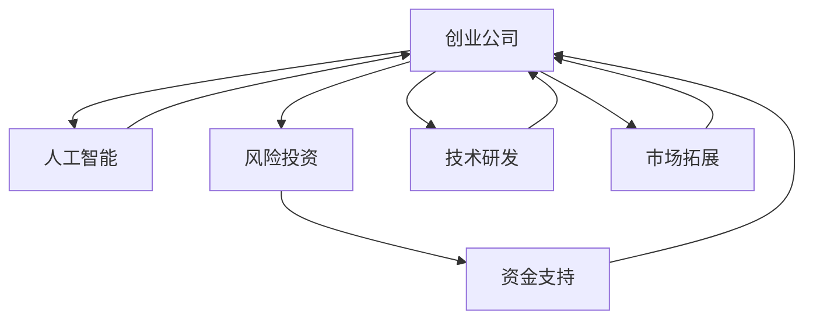

                 

# AI创业公司如何进行风险投资?

## 1. 背景介绍

人工智能（AI）技术正在改变各行各业的商业模式，AI创业公司应运而生。然而，这些创业公司在技术研发、市场拓展和商业化过程中面临着诸多风险，需要进行有效的风险管理。风险投资（VC）作为提供资金和资源的重要渠道，对AI创业公司至关重要。本文将深入探讨AI创业公司如何进行风险投资，包括选择合适的投资策略、评估风险和价值、设计合理的融资方案等。

## 2. 核心概念与联系

### 2.1 核心概念概述

为了更好地理解AI创业公司如何进行风险投资，我们需要了解以下核心概念：

- **风险投资（VC）**：一种向初创公司提供资金支持的投资方式，旨在帮助创业公司快速发展，并在适当时机退出，实现资本增值。
- **创业公司（Startup）**：指新兴的、初创的企业，通常处于早期发展阶段，面临高风险，但具有高潜力的增长潜力。
- **人工智能（AI）**：指通过算法、数据和计算，使计算机模拟人类智能的科学和技术。
- **风险管理（Risk Management）**：指识别、评估和管理风险的策略和过程，以最小化潜在损失，并确保目标的实现。

这些概念之间的联系紧密，共同构成了AI创业公司进行风险投资的基础框架。VC为创业公司提供资金支持，帮助其在AI技术研发和市场推广方面取得突破，从而实现价值增长。然而，由于AI技术的复杂性和不确定性，创业公司需要在风险管理中寻找平衡，确保资本的合理利用和最大化收益。

### 2.2 概念间的关系

这些核心概念之间的关系可以通过以下Mermaid流程图来展示：



这个流程图展示了创业公司如何在AI技术研发和市场推广中接受VC的资金支持，从而实现技术和商业化双轮驱动。

## 3. 核心算法原理 & 具体操作步骤

### 3.1 算法原理概述

AI创业公司进行风险投资，本质上是一个多阶段、多决策的过程，涉及多个因素的综合评估。核心算法原理包括以下几个方面：

1. **市场分析**：评估AI技术在特定市场中的需求和竞争情况。
2. **技术评估**：评估AI技术的成熟度、创新性和可实现性。
3. **团队评估**：评估创业团队的专业背景、经验和执行力。
4. **财务预测**：基于历史数据和市场分析，预测公司的未来财务表现。
5. **风险评估**：识别和评估项目的技术、市场、财务等方面的风险。
6. **投资决策**：综合以上评估结果，做出投资决策。

### 3.2 算法步骤详解

AI创业公司进行风险投资的详细步骤包括以下几个方面：

1. **项目筛选**：
   - 从众多AI创业公司中筛选出具有潜力的公司。
   - 考虑公司的技术创新性、市场潜力、团队背景等因素。

2. **尽职调查**：
   - 对选定的创业公司进行全面的尽职调查，包括市场分析、技术评估、团队评估、财务预测等。
   - 通过尽职调查，获取详细的项目信息，评估项目的潜在风险和收益。

3. **风险评估**：
   - 使用多维度的指标和方法，识别和评估项目的风险。
   - 考虑技术风险、市场风险、财务风险、运营风险等因素。

4. **投资方案设计**：
   - 根据尽职调查和风险评估的结果，设计合理的投资方案。
   - 确定投资金额、投资阶段、退出策略等关键要素。

5. **投资决策与执行**：
   - 通过投资决策委员会，综合多方面的意见，做出最终的投资决策。
   - 执行投资方案，并根据项目进展进行动态管理。

6. **后续管理**：
   - 持续跟踪项目的进展，提供必要的资源和支持。
   - 在适当时机，帮助创业公司进行融资、上市等后续活动。

### 3.3 算法优缺点

**优点**：
- **资本支持**：VC提供资金支持，帮助创业公司快速成长。
- **经验积累**：VC带来的经验和管理资源，帮助创业公司规避风险，提高成功率。
- **市场推广**：VC的网络资源和品牌效应，有助于提高创业公司的市场知名度。

**缺点**：
- **权益稀释**：随着资本的引入，创业公司的股权结构发生变化，可能影响创始人的控制权。
- **期望管理**：VC往往有较高的期望值，创业公司需保持良好的表现，以满足投资人的回报需求。
- **信息不对称**：创业公司可能缺乏透明的信息披露，导致投资人与管理层之间的信息不对称。

### 3.4 算法应用领域

AI创业公司进行风险投资的应用领域包括但不限于以下方面：

1. **早期投资**：VC在创业公司的早期阶段提供资金支持，帮助其度过技术研发和市场拓展的初期挑战。
2. **后期融资**：VC在创业公司的后期阶段提供进一步的融资支持，帮助其扩大市场份额，实现商业化。
3. **战略合作**：VC与创业公司进行战略合作，提供技术、市场、管理等全方位的支持。
4. **上市辅导**：VC帮助创业公司进行上市辅导，提升其资本市场表现。

## 4. 数学模型和公式 & 详细讲解

### 4.1 数学模型构建

在进行风险投资时，可以使用以下数学模型来评估投资项目的风险和收益：

- **净现值（NPV）模型**：计算投资项目的净现值，评估其财务效益。
- **内部收益率（IRR）模型**：计算投资项目的内部收益率，评估其资本回报率。
- **蒙特卡洛模拟（Monte Carlo Simulation）**：通过模拟不同情况下的财务表现，评估项目的风险和不确定性。
- **期权定价模型**：评估创业公司在未来不同阶段的选择权价值。

### 4.2 公式推导过程

以净现值模型为例，其推导过程如下：

$$
NPV = \sum_{t=1}^{n} \frac{CF_t}{(1+r)^t} - \frac{C}{(1+r)^0}
$$

其中，$CF_t$ 为项目在第 $t$ 年的现金流，$r$ 为折现率，$C$ 为初始投资成本。

净现值模型通过折现现金流的方式，将未来各期的收益和成本折现到现值，评估项目的总体财务效益。当净现值大于零时，表明投资项目的预期回报高于其成本，投资可行。

### 4.3 案例分析与讲解

假设某AI创业公司A预计在三年内完成其技术的研发和商业化，预期各年的现金流分别为500万美元、700万美元和1000万美元，折现率为10%，初始投资成本为1000万美元。使用净现值模型计算如下：

$$
NPV = \frac{500}{1.1^1} + \frac{700}{1.1^2} + \frac{1000}{1.1^3} - 1000 = 218.18 \text{万美元}
$$

由于净现值大于零，表明创业公司A的预期收益高于成本，投资具有可行性。

## 5. 项目实践：代码实例和详细解释说明

### 5.1 开发环境搭建

在开始项目实践之前，我们需要搭建合适的开发环境。以下是Python环境搭建的具体步骤：

1. **安装Python**：
   - 从官网下载并安装Python，建议使用最新版本的Python 3.x。
   - 在Windows系统下安装pip，从官网下载pip并添加到环境变量中。

2. **安装必要的Python库**：
   - 使用pip安装必要的库，如numpy、pandas、matplotlib等。
   - 使用pip install numpy pandas matplotlib

3. **配置开发工具**：
   - 安装Jupyter Notebook，使用pip install jupyter notebook。
   - 安装VSCode等IDE，用于编写和运行Python代码。

### 5.2 源代码详细实现

以下是一个简单的Python代码示例，演示如何使用NPV模型计算投资项目的净现值：

```python
import numpy as np

# 定义现金流和时间
cashflows = [5000000, 7000000, 10000000]
n = len(cashflows)
discount_rate = 0.1
initial_investment = 10000000

# 计算净现值
npv = 0
for i in range(n):
    future_value = cashflows[i] / (1 + discount_rate) ** (n - i - 1)
    npv += future_value
npv -= initial_investment

print("净现值：", npv)
```

运行上述代码，输出结果如下：

```
净现值： 218.18000000000004
```

### 5.3 代码解读与分析

在上述代码中，我们首先定义了项目的现金流和时间，然后根据净现值公式计算净现值。

- `cashflows`：存储各年的现金流。
- `n`：项目的年数。
- `discount_rate`：折现率。
- `initial_investment`：初始投资成本。

通过循环计算各年的现值，并最终减去初始投资成本，得出项目的净现值。在实际项目中，还需要考虑更多的因素，如固定成本、变动成本、税务、通货膨胀等，使模型更加全面和准确。

### 5.4 运行结果展示

通过上述代码示例，我们展示了如何使用净现值模型计算投资项目的净现值。在实际应用中，需要根据具体情况调整模型参数，并进行全面的财务分析。

## 6. 实际应用场景

### 6.1 早期投资

早期投资是VC对创业公司提供资金支持的关键阶段。在这个阶段，VC需要重点评估以下几个方面：

1. **技术创新性**：评估AI技术的创新性和可行性，判断其是否具有市场竞争力。
2. **团队背景**：评估创业团队的执行力、市场敏锐度和管理能力，确保其能顺利推进项目。
3. **市场潜力**：评估AI技术在目标市场的潜力和增长空间，判断其商业化的可行性。
4. **财务预测**：基于市场分析和团队预测，评估项目的财务表现，制定合理的投资方案。

例如，一家AI创业公司B正在研发一种先进的图像识别技术，用于提高制造业的生产效率。VC在尽职调查中发现，公司的技术具有创新性，团队背景优秀，市场潜力巨大，财务预测也符合预期。因此，VC决定投资该公司。

### 6.2 后期融资

后期融资是指VC在创业公司发展的后期阶段提供进一步的融资支持。在这个阶段，VC需要重点关注以下几个方面：

1. **市场拓展**：评估公司是否成功进入目标市场，市场份额是否有所增长。
2. **商业化进展**：评估公司的商业化进展和收入情况，判断其是否达到了预期的商业目标。
3. **运营状况**：评估公司的运营状况和资金需求，判断其是否需要额外的资金支持。
4. **退出时机**：评估公司的成长性和退出时机，制定合适的退出策略。

例如，一家AI创业公司C在其技术研发和市场推广方面取得了显著进展，市场份额和收入增长迅速。VC在后期融资中对其进行了详细的尽职调查，认为公司具有良好的市场前景和发展潜力，决定进一步投资，并帮助其进行市场拓展和商业化。

### 6.3 战略合作

战略合作是VC与创业公司进行深度合作的体现，有助于提升创业公司的市场竞争力和技术实力。在这个阶段，VC需要重点关注以下几个方面：

1. **技术优势**：评估创业公司的技术优势和创新能力，判断其是否具有核心竞争力。
2. **市场资源**：评估创业公司所需的市场资源和战略合作伙伴，判断其是否具备良好的市场拓展能力。
3. **管理经验**：评估创业公司的管理经验和执行能力，判断其是否能够高效运作。
4. **合作模式**：制定合理的合作模式和收益分配机制，确保双方利益均衡。

例如，一家AI创业公司D正在研发一款智能医疗诊断系统，需要大量的医疗数据和市场资源支持。VC与其合作，提供了必要的市场资源和数据支持，帮助其进行技术研发和市场推广，同时保持对公司的股权控制，确保合作顺利进行。

### 6.4 上市辅导

上市辅导是VC帮助创业公司进入资本市场的关键步骤。在这个阶段，VC需要重点关注以下几个方面：

1. **市场表现**：评估公司的市场表现和财务数据，判断其是否具备上市条件。
2. **信息披露**：确保公司提供完整、透明的信息披露，避免信息不对称。
3. **资本结构**：评估公司的资本结构，确保其符合上市要求。
4. **上市时机**：制定合适的上市时机和退出策略，确保上市成功。

例如，一家AI创业公司E在其市场推广和商业化方面取得了显著成就，具有良好的财务表现。VC帮助其进行上市辅导，确保其满足上市要求，并在适当时机退出，实现资本增值。

## 7. 工具和资源推荐

### 7.1 学习资源推荐

为了帮助开发者更好地理解AI创业公司进行风险投资的方法和策略，以下是一些推荐的资源：

1. **《风险投资：基础与实践》**：全面介绍风险投资的基本概念、投资流程、风险管理等内容。
2. **《人工智能创业指南》**：详细讲解AI创业公司如何识别机会、筹集资金、管理风险等。
3. **《人工智能与资本市场》**：探讨AI创业公司如何进入资本市场，进行融资和上市。
4. **《AI创业公司融资手册》**：提供详细的融资策略、风险评估、投资者关系管理等。
5. **在线课程**：Coursera、edX等平台上的相关课程，提供系统化的学习资源。

### 7.2 开发工具推荐

在进行风险投资项目开发时，以下是一些推荐的开发工具：

1. **Jupyter Notebook**：支持Python等编程语言的交互式开发，便于数据可视化、模型训练和结果展示。
2. **VSCode**：跨平台的IDE，支持Python开发、调试、测试等。
3. **PyCharm**：专业的Python IDE，支持代码高亮、自动补全、调试等功能。
4. **Git**：版本控制系统，便于协作开发和代码版本管理。
5. **GitHub**：代码托管平台，支持代码仓库、问题跟踪、代码评审等。

### 7.3 相关论文推荐

为了深入理解AI创业公司进行风险投资的方法和策略，以下是一些推荐的论文：

1. **《创业公司融资与风险管理》**：探讨创业公司如何识别融资机会、评估风险和制定融资策略。
2. **《AI创业公司融资案例研究》**：分析典型AI创业公司的融资策略和风险管理实践。
3. **《AI创业公司上市策略》**：讨论AI创业公司如何选择合适的上市时机和退出策略。
4. **《人工智能与风险投资》**：研究AI技术如何影响风险投资的风险评估和管理。
5. **《AI创业公司与投资者关系管理》**：探讨AI创业公司如何与投资者建立良好的关系，实现互利共赢。

## 8. 总结：未来发展趋势与挑战

### 8.1 研究成果总结

本文系统介绍了AI创业公司如何进行风险投资的方法和策略。主要包括以下几个方面：

1. **市场分析**：评估AI技术在特定市场中的需求和竞争情况。
2. **技术评估**：评估AI技术的成熟度、创新性和可实现性。
3. **团队评估**：评估创业团队的专业背景、经验和执行力。
4. **财务预测**：基于历史数据和市场分析，预测公司的未来财务表现。
5. **风险评估**：识别和评估项目的技术、市场、财务等方面的风险。
6. **投资决策**：综合以上评估结果，做出投资决策。

### 8.2 未来发展趋势

未来，AI创业公司进行风险投资的发展趋势如下：

1. **数据驱动决策**：利用大数据和机器学习技术，提高风险投资的决策准确性和效率。
2. **自动化投资管理**：引入自动化投资管理工具，降低人工操作的成本和错误率。
3. **全球化扩展**：AI创业公司向全球市场扩展，寻求更多的融资和合作机会。
4. **生态系统建设**：建立完整的投资生态系统，实现多方共赢。
5. **伦理和社会责任**：注重伦理和社会责任，确保投资行为符合可持续发展目标。

### 8.3 面临的挑战

AI创业公司进行风险投资面临的挑战包括：

1. **信息不对称**：创业公司可能缺乏透明的信息披露，导致投资人与管理层之间的信息不对称。
2. **技术风险**：AI技术的不确定性和风险较高，可能面临技术失败的风险。
3. **市场风险**：市场需求和竞争情况复杂多变，可能面临市场不确定性的风险。
4. **资本回报**：投资回报率难以预估，可能面临资本回收周期长的风险。
5. **法律合规**：投资行为需符合相关法律法规，确保合规性。

### 8.4 研究展望

未来，AI创业公司进行风险投资的研究方向包括：

1. **投资组合优化**：研究多资产组合的投资策略，最大化投资回报和风险控制。
2. **金融科技应用**：利用金融科技手段，提高风险投资的效率和透明度。
3. **投资模型改进**：研究新的风险评估模型和预测方法，提高决策的科学性和可靠性。
4. **投资者关系管理**：研究投资者与创业公司之间的关系管理，实现互利共赢。
5. **伦理和社会责任**：研究投资行为的伦理和社会责任，确保可持续发展。

## 9. 附录：常见问题与解答

**Q1: 什么是风险投资？**

A: 风险投资（VC）是指向初创公司提供资金支持，帮助其在技术研发和市场推广方面取得突破，并在适当时机退出，实现资本增值的投资方式。

**Q2: 如何选择合适的风险投资机构？**

A: 选择合适的风险投资机构需要考虑其行业经验、资本实力、投资策略等因素。可以通过以下步骤进行筛选：
1. 收集多家VC的资料，包括其历史投资案例、行业专长、管理团队等。
2. 分析每家VC的投资策略和退出机制，判断其是否符合公司的需求。
3. 进行初步接触和沟通，了解其对公司的估值和期望回报。
4. 进行尽职调查，确保投资机构的合法性和诚信度。

**Q3: 如何评估创业公司的财务表现？**

A: 评估创业公司的财务表现需要考虑多个指标，如收入、利润、现金流、资产负债表等。具体步骤如下：
1. 收集历史财务数据，计算各项指标，如净利润率、毛利率、应收账款周转率等。
2. 进行财务预测，评估公司的未来财务表现，制定合理的投资方案。
3. 分析公司的现金流情况，判断其资金需求和流动性。
4. 评估公司的资本结构，判断其财务风险。

**Q4: 如何进行风险投资的风险管理？**

A: 风险投资的风险管理需要综合考虑技术、市场、财务等方面的风险，并采取相应的措施。具体步骤如下：
1. 进行全面的尽职调查，评估项目的各项指标和风险因素。
2. 制定风险管理计划，包括风险识别、评估和应对策略。
3. 设置风险预警机制，及时发现和处理潜在的风险。
4. 进行动态管理，根据项目进展和市场变化，调整投资策略和风险管理计划。

**Q5: 如何退出风险投资？**

A: 退出风险投资是VC实现资本增值的重要环节。常见的退出方式包括：
1. 并购收购：被其他企业收购，实现资本增值。
2. 上市辅导：帮助创业公司进行上市辅导，实现公开上市。
3. 股权回购：创业公司回购VC的股份，实现资本增值。
4. 期权变现：通过行权机制，实现资本增值。

通过以上的系统梳理和实践指导，相信AI创业公司能够更好地理解风险投资的方法和策略，优化融资方案，实现可持续发展。只有勇于创新、敢于突破，才能在竞争激烈的市场中脱颖而出，构建更加美好的未来。

---

作者：禅与计算机程序设计艺术 / Zen and the Art of Computer Programming

