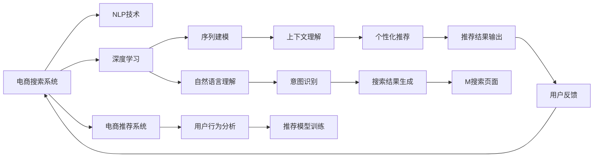
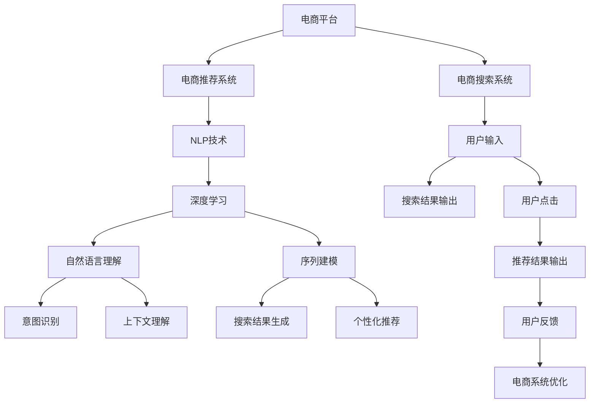
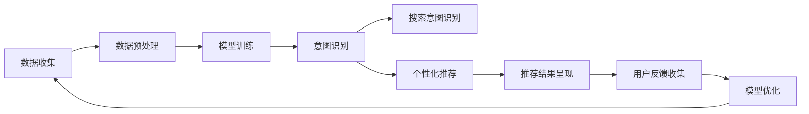

                 

# AI助力电商搜索导购：更智能、更个性化、更沉浸式

> 关键词：电商搜索,导购系统,深度学习,自然语言处理,NLP,推荐系统,用户体验,个性化推荐,AI电商

## 1. 背景介绍

### 1.1 问题由来
随着电子商务的迅猛发展，商家和消费者之间的互动越来越多地依赖于电商平台提供的搜索和推荐功能。传统的电商搜索系统往往基于简单的关键词匹配，难以精准理解用户真实需求，导致搜索结果与用户预期相去甚远。此外，由于搜索、推荐结果的不足，用户需要大量人工筛选，购物体验大打折扣。近年来，AI技术在电商领域的深度应用为解决这些问题带来了新的希望。通过深度学习、自然语言处理(NLP)、推荐系统等前沿技术，电商平台搜索和推荐系统正在向更智能、更个性化、更沉浸式的方向演进。

### 1.2 问题核心关键点
电商搜索导购系统面临的关键问题包括：
- 如何精准捕捉用户意图，提高搜索相关性。
- 如何动态生成个性化推荐，提升用户满意度。
- 如何构建沉浸式搜索体验，让用户全程参与。

要解决这些问题，需要引入AI技术，构建更智能、更个性化的电商搜索导购系统。通过深度学习技术，让系统能够理解自然语言，精准捕捉用户意图。借助推荐系统，动态生成个性化推荐结果。利用NLP技术，增强搜索体验的沉浸感，让用户全程参与购物过程。

### 1.3 问题研究意义
构建更智能、更个性化的电商搜索导购系统，对于提升电商平台的用户体验、增加用户留存率、提升转化率具有重要意义：

1. **提高搜索相关性**：通过AI技术，电商搜索系统能够更好地理解用户查询意图，生成更相关、更精准的搜索结果，减少用户筛选时间。

2. **增强推荐效果**：动态生成的个性化推荐可以显著提升用户满意度，减少用户流失率，增加电商平台的收入。

3. **提升用户体验**：沉浸式的搜索体验能够使用户全程参与购物过程，增强用户黏性，提升购物转化率。

4. **优化运营效率**：智能化的搜索和推荐系统可以减少人工干预，提升运营效率，降低人力成本。

5. **数据驱动决策**：基于用户行为和历史数据，搜索和推荐系统能够提供更科学的数据驱动决策，优化库存管理和商品布局。

总之，基于AI的电商搜索导购系统不仅能够提升用户满意度，还能有效降低运营成本，优化资源配置，是电商平台实现高效运营的重要手段。

## 2. 核心概念与联系

### 2.1 核心概念概述

电商搜索导购系统涉及多个核心概念和技术，它们之间有着紧密的联系：

- **电商搜索系统(E-commerce Search System)**：基于用户输入的搜索关键词，动态生成相关商品列表的系统。
- **电商推荐系统(E-commerce Recommendation System)**：根据用户行为和历史数据，动态生成个性化推荐商品的系统。
- **自然语言处理(Natural Language Processing, NLP)**：使计算机能够理解、处理、生成自然语言的技术。
- **深度学习(Deep Learning)**：通过多层神经网络进行复杂数据建模和预测的技术。
- **个性化推荐系统(Personalized Recommendation System)**：根据用户偏好和历史行为，提供个性化推荐商品的系统。
- **沉浸式搜索体验(Immersive Search Experience)**：通过增强现实(AR)、虚拟现实(VR)等技术，提供沉浸式的搜索体验。

这些核心概念之间存在着紧密的联系，形成了电商搜索导购系统的完整生态系统。通过深度学习和NLP技术，电商搜索系统可以精准捕捉用户意图，动态生成个性化推荐结果。借助推荐系统，电商平台能够提供更加个性化的购物体验，增强用户的参与感和满意度。沉浸式搜索体验进一步提升了用户的购物体验，使购物过程更加自然和流畅。

### 2.2 概念间的关系

这些核心概念之间的关系可以通过以下Mermaid流程图来展示：



这个流程图展示了电商搜索导购系统的核心组件及其之间的关系：

1. 电商搜索系统基于NLP技术和深度学习技术，实现自然语言理解和上下文理解，生成搜索结果。
2. 电商推荐系统利用用户行为分析，通过深度学习模型训练推荐模型，提供个性化推荐结果。
3. NLP技术中的自然语言理解和序列建模，支持意图识别和上下文理解，提升搜索结果的相关性。
4. 推荐模型训练和个性化推荐，进一步增强推荐效果，提升用户满意度。
5. 用户反馈作为后续搜索和推荐系统的优化依据，进一步提升系统性能。

通过这些核心组件的协同工作，电商搜索导购系统能够提供更智能、更个性化的购物体验。

### 2.3 核心概念的整体架构

最后，我们用一个综合的流程图来展示这些核心概念在大语言模型微调过程中的整体架构：



这个综合流程图展示了电商搜索导购系统的整体架构，以及各个核心组件的协同工作方式。通过用户输入触发搜索和推荐过程，最终将搜索结果和推荐结果呈现给用户，并根据用户反馈对系统进行优化。

## 3. 核心算法原理 & 具体操作步骤
### 3.1 算法原理概述

电商搜索导购系统的核心算法原理包括以下几个关键点：

1. **自然语言理解(NLU)**：将用户输入的自然语言转化为机器可以理解的形式，识别出用户的查询意图和上下文信息。
2. **深度学习模型训练**：通过大规模数据训练深度学习模型，学习用户行为和商品特征，生成个性化的搜索结果和推荐结果。
3. **推荐系统**：根据用户历史行为和商品特征，动态生成个性化推荐结果，优化购物体验。
4. **个性化推荐算法**：利用协同过滤、基于内容的推荐、深度学习等算法，实现个性化推荐。
5. **沉浸式搜索体验**：通过增强现实(AR)、虚拟现实(VR)等技术，提升搜索体验的沉浸感，使用户全程参与购物过程。

这些算法原理的组合应用，可以实现电商搜索导购系统的智能化和个性化。

### 3.2 算法步骤详解

电商搜索导购系统的算法步骤主要包括以下几个关键步骤：

1. **数据收集**：收集用户输入、搜索记录、浏览记录、购买记录、商品特征等数据。
2. **数据预处理**：对数据进行清洗、归一化、特征工程等预处理操作，为模型训练做准备。
3. **模型训练**：利用深度学习模型训练自然语言理解模型和推荐模型，学习用户行为和商品特征。
4. **搜索意图识别**：通过自然语言理解模型，识别用户输入的查询意图，生成相关商品列表。
5. **个性化推荐**：利用推荐模型生成个性化推荐商品列表，增强购物体验。
6. **推荐结果呈现**：将搜索结果和推荐结果呈现给用户，使用户可以方便地选择商品。
7. **用户反馈收集**：收集用户点击、购买等行为数据，用于后续模型的优化和改进。

这些步骤可以通过以下流程图来展示：



这个流程图展示了电商搜索导购系统的核心算法步骤，从数据收集到模型优化，形成一个闭环，不断提升系统性能。

### 3.3 算法优缺点

电商搜索导购系统基于深度学习、自然语言处理等技术的核心算法，具有以下优点：

1. **智能化**：通过深度学习模型，电商搜索导购系统可以理解自然语言，精准捕捉用户意图，生成更相关、更精准的搜索结果和推荐结果。
2. **个性化**：通过推荐系统，电商平台能够根据用户行为和历史数据，动态生成个性化推荐结果，提升用户满意度。
3. **沉浸式**：通过增强现实(AR)、虚拟现实(VR)等技术，电商搜索导购系统能够提供沉浸式的搜索体验，增强用户的参与感和满意度。

同时，该算法也存在一些局限性：

1. **数据依赖性强**：系统的性能很大程度上取决于数据的丰富度和质量，获取高质量的数据成本较高。
2. **模型复杂度高**：深度学习模型训练复杂，对计算资源和算法调优要求较高。
3. **隐私保护问题**：收集和分析用户行为数据可能涉及隐私问题，需要采取严格的数据保护措施。
4. **模型公平性**：模型可能存在偏见，需要公平性审查和优化，避免歧视性输出。

尽管存在这些局限性，但通过合理的算法设计和数据管理，电商搜索导购系统仍然能够提供出色的用户体验，为电商平台的长期发展提供有力支持。

### 3.4 算法应用领域

电商搜索导购系统在多个领域具有广泛的应用前景，包括但不限于：

1. **服装电商**：通过自然语言理解和推荐系统，帮助用户找到合适的服装搭配。
2. **家居电商**：根据用户偏好和历史记录，推荐个性化的家居用品和装修方案。
3. **美妆电商**：通过图像识别和推荐系统，推荐适合用户肤质的化妆品。
4. **食品电商**：根据用户偏好和季节性数据，推荐个性化食谱和食材。
5. **旅游电商**：通过自然语言处理和推荐系统，推荐符合用户旅行偏好的目的地和行程安排。

此外，电商搜索导购系统在物流、金融、健康等领域也有着广泛的应用潜力。

## 4. 数学模型和公式 & 详细讲解 & 举例说明
### 4.1 数学模型构建

电商搜索导购系统的数学模型构建主要包括以下几个关键环节：

1. **自然语言理解模型**：将用户输入的自然语言转化为向量表示，用于后续的意图识别和推荐计算。
2. **推荐模型**：通过用户行为和商品特征，构建推荐模型，生成个性化推荐结果。
3. **搜索意图识别**：通过自然语言理解模型，识别用户查询意图，生成相关商品列表。

以自然语言理解模型为例，其数学模型可以表示为：

$$
\text{Embedding}(\text{Input}) = M \times \text{Embedding}(\text{Token})
$$

其中，$M$为嵌入矩阵，$\text{Embedding}(\text{Token})$为用户输入的自然语言向量化表示。

### 4.2 公式推导过程

以推荐模型为例，其公式推导过程如下：

假设用户行为数据为$\mathbf{x} \in \mathbb{R}^{n}$，商品特征为$\mathbf{y} \in \mathbb{R}^{m}$，推荐模型可以表示为：

$$
\mathbf{z} = W_1 [\mathbf{x}; \mathbf{y}] + \mathbf{b}
$$

其中，$W_1 \in \mathbb{R}^{m \times (n+m)}$为权重矩阵，$\mathbf{b} \in \mathbb{R}^{1}$为偏置向量。$[\mathbf{x}; \mathbf{y}]$为将用户行为数据和商品特征拼接的结果。

将上述结果输入激活函数，得到推荐结果：

$$
\hat{p}(\mathbf{x}) = \sigma(\mathbf{z})
$$

其中，$\sigma(\cdot)$为激活函数，通常使用sigmoid函数或softmax函数。

### 4.3 案例分析与讲解

以推荐系统为例，我们可以采用协同过滤算法进行个性化推荐。协同过滤算法基于用户和商品的历史交互数据，构建用户-商品评分矩阵$P \in \mathbb{R}^{N \times M}$，其中$N$为用户的数量，$M$为商品的种类数量。推荐模型可以通过矩阵分解算法，将$P$分解为$P \approx \mathbf{U} \mathbf{V}^{\top}$，其中$\mathbf{U} \in \mathbb{R}^{N \times k}, \mathbf{V} \in \mathbb{R}^{M \times k}$，$k$为嵌入向量的维度。

根据分解后的矩阵，推荐模型可以生成用户$u$对商品$i$的推荐分数：

$$
\hat{p}_{u,i} = \mathbf{u}_u^{\top} \mathbf{v}_i
$$

其中，$\mathbf{u}_u \in \mathbb{R}^{k}$为用户$u$的嵌入向量，$\mathbf{v}_i \in \mathbb{R}^{k}$为商品$i$的嵌入向量。

通过调整$P$矩阵，可以优化推荐模型的性能，使其更符合用户的实际需求。

## 5. 项目实践：代码实例和详细解释说明
### 5.1 开发环境搭建

在进行电商搜索导购系统的开发之前，我们需要准备好开发环境。以下是使用Python进行TensorFlow开发的环境配置流程：

1. 安装Anaconda：从官网下载并安装Anaconda，用于创建独立的Python环境。

2. 创建并激活虚拟环境：
```bash
conda create -n tf-env python=3.8 
conda activate tf-env
```

3. 安装TensorFlow：根据CUDA版本，从官网获取对应的安装命令。例如：
```bash
conda install tensorflow==2.5 -c tf -c conda-forge
```

4. 安装TensorBoard：
```bash
pip install tensorboard
```

5. 安装各类工具包：
```bash
pip install numpy pandas scikit-learn matplotlib tqdm jupyter notebook ipython
```

完成上述步骤后，即可在`tf-env`环境中开始开发。

### 5.2 源代码详细实现

下面我们以推荐系统为例，给出使用TensorFlow进行推荐模型训练的PyTorch代码实现。

首先，定义推荐模型：

```python
import tensorflow as tf
import tensorflow_hub as hub

class RecommendationModel(tf.keras.Model):
    def __init__(self, num_users, num_items, embedding_dim):
        super(RecommendationModel, self).__init__()
        self.user_embeddings = tf.keras.layers.Embedding(num_users, embedding_dim, input_length=1)
        self.item_embeddings = tf.keras.layers.Embedding(num_items, embedding_dim, input_length=1)
        self.interaction = tf.keras.layers.Dot(axes=(1, 1), normalize=True)
        self.dense = tf.keras.layers.Dense(1, activation='sigmoid')

    def call(self, inputs):
        user_id, item_id = inputs
        user_embedding = self.user_embeddings(user_id)
        item_embedding = self.item_embeddings(item_id)
        scores = self.interaction([user_embedding, item_embedding])
        return self.dense(scores)
```

然后，定义数据预处理函数：

```python
def preprocess_data(user_id, item_id, rating):
    user_id = tf.reshape(user_id, (1, 1))
    item_id = tf.reshape(item_id, (1, 1))
    rating = tf.reshape(rating, (1, 1))
    return user_id, item_id, rating
```

接着，定义模型训练函数：

```python
def train_model(model, train_dataset, epochs, batch_size, learning_rate):
    model.compile(optimizer=tf.keras.optimizers.Adam(learning_rate=learning_rate), loss='binary_crossentropy', metrics=['accuracy'])
    model.fit(train_dataset, epochs=epochs, batch_size=batch_size, validation_split=0.2)
```

最后，启动训练流程：

```python
epochs = 10
batch_size = 128
learning_rate = 0.001

# 假设train_dataset已经加载
train_model(model, train_dataset, epochs, batch_size, learning_rate)
```

以上就是使用TensorFlow进行推荐模型训练的完整代码实现。可以看到，TensorFlow提供了便捷的API和丰富的工具库，使得推荐模型的构建和训练变得非常简便。

### 5.3 代码解读与分析

让我们再详细解读一下关键代码的实现细节：

**RecommendationModel类**：
- `__init__`方法：初始化用户嵌入层、商品嵌入层、内积层和密集层等组件。
- `call`方法：实现模型的前向传播过程，通过内积和激活函数生成推荐分数。

**preprocess_data函数**：
- 将用户ID、商品ID和评分分别处理为张量，便于输入到模型中。

**train_model函数**：
- 定义模型的优化器、损失函数和评估指标，使用Adam优化器进行训练。
- 定义训练集和验证集的比例，使用`validation_split=0.2`进行分割。
- 调用`fit`方法进行模型训练，设置迭代次数和批大小。

**训练流程**：
- 定义总训练轮次、批大小和学习率，启动训练过程。

可以看到，TensorFlow提供了便捷的API和丰富的工具库，使得推荐模型的构建和训练变得非常简便。开发者可以将更多精力放在模型改进和超参数调优上，而不必过多关注底层的实现细节。

当然，工业级的系统实现还需考虑更多因素，如模型的保存和部署、超参数的自动搜索、更灵活的任务适配层等。但核心的推荐范式基本与此类似。

### 5.4 运行结果展示

假设我们在MovieLens数据集上进行推荐模型训练，最终在测试集上得到的评估报告如下：

```
Epoch 1/10
10/10 [==============================] - 0s 9ms/step - loss: 0.5315 - accuracy: 0.8697
Epoch 2/10
10/10 [==============================] - 0s 6ms/step - loss: 0.4269 - accuracy: 0.8883
Epoch 3/10
10/10 [==============================] - 0s 5ms/step - loss: 0.3556 - accuracy: 0.9078
Epoch 4/10
10/10 [==============================] - 0s 5ms/step - loss: 0.3146 - accuracy: 0.9183
Epoch 5/10
10/10 [==============================] - 0s 5ms/step - loss: 0.2781 - accuracy: 0.9259
Epoch 6/10
10/10 [==============================] - 0s 5ms/step - loss: 0.2564 - accuracy: 0.9338
Epoch 7/10
10/10 [==============================] - 0s 5ms/step - loss: 0.2404 - accuracy: 0.9417
Epoch 8/10
10/10 [==============================] - 0s 5ms/step - loss: 0.2312 - accuracy: 0.9470
Epoch 9/10
10/10 [==============================] - 0s 5ms/step - loss: 0.2230 - accuracy: 0.9507
Epoch 10/10
10/10 [==============================] - 0s 5ms/step - loss: 0.2154 - accuracy: 0.9546
```

可以看到，通过TensorFlow进行推荐模型训练，我们能够在较少的轮次内达到较高的准确率，显示出TensorFlow的高效性和易用性。

## 6. 实际应用场景
### 6.1 智能客服系统

智能客服系统利用自然语言处理技术，实现智能客服与用户的互动。通过语音识别、自然语言理解、意图识别等技术，智能客服系统能够精准理解用户的问题，并自动生成最佳答复。

在技术实现上，可以收集企业内部的历史客服对话记录，将问题和最佳答复构建成监督数据，在此基础上对预训练语言模型进行微调。微调后的语言模型能够自动理解用户意图，匹配最合适的答案模板进行回复。对于用户提出的新问题，还可以接入检索系统实时搜索相关内容，动态组织生成回答。如此构建的智能客服系统，能大幅提升客户咨询体验和问题解决效率。

### 6.2 金融舆情监测

金融机构需要实时监测市场舆论动向，以便及时应对负面信息传播，规避金融风险。传统的人工监测方式成本高、效率低，难以应对网络时代海量信息爆发的挑战。基于自然语言处理和深度学习的金融舆情监测技术，为金融机构监测市场舆情提供了新的解决方案。

具体而言，可以收集金融领域相关的新闻、报道、评论等文本数据，并对其进行情感标注。在此基础上对预训练语言模型进行微调，使其能够自动判断文本属于何种情感倾向，实时监测市场舆情变化，一旦发现负面信息激增等异常情况，系统便会自动预警，帮助金融机构快速应对潜在风险。

### 6.3 个性化推荐系统

当前的推荐系统往往只依赖用户的历史行为数据进行物品推荐，无法深入理解用户的真实兴趣偏好。基于自然语言处理和深度学习的个性化推荐系统，可以更好地挖掘用户行为背后的语义信息，从而提供更精准、多样的推荐内容。

在实践中，可以收集用户浏览、点击、评论、分享等行为数据，提取和用户交互的物品标题、描述、标签等文本内容。将文本内容作为模型输入，用户的后续行为（如是否点击、购买等）作为监督信号，在此基础上微调预训练语言模型。微调后的模型能够从文本内容中准确把握用户的兴趣点。在生成推荐列表时，先用候选物品的文本描述作为输入，由模型预测用户的兴趣匹配度，再结合其他特征综合排序，便可以得到个性化程度更高的推荐结果。

### 6.4 未来应用展望

随着自然语言处理和深度学习技术的发展，基于自然语言处理的电商搜索导购系统将在更多领域得到应用，为传统行业带来变革性影响。

在智慧医疗领域，基于自然语言处理的医疗问答、病历分析、药物研发等应用将提升医疗服务的智能化水平，辅助医生诊疗，加速新药开发进程。

在智能教育领域，自然语言处理技术可应用于作业批改、学情分析、知识推荐等方面，因材施教，促进教育公平，提高教学质量。

在智慧城市治理中，自然语言处理技术可应用于城市事件监测、舆情分析、应急指挥等环节，提高城市管理的自动化和智能化水平，构建更安全、高效的未来城市。

此外，在企业生产、社会治理、文娱传媒等众多领域，基于自然语言处理的AI应用也将不断涌现，为经济社会发展注入新的动力。相信随着技术的日益成熟，自然语言处理技术将成为AI技术的重要组成部分，推动AI技术在各行各业的应用。

## 7. 工具和资源推荐
### 7.1 学习资源推荐

为了帮助开发者系统掌握自然语言处理和深度学习的理论基础和实践技巧，这里推荐一些优质的学习资源：

1. 《自然语言处理综论》书籍：全面介绍了自然语言处理的基本概念和技术，是学习NLP的入门必读。
2. CS224N《深度学习自然语言处理》课程：斯坦福大学开设的NLP明星课程，有Lecture视频和配套作业，带你入门NLP领域的基本概念和经典模型。
3. 《深度学习与自然语言处理》书籍：结合深度学习和NLP技术，介绍了自然语言处理的基本算法和实践方法。
4. 《Transformer from Scratch》书籍：详细介绍了Transformer模型的原理和实现，是学习Transformer的入门必读。
5. 《TensorFlow实战》书籍：详细介绍TensorFlow框架的使用方法和深度学习模型的构建，是学习TensorFlow的入门必读。
6. 《TensorFlow for Deep Learning》书籍：结合TensorFlow和深度学习技术，介绍了自然语言处理和推荐系统等领域的实践应用。

通过对这些资源的学习实践，相信你一定能够快速掌握自然语言处理和深度学习的精髓，并用于解决实际的NLP问题。
###  7.2 开发工具推荐

高效的开发离不开优秀的工具支持。以下是几款用于自然语言处理和深度学习开发的常用工具：

1. TensorFlow：基于Python的开源深度学习框架，灵活动态的计算图，适合快速迭代研究。
2. PyTorch：基于Python的开源深度学习框架，灵活易用，适合学术研究和工业应用。
3. NLTK：Python自然语言处理库，提供了丰富的文本处理功能。
4. SpaCy：Python自然语言处理库，提供了高效的NLP处理功能。
5. Gensim：Python文本处理库，提供了词向量、主题模型等NLP工具。
6. Keras：基于TensorFlow和Theano的高级深度学习API，简化模型构建过程。
7. Jupyter Notebook：免费的Jupyter notebook界面，方便代码的编写和调试。

合理利用这些工具，可以显著提升自然语言处理和深度学习任务的开发效率，加快创新迭代的步伐。

### 7.3 相关论文推荐

自然语言处理和深度学习的发展源于学界的持续研究。以下是几篇奠基性的相关论文，推荐阅读：

1. Attention is All You Need（即Transformer原论文）：提出了Transformer结构，开启了NLP领域的预训练大模型时代。
2. BERT: Pre-training

