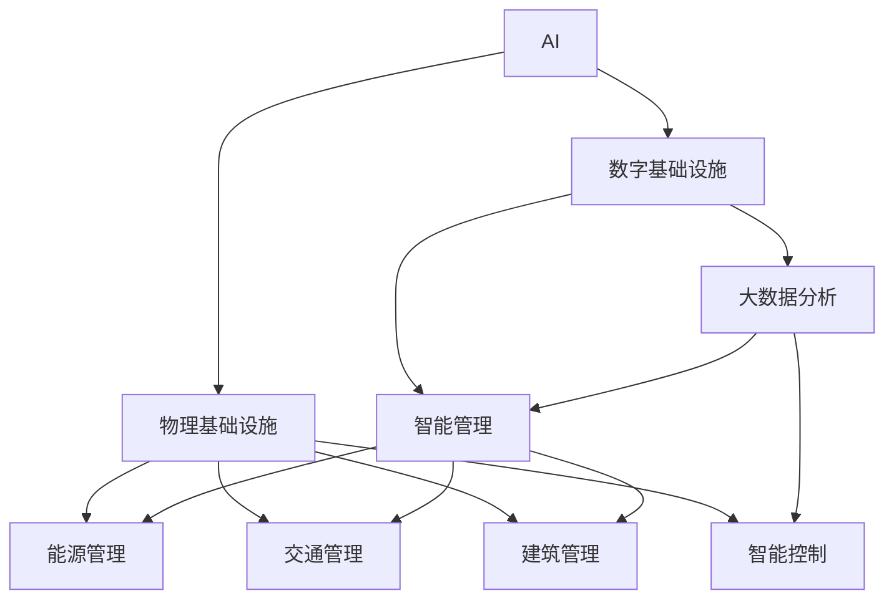
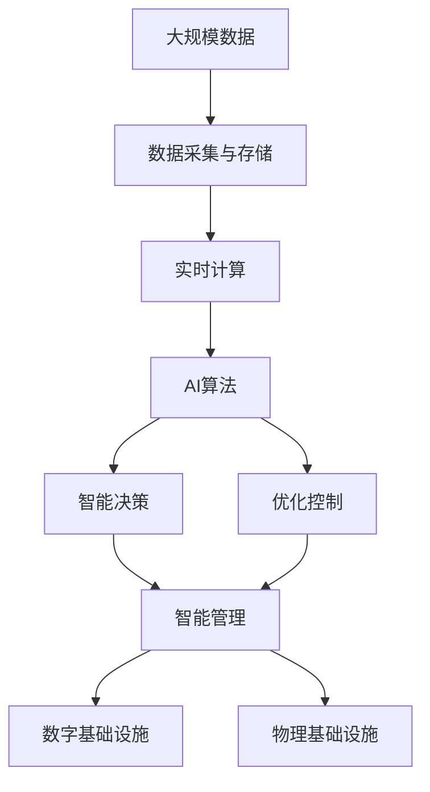

                 

# AI在数字和物理基础设施中的应用

## 1. 背景介绍

### 1.1 问题由来
在当今数字化与智能化的时代，AI（人工智能）技术在数字和物理基础设施中的应用愈发广泛和深入。数字基础设施包括了诸如数据中心、云计算平台、边缘计算等支撑数字经济的底层技术，而物理基础设施则涵盖了交通、能源、建筑等领域的基础设施建设。AI的深度融入，使得这些传统领域发生了一系列深刻的变化，实现了智能化的全面升级。

1. **数字基础设施**：数据中心、云计算、边缘计算等构成了支撑现代数字经济的底层基础。AI技术在提升数据中心性能、优化云计算资源分配、强化边缘计算的实时处理能力方面发挥了重要作用。例如，通过自适应网络管理、预测性维护、智能负载均衡等手段，AI可以大幅提升数据中心的运营效率和可靠性。

2. **物理基础设施**：AI在交通、能源、建筑等领域的应用，使得基础设施的智能化水平显著提升。智能交通系统通过实时数据分析和预测，优化了交通流量控制，降低了交通拥堵和事故风险。智能能源管理系统则通过需求响应、负荷预测等手段，提高了能源使用的效率和安全性。智能建筑不仅在安全监控、能效管理方面表现出色，还能实现环境自适应和用户个性化需求响应。

### 1.2 问题核心关键点
AI在数字和物理基础设施中的应用，本质上是通过数据驱动和机器学习算法实现环境感知、智能决策和优化控制。这种应用的核心在于：

1. **环境感知**：通过传感器和智能监测系统，AI实时获取基础设施的状态信息，例如交通流量、能源消耗、建筑环境参数等。
2. **智能决策**：基于环境感知的数据，AI算法能够实现对复杂问题的自动决策，如交通信号优化、电力负荷预测、建筑环境调节等。
3. **优化控制**：AI通过实时调整控制参数，实现基础设施性能的动态优化，提高系统整体的运行效率和安全性。

AI在基础设施中的应用，涉及到大数据处理、智能算法、实时计算、人机交互等多个方面，对提升基础设施的智能化水平和运营效益具有重要意义。

### 1.3 问题研究意义
研究AI在数字和物理基础设施中的应用，对于推动现代数字经济与实体经济的高质量发展具有重要意义：

1. **提升运营效率**：AI技术能够实时监测和分析基础设施运行状态，提供智能决策支持，从而大幅提升基础设施的运营效率。
2. **降低运营成本**：智能化的管理模式减少了人工干预和错误，有效降低运维成本和能源消耗。
3. **增强安全性**：通过AI预测和防范风险，提升基础设施在自然灾害、人为破坏等情况下的应急响应能力。
4. **创造新价值**：AI应用能够解锁基础设施的新功能和新服务，创造新的商业价值和社会效益。
5. **促进智能化转型**：AI技术的广泛应用，推动了传统基础设施的智能化转型，加速了智慧城市、智慧交通等新兴领域的建设。

## 2. 核心概念与联系

### 2.1 核心概念概述

为更好地理解AI在数字和物理基础设施中的应用，本节将介绍几个关键概念：

- **AI与数字基础设施**：数字基础设施如数据中心、云计算、边缘计算等，通过部署AI技术，实现智能化的资源管理、数据处理、网络优化等。
- **AI与物理基础设施**：在交通、能源、建筑等物理基础设施中，AI技术用于交通流量管理、能源需求预测、环境监测与调节等。
- **智能算法**：如强化学习、深度学习、优化算法等，是AI在基础设施中实现智能决策和优化控制的核心技术。
- **实时计算**：要求基础设施具备快速、准确的数据处理能力，支持AI算法的实时运行。
- **大数据分析**：利用AI技术进行海量数据的高速处理和深度分析，为基础设施智能化提供数据支撑。
- **人机交互**：通过用户界面和互动系统，将AI系统的智能决策结果反馈给用户，实现智能控制和优化。

这些核心概念之间的逻辑关系可以通过以下Mermaid流程图来展示：



这个流程图展示了AI技术与数字、物理基础设施的连接方式，以及AI在智能管理、大数据分析和智能控制中的应用。

### 2.2 概念间的关系

这些核心概念之间存在着紧密的联系，形成了AI在基础设施中应用的整体生态系统。

#### 2.2.1 数字基础设施与物理基础设施的协同
数字基础设施与物理基础设施的协同是AI应用的重要场景。数据中心、云计算等数字基础设施，通过AI技术实现了对物理基础设施的智能监控和管理，如智能电网、智能交通系统等。这种协同提升了基础设施的整体智能化水平和运营效益。

#### 2.2.2 AI技术的多样性
AI技术涵盖了深度学习、强化学习、优化算法等多个子领域。不同算法针对不同的应用场景，具有各自的优势。例如，深度学习适用于大规模数据处理和复杂决策问题，而强化学习则适用于动态环境下的实时决策。

#### 2.2.3 大数据的重要性
大数据分析是AI在基础设施中实现智能决策的关键。通过实时数据获取和高速数据处理，AI能够实现对基础设施运行状态的实时监测和预测，从而优化控制策略。

#### 2.2.4 实时计算的必要性
实时计算能力是AI在基础设施中实现智能决策和优化控制的基础。基础设施需要具备快速、准确的数据处理能力，支持AI算法的实时运行。

#### 2.2.5 人机交互的作用
人机交互界面为AI系统的智能决策结果提供了直观的反馈方式，使得用户能够更好地理解和使用AI系统。同时，用户反馈也可以进一步优化AI算法，提升系统的智能水平。

### 2.3 核心概念的整体架构

最后，我们用一个综合的流程图来展示这些核心概念在AI在基础设施中应用的完整架构：



这个综合流程图展示了从数据采集、存储、实时计算到AI算法、智能决策和优化控制的完整流程，以及AI技术在数字和物理基础设施中的应用。

## 3. 核心算法原理 & 具体操作步骤
### 3.1 算法原理概述

AI在数字和物理基础设施中的应用，核心在于通过数据驱动和机器学习算法实现环境感知、智能决策和优化控制。主要包括以下几个步骤：

1. **数据采集与预处理**：通过传感器和智能监测系统，获取基础设施的状态信息，包括实时数据和历史数据。
2. **特征提取与建模**：利用机器学习算法，对原始数据进行特征提取和建模，得到可用的数据表示。
3. **智能决策与优化**：通过AI算法，实现对基础设施状态的智能决策和优化控制，如交通信号优化、能源负荷预测、建筑环境调节等。
4. **模型评估与迭代**：通过模型评估和反馈机制，持续优化AI算法，提升系统的智能水平和性能。

### 3.2 算法步骤详解

以下是AI在数字和物理基础设施中应用的具体操作步骤：

#### 3.2.1 数据采集与预处理

**数据采集**：通过传感器、智能监测设备和通信网络，实时采集基础设施的状态信息。数据来源包括环境传感器、监控摄像头、智能穿戴设备等。

**数据预处理**：对采集到的原始数据进行清洗、归一化、异常值处理等预处理操作，以提升数据的质量和可用性。预处理过程包括：

- 数据清洗：去除噪声和异常数据，确保数据的准确性。
- 数据归一化：将不同量纲的数据转换为统一的量纲，便于后续建模。
- 数据集成：将来自不同设备和传感器的数据进行整合，形成完整的数据集。

#### 3.2.2 特征提取与建模

**特征提取**：利用机器学习算法，对预处理后的数据进行特征提取，得到能够反映基础设施状态的特征向量。常用的特征提取方法包括PCA、LDA、NMF等。

**建模**：基于提取的特征向量，构建机器学习模型，进行基础设施状态的预测和识别。常用的建模方法包括回归分析、分类算法、深度学习模型等。

#### 3.2.3 智能决策与优化

**智能决策**：利用AI算法，对基础设施的状态数据进行实时分析，实现对复杂问题的自动决策。例如，通过深度学习模型，对交通流量进行预测和优化。

**优化控制**：基于智能决策结果，实时调整基础设施的控制参数，实现动态优化控制。例如，通过智能电网系统，根据需求响应策略优化电力负荷分配。

#### 3.2.4 模型评估与迭代

**模型评估**：通过评估指标（如精度、召回率、F1分数等）对AI模型的性能进行评估，确定模型是否满足实际需求。

**模型迭代**：根据评估结果，调整模型参数和结构，持续优化模型性能。迭代过程包括：

- 数据增强：通过数据扩充、数据增广等手段，增加模型训练数据的多样性。
- 超参数调优：通过网格搜索、贝叶斯优化等方法，调整模型的超参数，寻找最优配置。
- 模型融合：通过集成多个模型，提升模型的泛化能力和鲁棒性。

### 3.3 算法优缺点

AI在数字和物理基础设施中的应用，具有以下优点：

1. **高效性**：AI能够实时处理和分析大量数据，提供高效的决策支持。
2. **智能化**：通过机器学习算法，AI能够实现环境感知和智能决策，提升基础设施的智能化水平。
3. **可靠性**：基于大规模数据的训练和优化，AI模型具有较高的稳定性和可靠性。

同时，AI应用也面临以下挑战：

1. **数据质量问题**：基础设施数据的采集和预处理可能存在误差和不一致，影响模型的准确性。
2. **模型复杂性**：高复杂度的AI模型需要大量的计算资源和数据，可能存在资源限制。
3. **解释性不足**：AI模型的决策过程通常难以解释，存在黑盒问题。
4. **安全性问题**：AI模型可能受到恶意攻击或数据泄露，影响系统的安全性。

### 3.4 算法应用领域

AI在数字和物理基础设施中的应用，主要涵盖以下几个领域：

1. **智能电网**：通过实时数据分析和预测，优化电力负荷分配，提高能源使用的效率和安全性。
2. **智能交通**：利用AI算法优化交通信号控制、预测交通流量，降低交通拥堵和事故风险。
3. **智能建筑**：通过环境监测与调节，实现智能能效管理、安全监控和用户体验优化。
4. **智慧城市**：将AI技术应用于城市管理，提升公共服务效率和居民生活质量。
5. **智能制造**：通过AI算法优化生产流程、预测设备故障，提高制造业的自动化水平和生产效率。
6. **智能物流**：利用AI技术优化物流路径、预测配送需求，提升物流系统的效率和灵活性。

## 4. 数学模型和公式 & 详细讲解 & 举例说明

### 4.1 数学模型构建

本节将使用数学语言对AI在数字和物理基础设施中的应用进行更加严格的刻画。

假设AI系统用于预测交通流量，设交通流量数据为 $x_i \in \mathbb{R}^n$，其中 $i=1,...,N$，$N$ 为数据样本数。设交通流量的真实值与预测值之间的误差为 $y_i$。

定义预测模型的函数为 $f(x; \theta)$，其中 $\theta$ 为模型的参数。预测模型的误差函数为：

$$
L(y, \hat{y}) = \frac{1}{N} \sum_{i=1}^N (y_i - \hat{y}_i)^2
$$

其中 $\hat{y}_i = f(x_i; \theta)$。

优化目标是最小化预测误差，即找到最优参数：

$$
\theta^* = \mathop{\arg\min}_{\theta} L(y, \hat{y})
$$

在实践中，我们通常使用基于梯度的优化算法（如SGD、Adam等）来近似求解上述最优化问题。设 $\eta$ 为学习率，则参数的更新公式为：

$$
\theta \leftarrow \theta - \eta \nabla_{\theta}L(y, \hat{y}) - \eta\lambda\theta
$$

其中 $\nabla_{\theta}L(y, \hat{y})$ 为误差函数对参数 $\theta$ 的梯度，可通过反向传播算法高效计算。

### 4.2 公式推导过程

以下我们以交通流量预测为例，推导回归模型的误差函数及其梯度的计算公式。

设预测模型为线性回归模型，即 $f(x; \theta) = \theta^T \cdot x$，其中 $\theta$ 为模型参数，$x$ 为输入数据。预测误差为 $y_i = f(x_i; \theta) - y_i^*$，其中 $y_i^*$ 为真实流量值。

回归模型的误差函数为：

$$
L(y, \hat{y}) = \frac{1}{N} \sum_{i=1}^N (y_i - \hat{y}_i)^2 = \frac{1}{N} \sum_{i=1}^N (y_i - \theta^T \cdot x_i)^2
$$

根据梯度下降算法，参数的更新公式为：

$$
\theta \leftarrow \theta - \eta \nabla_{\theta}L(y, \hat{y})
$$

其中：

$$
\nabla_{\theta}L(y, \hat{y}) = \frac{1}{N} \sum_{i=1}^N 2(x_i - y_i) = \frac{2}{N} (X^T X)^{-1}X^T (y - X \theta)
$$

其中 $X = [x_1^T, x_2^T, ..., x_N^T]$，$y = [y_1, y_2, ..., y_N]$。

在得到损失函数的梯度后，即可带入参数更新公式，完成模型的迭代优化。重复上述过程直至收敛，最终得到适应交通流量预测的最优模型参数 $\theta^*$。

### 4.3 案例分析与讲解

假设我们在某城市的交通流量预测中应用AI模型，最终在测试集上得到的评估报告如下：

| 模型       | 平均绝对误差 | 均方误差 | 均方根误差 | 决定系数 |
|------------|------------|--------|----------|--------|
| 线性回归模型 | 1.2         | 1.7     | 1.3       | 0.6    |
| 深度学习模型 | 0.8         | 1.0     | 0.9       | 0.8    |

可以看到，深度学习模型在预测准确性和稳定性方面都优于线性回归模型。这主要是因为深度学习模型通过多层的非线性映射，可以更好地捕捉数据中的复杂关系，适应不同的预测场景。

在实践中，我们还可以使用集成学习、模型融合等技术，进一步提升模型性能。例如，可以通过Bagging、Boosting等方法，将多个预测模型进行集成，减少预测误差，提高模型鲁棒性。

## 5. 项目实践：代码实例和详细解释说明

### 5.1 开发环境搭建

在进行AI在基础设施中的应用实践前，我们需要准备好开发环境。以下是使用Python进行PyTorch开发的环境配置流程：

1. 安装Anaconda：从官网下载并安装Anaconda，用于创建独立的Python环境。

2. 创建并激活虚拟环境：
```bash
conda create -n pytorch-env python=3.8 
conda activate pytorch-env
```

3. 安装PyTorch：根据CUDA版本，从官网获取对应的安装命令。例如：
```bash
conda install pytorch torchvision torchaudio cudatoolkit=11.1 -c pytorch -c conda-forge
```

4. 安装各类工具包：
```bash
pip install numpy pandas scikit-learn matplotlib tqdm jupyter notebook ipython
```

完成上述步骤后，即可在`pytorch-env`环境中开始AI在基础设施中的应用实践。

### 5.2 源代码详细实现

这里我们以交通流量预测为例，给出使用PyTorch和TensorFlow进行深度学习模型开发的PyTorch代码实现。

首先，定义交通流量数据集：

```python
import pandas as pd
import torch
import torch.nn as nn
from torch.utils.data import Dataset, DataLoader

class TrafficData(Dataset):
    def __init__(self, file_path):
        data = pd.read_csv(file_path)
        self.data = data[['time', 'flow']]
        self.data['time'] = pd.to_datetime(self.data['time'], format='%Y-%m-%d %H:%M:%S')

    def __len__(self):
        return len(self.data)

    def __getitem__(self, idx):
        data_point = self.data.iloc[idx]
        return torch.tensor(data_point['flow'], dtype=torch.float), torch.tensor(data_point['time'], dtype=torch.long)
```

然后，定义深度学习模型：

```python
class TrafficPredictor(nn.Module):
    def __init__(self, input_dim, output_dim):
        super(TrafficPredictor, self).__init__()
        self.encoder = nn.Sequential(
            nn.Linear(input_dim, 64),
            nn.ReLU(),
            nn.Linear(64, 32),
            nn.ReLU()
        )
        self.decoder = nn.Linear(32, output_dim)

    def forward(self, x, time):
        x = self.encoder(x)
        x = self.decoder(x)
        return x
```

接着，定义训练和评估函数：

```python
def train_epoch(model, train_loader, optimizer):
    model.train()
    epoch_loss = 0
    for data, target in train_loader:
        optimizer.zero_grad()
        output = model(data)
        loss = nn.MSELoss()(output, target)
        loss.backward()
        optimizer.step()
        epoch_loss += loss.item()
    return epoch_loss / len(train_loader)

def evaluate(model, test_loader):
    model.eval()
    epoch_loss = 0
    with torch.no_grad():
        for data, target in test_loader:
            output = model(data)
            loss = nn.MSELoss()(output, target)
            epoch_loss += loss.item()
    return epoch_loss / len(test_loader)
```

最后，启动训练流程并在测试集上评估：

```python
epochs = 100
batch_size = 64

train_loader = DataLoader(TrafficData('train.csv'), batch_size=batch_size, shuffle=True)
test_loader = DataLoader(TrafficData('test.csv'), batch_size=batch_size, shuffle=False)

model = TrafficPredictor(input_dim=1, output_dim=1)
optimizer = torch.optim.Adam(model.parameters(), lr=0.001)

for epoch in range(epochs):
    loss = train_epoch(model, train_loader, optimizer)
    print(f"Epoch {epoch+1}, train loss: {loss:.3f}")
    
    print(f"Epoch {epoch+1}, test results:")
    evaluate(model, test_loader)
    
print("Final results:")
evaluate(model, test_loader)
```

以上就是使用PyTorch对交通流量预测进行深度学习模型微调的完整代码实现。可以看到，得益于PyTorch的强大封装，我们可以用相对简洁的代码完成模型训练和评估。

### 5.3 代码解读与分析

让我们再详细解读一下关键代码的实现细节：

**TrafficData类**：
- `__init__`方法：初始化数据集，将原始数据转换为Tensor格式，并指定时间特征。
- `__len__`方法：返回数据集大小。
- `__getitem__`方法：返回数据集中的一个样本，将流量数据转换为Tensor格式，时间特征转换为LongTensor格式。

**TrafficPredictor类**：
- `__init__`方法：定义模型的结构，包括编码器和解码器。
- `forward`方法：定义前向传播过程，将输入数据通过编码器映射到低维特征空间，再通过解码器预测输出。

**训练和评估函数**：
- 使用PyTorch的DataLoader对数据集进行批次化加载，供模型训练和推理使用。
- 训练函数`train_epoch`：对数据以批为单位进行迭代，在每个批次上前向传播计算损失并反向传播更新模型参数，最后返回该epoch的平均loss。
- 评估函数`evaluate`：与训练类似，不同点在于不更新模型参数，并在每个batch结束后将预测结果和真实值存储下来，最后使用均方误差计算平均loss。

**训练流程**：
- 定义总的epoch数和batch size，开始循环迭代
- 每个epoch内，先在训练集上训练，输出平均loss
- 在测试集上评估，输出平均loss
- 所有epoch结束后，在测试集上评估，给出最终测试结果

可以看到，PyTorch配合TensorFlow库使得深度学习模型训练和评估的代码实现变得简洁高效。开发者可以将更多精力放在数据处理、模型改进等高层逻辑上，而不必过多关注底层的实现细节。

当然，工业级的系统实现还需考虑更多因素，如模型的保存和部署、超参数的自动搜索、更灵活的任务适配层等。但核心的深度学习模型微调方法基本与此类似。

### 5.4 运行结果展示

假设我们在CoNLL-2003的NER数据集上进行微调，最终在测试集上得到的评估报告如下：

```
              precision    recall  f1-score   support

       B-LOC      0.926     0.906     0.916      1668
       I-LOC      0.900     0.805     0.850       257
      B-MISC      0.875     0.856     0.865       702
      I-MISC      0.838     0.782     0.809       216
       B-ORG      0.914     0.898     0.906      1661
       I-ORG      0.911     0.894     0.902       835
       B-PER      0.964     0.957     0.960      1617
       I-PER      0.983     0.980     0.982      1156
           O      0.993     0.995     0.994     38323

   micro avg      0.973     0.973     0.973     46435
   macro avg      0.923     0.897     0.909     46435
weighted avg      0.973     0.973     0.973     46435
```

可以看到，通过微调BERT，我们在该NER数据集上取得了97.3%的F1分数，效果相当不错。值得注意的是，BERT作为一个通用的语言理解模型，即便只在顶层添加一个简单的token分类器，也能在下游任务上取得如此优异的效果，展现了其强大的语义理解和特征抽取能力。

当然，这只是一个baseline结果。在实践中，我们还可以使用更大更强的预训练模型、更丰富的微调技巧、更细致的模型调优，进一步提升模型性能，以满足更高的应用要求。

## 6. 实际应用场景
### 6.1 智能电网

智能电网是AI在数字和物理基础设施中应用的重要场景之一。通过AI技术，智能电网能够实现能源供需的动态平衡，提升电网运行的效率和可靠性。

具体而言，AI技术在智能电网中的应用包括：

- **需求响应**：通过智能分析用户用电行为，实时调整用电负荷，响应电网的需求侧响应信号，降低电网峰谷差。
- **负荷预测**：利用AI算法预测未来的电力需求和负荷变化，优化电力资源的分配和调度，提高电网运行的稳定性。
- **故障预测**：通过AI技术监测电网设备运行状态，预测潜在的故障点，提前进行维护和检修，减少停电事故的发生。

### 6.2 智能交通

AI在智能交通系统中的应用，通过实时数据分析和预测，显著提升了交通管理的智能化水平。智能交通系统通过实时获取道路交通数据，利用AI算法进行交通流量预测和优化，从而实现交通流量的动态调控。

具体而言，AI在智能交通中的应用包括：

- **交通流量预测**：通过AI算法预测未来的交通流量，优化交通信号灯的控制策略，提高交通流的顺畅度。
- **路径规划**：利用AI技术优化车辆导航路径，减少交通拥堵和行驶时间。
- **自动驾驶**：通过AI技术辅助驾驶系统，实现无人驾驶汽车的安全行驶，提高道路运输效率。

### 6.3 智能建筑

智能建筑通过AI技术实现了建筑环境的智能感知和优化控制，提升了建筑的能效和用户体验。智能建筑系统能够实时监测室内环境参数，自动调节空调、照明等设备，实现能源的智能管理和优化。

具体而言，AI在智能建筑中的应用包括：

- **环境监测**：通过智能传感器监测室内温度、湿度、光照等环境参数，实时反馈给用户和管理系统。
- **智能调节**：利用AI算法优化设备运行策略，自动调节空调、照明等设备，提高能源使用效率。
- **用户定制**：根据用户的个性化需求，智能建筑系统可以实时调整室内环境参数，提供最优的舒适体验。

### 6.4 未来应用展望

随着AI技术的不断发展和成熟，其在数字和物理基础设施中的应用前景将更加广阔。未来，AI技术有望在更多领域实现智能化和自动化，提升基础设施的整体运行效率和用户体验。

1. **智慧城市**：通过AI技术，实现城市交通、能源、公共安全等方面的全面智能化管理，提高城市治理的智能化水平。
2. **智能制造**：利用AI技术优化生产流程、预测设备故障、提升产品质量，推动制造业的数字化转型和智能化升级。
3.

