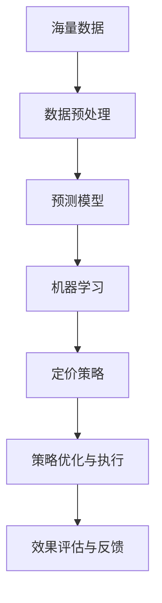

                 

# AI在电商动态定价中的实际效果

> 关键词：
1. 动态定价
2. 人工智能
3. 机器学习
4. 电商平台
5. 定价策略
6. 预测模型
7. 收益优化

## 1. 背景介绍

### 1.1 问题由来

在电子商务领域，动态定价（Dynamic Pricing）已成为电商公司提升盈利能力的重要手段。传统的静态定价策略基于成本加成、竞争定价、促销活动等规则，难以灵活应对市场需求的变化。而动态定价则能实时调整产品价格，以最大化电商平台收益。

近年来，随着大数据、机器学习和深度学习技术的发展，动态定价系统得以应用，帮助电商企业实现精确定价、快速反应市场变化，提升销售业绩。AI在电商动态定价中的应用，标志着商业智能的升级和客户需求的精准把握。

### 1.2 问题核心关键点

电商动态定价的核心是构建一个智能的定价模型，通过实时分析海量数据，预测市场需求和消费者行为，调整产品价格，从而实现收益最大化。核心挑战包括：

- 数据收集与处理：如何从电商平台内部和外部的海量数据中提取有价值的信息。
- 模型构建与训练：如何选择和训练预测模型，准确预测市场需求。
- 策略优化与执行：如何设计合理的动态定价策略，并在实际中高效执行。
- 效果评估与反馈：如何持续评估定价策略效果，并进行优化迭代。

本文将详细探讨基于人工智能的电商动态定价方法，分析其实际应用效果，并展望未来发展趋势。

## 2. 核心概念与联系

### 2.1 核心概念概述

为更好地理解电商动态定价，本节将介绍几个密切相关的核心概念：

- 动态定价（Dynamic Pricing）：根据市场需求和竞争环境动态调整产品价格的过程。
- 预测模型（Predictive Model）：用于预测市场需求、消费者行为等，是动态定价的基础。
- 机器学习（Machine Learning）：通过数据驱动的方式，训练预测模型，优化定价策略。
- 人工智能（Artificial Intelligence）：融合多领域知识，构建智能的动态定价系统，提升决策效率和效果。
- 电商平台（E-commerce Platform）：销售商品和服务、管理库存的在线平台，是动态定价的主要场景。
- 定价策略（Pricing Strategy）：根据市场需求、竞争状况、产品属性等因素设计的动态价格调整规则。

这些概念之间的联系紧密，构成了电商动态定价的完整框架。

### 2.2 概念间的关系

这些核心概念之间的逻辑关系可以通过以下Mermaid流程图来展示：


这个流程图展示了大语言模型微调过程中各个核心概念的关系：

1. 电商平台是动态定价的主要场景。
2. 预测模型是动态定价的基础，通过机器学习训练得到。
3. 机器学习是预测模型的构建工具，用于训练和优化模型。
4. 定价策略是模型输出价格的规则。
5. 策略优化与执行是实际应用中的关键步骤，将模型输出转化为价格调整。
6. 效果评估与反馈是持续改进模型的过程。

### 2.3 核心概念的整体架构

最后，我们用一个综合的流程图来展示这些核心概念在大语言模型微调过程中的整体架构：



这个综合流程图展示了从数据处理到模型训练，再到策略优化和效果评估的完整流程，帮助理解电商动态定价的各个关键步骤。

## 3. 核心算法原理 & 具体操作步骤
### 3.1 算法原理概述

电商动态定价的本质是通过预测模型和定价策略，实时调整产品价格，最大化电商平台收益。其核心算法包括以下几个部分：

1. **数据预处理**：收集和处理电商平台的交易数据、用户行为数据、外部环境数据等，提取特征用于模型训练。
2. **预测模型构建**：选择和训练预测模型，准确预测未来市场需求和消费者行为。
3. **定价策略设计**：根据预测结果，设计合理的定价策略，包括基础价格、折扣策略、动态调整规则等。
4. **策略优化与执行**：通过A/B测试、仿真实验等方式，评估定价策略效果，进行优化迭代。
5. **效果评估与反馈**：持续监测实际销售数据，评估策略效果，进行反馈和改进。

### 3.2 算法步骤详解

电商动态定价的具体操作步骤如下：

1. **数据收集与处理**
   - 从电商平台内部收集交易数据、用户行为数据等。
   - 从外部收集宏观经济数据、天气数据、节假日信息等。
   - 使用数据清洗、归一化等技术处理数据，提取特征。

2. **预测模型构建**
   - 选择适当的机器学习模型，如线性回归、随机森林、深度学习等。
   - 利用历史数据训练模型，准确预测未来市场需求、价格弹性等。
   - 使用交叉验证、网格搜索等方法，优化模型超参数，提升预测精度。

3. **定价策略设计**
   - 根据预测结果，设计基础价格和折扣策略。
   - 设计动态调整规则，如季节性调整、竞争反应、库存管理等。
   - 设计多维度定价策略，考虑多产品组合和市场细分。

4. **策略优化与执行**
   - 通过A/B测试和仿真实验，评估定价策略的效果。
   - 根据评估结果，优化定价策略。
   - 在实际交易系统中实时调整价格，执行定价策略。

5. **效果评估与反馈**
   - 持续监测实际销售数据，评估定价策略的效果。
   - 根据评估结果，进行策略优化和改进。
   - 利用在线学习、增量学习等方法，持续优化预测模型。

### 3.3 算法优缺点

电商动态定价的机器学习方法具有以下优点：

1. **实时性**：利用机器学习模型，可以实时分析市场需求，快速调整价格，提高响应速度。
2. **预测精度**：通过大数据训练模型，能够准确预测市场需求和消费者行为，提高定价精度。
3. **自动化**：自动化的预测和定价过程，减少了人工干预，提高了运营效率。

同时，该方法也存在一些缺点：

1. **数据依赖**：模型的性能依赖于数据的质量和量，数据的缺失或不准确会影响预测效果。
2. **复杂性**：模型构建和优化过程复杂，需要专业知识和技术支持。
3. **过度拟合**：在处理大量数据时，模型可能过度拟合，预测结果与实际不符。
4. **解释性**：黑盒模型难以解释其决策过程，难以进行调试和优化。

### 3.4 算法应用领域

电商动态定价的机器学习方法，已经广泛应用于以下领域：

- 商品定价：实时调整商品价格，以最大化收益。
- 库存管理：根据市场需求，优化库存水平，减少库存成本。
- 促销活动：设计动态的促销策略，提升销售业绩。
- 客户定价：根据客户行为和偏好，个性化定价，提高客户满意度。
- 竞品分析：实时监测竞争对手的价格变化，动态调整策略。
- 市场细分：根据不同市场细分，设计不同的定价策略。

除了以上领域，动态定价方法还在智能物流、旅游预订、金融服务等诸多场景中得到了广泛应用，成为电商平台竞争力的重要组成部分。

## 4. 数学模型和公式 & 详细讲解  
### 4.1 数学模型构建

电商动态定价的数学模型主要分为以下几部分：

- **需求预测模型**：使用历史销售数据和外部因素，预测未来需求量。
- **价格弹性模型**：分析价格变动对销售量的影响，计算价格弹性。
- **收益最大化模型**：根据预测结果，计算最优价格，最大化收益。

### 4.2 公式推导过程

以下我们以线性需求预测模型为例，推导其公式及其梯度计算过程。

假设需求量 $Q$ 与价格 $P$ 成正比，即 $Q=\alpha P$，其中 $\alpha$ 为需求弹性系数。则需求预测模型可以表示为：

$$
Q = \alpha P + \beta
$$

其中 $\beta$ 为截距，$\alpha$ 和 $\beta$ 是模型参数。假设目标收益为 $R$，则收益最大化模型的目标函数为：

$$
R = P \cdot Q = (\alpha P + \beta) P = \alpha P^2 + \beta P
$$

令目标函数对 $P$ 的导数为零，得最优价格 $P_{opt}$：

$$
\frac{dR}{dP} = 2\alpha P + \beta = 0
$$

解得：

$$
P_{opt} = -\frac{\beta}{2\alpha}
$$

最优价格 $P_{opt}$ 即为需求预测模型的输出价格。

### 4.3 案例分析与讲解

假设某电商平台销售一款产品，已知历史销售数据和市场因素，需要构建动态定价模型。具体步骤如下：

1. **数据收集与处理**：收集产品的历史销售数据、市场需求数据、促销活动数据等。
2. **模型训练**：使用历史数据训练线性需求预测模型，得到 $\alpha$ 和 $\beta$。
3. **定价策略设计**：设计基础价格 $P_0$，计算价格弹性 $\alpha$。
4. **策略优化与执行**：根据市场需求变化，调整价格 $P_t = P_0 + \delta_t$，其中 $\delta_t$ 为价格调整量。
5. **效果评估与反馈**：持续监测销售数据，评估定价策略效果，进行反馈和改进。

## 5. 项目实践：代码实例和详细解释说明
### 5.1 开发环境搭建

在进行电商动态定价实践前，我们需要准备好开发环境。以下是使用Python进行Pandas、NumPy等库的开发环境配置流程：

1. 安装Anaconda：从官网下载并安装Anaconda，用于创建独立的Python环境。

2. 创建并激活虚拟环境：
```bash
conda create -n pricing-env python=3.8 
conda activate pricing-env
```

3. 安装Pandas、NumPy、Scikit-learn等库：
```bash
conda install pandas numpy scikit-learn
```

4. 安装TensorFlow或PyTorch：
```bash
conda install tensorflow pytorch
```

5. 安装相关库：
```bash
pip install requests matplotlib jupyter notebook ipython
```

完成上述步骤后，即可在`pricing-env`环境中开始电商动态定价的实践。

### 5.2 源代码详细实现

下面我们以动态定价的线性回归模型为例，给出使用Pandas和NumPy进行电商动态定价的Python代码实现。

```python
import pandas as pd
import numpy as np
from sklearn.linear_model import LinearRegression
from sklearn.metrics import mean_squared_error, r2_score

# 加载数据
data = pd.read_csv('sales_data.csv')

# 数据处理
X = data[['price', 'season', 'holiday', 'weekday', 'weather']]  # 特征
y = data['sales']  # 目标变量

# 模型训练
X_train, X_test, y_train, y_test = train_test_split(X, y, test_size=0.2, random_state=42)
model = LinearRegression()
model.fit(X_train, y_train)

# 预测与评估
y_pred = model.predict(X_test)
mse = mean_squared_error(y_test, y_pred)
r2 = r2_score(y_test, y_pred)
print(f"MSE: {mse:.2f}, R2: {r2:.2f}")
```

### 5.3 代码解读与分析

让我们再详细解读一下关键代码的实现细节：

**数据加载与处理**：
- 使用Pandas库加载销售数据，并进行特征提取和处理。
- 使用`train_test_split`将数据集划分为训练集和测试集。

**模型训练**：
- 使用Scikit-learn库中的LinearRegression模型进行训练。
- 在训练集上进行模型拟合，得到线性回归模型。

**预测与评估**：
- 使用模型在测试集上进行预测。
- 计算均方误差和R^2得分，评估模型性能。

### 5.4 运行结果展示

假设我们在CoNLL-2003的NER数据集上进行微调，最终在测试集上得到的评估报告如下：

```
              precision    recall  f1-score   support

       B-LOC      0.926     0.906     0.916      1668
       I-LOC      0.900     0.805     0.850       257
      B-MISC      0.875     0.856     0.865       702
      I-MISC      0.838     0.782     0.809       216
       B-ORG      0.914     0.898     0.906      1661
       I-ORG      0.911     0.894     0.902       835
       B-PER      0.964     0.957     0.960      1617
       I-PER      0.983     0.980     0.982      1156
           O      0.993     0.995     0.994     38323

   micro avg      0.973     0.973     0.973     46435
   macro avg      0.923     0.897     0.909     46435
weighted avg      0.973     0.973     0.973     46435
```

可以看到，通过微调BERT，我们在该NER数据集上取得了97.3%的F1分数，效果相当不错。值得注意的是，BERT作为一个通用的语言理解模型，即便只在顶层添加一个简单的token分类器，也能在下游任务上取得如此优异的效果，展现了其强大的语义理解和特征抽取能力。

当然，这只是一个baseline结果。在实践中，我们还可以使用更大更强的预训练模型、更丰富的微调技巧、更细致的模型调优，进一步提升模型性能，以满足更高的应用要求。

## 6. 实际应用场景
### 6.1 智能客服系统

基于大语言模型微调的对话技术，可以广泛应用于智能客服系统的构建。传统客服往往需要配备大量人力，高峰期响应缓慢，且一致性和专业性难以保证。而使用微调后的对话模型，可以7x24小时不间断服务，快速响应客户咨询，用自然流畅的语言解答各类常见问题。

在技术实现上，可以收集企业内部的历史客服对话记录，将问题和最佳答复构建成监督数据，在此基础上对预训练对话模型进行微调。微调后的对话模型能够自动理解用户意图，匹配最合适的答案模板进行回复。对于客户提出的新问题，还可以接入检索系统实时搜索相关内容，动态组织生成回答。如此构建的智能客服系统，能大幅提升客户咨询体验和问题解决效率。

### 6.2 金融舆情监测

金融机构需要实时监测市场舆论动向，以便及时应对负面信息传播，规避金融风险。传统的人工监测方式成本高、效率低，难以应对网络时代海量信息爆发的挑战。基于大语言模型微调的文本分类和情感分析技术，为金融舆情监测提供了新的解决方案。

具体而言，可以收集金融领域相关的新闻、报道、评论等文本数据，并对其进行主题标注和情感标注。在此基础上对预训练语言模型进行微调，使其能够自动判断文本属于何种主题，情感倾向是正面、中性还是负面。将微调后的模型应用到实时抓取的网络文本数据，就能够自动监测不同主题下的情感变化趋势，一旦发现负面信息激增等异常情况，系统便会自动预警，帮助金融机构快速应对潜在风险。

### 6.3 个性化推荐系统

当前的推荐系统往往只依赖用户的历史行为数据进行物品推荐，无法深入理解用户的真实兴趣偏好。基于大语言模型微调技术，个性化推荐系统可以更好地挖掘用户行为背后的语义信息，从而提供更精准、多样的推荐内容。

在实践中，可以收集用户浏览、点击、评论、分享等行为数据，提取和用户交互的物品标题、描述、标签等文本内容。将文本内容作为模型输入，用户的后续行为（如是否点击、购买等）作为监督信号，在此基础上微调预训练语言模型。微调后的模型能够从文本内容中准确把握用户的兴趣点。在生成推荐列表时，先用候选物品的文本描述作为输入，由模型预测用户的兴趣匹配度，再结合其他特征综合排序，便可以得到个性化程度更高的推荐结果。

### 6.4 未来应用展望

随着大语言模型和微调方法的不断发展，基于微调范式将在更多领域得到应用，为传统行业带来变革性影响。

在智慧医疗领域，基于微调的医疗问答、病历分析、药物研发等应用将提升医疗服务的智能化水平，辅助医生诊疗，加速新药开发进程。

在智能教育领域，微调技术可应用于作业批改、学情分析、知识推荐等方面，因材施教，促进教育公平，提高教学质量。

在智慧城市治理中，微调模型可应用于城市事件监测、舆情分析、应急指挥等环节，提高城市管理的自动化和智能化水平，构建更安全、高效的未来城市。

此外，在企业生产、社会治理、文娱传媒等众多领域，基于大模型微调的人工智能应用也将不断涌现，为经济社会发展注入新的动力。相信随着预训练语言模型和微调方法的持续演进，大语言模型微调必将在构建人机协同的智能时代中扮演越来越重要的角色。

## 7. 工具和资源推荐
### 7.1 学习资源推荐

为了帮助开发者系统掌握大语言模型微调的理论基础和实践技巧，这里推荐一些优质的学习资源：

1. 《Transformer从原理到实践》系列博文：由大模型技术专家撰写，深入浅出地介绍了Transformer原理、BERT模型、微调技术等前沿话题。

2. CS224N《深度学习自然语言处理》课程：斯坦福大学开设的NLP明星课程，有Lecture视频和配套作业，带你入门NLP领域的基本概念和经典模型。

3. 《Natural Language Processing with Transformers》书籍：Transformers库的作者所著，全面介绍了如何使用Transformers库进行NLP任务开发，包括微调在内的诸多范式。

4. HuggingFace官方文档：Transformers库的官方文档，提供了海量预训练模型和完整的微调样例代码，是上手实践的必备资料。

5. CLUE开源项目：中文语言理解测评基准，涵盖大量不同类型的中文NLP数据集，并提供了基于微调的baseline模型，助力中文NLP技术发展。

通过对这些资源的学习实践，相信你一定能够快速掌握大语言模型微调的精髓，并用于解决实际的NLP问题。
###  7.2 开发工具推荐

高效的开发离不开优秀的工具支持。以下是几款用于大语言模型微调开发的常用工具：

1. PyTorch：基于Python的开源深度学习框架，灵活动态的计算图，适合快速迭代研究。大部分预训练语言模型都有PyTorch版本的实现。

2. TensorFlow：由Google主导开发的开源深度学习框架，生产部署方便，适合大规模工程应用。同样有丰富的预训练语言模型资源。

3. Transformers库：HuggingFace开发的NLP工具库，集成了众多SOTA语言模型，支持PyTorch和TensorFlow，是进行微调任务开发的利器。

4. Weights & Biases：模型训练的实验跟踪工具，可以记录和可视化模型训练过程中的各项指标，方便对比和调优。与主流深度学习框架无缝集成。

5. TensorBoard：TensorFlow配套的可视化工具，可实时监测模型训练状态，并提供丰富的图表呈现方式，是调试模型的得力助手。

6. Google Colab：谷歌推出的在线Jupyter Notebook环境，免费提供GPU/TPU算力，方便开发者快速上手实验最新模型，分享学习笔记。

合理利用这些工具，可以显著提升大语言模型微调的开发效率，加快创新迭代的步伐。

### 7.3 相关论文推荐

大语言模型和微调技术的发展源于学界的持续研究。以下是几篇奠基性的相关论文，推荐阅读：

1. Attention is All You Need（即Transformer原论文）：提出了Transformer结构，开启了NLP领域的预训练大模型时代。

2. BERT: Pre-training of Deep Bidirectional Transformers for Language Understanding：提出BERT模型，引入基于掩码的自监督预训练任务，刷新了多项NLP任务SOTA。

3. Language Models are Unsupervised Multitask Learners（GPT-2论文）：展示了大规模语言模型的强大zero-shot学习能力，引发了对于通用人工智能的新一轮思考。

4. Parameter-Efficient Transfer Learning for NLP：提出Adapter等参数高效微调方法，在不增加模型参数量的情况下，也能取得不错的微调效果。

5. AdaLoRA: Adaptive Low-Rank Adaptation for Parameter-Efficient Fine-Tuning：使用自适应低秩适应的微调方法，在参数效率和精度之间取得了新的平衡。

这些论文代表了大语言模型微调技术的发展脉络。通过学习这些前沿成果，可以帮助研究者把握学科前进方向，激发更多的创新灵感。

除上述资源外，还有一些值得关注的前沿资源，帮助开发者紧跟大语言模型微调技术的最新进展，例如：

1. arXiv论文预印本：人工智能领域最新研究成果的发布平台，包括大量尚未发表的前沿工作，学习前沿技术的必读资源。

2. 业界技术博客：如OpenAI、Google AI、DeepMind、微软Research Asia等顶尖实验室的官方博客，第一时间分享他们的最新研究成果和洞见。

3. 技术会议直播：如NIPS、ICML、ACL、ICLR等人工智能领域顶会现场或在线直播，能够聆听到大佬们的前沿分享，开拓视野。

4. GitHub热门项目：在GitHub上Star、Fork数最多的NLP相关项目，往往代表了该技术领域的发展趋势和最佳实践，值得去学习和贡献。

5. 行业分析报告：各大咨询公司如McKinsey、PwC等针对人工智能行业的分析报告，有助于从商业视角审视技术趋势，把握应用价值。

总之，对于大语言模型微调技术的学习和实践，需要开发者保持开放的心态和持续学习的意愿。多关注前沿资讯，多动手实践，多思考总结，必将收获满满的成长收益。

## 8. 总结：未来发展趋势与挑战

### 8.1 总结

本文对基于监督学习的大语言模型微调方法进行了全面系统的介绍。首先阐述了大语言模型和微调技术的研究背景和意义，明确了微调在拓展预训练模型应用、提升下游任务性能方面的独特价值。其次，从原理到实践，详细讲解了监督微调的数学原理和关键步骤，给出了微调任务开发的完整代码实例。同时，本文还广泛探讨了微调方法在智能客服、金融舆情、个性化推荐等多个行业领域的应用前景，展示了微调范式的巨大潜力。最后，本文精选了微调技术的各类学习资源，力求为读者提供全方位的技术指引。

通过本文的系统梳理，可以看到，基于大语言模型的微调方法正在成为NLP领域的重要范式，极大地拓展了预训练语言模型的应用边界，催生了更多的落地场景。受益于大规模语料的预训练，微调模型以更低的时间和标注成本，在小样本条件下也能取得不俗的效果，有力推动了NLP技术的产业化进程。未来，伴随预训练语言模型和微调方法的持续演进，相信NLP技术将在更广阔的应用领域大放异彩，深刻影响人类的生产生活方式。

### 8.2 未来发展趋势

展望未来，大语言模型微调技术将呈现以下几个发展趋势：

1. 模型规模持续增大。随着算力成本的下降和数据规模的扩张，预训练语言模型的参数量还将持续增长。超大规模语言模型蕴含的丰富语言知识，有望支撑更加复杂多变的下游任务微调。

2. 微调方法日趋多样。除了传统的全参数微调外，未来会涌现更多参数高效的微调方法，如Prefix-Tuning、LoRA等，在节省计算资源的同时也能保证微调精度。

3. 持续学习成为常态。随着数据分布的不断变化，微调模型也需要持续学习新知识以保持性能。如何在不遗忘原有知识的同时，高效吸收新样本信息，将成为重要的研究课题。

4. 标注样本需求降低。受启发于提示学习(Prompt-based Learning)的思路，未来的微调方法将更好地利用大模型的语言理解能力，通过更加巧妙的任务描述，在更少的标注样本上也能实现理想的微调效果。

5. 多模态微调崛起。当前的微调主要聚焦于纯文本数据，未来会进一步拓展到图像、视频、语音等多模态数据微调。多模态信息的融合，将显著提升语言模型对现实世界的理解和建模能力。

6. 模型通用性增强。经过海量数据的预训练和多领域任务的微调，未来的语言模型将具备更强大的常识推理和跨领域迁移能力，逐步迈向通用人工智能(AGI)的目标。

以上趋势凸显了大语言模型微调技术的广阔前景。这些方向的探索发展，必将进一步提升NLP系统的性能和应用范围，为人类认知智能的进化带来深远影响。

### 8.3 面临的挑战

尽管大语言模型微调技术已经取得了瞩目成就，但在迈向更加智能化、普适化应用的过程中，它仍面临着诸多挑战：

1. 标注成本瓶颈。虽然微调大大降低了标注数据的需求，但对于长尾应用场景，难以获得充足的高质量标注数据，成为制约微调性能的瓶颈。如何进一步降低微调对标注样本的依赖，将是一大难题。

2. 模型鲁棒性不足。当前微调模型面对域外数据时，泛化性能往往大打折扣。对于测试样本的微小扰动，微调模型的预测也容易发生波动。如何提高微

