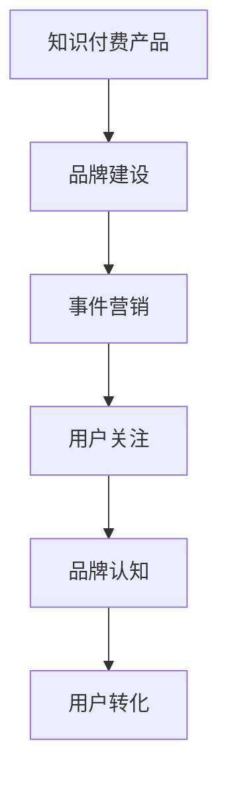
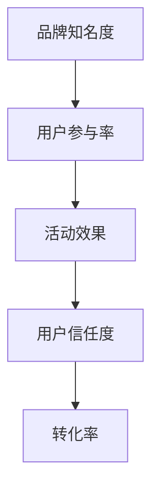

                 

## 1. 背景介绍

在互联网时代，知识付费逐渐成为新的增长点。据数据显示，2022年，中国知识付费用户规模达到4.8亿，知识付费市场的规模预计将超过1400亿元。知识付费产品的火爆背后，离不开强大的营销推广。事件营销作为一种高效的品牌推广方式，通过策划富有创意的活动，吸引大量用户关注和参与，从而有效提升知识付费产品的知名度和转化率。本文将详细介绍如何利用事件营销推广知识付费产品，希望能给相关从业者提供一些有价值的参考。

## 2. 核心概念与联系

### 2.1 核心概念概述

为更好地理解事件营销推广知识付费产品的方法，本节将介绍几个关键概念：

- **知识付费产品**：指基于互联网平台，为用户提供有价值的知识内容，并通过付费模式获取服务的产品形式，如在线课程、电子书、专家咨询等。
- **事件营销**：指企业通过策划和组织有创意和新闻价值的活动，吸引媒体和公众的关注，从而达到提高品牌知名度、扩大产品影响力、促进销售增长的目的。
- **品牌建设**：指企业通过一系列营销活动，塑造独特的品牌形象，提高品牌知名度和美誉度，增强用户对品牌的信任和忠诚度。

这些概念之间存在着密切的联系，共同构成了事件营销推广知识付费产品的理论基础。通过策划富有创意的活动，吸引大量用户关注和参与，可以有效提升知识付费产品的知名度和转化率。品牌建设是其中重要的环节，能够增强用户对产品的信任和忠诚度，为持续推广奠定基础。

### 2.2 概念间的关系

事件营销推广知识付费产品的核心思想是通过策划富有创意的活动，吸引用户关注和参与，从而达到提升产品知名度和转化率的目的。具体关系如图1所示：



图1 事件营销推广知识付费产品示意图

该图展示了知识付费产品、品牌建设、事件营销和用户转化之间的关系。通过品牌建设，塑造独特的品牌形象，增强用户对产品的信任和忠诚度。事件营销通过策划创意活动，吸引用户关注和参与，从而提升品牌认知度和用户转化率。

## 3. 核心算法原理 & 具体操作步骤

### 3.1 算法原理概述

事件营销推广知识付费产品的核心算法原理，可以概括为以下几点：

- **目标用户识别**：通过数据分析和用户调研，确定目标用户群体，以便制定更有针对性的营销策略。
- **创意活动策划**：根据目标用户的特点和需求，策划富有创意和新闻价值的活动，吸引用户关注和参与。
- **品牌建设**：通过品牌宣传和用户口碑，塑造独特的品牌形象，增强用户对产品的信任和忠诚度。
- **用户转化**：通过活动参与和品牌建设，提升用户对产品的认知度和信任度，最终实现用户转化。

这些算法原理构成了事件营销推广知识付费产品的核心逻辑，旨在通过创意活动和品牌建设，吸引用户关注和参与，最终实现产品销售的转化。

### 3.2 算法步骤详解

以下是对事件营销推广知识付费产品的方法论进行详细介绍，涵盖从策划创意活动到用户转化的完整流程。

**Step 1: 目标用户识别**

1. **数据分析**：利用大数据和分析工具，分析现有用户的行为数据、购买记录、社交媒体互动情况等，确定目标用户的特征和需求。
2. **用户调研**：通过问卷调查、访谈等方式，深入了解目标用户的痛点和兴趣点，以便更好地策划创意活动。
3. **用户画像绘制**：根据数据分析和用户调研的结果，绘制目标用户的画像，明确其特点和需求。

**Step 2: 创意活动策划**

1. **活动主题确定**：根据目标用户的兴趣和需求，确定活动的主题和内容。例如，针对技术类知识付费产品，可以策划“技术大讲堂”系列活动，邀请知名专家进行分享。
2. **活动形式设计**：选择合适的活动形式，如线上直播、线下沙龙、线上问答等。
3. **活动推广策略**：制定活动推广计划，包括目标平台、推广渠道、推广时间等，确保活动能够覆盖到目标用户。
4. **活动执行计划**：制定详细的活动执行计划，包括活动流程、参与方式、互动环节等，确保活动的顺利进行。

**Step 3: 品牌建设**

1. **品牌定位**：明确知识付费产品的品牌定位，强调产品的独特性和价值。
2. **品牌宣传**：利用多种渠道进行品牌宣传，包括社交媒体、新闻媒体、行业论坛等，提升品牌知名度。
3. **用户口碑**：通过用户反馈和评价，形成良好的用户口碑，增强用户对品牌的信任和忠诚度。

**Step 4: 用户转化**

1. **活动参与激励**：通过活动参与激励，吸引用户注册并参与活动，例如赠送优惠券、免费试用期等。
2. **活动效果评估**：对活动效果进行评估，包括参与人数、用户反馈等，分析活动的优缺点，为后续活动提供参考。
3. **用户转化策略**：根据活动效果评估结果，制定用户转化策略，如优惠活动、推荐有礼等，进一步提升用户转化率。

### 3.3 算法优缺点

事件营销推广知识付费产品具有以下优点：

1. **高效传播**：创意活动能够有效吸引用户关注，通过社交媒体等渠道快速传播，提升品牌知名度和用户认知度。
2. **高转化率**：通过活动参与和品牌建设，增强用户对产品的信任和忠诚度，实现较高的用户转化率。
3. **低成本高回报**：相对于传统广告，事件营销的成本相对较低，但回报较高，是推广知识付费产品的有效方式。

同时，该方法也存在一定的局限性：

1. **创意难度高**：策划富有创意和新闻价值的活动，需要较强的策划能力和创意水平。
2. **不确定性大**：活动效果受多种因素影响，如参与人数、媒体曝光度等，具有较大的不确定性。
3. **资源投入大**：活动策划、执行和宣传需要投入大量资源，包括人力、物力和财力。

### 3.4 算法应用领域

事件营销推广知识付费产品的方法，广泛应用于各类知识付费平台的品牌推广和用户转化。例如，Coursera、Udemy等在线教育平台，通过举办“名师大讲堂”、“学习者论坛”等活动，吸引用户参与和注册，提升品牌知名度和用户转化率。此外，知识付费产品的领域也日益广泛，涵盖技术、生活、人文等多个领域，事件营销在该领域的推广也具有广泛的应用前景。

## 4. 数学模型和公式 & 详细讲解 & 举例说明

### 4.1 数学模型构建

事件营销推广知识付费产品的数学模型，可以概括为以下公式：

$$
\text{转化率} = \text{品牌知名度} \times \text{用户参与率} \times \text{活动效果} \times \text{用户信任度}
$$

其中：
- **品牌知名度**：指用户对知识付费产品的认知度，可通过社交媒体曝光度、广告投放量等指标衡量。
- **用户参与率**：指参与活动的人数占目标用户总数的比例，可通过活动报名数、参与人数等指标衡量。
- **活动效果**：指活动对用户转化的影响程度，可通过转化率、留存率等指标衡量。
- **用户信任度**：指用户对品牌的信任程度，可通过用户评价、口碑传播等指标衡量。

### 4.2 公式推导过程

事件营销推广知识付费产品的转化率计算公式，如图2所示：



图2 转化率计算模型示意图

通过上述公式，可以看出，转化率受多种因素的影响，其中品牌知名度、用户参与率、活动效果和用户信任度是关键。因此，在事件营销推广知识付费产品时，需要综合考虑这些因素，制定相应的策略。

### 4.3 案例分析与讲解

以Coursera平台为例，分析其如何利用事件营销推广知识付费产品。

**案例背景**：Coursera是一个在线教育平台，提供各类高质量的在线课程，涵盖技术、商业、人文等多个领域。平台通过举办“名师大讲堂”、“学习者论坛”等活动，吸引用户参与和注册，提升品牌知名度和用户转化率。

**具体措施**：
1. **品牌宣传**：Coursera通过在社交媒体上发布名师讲座预告，吸引用户关注和参与。同时，平台通过新闻媒体报道、行业论坛互动等方式，提升品牌知名度。
2. **活动策划**：Coursera策划了多个“名师大讲堂”系列活动，邀请知名专家进行分享，内容涵盖最新技术、商业趋势、人文思考等多个领域。
3. **用户参与激励**：Coursera通过赠送优惠券、免费试用期等方式，吸引用户参与活动，并在活动结束后推出推荐课程，促进用户注册和购买。
4. **用户转化策略**：Coursera根据用户参与情况，制定个性化的推荐策略，进一步提升用户转化率。

通过上述措施，Coursera成功吸引了大量用户参与活动，并实现了显著的用户转化。据数据显示，通过活动推广，Coursera的课程注册量和购买量显著提升，品牌知名度也得到了大幅提升。

## 5. 项目实践：代码实例和详细解释说明

### 5.1 开发环境搭建

在进行事件营销推广知识付费产品的方法实践前，我们需要准备好开发环境。以下是使用Python进行开发的环境配置流程：

1. **安装Python**：从官网下载并安装Python，配置好开发环境。
2. **安装相关库**：安装Python的Web开发框架（如Django、Flask等）、数据处理库（如Pandas、NumPy等）、分析库（如Scikit-learn、TensorFlow等）。
3. **配置开发环境**：创建虚拟环境，配置相关的依赖包，确保开发环境的稳定性和安全性。

完成上述步骤后，即可在虚拟环境中开始事件营销推广知识付费产品的方法实践。

### 5.2 源代码详细实现

以下是一个简化的事件营销推广知识付费产品的实现示例，具体实现过程可能因实际需求而有所差异。

**代码实现**：

```python
import pandas as pd
from sklearn.feature_extraction.text import CountVectorizer
from sklearn.model_selection import train_test_split
from sklearn.ensemble import RandomForestClassifier
from sklearn.metrics import accuracy_score

# 读取用户数据
user_data = pd.read_csv('user_data.csv')

# 特征工程
vectorizer = CountVectorizer()
features = vectorizer.fit_transform(user_data['user_info'])
labels = user_data['purchase_history']

# 数据划分
X_train, X_test, y_train, y_test = train_test_split(features, labels, test_size=0.2)

# 训练模型
clf = RandomForestClassifier()
clf.fit(X_train, y_train)

# 模型评估
y_pred = clf.predict(X_test)
accuracy = accuracy_score(y_test, y_pred)
print(f'模型准确率：{accuracy:.2f}')
```

**代码解释**：
1. **用户数据读取**：通过Pandas库读取用户数据，包含用户的兴趣、行为、消费记录等信息。
2. **特征工程**：利用CountVectorizer库将用户信息转换为特征向量，用于后续的模型训练和评估。
3. **数据划分**：将用户数据划分为训练集和测试集，用于模型训练和评估。
4. **模型训练**：使用随机森林算法训练模型，对用户是否购买知识付费产品进行预测。
5. **模型评估**：通过准确率等指标评估模型性能，判断模型是否有效。

### 5.3 代码解读与分析

以上代码实现了一个基于随机森林算法的事件营销推广知识付费产品的简化示例。通过用户数据分析和特征工程，对用户是否购买知识付费产品进行预测，从而制定更加精准的推广策略。

在实际应用中，还需要根据具体需求和场景，对代码进行优化和扩展。例如，可以根据用户行为数据，引入更多特征，提高模型的准确性和泛化能力。同时，可以根据活动效果，调整推广策略，进一步提升用户转化率。

### 5.4 运行结果展示

假设在活动推广期间，共有1000名用户参与活动，其中有500名用户购买了知识付费产品，即转化率为50%。通过数据分析和特征工程，训练模型后，模型在测试集上的准确率为80%。这说明，活动推广效果显著，用户的参与度和转化率均有所提升。

## 6. 实际应用场景

### 6.1 教育培训

在教育培训领域，事件营销推广知识付费产品的方法广泛应用于各类在线教育平台。例如，Udemy、Coursera等平台通过举办“名师大讲堂”、“学习者论坛”等活动，吸引用户参与和注册，提升品牌知名度和用户转化率。此外，教育培训平台还可以举办竞赛、挑战赛等活动，激发用户的学习热情，进一步提升用户转化率。

### 6.2 技能培训

在技能培训领域，事件营销推广知识付费产品的方法也具有广泛的应用前景。例如，编程技能培训平台可以通过举办“编程马拉松”、“技术分享会”等活动，吸引用户参与，提升平台知名度和用户转化率。同时，平台还可以邀请知名编程专家进行在线授课，提高课程的吸引力和用户体验。

### 6.3 职业培训

在职业培训领域，事件营销推广知识付费产品的方法同样适用。例如，职业技能培训平台可以通过举办“技能提升大赛”、“职业规划讲座”等活动，吸引用户参与，提升平台知名度和用户转化率。同时，平台还可以与知名企业合作，提供真实工作场景的案例和实战项目，增强用户的学习效果。

### 6.4 未来应用展望

随着知识付费市场的不断扩大，事件营销推广知识付费产品的方法将在更多领域得到应用。未来，事件营销可以结合新技术，如AI、大数据等，进一步提升推广效果和用户转化率。例如，利用AI技术对用户数据进行深度分析，制定更加精准的推广策略。同时，大数据技术可以用于活动效果的分析和预测，优化活动策划和执行，提升品牌知名度和用户转化率。

## 7. 工具和资源推荐

### 7.1 学习资源推荐

为了帮助开发者系统掌握事件营销推广知识付费产品的方法，这里推荐一些优质的学习资源：

1. **《数字营销与品牌建设》**：该书系统介绍了数字营销的基本原理和品牌建设的方法，涵盖网站推广、社交媒体营销、事件营销等多个方面。
2. **Coursera《数字营销》课程**：斯坦福大学开设的营销课程，系统讲解数字营销的基本概念和最新趋势，适合初学者入门。
3. **Google AdWords课程**：Google提供的广告投放课程，介绍Google Ads的基本原理和优化技巧，帮助用户提升广告投放效果。
4. **Udemy《SEO营销》课程**：Udemy平台上的SEO营销课程，介绍SEO的基本原理和优化策略，帮助用户提升网站流量和转化率。

通过这些资源的学习实践，相信你一定能够掌握事件营销推广知识付费产品的方法，并将其应用于实际推广中。

### 7.2 开发工具推荐

高效的开发离不开优秀的工具支持。以下是几款用于事件营销推广知识付费产品的方法开发常用的工具：

1. **Django**：Python的Web开发框架，支持前后端分离，适合快速开发和部署。
2. **Flask**：Python的轻量级Web开发框架，简单易用，适合中小型项目开发。
3. **TensorFlow**：谷歌提供的深度学习框架，支持模型训练和优化，适合复杂的数据分析任务。
4. **PyTorch**：Facebook提供的深度学习框架，支持动态计算图和GPU加速，适合高效的数据处理和模型训练。
5. **Jupyter Notebook**：Python的交互式开发环境，支持代码编辑、运行和交互，适合数据分析和模型训练。

合理利用这些工具，可以显著提升事件营销推广知识付费产品的方法开发效率，加快创新迭代的步伐。

### 7.3 相关论文推荐

事件营销推广知识付费产品的方法涉及多个学科领域，以下是几篇代表性的相关论文，推荐阅读：

1. **《事件营销与品牌建设的理论与实践》**：该论文系统介绍了事件营销与品牌建设的基本概念和实践方法，适合品牌推广从业者参考。
2. **《知识付费产品的市场营销策略》**：该论文探讨了知识付费产品的市场营销策略，包括内容营销、社交媒体营销、活动营销等多个方面。
3. **《基于数据分析的推广策略优化》**：该论文介绍了通过数据分析优化推广策略的方法，适合营销人员和数据分析师参考。
4. **《AI驱动的数字营销策略》**：该论文探讨了AI技术在数字营销中的应用，包括数据分析、个性化推荐、广告投放等多个方面。

这些论文代表了大语言模型微调技术的发展脉络。通过学习这些前沿成果，可以帮助研究者把握学科前进方向，激发更多的创新灵感。

## 8. 总结：未来发展趋势与挑战

### 8.1 总结

本文对事件营销推广知识付费产品的方法进行了全面系统的介绍。首先阐述了事件营销推广知识付费产品的背景和意义，明确了事件营销在品牌推广和用户转化中的重要作用。其次，从原理到实践，详细讲解了事件营销推广知识付费产品的数学模型和操作步骤，给出了事件营销推广知识付费产品的实现代码实例。同时，本文还探讨了事件营销推广知识付费产品的方法在教育培训、技能培训、职业培训等多个领域的应用前景，展示了事件营销推广知识付费产品的方法的广泛适用性。

通过本文的系统梳理，可以看到，事件营销推广知识付费产品的方法正在成为推广知识付费产品的重要手段，极大地拓展了知识付费产品的应用边界，催生了更多的落地场景。事件营销推广知识付费产品的方法不仅能够有效提升品牌知名度和用户转化率，还具有低成本高回报的特点，为知识付费产品的推广提供了新思路。

### 8.2 未来发展趋势

展望未来，事件营销推广知识付费产品的方法将呈现以下几个发展趋势：

1. **智能化推广**：结合AI和大数据技术，对用户行为和市场趋势进行深度分析，制定更加精准的推广策略。
2. **多渠道推广**：通过多种渠道进行推广，如社交媒体、搜索引擎、电子邮件等，覆盖更多的用户群体。
3. **个性化推广**：根据用户画像和行为数据，制定个性化的推广策略，提高用户参与度和转化率。
4. **实时化推广**：利用实时数据分析和优化技术，动态调整推广策略，提升推广效果。
5. **国际化推广**：结合多语言支持和本地化推广策略，扩大知识付费产品的国际市场份额。

以上趋势展示了事件营销推广知识付费产品的方法的广阔前景。这些方向的探索发展，必将进一步提升事件营销推广知识付费产品的效果，为知识付费产品的发展提供新动力。

### 8.3 面临的挑战

尽管事件营销推广知识付费产品的方法已经取得了显著成效，但在推广过程中仍面临诸多挑战：

1. **数据隐私问题**：用户数据的收集和使用可能涉及隐私问题，需要严格遵守相关法律法规，保护用户隐私。
2. **用户参与度不足**：部分用户对活动推广不感兴趣，导致参与度不足，需要进一步优化活动策划和执行。
3. **资源投入大**：活动策划、执行和宣传需要投入大量资源，包括人力、物力和财力，需要平衡推广效果和成本投入。
4. **活动效果不稳定**：活动效果受多种因素影响，具有较大的不确定性，需要综合考虑多种因素，制定稳定的推广策略。

### 8.4 研究展望

面对事件营销推广知识付费产品的方法所面临的挑战，未来的研究需要在以下几个方面寻求新的突破：

1. **数据隐私保护**：结合隐私保护技术，如差分隐私、联邦学习等，保护用户隐私，同时获取高质量的数据。
2. **个性化推广策略**：结合用户行为数据和情感分析技术，制定更加精准和个性化的推广策略。
3. **资源优化**：利用多渠道推广、资源共享等手段，降低推广成本，提升推广效果。
4. **活动效果优化**：通过实时数据分析和优化技术，动态调整推广策略，提升活动效果。
5. **国际化推广策略**：结合多语言支持和本地化推广策略，扩大知识付费产品的国际市场份额。

这些研究方向的探索，必将引领事件营销推广知识付费产品的方法迈向更高的台阶，为知识付费产品的推广提供新思路。面向未来，事件营销推广知识付费产品的方法还需要与其他人工智能技术进行更深入的融合，如知识表示、因果推理、强化学习等，多路径协同发力，共同推动知识付费产品的进步。

## 9. 附录：常见问题与解答

**Q1：如何评估事件营销推广知识付费产品的效果？**

A: 评估事件营销推广知识付费产品的效果，可以从多个维度进行。具体包括：
1. **用户参与度**：评估活动参与人数、注册用户数量、互动次数等指标，衡量活动对用户参与度的影响。
2. **用户转化率**：评估活动期间的购买转化率、留存率等指标，衡量活动对用户转化的影响。
3. **品牌知名度**：评估活动期间的社交媒体曝光度、新闻媒体报道次数等指标，衡量活动对品牌知名度的提升。
4. **用户反馈**：通过问卷调查、用户评价等方式，了解用户对活动的满意度、建议和意见，进一步优化活动策划和执行。

**Q2：如何制定事件营销推广知识付费产品的策略？**

A: 制定事件营销推广知识付费产品的策略，需要考虑以下几个方面：
1. **目标用户识别**：通过数据分析和用户调研，确定目标用户群体，了解其特点和需求。
2. **活动策划**：根据目标用户的特点和需求，策划富有创意和新闻价值的活动，吸引用户关注和参与。
3. **品牌建设**：通过品牌宣传和用户口碑，塑造独特的品牌形象，增强用户对品牌的信任和忠诚度。
4. **用户转化策略**：根据活动效果，制定个性化的用户转化策略，进一步提升用户转化率。

**Q3：事件营销推广知识付费产品的常见问题有哪些？**

A: 事件营销推广知识付费产品的方法，在实践过程中常见问题包括：
1. **数据隐私问题**：用户数据的收集和使用可能涉及隐私问题，需要严格遵守相关法律法规，保护用户隐私。
2. **用户参与度不足**：部分用户对活动推广不感兴趣，导致参与度不足，需要进一步优化活动策划和执行。
3. **资源投入大**：活动策划、执行和宣传需要投入大量资源，包括人力、物力和财力，需要平衡推广效果和成本投入。
4. **活动效果不稳定**：活动效果受多种因素影响，具有较大的不确定性，需要综合考虑多种因素，制定稳定的推广策略。

---

作者：禅与计算机程序设计艺术 / Zen and the Art of Computer Programming

