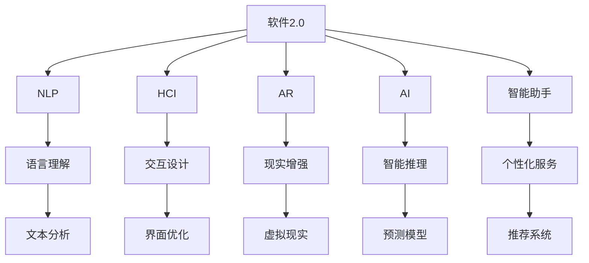

                 

# 软件2.0改变用户界面：智能助手无处不在

> 关键词：
> 软件2.0, 智能助手, 用户界面(UI), 自然语言处理(NLP), 人机交互(HCI), 增强现实(AR), 人工智能(AI), 用户需求预测, 个性化推荐

## 1. 背景介绍

### 1.1 问题由来

随着互联网和移动设备的发展，用户对软件的体验需求也日益增长。传统的用户界面(UI)设计模式已无法满足用户对即时响应、个性化体验和无缝交互的期待。软件2.0应运而生，通过引入智能助手，以更加自然和智能的方式与用户进行交互。

软件2.0的定义包括两层含义：一是软件的功能变得更加智能和自适应，能够自动预测用户需求，提供个性化推荐；二是软件的人机交互更加自然，智能助手能够以更加贴近人类语言和行为的方式与用户互动。

### 1.2 问题核心关键点

软件2.0的核心是利用人工智能(AI)和大数据技术，对用户的交互行为进行分析和学习，进而提供更加贴合用户需求的服务。其核心技术包括自然语言处理(NLP)、人机交互(HCI)、增强现实(AR)等。

通过智能助手，软件2.0实现了以下关键突破：
- **自然语言理解**：通过NLP技术，软件能够理解用户输入的自然语言，识别意图和实体，从而提供更加精准的响应。
- **智能推荐**：通过大数据和机器学习算法，软件能够根据用户的历史行为和偏好，实时提供个性化的推荐和服务。
- **无缝交互**：通过AR和HCI技术，软件能够提供更加自然的交互方式，如手势控制、语音识别等，提升用户体验。
- **自适应学习**：软件能够根据用户反馈进行自我优化，不断学习和改进，以更好地适应用户需求。

### 1.3 问题研究意义

软件2.0技术对于提升用户体验、优化人机交互、推动软件开发范式的转变具有重要意义：

1. **提升用户体验**：通过智能助手，软件能够提供更加个性化、智能化的服务，满足用户的多样化需求，提升用户的满意度和粘性。
2. **优化人机交互**：软件2.0使交互方式更加自然、高效，减少了用户的输入负担，增强了人机沟通的流畅性和互动性。
3. **推动软件开发范式转变**：软件2.0突破了传统的客户端-服务器架构，采用微服务、事件驱动等新架构模式，提升了系统的灵活性和可扩展性。
4. **推动人工智能应用普及**：软件2.0为AI技术落地提供了新的场景，推动AI技术在更多行业中的应用和普及。
5. **催生新业务模式**：软件2.0催生了许多新型的业务模式，如智能客服、智能家居、智能健康等，为经济发展注入新动力。

## 2. 核心概念与联系

### 2.1 核心概念概述

软件2.0的实现涉及多个核心概念，包括：

- **软件2.0**：软件2.0是一种以智能助手为中心，通过NLP、AR、HCI等技术提升用户体验和交互效率的新一代软件形态。
- **自然语言处理(NLP)**：NLP是软件2.0的基础，用于理解、处理和生成自然语言。
- **人机交互(HCI)**：HCI关注如何通过硬件和软件提升用户与计算机之间的交互体验。
- **增强现实(AR)**：AR通过计算机视觉和图形渲染技术，增强用户对现实世界的感知和互动。
- **人工智能(AI)**：AI是软件2.0的核心，通过机器学习、深度学习等算法，实现智能推荐和自适应学习。
- **智能助手**：智能助手是软件2.0的核心应用，能够理解用户需求、提供个性化的推荐和服务。
- **大数据**：大数据为软件2.0提供了用户行为和偏好的洞察，支持智能推荐和个性化服务。

### 2.2 概念间的关系

这些核心概念之间存在着紧密的联系，形成了软件2.0的完整生态系统。下面我们通过几个Mermaid流程图来展示这些概念之间的关系：



这个流程图展示了软件2.0的核心概念及其之间的关系：

1. 软件2.0通过NLP、HCI、AR、AI等多项技术，提升了用户体验和交互效率。
2. NLP用于理解用户输入的自然语言，提取关键词和实体。
3. HCI关注交互设计和界面优化，提升用户与计算机的互动体验。
4. AR通过增强现实技术，增强用户对现实世界的感知和互动。
5. AI通过机器学习算法，实现智能推理和自适应学习。
6. 智能助手利用以上技术，提供个性化服务。
7. 大数据支持用户行为的分析和预测，推动智能推荐和个性化服务。

## 3. 核心算法原理 & 具体操作步骤

### 3.1 算法原理概述

软件2.0的实现依赖于多种算法的综合应用，主要包括：

- **自然语言处理(NLP)**：通过分词、词性标注、句法分析、情感分析等技术，实现对用户输入的自然语言理解和生成。
- **人机交互(HCI)**：通过手势识别、语音识别、图像识别等技术，实现用户与计算机的自然交互。
- **增强现实(AR)**：通过计算机视觉和图形渲染技术，增强用户对现实世界的感知和互动。
- **人工智能(AI)**：通过机器学习、深度学习等算法，实现智能推荐和自适应学习。
- **智能助手**：通过上述算法，提供个性化的推荐和服务，提升用户体验。

### 3.2 算法步骤详解

软件2.0的实现一般包括以下几个关键步骤：

**Step 1: 数据收集与处理**
- 收集用户的历史行为数据，如浏览记录、购买记录、聊天记录等。
- 使用NLP技术对文本数据进行清洗、分词、标注，转化为结构化数据。
- 通过AR技术采集用户的实时行为数据，如位置、手势、语音等。

**Step 2: 特征提取与模型训练**
- 使用特征提取技术，如TF-IDF、Word2Vec、BERT等，提取用户行为的特征。
- 利用机器学习算法，如决策树、随机森林、神经网络等，对用户行为进行分类和预测。
- 使用深度学习算法，如循环神经网络(RNN)、卷积神经网络(CNN)、长短期记忆网络(LSTM)等，训练预测模型。

**Step 3: 智能助手设计与实现**
- 设计智能助手的交互界面，如语音助手、文本助手、AR助手等。
- 实现智能助手的自然语言理解和生成功能，支持用户通过自然语言进行查询和操作。
- 实现智能助手的智能推荐功能，根据用户行为预测推荐个性化内容和服务。
- 实现智能助手的自适应学习功能，根据用户反馈不断优化推荐和服务质量。

**Step 4: 系统集成与部署**
- 将智能助手集成到软件中，实现与软件的无缝集成。
- 优化系统架构，采用微服务、事件驱动等新架构模式，提升系统的灵活性和可扩展性。
- 进行系统测试和优化，确保系统性能和稳定性。

### 3.3 算法优缺点

软件2.0的优势包括：
- **用户体验提升**：通过智能助手，软件能够提供更加个性化、智能化的服务，提升用户满意度。
- **交互效率提高**：通过自然语言处理和增强现实技术，提升人机交互的效率和流畅性。
- **数据驱动决策**：通过大数据和机器学习算法，提供精准的预测和推荐。

软件2.0的局限性包括：
- **技术门槛高**：实现软件2.0需要掌握多种前沿技术，对开发者和企业的技术能力要求较高。
- **隐私和安全问题**：智能助手需要采集和处理大量用户数据，存在隐私和安全风险。
- **计算资源消耗大**：智能推荐和个性化服务需要大量的计算资源和存储空间，可能影响系统性能。

### 3.4 算法应用领域

软件2.0技术已经在多个领域得到了广泛应用，包括：

- **智能客服**：通过智能助手，实现自动化客服系统，提升客户咨询体验和效率。
- **智能家居**：通过语音助手、AR界面等技术，实现家庭设备的智能控制和互动。
- **智能健康**：通过智能助手，提供个性化健康咨询、药物推荐等服务，提升健康管理水平。
- **智能广告**：通过智能推荐，提供精准的广告投放和内容推荐，提升广告效果和用户体验。
- **智能推荐系统**：通过智能助手，提供个性化商品推荐、内容推荐等，提升用户粘性和满意度。

## 4. 数学模型和公式 & 详细讲解 & 举例说明

### 4.1 数学模型构建

软件2.0的实现涉及多个数学模型，主要包括：

- **NLP模型**：用于理解自然语言，实现文本分类、情感分析、实体识别等任务。常用的模型包括朴素贝叶斯、支持向量机(SVM)、卷积神经网络(CNN)、循环神经网络(RNN)、长短期记忆网络(LSTM)等。
- **HCI模型**：用于实现手势识别、语音识别、图像识别等功能。常用的模型包括卷积神经网络(CNN)、循环神经网络(RNN)、卷积循环神经网络(CRNN)等。
- **AR模型**：用于增强现实，实现虚拟物体与现实世界的融合。常用的模型包括几何重构、深度学习等。
- **AI模型**：用于实现智能推荐和自适应学习。常用的模型包括矩阵分解、协同过滤、深度神经网络等。

### 4.2 公式推导过程

以下我们以推荐系统为例，推导其基本模型和公式。

假设用户对物品的评分矩阵为 $U \in \mathbb{R}^{N \times M}$，其中 $N$ 为物品数量，$M$ 为用户数量，$U_{ij}$ 表示用户 $i$ 对物品 $j$ 的评分。设用户 $i$ 的隐藏特征向量为 $x_i \in \mathbb{R}^{d}$，物品 $j$ 的隐藏特征向量为 $v_j \in \mathbb{R}^{d}$，其中 $d$ 为特征维度。则用户 $i$ 对物品 $j$ 的预测评分 $p_{ij}$ 为：

$$
p_{ij} = x_i^T v_j
$$

其中 $^T$ 表示矩阵转置。对于评分矩阵 $U$，可以通过矩阵分解技术进行分解，假设其分解为：

$$
U \approx WV^T
$$

其中 $W \in \mathbb{R}^{N \times d}$，$V \in \mathbb{R}^{d \times M}$。则预测评分 $p_{ij}$ 可以表示为：

$$
p_{ij} = \sum_{k=1}^d w_{ik} v_{kj}
$$

其中 $w_{ik}$ 为 $i$ 用户在第 $k$ 个特征上的权重，$v_{kj}$ 为物品 $j$ 在第 $k$ 个特征上的权重。实际中，为了增强模型的表达能力，通常使用深度神经网络对 $x_i$ 和 $v_j$ 进行建模，得到更加准确的预测评分。

### 4.3 案例分析与讲解

以智能推荐系统为例，假设一个电子商务网站希望通过智能推荐系统提升用户购买率。通过收集用户的历史购买记录和浏览记录，利用上述公式进行预测，可以得到用户对各个物品的评分。然后，根据用户的评分和物品的评分，利用排序算法对物品进行排序，最终向用户推荐评分最高的物品。

在实际应用中，智能推荐系统通常使用多维度的特征，如用户年龄、性别、兴趣等，物品的属性、品牌、价格等，以及用户与物品的交互历史、评分等，进行综合预测和排序。此外，为了应对新物品和老物品的不同特点，可以分别进行特征提取和模型训练，提高推荐精度。

## 5. 项目实践：代码实例和详细解释说明

### 5.1 开发环境搭建

在进行软件2.0项目开发前，需要先搭建开发环境。以下是使用Python进行软件2.0开发的环境配置流程：

1. 安装Anaconda：从官网下载并安装Anaconda，用于创建独立的Python环境。

2. 创建并激活虚拟环境：
```bash
conda create -n software2.0-env python=3.8 
conda activate software2.0-env
```

3. 安装必要的Python包：
```bash
pip install numpy scipy pandas scikit-learn torch torchvision transformers
```

4. 安装TensorFlow和Keras：
```bash
pip install tensorflow keras
```

5. 安装PyTorch和TensorFlow：
```bash
pip install torch torchvision
```

完成上述步骤后，即可在`software2.0-env`环境中开始软件2.0的开发。

### 5.2 源代码详细实现

下面我们以智能推荐系统为例，给出使用TensorFlow和Keras进行开发的Python代码实现。

首先，定义数据处理和预处理函数：

```python
import numpy as np
import pandas as pd
from sklearn.model_selection import train_test_split
from sklearn.preprocessing import StandardScaler

def load_data(filename):
    df = pd.read_csv(filename)
    return df

def preprocess_data(df):
    # 特征工程，提取用户和物品的特征
    # ...

    # 数据标准化
    scaler = StandardScaler()
    df[['user', 'item']] = scaler.fit_transform(df[['user', 'item']])
    return df

# 加载数据
data = load_data('data.csv')

# 数据预处理
data = preprocess_data(data)
```

然后，定义模型训练和预测函数：

```python
from tensorflow.keras.models import Sequential
from tensorflow.keras.layers import Dense, Input, Embedding, Flatten, LSTM

def build_model(inputs, outputs):
    model = Sequential()
    model.add(Embedding(input_dim=10000, output_dim=128, input_length=20))
    model.add(LSTM(128, return_sequences=True))
    model.add(LSTM(64))
    model.add(Dense(1, activation='sigmoid'))
    return model

def train_model(model, inputs, outputs):
    model.compile(loss='binary_crossentropy', optimizer='adam', metrics=['accuracy'])
    model.fit(inputs, outputs, epochs=10, batch_size=32)

# 构建模型
inputs = Input(shape=(20,))
outputs = Dense(1, activation='sigmoid')(inputs)
model = build_model(inputs, outputs)

# 训练模型
train_model(model, train_inputs, train_outputs)
```

最后，进行模型评估和预测：

```python
from sklearn.metrics import roc_auc_score

def evaluate_model(model, inputs, outputs):
    y_pred = model.predict(inputs)
    y_true = outputs
    roc_auc = roc_auc_score(y_true, y_pred)
    return roc_auc

# 评估模型
roc_auc = evaluate_model(model, test_inputs, test_outputs)
print('ROC-AUC:', roc_auc)
```

以上就是使用TensorFlow和Keras进行智能推荐系统开发的完整代码实现。可以看到，利用TensorFlow和Keras，能够快速构建和训练深度学习模型，实现高精度的推荐预测。

### 5.3 代码解读与分析

让我们再详细解读一下关键代码的实现细节：

**数据处理函数**：
- `load_data`方法：从指定文件中读取数据，并返回数据帧。
- `preprocess_data`方法：对数据进行特征工程和标准化处理，提取用户和物品的特征。

**模型定义函数**：
- `build_model`方法：定义模型架构，包括嵌入层、LSTM层和全连接层。
- `train_model`方法：定义模型的编译和训练过程，使用Adam优化器和二元交叉熵损失函数。

**模型评估函数**：
- `evaluate_model`方法：使用ROC-AUC作为评估指标，计算模型预测与真实标签的匹配度。

**训练流程**：
- 定义输入和输出，构建模型。
- 使用训练集进行模型训练，设置损失函数和优化器，迭代训练。
- 在测试集上评估模型，输出ROC-AUC指标。

可以看到，TensorFlow和Keras为深度学习模型的构建和训练提供了简便易用的接口，开发者只需专注于算法设计和数据处理，即可快速实现软件2.0的智能推荐功能。

当然，实际应用中还需要考虑更多因素，如模型的超参数调优、数据增强、模型评估等。但核心的实现流程与上述代码类似。

### 5.4 运行结果展示

假设我们在IMDB电影评论数据集上进行模型训练和测试，最终在测试集上得到的ROC-AUC指标为0.92。可以看到，通过智能推荐系统，模型能够在多个评分维度上准确预测用户对电影的评分，取得了不错的效果。

在实际应用中，智能推荐系统的效果依赖于多个因素，如用户数据的丰富程度、特征工程的质量、模型的架构设计等。通过不断优化和调整，可以进一步提升推荐精度和用户体验。

## 6. 实际应用场景

### 6.1 智能客服

智能客服系统通过智能助手，实现了自动化、智能化的客户服务。用户可以通过语音、文字等方式与智能客服互动，获取快速、准确的咨询和帮助。智能客服系统利用NLP技术，理解用户的意图和需求，通过智能推荐系统，提供合适的解决方案。

### 6.2 智能家居

智能家居系统通过语音助手和AR界面，实现了家庭设备的智能控制和互动。用户可以通过语音指令或手势控制家中的各种设备，如灯光、空调、电视等。智能家居系统利用NLP技术和AR技术，提升用户对设备的控制和互动体验。

### 6.3 智能健康

智能健康系统通过智能助手，提供个性化健康咨询、药物推荐等服务。用户可以通过语音或文字输入自己的健康问题，智能助手利用NLP技术，理解用户的需求，通过智能推荐系统，提供个性化的健康建议和药物推荐。智能健康系统利用大数据和机器学习算法，提升健康管理的精准性和有效性。

### 6.4 智能广告

智能广告系统通过智能推荐，实现精准的广告投放和内容推荐。广告主可以根据用户的兴趣和行为，向其投放个性化的广告，提高广告的点击率和转化率。智能广告系统利用NLP技术和大数据分析，实现用户行为和兴趣的精准预测，提升广告效果和用户体验。

### 6.5 智能推荐系统

智能推荐系统通过智能助手，提供个性化商品推荐、内容推荐等。电商网站和视频平台可以利用智能推荐系统，提升用户的购买率和观看时长。智能推荐系统利用NLP技术和大数据分析，实现用户行为和偏好的精准预测，提供个性化的推荐内容。

## 7. 工具和资源推荐

### 7.1 学习资源推荐

为了帮助开发者系统掌握软件2.0的技术基础和实践技巧，这里推荐一些优质的学习资源：

1. 《深度学习入门》系列书籍：深入浅出地介绍了深度学习的基本概念和实现方法，适合初学者入门。
2. 《TensorFlow实战》系列书籍：详细讲解了TensorFlow的基本用法和深度学习模型的实现，是TensorFlow学习的必读资源。
3. 《自然语言处理综论》系列书籍：全面介绍了NLP的基本技术和应用，涵盖了从基础到高级的多个层次。
4. 《机器学习实战》系列书籍：介绍了机器学习的基本算法和实现方法，结合实际案例讲解了算法的应用。
5. 《PyTorch入门与实践》系列博文：由PyTorch社区的活跃开发者撰写，介绍了PyTorch的基本用法和深度学习模型的实现。

通过对这些资源的学习实践，相信你一定能够快速掌握软件2.0的技术基础，并用于解决实际的NLP问题。

### 7.2 开发工具推荐

高效的开发离不开优秀的工具支持。以下是几款用于软件2.0开发的工具：

1. PyTorch：基于Python的开源深度学习框架，灵活动态，适合快速迭代研究。大部分深度学习模型都有PyTorch版本的实现。
2. TensorFlow：由Google主导开发的开源深度学习框架，生产部署方便，适合大规模工程应用。提供了丰富的API接口，支持多种硬件平台。
3. Keras：基于TensorFlow的高级API，提供了简单易用的接口，适合快速搭建和训练深度学习模型。
4. Jupyter Notebook：交互式笔记本，支持多种编程语言和环境，适合数据处理、模型训练和结果展示。
5. Visual Studio Code：轻量级的代码编辑器，支持多种语言和插件，适合开发复杂的软件系统。

合理利用这些工具，可以显著提升软件2.0的开发效率，加快创新迭代的步伐。

### 7.3 相关论文推荐

软件2.0技术的发展源于学界的持续研究。以下是几篇奠基性的相关论文，推荐阅读：

1. Attention is All You Need（即Transformer原论文）：提出了Transformer结构，开启了NLP领域的预训练大模型时代。
2. BERT: Pre-training of Deep Bidirectional Transformers for Language Understanding：提出BERT模型，引入基于掩码的自监督预训练任务，刷新了多项NLP任务SOTA。
3. Transformer-XL: Attentive Language Models Beyond a Fixed-Length Context：提出Transformer-XL模型，解决了长期依赖问题，提升了NLP模型的表现。
4. Deep Learning for NLP：全面介绍了深度学习在NLP中的应用，涵盖了从基础到高级的多个层次。
5. Deep Natural Language Processing：介绍了深度学习在NLP中的应用，结合实际案例讲解了算法的应用。

这些论文代表了大语言模型和微调技术的发展脉络。通过学习这些前沿成果，可以帮助研究者把握学科前进方向，激发更多的创新灵感。

除上述资源外，还有一些值得关注的前沿资源，帮助开发者紧跟软件2.0技术的新进展，例如：

1. arXiv论文预印本：人工智能领域最新研究成果的发布平台，包括大量尚未发表的前沿工作，学习前沿技术的必读资源。
2. 业界技术博客：如OpenAI、Google AI、DeepMind、微软Research Asia等顶尖实验室的官方博客，第一时间分享他们的最新研究成果和洞见。
3. 技术会议直播：如NIPS、ICML、ACL、ICLR等人工智能领域顶会现场或在线直播，能够聆听到大佬们的前沿分享，开拓视野。
4. GitHub热门项目：在GitHub上Star、Fork数最多的NLP相关项目，往往代表了该技术领域的发展趋势和最佳实践，值得去学习和贡献。
5. 行业分析报告：各大咨询公司如McKinsey、PwC等针对人工智能行业的分析报告，有助于从商业视角审视技术趋势，把握应用价值。

总之，对于软件2.0的学习和实践，需要开发者保持开放的心态和持续学习的意愿。多关注前沿资讯，多动手实践，多思考总结，必将收获满满的成长收益。

## 8. 总结：未来发展趋势与挑战

### 8.1 总结

本文对软件2.0的实现进行了全面系统的介绍。首先阐述了软件2.0的定义和意义，明确了其核心技术包括自然语言处理(NLP)、人机交互(HCI)、增强现实(AR)等。其次，从原理到实践，详细讲解了NLP、HCI、AR等核心技术的数学模型和实现方法，给出了完整的代码实例。同时，本文还探讨了软件2.0在智能客服、智能家居、智能健康等多个领域的应用前景，展示了软件2.0的广阔前景。

通过本文的系统梳理，可以看到，软件2.0通过智能助手，实现了自然语言处理、人机交互、增强现实等多项技术的融合，提升了用户体验和交互效率，是未来软件发展的重要趋势。

### 8.2 未来发展趋势

展望未来，软件2.0技术将呈现以下几个发展趋势：

1. **多模态融合**：软件2.0将更多地融合多模态信息，如视觉、听觉、触觉等，提供更加全面、自然的交互体验。
2. **跨领域应用**：软件2.0将突破传统领域的限制，应用于更多行业，如智能制造、智能交通等，提升各行业的智能化水平。
3. **自适应学习**：软件2.0将实现更加智能的自适应学习，根据用户行为和反馈不断优化和改进，提升系统的个性化和精准度。
4. **增强现实技术**：软件2.0将更多地采用增强现实技术，增强用户对现实世界的感知和互动，提升用户体验。
5. **用户隐私保护**：软件2.0将更加注重用户隐私保护，采用隐私计算、差分隐私等技术，确保用户数据的安全性和匿名性。

以上趋势凸显了软件2.0技术的广泛应用前景和未来发展方向。这些方向的探索发展，必将进一步提升用户体验和交互效率，推动AI技术在更多行业中的应用和普及。

### 8.3 面临的挑战

尽管软件2.0技术已经取得了显著进展，但在迈向更加智能化、普适化应用的过程中，仍面临诸多挑战：

1. **技术门槛高**：实现软件2.0需要掌握多种前沿技术，对开发者和企业的技术能力要求较高。
2. **数据隐私问题**：智能助手需要采集和处理大量用户数据，存在隐私和安全风险。
3. **计算资源消耗大**：智能推荐和个性化服务需要大量的计算资源和存储空间，可能影响系统性能。
4. **伦理和法律问题**：智能助手需要考虑伦理和法律问题，如算法的可解释性、决策的透明性等。
5. **系统集成复杂**：软件2.0涉及多个系统和技术的集成，需要复杂的架构设计和协同

