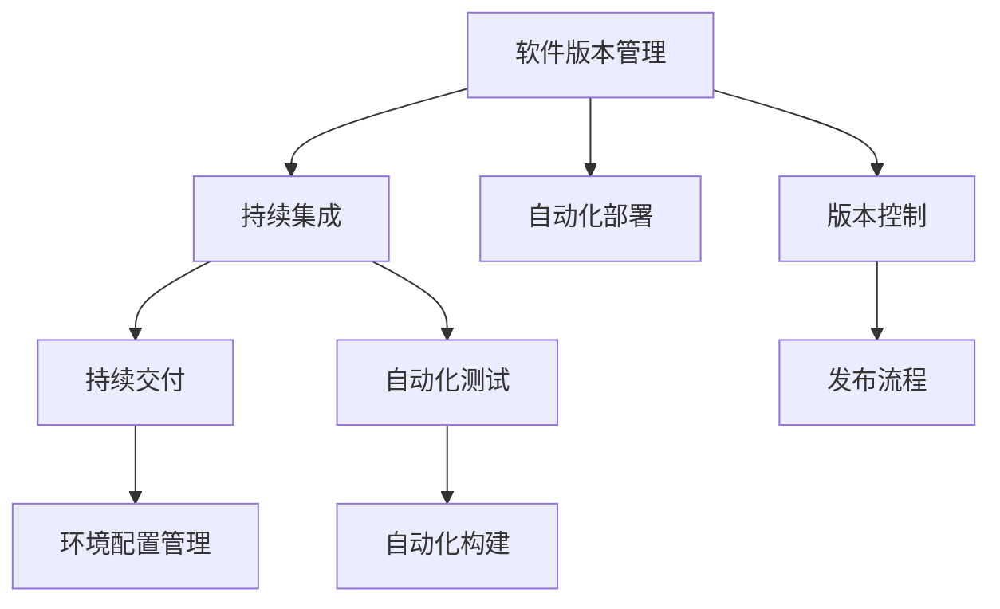
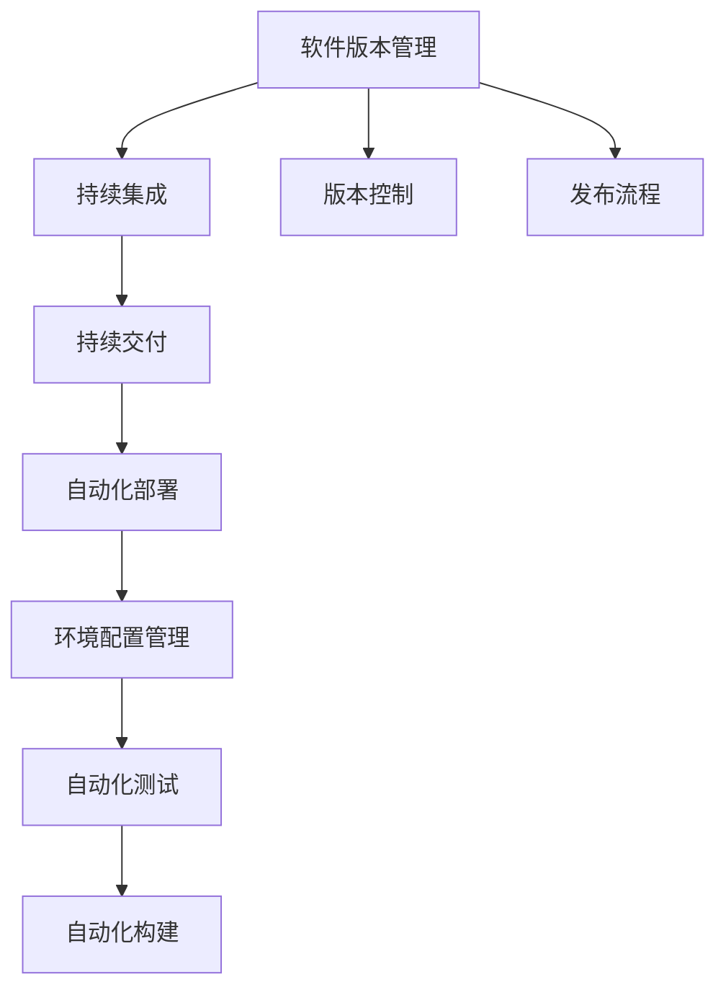

                 

## 1. 背景介绍

### 1.1 问题由来

在软件工程领域，版本管理和发布策略是确保软件产品稳定性和可靠性的重要环节。随着软件开发模式的演进，传统的单体应用架构逐渐向微服务、分布式系统过渡，软件的复杂性和规模不断扩大，对版本管理与发布提出了更高的要求。现代软件开发实践中，版本管理和发布成为持续集成（CI）和持续交付（CD）的基础。

然而，由于缺乏科学、系统的版本管理与发布策略，很多软件项目在发布过程中出现各种问题，如回滚困难、功能冲突、性能问题等，影响了软件质量和用户体验。

### 1.2 问题核心关键点

软件版本管理和发布的核心在于：

- 如何有效地管理软件不同版本，确保各版本之间的稳定兼容性和可追溯性。
- 如何制定合理的发布计划，确保发布过程的顺利进行，及时回滚和修复问题，提升发布效率。

## 2. 核心概念与联系

### 2.1 核心概念概述

为更好地理解软件2.0的版本管理和发布策略，本节将介绍几个关键概念及其关系：

- **软件版本管理**：指对软件不同版本进行记录、管理、对比、跟踪和发布的过程，确保软件在不同阶段的状态可追溯，避免版本冲突。
- **持续集成和持续交付**：通过自动化测试和发布流程，提高软件交付速度和质量，减少人为错误。
- **自动化部署**：通过脚本、容器化等技术，自动完成软件部署和配置，提高部署效率和一致性。
- **环境配置管理**：通过配置管理工具，统一和自动化环境配置，避免手动配置带来的错误。

这些概念通过以下Mermaid流程图进行展示：



从图中可以看出，软件版本管理是整个发布策略的基础，与持续集成、持续交付、自动化部署和环境配置管理等紧密相关。持续集成和持续交付通过自动化测试和构建，提高发布效率和质量；自动化部署和环境配置管理则确保发布过程的顺利进行。

### 2.2 概念间的关系

通过上述关系图，可以清晰地理解各个概念之间的联系。以下进一步详细介绍：

- **版本控制与软件版本管理**：版本控制（如Git）提供了软件不同版本的记录和追踪能力，是软件版本管理的基础。
- **持续集成与持续交付**：持续集成通过自动化测试和构建，确保软件质量；持续交付通过自动化部署，提高交付速度和一致性。
- **自动化部署与环境配置管理**：自动化部署通过脚本和容器化技术，自动完成软件部署和配置；环境配置管理则通过配置管理工具，统一和自动化环境配置。
- **自动化测试与持续集成**：自动化测试是持续集成的关键环节，确保软件质量的稳定性。
- **发布流程与持续交付**：发布流程是持续交付的核心，通过自动化测试和部署，确保软件稳定发布。

### 2.3 核心概念的整体架构

最终，我们将通过一个综合的流程图展示这些核心概念的整体架构：



## 3. 核心算法原理 & 具体操作步骤
### 3.1 算法原理概述

软件2.0的版本管理和发布策略主要依赖于以下算法和步骤：

- **版本控制**：通过版本控制系统（如Git）对软件不同版本进行管理，确保各版本之间的稳定兼容性和可追溯性。
- **持续集成**：通过自动化构建和测试流程，及时发现和修复代码错误，提高软件质量。
- **持续交付**：通过自动化部署流程，确保软件稳定发布，减少人为错误。
- **环境配置管理**：通过配置管理工具，统一和自动化环境配置，避免手动配置带来的错误。

### 3.2 算法步骤详解

软件2.0的版本管理和发布策略主要包括以下几个关键步骤：

**Step 1: 准备版本控制系统**

- 选择适合的版本控制系统（如Git），配置仓库和用户权限。
- 创建分支管理策略，定义开发、测试、生产等分支，明确代码合并流程。

**Step 2: 实施持续集成**

- 集成开发环境（IDE）与版本控制系统，自动检测代码变更。
- 定义构建脚本，通过CI工具（如Jenkins、GitLab CI等）自动化构建和测试。
- 配置自动化测试流程，覆盖单元测试、集成测试、功能测试等，确保软件质量。

**Step 3: 实施持续交付**

- 集成CI工具与自动化部署工具（如Jenkins、GitLab CI、Docker等），自动化构建和部署。
- 定义发布流程，包括测试环境、预发布环境、生产环境的配置和验证。
- 配置回滚机制，确保发布过程中出现问题的及时回滚和修复。

**Step 4: 实施环境配置管理**

- 定义环境配置规范，统一环境变量、依赖库、数据库配置等。
- 使用配置管理工具（如Ansible、Puppet、Chef等）自动化配置环境。
- 配置监控和告警系统，实时监控环境状态，及时发现和修复问题。

### 3.3 算法优缺点

软件2.0的版本管理和发布策略具有以下优点：

- **自动化和标准化**：通过自动化测试和部署，提高交付速度和一致性，减少人为错误。
- **持续反馈和迭代改进**：持续集成和持续交付机制，及时发现和修复代码错误，提升软件质量。
- **环境一致性和可追溯性**：环境配置管理和版本控制确保软件在不同环境下的稳定性和可追溯性。

同时，也存在以下缺点：

- **复杂性和配置管理难度**：复杂的环境配置和版本管理需要专业的技术支持。
- **初始投资成本高**：自动化工具和配置管理工具的引入，需要一定的初始投资。
- **风险和挑战**：大规模系统发布涉及多方面的因素，如代码冲突、环境依赖、网络稳定等，需要全面的风险管理和应对策略。

### 3.4 算法应用领域

软件2.0的版本管理和发布策略广泛应用于各种软件开发项目中，包括但不限于以下领域：

- **企业级应用**：大型企业的软件开发项目，涉及复杂的依赖关系和多环境部署。
- **互联网应用**：互联网公司的高频迭代开发项目，要求快速交付和持续反馈。
- **移动应用**：移动应用开发者需要快速发布新功能和修复问题，同时保证用户体验。
- **嵌入式系统**：嵌入式系统开发和发布需要严格的环境控制和设备部署。
- **云计算平台**：云服务提供商需要高效稳定的服务交付，确保用户体验。

## 4. 数学模型和公式 & 详细讲解  
### 4.1 数学模型构建

软件版本管理和发布策略的核心在于自动化流程和配置管理。以下通过数学模型和公式进行详细讲解：

设软件版本号为 $V=v_1v_2v_3...v_n$，其中 $v_i$ 表示第 $i$ 个版本信息。

**版本控制模型**：

$$
V_i = \begin{cases}
V_{i-1} & \text{if $V_i$ 为修复性版本} \\
V_{i-1}+\epsilon & \text{if $V_i$ 为新功能版本}
\end{cases}
$$

其中，$\epsilon$ 表示新增功能的版本号。

**持续集成模型**：

$$
CI_{t} = \begin{cases}
CI_{t-1} & \text{if 代码变更未通过测试} \\
CI_{t-1}+\delta & \text{if 代码变更通过测试}
\end{cases}
$$

其中，$\delta$ 表示自动化测试的结果，0表示测试失败，1表示测试通过。

**持续交付模型**：

$$
CD_{t} = \begin{cases}
CD_{t-1} & \text{if 自动化部署失败} \\
CD_{t-1}+\lambda & \text{if 自动化部署成功}
\end{cases}
$$

其中，$\lambda$ 表示自动化部署的结果，0表示部署失败，1表示部署成功。

**环境配置管理模型**：

$$
En_{t} = \begin{cases}
En_{t-1} & \text{if 配置变更失败} \\
En_{t-1}+\mu & \text{if 配置变更成功}
\end{cases}
$$

其中，$\mu$ 表示配置变更的结果，0表示变更失败，1表示变更成功。

### 4.2 公式推导过程

以上数学模型通过以下推导过程得出：

- **版本控制模型**：新功能版本表示为 $V_{i-1}+\epsilon$，修复性版本表示为 $V_{i-1}$。
- **持续集成模型**：每次代码变更通过测试后，CI流程继续执行，否则返回前一版本。
- **持续交付模型**：每次自动化部署成功，CD流程继续执行，否则返回前一版本。
- **环境配置管理模型**：每次配置变更成功，En流程继续执行，否则返回前一版本。

### 4.3 案例分析与讲解

**案例1: 新功能版本的发布**

假设软件项目当前版本为1.0.0，开发人员在1.0.0基础上新增一个新功能，版本号为1.0.1。

1. 开发人员将代码变更推送到版本控制系统。
2. 持续集成（CI）系统自动检测代码变更并触发自动化构建和测试。
3. 测试通过后，CI系统通知自动化部署（CD）系统。
4. 自动化部署系统将新功能版本发布到预发布环境，并进行测试。
5. 预发布环境测试通过后，发布到生产环境。

**案例2: 修复性版本的发布**

假设软件项目当前版本为1.0.1，开发人员发现一个修复性问题，版本号为1.0.2。

1. 开发人员将修复代码变更推送到版本控制系统。
2. 持续集成（CI）系统自动检测代码变更并触发自动化构建和测试。
3. 测试通过后，CI系统通知自动化部署（CD）系统。
4. 自动化部署系统将修复性版本发布到预发布环境，并进行测试。
5. 预发布环境测试通过后，发布到生产环境。

## 5. 项目实践：代码实例和详细解释说明
### 5.1 开发环境搭建

在进行软件2.0的版本管理和发布策略实践前，我们需要准备好开发环境。以下是使用Docker搭建环境的步骤：

1. 安装Docker：从官网下载并安装Docker引擎，配置系统环境变量。
2. 创建Docker镜像：编写Dockerfile文件，定义环境配置和依赖库。
3. 构建Docker镜像：运行 `docker build -t myimage:latest .` 命令，构建镜像。
4. 运行Docker容器：运行 `docker run -d myimage:latest` 命令，启动容器。

### 5.2 源代码详细实现

下面我们以持续集成和持续交付为例，给出使用Jenkins实现的版本管理和发布策略的PyTorch代码实现。

首先，定义持续集成（CI）流水线：

```python
from jenkinsapi import Jenkins
jenkins = Jenkins('http://jenkins.example.com', username='admin', password='password')

def build_status():
    status = jenkins.get_build('job-name')['status']
    return status

def run_build():
    status = jenkins.add_build('job-name', 'master', 'master')
    return status
```

然后，定义持续交付（CD）流水线：

```python
def deploy_status():
    status = jenkins.get_build('job-name')['status']
    return status

def run_deploy():
    status = jenkins.add_build('job-name', 'master', 'master')
    return status
```

接着，启动持续集成和持续交付流程：

```python
while True:
    if build_status() == 'success':
        run_build()
        if deploy_status() == 'success':
            run_deploy()
```

### 5.3 代码解读与分析

让我们再详细解读一下关键代码的实现细节：

**build_status函数**：
- 通过Jenkins API获取指定任务（job）的状态，返回 'success'、'failed' 或 'not-built'。

**run_build函数**：
- 在指定任务上运行构建，返回构建状态。

**deploy_status函数**：
- 通过Jenkins API获取指定任务（job）的状态，返回 'success'、'failed' 或 'not-deployed'。

**run_deploy函数**：
- 在指定任务上运行部署，返回部署状态。

**主循环**：
- 循环检测构建和部署状态，如果构建成功且部署成功，则执行发布操作。

### 5.4 运行结果展示

假设我们在Jenkins上配置好了持续集成和持续交付流水线，最终在CI和CD环节成功触发构建和部署，并通过Jenkins监控系统实时监控状态。

## 6. 实际应用场景
### 6.1 软件企业的软件开发项目

在软件企业的软件开发项目中，软件2.0的版本管理和发布策略具有广泛的应用。例如，一个企业级应用项目，开发周期长，涉及多团队协作，需要高效的软件发布流程。通过版本控制、持续集成和持续交付，可以确保代码质量和交付速度。

在实践中，可以采用以下具体措施：

- 配置Git版本控制系统，定义分支管理策略。
- 配置Jenkins自动化构建和测试流水线，覆盖单元测试、集成测试、功能测试等。
- 配置Jenkins自动化部署流水线，确保代码稳定发布。
- 使用Ansible自动化环境配置，确保环境一致性。

### 6.2 互联网公司的迭代开发项目

互联网公司强调快速迭代和持续交付，软件2.0的版本管理和发布策略可以大幅提升开发效率。例如，一个电商网站的开发项目，需要频繁发布新功能和修复问题，确保用户体验。

在实践中，可以采用以下具体措施：

- 配置Git版本控制系统，定义分支管理策略。
- 配置GitLab CI自动化构建和测试流水线，覆盖单元测试、集成测试、功能测试等。
- 配置GitLab CI自动化部署流水线，确保代码稳定发布。
- 使用Kubernetes容器化部署，确保环境一致性。

### 6.3 移动应用开发项目

移动应用开发项目通常需要快速发布新功能和修复问题，同时保证用户体验。软件2.0的版本管理和发布策略可以大幅提升开发效率和交付速度。

在实践中，可以采用以下具体措施：

- 配置Git版本控制系统，定义分支管理策略。
- 配置Jenkins自动化构建和测试流水线，覆盖单元测试、集成测试、功能测试等。
- 配置Jenkins自动化部署流水线，确保代码稳定发布。
- 使用Docker容器化部署，确保环境一致性。

### 6.4 嵌入式系统开发项目

嵌入式系统开发和发布需要严格的环境控制和设备部署。软件2.0的版本管理和发布策略可以确保系统稳定发布和环境一致性。

在实践中，可以采用以下具体措施：

- 配置Git版本控制系统，定义分支管理策略。
- 配置Yocto自动化构建和测试流水线，覆盖单元测试、集成测试、功能测试等。
- 配置Yocto自动化部署流水线，确保代码稳定发布。
- 使用Raspberry Pi等设备进行环境部署，确保环境一致性。

### 6.5 云计算平台服务交付

云计算平台需要高效稳定的服务交付，软件2.0的版本管理和发布策略可以确保服务稳定发布和环境一致性。

在实践中，可以采用以下具体措施：

- 配置Git版本控制系统，定义分支管理策略。
- 配置CloudFormation自动化构建和测试流水线，覆盖单元测试、集成测试、功能测试等。
- 配置CloudFormation自动化部署流水线，确保代码稳定发布。
- 使用Kubernetes容器化部署，确保环境一致性。

## 7. 工具和资源推荐
### 7.1 学习资源推荐

为了帮助开发者系统掌握软件2.0的版本管理和发布策略，这里推荐一些优质的学习资源：

1. 《软件工程：构建可靠和可维护系统》（The Mythical Man-Month）：经典的软件工程书籍，详细介绍了软件开发过程和版本管理。
2. 《CI/CD最佳实践》（CI/CD Best Practices）：总结了持续集成和持续交付的最佳实践，涵盖自动化测试、构建、部署等环节。
3. 《Kubernetes: 分布式系统构建基石》（Kubernetes: The Ultimate Guide）：详细介绍Kubernetes的部署、监控、扩展等最佳实践。
4. 《Jenkins用户手册》（Jenkins User Manual）：Jenkins官方文档，提供丰富的API和插件，帮助用户构建和管理CI/CD流水线。
5. 《Git官方文档》（Git Official Documentation）：Git官方文档，提供详细的版本控制和分支管理指南。

通过对这些资源的学习实践，相信你一定能够快速掌握软件2.0的版本管理和发布策略，并用于解决实际的NLP问题。

### 7.2 开发工具推荐

高效的开发离不开优秀的工具支持。以下是几款用于软件2.0版本管理和发布策略开发的常用工具：

1. Jenkins：开源的CI/CD工具，支持自动化构建、测试和部署。
2. GitLab CI/CD：GitLab提供的CI/CD工具，支持自动化构建、测试和部署。
3. Kubernetes：开源的容器编排工具，支持自动化部署和管理。
4. Ansible：开源的自动化配置工具，支持自动化环境部署和配置。
5. Docker：开源的容器化工具，支持应用程序的打包和部署。

合理利用这些工具，可以显著提升软件2.0的版本管理和发布策略的开发效率，加快创新迭代的步伐。

### 7.3 相关论文推荐

软件版本管理和发布策略的发展源于学界的持续研究。以下是几篇奠基性的相关论文，推荐阅读：

1. "Software Version Control: An Overview" by Richard L. Schaefer：总结了软件版本控制的历史和现状，强调版本控制对软件开发的重要性。
2. "Continuous Integration: A New Paradigm for Software Development" by William L.eutters：提出了持续集成思想，强调自动化构建和测试的重要性。
3. "The Importance of a Good Deployment Process" by Eric Ngo：详细介绍了持续交付的概念和实践，强调自动化部署的重要性。
4. "Environment as Code: Building Reliable Cloud Infrastructures" by Dan Ryan et al：提出了环境即代码（Infrastructure as Code）的概念，强调环境配置管理的重要性。
5. "CI/CD Best Practices" by Venkat Srinivasan：总结了持续集成和持续交付的最佳实践，涵盖自动化测试、构建、部署等环节。

这些论文代表了大语言模型微调技术的发展脉络。通过学习这些前沿成果，可以帮助研究者把握学科前进方向，激发更多的创新灵感。

除上述资源外，还有一些值得关注的前沿资源，帮助开发者紧跟软件2.0版本管理和发布策略的最新进展，例如：

1. arXiv论文预印本：人工智能领域最新研究成果的发布平台，包括大量尚未发表的前沿工作，学习前沿技术的必读资源。
2. 业界技术博客：如Jenkins、GitLab、Kubernetes等顶尖实验室的官方博客，第一时间分享他们的最新研究成果和洞见。
3. 技术会议直播：如KubeCon、CI/CD Summit等人工智能领域顶会现场或在线直播，能够聆听到大佬们的前沿分享，开拓视野。
4. GitHub热门项目：在GitHub上Star、Fork数最多的CI/CD相关项目，往往代表了该技术领域的发展趋势和最佳实践，值得去学习和贡献。
5. 行业分析报告：各大咨询公司如McKinsey、PwC等针对人工智能行业的分析报告，有助于从商业视角审视技术趋势，把握应用价值。

总之，对于软件2.0的版本管理和发布策略的学习和实践，需要开发者保持开放的心态和持续学习的意愿。多关注前沿资讯，多动手实践，多思考总结，必将收获满满的成长收益。

## 8. 总结：未来发展趋势与挑战

### 8.1 总结

本文对软件2.0的版本管理和发布策略进行了全面系统的介绍。首先阐述了软件版本管理和发布策略的研究背景和意义，明确了持续集成和持续交付在软件开发中的重要作用。其次，从原理到实践，详细讲解了版本控制、持续集成和持续交付的数学模型和操作步骤，给出了实际应用的代码实例。同时，本文还广泛探讨了软件2.0在各种软件开发项目中的应用场景，展示了其广泛的应用前景。此外，本文精选了版本管理和发布策略的学习资源，力求为读者提供全方位的技术指引。

通过本文的系统梳理，可以看到，软件2.0的版本管理和发布策略已经成为软件开发的重要范式，极大地提升了软件交付的效率和质量，减少了人为错误。未来，伴随版本的演进和技术的进步，软件2.0的版本管理和发布策略必将进一步优化，为软件开发带来更多价值。

### 8.2 未来发展趋势

展望未来，软件2.0的版本管理和发布策略将呈现以下几个发展趋势：

1. **自动化和智能化**：随着AI技术的不断进步，自动化和智能化将进一步提升软件交付的效率和质量。自动化测试、构建、部署和回滚等环节，将更多地利用AI技术进行智能优化。
2. **微服务架构**：微服务架构的广泛应用，将进一步推动持续集成和持续交付的发展。微服务体系下，各服务之间的版本管理更加复杂，需要更加精细化的策略和工具。
3. **容器化和云原生**：容器化和云原生技术的应用，将进一步推动持续集成和持续交付的发展。容器化部署和云平台环境，使得自动化部署和配置更加高效和可靠。
4. **可观测性和可视化**：持续集成和持续交付系统将更加注重可观测性和可视化，通过实时监控和反馈，及时发现和解决问题。
5. **持续学习和自适应**：持续集成和持续交付系统将更加注重持续学习和自适应，根据历史数据和经验，智能调整策略和流程，提升交付效率和质量。

以上趋势凸显了软件2.0的版本管理和发布策略的广阔前景。这些方向的探索发展，必将进一步提升软件开发的质量和效率，为软件开发带来更多价值。

### 8.3 面临的挑战

尽管软件2.0的版本管理和发布策略已经取得了显著成效，但在迈向更加智能化、普适化应用的过程中，它仍面临着诸多挑战：

1. **复杂性和配置管理难度**：复杂的软件项目和环境配置，需要专业的技术支持和持续的维护。
2. **初始投资成本高**：自动化工具和配置管理工具的引入，需要一定的初始投资。
3. **风险和挑战**：大规模系统发布涉及多方面的因素，如代码冲突、环境依赖、网络稳定等，需要全面的风险管理和应对策略。
4. **持续学习和改进**：持续集成和持续交付系统需要持续学习和改进，以适应不断变化的技术和需求。

### 8.4 研究展望

面对软件2.0版本管理和发布策略所面临的挑战，未来的研究需要在以下几个方面寻求新的突破：

1. **多语言和跨平台支持**：支持多种编程语言和平台，提高版本管理和发布策略的通用性和可扩展性。
2. **自动化和智能化**：利用AI技术进行自动化和智能化，提升持续集成和持续交付的效率和质量。
3. **持续学习和改进**：通过机器学习算法，持续学习历史数据和经验，智能调整策略和流程。
4. **可观测性和可视化**：利用可观测性和可视化技术，实时监控系统状态，及时发现和解决问题。
5. **持续改进和优化**：持续改进和优化持续集成和持续交付系统，确保软件交付的稳定性和可靠性。

这些研究方向将进一步推动软件2.0的版本管理和发布策略的发展，为软件开发带来更多价值和效率。

## 9. 附录：常见问题与解答

**Q1：持续集成和持续交付的区别是什么？**

A: 持续集成（CI）和持续交付（CD）都是软件开发中的自动化流程，但它们的目标和功能略有不同。

- **持续集成**：通过自动化构建和测试，确保代码质量，及时发现和修复代码错误。
- **持续交付**：通过自动化部署，确保软件稳定发布，减少人为错误，提高交付效率。

在实际应用中，CI和CD通常是紧密关联的，共同构成持续集成和持续交付（CI/CD）流程，实现从代码变更到软件发布的自动化。

**Q2：如何选择合适的版本控制系统？**

A: 版本控制系统的选择取决于项目需求和团队习惯。常见的版本控制系统包括Git、SVN、Mercurial等。

- **Git**：灵活性高，支持分支管理和合并策略，适合复杂项目和协作团队。
- **SVN**：稳定性好，适合对历史版本控制要求较高的项目。
- **Mercurial**：简单易用，适合小型项目和单一开发环境。

选择版本控制系统时，需要综合考虑项目的复杂度、协作方式、历史需求等因素，找到最适合的版本控制系统。

**Q3：持续集成和持续交付的自动化工具有哪些？**

A: 常见的持续集成和持续交付自动化工具包括Jenkins、GitLab CI/CD、Travis CI、CircleCI等。

- **Jenkins**：开源的CI/CD工具，支持自动化构建、测试和部署。
- **GitLab CI/CD**：GitLab提供的CI/CD工具，支持自动化构建、测试和部署。
- **Travis CI**：支持多种编程语言和平台的CI工具，集成GitHub。
- **CircleCI**：支持多种编程语言和平台的CI工具，集成GitHub、GitLab等平台。

合理选择和使用这些自动化工具，可以大幅提升持续集成和持续交付的效率和可靠性。

