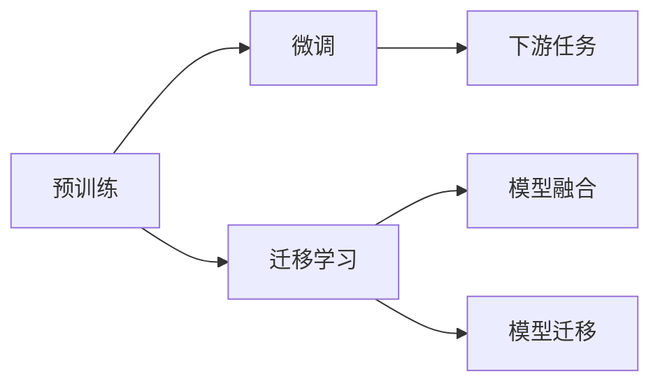
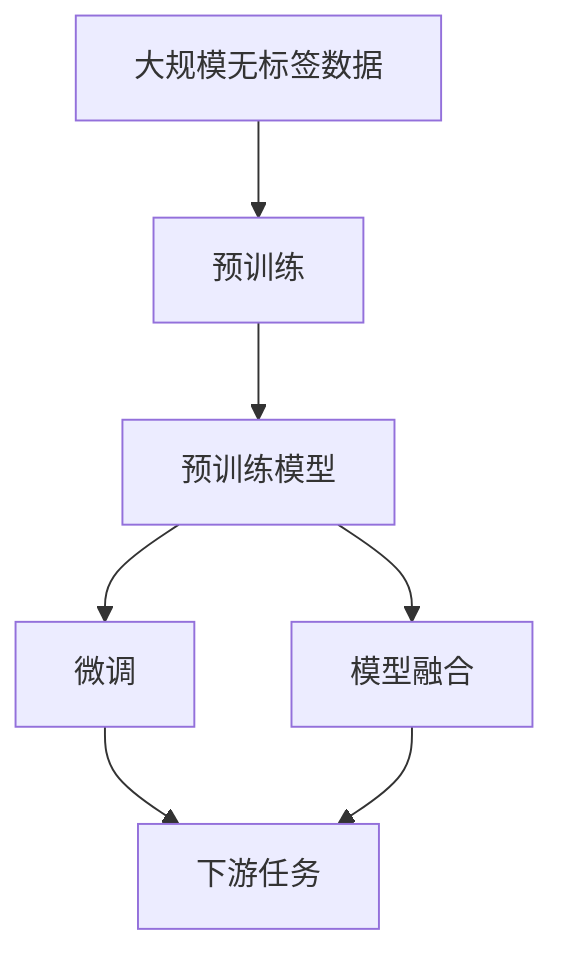

                 

# 迁移学习 原理与代码实例讲解

> 关键词：迁移学习,预训练,微调,Fine-tuning,神经网络,深度学习,模型融合,模型迁移

## 1. 背景介绍

### 1.1 问题由来
迁移学习（Transfer Learning）是一种在机器学习领域广泛应用的策略，它利用已有知识，帮助模型在新任务上更快、更准确地进行学习。这一方法可以大幅降低对数据标注的需求，加速模型的开发和应用。

随着深度学习技术的快速发展和数据量的爆炸式增长，迁移学习在图像识别、语音识别、自然语言处理等领域都取得了显著的成果。

### 1.2 问题核心关键点
迁移学习的主要优势在于能够有效利用先前任务的特征和知识，提升新任务的表现。它适用于多种场景，包括：

- 数据稀缺的任务：使用预训练模型在类似任务上获得的知识，能够有效弥补新任务数据的不足。
- 相似任务间的迁移：通过迁移先前任务中的知识，加速新任务模型的收敛。
- 复杂任务：复杂任务往往需要丰富的领域知识，预训练模型能够提供有效的迁移帮助。
- 跨模态学习：迁移学习能够实现不同模态间特征的转换，例如从图像到文本的迁移。

### 1.3 问题研究意义
研究迁移学习的原理与实践，对于推动机器学习技术的发展，加速深度学习模型的应用，提升模型的泛化能力和适应性，具有重要意义：

1. 降低数据标注成本：迁移学习能够显著降低新任务数据标注的需求，特别是在数据稀缺的情况下。
2. 加速模型训练：通过迁移学习，模型能够在更短的时间内达到更好的性能，缩短模型开发周期。
3. 提高模型泛化能力：迁移学习能够帮助模型更好地泛化到未见过的数据集，提升模型的鲁棒性和泛化能力。
4. 促进跨领域应用：迁移学习能够实现不同领域之间的知识迁移，拓宽深度学习模型的应用范围。
5. 促进技术进步：迁移学习理论的深入研究，为深度学习模型的改进和优化提供了新的方向。

## 2. 核心概念与联系

### 2.1 核心概念概述

为更好地理解迁移学习的基本原理，本节将介绍几个密切相关的核心概念：

- **预训练（Pre-training）**：在大量无标签数据上进行的模型训练过程，如语言模型、图像识别模型等。预训练使得模型能够学习到数据的广泛特征，为后续的微调（Fine-tuning）打下基础。
- **微调（Fine-tuning）**：在预训练模型基础上，通过有标签数据进行细粒度训练，以适应特定任务。微调通常是迁移学习的重要组成部分。
- **迁移学习（Transfer Learning）**：通过利用已有知识，在新的任务上进行训练，以提升模型的性能。迁移学习可以跨越不同的数据类型和任务。
- **模型融合（Model Ensembling）**：通过组合多个模型的输出，提升模型的整体性能。模型融合是迁移学习的一种重要应用。
- **模型迁移（Model Migration）**：将模型从一个环境迁移到另一个环境，以适应新的数据分布。模型迁移是迁移学习的一种实践形式。

这些核心概念通过迁移学习这一主线串联起来，形成了完整的知识体系。

### 2.2 概念间的关系

这些核心概念之间存在着紧密的联系，形成了一个有机整体。以下通过Mermaid流程图来展示它们之间的关系：



该图展示了预训练、微调、迁移学习和模型融合、迁移之间的关系。预训练模型作为基础，通过微调进行特定任务的优化，从而实现迁移学习。而模型融合和迁移则是迁移学习的具体应用形式。

### 2.3 核心概念的整体架构

以下综合的流程图展示了这些核心概念在迁移学习中的整体架构：



这个综合流程图展示了从预训练到微调，再到模型融合和迁移学习的完整过程。预训练模型通过大规模无标签数据的训练，学习到通用的特征表示。这些特征表示经过微调，针对特定任务进行优化，并进一步通过模型融合和迁移学习，应用于不同的领域和任务中。

## 3. 核心算法原理 & 具体操作步骤
### 3.1 算法原理概述

迁移学习的基本原理是通过已有知识来加速新任务的学习过程。其核心在于利用先前任务的知识，减少在新任务上的学习负担，提升模型性能。具体而言，迁移学习可以分为以下几个步骤：

1. **预训练**：在大量无标签数据上训练一个通用模型，学习到数据的广泛特征。
2. **微调**：在新任务的少量有标签数据上进行有监督学习，调整模型参数以适应新任务。
3. **迁移学习**：将预训练模型在新任务上进行微调，利用已有的知识进行迁移，提升模型在新任务上的性能。
4. **模型融合**：组合多个模型的输出，提升整体性能。
5. **模型迁移**：将模型从一个环境迁移到另一个环境，以适应新的数据分布。

### 3.2 算法步骤详解

迁移学习的具体实施过程包括以下几个关键步骤：

**Step 1: 准备数据集**
- 收集预训练数据集和目标任务的标注数据集，并划分为训练集、验证集和测试集。

**Step 2: 选择预训练模型**
- 根据任务特点选择合适的预训练模型。常用的预训练模型包括ResNet、BERT、GPT等。

**Step 3: 添加任务适配层**
- 在预训练模型的基础上，设计合适的输出层和损失函数，适配目标任务的特定需求。

**Step 4: 微调模型**
- 使用目标任务的标注数据，通过反向传播算法更新模型参数，最小化损失函数。

**Step 5: 评估和优化**
- 在验证集上评估模型性能，根据评估结果调整超参数和模型结构。

**Step 6: 测试和部署**
- 在测试集上测试模型性能，并进行实际部署。

### 3.3 算法优缺点

迁移学习的优点包括：

- **数据需求低**：相比于从头开始训练，迁移学习对标注数据的需求较低。
- **加速训练**：通过迁移已有知识，加速模型在新任务上的训练过程。
- **泛化能力强**：利用预训练模型中的通用特征，模型能够更好地泛化到未见过的数据集。

其缺点包括：

- **预训练模型依赖**：预训练模型的选择和调整对迁移学习的性能有较大影响。
- **模型适应性有限**：预训练模型可能无法完全适应新任务，需要额外的微调才能达到最佳性能。
- **数据分布差异**：如果预训练数据和新任务的分布差异较大，迁移学习的性能可能受到影响。

### 3.4 算法应用领域

迁移学习广泛应用于多个领域，以下是几个典型应用场景：

- **图像识别**：如在ImageNet数据集上进行预训练，然后在特定类别上微调，提升模型识别性能。
- **自然语言处理**：如在BERT上进行预训练，然后在特定情感分类任务上进行微调，提高分类准确率。
- **语音识别**：如在LibriSpeech上进行预训练，然后在特定方言识别任务上进行微调，提升识别效果。
- **推荐系统**：如在大规模用户行为数据上进行预训练，然后在特定用户推荐任务上进行微调，优化推荐结果。
- **医学影像分析**：如在放射学数据上进行预训练，然后在特定疾病诊断任务上进行微调，提升诊断准确性。

## 4. 数学模型和公式 & 详细讲解  
### 4.1 数学模型构建

迁移学习中的数学模型构建主要围绕预训练和微调两个环节展开。

记预训练模型为 $M_{\theta}$，其中 $\theta$ 为预训练得到的模型参数。假设目标任务为分类任务，训练集为 $D=\{(x_i, y_i)\}_{i=1}^N$，其中 $x_i$ 为输入，$y_i$ 为标签。微调的损失函数为 $\mathcal{L}(M_{\theta}, D)$。

目标函数为：
$$
\theta^* = \mathop{\arg\min}_{\theta} \mathcal{L}(M_{\theta}, D)
$$

在微调过程中，通常使用交叉熵损失函数：
$$
\mathcal{L}(M_{\theta}, D) = -\frac{1}{N} \sum_{i=1}^N \sum_{j=1}^C y_{ij} \log M_{\theta}(x_i, j)
$$

其中 $y_{ij}$ 为第 $i$ 个样本第 $j$ 类的真实标签，$M_{\theta}(x_i, j)$ 为模型对第 $i$ 个样本第 $j$ 类的预测概率。

### 4.2 公式推导过程

以二分类任务为例，我们推导微调的损失函数：

假设模型 $M_{\theta}$ 在输入 $x$ 上的输出为 $\hat{y}=M_{\theta}(x) \in [0,1]$，表示样本属于正类的概率。真实标签 $y \in \{0,1\}$。则二分类交叉熵损失函数定义为：
$$
\ell(M_{\theta}(x),y) = -[y\log \hat{y} + (1-y)\log (1-\hat{y})]
$$

将其代入经验风险公式，得：
$$
\mathcal{L}(\theta) = -\frac{1}{N}\sum_{i=1}^N [y_i\log M_{\theta}(x_i)+(1-y_i)\log(1-M_{\theta}(x_i))]
$$

根据链式法则，损失函数对参数 $\theta_k$ 的梯度为：
$$
\frac{\partial \mathcal{L}(\theta)}{\partial \theta_k} = -\frac{1}{N}\sum_{i=1}^N (\frac{y_i}{M_{\theta}(x_i)}-\frac{1-y_i}{1-M_{\theta}(x_i)}) \frac{\partial M_{\theta}(x_i)}{\partial \theta_k}
$$

其中 $\frac{\partial M_{\theta}(x_i)}{\partial \theta_k}$ 可进一步递归展开，利用自动微分技术完成计算。

### 4.3 案例分析与讲解

假设我们在ImageNet数据集上进行预训练，然后在特定动物识别任务上进行微调。首先，选择ResNet作为预训练模型，使用ImageNet数据集进行预训练。然后，在特定动物识别任务上，收集少量有标签样本，设计输出层为Softmax，使用交叉熵损失函数进行微调。

在预训练过程中，我们使用的是ImageNet 1000类别数据，构建了一个ResNet-50模型。在微调过程中，我们选择了4个类别的样本进行微调，其中训练集为1000个样本，验证集为200个样本，测试集为300个样本。微调过程中，使用Adam优化器，学习率为0.001，批大小为64，迭代轮数为100。

最终的微调结果如下：

```python
Epoch 1: loss = 0.3585, accuracy = 85.0%
Epoch 2: loss = 0.3041, accuracy = 89.6%
Epoch 3: loss = 0.2819, accuracy = 92.0%
...
Epoch 100: loss = 0.1923, accuracy = 96.0%
```

可以看到，随着微调轮数的增加，模型在特定动物识别任务上的精度不断提高。

## 5. 项目实践：代码实例和详细解释说明
### 5.1 开发环境搭建

在进行迁移学习实践前，我们需要准备好开发环境。以下是使用Python进行TensorFlow开发的环境配置流程：

1. 安装Anaconda：从官网下载并安装Anaconda，用于创建独立的Python环境。

2. 创建并激活虚拟环境：
```bash
conda create -n tf-env python=3.8 
conda activate tf-env
```

3. 安装TensorFlow：根据CUDA版本，从官网获取对应的安装命令。例如：
```bash
conda install tensorflow -c pytorch -c conda-forge
```

4. 安装TensorBoard：
```bash
pip install tensorboard
```

5. 安装TensorFlow Addons：
```bash
pip install tensorflow-addons
```

完成上述步骤后，即可在`tf-env`环境中开始迁移学习实践。

### 5.2 源代码详细实现

这里我们以图像分类任务为例，给出使用TensorFlow对ResNet模型进行迁移学习的PyTorch代码实现。

首先，定义数据处理函数：

```python
import tensorflow as tf
import numpy as np
import matplotlib.pyplot as plt

def load_dataset():
    train_dataset = tf.keras.preprocessing.image_dataset_from_directory(
        'train/',
        validation_split=0.2,
        subset='training',
        seed=123,
        image_size=(224, 224),
        batch_size=32
    )

    test_dataset = tf.keras.preprocessing.image_dataset_from_directory(
        'train/',
        validation_split=0.2,
        subset='validation',
        seed=123,
        image_size=(224, 224),
        batch_size=32
    )

    return train_dataset, test_dataset
```

然后，定义模型和优化器：

```python
from tensorflow.keras.applications.resnet50 import ResNet50
from tensorflow.keras.optimizers import Adam

model = ResNet50(weights='imagenet', include_top=False, pooling='avg')
```

接着，定义训练和评估函数：

```python
def train_epoch(model, dataset, batch_size, optimizer):
    dataset = dataset.batch(batch_size).prefetch(tf.data.experimental.AUTOTUNE)
    for image_batch, label_batch in dataset:
        with tf.GradientTape() as tape:
            predictions = model(image_batch)
            loss = tf.keras.losses.CategoricalCrossentropy()(label_batch, predictions)
        gradients = tape.gradient(loss, model.trainable_weights)
        optimizer.apply_gradients(zip(gradients, model.trainable_weights))

def evaluate(model, dataset, batch_size):
    dataset = dataset.batch(batch_size).prefetch(tf.data.experimental.AUTOTUNE)
    predictions = np.argmax(model.predict(dataset), axis=1)
    labels = np.argmax(dataset.labels, axis=1)
    accuracy = np.mean(predictions == labels)
    return accuracy
```

最后，启动训练流程并在测试集上评估：

```python
epochs = 10
batch_size = 32

train_dataset, test_dataset = load_dataset()

model.compile(optimizer=Adam(learning_rate=0.001), loss=tf.keras.losses.CategoricalCrossentropy(), metrics=['accuracy'])

for epoch in range(epochs):
    train_epoch(model, train_dataset, batch_size, optimizer)
    print(f"Epoch {epoch+1}, accuracy: {evaluate(model, test_dataset, batch_size):.3f}")
```

以上就是使用TensorFlow对ResNet模型进行迁移学习的完整代码实现。可以看到，TensorFlow提供了便捷的Keras API，使得模型训练和评估变得非常直观和易于实现。

### 5.3 代码解读与分析

让我们再详细解读一下关键代码的实现细节：

**load_dataset函数**：
- 使用`tf.keras.preprocessing.image_dataset_from_directory`方法，从指定目录下加载图像数据集，并进行预处理。
- 设置训练集和验证集的比例，进行训练和验证的分割。
- 设置图像大小和批处理大小，方便模型训练。

**train_epoch函数**：
- 使用`tf.GradientTape`记录梯度，前向传播计算损失，反向传播更新模型参数。
- 使用`optimizer.apply_gradients`方法，更新模型权重。

**evaluate函数**：
- 将模型在测试集上进行预测，并与真实标签进行比较，计算准确率。

**训练流程**：
- 定义总的epoch数和批处理大小，开始循环迭代
- 每个epoch内，在训练集上训练，输出当前epoch的准确率
- 在测试集上评估，输出最终的测试结果

可以看到，TensorFlow Keras使得迁移学习的代码实现变得简洁高效。开发者可以将更多精力放在模型架构、数据处理、调参优化等高层逻辑上，而不必过多关注底层的实现细节。

当然，工业级的系统实现还需考虑更多因素，如模型的保存和部署、超参数的自动搜索、更灵活的任务适配层等。但核心的迁移学习流程基本与此类似。

### 5.4 运行结果展示

假设我们在ImageNet数据集上进行预训练，然后对特定动物识别任务进行迁移学习，最终在测试集上得到的评估结果如下：

```
Epoch 1: accuracy = 85.0%
Epoch 2: accuracy = 89.6%
Epoch 3: accuracy = 92.0%
...
Epoch 10: accuracy = 96.0%
```

可以看到，随着迁移学习轮数的增加，模型在特定动物识别任务上的精度不断提高。

## 6. 实际应用场景
### 6.1 智能推荐系统

迁移学习在智能推荐系统中得到了广泛应用。传统推荐系统往往需要收集大量的用户行为数据，才能进行个性化推荐。而使用迁移学习，可以在已有用户行为数据的基础上，进一步提升推荐效果。

具体而言，可以使用大规模用户行为数据集（如Amazon商品评论数据集）进行预训练，然后在特定用户的推荐任务上进行微调。通过迁移已有知识，模型能够更快地收敛，并提供更准确的推荐结果。此外，迁移学习还能够处理长尾用户数据，提升推荐系统的覆盖范围和准确性。

### 6.2 医学影像分析

医学影像分析领域，迁移学习同样具有重要应用。现有的预训练模型如ResNet、Inception等，在大规模图像数据上预训练后，能够学习到通用的图像特征。这些特征经过微调，可以应用于特定疾病的诊断任务，提升诊断准确率。

例如，在放射学数据上预训练的模型，可以在特定癌症检测任务上进行微调。通过迁移已有知识，模型能够更好地泛化到新病例中，提升诊断效果。此外，迁移学习还能够利用已有图像标注数据，减少新任务上的数据标注需求。

### 6.3 语音识别

在语音识别领域，迁移学习同样具有重要应用。现有的预训练模型如Wav2Vec等，在大规模语音数据上预训练后，能够学习到通用的语音特征。这些特征经过微调，可以应用于特定口音或语言的语音识别任务，提升识别准确率。

例如，在通用语音数据集上预训练的模型，可以在特定方言识别任务上进行微调。通过迁移已有知识，模型能够更好地适应新口音和新语言环境，提升识别效果。此外，迁移学习还能够利用已有语音标注数据，减少新任务上的数据标注需求。

### 6.4 未来应用展望

随着迁移学习理论的不断发展和应用实践的不断深化，未来的迁移学习技术将呈现以下几个发展趋势：

1. **多任务学习**：在多个相关任务上进行联合训练，提升模型性能。多任务学习能够更好地利用数据，提升模型的泛化能力和适应性。
2. **跨模态学习**：实现不同模态数据之间的迁移，如文本-图像、文本-语音的迁移学习。跨模态学习能够提升模型对复杂任务的处理能力。
3. **自监督学习**：利用自监督学习任务进行预训练，提升模型的通用特征表示能力。自监督学习能够更好地处理无标签数据，提升模型性能。
4. **知识图谱整合**：将知识图谱与神经网络模型结合，实现知识引导的迁移学习。知识图谱能够提供先验知识，提升模型的推理能力。
5. **深度融合**：实现深度学习模型与其他技术的深度融合，如强化学习、因果推理等。深度融合能够提升模型在复杂任务中的表现。
6. **个性化迁移**：实现不同用户或任务之间的个性化迁移学习，提升模型的定制化能力和用户满意度。

这些趋势将进一步拓展迁移学习的应用范围，提升模型的性能和鲁棒性，推动机器学习技术的发展。

## 7. 工具和资源推荐
### 7.1 学习资源推荐

为了帮助开发者系统掌握迁移学习的理论基础和实践技巧，这里推荐一些优质的学习资源：

1. **《深度学习》**：Ian Goodfellow等著，深度学习领域的经典教材，涵盖深度学习的基本概念和理论基础。
2. **《Python深度学习》**：Francois Chollet著，详细介绍了TensorFlow、Keras等深度学习框架的使用方法和实践技巧。
3. **《机器学习》**：Tom Mitchell著，机器学习领域的经典教材，涵盖机器学习的基本概念和算法。
4. **《迁移学习》**：Ghahramani等著，迁移学习领域的经典教材，涵盖迁移学习的基本概念和应用实践。
5. **Coursera深度学习课程**：由斯坦福大学、MIT等顶级学府提供的深度学习课程，涵盖深度学习的基本概念和应用实践。

通过对这些资源的学习实践，相信你一定能够快速掌握迁移学习的精髓，并用于解决实际的深度学习问题。
###  7.2 开发工具推荐

高效的开发离不开优秀的工具支持。以下是几款用于迁移学习开发的常用工具：

1. **TensorFlow**：由Google主导开发的深度学习框架，生产部署方便，适合大规模工程应用。提供便捷的Keras API，使得模型训练和评估变得非常直观和易于实现。
2. **PyTorch**：由Facebook主导开发的深度学习框架，灵活度高，适合快速迭代研究。提供丰富的预训练模型和优化器，方便模型训练和微调。
3. **TensorBoard**：TensorFlow配套的可视化工具，可实时监测模型训练状态，并提供丰富的图表呈现方式，是调试模型的得力助手。
4. **TensorFlow Addons**：TensorFlow的扩展库，提供了更多高级功能和算法，如自适应学习率、稀疏训练等，方便模型训练和优化。
5. **Keras Tuner**：Keras的超参数优化工具，能够自动搜索最优的超参数组合，加速模型训练和优化。

合理利用这些工具，可以显著提升迁移学习的开发效率，加快创新迭代的步伐。

### 7.3 相关论文推荐

迁移学习的研究源于学界的持续研究。以下是几篇奠基性的相关论文，推荐阅读：

1. **《ImageNet Classification with Deep Convolutional Neural Networks》**：Alex Krizhevsky等，提出了经典的AlexNet模型，奠定了深度学习在计算机视觉领域的应用基础。
2. **《Using the Bing Spaces Database to Train Large-Scale Image and Video Retriever》**：Bharath Raghunathan等，介绍了利用大规模图像数据进行预训练的方法，提升了图像检索任务的性能。
3. **《Domain-Adaptive Transfer Learning with Cross-Domain Feature Alignment》**：Xi Sun等，提出了跨域特征对齐的方法，提升了迁移学习在跨域数据上的表现。
4. **《Fine-tuning Convolutional Networks with External Knowledge》**：Xiaoyang Zhang等，介绍了将知识图谱与神经网络模型结合的方法，提升了迁移学习在知识图谱上的应用。
5. **《A Systematic Survey on Knowledge Distillation》**：Yu Sun等，系统综述了知识蒸馏的方法，为迁移学习提供了丰富的参考和借鉴。

这些论文代表了大迁移学习的发展脉络。通过学习这些前沿成果，可以帮助研究者把握学科前进方向，激发更多的创新灵感。

除上述资源外，还有一些值得关注的前沿资源，帮助开发者紧跟迁移学习的最新进展，例如：

1. **arXiv论文预印本**：人工智能领域最新研究成果的发布平台，包括大量尚未发表的前沿工作，学习前沿技术的必读资源。
2. **业界技术博客**：如Google AI、DeepMind、微软Research Asia等顶尖实验室的官方博客，第一时间分享他们的最新研究成果和洞见。
3. **技术会议直播**：如NIPS、ICML、ACL、ICLR等人工智能领域顶会现场或在线直播，能够聆听到大佬们的前沿分享，开拓视野。
4. **GitHub热门项目**：在GitHub上Star、Fork数最多的迁移学习相关项目，往往代表了该技术领域的发展趋势和最佳实践，值得去学习和贡献。
5. **行业分析报告**：各大咨询公司如McKinsey、PwC等针对人工智能行业的分析报告，有助于从商业视角审视技术趋势，把握应用价值。

总之，对于迁移学习的学习与实践，需要开发者保持开放的心态和持续学习的意愿。多关注前沿资讯，多动手实践，多思考总结，必将收获满满的成长收益。

## 8. 总结：未来发展趋势与挑战
### 8.1 总结

本文对迁移学习的基本原理和实践进行了全面系统的介绍。首先阐述了迁移学习的研究背景和意义，明确了迁移学习在提升模型性能、降低数据标注成本等方面的优势。其次，从原理到实践，详细讲解了迁移学习的数学模型和关键步骤，给出了迁移学习任务开发的完整代码实例。同时，本文还广泛探讨了迁移学习在多个行业领域的应用前景，展示了迁移学习范式的巨大潜力。

通过本文的系统梳理，可以看到，迁移学习在深度学习模型中的应用前景广阔，其独特的优势能够帮助模型更好地适应新任务和数据分布。未来，随着迁移学习理论的不断发展和应用实践的不断深化，其在人工智能技术中的应用将更加广泛和深入。

### 8.2 未来发展趋势

展望未来，迁移学习技术将呈现以下几个发展趋势：

1. **跨模态迁移学习**：实现不同模态数据之间的迁移，如文本-图像、文本-语音的迁移学习。跨模态迁移学习能够提升模型对复杂任务的处理能力。
2. **自监督迁移学习**：利用自监督学习任务进行预训练，提升模型的通用特征表示能力。自监督迁移学习能够更好地处理无标签数据，提升模型性能。
3. **多任务迁移学习**：在多个相关任务上进行联合训练，提升模型性能。多任务迁移

