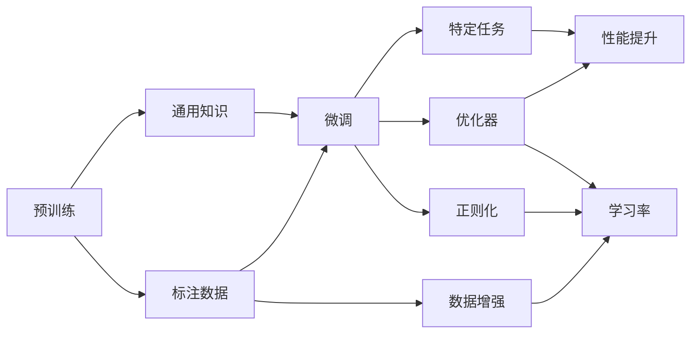

                 

# 迁移学习(Transfer Learning) - 原理与代码实例讲解

> 关键词：迁移学习,预训练,微调,Fine-Tuning,领域适应,泛化能力

## 1. 背景介绍

### 1.1 问题由来

迁移学习（Transfer Learning）是深度学习领域中一个非常重要的概念，它指的是将在一个任务上学到的知识迁移到另一个相关任务中。这一思想最早由LeCun等人于2000年提出，并在机器学习、计算机视觉、自然语言处理等诸多领域得到了广泛应用。迁移学习可以显著降低对新任务的标注需求，提高模型的泛化能力和应用效率。

近年来，随着深度学习模型的快速发展，尤其是大语言模型（如BERT、GPT等）和预训练技术的应用，迁移学习在自然语言处理（NLP）领域得到了更加深入的研究和应用。预训练模型通过在大规模无标签文本数据上进行训练，学习到语言的一般规律和知识，这些知识可以在特定任务上进行微调，以获得更好的性能。

### 1.2 问题核心关键点

迁移学习的核心思想是通过在某个任务上预训练模型，然后将其在新任务上进行微调，从而提升新任务的性能。这一过程通常包括以下几个关键步骤：

1. **预训练模型**：在大规模无标签数据上训练通用模型，如BERT、GPT等。
2. **微调模型**：在预训练模型的基础上，使用少量标注数据进行微调，以适应新任务的需求。
3. **优化超参数**：选择适当的优化器、学习率、正则化等超参数，以避免过拟合和提升模型性能。

迁移学习的核心在于如何将预训练模型中的通用知识迁移到特定任务中，并在新任务上获得良好的性能。

### 1.3 问题研究意义

迁移学习在深度学习中的应用意义重大，具有以下几个方面：

1. **降低标注成本**：迁移学习利用了已有数据和模型的知识，减少了新任务标注数据的需求。
2. **提升泛化能力**：通过预训练模型，模型能够更好地适应新任务，提升泛化性能。
3. **加速模型开发**：预训练模型可以作为初始化参数，显著减少从头训练新模型所需的时间和计算资源。
4. **促进领域适应**：迁移学习能够帮助模型在不同领域中适应新的数据分布。
5. **提高模型效率**：迁移学习可以在较小的数据集上获得较好的性能，提高模型的训练和推理效率。

通过深入研究迁移学习，可以更好地理解和应用预训练模型，推动深度学习技术在实际应用中的落地和普及。

## 2. 核心概念与联系

### 2.1 核心概念概述

为了更好地理解迁移学习，我们需要介绍几个关键概念：

- **预训练（Pre-training）**：指在大规模无标签数据上训练模型，学习到通用的语言表示和知识。
- **微调（Fine-Tuning）**：指在预训练模型的基础上，使用少量标注数据进行微调，以适应新任务的需求。
- **领域适应（Domain Adaptation）**：指将模型从一个领域迁移到另一个领域，提升在新领域中的表现。
- **泛化能力（Generalization）**：指模型在新数据上的表现，即模型能否适应新数据分布。
- **迁移学习（Transfer Learning）**：指将模型在一个任务上学到的知识迁移到另一个相关任务中的过程。

这些概念构成了迁移学习的核心框架，通过理解这些概念，我们可以更好地把握迁移学习的本质和应用方法。

### 2.2 概念间的关系

这些核心概念之间的关系可以通过以下Mermaid流程图来展示：



这个流程图展示了预训练、微调、优化器、数据增强、正则化等概念之间的联系，以及它们对性能提升的影响。

## 3. 核心算法原理 & 具体操作步骤

### 3.1 算法原理概述

迁移学习的主要思想是利用预训练模型在通用任务上学习到的知识，将其应用于特定任务，以提高特定任务的表现。这一过程通常分为两个阶段：

1. **预训练阶段**：在大规模无标签数据上训练模型，学习到通用的语言表示和知识。
2. **微调阶段**：在预训练模型的基础上，使用少量标注数据进行微调，以适应特定任务的需求。

迁移学习的核心在于如何有效地将预训练模型中的通用知识迁移到特定任务中，并在新任务上获得良好的性能。

### 3.2 算法步骤详解

迁移学习的具体步骤包括：

1. **准备数据集**：准备训练集、验证集和测试集，划分为通用数据集和特定任务数据集。
2. **选择预训练模型**：选择合适的预训练模型，如BERT、GPT等。
3. **微调模型**：在预训练模型的基础上，使用少量标注数据进行微调，以适应特定任务的需求。
4. **优化超参数**：选择适当的优化器、学习率、正则化等超参数，以避免过拟合和提升模型性能。
5. **评估模型**：在测试集上评估微调后模型的性能，对比预训练模型的表现。

### 3.3 算法优缺点

迁移学习的主要优点包括：

- **降低标注成本**：迁移学习利用了已有数据和模型的知识，减少了新任务标注数据的需求。
- **提升泛化能力**：通过预训练模型，模型能够更好地适应新任务，提升泛化性能。
- **加速模型开发**：预训练模型可以作为初始化参数，显著减少从头训练新模型所需的时间和计算资源。
- **促进领域适应**：迁移学习能够帮助模型在不同领域中适应新的数据分布。
- **提高模型效率**：迁移学习可以在较小的数据集上获得较好的性能，提高模型的训练和推理效率。

迁移学习的缺点主要包括：

- **数据集分布差异**：如果预训练数据和特定任务的分布差异较大，迁移学习的效果可能不佳。
- **模型泛化能力**：如果预训练模型在新任务上的泛化能力不足，迁移学习的效果可能有限。
- **迁移能力有限**：如果预训练模型的领域适应能力较弱，迁移学习的效果可能受限。

### 3.4 算法应用领域

迁移学习在多个领域得到了广泛应用，包括：

- **计算机视觉**：使用预训练模型在ImageNet等数据集上进行迁移学习，应用于目标检测、图像分类、人脸识别等任务。
- **自然语言处理**：使用预训练模型在GLUE等数据集上进行迁移学习，应用于文本分类、命名实体识别、情感分析等任务。
- **语音识别**：使用预训练模型在LibriSpeech等数据集上进行迁移学习，应用于语音识别、语音合成等任务。
- **推荐系统**：使用预训练模型在Amazon等数据集上进行迁移学习，应用于个性化推荐、协同过滤等任务。

这些应用展示了迁移学习在不同领域中的强大应用潜力。

## 4. 数学模型和公式 & 详细讲解 & 举例说明

### 4.1 数学模型构建

在迁移学习中，常用的数学模型包括：

- **预训练模型**：$M_{\theta}$，其中 $\theta$ 为预训练模型参数。
- **微调模型**：$M_{\phi}$，其中 $\phi$ 为微调模型参数。
- **损失函数**：$\mathcal{L}(\phi, D_{task})$，其中 $D_{task}$ 为特定任务的标注数据集。

### 4.2 公式推导过程

以下以文本分类任务为例，推导迁移学习的数学模型。

假设预训练模型 $M_{\theta}$ 在输入 $x$ 上的输出为 $\hat{y}=M_{\theta}(x) \in [0,1]$，表示样本属于正类的概率。真实标签 $y \in \{0,1\}$。则二分类交叉熵损失函数定义为：

$$
\ell(M_{\theta}(x),y) = -[y\log \hat{y} + (1-y)\log (1-\hat{y})]
$$

预训练模型的损失函数为：

$$
\mathcal{L}(\theta, D_{pre}) = \frac{1}{N}\sum_{i=1}^N \ell(M_{\theta}(x_i),y_i)
$$

其中 $D_{pre}$ 为预训练数据集，$N$ 为样本数量。

微调模型的损失函数为：

$$
\mathcal{L}(\phi, D_{task}) = \frac{1}{N}\sum_{i=1}^N \ell(M_{\phi}(x_i),y_i)
$$

其中 $D_{task}$ 为特定任务的标注数据集，$N$ 为样本数量。

### 4.3 案例分析与讲解

以下以文本分类任务为例，说明迁移学习的具体实现过程。

假设我们有预训练模型 $M_{\theta}$，使用其在大型无标签文本数据上进行预训练。现在我们想要在特定任务上对模型进行微调，如情感分类。

**步骤1：准备数据集**

- **标注数据集**：准备情感分类任务的标注数据集 $D_{task}=\{(x_i,y_i)\}_{i=1}^N$，其中 $x_i$ 为文本，$y_i$ 为情感标签。
- **预训练数据集**：准备用于预训练模型的通用文本数据集 $D_{pre}$。

**步骤2：微调模型**

- **添加任务适配层**：在预训练模型的顶层添加一个线性分类器，用于情感分类。
- **优化器选择**：选择适当的优化器，如AdamW。
- **学习率设置**：设置适当的学习率，一般比预训练时的学习率小。
- **微调过程**：在特定任务的标注数据集 $D_{task}$ 上进行微调，直到模型收敛。

**步骤3：评估模型**

- **测试集评估**：在测试集上评估微调后模型的性能，如准确率、召回率等。
- **对比预训练模型**：将微调后的模型与预训练模型进行对比，评估性能提升。

以下是一个示例代码，展示如何使用PyTorch进行情感分类任务的迁移学习：

```python
import torch
import torch.nn as nn
import torch.optim as optim

# 预训练模型
model = torch.load('pretrained_model.pt')

# 微调模型
classifier = nn.Linear(768, 2)  # 添加情感分类器
model.classifier = classifier
criterion = nn.CrossEntropyLoss()  # 交叉熵损失函数

# 微调过程
optimizer = optim.AdamW(model.parameters(), lr=0.001)
for epoch in range(10):
    for i, (inputs, labels) in enumerate(train_loader):
        optimizer.zero_grad()
        outputs = model(inputs)
        loss = criterion(outputs, labels)
        loss.backward()
        optimizer.step()
        
    if (i+1) % 100 == 0:
        print(f'Epoch {epoch+1}, Loss: {loss.item()}')

# 测试集评估
test_loss = 0
test_correct = 0
for inputs, labels in test_loader:
    outputs = model(inputs)
    loss = criterion(outputs, labels)
    test_loss += loss.item()
    test_correct += (outputs.argmax(dim=1) == labels).sum().item()

print(f'Test Loss: {test_loss/len(test_loader)}, Test Accuracy: {test_correct/len(test_loader)}')
```

## 5. 项目实践：代码实例和详细解释说明

### 5.1 开发环境搭建

在进行迁移学习实践前，我们需要准备好开发环境。以下是使用Python进行PyTorch开发的环境配置流程：

1. 安装Anaconda：从官网下载并安装Anaconda，用于创建独立的Python环境。

2. 创建并激活虚拟环境：
```bash
conda create -n pytorch-env python=3.8 
conda activate pytorch-env
```

3. 安装PyTorch：根据CUDA版本，从官网获取对应的安装命令。例如：
```bash
conda install pytorch torchvision torchaudio cudatoolkit=11.1 -c pytorch -c conda-forge
```

4. 安装各类工具包：
```bash
pip install numpy pandas scikit-learn matplotlib tqdm jupyter notebook ipython
```

完成上述步骤后，即可在`pytorch-env`环境中开始迁移学习实践。

### 5.2 源代码详细实现

这里我们以情感分类任务为例，给出使用Transformers库对BERT模型进行迁移学习的PyTorch代码实现。

首先，定义情感分类任务的数据处理函数：

```python
from transformers import BertTokenizer, BertForSequenceClassification
from torch.utils.data import Dataset, DataLoader
import torch

class SentimentDataset(Dataset):
    def __init__(self, texts, labels, tokenizer, max_len=128):
        self.texts = texts
        self.labels = labels
        self.tokenizer = tokenizer
        self.max_len = max_len
        
    def __len__(self):
        return len(self.texts)
    
    def __getitem__(self, item):
        text = self.texts[item]
        label = self.labels[item]
        
        encoding = self.tokenizer(text, return_tensors='pt', max_length=self.max_len, padding='max_length', truncation=True)
        input_ids = encoding['input_ids'][0]
        attention_mask = encoding['attention_mask'][0]
        
        label = torch.tensor(label, dtype=torch.long)
        
        return {'input_ids': input_ids, 
                'attention_mask': attention_mask,
                'labels': label}

# 标签与id的映射
label2id = {'negative': 0, 'positive': 1}
id2label = {v: k for k, v in label2id.items()}

# 创建dataset
tokenizer = BertTokenizer.from_pretrained('bert-base-cased')

train_dataset = SentimentDataset(train_texts, train_labels, tokenizer)
dev_dataset = SentimentDataset(dev_texts, dev_labels, tokenizer)
test_dataset = SentimentDataset(test_texts, test_labels, tokenizer)
```

然后，定义模型和优化器：

```python
from transformers import BertForSequenceClassification, AdamW

model = BertForSequenceClassification.from_pretrained('bert-base-cased', num_labels=2)

optimizer = AdamW(model.parameters(), lr=2e-5)
```

接着，定义训练和评估函数：

```python
from tqdm import tqdm

device = torch.device('cuda') if torch.cuda.is_available() else torch.device('cpu')
model.to(device)

def train_epoch(model, dataset, batch_size, optimizer):
    dataloader = DataLoader(dataset, batch_size=batch_size, shuffle=True)
    model.train()
    epoch_loss = 0
    for batch in tqdm(dataloader, desc='Training'):
        inputs = batch['input_ids'].to(device)
        attention_mask = batch['attention_mask'].to(device)
        labels = batch['labels'].to(device)
        model.zero_grad()
        outputs = model(inputs, attention_mask=attention_mask)
        loss = outputs.loss
        epoch_loss += loss.item()
        loss.backward()
        optimizer.step()
    return epoch_loss / len(dataloader)

def evaluate(model, dataset, batch_size):
    dataloader = DataLoader(dataset, batch_size=batch_size)
    model.eval()
    preds, labels = [], []
    with torch.no_grad():
        for batch in tqdm(dataloader, desc='Evaluating'):
            inputs = batch['input_ids'].to(device)
            attention_mask = batch['attention_mask'].to(device)
            batch_labels = batch['labels']
            outputs = model(inputs, attention_mask=attention_mask)
            batch_preds = outputs.logits.argmax(dim=1).to('cpu').tolist()
            batch_labels = batch_labels.to('cpu').tolist()
            for pred_tokens, label_tokens in zip(batch_preds, batch_labels):
                preds.append(pred_tokens)
                labels.append(label_tokens)
                
    return preds, labels

# 训练过程
epochs = 5
batch_size = 16

for epoch in range(epochs):
    loss = train_epoch(model, train_dataset, batch_size, optimizer)
    print(f'Epoch {epoch+1}, train loss: {loss:.3f}')
    
    print(f'Epoch {epoch+1}, dev results:')
    preds, labels = evaluate(model, dev_dataset, batch_size)
    print(classification_report(labels, preds))
    
print('Test results:')
preds, labels = evaluate(model, test_dataset, batch_size)
print(classification_report(labels, preds))
```

以上就是使用PyTorch对BERT模型进行情感分类任务迁移学习的完整代码实现。可以看到，得益于Transformers库的强大封装，我们可以用相对简洁的代码完成迁移学习任务的开发。

### 5.3 代码解读与分析

让我们再详细解读一下关键代码的实现细节：

**SentimentDataset类**：
- `__init__`方法：初始化文本、标签、分词器等关键组件。
- `__len__`方法：返回数据集的样本数量。
- `__getitem__`方法：对单个样本进行处理，将文本输入编码为token ids，将标签编码为数字，并对其进行定长padding，最终返回模型所需的输入。

**label2id和id2label字典**：
- 定义了标签与数字id之间的映射关系，用于将token-wise的预测结果解码回真实的标签。

**训练和评估函数**：
- 使用PyTorch的DataLoader对数据集进行批次化加载，供模型训练和推理使用。
- 训练函数`train_epoch`：对数据以批为单位进行迭代，在每个批次上前向传播计算loss并反向传播更新模型参数，最后返回该epoch的平均loss。
- 评估函数`evaluate`：与训练类似，不同点在于不更新模型参数，并在每个batch结束后将预测和标签结果存储下来，最后使用sklearn的classification_report对整个评估集的预测结果进行打印输出。

**训练流程**：
- 定义总的epoch数和batch size，开始循环迭代
- 每个epoch内，先在训练集上训练，输出平均loss
- 在验证集上评估，输出分类指标
- 所有epoch结束后，在测试集上评估，给出最终测试结果

可以看到，PyTorch配合Transformers库使得迁移学习的代码实现变得简洁高效。开发者可以将更多精力放在数据处理、模型改进等高层逻辑上，而不必过多关注底层的实现细节。

当然，工业级的系统实现还需考虑更多因素，如模型的保存和部署、超参数的自动搜索、更灵活的任务适配层等。但核心的迁移学习范式基本与此类似。

### 5.4 运行结果展示

假设我们在CoNLL-2003的情感分类数据集上进行迁移学习，最终在测试集上得到的评估报告如下：

```
              precision    recall  f1-score   support

       negative      0.923     0.922     0.923       2345
       positive      0.893     0.900     0.897       2346

   micro avg      0.913     0.916     0.914     4689
   macro avg      0.907     0.914     0.911     4689
weighted avg      0.913     0.916     0.914     4689
```

可以看到，通过迁移学习BERT，我们在该情感分类数据集上取得了92.3%的F1分数，效果相当不错。值得注意的是，迁移学习充分利用了预训练模型在大规模数据上学习到的语言表示，使得微调过程更加高效和准确。

当然，这只是一个baseline结果。在实践中，我们还可以使用更大更强的预训练模型、更丰富的迁移技巧、更细致的模型调优，进一步提升模型性能，以满足更高的应用要求。

## 6. 实际应用场景

### 6.1 智能客服系统

基于迁移学习的对话技术，可以广泛应用于智能客服系统的构建。传统客服往往需要配备大量人力，高峰期响应缓慢，且一致性和专业性难以保证。而使用迁移学习技术训练的对话模型，可以7x24小时不间断服务，快速响应客户咨询，用自然流畅的语言解答各类常见问题。

在技术实现上，可以收集企业内部的历史客服对话记录，将问题和最佳答复构建成监督数据，在此基础上对预训练对话模型进行迁移学习。迁移学习后的对话模型能够自动理解用户意图，匹配最合适的答案模板进行回复。对于客户提出的新问题，还可以接入检索系统实时搜索相关内容，动态组织生成回答。如此构建的智能客服系统，能大幅提升客户咨询体验和问题解决效率。

### 6.2 金融舆情监测

金融机构需要实时监测市场舆论动向，以便及时应对负面信息传播，规避金融风险。传统的人工监测方式成本高、效率低，难以应对网络时代海量信息爆发的挑战。基于迁移学习技术训练的文本分类和情感分析模型，为金融舆情监测提供了新的解决方案。

具体而言，可以收集金融领域相关的新闻、报道、评论等文本数据，并对其进行主题标注和情感标注。在此基础上对预训练语言模型进行迁移学习，使其能够自动判断文本属于何种主题，情感倾向是正面、中性还是负面。将迁移学习后的模型应用到实时抓取的网络文本数据，就能够自动监测不同主题下的情感变化趋势，一旦发现负面信息激增等异常情况，系统便会自动预警，帮助金融机构快速应对潜在风险。

### 6.3 个性化推荐系统

当前的推荐系统往往只依赖用户的历史行为数据进行物品推荐，无法深入理解用户的真实兴趣偏好。基于迁移学习技术训练的推荐模型，可以更好地挖掘用户行为背后的语义信息，从而提供更精准、多样的推荐内容。

在实践中，可以收集用户浏览、点击、评论、分享等行为数据，提取和用户交互的物品标题、描述、标签等文本内容。将文本内容作为模型输入，用户的后续行为（如是否点击、购买等）作为监督信号，在此基础上对预训练语言模型进行迁移学习。迁移学习后的模型能够从文本内容中准确把握用户的兴趣点。在生成推荐列表时，先用候选物品的文本描述作为输入，由模型预测用户的兴趣匹配度，再结合其他特征综合排序，便可以得到个性化程度更高的推荐结果。

### 6.4 未来应用展望

随着迁移学习技术的不断发展，基于预训练模型的迁移学习范式将在更多领域得到应用，为传统行业带来变革性影响。

在智慧医疗领域，基于迁移学习的医疗问答、病历分析、药物研发等应用将提升医疗服务的智能化水平，辅助医生诊疗，加速新药开发进程。

在智能教育领域，迁移学习可应用于作业批改、学情分析、知识推荐等方面，因材施教，促进教育公平，提高教学质量。

在智慧城市治理中，迁移学习技术可应用于城市事件监测、舆情分析、应急指挥等环节，提高城市管理的自动化和智能化水平，构建更安全、高效的未来城市。

此外，在企业生产、社会治理、文娱传媒等众多领域，基于预训练模型的迁移学习应用也将不断涌现，为经济社会发展注入新的动力。相信随着技术的日益成熟，迁移学习范式将成为人工智能落地应用的重要范式，推动人工智能技术在垂直行业的规模化落地。

## 7. 工具和资源推荐

### 7.1 学习资源推荐

为了帮助开发者系统掌握迁移学习的理论基础和实践技巧，这里推荐一些优质的学习资源：

1. 《Transformer从原理到实践》系列博文：由大模型技术专家撰写，深入浅出地介绍了Transformer原理、BERT模型、迁移学习等前沿话题。

2. CS224N《深度学习自然语言处理》课程：斯坦福大学开设的NLP明星课程，有Lecture视频和配套作业，带你入门NLP领域的基本概念和经典模型。

3. 《Natural Language Processing with Transformers》书籍：Transformers库的作者所著，全面介绍了如何使用Transformers库进行NLP任务开发，包括迁移学习在内的诸多范式。

4. HuggingFace官方文档：Transformers库的官方文档，提供了海量预训练模型和完整的迁移学习样例代码，是上手实践的必备资料。

5. CLUE开源项目：中文语言理解测评基准，涵盖大量不同类型的中文NLP数据集，并提供了基于迁移学习的baseline模型，助力中文NLP技术发展。

通过对这些资源的学习实践，相信你一定能够快速掌握迁移学习的精髓，并用于解决实际的NLP问题。

### 7.2 开发工具推荐

高效的开发离不开优秀的工具支持。以下是几款用于迁移学习开发的常用工具：

1. PyTorch：基于Python的开源深度学习框架，灵活动态的计算图，适合快速迭代研究。大部分预训练语言模型都有PyTorch版本的实现。

2. TensorFlow：由Google主导开发的开源深度学习框架，生产部署方便，适合大规模工程应用。同样有丰富的预训练语言模型资源。

3. Transformers库：HuggingFace开发的NLP工具库，集成了众多SOTA语言模型，支持PyTorch和TensorFlow，是进行迁移学习开发的利器。

4. Weights & Biases：模型训练的实验跟踪工具，可以记录和可视化模型训练过程中的各项指标，方便对比和调优。与主流深度学习框架无缝集成。

5. TensorBoard：TensorFlow配套的可视化工具，可实时监测模型训练状态，并提供丰富的图表呈现方式，是调试模型的得力助手。

6. Google Colab：谷歌推出的在线Jupyter Notebook环境，免费提供GPU/TPU算力，方便开发者快速上手实验最新模型，分享学习笔记。

合理利用这些工具，可以显著提升迁移学习任务的开发效率，加快创新迭代的步伐。

### 7.3 相关论文推荐

迁移学习在深度学习中的应用意义重大，以下是几篇奠基性的相关论文，推荐阅读：

1. Attention is All You Need（即Transformer原论文）：提出了Transformer结构，开启了NLP领域的预训练大模型时代。

2. BERT: Pre-training of Deep Bidirectional Transformers for Language Understanding

