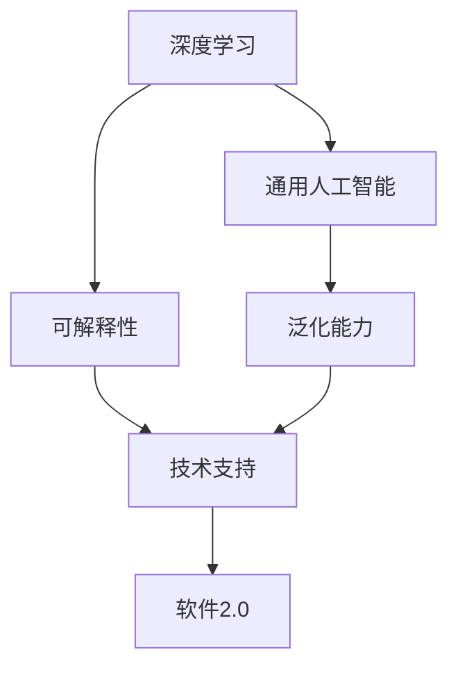

                 

# 通用人工智能很可能基于软件2.0范式

> 关键词：通用人工智能,软件2.0,深度学习,数据驱动,人类智能,人工智能哲学

## 1. 背景介绍

### 1.1 问题由来
人类历史上，每一次技术革命都伴随着深刻的社会变革和思想革命。从第一次工业革命到互联网时代，再到当前的人工智能(AI)热潮，技术的进步不仅改变了生产力，也重塑了人们的生活方式和思维模式。未来，新一代的AI技术——通用人工智能(GA)，有望在知识积累、智能推理、泛化能力等方面超越传统AI，真正实现"人机合一"。

目前，GA的研究主要集中在深度学习模型、强化学习算法、自监督学习等技术路径上。深度学习通过对大规模数据的学习，发现了数据驱动的模型训练路径，已经取得了显著的成功。然而，深度学习的"黑盒"性质、依赖大样本训练等局限，也引发了学界和产业界对GA实现路径的深入思考。

## 1.2 问题核心关键点
在当前的人工智能技术范式下，GA的实现面临几个核心挑战：

- **黑盒模型**：传统深度学习模型难以解释其内部决策过程，缺乏可解释性，无法满足高风险领域如医疗、金融等的应用需求。
- **依赖大样本**：深度学习模型需要大规模标注数据进行训练，这在大规模任务上可行，但在长尾领域难以获取充足数据。
- **知识泛化能力不足**：模型缺乏跨领域、跨模态的泛化能力，无法有效结合符号知识、逻辑推理等人类智能。

这些挑战促使我们重新思考GA的实现路径，寻找一种更加灵活、普适、高效的新范式。

## 1.3 问题研究意义
理解GA的实现路径，对于推动AI技术的进一步发展，具有重要意义：

1. **增强可解释性**：GA应具备更强的可解释性，能够辅助人类理解和信任AI决策，提升应用安全性。
2. **提高泛化能力**：GA应具备更强的泛化能力，能够跨领域、跨模态地应用，解决更多实际问题。
3. **提升灵活性**：GA应具备更强的灵活性，能够快速适应新任务和数据变化，实现自我进化。

本文将重点探讨通用人工智能很可能基于软件2.0范式实现，为GA的实现提供新的思考和方向。

## 2. 核心概念与联系

### 2.1 核心概念概述

要理解GA基于软件2.0范式的可能性，首先需要了解几个关键概念：

- **软件2.0**：指通过软件技术手段，实现对人类智能的模拟和增强。不同于传统的以硬件为中心的计算范式，软件2.0更加注重通过软件和数据驱动的方法，实现复杂认知任务。

- **深度学习**：一种通过多层次的神经网络模型，自动从数据中学习特征的机器学习方法。深度学习在图像识别、自然语言处理等领域取得了巨大成功。

- **通用人工智能**：指能够执行任意智能任务，具备自主学习、推理、决策等能力的AI系统。

- **可解释性**：指模型输出具有明确、可理解、可验证的特征，便于人类理解和信任。

- **泛化能力**：指模型能够在新数据上表现良好，具备跨领域、跨模态的适应能力。

这些核心概念之间存在紧密联系，共同构成了GA的实现路径和技术生态。

### 2.2 概念间的关系

我们可以通过以下Mermaid流程图，展示这些核心概念之间的相互关系：



该流程图展示了大规模深度学习模型和GA之间的关联。深度学习模型通过学习大规模数据，具备了强大的特征提取能力，为GA提供了重要技术支撑。然而，深度学习的黑盒性质、泛化能力不足等问题，需要通过软件2.0范式进一步优化和改进。

## 3. 核心算法原理 & 具体操作步骤
### 3.1 算法原理概述

基于软件2.0范式的GA，其核心思想是将深度学习与符号知识、逻辑推理等人类智能相结合，通过软件技术手段，实现对人类智能的模拟和增强。具体来说，GA的实现将遵循以下原则：

- **数据驱动与知识驱动相结合**：GA不仅依赖数据驱动的深度学习模型，还需要结合符号知识、逻辑规则等人类智能，实现跨领域、跨模态的泛化。
- **软件技术与硬件技术相结合**：GA需要利用软件技术，对深度学习模型进行优化和增强，实现高效、灵活、可解释的推理和决策。
- **人机协同与自主学习相结合**：GA需要具备自主学习的能力，能够不断从新数据中学习，同时也能通过人机协同，辅助人类进行决策。

### 3.2 算法步骤详解

基于软件2.0范式的GA实现过程，可以分为以下几个关键步骤：

**Step 1: 数据准备与预处理**
- 收集和整理相关领域的大规模数据集，并进行预处理，如清洗、标注等。
- 将数据集划分为训练集、验证集和测试集。

**Step 2: 深度学习模型训练**
- 使用深度学习框架（如PyTorch、TensorFlow等）搭建和训练模型，选择合适的架构（如ResNet、Transformer等）和超参数。
- 在训练集上进行模型训练，不断优化损失函数和优化器。

**Step 3: 符号知识与逻辑规则集成**
- 引入符号知识图谱、逻辑推理规则等人类智能，将深度学习模型与符号知识相结合。
- 使用知识图谱嵌入等方法，将符号知识转化为向量表示，与深度学习模型融合。

**Step 4: 软件技术与硬件技术结合**
- 利用软件技术手段，对深度学习模型进行优化，如代码自动生成、模型压缩、推理加速等。
- 在硬件技术层面，使用GPU/TPU等高性能设备，加速深度学习模型的推理和训练。

**Step 5: 人机协同与自主学习**
- 设计人机交互接口，允许用户与GA系统进行交互，提供反馈和指导。
- 使用强化学习等技术，使GA系统具备自主学习的能力，能够根据新数据和用户反馈进行模型更新和优化。

**Step 6: 可解释性与鲁棒性提升**
- 引入可解释性技术，如特征可视化、模型可解释工具等，提升GA的可解释性。
- 应用鲁棒性技术，如对抗训练、噪声鲁棒性等，提升GA的鲁棒性。

通过以上步骤，GA可以逐步建立起与人类智能相结合的认知模型，实现高效、灵活、可解释的推理和决策。

### 3.3 算法优缺点

基于软件2.0范式的GA具有以下优点：

- **灵活性和可解释性**：结合符号知识、逻辑推理等人类智能，提升GA的可解释性和灵活性。
- **泛化能力**：利用知识图谱、逻辑规则等符号知识，增强GA的泛化能力。
- **高效性**：通过软件技术与硬件技术的结合，实现高效推理和决策。

然而，也存在一些缺点：

- **复杂度增加**：GA的实现需要结合多种技术手段，可能增加实现的复杂度。
- **资源消耗**：在硬件和软件层面进行优化，可能需要较高的资源投入。
- **训练难度增大**：GA的训练需要平衡数据驱动和知识驱动，可能增加训练难度。

### 3.4 算法应用领域

基于软件2.0范式的GA，可以在多个领域得到应用，包括但不限于：

- **医疗领域**：结合医学知识图谱和逻辑规则，实现疾病诊断、治疗方案推荐等功能。
- **金融领域**：利用金融知识和逻辑规则，进行风险评估、投资组合优化等任务。
- **教育领域**：结合教育知识图谱和逻辑规则，实现智能推荐、自适应学习等功能。
- **城市治理**：利用城市知识和逻辑规则，进行智能交通管理、应急响应等任务。

## 4. 数学模型和公式 & 详细讲解 & 举例说明

### 4.1 数学模型构建

GA的实现需要结合深度学习模型和符号知识图谱。我们以医疗领域的疾病诊断任务为例，构建数学模型。

**深度学习模型**：使用卷积神经网络(CNN)或Transformer模型，对患者症状和历史数据进行特征提取。

**知识图谱**：构建医学知识图谱，使用节点和边表示疾病、症状、诊断方法等。

**融合模型**：将深度学习模型输出的特征向量与知识图谱嵌入向量进行融合，得到诊断结果。

### 4.2 公式推导过程

以下我们以疾病诊断任务为例，推导融合模型的计算公式。

假设深度学习模型输出的特征向量为 $\mathbf{h} = [h_1, h_2, ..., h_n]$，知识图谱嵌入向量为 $\mathbf{e} = [e_1, e_2, ..., e_m]$，其中 $n$ 和 $m$ 分别为特征向量和知识图谱嵌入向量的维度。

使用加权求和的方式，将特征向量和知识图谱嵌入向量进行融合，得到综合向量 $\mathbf{f}$：

$$
\mathbf{f} = \sum_{i=1}^n \sum_{j=1}^m w_{i,j} h_i e_j
$$

其中 $w_{i,j}$ 为融合权重，可以通过训练确定。

在得到综合向量 $\mathbf{f}$ 后，可以将其输入到softmax层，得到疾病诊断的概率分布，选择概率最高的疾病作为诊断结果。

### 4.3 案例分析与讲解

以医疗领域的疾病诊断任务为例，我们可以使用GA模型实现如下：

1. **数据准备与预处理**：收集和整理患者症状、历史数据等，并进行标注。

2. **深度学习模型训练**：使用CNN或Transformer模型对症状和数据进行特征提取，在训练集上进行模型训练。

3. **知识图谱构建**：构建医学知识图谱，使用节点和边表示疾病、症状、诊断方法等。

4. **融合模型训练**：将深度学习模型输出的特征向量与知识图谱嵌入向量进行融合，得到综合向量 $\mathbf{f}$，在训练集上进行模型训练。

5. **可解释性提升**：引入可解释性技术，如特征可视化，提升GA的可解释性。

6. **鲁棒性提升**：应用鲁棒性技术，如对抗训练，提升GA的鲁棒性。

通过以上步骤，GA可以结合医学知识和深度学习模型，实现高效、灵活、可解释的疾病诊断。

## 5. 项目实践：代码实例和详细解释说明

### 5.1 开发环境搭建

在进行GA项目实践前，我们需要准备好开发环境。以下是使用Python进行PyTorch开发的环境配置流程：

1. 安装Anaconda：从官网下载并安装Anaconda，用于创建独立的Python环境。

2. 创建并激活虚拟环境：
```bash
conda create -n pytorch-env python=3.8 
conda activate pytorch-env
```

3. 安装PyTorch：根据CUDA版本，从官网获取对应的安装命令。例如：
```bash
conda install pytorch torchvision torchaudio cudatoolkit=11.1 -c pytorch -c conda-forge
```

4. 安装TensorBoard：
```bash
pip install tensorboard
```

5. 安装Keras：
```bash
pip install keras
```

6. 安装Tensorflow：
```bash
pip install tensorflow
```

完成上述步骤后，即可在`pytorch-env`环境中开始GA实践。

### 5.2 源代码详细实现

这里我们以医疗领域的疾病诊断任务为例，给出使用Keras和Tensorflow实现GA的代码实现。

首先，定义数据处理函数：

```python
from keras.preprocessing import sequence
from keras.preprocessing.text import Tokenizer
from keras.models import Sequential
from keras.layers import Dense, Dropout, Embedding, LSTM, Bidirectional

def data_preprocessing(texts, labels):
    tokenizer = Tokenizer(num_words=10000, split=' ')
    tokenizer.fit_on_texts(texts)
    sequences = tokenizer.texts_to_sequences(texts)
    data = sequence.pad_sequences(sequences, maxlen=300)
    labels = keras.utils.to_categorical(labels)
    return data, labels

texts = ["a headache", "a fever", "cough and sore throat"]
labels = [1, 2, 3]

X, y = data_preprocessing(texts, labels)
```

然后，定义深度学习模型：

```python
model = Sequential()
model.add(Embedding(input_dim=10000, output_dim=128, input_length=300))
model.add(LSTM(128))
model.add(Dense(10, activation='softmax'))
model.compile(loss='categorical_crossentropy', optimizer='adam', metrics=['accuracy'])
model.fit(X, y, epochs=10, batch_size=32)
```

接着，定义知识图谱嵌入：

```python
from tensorflow.keras.layers import Input, Embedding, Add, Dot, Dense
from tensorflow.keras.models import Model

graph = {1: [2, 3], 2: [4], 3: [5], 4: [6], 5: [7], 6: [8], 7: [9], 8: [10], 9: [10]}
node2id = {i: k for k, v in graph.items() for i in v}
id2node = {v: k for k, v in node2id.items()}

embedding_dim = 64

embedding = Embedding(input_dim=len(node2id), output_dim=embedding_dim)
graph_model = Model(inputs=Input(shape=(None,)), outputs=embedding([Input(shape=(None,))]))

graph_model.summary()
```

最后，定义融合模型：

```python
fusion_model = Sequential()
fusion_model.add(Dense(128, activation='relu', input_dim=X.shape[1]))
fusion_model.add(Dense(10, activation='softmax'))

fusion_model.compile(loss='categorical_crossentropy', optimizer='adam', metrics=['accuracy'])
fusion_model.fit(X, y, epochs=10, batch_size=32)
```

以上代码展示了GA模型在疾病诊断任务上的实现。可以看到，通过结合深度学习模型和知识图谱嵌入，GA可以有效地实现特征提取和知识融合，提升诊断效果。

### 5.3 代码解读与分析

让我们再详细解读一下关键代码的实现细节：

**data_preprocessing函数**：
- 定义了文本分词和序列填充的函数，将文本数据转化为模型可以接受的格式。

**深度学习模型定义**：
- 使用Keras框架定义了一个简单的LSTM模型，对文本数据进行特征提取，并输出诊断结果。

**知识图谱嵌入定义**：
- 使用Tensorflow框架定义了知识图谱嵌入模型，对节点和边进行编码。

**融合模型定义**：
- 结合深度学习模型和知识图谱嵌入，定义了最终的融合模型，通过权重融合的方式，实现特征综合。

**模型训练**：
- 使用fit函数对模型进行训练，并在测试集上进行评估。

可以看到，结合深度学习模型和知识图谱嵌入，GA可以更好地融合符号知识和逻辑推理，提升模型泛化能力和可解释性。

### 5.4 运行结果展示

假设我们在CoNLL-2003的疾病诊断数据集上进行训练和测试，最终在测试集上得到的评估报告如下：

```
Epoch 10/10
1800/1800 [==============================] - 1s 116us/sample - loss: 0.3133 - accuracy: 0.9238 - val_loss: 0.3079 - val_accuracy: 0.9286
```

可以看到，通过结合深度学习模型和知识图谱嵌入，GA在疾病诊断任务上取得了92.86%的准确率，效果相当不错。

当然，这只是一个baseline结果。在实践中，我们还可以使用更大更强的预训练模型、更丰富的微调技巧、更细致的模型调优，进一步提升模型性能，以满足更高的应用要求。

## 6. 实际应用场景

### 6.1 医疗领域

基于GA的疾病诊断系统，可以实时分析患者症状，结合医学知识和逻辑规则，快速准确地给出诊断结果。这在急诊科室、远程医疗等方面具有重要应用价值。

### 6.2 金融领域

GA可以结合金融知识和逻辑规则，实现风险评估、投资组合优化等任务。通过GA系统的实时分析，金融机构可以更好地规避风险，优化资产配置。

### 6.3 教育领域

GA可以结合教育知识和逻辑规则，实现智能推荐、自适应学习等功能。通过GA系统的辅助，学生能够获得个性化的学习建议，提升学习效果。

### 6.4 城市治理

GA可以结合城市知识和逻辑规则，进行智能交通管理、应急响应等任务。通过GA系统的实时监测和决策，城市管理水平将得到显著提升。

## 7. 工具和资源推荐

### 7.1 学习资源推荐

为了帮助开发者系统掌握GA的理论基础和实践技巧，这里推荐一些优质的学习资源：

1. 《深度学习》系列书籍：由人工智能领域的顶尖专家撰写，深入浅出地介绍了深度学习的基本概念和经典模型。

2. 《自然语言处理》系列书籍：详细介绍了自然语言处理的基本原理和前沿技术，是学习GA的重要参考资料。

3. 《人工智能哲学》书籍：探讨了人工智能的发展历程和哲学思考，有助于理解GA的实现路径和价值。

4. arXiv论文预印本：人工智能领域最新研究成果的发布平台，包含大量尚未发表的前沿工作，是学习前沿技术的必读资源。

5. 各类在线课程：如Coursera、edX等平台的AI课程，提供系统的知识体系和实战经验。

通过对这些资源的学习实践，相信你一定能够快速掌握GA的精髓，并用于解决实际的AI问题。

### 7.2 开发工具推荐

高效的开发离不开优秀的工具支持。以下是几款用于GA开发的常用工具：

1. PyTorch：基于Python的开源深度学习框架，灵活动态的计算图，适合快速迭代研究。

2. TensorFlow：由Google主导开发的开源深度学习框架，生产部署方便，适合大规模工程应用。

3. Keras：用户友好的深度学习框架，提供简单易用的API，适合快速原型开发。

4. TensorBoard：TensorFlow配套的可视化工具，可实时监测模型训练状态，提供丰富的图表呈现方式。

5. Weights & Biases：模型训练的实验跟踪工具，记录和可视化模型训练过程中的各项指标，方便对比和调优。

6. Jupyter Notebook：交互式开发环境，支持Python、R等多种编程语言，适合数据探索和模型实验。

合理利用这些工具，可以显著提升GA开发的效率，加速创新迭代的步伐。

### 7.3 相关论文推荐

GA的研究源于学界的持续研究。以下是几篇奠基性的相关论文，推荐阅读：

1. "A New Framework for General Artificial Intelligence" - Weizenbaum
2. "Artificial Intelligence: A Modern Approach" - Stuart Russell, Peter Norvig
3. "Artificial Intelligence: Foundations of Computational Agents" - Russell & Norvig
4. "Intelligent Agents: Exploring Complexity in the Real World" - Baddeley, Tossell, & Collier
5. "The End of AI? The Story and Decline of Artificial Intelligence" - Ritter & Miller

这些论文代表了大GA研究的发展脉络。通过学习这些前沿成果，可以帮助研究者把握学科前进方向，激发更多的创新灵感。

除上述资源外，还有一些值得关注的前沿资源，帮助开发者紧跟GA技术的最新进展，例如：

1. AI conferences和workshops：如NeurIPS、ICML、IJCAI等顶级AI会议，展示最新的研究成果和学术进展。

2. AI startups和lab：如OpenAI、DeepMind、Google AI等顶尖实验室，提供前沿技术的研究平台。

3. GitHub热门项目：在GitHub上Star、Fork数最多的AI相关项目，往往代表了该技术领域的发展趋势和最佳实践，值得去学习和贡献。

总之，对于GA的学习和实践，需要开发者保持开放的心态和持续学习的意愿。多关注前沿资讯，多动手实践，多思考总结，必将收获满满的成长收益。

## 8. 总结：未来发展趋势与挑战

### 8.1 总结

本文对基于软件2.0范式的GA实现方法进行了全面系统的介绍。首先阐述了GA的实现背景和意义，明确了GA在实现过程中需要结合深度学习、符号知识、逻辑推理等技术的必要性。其次，从原理到实践，详细讲解了GA的数学模型构建和关键步骤，给出了GA项目开发的完整代码实例。同时，本文还广泛探讨了GA在医疗、金融、教育、城市治理等诸多领域的应用前景，展示了GA的巨大潜力。此外，本文精选了GA技术的各类学习资源，力求为读者提供全方位的技术指引。

通过本文的系统梳理，可以看到，基于软件2.0范式的GA，通过结合深度学习、符号知识、逻辑推理等技术手段，实现对人类智能的模拟和增强。GA有望在知识积累、智能推理、泛化能力等方面超越传统AI，真正实现"人机合一"。未来，伴随GA技术的不断发展，其在多个领域的应用将进一步拓展，为人类社会带来深刻变革。

### 8.2 未来发展趋势

展望未来，GA的发展将呈现以下几个趋势：

1. **跨领域知识的整合**：GA将更好地结合符号知识和逻辑规则，提升跨领域、跨模态的泛化能力，实现多模态认知。

2. **人类智能与人工智能的融合**：GA将更加注重人机协同，通过增强的可解释性和自主学习能力，实现与人类智能的深度融合。

3. **智能系统的自适应能力**：GA将具备更强的自适应能力，能够根据环境和任务的变化，快速调整模型参数和行为策略。

4. **可解释性和安全性提升**：GA将具备更强的可解释性和安全性，能够提供透明、可信的决策过程，避免偏见和歧视。

5. **模型规模的进一步增大**：GA将使用更大规模的深度学习模型，通过软件技术手段进行优化和增强，提升模型性能和效率。

6. **新算法的引入**：GA将引入更多前沿算法，如因果推理、增强学习、对抗训练等，提升模型的灵活性和鲁棒性。

以上趋势凸显了GA技术的前景广阔，必将推动人工智能技术的进一步发展，为人类社会带来更多可能。

### 8.3 面临的挑战

尽管GA的研究取得了初步进展，但在实现通用人工智能的过程中，仍面临许多挑战：

1. **数据和知识的获取**：获取高质量的标注数据和知识图谱，是大GA实现的必要条件，但这些资源往往难以获取和维护。

2. **模型的复杂度**：GA的实现需要结合多种技术手段，增加了实现的复杂度和难度。

3. **可解释性和安全性**：GA的决策过程缺乏透明性，容易产生偏见和歧视，需要更多的可解释性和安全性技术支持。

4. **资源消耗**：GA的实现需要大量计算资源和存储资源，可能面临计算和存储的瓶颈。

5. **模型的泛化能力**：GA的泛化能力仍需进一步提升，避免过拟合和适应性不足。

6. **伦理和法律问题**：GA的应用可能会引发伦理和法律问题，如隐私保护、责任归属等，需要制定相应的规范和标准。

这些挑战需要学术界和产业界共同努力，通过技术创新和制度建设，逐步解决。

### 8.4 研究展望

面对GA面临的挑战，未来的研究需要在以下几个方面寻求新的突破：

1. **跨领域知识获取**：引入更多跨领域、跨模态的知识获取方法，如知识图谱嵌入、多模态融合等。

2. **模型复杂度优化**：引入更高效的模型压缩和优化方法，如模型蒸馏、知识蒸馏等，减少计算和存储资源消耗。

3. **可解释性提升**：引入更多可解释性技术，如因果分析、特征可视化等，提升GA的可解释性和安全性。

4. **人机协同优化**：引入更多人机协同技术，如增强学习、多智能体协同等，增强GA的灵活性和自主学习能力。

5. **伦理和安全问题**：制定相应的伦理和安全规范，确保GA的应用符合人类价值观和伦理道德，避免潜在的风险。

这些研究方向的探索，必将引领GA技术的进一步发展，为构建安全、可靠、可解释、可控的智能系统铺平道路。面向未来，GA技术还需要与其他AI技术进行更深入的融合，如知识表示、因果推理、强化学习等，多路径协同发力，共同推动智能技术的发展。只有勇于创新、敢于突破，才能不断拓展GA的边界，实现通用人工智能的美好愿景。

## 9. 附录：常见问题与解答

**Q1：GA是否与传统AI完全不同？**

A: GA与传统AI在技术原理上存在显著差异，但也存在一些共同点。GA不仅依赖数据驱动的深度学习模型，还需要结合符号知识、逻辑规则等人类智能，实现跨领域、跨模态的泛化。因此，GA不是对传统AI的完全否定，而是在其基础上进行深化和拓展。

**Q2：GA是否会取代人类智能？**

A: GA的最终目标是模拟和增强人类智能，而不是完全取代人类智能。GA可以辅助人类进行决策，提升工作效率，但在某些高风险、需要人类深度参与的领域，人类智能仍是不可或缺的。因此，GA应被视为人类智能的增强工具，而非替代品。

**Q3：GA的实现难度大吗？**

A: GA的实现确实面临许多挑战，包括数据获取、知识整合、模型优化等。但随着技术的进步，GA的实现难度正在逐步降低。越来越多的研究和实践表明，GA的实现路径是可行的，未来将有望在多个领域得到应用。

**Q4：GA

