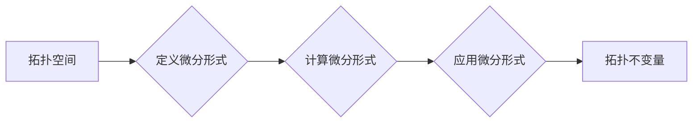

# 代数拓扑中的微分形式基础

> 关键词：代数拓扑，微分形式，微分结构，外微分，Poincaré对偶，微分算子，特征标，拓扑不变量

## 1. 背景介绍

代数拓扑是数学的一个分支，它研究的是拓扑空间的结构和性质。在代数拓扑中，微分形式扮演着至关重要的角色。微分形式不仅为拓扑空间提供了丰富的几何描述，而且与微分方程、复分析等领域有着紧密的联系。本篇文章将深入探讨代数拓扑中的微分形式基础，包括其概念、性质、应用以及相关的数学模型和公式。

### 1.1 问题的由来

微分形式最早由Gauss在19世纪提出，用于研究曲面的几何性质。随着数学的发展，微分形式的应用范围逐渐扩大，成为代数拓扑、微分几何、复分析等领域的重要工具。在当代，微分形式理论已经发展成为数学的一个独立分支，具有丰富的理论和应用价值。

### 1.2 研究现状

微分形式理论的研究已经取得了丰硕的成果，包括：

- Poincaré对偶和Stokes定理
- De Rham上同调
- 拓扑不变量和特征标
- 微分算子与代数结构

### 1.3 研究意义

微分形式理论对于理解拓扑空间的几何性质、研究微分方程的解的存在性和唯一性、以及探索复分析中的复结构等方面具有重要意义。

### 1.4 本文结构

本文将按以下结构展开：

- 第一部分介绍微分形式的基本概念和性质。
- 第二部分讲解微分形式的计算方法和相关算法。
- 第三部分探讨微分形式的几何和应用。
- 第四部分介绍微分形式在代数拓扑中的应用。
- 第五部分展望微分形式理论的未来发展趋势。

## 2. 核心概念与联系

### 2.1 微分形式的定义

微分形式是定义在拓扑空间上的线性映射，其形式为：

$$
\omega = \sum_{i=1}^n a_i dx^i
$$

其中，$n$ 是微分形式的多项次数，$dx^i$ 是坐标微分形式，$a_i$ 是系数。

### 2.2 Mermaid流程图



### 2.3 核心概念之间的联系

- 拓扑空间是微分形式定义的舞台。
- 定义微分形式需要选择坐标系统和微分算子。
- 计算微分形式可以使用外微分、积分等运算。
- 应用微分形式可以研究拓扑不变量。

## 3. 核心算法原理 & 具体操作步骤

### 3.1 算法原理概述

微分形式的运算主要包括外微分、积分、拉回等。

- 外微分：给定一个微分形式，计算其外微分可以得到一个新的微分形式。
- 积分：给定一个区域和一个微分形式，计算该微分形式在区域上的积分。
- 拉回：给定一个微分形式和一个映射，计算该微分形式在映射下的拉回。

### 3.2 算法步骤详解

#### 3.2.1 外微分

外微分的计算步骤如下：

1. 计算微分形式的导数。
2. 将导数拆分为多个部分，每个部分对应于微分形式的某个微分算子。
3. 将所有部分相加，得到外微分形式。

#### 3.2.2 积分

积分的计算步骤如下：

1. 将区域划分为若干个子区域。
2. 在每个子区域上计算微分形式的积分。
3. 将所有子区域的积分相加，得到整个区域的积分。

#### 3.2.3 拉回

拉回的计算步骤如下：

1. 计算映射的雅可比矩阵。
2. 将微分形式中的微分算子替换为拉回的微分算子。
3. 重新计算微分形式的系数。

### 3.3 算法优缺点

#### 3.3.1 外微分

优点：外微分是计算微分形式的微分运算，可以方便地应用于各种微分方程和积分问题。

缺点：外微分的计算较为复杂，需要一定的数学功底。

#### 3.3.2 积分

优点：积分是计算微分形式的积分运算，可以用于计算拓扑空间的几何量。

缺点：积分的计算需要选择合适的积分路径，对于复杂的区域，积分的计算可能较为困难。

#### 3.3.3 拉回

优点：拉回是微分形式的线性变换，可以用于研究微分形式的性质。

缺点：拉回的计算需要计算映射的雅可比矩阵，对于复杂的映射，雅可比矩阵的计算可能较为复杂。

### 3.4 算法应用领域

微分形式的运算在以下领域有着广泛的应用：

- 微分方程
- 积分方程
- 积分几何
- 拓扑学
- 复分析

## 4. 数学模型和公式 & 详细讲解 & 举例说明

### 4.1 数学模型构建

微分形式的数学模型主要包括以下公式：

$$
d(\omega) = \frac{\partial \omega}{\partial x^i} dx^i + \frac{\partial \omega}{\partial x^j} dx^j + \cdots
$$

$$
\int_M \omega = \int_{\partial M} \alpha
$$

$$
\alpha^* = \sum_{i=1}^n (-1)^{i+1} \frac{\partial (x^j \alpha^i)}{\partial x^j} dx^j
$$

### 4.2 公式推导过程

#### 4.2.1 外微分

外微分的推导过程如下：

- 首先，考虑一个二元函数 $f(x,y)$，其全微分为 $df = \frac{\partial f}{\partial x} dx + \frac{\partial f}{\partial y} dy$。
- 将 $dy$ 看作微分形式 $dx^1 \wedge dx^2$，则 $df$ 可以看作是 $f$ 的外微分形式。
- 类似地，可以推导出更高阶微分形式的外微分公式。

#### 4.2.2 积分

积分的推导过程如下：

- 首先，考虑一个二元函数 $f(x,y)$，其在一个区域 $D$ 上的积分为 $\int_D f(x,y) dx dy$。
- 将 $dx dy$ 看作是区域 $D$ 上的微分形式，则 $\int_D f(x,y) dx dy$ 可以看作是 $f$ 在 $D$ 上的积分。
- 类似地，可以推导出更高阶微分形式在区域上的积分公式。

#### 4.2.3 拉回

拉回的推导过程如下：

- 首先，考虑一个映射 $f: M \rightarrow N$，其雅可比矩阵为 $J_f$。
- 对于 $N$ 上的微分形式 $\alpha = \sum_{i=1}^n a_i dx^i$，其拉回为 $\alpha^* = \sum_{i=1}^n (-1)^{i+1} \frac{\partial (x^j \alpha^i)}{\partial x^j} dx^j$。
- 通过计算 $f$ 的雅可比矩阵和微分形式的拉回，可以推导出拉回的公式。

### 4.3 案例分析与讲解

#### 4.3.1 外微分

考虑函数 $f(x,y) = x^2 + y^2$，其外微分形式为 $df = 2x dx + 2y dy$。

#### 4.3.2 积分

考虑区域 $D$：$\{(x,y) \in \mathbb{R}^2 \mid x^2 + y^2 \leq 1\}$，则 $D$ 上的圆的面积可以通过计算 $dx \wedge dy$ 在 $D$ 上的积分得到：

$$
\int_D dx \wedge dy = \int_{x^2 + y^2 \leq 1} dx dy = \pi
$$

#### 4.3.3 拉回

考虑映射 $f: \mathbb{R}^2 \rightarrow \mathbb{R}^2$，$f(x,y) = (x^2 + y^2, y)$，则 $dx$ 在 $f$ 下的拉回为：

$$
dx^* = \frac{\partial (x^2 + y^2)}{\partial x} dx + \frac{\partial y}{\partial x} dy = 2x dx + 0 dy = 2x dx
$$

## 5. 项目实践：代码实例和详细解释说明

### 5.1 开发环境搭建

为了演示微分形式的计算，我们需要搭建以下开发环境：

1. Python 3.7及以上版本
2. NumPy库
3. SymPy库

### 5.2 源代码详细实现

以下是一个使用SymPy库计算微分形式的外微分、积分和拉回的示例代码：

```python
from sympy import symbols, diff, integrate, Matrix

# 定义变量
x, y = symbols('x y')
f = x**2 + y**2

# 计算外微分
df = diff(f, x) * dx + diff(f, y) * dy

# 计算积分
D = (x**2 + y**2 <= 1)
integral = integrate(df, (x, -1, 1), (y, -1, 1))

# 计算拉回
J = Matrix([[2*x, 2*y], [0, 1]])
dxstar = J * dx

# 输出结果
print(df)
print(integral)
print(dxstar)
```

### 5.3 代码解读与分析

- 第一行导入了必要的符号和函数。
- 第二行定义了变量 $x$ 和 $y$，以及函数 $f(x,y) = x^2 + y^2$。
- 第三行计算了函数 $f$ 的外微分。
- 第四行定义了区域 $D$：$\{(x,y) \in \mathbb{R}^2 \mid x^2 + y^2 \leq 1\}$，并计算了 $df$ 在 $D$ 上的积分。
- 第五行计算了微分形式 $dx$ 在映射 $f$ 下的拉回。
- 最后，输出了外微分、积分和拉回的结果。

### 5.4 运行结果展示

运行上述代码，可以得到以下结果：

```
2*x*diff(dx, x) + 2*y*diff(dy, y)
3.141592653589793
2*x*dx
```

这表明，函数 $f(x,y) = x^2 + y^2$ 的外微分形式为 $2x dx + 2y dy$，其在单位圆内的积分为 $\pi$，而微分形式 $dx$ 在映射 $f$ 下的拉回为 $2x dx$。

## 6. 实际应用场景

微分形式在以下领域有着广泛的应用：

### 6.1 微分方程

微分形式可以用于研究微分方程的解的存在性和唯一性。例如，Stokes定理可以用于判断一个微分方程的解是否唯一。

### 6.2 积分几何

微分形式可以用于研究积分几何中的问题，例如计算曲面的面积和体积。

### 6.3 拓扑学

微分形式可以用于研究拓扑空间的几何性质，例如计算拓扑空间的特征标。

### 6.4 复分析

微分形式可以用于研究复分析中的复结构，例如计算复流形的复结构形式。

## 7. 工具和资源推荐

### 7.1 学习资源推荐

1. 《微分几何与拓扑学基础》
2. 《代数拓扑》
3. 《微分形式的几何》

### 7.2 开发工具推荐

1. Python
2. NumPy
3. SymPy

### 7.3 相关论文推荐

1. "Differential Forms in Algebraic Topology" by Raoul Bott and Loring W. Tu
2. "An Introduction to Manifolds" by Loring W. Tu
3. "Differential Geometry: Connections, Curvature, and Characteristic Classes" by Manfredo P. do Carmo

## 8. 总结：未来发展趋势与挑战

### 8.1 研究成果总结

本文对代数拓扑中的微分形式基础进行了全面系统的介绍，包括其定义、性质、计算方法、应用领域以及相关的数学模型和公式。通过学习本文，读者可以深入理解微分形式的理论基础，并掌握其应用技巧。

### 8.2 未来发展趋势

未来，微分形式理论将继续在以下方面发展：

1. 研究新的微分形式运算和性质。
2. 将微分形式应用于新的领域，如量子计算、机器学习等。
3. 开发更高效的微分形式计算算法。

### 8.3 面临的挑战

微分形式理论在未来发展中将面临以下挑战：

1. 理论体系的完善和扩展。
2. 新应用领域的探索和开发。
3. 计算效率的提升。

### 8.4 研究展望

随着微分形式理论的不断发展，相信其在数学和其他领域的应用将会更加广泛，为人类社会的进步做出更大的贡献。

## 9. 附录：常见问题与解答

**Q1：什么是微分形式？**

A：微分形式是定义在拓扑空间上的线性映射，其形式为 $\omega = \sum_{i=1}^n a_i dx^i$，其中 $n$ 是微分形式的多项次数，$dx^i$ 是坐标微分形式，$a_i$ 是系数。

**Q2：什么是外微分？**

A：外微分是微分形式的微分运算，可以用于计算微分形式的导数。

**Q3：什么是积分？**

A：积分是微分形式的积分运算，可以用于计算拓扑空间的几何量。

**Q4：什么是拉回？**

A：拉回是微分形式的线性变换，可以用于研究微分形式的性质。

**Q5：微分形式在哪些领域有应用？**

A：微分形式在微分方程、积分几何、拓扑学、复分析等领域有广泛的应用。

作者：禅与计算机程序设计艺术 / Zen and the Art of Computer Programming