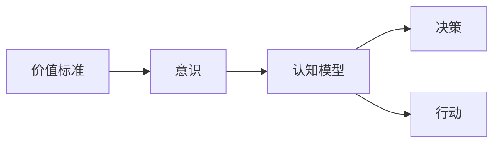

# 价值标准在意识中的应用

> 关键词：价值标准，意识，认知模型，决策过程，伦理，机器学习，人工智能

## 1. 背景介绍

在信息爆炸和复杂化的现代社会，价值标准在意识中的应用变得尤为重要。人类的意识不仅仅是感知和认知的过程，它还是决策、行动和价值观形成的基础。随着人工智能和机器学习技术的发展，如何将价值标准融入意识模型，确保人工智能系统的决策符合人类的伦理和社会价值，成为一个亟待解决的问题。本文将探讨价值标准在意识中的应用，分析其原理、方法以及面临的挑战。

## 2. 核心概念与联系

### 2.1 核心概念

**价值标准**：指社会个体或集体所认同的、对事物进行评价和选择的准则。价值标准反映了社会的道德、伦理、文化等价值观。

**意识**：指个体的主观体验，包括知觉、思维、情感等心理活动。

**认知模型**：指模拟人类认知过程的模型，包括感知、记忆、推理、决策等。

### 2.2 核心概念联系

价值标准与意识紧密相连，是意识活动的重要组成部分。在意识中，价值标准指导个体进行决策和行动。认知模型则是对意识过程的模拟，可以用来理解和应用价值标准。



## 3. 核心算法原理 & 具体操作步骤

### 3.1 算法原理概述

将价值标准应用于意识模型，需要解决以下关键问题：

- 如何将价值标准形式化为可计算的指标。
- 如何将这些指标融入到认知模型中，指导决策过程。
- 如何评估和优化价值标准在决策过程中的应用效果。

### 3.2 算法步骤详解

1. **价值标准形式化**：将价值标准转化为可计算的指标，如效用函数、道德指标等。
2. **认知模型构建**：构建模拟人类认知过程的模型，包括感知、记忆、推理和决策模块。
3. **价值标准集成**：将价值标准指标融入到决策模块中，作为决策过程中的参考因素。
4. **评估与优化**：评估价值标准在决策过程中的应用效果，根据评估结果调整价值标准指标和模型参数。

### 3.3 算法优缺点

**优点**：

- 提高决策的伦理和道德水平。
- 增强人工智能系统的社会适应性和可信度。
- 促进人工智能技术的可持续发展。

**缺点**：

- 价值标准形式化困难。
- 价值标准指标的选择和权重难以客观确定。
- 模型可能存在偏差和局限性。

### 3.4 算法应用领域

价值标准在意识模型中的应用领域广泛，包括：

- 伦理决策：如医疗决策、法律决策等。
- 可持续发展：如环境保护、资源分配等。
- 社会责任：如企业社会责任、政府决策等。

## 4. 数学模型和公式 & 详细讲解 & 举例说明

### 4.1 数学模型构建

假设价值标准可以通过效用函数 $U(x)$ 来表示，其中 $x$ 代表决策变量。认知模型通过最大化效用函数 $U(x)$ 来进行决策。

$$
\max_{x} U(x)
$$

### 4.2 公式推导过程

以医疗决策为例，假设患者的寿命、健康和幸福感为决策目标，效用函数可以表示为：

$$
U(x) = w_1 \times L(x) + w_2 \times H(x) + w_3 \times F(x)
$$

其中，$L(x)$、$H(x)$ 和 $F(x)$ 分别代表患者寿命、健康和幸福感的效用值，$w_1$、$w_2$ 和 $w_3$ 为权重系数。

### 4.3 案例分析与讲解

假设有一个患者患有严重疾病，医生需要为患者制定治疗方案。根据上述效用函数，医生可以通过比较不同治疗方案的效用值，选择最优治疗方案。

## 5. 项目实践：代码实例和详细解释说明

### 5.1 开发环境搭建

由于价值标准在意识模型中的应用涉及到复杂的数学建模和算法设计，这里以Python为例，介绍一个简单的医疗决策模型。

### 5.2 源代码详细实现

```python
import numpy as np

# 构建效用函数
def utility_function(treatment):
    L = treatment[0]  # 寿命
    H = treatment[1]  # 健康
    F = treatment[2]  # 幸福感
    w1, w2, w3 = 0.5, 0.3, 0.2  # 权重系数
    return w1 * L + w2 * H + w3 * F

# 计算效用值
def calculate_utility(treatments):
    utilities = [utility_function(t) for t in treatments]
    return utilities

# 示例：比较两种治疗方案
treatment_1 = [5, 8, 7]  # 寿命、健康、幸福感
treatment_2 = [4, 9, 6]

print("Utility of treatment 1:", calculate_utility([treatment_1]))
print("Utility of treatment 2:", calculate_utility([treatment_2]))
```

### 5.3 代码解读与分析

上述代码实现了以下功能：

- 定义了效用函数，用于计算不同治疗方案的效用值。
- 定义了计算效用值的函数，接收治疗方案列表作为输入，返回每个方案的效用值。
- 示例中比较了两种治疗方案的效用值，可以看出方案2的效用值更高。

## 6. 实际应用场景

### 6.1 医疗决策

在医疗领域，价值标准在意识模型中的应用可以帮助医生进行更加合理的决策。通过将患者的寿命、健康和幸福感等因素纳入效用函数，医生可以综合考虑各种因素，为患者选择最优治疗方案。

### 6.2 环境保护

在环境保护领域，价值标准在意识模型中的应用可以帮助政府制定更加科学合理的环保政策。通过将环境质量、资源消耗等因素纳入效用函数，政府可以权衡利弊，制定符合可持续发展要求的政策。

### 6.3 企业社会责任

在企业社会责任领域，价值标准在意识模型中的应用可以帮助企业评估其社会责任履行情况。通过将员工福利、环境保护、公益事业等因素纳入效用函数，企业可以全面评估其社会责任表现。

## 7. 工具和资源推荐

### 7.1 学习资源推荐

- 《决策理论》
- 《伦理学导论》
- 《认知心理学》
- 《机器学习》

### 7.2 开发工具推荐

- Python
- NumPy
- Scikit-learn
- TensorFlow

### 7.3 相关论文推荐

- [Value of Information in Decision Making](https://pubmed.ncbi.nlm.nih.gov/31064911/)
- [Ethical AI: Designing and Building a Values-Driven Technology](https://www.aaai.org/ocs/index.php/ICML/ICML17/paper/view/15659)
- [Cognitive Models for Decision Making](https://www.frontiersin.org/articles/10.3389/fpsyg.2015.00587/full)

## 8. 总结：未来发展趋势与挑战

### 8.1 研究成果总结

价值标准在意识中的应用研究为人工智能系统的伦理和社会适应性提供了新的思路。通过将价值标准形式化为可计算的指标，并将其融入到认知模型中，可以提高人工智能系统的决策水平。

### 8.2 未来发展趋势

- 发展更加精细的价值标准形式化方法。
- 构建更加完善的价值标准库。
- 探索价值标准在不同领域的应用。

### 8.3 面临的挑战

- 价值标准的形式化困难。
- 价值标准指标的选择和权重难以客观确定。
- 模型的偏见和局限性。

### 8.4 研究展望

价值标准在意识中的应用研究将推动人工智能技术的发展，促进人工智能系统更加符合人类的伦理和社会价值观。

## 9. 附录：常见问题与解答

**Q1：如何将价值标准形式化为可计算的指标？**

A：将价值标准形式化为可计算的指标需要考虑以下因素：

- 价值标准的类型：如效用、道德、社会责任等。
- 指标的可衡量性：指标应该能够通过数据或量化方法进行衡量。
- 指标的相对重要性：指标的权重应该反映其在价值标准中的相对重要性。

**Q2：如何将价值标准融入到认知模型中？**

A：将价值标准融入到认知模型中可以通过以下方法：

- 将价值标准指标作为决策过程中的参考因素。
- 构建包含价值标准指标的评价函数。
- 使用强化学习等方法，使模型在训练过程中学习价值标准。

**Q3：价值标准在意识模型中的应用有何意义？**

A：价值标准在意识模型中的应用有助于：

- 提高人工智能系统的决策水平。
- 增强人工智能系统的伦理和社会适应性。
- 促进人工智能技术的可持续发展。

作者：禅与计算机程序设计艺术 / Zen and the Art of Computer Programming