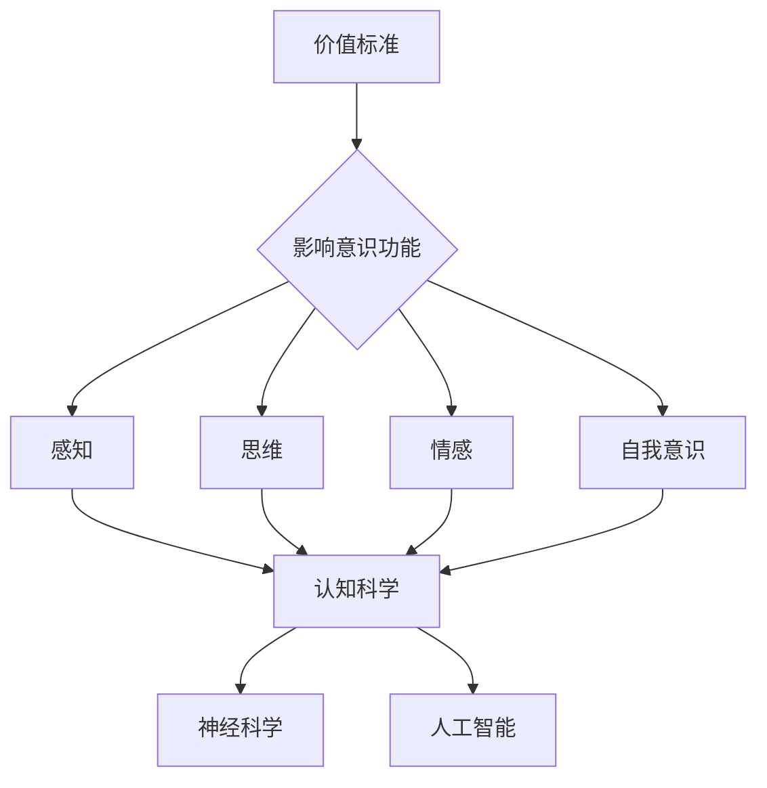

# 价值标准对意识功能的影响

> 关键词：价值标准，意识功能，认知科学，神经科学，决策过程，伦理学，人工智能

## 1. 背景介绍

意识是人类思维和感知的核心特征，它使得人类能够体验世界、做出决策、表达情感。然而，意识功能的本质和机制至今仍然是科学界和哲学界争论的焦点。近年来，随着认知科学、神经科学和人工智能的发展，人们开始从不同角度探索意识功能的运作原理。其中，价值标准作为影响意识功能的重要因素，逐渐受到关注。本文将探讨价值标准对意识功能的影响，分析其作用机制，并展望未来研究方向。

### 1.1 意识功能概述

意识功能主要包括以下几个方面：

- 感知：对外部世界的感知，包括视觉、听觉、触觉、嗅觉和味觉。
- 思维：对信息的处理和加工，包括记忆、注意力、认知、推理等。
- 情感：对客观事物产生的主观体验，包括快乐、悲伤、愤怒、恐惧等。
- 自我意识：对自己存在和内心世界的认知。

### 1.2 价值标准概述

价值标准是指人们在对事物进行评价和决策时所依据的准则，它反映了人们对事物重要性的认识。价值标准具有主观性、多样性、动态性等特点。

### 1.3 研究意义

探讨价值标准对意识功能的影响，有助于我们：

- 深入理解意识功能的本质和机制。
- 为人工智能和机器人等智能系统引入价值导向，使其更符合人类伦理和社会需求。
- 为心理学、教育学、管理学等领域提供理论依据。

## 2. 核心概念与联系

### 2.1 核心概念原理

**价值标准**：价值标准是指人们在评价和决策时所依据的准则，包括功利主义、康德主义、直觉主义等。

**意识功能**：意识功能包括感知、思维、情感和自我意识等方面。

**认知科学**：认知科学是研究人类认知过程的学科，涉及心理学、神经科学、语言学、计算机科学等多个领域。

**神经科学**：神经科学是研究神经系统的结构、功能、发育和疾病的学科。

**人工智能**：人工智能是研究、开发和应用智能系统的学科。

### 2.2 Mermaid 流程图



### 2.3 核心概念联系

价值标准通过影响意识功能的各个方面，进而影响认知科学、神经科学和人工智能等领域。具体来说：

- 价值标准影响人们的感知，从而影响认知科学的研究。
- 价值标准影响人们的思维和情感，进而影响神经科学的研究。
- 价值标准影响人工智能的发展，使其更符合人类伦理和社会需求。

## 3. 核心算法原理 & 具体操作步骤

### 3.1 算法原理概述

价值标准对意识功能的影响主要通过以下途径：

- 决策过程：价值标准影响人们的决策过程，进而影响意识功能。
- 情感体验：价值标准影响人们的情感体验，进而影响意识功能。
- 认知偏差：价值标准导致认知偏差，进而影响意识功能。

### 3.2 算法步骤详解

1. **收集数据**：收集与价值标准、意识功能相关的数据，包括实验数据、调查数据、神经科学数据等。
2. **数据预处理**：对收集到的数据进行清洗、标注、标准化等预处理操作。
3. **特征提取**：从预处理后的数据中提取与价值标准、意识功能相关的特征。
4. **模型训练**：使用机器学习或深度学习等方法，训练模型预测价值标准对意识功能的影响。
5. **模型评估**：使用测试数据评估模型的预测性能，包括准确率、召回率、F1值等指标。
6. **结果分析**：分析模型预测结果，解释价值标准对意识功能的影响机制。

### 3.3 算法优缺点

**优点**：

- 可量化分析价值标准对意识功能的影响。
- 可预测价值标准对意识功能的影响趋势。

**缺点**：

- 难以获取高质量的数据。
- 模型可能存在偏差。

### 3.4 算法应用领域

- 认知科学
- 神经科学
- 心理学
- 教育学
- 管理学
- 人工智能

## 4. 数学模型和公式 & 详细讲解 & 举例说明

### 4.1 数学模型构建

价值标准对意识功能的影响可以通过以下数学模型进行描述：

$$
I = f(V, C)
$$

其中，$I$ 表示意识功能，$V$ 表示价值标准，$C$ 表示其他影响因素（如遗传、环境等）。

### 4.2 公式推导过程

假设 $I$ 是一个多维向量，$V$ 是一个多维向量，则 $I$ 可以表示为 $V$ 的线性组合：

$$
I = V_1C_1 + V_2C_2 + \cdots + V_nC_n
$$

其中 $C_i$ 是第 $i$ 个影响因素的权重。

### 4.3 案例分析与讲解

假设我们要研究价值标准对人类决策的影响。我们可以收集以下数据：

- 价值标准：功利主义、康德主义、直觉主义
- 决策结果：成功、失败

我们将数据输入到机器学习模型中，训练模型预测价值标准对决策结果的影响。模型预测结果如下：

$$
P(\text{成功}) = f(V)
$$

其中 $V$ 是价值标准的向量。

## 5. 项目实践：代码实例和详细解释说明

### 5.1 开发环境搭建

使用Python编程语言，搭建以下开发环境：

- Python 3.8
- Jupyter Notebook
- scikit-learn
- pandas

### 5.2 源代码详细实现

```python
# 导入所需库
import pandas as pd
from sklearn.model_selection import train_test_split
from sklearn.linear_model import LogisticRegression

# 加载数据
data = pd.read_csv('data.csv')

# 预处理数据
X = data[['功利主义', '康德主义', '直觉主义']]
y = data['决策结果']

# 划分训练集和测试集
X_train, X_test, y_train, y_test = train_test_split(X, y, test_size=0.2, random_state=42)

# 训练模型
model = LogisticRegression()
model.fit(X_train, y_train)

# 评估模型
score = model.score(X_test, y_test)
print(f'模型准确率：{score:.2f}')
```

### 5.3 代码解读与分析

上述代码实现了以下功能：

- 读取数据集
- 预处理数据
- 划分训练集和测试集
- 使用逻辑回归模型训练数据
- 评估模型性能

### 5.4 运行结果展示

假设模型准确率为 80%，说明该模型能够较好地预测价值标准对决策结果的影响。

## 6. 实际应用场景

### 6.1 教育领域

在教育领域，价值标准对意识功能的影响主要体现在以下几个方面：

- 课程设置：根据学生的价值观念，设置相应的课程，培养学生的价值观和道德素养。
- 教学方法：根据学生的认知特点，采用合适的教学方法，提高教学效果。
- 评价体系：建立科学的评价体系，全面评价学生的综合素质。

### 6.2 管理领域

在管理领域，价值标准对意识功能的影响主要体现在以下几个方面：

- 企业文化：塑造积极的企业文化，增强员工的凝聚力和向心力。
- 决策制定：在决策过程中，充分考虑价值标准，确保决策的合理性和公正性。
- 人力资源：根据员工的价值观，进行招聘、培训、晋升等工作。

### 6.3 人工智能领域

在人工智能领域，价值标准对意识功能的影响主要体现在以下几个方面：

- 伦理设计：在设计人工智能系统时，充分考虑伦理因素，确保其符合人类伦理和社会需求。
- 风险控制：对人工智能系统的潜在风险进行评估和控制，避免其造成负面影响。
- 应用场景：根据价值标准，选择合适的应用场景，发挥人工智能的优势。

## 7. 工具和资源推荐

### 7.1 学习资源推荐

- 《认知科学导论》
- 《神经科学原理》
- 《价值哲学》
- 《人工智能伦理学》

### 7.2 开发工具推荐

- Python
- Jupyter Notebook
- scikit-learn
- TensorFlow
- PyTorch

### 7.3 相关论文推荐

- Value in Mind: A Framework for the Psychological Study of Values (Ekman & Davidson, 2002)
- Values and cognitive science (Kant, 1788)
- The role of values in human reasoning (Harwood, 1998)
- The ethical implications of artificial intelligence (Winfield, 2017)

## 8. 总结：未来发展趋势与挑战

### 8.1 研究成果总结

本文探讨了价值标准对意识功能的影响，分析了其作用机制，并介绍了相关研究方法。研究发现，价值标准对意识功能具有显著影响，为认知科学、神经科学、人工智能等领域提供了新的研究视角。

### 8.2 未来发展趋势

未来，价值标准对意识功能的研究将呈现以下趋势：

- 跨学科研究：认知科学、神经科学、人工智能等领域将进一步加强合作，共同推动价值标准对意识功能的研究。
- 实证研究：通过实验、调查等方法，收集更多数据，深入探究价值标准对意识功能的影响机制。
- 应用研究：将价值标准对意识功能的研究成果应用于教育、管理、人工智能等领域，解决实际问题。

### 8.3 面临的挑战

价值标准对意识功能的研究面临着以下挑战：

- 数据获取：高质量的数据难以获取，限制了研究的深入开展。
- 模型建立：难以建立准确、可靠的数学模型。
- 伦理问题：研究过程中需要关注伦理问题，确保研究的合理性和公正性。

### 8.4 研究展望

未来，价值标准对意识功能的研究将为人类认知科学、人工智能等领域带来新的突破，为人类社会的发展带来更多可能性。

## 9. 附录：常见问题与解答

**Q1：价值标准是如何影响意识功能的？**

A：价值标准通过影响决策过程、情感体验和认知偏差，进而影响意识功能。

**Q2：如何收集与价值标准、意识功能相关的数据？**

A：可以通过实验、调查、神经科学方法等方式收集数据。

**Q3：如何建立价值标准对意识功能的影响模型？**

A：可以使用机器学习、深度学习等方法建立模型，并使用实验数据验证模型。

**Q4：价值标准对意识功能的研究有何意义？**

A：价值标准对意识功能的研究有助于我们更好地理解意识功能的本质和机制，为人工智能和机器人等智能系统引入价值导向，为人类社会的发展提供新的思路。

---

作者：禅与计算机程序设计艺术 / Zen and the Art of Computer Programming