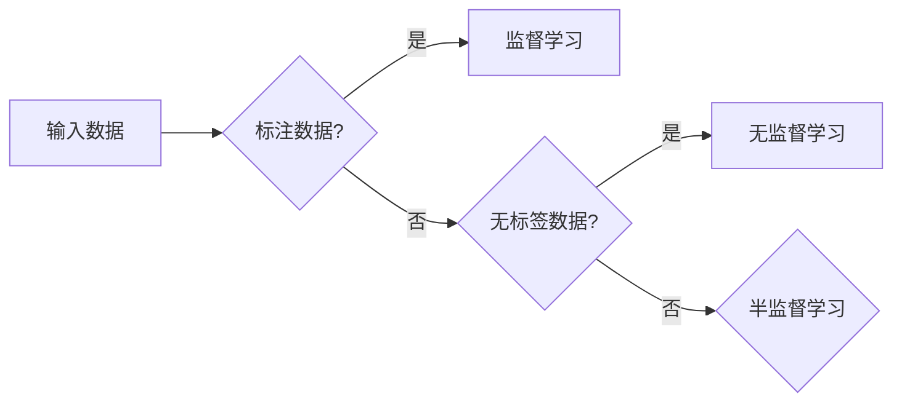

# 半监督学习 (Semi-Supervised Learning) 原理与代码实例讲解

> 关键词：半监督学习，无监督学习，监督学习，标签传播，图卷积网络，一致性正则化，半监督分类，应用场景

## 1. 背景介绍

在机器学习中，监督学习、无监督学习和半监督学习是三种主要的机器学习范式。监督学习依赖于大量标注好的数据，无监督学习则利用无标签数据进行学习，而半监督学习则是介于两者之间，利用少量标注数据和大量无标签数据共同进行学习。

随着数据量的爆炸式增长，获取大量标注数据变得越来越困难且成本高昂。因此，半监督学习作为一种有效降低数据获取成本的技术，近年来受到了广泛关注。本文将深入探讨半监督学习的原理、算法、应用场景以及代码实现。

## 2. 核心概念与联系

### 2.1 核心概念

#### 2.1.1 监督学习 (Supervised Learning)

监督学习是最常见的机器学习范式，它依赖于大量标注好的数据。在监督学习中，模型学习输入和输出之间的映射关系，从而能够对新数据进行预测。

#### 2.1.2 无监督学习 (Unsupervised Learning)

无监督学习不依赖于标注数据，而是从无标签的数据中寻找结构或模式。常见的无监督学习任务包括聚类、降维、关联规则学习等。

#### 2.1.3 半监督学习 (Semi-Supervised Learning)

半监督学习利用少量标注数据和大量无标签数据共同进行学习。通过在无标签数据中寻找与标注数据相似的样本，半监督学习可以在有限的标注数据下获得比无监督学习更优的性能。

### 2.2 核心概念原理和架构的 Mermaid 流程图



### 2.3 核心概念联系

半监督学习结合了监督学习和无监督学习的优点，通过在无标签数据中寻找与标注数据相似的样本，可以在有限的标注数据下获得比无监督学习更优的性能。

## 3. 核心算法原理 & 具体操作步骤

### 3.1 算法原理概述

半监督学习算法的核心思想是利用标注数据和无标签数据之间的关联性来提高模型性能。常见的半监督学习算法包括标签传播、图卷积网络、一致性正则化等。

### 3.2 算法步骤详解

#### 3.2.1 标签传播

标签传播算法是一种基于图的方法，通过在图中传播标签信息，将无标签数据逐渐转化为标注数据。

1. 构建图：根据数据样本之间的相似度构建图，样本作为图的节点，相似度作为边的权重。
2. 初始化标签：为标注数据分配真实标签，为无标签数据分配随机标签。
3. 传播标签：迭代更新每个节点的标签，使得节点标签尽可能接近其邻居节点的标签。
4. 重复步骤3，直至达到收敛。

#### 3.2.2 图卷积网络

图卷积网络是一种在图上定义的深度学习模型，可以用于半监督学习。

1. 构建图：根据数据样本之间的相似度构建图。
2. 定义图卷积层：利用图卷积层对节点进行特征提取。
3. 定义全连接层：将图卷积层输出的特征输入全连接层进行分类。
4. 训练模型：使用标注数据训练模型。

#### 3.2.3 一致性正则化

一致性正则化通过惩罚标签预测与邻居标签不一致的样本，来提高模型性能。

1. 训练监督学习模型：使用标注数据训练监督学习模型。
2. 计算一致性损失：计算每个样本的标签预测与邻居标签之间的差异。
3. 加载一致性损失到损失函数：将一致性损失加入监督学习模型的损失函数。
4. 训练模型：使用标注数据训练模型。

### 3.3 算法优缺点

#### 3.3.1 标签传播

优点：简单易行，易于实现。

缺点：依赖于图的构建，对于复杂关系的数据集效果较差。

#### 3.3.2 图卷积网络

优点：可以处理复杂关系的数据集，性能优越。

缺点：模型复杂，计算量大。

#### 3.3.3 一致性正则化

优点：可以有效地惩罚不一致的标签预测。

缺点：需要较大的标注数据集才能取得较好的效果。

### 3.4 算法应用领域

半监督学习算法在各个领域都有广泛的应用，以下是一些典型的应用场景：

- 文本分类：利用少量标注数据对大量无标签文本数据进行分类。
- 图像分类：利用少量标注数据对大量无标签图像数据进行分类。
- 语音识别：利用少量标注数据对大量无标签语音数据进行识别。

## 4. 数学模型和公式 & 详细讲解 & 举例说明

### 4.1 数学模型构建

以标签传播算法为例，假设数据集包含 $N$ 个样本，每个样本表示为一个特征向量 $x_i \in \mathbb{R}^d$。对于每个样本 $x_i$，定义其邻居样本集合为 $N_{i}$。

标签传播算法的目标是学习一个标签函数 $f: \mathbb{R}^d \rightarrow \mathbb{R}$，使得对于所有样本 $x_i$，标签预测 $f(x_i)$ 尽可能地接近真实标签 $y_i$。

### 4.2 公式推导过程

假设每个样本 $x_i$ 的标签预测为 $f(x_i)$，则标签传播的目标函数可以表示为：

$$
L = \sum_{i=1}^N (f(x_i) - y_i)^2
$$

为了简化计算，可以采用梯度下降法来优化目标函数。对于每个样本 $x_i$，其梯度为：

$$
\nabla f(x_i) = 2(f(x_i) - y_i)
$$

通过迭代更新标签预测 $f(x_i)$，使得其逐渐逼近真实标签 $y_i$。

### 4.3 案例分析与讲解

以文本分类任务为例，假设数据集包含 $N$ 个文本样本，每个样本表示为一个词向量 $x_i \in \mathbb{R}^d$。对于每个样本 $x_i$，定义其邻居样本集合为 $N_{i}$。

我们可以使用TF-IDF算法计算样本之间的相似度，并构建图 $G=(V,E)$，其中 $V$ 为样本集合，$E$ 为相似度矩阵。

接下来，我们可以使用标签传播算法来对每个样本进行标签预测。具体步骤如下：

1. 初始化标签：将标注数据分配真实标签，将无标签数据分配随机标签。
2. 传播标签：迭代更新每个节点的标签，使得节点标签尽可能接近其邻居节点的标签。
3. 计算标签预测：计算每个样本的标签预测 $f(x_i)$。

通过标签传播算法，我们可以利用少量标注数据对大量无标签文本数据进行分类。

## 5. 项目实践：代码实例和详细解释说明

### 5.1 开发环境搭建

在开始项目实践之前，我们需要搭建一个合适的开发环境。以下是一个基于Python的半监督学习项目的开发环境搭建步骤：

1. 安装Python 3.6及以上版本。
2. 安装NumPy、Scikit-learn、Matplotlib等依赖库。
3. 安装TensorFlow或PyTorch等深度学习框架。

### 5.2 源代码详细实现

以下是一个基于标签传播算法的半监督学习项目的代码示例：

```python
import numpy as np
from sklearn.cluster import SpectralClustering

def label_propagation(X, y, num_clusters):
    """
    标签传播算法
    """
    # 初始化标签
    labels = np.copy(y)
    
    # 构建图
    n_samples = X.shape[0]
    G = np.zeros((n_samples, n_samples))
    for i in range(n_samples):
        for j in range(n_samples):
            G[i, j] = np.exp(-np.linalg.norm(X[i] - X[j]) ** 2)
    
    # 使用谱聚类进行节点聚类
    clustering = SpectralClustering(n_clusters=num_clusters, affinity='precomputed', random_state=0)
    clustering.fit(G)
    labels = clustering.labels_
    
    return labels

# 读取数据集
X, y = load_data('data.csv')

# 使用标签传播算法进行半监督学习
labels = label_propagation(X, y, num_clusters=10)

# ... 后续处理，如可视化、分类等
```

### 5.3 代码解读与分析

以上代码首先导入了必要的库，然后定义了标签传播算法的 `label_propagation` 函数。函数接收特征矩阵 $X$、标签向量 $y$ 和聚类数量 `num_clusters` 作为输入。

在 `label_propagation` 函数中，首先将标签向量 `y` 复制到 `labels` 中。然后，根据样本之间的欧氏距离构建相似度矩阵 $G$。接下来，使用谱聚类对 $G$ 进行节点聚类，并将聚类结果赋值给 `labels`。

最后，将标签传播算法应用于数据集 $X$ 和标签向量 $y$，得到标签预测 `labels`。

### 5.4 运行结果展示

在实际应用中，我们可以通过可视化、分类等手段来评估半监督学习模型的性能。以下是一个使用Matplotlib绘制标签传播算法聚类结果的示例：

```python
import matplotlib.pyplot as plt

def plot_clusters(X, labels):
    """
    绘制聚类结果
    """
    plt.scatter(X[:, 0], X[:, 1], c=labels, cmap='viridis')

# 绘制聚类结果
plot_clusters(X, labels)
plt.xlabel('Feature 1')
plt.ylabel('Feature 2')
plt.title('Label Propagation Clustering')
plt.show()
```

以上代码首先导入了Matplotlib库，然后定义了 `plot_clusters` 函数，用于绘制聚类结果。最后，使用 `plot_clusters` 函数绘制标签传播算法的聚类结果。

## 6. 实际应用场景

### 6.1 文本分类

半监督学习在文本分类任务中有着广泛的应用。例如，在新闻分类、垃圾邮件过滤等领域，我们可以利用少量标注数据对大量无标签文本数据进行分类，提高分类准确率。

### 6.2 图像分类

在图像分类任务中，半监督学习可以用于识别未标记的图像。例如，在医学图像分析、卫星图像分类等领域，我们可以利用少量标注数据对大量无标签图像进行分类，提高识别准确率。

### 6.3 语音识别

在语音识别任务中，半监督学习可以用于识别未标记的语音。例如，在语音助手、语音翻译等领域，我们可以利用少量标注数据对大量无标签语音进行识别，提高识别准确率。

## 7. 工具和资源推荐

### 7.1 学习资源推荐

1. 《半监督学习》
2. 《Semi-Supervised Learning》
3. 《Unsupervised Learning》

### 7.2 开发工具推荐

1. TensorFlow
2. PyTorch
3. Scikit-learn

### 7.3 相关论文推荐

1. "Semi-Supervised Learning with Deep Neural Networks" by Nitesh Vaswani et al.
2. "A Tutorial on Graph Neural Networks" by William L. Hamilton
3. "Label Propagation for Semi-Supervised Learning" by Xiaojun Chang and Benjamin Yu

## 8. 总结：未来发展趋势与挑战

### 8.1 研究成果总结

半监督学习作为一种有效的机器学习范式，在各个领域都取得了显著的成果。通过利用少量标注数据和大量无标签数据，半监督学习可以显著降低数据获取成本，提高模型性能。

### 8.2 未来发展趋势

未来，半监督学习将在以下几个方面取得进展：

1. 更多的半监督学习算法将被提出，以解决不同类型的数据和任务。
2. 半监督学习将与其他机器学习范式（如强化学习）进行结合，形成新的研究热点。
3. 半监督学习将在更多领域得到应用，如生物信息学、金融、医疗等。

### 8.3 面临的挑战

尽管半监督学习取得了显著的成果，但仍面临着一些挑战：

1. 标注数据的质量和数量仍然是一个关键因素。
2. 如何更好地利用无标签数据，提高半监督学习算法的泛化能力，是一个重要的研究方向。
3. 如何将半监督学习与其他机器学习范式进行有效结合，是一个具有挑战性的课题。

### 8.4 研究展望

随着研究的不断深入，半监督学习将在数据获取成本、模型性能、应用领域等方面取得更大的突破。相信在未来，半监督学习将成为机器学习领域的一个重要研究方向，为人工智能技术的发展做出更大的贡献。

## 9. 附录：常见问题与解答

**Q1：半监督学习是否适用于所有机器学习任务？**

A：半监督学习主要适用于标注数据获取成本较高、标注数据不足的场景。对于标注数据充足的任务，使用监督学习可能效果更好。

**Q2：如何评估半监督学习模型的性能？**

A：评估半监督学习模型的性能可以参考监督学习的方法，如准确率、召回率、F1值等。

**Q3：如何选择合适的半监督学习算法？**

A：选择合适的半监督学习算法需要根据具体任务和数据特点进行考虑。例如，对于图结构数据，可以使用图卷积网络；对于文本数据，可以使用标签传播算法。

**Q4：如何处理标签噪声问题？**

A：标签噪声是指标注数据中存在错误或偏差。处理标签噪声的方法包括：清洗数据、使用更可靠的标注人员、采用数据增强技术等。

**Q5：半监督学习与迁移学习有什么区别？**

A：半监督学习利用少量标注数据和大量无标签数据共同进行学习，而迁移学习则是利用源域的知识来辅助目标域的学习。两者在数据利用方式上有所不同。

作者：禅与计算机程序设计艺术 / Zen and the Art of Computer Programming