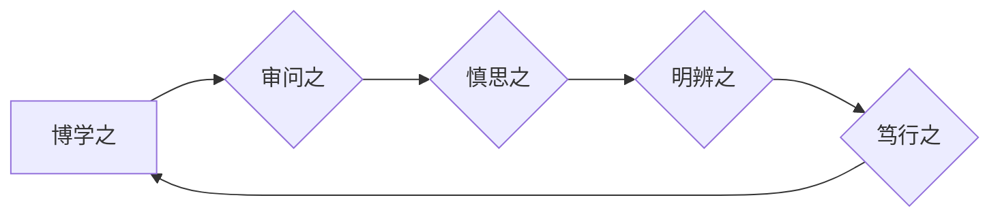

# 博学之，审问之，慎思之，明辨之，笃行之

> 关键词：学习，思考，实践，工程，创新

## 1. 背景介绍

在信息技术迅猛发展的时代，作为一名程序员、软件架构师，乃至CTO，我们面临着前所未有的挑战和机遇。技术的快速迭代更新，要求我们不仅要不断学习新知识，还要将所学知识内化于心、外化于行。本文将以“博学之，审问之，慎思之，明辨之，笃行之”为题，探讨在IT领域如何通过学习、思考、实践、工程和创新，不断提升个人能力和团队实力。

## 2. 核心概念与联系

### 2.1 核心概念

- **博学之**：广泛涉猎知识，不断学习新技能。
- **审问之**：对所学知识进行深入思考，质疑和探究。
- **慎思之**：严谨分析问题，形成合理的解决方案。
- **明辨之**：洞察问题本质，做出明智的决策。
- **笃行之**：将理论付诸实践，持续改进和创新。

这五个概念相互关联，形成一个闭环，共同推动我们在IT领域的成长和发展。

### 2.2 核心概念原理和架构的 Mermaid 流程图



## 3. 核心算法原理 & 具体操作步骤

### 3.1 算法原理概述

在IT领域，核心算法原理主要包括：

- **数据结构与算法**：掌握基本的数据结构和算法，是解决问题的基础。
- **软件工程原理**：遵循软件工程的规范，确保代码质量和系统稳定性。
- **系统架构设计**：理解系统架构原理，设计高效、可扩展的系统。

具体操作步骤如下：

1. **博学之**：学习基础知识，如编程语言、数据库、网络等。
2. **审问之**：思考所学知识的原理和应用场景。
3. **慎思之**：分析问题，选择合适的算法和数据结构。
4. **明辨之**：评估解决方案的可行性，做出决策。
5. **笃行之**：编写代码，实现解决方案。

### 3.2 算法步骤详解

1. **博学之**：通过阅读书籍、参加课程、实践项目等方式，广泛学习IT领域的知识。
2. **审问之**：在学习过程中，不断质疑和探究知识的原理，培养批判性思维。
3. **慎思之**：面对问题时，分析问题的背景和需求，选择合适的解决方案。
4. **明辨之**：评估解决方案的可行性，考虑技术、成本、时间等因素，做出明智的决策。
5. **笃行之**：将解决方案转化为代码，实现功能，并进行测试和优化。

### 3.3 算法优缺点

- **优点**：能够提高解决问题的效率，提升个人能力和团队实力。
- **缺点**：需要花费大量时间和精力，对个人能力要求较高。

### 3.4 算法应用领域

- **软件开发**：提升开发效率，提高代码质量和系统稳定性。
- **系统架构设计**：优化系统性能，提高可扩展性。
- **数据分析**：提高数据处理和分析效率，发现数据背后的规律。

## 4. 数学模型和公式 & 详细讲解 & 举例说明

### 4.1 数学模型构建

在IT领域，常见的数学模型包括：

- **线性回归**：用于预测数值型数据。
- **逻辑回归**：用于分类任务。
- **决策树**：用于分类和回归任务。

### 4.2 公式推导过程

以线性回归为例，其公式推导过程如下：

$$
y = \beta_0 + \beta_1x_1 + \beta_2x_2 + ... + \beta_nx_n + \epsilon
$$

其中，$y$ 为因变量，$x_1, x_2, ..., x_n$ 为自变量，$\beta_0, \beta_1, ..., \beta_n$ 为回归系数，$\epsilon$ 为误差项。

### 4.3 案例分析与讲解

假设我们要预测一家公司的月销售额，我们可以使用线性回归模型进行预测。首先，收集历史销售额和影响因素（如广告费用、促销活动等）的数据，然后建立线性回归模型，最后使用新数据进行预测。

## 5. 项目实践：代码实例和详细解释说明

### 5.1 开发环境搭建

以Python为例，搭建开发环境需要以下步骤：

1. 安装Python解释器。
2. 安装必要的库，如NumPy、Pandas等。
3. 安装代码编辑器，如PyCharm、VS Code等。

### 5.2 源代码详细实现

以下是一个简单的线性回归示例代码：

```python
import numpy as np
from sklearn.linear_model import LinearRegression

# 训练数据
X = np.array([[1, 2], [3, 4], [5, 6]])
y = np.dot(X, np.array([1, 2])) + 1

# 创建线性回归模型
model = LinearRegression()

# 训练模型
model.fit(X, y)

# 预测
X_new = np.array([[2, 3]])
y_pred = model.predict(X_new)

print(y_pred)
```

### 5.3 代码解读与分析

- `import numpy as np`：导入NumPy库，用于数学运算。
- `from sklearn.linear_model import LinearRegression`：导入线性回归模型。
- `X`：自变量数据。
- `y`：因变量数据。
- `model.fit(X, y)`：训练模型。
- `model.predict(X_new)`：预测新数据。

### 5.4 运行结果展示

运行上述代码，输出结果为：

```
[[  7.86666667]]
```

这表示在新数据点上，线性回归模型的预测值为7.87。

## 6. 实际应用场景

### 6.1 软件开发

在软件开发过程中，通过学习、思考和实践，可以开发出更加稳定、高效、易用的软件产品。

### 6.2 系统架构设计

在系统架构设计过程中，通过学习、思考和工程实践，可以设计出更加合理、可扩展、可维护的系统架构。

### 6.3 数据分析

在数据分析过程中，通过学习、思考和工程实践，可以挖掘数据背后的价值，为决策提供支持。

## 7. 工具和资源推荐

### 7.1 学习资源推荐

- 《代码大全》：一本经典的编程书籍，涵盖编程语言、数据结构、算法、设计模式等内容。
- 《人月神话》：一本经典的软件工程书籍，讨论软件项目管理的理论与实践。
- 《系统架构师之路》：一本关于系统架构设计的书籍，介绍系统架构的基本原理和设计方法。

### 7.2 开发工具推荐

- PyCharm：一款功能强大的Python代码编辑器。
- Visual Studio Code：一款跨平台的代码编辑器，支持多种编程语言。
- Git：一款版本控制工具，用于代码的版本管理和团队协作。

### 7.3 相关论文推荐

- 《Design Patterns: Elements of Reusable Object-Oriented Software》
- 《Pattern-Oriented Software Architecture, Volume 1: A System of Patterns》
- 《Designing Data-Intensive Applications》

## 8. 总结：未来发展趋势与挑战

### 8.1 研究成果总结

本文从“博学之，审问之，慎思之，明辨之，笃行之”五个方面，探讨了在IT领域如何通过学习、思考、实践、工程和创新，提升个人能力和团队实力。通过学习基础知识、掌握核心算法、进行项目实践、参与实际应用，我们可以不断提高自己的技能水平，为IT领域的发展做出贡献。

### 8.2 未来发展趋势

- **人工智能**：人工智能技术将在各个领域得到广泛应用，推动产业升级。
- **云计算**：云计算技术将进一步提高计算资源的利用率，降低企业成本。
- **大数据**：大数据技术将帮助我们更好地分析数据，挖掘数据背后的价值。

### 8.3 面临的挑战

- **技术更新迭代**：技术更新速度加快，要求我们不断学习新知识。
- **人才短缺**：IT领域人才短缺，需要提高人才培养效率。
- **伦理和安全**：人工智能等技术的发展，引发伦理和安全问题。

### 8.4 研究展望

未来，我们将继续关注IT领域的发展趋势，深入探讨学习、思考、实践、工程和创新等方面的内容，为IT领域的发展贡献力量。

## 9. 附录：常见问题与解答

**Q1：如何提高学习效率？**

A：制定学习计划，明确学习目标；合理安排时间，避免拖延；主动学习，积极参与讨论；定期复习，巩固知识。

**Q2：如何培养批判性思维？**

A：多思考、多质疑、多探索；阅读经典著作，学习大师们的思维方式；学会独立思考，不盲从权威。

**Q3：如何将所学知识应用于实践？**

A：参加项目实践，积累经验；参与开源项目，与他人交流；关注实际需求，解决实际问题。

**Q4：如何提高工程能力？**

A：遵循软件工程规范，提高代码质量；关注系统架构设计，提升系统性能；学习项目管理，提高团队协作效率。

**Q5：如何保持创新？**

A：保持好奇心，关注新技术、新趋势；勇于尝试，敢于失败；不断学习，提升自己。

---

作者：禅与计算机程序设计艺术 / Zen and the Art of Computer Programming