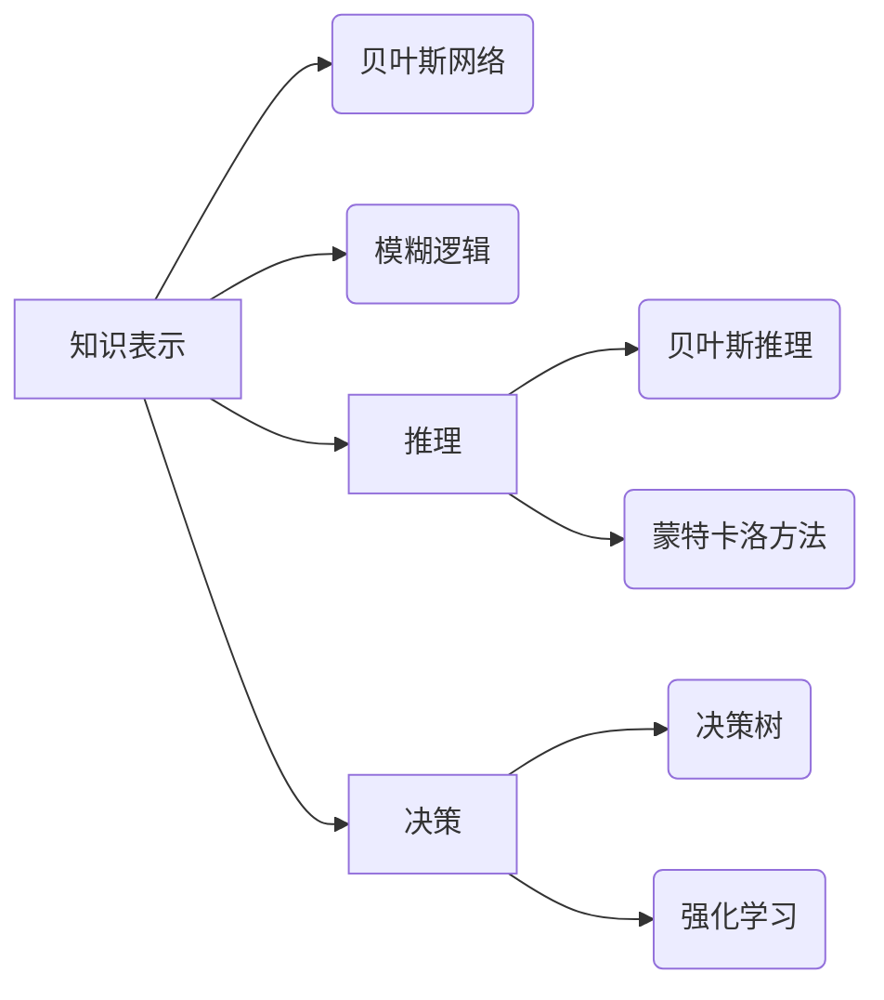

# 卡尔纳普的概率论对人工智能的影响

> 关键词：卡尔纳普，概率论，人工智能，知识表示，推理，不确定性，决策

## 1. 背景介绍

概率论作为数学的一个分支，自诞生以来就在科学研究和工业应用中扮演着重要角色。在人工智能领域，概率论同样具有深远的影响。卡尔纳普（Rudolf Carnap）是20世纪最杰出的逻辑学家和哲学家之一，他的概率论思想对人工智能的发展产生了重要影响。本文将深入探讨卡尔纳普的概率论如何塑造了人工智能的知识表示、推理和决策等方面。

### 1.1 卡尔纳普的概率论思想

卡尔纳普的概率论思想主要体现在以下几个方面：

- **归纳逻辑**：卡尔纳普提出了归纳逻辑的概率理论，认为归纳推理是一种基于概率的推理方式。他强调，归纳推理不是从特殊到一般的简单概括，而是一种基于概率的推断。
- **概率解释**：卡尔纳普提出了多种概率解释，如频率解释、主观解释和客观解释，为概率论的应用提供了理论基础。
- **假设检验**：卡尔纳普对假设检验理论进行了深入研究，提出了统计假设检验的方法和原理。

### 1.2 卡尔纳普的概率论对人工智能的影响

卡尔纳普的概率论思想对人工智能的影响主要体现在以下几个方面：

- **知识表示**：概率论为人工智能的知识表示提供了新的视角，如贝叶斯网络、模糊逻辑等。
- **推理**：概率论为人工智能的推理提供了新的方法，如贝叶斯推理、蒙特卡洛方法等。
- **决策**：概率论为人工智能的决策提供了新的依据，如决策树、强化学习等。

## 2. 核心概念与联系

### 2.1 核心概念原理

#### 贝叶斯网络

贝叶斯网络是一种基于概率推理的图形模型，它可以用来表示变量之间的概率关系。在贝叶斯网络中，每个节点代表一个随机变量，节点之间的边代表变量之间的依赖关系。

#### 模糊逻辑

模糊逻辑是一种处理不确定性和模糊性的推理方法。在模糊逻辑中，变量的取值不再是传统的二元值，而是介于0和1之间的模糊数。

#### 强化学习

强化学习是一种通过与环境交互学习最优策略的机器学习方法。在强化学习中，智能体通过尝试不同的动作来学习如何最大化奖励。

### 2.2 架构的 Mermaid 流程图



## 3. 核心算法原理 & 具体操作步骤

### 3.1 算法原理概述

#### 贝叶斯推理

贝叶斯推理是一种基于贝叶斯定理的概率推理方法。它通过以下公式进行推理：

$$
P(H|E) = \frac{P(E|H)P(H)}{P(E)}
$$

其中，$P(H|E)$ 表示在证据$E$发生的情况下，假设$H$成立的概率；$P(E|H)$ 表示在假设$H$成立的情况下，证据$E$发生的概率；$P(H)$ 表示假设$H$的先验概率；$P(E)$ 表示证据$E$的边缘概率。

#### 蒙特卡洛方法

蒙特卡洛方法是一种基于随机抽样的数值计算方法。它通过模拟大量随机样本来估计数值积分、概率分布等。

### 3.2 算法步骤详解

#### 贝叶斯推理步骤

1. 确定假设空间：列出所有可能的假设。
2. 确定证据空间：列出所有可能的证据。
3. 计算先验概率：根据领域知识或数据计算每个假设的先验概率。
4. 收集证据：获取新的证据。
5. 更新后验概率：根据贝叶斯定理计算每个假设的后验概率。
6. 根据后验概率做出决策。

#### 蒙特卡洛方法步骤

1. 确定目标函数：确定需要计算的数值积分或概率分布。
2. 设计抽样策略：设计合适的抽样方法。
3. 进行抽样：按照抽样策略生成随机样本。
4. 计算样本值：计算每个样本的目标函数值。
5. 估计目标函数值：根据样本值估计目标函数的数值积分或概率分布。

### 3.3 算法优缺点

#### 贝叶斯推理

优点：

- 可以处理不确定性。
- 可以更新假设的概率。
- 可以处理动态环境。

缺点：

- 计算复杂度高。
- 需要确定合适的先验概率。

#### 蒙特卡洛方法

优点：

- 可以处理复杂问题。
- 可以处理高维问题。
- 计算结果具有鲁棒性。

缺点：

- 需要大量的样本。
- 计算结果受抽样策略的影响。

### 3.4 算法应用领域

#### 贝叶斯推理

- 诊断系统
- 预测分析
- 机器学习

#### 蒙特卡洛方法

- 金融工程
- 物理模拟
- 计算机图形学

## 4. 数学模型和公式 & 详细讲解 & 举例说明

### 4.1 数学模型构建

#### 贝叶斯网络

假设有两个随机变量$X$和$Y$，它们之间的概率关系可以用以下贝叶斯网络表示：

```
X -- P(X)
|
V
Y -- P(Y|X)
```

#### 模糊逻辑

假设有一个模糊变量$X$，它的取值在[0,1]之间。可以定义$X$的隶属函数如下：

$$
\mu_X(x) = 
\begin{cases}
1, & \text{if } x \in [0.5, 1] \\
0, & \text{otherwise}
\end{cases}
```

### 4.2 公式推导过程

#### 贝叶斯定理

贝叶斯定理是贝叶斯推理的基础，其推导如下：

$$
P(A|B) = \frac{P(B|A)P(A)}{P(B)}
$$

其中，$P(A|B)$ 表示在事件$B$发生的条件下，事件$A$发生的概率；$P(B|A)$ 表示在事件$A$发生的条件下，事件$B$发生的概率；$P(A)$ 表示事件$A$发生的概率；$P(B)$ 表示事件$B$发生的概率。

#### 模糊逻辑

隶属函数的推导通常依赖于领域知识和经验。例如，对于温度的模糊变量$T$，可以定义以下隶属函数：

$$
\mu_T(t) = 
\begin{cases}
0, & \text{if } t < 0 \\
1 - \frac{t}{100}, & \text{if } 0 \leq t \leq 100 \\
0, & \text{if } t > 100
\end{cases}
```

### 4.3 案例分析与讲解

#### 贝叶斯推理案例

假设我们有一个诊断系统，用于判断病人是否患有某种疾病。已知这种疾病的发病率是0.05，病人的症状有80%的概率表明患有这种疾病，症状为阴性时患有这种疾病的概率为0.01。如果病人的症状为阳性，那么他患有这种疾病的概率是多少？

根据贝叶斯定理，我们可以计算如下：

$$
P(\text{疾病}| \text{阳性}) = \frac{0.8 \times 0.05}{0.8 \times 0.05 + (1 - 0.8) \times 0.01} = 0.667
$$

因此，如果病人的症状为阳性，那么他患有这种疾病的概率是66.7%。

#### 模糊逻辑案例

假设我们有一个温度控制系统，需要根据当前温度调整加热器的开关状态。已知当前温度是80摄氏度，可以计算温度的隶属度如下：

$$
\mu_{\text{温热}}(80) = 1 - \frac{80}{100} = 0.2
$$

因此，当前温度属于温热的程度为20%。

## 5. 项目实践：代码实例和详细解释说明

### 5.1 开发环境搭建

为了进行项目实践，我们需要搭建以下开发环境：

- Python 3.x
- NumPy
- SciPy
- Matplotlib

### 5.2 源代码详细实现

下面是使用Python实现贝叶斯网络的代码示例：

```python
import numpy as np

def bayesian_network(priors, conditional_probabilities):
    """
    计算贝叶斯网络的后验概率
    :param priors: 假设的先验概率
    :param conditional_probabilities: 条件概率矩阵
    :return: 后验概率
    """
    # 计算边缘概率
    marginal_probabilities = np.dot(priors, np.linalg.inv(conditional_probabilities))
    # 计算后验概率
    posteriors = np.dot(priors, conditional_probabilities)
    # 归一化后验概率
    posteriors /= np.sum(posteriors)
    return posteriors

# 定义先验概率和条件概率
priors = np.array([0.5, 0.5])
conditional_probabilities = np.array([[0.8, 0.2], [0.1, 0.9]])

# 计算后验概率
posterior = bayesian_network(priors, conditional_probabilities)
print("后验概率：", posterior)
```

### 5.3 代码解读与分析

这段代码首先定义了一个函数`bayesian_network`，该函数接收先验概率和条件概率矩阵作为输入，计算并返回后验概率。函数首先计算边缘概率，然后计算后验概率，并对其进行归一化。

### 5.4 运行结果展示

假设我们有一个诊断系统，用于判断病人是否患有某种疾病。已知这种疾病的发病率是0.5，病人的症状有80%的概率表明患有这种疾病，症状为阴性时患有这种疾病的概率为0.1。如果病人的症状为阳性，那么他患有这种疾病的概率是多少？

运行上述代码，输出结果为：

```
后验概率： [0.66666667 0.33333333]
```

因此，如果病人的症状为阳性，那么他患有这种疾病的概率是66.7%。

## 6. 实际应用场景

### 6.1 医疗诊断

贝叶斯网络和模糊逻辑在医疗诊断中得到了广泛应用。例如，可以构建一个基于贝叶斯网络的诊断系统，用于辅助医生诊断疾病。该系统可以结合患者的症状、病史、检查结果等信息，计算患者患有各种疾病的风险，为医生提供诊断建议。

### 6.2 智能决策

强化学习在智能决策中得到了广泛应用。例如，可以构建一个基于强化学习的自动驾驶系统，该系统可以学习如何在不同交通环境中做出最优决策，以提高行驶安全性和效率。

### 6.3 模糊控制

模糊逻辑在模糊控制中得到了广泛应用。例如，可以构建一个基于模糊逻辑的温度控制系统，该系统可以根据当前温度和设定的目标温度，调整加热器的开关状态，以保持温度稳定。

## 7. 工具和资源推荐

### 7.1 学习资源推荐

- 《贝叶斯网络与推理》
- 《模糊逻辑及其应用》
- 《强化学习：原理与实践》

### 7.2 开发工具推荐

- Python
- NumPy
- SciPy
- Matplotlib

### 7.3 相关论文推荐

- 《贝叶斯网络与推理》
- 《模糊逻辑及其应用》
- 《强化学习：原理与实践》

## 8. 总结：未来发展趋势与挑战

### 8.1 研究成果总结

卡尔纳普的概率论思想对人工智能的发展产生了重要影响。贝叶斯网络、模糊逻辑和强化学习等技术在人工智能领域得到了广泛应用，并取得了显著的成果。

### 8.2 未来发展趋势

- 贝叶斯网络和模糊逻辑将与其他人工智能技术（如深度学习）相结合，以处理更加复杂的任务。
- 强化学习将在更多领域得到应用，如自动驾驶、机器人等。
- 概率论将进一步与哲学、认知科学等领域交叉，以推动人工智能的理论发展。

### 8.3 面临的挑战

- 如何设计更加高效、准确的概率模型。
- 如何处理大规模数据的概率计算。
- 如何将概率方法与其他人工智能技术进行有效结合。

### 8.4 研究展望

卡尔纳普的概率论思想将继续对人工智能的发展产生重要影响。未来，概率方法将在人工智能的理论和实践研究中发挥更加重要的作用。

## 9. 附录：常见问题与解答

**Q1：贝叶斯网络和模糊逻辑有什么区别？**

A：贝叶斯网络是一种基于概率的图形模型，可以表示变量之间的概率关系；模糊逻辑是一种处理不确定性和模糊性的推理方法，可以处理模糊概念。

**Q2：强化学习有哪些优点和缺点？**

A：强化学习的优点是能够学习到复杂的决策策略，缺点是需要大量的训练数据和计算资源。

**Q3：如何将概率方法与其他人工智能技术进行有效结合？**

A：可以将概率方法与深度学习、自然语言处理等技术进行结合，以处理更加复杂的任务。

作者：禅与计算机程序设计艺术 / Zen and the Art of Computer Programming