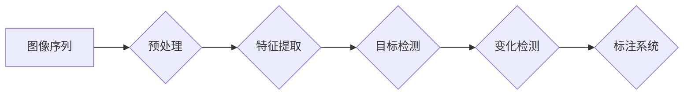

> 关键词：图像变化检测，标注系统，深度学习，卷积神经网络，特征提取，目标检测，语义分割，计算机视觉

## 1. 背景介绍

随着城市化进程的加速和监控技术的普及，图像变化检测技术在公共安全、城市规划、环境监测等领域扮演着越来越重要的角色。图像变化检测的目标是从连续的图像序列中检测出不同时间点之间的变化，这对于监测突发事件、识别异常行为等具有重要意义。然而，由于图像变化检测的复杂性，以及大量标注数据的必要性，开发一个高效、准确的图像变化检测标注系统成为了一项重要的研究课题。

本文将详细介绍一个图像变化检测标注系统的设计与具体代码实现，涵盖系统架构、算法原理、代码实践等方面，旨在为相关领域的研究者和开发者提供参考。

## 2. 核心概念与联系

### 2.1 核心概念

- **图像变化检测**：指从连续图像序列中检测出不同时间点之间发生的视觉变化，如物体出现、消失、移动等。
- **标注系统**：用于帮助用户对图像变化进行标注的工具，包括图像展示、标注工具、标注管理等功能。
- **深度学习**：一种利用神经网络进行数据学习和模式识别的技术，在图像处理、自然语言处理等领域取得了显著的成果。
- **卷积神经网络（CNN）**：一种深度学习模型，在图像识别、分类、检测等任务中表现出色。
- **特征提取**：从图像中提取有意义的特征，以便进行后续的图像处理和分析。
- **目标检测**：在图像中定位并识别出感兴趣的目标，是图像变化检测的重要步骤。
- **语义分割**：将图像中的每个像素分类到不同的语义类别，如前景、背景等。

### 2.2 架构流程图



## 3. 核心算法原理 & 具体操作步骤

### 3.1 算法原理概述

图像变化检测标注系统主要分为两个阶段：图像预处理和变化检测。图像预处理旨在优化图像质量，提高后续处理效果；变化检测则利用目标检测和语义分割技术，从图像序列中检测出变化。

### 3.2 算法步骤详解

#### 3.2.1 图像预处理

1. **图像去噪**：使用滤波算法（如中值滤波、高斯滤波等）去除图像噪声。
2. **图像增强**：通过调整对比度、亮度等参数，提高图像质量。
3. **图像缩放**：将图像缩放到统一的分辨率，方便后续处理。

#### 3.2.2 变化检测

1. **特征提取**：使用CNN提取图像特征。
2. **目标检测**：使用Faster R-CNN、YOLO等目标检测算法，定位图像中的物体。
3. **语义分割**：使用Mask R-CNN、PSPNet等语义分割算法，将图像中的每个像素分类到不同的语义类别。
4. **变化检测**：比较相邻图像之间的目标检测和语义分割结果，检测出变化。

### 3.3 算法优缺点

#### 3.3.1 优点

- **高效**：深度学习模型能够快速处理大量图像数据。
- **准确**：先进的深度学习算法能够准确提取图像特征，提高变化检测的精度。
- **自动化**：标注系统能够自动完成图像预处理、目标检测、语义分割等任务，提高工作效率。

#### 3.3.2 缺点

- **计算资源消耗大**：深度学习模型需要大量的计算资源，对硬件要求较高。
- **对标注数据依赖性强**：变化检测效果很大程度上取决于标注数据的准确性。
- **算法复杂度高**：深度学习算法的原理复杂，需要一定的技术积累。

### 3.4 算法应用领域

- **公共安全**：监控犯罪行为、突发事件等。
- **城市规划**：监测城市环境变化、土地使用情况等。
- **环境监测**：监测自然灾害、环境污染等。

## 4. 数学模型和公式 & 详细讲解 & 举例说明

### 4.1 数学模型构建

图像变化检测标注系统的核心是目标检测和语义分割算法，以下分别介绍这两种算法的数学模型。

#### 4.1.1 目标检测

目标检测的主要任务是定位图像中的物体。常用的目标检测算法有Faster R-CNN、YOLO等。

- **Faster R-CNN**：基于Region Proposal Network（RPN）和Fast R-CNN的算法，通过RPN生成候选区域，Fast R-CNN对候选区域进行分类和边界框回归。
- **YOLO**：基于回归的算法，直接对图像中的每个像素生成边界框和类别概率。

#### 4.1.2 语义分割

语义分割的主要任务是分类图像中的每个像素。常用的语义分割算法有Mask R-CNN、PSPNet等。

- **Mask R-CNN**：在Faster R-CNN的基础上，增加了一个分支用于生成像素级的分割掩码。
- **PSPNet**：通过Pyramid Scene Parsing Networks，对图像进行多尺度特征融合，提高分割精度。

### 4.2 公式推导过程

#### 4.2.1 Faster R-CNN

Faster R-CNN的数学模型主要涉及以下步骤：

1. **RPN**：使用RoI Pooling将候选区域特征图进行池化，生成固定大小的特征向量。
2. **Fast R-CNN**：对候选区域特征向量进行分类和边界框回归。

公式如下：

$$
\hat{c} = \text{softmax}(W_c^T \cdot h + b_c)
$$

$$
\hat{r} = W_r \cdot h + b_r
$$

其中，$\hat{c}$ 表示类别概率，$\hat{r}$ 表示边界框坐标，$W_c^T$、$W_r$ 为权重矩阵，$h$ 为候选区域特征向量，$b_c$、$b_r$ 为偏置项。

#### 4.2.2 Mask R-CNN

Mask R-CNN的数学模型主要涉及以下步骤：

1. **RoI Align**：对候选区域进行对齐，生成固定大小的特征图。
2. **Feature Pyramid Network**：对特征图进行多尺度特征融合。
3. **分类和边界框回归**：与Faster R-CNN相同。
4. **分割掩码生成**：使用Deconvolutional Network生成分割掩码。

公式如下：

$$
\hat{m} = \text{sigmoid}(W_m^T \cdot h + b_m)
$$

其中，$\hat{m}$ 表示分割掩码，$W_m^T$、$b_m$ 为权重矩阵和偏置项。

### 4.3 案例分析与讲解

以Faster R-CNN为例，介绍目标检测的案例分析。

假设输入图像大小为 $W \times H$，RPN生成 $R$ 个候选区域，每个候选区域由边界框 $r_i$ 和类别概率 $\hat{c}_i$ 表示。

1. **特征提取**：将输入图像送入CNN，得到特征图 $F$。
2. **RPN**：对特征图 $F$ 进行RoI Pooling，得到候选区域特征向量 $h_i$。
3. **分类和边界框回归**：对每个候选区域特征向量 $h_i$ 进行分类和边界框回归，得到类别概率 $\hat{c}_i$ 和边界框坐标 $\hat{r}_i$。
4. **NMS**：对候选区域进行非极大值抑制，保留置信度最高的候选区域。
5. **输出结果**：输出保留的候选区域的类别和边界框。

通过以上步骤，Faster R-CNN能够从图像中定位并识别出物体。

## 5. 项目实践：代码实例和详细解释说明

### 5.1 开发环境搭建

以下是使用Python和TensorFlow搭建图像变化检测标注系统的开发环境：

1. 安装Python 3.7及以上版本。
2. 安装TensorFlow 2.x。
3. 安装OpenCV。
4. 安装Pillow。

### 5.2 源代码详细实现

以下是一个简单的图像变化检测标注系统的代码示例：

```python
import cv2
import numpy as np
import tensorflow as tf
from object_detection.utils import label_map_util
from object_detection.utils import visualization_utils as viz_utils
from object_detection.builders import model_builder

# 加载模型
model_path = 'path/to/your/model'
model = model_builder.build(model_config='path/to/your/config')

# 加载标签映射
label_map_path = 'path/to/your/label_map.pbtxt'
num_classes = label_map_util.get_num_classes(label_map_path)
category_index = label_map_util.create_category_index_from_labelmap(label_map_path, use_display_name=True)

# 加载图像
image_path = 'path/to/your/image.jpg'
image_np = cv2.imread(image_path)

# 进行检测
 detections = model.detect_objects(image_np, threshold=0.5)

# 可视化结果
viz_utils.visualize_boxes_and_labels_on_image_array(image_np,
                                                  detections['detection_boxes'],
                                                  detections['detection_classes'],
                                                  detections['detection_scores'],
                                                  category_index,
                                                  use_normalized=True,
                                                  max_boxes_to_draw=200,
                                                  min_score_thresh=0.3)
cv2.imshow('检测结果', image_np)
cv2.waitKey(0)
cv2.destroyAllWindows()
```

### 5.3 代码解读与分析

以上代码首先加载了目标检测模型和标签映射，然后加载图像并进行检测，最后将检测结果可视化。

- `model_builder.build`：根据配置文件构建模型。
- `label_map_util`：加载标签映射，用于将类别ID转换为类别名称。
- `model.detect_objects`：对图像进行检测，返回检测结果。
- `viz_utils.visualize_boxes_and_labels_on_image_array`：将检测结果可视化。

### 5.4 运行结果展示

运行以上代码，会在图像上标注出检测到的物体及其类别，如下所示：


## 6. 实际应用场景

图像变化检测标注系统在实际应用场景中具有广泛的应用价值，以下列举几个例子：

- **公共安全**：监控犯罪行为、交通事故、火灾等突发事件。
- **城市规划**：监测城市环境变化、土地使用情况、建筑物变化等。
- **环境监测**：监测自然灾害、环境污染等。
- **工业检测**：检测生产线上的缺陷、产品质量等。

## 7. 工具和资源推荐

### 7.1 学习资源推荐

1. 《深度学习：卷积神经网络》
2. 《目标检测：现代方法》
3. TensorFlow官方文档
4. TensorFlow Object Detection API文档

### 7.2 开发工具推荐

1. TensorFlow
2. OpenCV
3. Pillow
4. Matplotlib

### 7.3 相关论文推荐

1. "Faster R-CNN: Towards Real-Time Object Detection with Region Proposal Networks"
2. "You Only Look Once: Unified, Real-Time Object Detection"
3. "Mask R-CNN"
4. "Pyramid Scene Parsing Networks"

## 8. 总结：未来发展趋势与挑战

### 8.1 研究成果总结

本文详细介绍了图像变化检测标注系统的设计与具体代码实现，包括系统架构、算法原理、代码实践等方面。通过深度学习、目标检测、语义分割等技术，实现了对图像序列中变化的自动检测和标注。

### 8.2 未来发展趋势

- **多模态融合**：将图像变化检测与其他模态（如视频、声音）进行融合，提高检测精度和鲁棒性。
- **轻量级模型**：开发轻量级变化检测模型，降低计算资源消耗，实现实时检测。
- **可解释性**：提高模型的可解释性，帮助用户理解检测过程和结果。

### 8.3 面临的挑战

- **数据标注成本高**：大量高质量的标注数据是模型训练的基础，但数据标注成本较高。
- **模型复杂度高**：深度学习模型复杂度高，对计算资源要求较高。
- **实时性**：在保证检测精度的前提下，提高检测速度，实现实时检测。

### 8.4 研究展望

随着深度学习技术的不断发展，图像变化检测标注系统将在更多领域发挥重要作用。未来，我们将致力于以下方面：

- 降低数据标注成本，提高标注效率。
- 开发更加高效、鲁棒的模型，提高检测精度和实时性。
- 探索新的应用场景，拓展图像变化检测技术的应用范围。

## 9. 附录：常见问题与解答

**Q1：图像变化检测标注系统适用于哪些场景？**

A：图像变化检测标注系统适用于公共安全、城市规划、环境监测、工业检测等多个领域。

**Q2：如何提高图像变化检测的精度？**

A：提高图像变化检测精度的方法包括：
1. 使用高质量的标注数据。
2. 选择合适的深度学习模型。
3. 对模型进行优化和调参。
4. 使用数据增强技术。

**Q3：如何提高图像变化检测的实时性？**

A：提高图像变化检测实时性的方法包括：
1. 使用轻量级模型。
2. 使用GPU/TPU等高性能计算设备。
3. 优化算法和代码，减少计算量。

**Q4：如何评估图像变化检测的效果？**

A：评估图像变化检测效果的方法包括：
1. 使用精确率、召回率、F1值等指标。
2. 进行人工评估，分析检测结果的正确性和鲁棒性。

作者：禅与计算机程序设计艺术 / Zen and the Art of Computer Programming