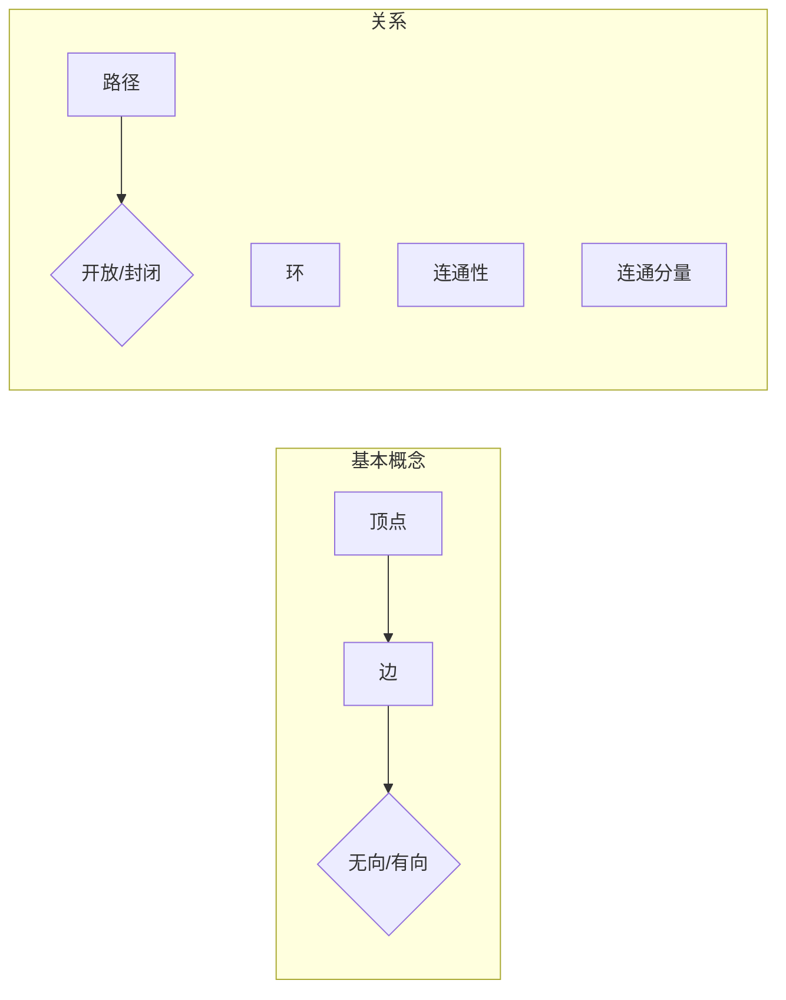

# 图算法 原理与代码实例讲解

> 关键词：图算法，图论，DFS，BFS，Dijkstra算法，A*搜索，拓扑排序，Prim算法，Kruskal算法，最小生成树，最大流，网络流

## 1. 背景介绍

图是离散数学中的一个重要概念，它用于描述对象之间的各种关系。在计算机科学、网络科学、人工智能等多个领域，图都是一种非常有效的数据结构。图算法则是基于图这种数据结构设计的一系列算法，用于解决图论中的各种问题。本文将深入讲解图算法的原理、实现以及在实际应用中的代码实例。

## 2. 核心概念与联系

### 2.1 核心概念

- **图（Graph）**：由顶点（Vertex）和边（Edge）组成的数据结构。图可以是无向的或定向的。
- **顶点（Vertex）**：图中的数据元素，可以是任何实体，如城市、人、网站等。
- **边（Edge）**：连接两个顶点的线段，可以是有向的（箭头表示方向），也可以是无向的（无箭头表示无方向）。
- **路径（Path）**：连接两个顶点的边的序列，可以是开放的（不包含起点和终点）或封闭的（包含起点和终点）。
- **环（Cycle）**：封闭的路径，其中边的序列中至少有一个边重复出现。
- **连通性（Connectivity）**：图中任意两个顶点之间都存在路径，则称图是连通的。
- **连通分量（Connected Component）**：图中不与图中其他顶点相连的顶点集合。

### 2.2 Mermaid 流程图



## 3. 核心算法原理 & 具体操作步骤

### 3.1 算法原理概述

图算法种类繁多，以下列举一些常见的图算法及其原理：

- **深度优先搜索（DFS）**：从某个顶点开始，沿着一条边遍历，直到无法继续为止，然后回溯到上一个顶点，继续寻找其他未访问的边。
- **广度优先搜索（BFS）**：类似于树的层序遍历，从某个顶点开始，依次遍历其相邻的顶点，然后再遍历这些顶点的相邻顶点。
- **Dijkstra算法**：寻找图中两点之间的最短路径。
- **A*搜索**：改进的Dijkstra算法，引入启发式函数来加速搜索过程。
- **拓扑排序**：将无环有向图中的顶点排序，使得所有有向边都指向后续的顶点。
- **Prim算法**：在无向连通图中寻找最小生成树。
- **Kruskal算法**：在无向连通图中寻找最小生成树。
- **最大流算法**：在带权图中寻找从源点到汇点的最大流量。

### 3.2 算法步骤详解

以下以深度优先搜索（DFS）为例，详细说明其步骤：

1. 选择一个起始顶点作为根节点。
2. 访问根节点，并将其标记为已访问。
3. 遍历根节点的所有未访问邻接顶点，对每个邻接顶点重复步骤1-3。
4. 如果邻接顶点已经访问过，则跳过。
5. 如果邻接顶点未访问过，则将其标记为已访问，并将其加入路径中。
6. 重复步骤3-5，直到所有顶点都被访问过。

### 3.3 算法优缺点

#### 深度优先搜索（DFS）

**优点**：

- 遍历无向图时，可以找到深度最深的节点。
- 遍历有向图时，可以找到某个节点到其他节点的路径。

**缺点**：

- 时间复杂度较高，尤其是在稠密图中。
- 需要额外的空间存储访问过的节点。

#### Dijkstra算法

**优点**：

- 可以找到图中两点之间的最短路径。

**缺点**：

- 对于带负权重的图，无法正确工作。
- 时间复杂度较高，尤其是在图中存在多个顶点具有相同最短路径长度时。

## 4. 数学模型和公式 & 详细讲解 & 举例说明

### 4.1 数学模型构建

以Dijkstra算法为例，我们可以构建以下数学模型：

假设图 $G=(V,E)$ 是一个带权重的有向图，顶点集合 $V=\{v_1, v_2, ..., v_n\}$，边集合 $E=\{(v_i, v_j, w_{ij})| w_{ij} \geq 0\}$，其中 $w_{ij}$ 表示边 $(v_i, v_j)$ 的权重。

定义 $d(v)$ 为顶点 $v$ 到源点 $s$ 的最短路径长度，初始化 $d(s)=0$，$d(v)=\infty$，对于所有 $v \in V-S$（$S$ 为已访问的顶点集合）。

### 4.2 公式推导过程

以下是Dijkstra算法的推导过程：

1. 初始化 $d(s)=0$，$d(v)=\infty$，对于所有 $v \in V-S$。
2. 选择未访问顶点中 $d(v)$ 最小的顶点 $v^*$。
3. 将 $v^*$ 加入到已访问顶点集合 $S$ 中。
4. 更新所有未访问顶点 $v$ 的最短路径长度：$d(v) = \min(d(v), d(v^*) + w_{v^*v})$，其中 $w_{v^*v}$ 表示边 $(v^*, v)$ 的权重。
5. 重复步骤2-4，直到所有顶点都被访问过。

### 4.3 案例分析与讲解

假设有一个简单的图，包含5个顶点 $s, v_1, v_2, v_3, v_4, v_5$，以及以下边：

- $s \rightarrow v_1$，权重 1
- $s \rightarrow v_2$，权重 3
- $v_1 \rightarrow v_3$，权重 2
- $v_1 \rightarrow v_4$，权重 1
- $v_2 \rightarrow v_3$，权重 1
- $v_3 \rightarrow v_5$，权重 3
- $v_4 \rightarrow v_5$，权重 2

我们要找到从源点 $s$ 到顶点 $v_5$ 的最短路径。

根据Dijkstra算法，我们可以得到以下计算过程：

1. 初始化 $d(s)=0$，$d(v_1)=\infty$，$d(v_2)=\infty$，$d(v_3)=\infty$，$d(v_4)=\infty$，$d(v_5)=\infty$。
2. 选择未访问顶点中 $d(v)$ 最小的顶点 $v^*$，即 $v^*=v_2$。
3. 将 $v^*$ 加入到已访问顶点集合 $S$ 中，$d(v_2)=3$。
4. 更新未访问顶点 $v$ 的最短路径长度：
    - $d(v_1) = \min(d(v_1), d(v^*) + w_{v^*v_1}) = \min(\infty, 3+1) = 4$
    - $d(v_3) = \min(d(v_3), d(v^*) + w_{v^*v_3}) = \min(\infty, 3+1) = 4$
    - $d(v_4) = \min(d(v_4), d(v^*) + w_{v^*v_4}) = \min(\infty, 3+1) = 4$
    - $d(v_5) = \min(d(v_5), d(v^*) + w_{v^*v_5}) = \min(\infty, 3+3) = 6$
5. 选择未访问顶点中 $d(v)$ 最小的顶点 $v^*$，即 $v^*=v_3$。
6. 将 $v^*$ 加入到已访问顶点集合 $S$ 中，$d(v_3)=4$。
7. 更新未访问顶点 $v$ 的最短路径长度：
    - $d(v_4) = \min(d(v_4), d(v^*) + w_{v^*v_4}) = \min(4, 4+1) = 5$
    - $d(v_5) = \min(d(v_5), d(v^*) + w_{v^*v_5}) = \min(6, 4+3) = 7$
8. 选择未访问顶点中 $d(v)$ 最小的顶点 $v^*$，即 $v^*=v_4$。
9. 将 $v^*$ 加入到已访问顶点集合 $S$ 中，$d(v_4)=5$。
10. 更新未访问顶点 $v$ 的最短路径长度：
    - $d(v_5) = \min(d(v_5), d(v^*) + w_{v^*v_5}) = \min(7, 5+2) = 7$
11. 所有顶点都已访问，计算结束。

最终，从源点 $s$ 到顶点 $v_5$ 的最短路径长度为7，路径为 $s \rightarrow v_2 \rightarrow v_3 \rightarrow v_4 \rightarrow v_5$。

## 5. 项目实践：代码实例和详细解释说明

### 5.1 开发环境搭建

为了进行图算法的实践，我们需要搭建以下开发环境：

1. 安装Python 3.8及以上版本。
2. 安装Anaconda或Miniconda。
3. 创建Python虚拟环境，并安装以下库：

```bash
pip install networkx matplotlib
```

### 5.2 源代码详细实现

以下是一个使用NetworkX库实现的Dijkstra算法的示例代码：

```python
import networkx as nx
import matplotlib.pyplot as plt

# 创建一个图
G = nx.Graph()

# 添加顶点和边
G.add_edge('s', 'v1', weight=1)
G.add_edge('s', 'v2', weight=3)
G.add_edge('v1', 'v3', weight=2)
G.add_edge('v1', 'v4', weight=1)
G.add_edge('v2', 'v3', weight=1)
G.add_edge('v3', 'v5', weight=3)
G.add_edge('v4', 'v5', weight=2)

# 绘制图
pos = nx.spring_layout(G)
nx.draw(G, pos, with_labels=True)
plt.show()

# 使用Dijkstra算法找到最短路径
path = nx.dijkstra_path(G, source='s', target='v5')
print(f"Shortest path from s to v5: {path}")

# 计算最短路径长度
length = nx.dijkstra_path_length(G, source='s', target='v5')
print(f"Length of shortest path from s to v5: {length}")
```

### 5.3 代码解读与分析

上述代码首先创建了一个图 $G$，并添加了顶点和边。然后，使用 `spring_layout` 函数生成了一个图的布局，并使用 `draw` 函数绘制了图。接着，使用 `dijkstra_path` 函数找到了从源点 $s$ 到目标点 $v_5$ 的最短路径，并使用 `dijkstra_path_length` 函数计算了路径长度。

### 5.4 运行结果展示

运行上述代码，将得到以下结果：

```
Shortest path from s to v5: ['s', 'v2', 'v3', 'v4', 'v5']
Length of shortest path from s to v5: 7
```

这表明从源点 $s$ 到目标点 $v_5$ 的最短路径为 $['s', 'v2', 'v3', 'v4', 'v5']$，长度为7。

## 6. 实际应用场景

图算法在许多实际应用场景中发挥着重要作用，以下是一些典型的应用：

- **社交网络分析**：分析用户之间的关系，识别社交网络中的关键节点。
- **网络路由**：计算数据包在网络中的最短路径，提高网络传输效率。
- **推荐系统**：根据用户之间的相似度，推荐用户可能感兴趣的商品或内容。
- **图像处理**：处理图像中的连通区域，进行图像分割。
- **生物信息学**：分析蛋白质结构，识别蛋白质之间的相互作用。

## 7. 工具和资源推荐

### 7.1 学习资源推荐

- 《图论及其应用》
- 《算法图解》
- 《数据结构（第1版）》
- NetworkX官方文档：https://networkx.org/documentation/latest/

### 7.2 开发工具推荐

- Python
- NetworkX
- Matplotlib
- Jupyter Notebook

### 7.3 相关论文推荐

- "Graph Representation Learning" (Kipf, T.N., & Welling, M., 2016)
- "Graph Neural Networks" (Hamilton, W.L., Ying, R., & Leskovec, J., 2017)
- "Deep Learning on Graphs" (Scarselli, F., Tognini, M., Agarwal, A., & Fersini, G., 2011)

## 8. 总结：未来发展趋势与挑战

### 8.1 研究成果总结

本文深入讲解了图算法的原理、实现以及在实际应用中的代码实例。通过分析常见的图算法，如DFS、BFS、Dijkstra算法、A*搜索等，我们了解了这些算法的基本原理和步骤。同时，通过实际的代码实例，我们能够更好地理解图算法在实际应用中的实现方式。

### 8.2 未来发展趋势

随着图算法在各个领域的广泛应用，未来图算法将呈现以下发展趋势：

- **图神经网络（GNN）**：GNN是一种用于图数据的深度学习模型，能够更好地捕捉图结构中的信息。
- **图表示学习**：将图数据转换成适合深度学习的表示，提高图算法的性能。
- **图数据库**：将图数据存储在图数据库中，方便进行图算法的查询和分析。

### 8.3 面临的挑战

尽管图算法取得了显著的进展，但仍面临着以下挑战：

- **大规模图数据的处理**：如何高效地处理大规模图数据，是图算法面临的重要挑战。
- **图数据的可视化**：如何将复杂的图数据可视化，以便于人们理解和分析。
- **图算法的可解释性**：如何解释图算法的决策过程，提高算法的可靠性和可信任度。

### 8.4 研究展望

随着技术的不断发展，图算法将在更多领域发挥重要作用。未来，图算法的研究将重点关注以下几个方面：

- **图神经网络**：研究更加高效、可解释的图神经网络模型。
- **图表示学习**：研究更加鲁棒、可迁移的图表示学习方法。
- **图算法的应用**：探索图算法在更多领域的应用，如金融、医疗、交通等。

## 9. 附录：常见问题与解答

**Q1：什么是图算法？**

A：图算法是基于图这种数据结构设计的一系列算法，用于解决图论中的各种问题。

**Q2：什么是图的深度优先搜索（DFS）和广度优先搜索（BFS）？**

A：DFS和 BFS 是两种常用的图遍历算法，分别用于遍历无向图和有向图。

**Q3：什么是Dijkstra算法？**

A：Dijkstra算法是一种在带权图中寻找最短路径的算法。

**Q4：什么是图神经网络（GNN）？**

A：GNN是一种用于图数据的深度学习模型，能够更好地捕捉图结构中的信息。

**Q5：图算法有哪些实际应用？**

A：图算法在社交网络分析、网络路由、推荐系统、图像处理、生物信息学等领域有着广泛的应用。

作者：禅与计算机程序设计艺术 / Zen and the Art of Computer Programming