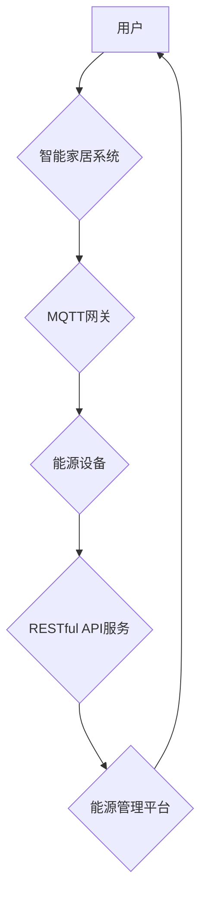

# 基于MQTT协议和RESTful API的家用能源管理系统优化

> 关键词：MQTT协议，RESTful API，家用能源管理，物联网，智能家庭，能源消耗，能耗优化

## 1. 背景介绍

随着全球能源需求的不断增长和环境问题的日益严重，能源管理已经成为一个全球性的挑战。家用能源管理作为能源管理的重要组成部分，对于提高家庭能源效率、减少能源消耗、降低家庭开支具有重要意义。传统的家用能源管理系统往往依赖于复杂的控制系统和专业的技术人员，难以普及和推广。近年来，随着物联网和智能家居技术的快速发展，基于MQTT协议和RESTful API的家用能源管理系统应运而生，为家庭能源管理提供了新的解决方案。

### 1.1 问题的由来

传统的家用能源管理系统存在以下问题：

- **系统复杂度较高**：传统的家用能源管理系统通常需要复杂的硬件和软件配置，对用户的技术水平要求较高，难以普及。
- **信息孤岛现象**：家庭中的各种能源设备通常由不同的厂商生产，缺乏统一的通信协议和数据接口，难以实现设备之间的互联互通。
- **能耗数据难以获取**：用户难以实时获取家庭能源消耗数据，无法进行有效的能耗分析和优化。
- **缺乏智能化管理**：传统的家用能源管理系统缺乏智能化管理功能，无法根据用户习惯和环境变化自动调整能源使用策略。

### 1.2 研究现状

为了解决传统家用能源管理系统存在的问题，研究者们提出了多种解决方案，主要包括：

- **基于MQTT协议的物联网解决方案**：MQTT（Message Queuing Telemetry Transport）是一种轻量级的物联网通信协议，适用于低带宽、高延迟的环境。它具有发布/订阅的消息模式，能够实现设备之间的灵活通信和数据交换。
- **基于RESTful API的解决方案**：RESTful API（Representational State Transfer API）是一种基于HTTP协议的API设计风格，具有简单、易于扩展、跨平台等特点。它可以用于构建可扩展的Web服务，实现设备数据的获取和交互。
- **智能化能源管理平台**：结合物联网、大数据和人工智能技术，构建智能化能源管理平台，实现能耗数据的实时采集、分析和优化。

### 1.3 研究意义

基于MQTT协议和RESTful API的家用能源管理系统具有以下研究意义：

- **降低系统复杂度**：简化了硬件和软件配置，降低了用户的使用门槛。
- **实现设备互联互通**：通过统一的通信协议和数据接口，实现设备之间的互联互通。
- **实时能耗监控**：实时获取能耗数据，方便用户进行能耗分析和优化。
- **智能化管理**：根据用户习惯和环境变化，自动调整能源使用策略，提高能源使用效率。

## 2. 核心概念与联系

### 2.1 核心概念原理

#### MQTT协议

MQTT协议是一种轻量级的物联网通信协议，它基于发布/订阅的消息传递模式，能够实现设备之间的低延迟、低带宽通信。MQTT协议的核心概念包括：

- **主题（Topic）**：主题是消息的标识符，用于区分不同的消息类型。
- **发布者（Publisher）**：发布者负责将消息发送到指定的主题。
- **订阅者（Subscriber）**：订阅者订阅特定的主题，接收该主题上的消息。
- **质量等级（Quality of Service, QoS）**：MQTT协议支持三种质量等级，分别对应不同的消息可靠性。

#### RESTful API

RESTful API是一种基于HTTP协议的API设计风格，它使用HTTP请求方法（如GET、POST、PUT、DELETE等）来操作资源。RESTful API的核心概念包括：

- **资源（Resource）**：资源是API操作的对象，通常对应一个HTTP URL。
- **HTTP方法（HTTP Method）**：HTTP方法用于描述对资源的操作，如GET用于获取资源、POST用于创建资源等。
- **状态码（Status Code）**：HTTP响应状态码用于表示请求的结果。

### 2.2 核心概念架构

以下是基于MQTT协议和RESTful API的家用能源管理系统架构图：



在上述架构中，用户通过智能家居系统与MQTT网关进行通信，MQTT网关负责与能源设备进行消息交互，同时将设备数据通过RESTful API服务发送到能源管理平台，能源管理平台对能耗数据进行处理和分析，并将优化建议反馈给用户。

## 3. 核心算法原理 & 具体操作步骤

### 3.1 算法原理概述

基于MQTT协议和RESTful API的家用能源管理系统主要基于以下算法原理：

- **能耗监测**：通过安装在能源设备上的传感器收集能耗数据，并将数据通过MQTT协议发送到MQTT网关。
- **数据分析**：能源管理平台通过RESTful API服务获取能耗数据，并使用数据挖掘和机器学习算法对能耗数据进行分析，识别能耗模式和异常情况。
- **决策优化**：根据能耗分析和优化结果，制定能源使用策略，并通过RESTful API服务将策略发送到MQTT网关。
- **设备控制**：MQTT网关根据接收到的能源使用策略，控制能源设备进行相应的操作。

### 3.2 算法步骤详解

基于MQTT协议和RESTful API的家用能源管理系统主要包括以下步骤：

1. **能耗数据采集**：通过传感器采集家庭能源设备的能耗数据，并将数据通过MQTT协议发送到MQTT网关。
2. **数据传输**：MQTT网关将接收到的能耗数据通过RESTful API服务发送到能源管理平台。
3. **数据分析**：能源管理平台接收到能耗数据后，使用数据挖掘和机器学习算法进行数据分析，识别能耗模式和异常情况。
4. **决策优化**：根据能耗分析和优化结果，制定能源使用策略。
5. **策略执行**：能源管理平台通过RESTful API服务将能源使用策略发送到MQTT网关。
6. **设备控制**：MQTT网关根据接收到的能源使用策略，控制能源设备进行相应的操作。

### 3.3 算法优缺点

#### 优点

- **高效性**：MQTT协议的低延迟和轻量级特点，使得能耗数据的采集和传输更加高效。
- **可扩展性**：RESTful API服务的可扩展性，使得能源管理平台可以轻松扩展功能。
- **智能化**：数据挖掘和机器学习算法的运用，使得能源管理系统能够实现智能化决策。

#### 缺点

- **安全性**：MQTT协议和RESTful API服务需要保证数据传输的安全性，防止数据泄露和恶意攻击。
- **复杂性**：系统涉及到多个组件和技术的整合，具有较高的复杂性。

### 3.4 算法应用领域

基于MQTT协议和RESTful API的家用能源管理系统可以应用于以下领域：

- **智能家庭**：实现家庭能源的智能化管理，提高能源使用效率。
- **智能建筑**：实现建筑能源的智能化管理，降低建筑能耗。
- **工业生产**：实现工业能源的智能化管理，提高能源使用效率。

## 4. 数学模型和公式 & 详细讲解 & 举例说明

### 4.1 数学模型构建

家用能源管理系统的数学模型主要包括以下部分：

- **能耗模型**：描述家庭能源消耗的数学模型，通常使用线性回归、神经网络等方法进行建模。
- **成本模型**：描述家庭能源使用成本的数学模型，通常使用线性规划、整数规划等方法进行建模。
- **优化模型**：描述能源使用策略的数学模型，通常使用目标函数和约束条件进行描述。

### 4.2 公式推导过程

以下是一个简单的能耗模型示例：

$$
E = \beta_0 + \beta_1 P + \beta_2 T + \beta_3 I
$$

其中，$E$ 表示能源消耗量，$P$ 表示功率，$T$ 表示温度，$I$ 表示设备状态（如开启或关闭），$\beta_0, \beta_1, \beta_2, \beta_3$ 为模型参数。

### 4.3 案例分析与讲解

以下是一个简单的能源使用优化案例：

假设一个家庭拥有一台空调和一台热水器，空调的功率为2000W，热水器的功率为3000W。空调和热水器的使用状态由用户通过智能手机控制。用户的能源使用成本为每千瓦时1元。用户希望在不影响生活品质的前提下，尽量降低能源消耗成本。

根据能耗模型，我们可以构建以下优化问题：

$$
\min_{P_A, P_H} C = \frac{P_A}{2} + \frac{P_H}{3}
$$

其中，$P_A$ 表示空调功率，$P_H$ 表示热水器功率，$C$ 表示能源使用成本。

根据优化问题的约束条件，我们可以得到以下优化模型：

$$
\begin{cases}
P_A \geq 0 \\
P_H \geq 0 \\
P_A + P_H \leq 6000 \\
T_A \leq T_{max} \\
T_H \leq T_{max}
\end{cases}
$$

其中，$T_{max}$ 为空调和热水器的最大工作温度。

通过求解优化模型，我们可以得到最优的空调和热水器功率，从而实现能源消耗成本的最小化。

## 5. 项目实践：代码实例和详细解释说明

### 5.1 开发环境搭建

为了实现基于MQTT协议和RESTful API的家用能源管理系统，我们需要搭建以下开发环境：

- **开发语言**：Python
- **编程框架**：Flask（用于构建RESTful API服务）
- **MQTT客户端**：Paho-MQTT（用于连接MQTT服务器）

### 5.2 源代码详细实现

以下是一个简单的RESTful API服务代码示例：

```python
from flask import Flask, jsonify, request

app = Flask(__name__)

# 能耗数据存储
energy_data = {}

@app.route('/energy', methods=['POST'])
def add_energy_data():
    data = request.json
    device_id = data['device_id']
    power = data['power']
    timestamp = data['timestamp']
    
    if device_id not in energy_data:
        energy_data[device_id] = []
    
    energy_data[device_id].append({'power': power, 'timestamp': timestamp})
    
    return jsonify({'status': 'success'})

@app.route('/energy/<device_id>', methods=['GET'])
def get_energy_data(device_id):
    if device_id not in energy_data:
        return jsonify({'status': 'not found'})
    
    return jsonify(energy_data[device_id])

if __name__ == '__main__':
    app.run(debug=True)
```

### 5.3 代码解读与分析

上述代码定义了一个简单的RESTful API服务，用于接收和查询能耗数据。

- `/energy` POST接口：用于接收能耗数据，将数据存储在内存中。
- `/energy/<device_id>` GET接口：用于查询指定设备的能耗数据。

### 5.4 运行结果展示

以下是使用curl命令测试上述API服务的示例：

```bash
# 发送能耗数据
curl -X POST -H "Content-Type: application/json" -d '{"device_id": "AC", "power": 2000, "timestamp": "2021-07-01T12:00:00Z"}' http://localhost:5000/energy

# 查询AC设备的能耗数据
curl -X GET http://localhost:5000/energy/AC
```

## 6. 实际应用场景

### 6.1 智能家庭

基于MQTT协议和RESTful API的家用能源管理系统可以应用于智能家庭场景，实现以下功能：

- **实时能耗监控**：用户可以通过手机APP实时查看家庭能源消耗情况。
- **能耗分析**：系统可以分析能耗模式，为用户提供建议，帮助用户降低能源消耗。
- **设备控制**：用户可以通过手机APP远程控制家中的能源设备，如空调、热水器等。

### 6.2 智能建筑

基于MQTT协议和RESTful API的家用能源管理系统可以应用于智能建筑场景，实现以下功能：

- **能源数据监控**：实时监控建筑能源消耗情况，及时发现异常。
- **能耗分析**：分析能耗模式，优化能源使用策略，降低建筑能耗。
- **设备控制**：根据能耗分析和优化结果，自动控制建筑能源设备，如照明、空调等。

### 6.3 工业生产

基于MQTT协议和RESTful API的家用能源管理系统可以应用于工业生产场景，实现以下功能：

- **能源数据采集**：实时采集工业生产过程中的能源消耗数据。
- **能耗分析**：分析能耗模式，优化生产流程，提高能源使用效率。
- **设备控制**：根据能耗分析和优化结果，控制生产设备，实现节能降耗。

## 7. 工具和资源推荐

### 7.1 学习资源推荐

- 《Python编程：从入门到实践》
- 《MQTT协议指南》
- 《RESTful API设计指南》

### 7.2 开发工具推荐

- **编程语言**：Python
- **编程框架**：Flask
- **MQTT客户端**：Paho-MQTT
- **数据库**：SQLite
- **机器学习库**：Scikit-learn

### 7.3 相关论文推荐

- **《基于MQTT协议的智能家居能源管理系统设计与实现》**
- **《基于RESTful API的能源管理平台架构设计与实现》**
- **《基于机器学习的智能家居能耗预测与分析》**

## 8. 总结：未来发展趋势与挑战

### 8.1 研究成果总结

本文介绍了基于MQTT协议和RESTful API的家用能源管理系统，分析了其核心概念、算法原理、具体操作步骤和实际应用场景。研究表明，基于MQTT协议和RESTful API的家用能源管理系统具有高效、可扩展、智能化等优点，在智能家庭、智能建筑、工业生产等领域具有广泛的应用前景。

### 8.2 未来发展趋势

随着物联网、大数据和人工智能技术的不断发展，基于MQTT协议和RESTful API的家用能源管理系统将呈现以下发展趋势：

- **更智能化**：结合人工智能技术，实现更智能的能源使用策略，提高能源使用效率。
- **更个性化**：根据用户习惯和环境变化，提供个性化的能源使用建议。
- **更开放**：与其他智能家居系统进行互联互通，实现更全面的智能家居解决方案。

### 8.3 面临的挑战

尽管基于MQTT协议和RESTful API的家用能源管理系统具有广阔的应用前景，但仍面临以下挑战：

- **安全性**：保证数据传输和存储的安全性，防止数据泄露和恶意攻击。
- **可扩展性**：随着系统规模的扩大，如何保证系统的可扩展性和稳定性。
- **用户接受度**：提高用户对智能家居系统的接受度和使用率。

### 8.4 研究展望

为了应对上述挑战，未来的研究可以从以下方向进行：

- **安全性研究**：研究更安全的通信协议和加密技术，保证数据传输和存储的安全性。
- **可扩展性研究**：研究分布式架构和云计算技术，提高系统的可扩展性和稳定性。
- **用户体验研究**：研究用户需求和行为，设计更加人性化的用户界面和交互方式，提高用户接受度。

## 9. 附录：常见问题与解答

**Q1：什么是MQTT协议？**

A：MQTT协议是一种轻量级的物联网通信协议，适用于低带宽、高延迟的环境。它具有发布/订阅的消息模式，能够实现设备之间的灵活通信和数据交换。

**Q2：什么是RESTful API？**

A：RESTful API是一种基于HTTP协议的API设计风格，具有简单、易于扩展、跨平台等特点。它可以用于构建可扩展的Web服务，实现设备数据的获取和交互。

**Q3：如何保证MQTT协议和RESTful API服务的数据安全性？**

A：为了保证数据安全性，可以使用以下方法：

- **数据加密**：使用TLS/SSL等加密协议对数据进行加密传输。
- **身份验证**：使用身份验证机制，确保只有授权的用户才能访问数据。
- **访问控制**：使用访问控制机制，限制用户对数据的访问权限。

**Q4：如何提高基于MQTT协议和RESTful API的家用能源管理系统的可扩展性？**

A：为了提高系统的可扩展性，可以使用以下方法：

- **分布式架构**：采用分布式架构，将系统分解为多个模块，提高系统的可扩展性和可维护性。
- **微服务架构**：采用微服务架构，将系统分解为多个独立的服务，提高系统的可扩展性和可维护性。

**Q5：如何提高用户对智能家居系统的接受度？**

A：为了提高用户对智能家居系统的接受度，可以使用以下方法：

- **易用性设计**：设计易用的用户界面和交互方式，降低用户的学习成本。
- **个性化服务**：根据用户需求和行为，提供个性化的服务，提高用户满意度。
- **宣传推广**：通过宣传推广，提高用户对智能家居系统的认知度和接受度。

---

作者：禅与计算机程序设计艺术 / Zen and the Art of Computer Programming