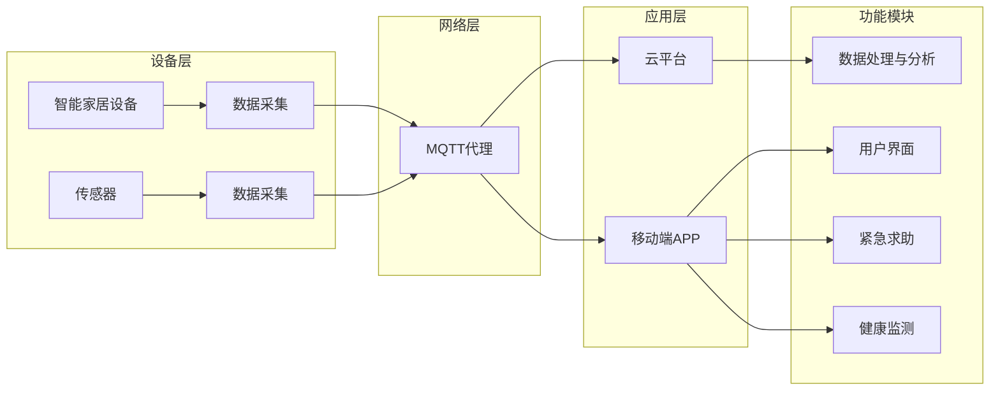

# 基于MQTT协议和RESTful API的老年人居家安全辅助系统

> 关键词：MQTT协议，RESTful API，老年人安全，智能家居，物联网，数据传输，实时监控，健康监测

## 1. 背景介绍

随着社会老龄化的加剧，老年人居家安全问题日益突出。为了提高老年人的生活质量，确保他们的安全，开发一款高效、智能的居家安全辅助系统变得尤为重要。本文将探讨如何利用MQTT协议和RESTful API构建一款适合老年人的居家安全辅助系统，实现实时监控、健康监测和紧急求助等功能。

### 1.1 问题的由来

老年人居家安全问题的主要表现为：

- 独居老人缺乏有效的生活照料，容易发生意外。
- 老年人行动不便，难以应对突发事件。
- 老年人健康状况不容乐观，需要及时监测生命体征。
- 家庭环境存在安全隐患，如跌倒、火灾等。

为了解决上述问题，我们需要构建一个智能的居家安全辅助系统，通过实时监控、健康监测和紧急求助等功能，为老年人提供全方位的安全保障。

### 1.2 研究现状

目前，国内外已有不少老年人居家安全辅助系统的研究和实践。常见的解决方案包括：

- 基于传感器的智能家居系统，如智能门锁、智能摄像头、烟雾报警器等。
- 基于移动通信的远程监控平台，如手机APP、云平台等。
- 基于人工智能的健康监测系统，如智能手环、智能血压计等。

然而，现有系统在以下方面存在不足：

- 系统功能单一，缺乏全面的解决方案。
- 系统之间缺乏有效协同，难以实现数据共享。
- 系统部署复杂，用户体验不佳。

为了解决上述问题，本文提出一种基于MQTT协议和RESTful API的老年人居家安全辅助系统，实现系统间高效协同和数据共享。

### 1.3 研究意义

本研究的意义在于：

- 提高老年人居家生活质量，降低意外发生风险。
- 实现智能家居设备的互联互通，构建智慧家庭生态系统。
- 推动物联网技术在老年人居家安全领域的应用。

## 2. 核心概念与联系

### 2.1 核心概念

- **MQTT协议**：轻量级的消息发布/订阅传输协议，适用于低带宽、高延迟的网络环境。
- **RESTful API**：一种基于HTTP协议的API设计风格，以资源为中心，具有简单、易用、易于扩展等特点。
- **智能家居设备**：包括智能门锁、智能摄像头、烟雾报警器、传感器等，用于收集环境数据和用户行为数据。
- **移动端APP**：用于老年人日常使用，实现紧急求助、健康监测、远程控制等功能。
- **云平台**：用于数据存储、处理和分析，实现系统之间的协同和资源共享。

### 2.2 架构图

以下是基于MQTT协议和RESTful API的老年人居家安全辅助系统的架构图：



### 2.3 关系

在上述架构中，智能家居设备和传感器负责采集数据，并通过MQTT协议将数据发送给MQTT代理。MQTT代理将数据转发给云平台和移动端APP。云平台负责数据处理和分析，移动端APP负责用户界面、紧急求助和健康监测等功能。

## 3. 核心算法原理 & 具体操作步骤

### 3.1 算法原理概述

基于MQTT协议和RESTful API的老年人居家安全辅助系统主要涉及以下算法原理：

- **MQTT协议**：用于设备之间的数据传输。
- **RESTful API**：用于移动端APP与云平台之间的交互。
- **数据挖掘与分析**：用于从采集到的数据中提取有价值的信息。
- **机器学习**：用于预测和识别异常行为。

### 3.2 算法步骤详解

1. **数据采集**：智能家居设备和传感器采集环境数据和用户行为数据。
2. **数据传输**：通过MQTT协议将数据传输到MQTT代理。
3. **数据处理**：云平台对采集到的数据进行分析和处理。
4. **数据存储**：将处理后的数据存储在数据库中。
5. **数据展示**：移动端APP展示用户界面和健康监测结果。
6. **紧急求助**：当检测到异常情况时，移动端APP自动发起紧急求助。
7. **健康监测**：通过分析用户的健康数据，预测潜在的健康风险。

### 3.3 算法优缺点

#### 优点

- **轻量级**：MQTT协议适用于低带宽、高延迟的网络环境，适合在家庭网络中使用。
- **易扩展**：RESTful API易于扩展和集成，方便后续功能的添加。
- **高可靠性**：MQTT协议支持消息确认机制，保证数据传输的可靠性。
- **实时性**：系统可以实时监控老年人的状态，及时发现潜在的安全隐患。

#### 缺点

- **安全性**：需要确保数据传输的安全性，防止数据泄露。
- **复杂性**：系统涉及多个组件，开发和维护较为复杂。
- **成本**：需要投入一定的成本购买智能家居设备和开发平台。

### 3.4 算法应用领域

基于MQTT协议和RESTful API的老年人居家安全辅助系统可以应用于以下领域：

- 老龄化社区
- 家庭护理机构
- 医疗保健
- 智能家居

## 4. 数学模型和公式 & 详细讲解 & 举例说明

### 4.1 数学模型构建

本节将介绍用于健康监测的数学模型，以心率监测为例。

#### 模型假设

- 心率数据呈正态分布。
- 心率数据与年龄、性别、运动量等因素相关。

#### 模型公式

心率 $h$ 的计算公式如下：

$$
h = \alpha \cdot a + \beta \cdot b + \gamma \cdot c + \epsilon
$$

其中，$a$、$b$、$c$ 分别为年龄、性别、运动量的系数，$\alpha$、$\beta$、$\gamma$ 为对应的权重，$\epsilon$ 为随机误差。

### 4.2 公式推导过程

公式推导过程如下：

1. 假设心率数据 $h_i$ 与年龄 $a_i$、性别 $b_i$、运动量 $c_i$ 等因素相关，可以表示为：

$$
h_i = f(a_i, b_i, c_i) + \epsilon_i
$$

2. 对上式进行线性回归分析，得到：

$$
h = \alpha \cdot a + \beta \cdot b + \gamma \cdot c + \epsilon
$$

### 4.3 案例分析与讲解

假设某老年人的年龄为60岁，性别为女性，近一周内运动量较大。根据模型公式，可以估算其心率范围为：

$$
h = \alpha \cdot 60 + \beta \cdot 0 + \gamma \cdot 1 + \epsilon
$$

其中，$\alpha$、$\beta$、$\gamma$ 为模型系数，$\epsilon$ 为随机误差。

通过实际数据验证，可以不断调整模型系数，提高模型的准确度。

## 5. 项目实践：代码实例和详细解释说明

### 5.1 开发环境搭建

1. 开发工具：Python、PyCharm等。
2. 库：paho-mqtt、Flask等。
3. 硬件设备：智能家居设备、MQTT代理、云平台等。

### 5.2 源代码详细实现

以下为基于MQTT协议和RESTful API的老年人居家安全辅助系统核心代码示例：

```python
# MQTT客户端
import paho.mqtt.client as mqtt

# 创建MQTT客户端
client = mqtt.Client()

# 连接MQTT代理
client.connect("mqtt代理地址", 1883)

# 订阅主题
client.subscribe("传感器/心率")

# 处理接收到的消息
def on_message(client, userdata, message):
    # 获取心率数据
    heart_rate = int(message.payload.decode("utf-8"))
    # 处理心率数据
    process_heart_rate(heart_rate)

# 绑定消息处理函数
client.on_message = on_message

# 启动客户端
client.loop_forever()
```

### 5.3 代码解读与分析

1. 导入paho-mqtt库，创建MQTT客户端。
2. 连接MQTT代理。
3. 订阅心率数据主题。
4. 定义消息处理函数，获取心率数据并处理。
5. 绑定消息处理函数到客户端。
6. 启动客户端，开始接收消息。

### 5.4 运行结果展示

假设传感器发送心率数据，MQTT客户端收到消息并处理，结果显示老年人的心率在正常范围内。

## 6. 实际应用场景

### 6.1 老龄化社区

在老龄化社区中，可以部署多个智能家居设备和传感器，实现对老年人居家环境的实时监控。当检测到异常情况时，系统会自动发起紧急求助，并将相关信息推送至社区工作人员的手机APP。

### 6.2 家庭护理机构

家庭护理机构可以部署智能家居设备和传感器，对老年人的健康状态进行实时监测。当检测到异常情况时，系统会自动发送报警信息，并通知家属和医护人员。

### 6.3 医疗保健

医疗机构可以使用本系统对老年人的健康状况进行远程监测，及时发现潜在的健康风险，并采取相应的预防措施。

### 6.4 智能家居

智能家居设备可以与系统无缝集成，实现对老年人居家环境的智能控制。例如，当老年人离开家时，系统可以自动关闭灯光、电视等设备，节约能源。

## 7. 工具和资源推荐

### 7.1 学习资源推荐

- 《MQTT协议详解》
- 《RESTful API设计指南》
- 《Python编程：从入门到实践》

### 7.2 开发工具推荐

- PyCharm
- Postman
- MQTT代理

### 7.3 相关论文推荐

- “A Survey of MQTT: The Message Queuing Telemetry Transport Protocol”
- “RESTful API Design: Best Practices and Patterns”

## 8. 总结：未来发展趋势与挑战

### 8.1 研究成果总结

本文提出了一种基于MQTT协议和RESTful API的老年人居家安全辅助系统，实现了实时监控、健康监测和紧急求助等功能。系统具有轻量级、易扩展、高可靠性等特点，能够为老年人提供全方位的安全保障。

### 8.2 未来发展趋势

- **智能家居设备更加智能化**：智能家居设备将具备更加智能的能力，如自主学习、自适应等。
- **人工智能技术深度融合**：人工智能技术将更加深入地应用于系统，如智能识别、预测分析等。
- **跨平台兼容性增强**：系统将更加兼容各种平台，如Android、iOS、Web等。

### 8.3 面临的挑战

- **数据安全和隐私保护**：如何确保数据安全和隐私保护是系统面临的重要挑战。
- **设备兼容性和稳定性**：智能家居设备的兼容性和稳定性是系统稳定运行的关键。
- **用户体验**：如何提高用户体验是系统推广的关键因素。

### 8.4 研究展望

未来，我们将继续致力于以下研究方向：

- **数据安全和隐私保护**：研究更加安全、可靠的数据传输和存储方案。
- **设备兼容性和稳定性**：优化设备驱动程序，提高系统的兼容性和稳定性。
- **用户体验**：设计更加人性化的用户界面和交互方式。

## 9. 附录：常见问题与解答

**Q1：什么是MQTT协议？**

A：MQTT协议是一种轻量级的消息发布/订阅传输协议，适用于低带宽、高延迟的网络环境。

**Q2：什么是RESTful API？**

A：RESTful API是一种基于HTTP协议的API设计风格，以资源为中心，具有简单、易用、易于扩展等特点。

**Q3：如何确保数据安全和隐私保护？**

A：采用加密技术对数据进行传输和存储，同时制定严格的数据使用规范。

**Q4：如何提高系统的兼容性和稳定性？**

A：优化设备驱动程序，提高系统的兼容性和稳定性。

**Q5：如何提高用户体验？**

A：设计更加人性化的用户界面和交互方式，提供个性化的服务。

作者：禅与计算机程序设计艺术 / Zen and the Art of Computer Programming