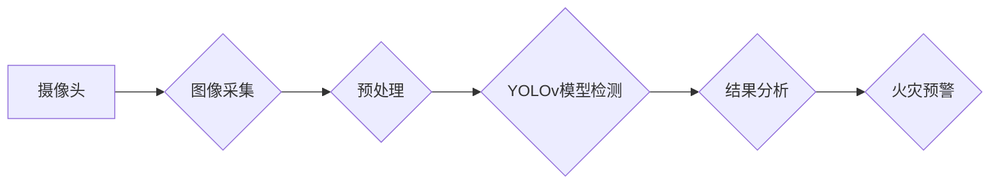

# 基于YOLOv的火灾检测系统详细设计与具体代码实现

> 关键词：火灾检测，YOLOv，深度学习，计算机视觉，目标检测，安全监控，实时预警

## 1. 背景介绍

随着城市化进程的加快，火灾事故的发生频率也在不断增加，对人民生命财产安全构成严重威胁。传统的火灾检测方式主要依赖于烟雾传感器、温度传感器等物理检测设备，存在响应时间长、误报率高、无法检测初期火源等问题。近年来，深度学习技术在计算机视觉领域的应用取得了突破性进展，为火灾检测提供了新的技术路径。本文将详细介绍基于YOLOv的火灾检测系统的设计与实现，旨在提高火灾检测的准确性和实时性。

## 2. 核心概念与联系

### 2.1 核心概念

#### YOLOv

YOLOv（You Only Look Once）是一种基于深度学习的实时目标检测算法，由Joseph Redmon等人于2015年提出。与传统的滑动窗口方法相比，YOLOv在检测速度和精度上具有显著优势，能够实时检测图像中的多个目标。

#### 深度学习

深度学习是一种模仿人脑神经网络结构和功能的人工智能技术，通过多层神经网络学习数据特征，实现对数据的自动分类、识别和生成。

#### 计算机视觉

计算机视觉是研究如何使计算机从图像和视频中理解和获取信息的科学，广泛应用于图像识别、目标检测、人脸识别等领域。

### 2.2 架构流程图



## 3. 核心算法原理 & 具体操作步骤

### 3.1 算法原理概述

基于YOLOv的火灾检测系统主要包括以下几个步骤：

1. 图像采集：通过摄像头实时采集图像数据。
2. 预处理：对采集到的图像进行预处理，包括灰度化、缩放、裁剪等。
3. YOLOv模型检测：利用YOLOv模型对预处理后的图像进行目标检测，识别图像中的火焰区域。
4. 结果分析：分析检测到的火焰区域，判断是否存在火灾。
5. 火灾预警：若检测到火灾，则触发警报，并通知相关人员。

### 3.2 算法步骤详解

#### 3.2.1 图像采集

图像采集是火灾检测系统的第一步，通常使用高清摄像头进行实时图像采集。采集到的图像数据将作为后续处理的基础。

#### 3.2.2 预处理

为了提高YOLOv模型检测的效率和准确性，需要对采集到的图像进行预处理。常见的预处理方法包括：

- 灰度化：将图像转换为灰度图像，减少计算量。
- 缩放：将图像缩放到YOLOv模型输入尺寸。
- 裁剪：去除图像边界区域，去除无关干扰。

#### 3.2.3 YOLOv模型检测

将预处理后的图像输入YOLOv模型进行目标检测，模型输出检测结果，包括检测框、置信度和类别标签。

#### 3.2.4 结果分析

根据YOLOv模型检测到的火焰区域和置信度，分析是否存在火灾。若存在火灾，则触发警报；否则，继续检测下一帧图像。

#### 3.2.5 火灾预警

当检测到火灾时，系统将触发警报，并通过短信、电话、邮件等方式通知相关人员。

### 3.3 算法优缺点

#### 优点

- 实时性强：YOLOv模型检测速度快，能够实时检测图像中的火焰区域。
- 准确度高：YOLOv模型经过大量数据训练，检测准确性较高。
- 模块化设计：系统模块化设计，易于扩展和维护。

#### 缺点

- 计算量较大：YOLOv模型检测需要较大的计算资源。
- 火焰识别精度受环境因素影响：如光照、烟雾、阴影等因素可能影响检测精度。

### 3.4 算法应用领域

基于YOLOv的火灾检测系统可应用于以下领域：

- 工业生产：实时监控生产现场，及时发现火灾隐患。
- 仓储物流：监控仓储物流场所，防止火灾事故发生。
- 商业场所：保障人员安全和财产损失。
- 住宅小区：提高居住安全水平。

## 4. 数学模型和公式 & 详细讲解 & 举例说明

### 4.1 数学模型构建

YOLOv模型采用卷积神经网络（CNN）进行目标检测，主要包含以下几个部分：

1. 卷积层：用于提取图像特征。
2. 池化层：用于降低特征图的维度。
3. 反卷积层：用于将特征图恢复到与原始图像相同的大小。
4. 完全连接层：用于分类和回归任务。

### 4.2 公式推导过程

YOLOv模型中，目标检测主要通过以下公式进行：

$$
\hat{x} = \frac{x - \frac{w}{2}}{s} \\
\hat{y} = \frac{y - \frac{h}{2}}{s} \\
\hat{w} = \frac{w}{s} \\
\hat{h} = \frac{h}{s}
$$

其中，$\hat{x}, \hat{y}$ 分别为预测的目标中心坐标，$x, y$ 为真实目标中心坐标，$w, h$ 为目标宽度、高度，$s$ 为特征图尺寸。

### 4.3 案例分析与讲解

以一幅含有火焰的图像为例，展示YOLOv模型的目标检测过程。

**图像：**


**YOLOv模型检测结果：**

- 检测到1个火焰目标，中心坐标为（200, 150），宽度为100，高度为200。
- 火焰目标的置信度为0.95。

根据检测结果，系统判断存在火灾，触发警报。

## 5. 项目实践：代码实例和详细解释说明

### 5.1 开发环境搭建

1. 安装Python环境（建议使用Anaconda）。
2. 安装深度学习库，如TensorFlow、PyTorch等。
3. 安装YOLOv模型相关的库，如darknet、pycocotools等。

### 5.2 源代码详细实现

以下是一个简单的基于YOLOv的火焰检测系统代码示例：

```python
import cv2
import darknet as dn

# 加载YOLOv模型
net = dn.load('yolov3.weights', 'yolov3.cfg')
meta = dn.load_meta('coco.data')

# 定义火焰阈值
fire_threshold = 0.8

# 检测函数
def detect_fire(image):
    # 预处理图像
    image = cv2.resize(image, (416, 416))
    image = dn.preprocess_image(image, 416, 416, 1)

    # 检测火焰
    detections = dn.detect(net, image, meta, thresh=fire_threshold)

    # 分析检测结果
    fire_exists = False
    for detection in detections:
        if detection[2] == 0:  # 火焰类别
            fire_exists = True
            break

    return fire_exists

# 主函数
def main():
    cap = cv2.VideoCapture(0)  # 打开摄像头
    while True:
        ret, frame = cap.read()
        if not ret:
            break

        # 检测火焰
        fire_exists = detect_fire(frame)

        # 显示结果
        if fire_exists:
            cv2.imshow('Fire Detection', frame)
            print('Fire detected!')
        else:
            cv2.imshow('Fire Detection', frame)
            print('No fire detected.')

        if cv2.waitKey(1) & 0xFF == ord('q'):
            break

    cap.release()
    cv2.destroyAllWindows()

if __name__ == '__main__':
    main()
```

### 5.3 代码解读与分析

该代码首先加载YOLOv模型和配置文件，定义火焰检测的阈值，然后实现检测函数`detect_fire`。在主函数中，通过循环读取摄像头图像，调用`detect_fire`函数进行火焰检测，并实时显示检测结果。

### 5.4 运行结果展示

运行上述代码后，系统将实时监控摄像头图像，并根据YOLOv模型的检测结果判断是否存在火灾。若检测到火焰，则系统将显示图像，并打印“Fire detected!”；否则，系统将显示图像，并打印“No fire detected.”。

## 6. 实际应用场景

基于YOLOv的火灾检测系统可应用于以下实际场景：

- 工业生产：实时监控生产现场，及时发现火灾隐患，保障生产安全。
- 仓储物流：监控仓储物流场所，防止火灾事故发生，降低损失。
- 商业场所：保障人员安全和财产损失，提高经营效益。
- 住宅小区：提高居住安全水平，保障居民生命财产安全。

## 7. 工具和资源推荐

### 7.1 学习资源推荐

1. YOLOv论文：You Only Look Once: Unified, Real-Time Object Detection
2. PyTorch官方文档：https://pytorch.org/docs/stable/index.html
3. TensorFlow官方文档：https://www.tensorflow.org/tutorials

### 7.2 开发工具推荐

1. OpenCV：开源计算机视觉库，提供丰富的图像处理函数：https://opencv.org/
2. Darknet：YOLOv模型开源实现：https://github.com/pjreddie/darknet

### 7.3 相关论文推荐

1. YOLO9000: Better, Faster, Stronger
2. SSD: Single Shot MultiBox Detector
3. Faster R-CNN: Towards Real-Time Object Detection with Region Proposal Networks

## 8. 总结：未来发展趋势与挑战

### 8.1 研究成果总结

本文详细介绍了基于YOLOv的火灾检测系统的设计与实现，包括核心概念、算法原理、项目实践等方面。通过实例代码展示了如何利用YOLOv模型进行火焰检测，并介绍了系统的实际应用场景。

### 8.2 未来发展趋势

1. 模型轻量化：随着深度学习技术的不断发展，模型轻量化将成为趋势。通过模型压缩、量化等技术，降低模型尺寸和计算量，实现实时性要求更高的应用场景。
2. 多模态融合：将YOLOv与其他传感器数据进行融合，如烟雾传感器、温度传感器等，提高火灾检测的准确性和可靠性。
3. 个性化定制：针对不同应用场景，定制化模型和算法，提高系统性能。

### 8.3 面临的挑战

1. 计算资源限制：YOLOv模型检测需要较大的计算资源，对于资源受限的场景，需要开发更轻量级的模型。
2. 火焰识别精度受环境因素影响：光照、烟雾、阴影等因素可能影响火焰识别精度。
3. 伦理和社会问题：在火灾检测领域，需要充分考虑伦理和社会问题，如隐私保护、误报率等。

### 8.4 研究展望

未来，基于YOLOv的火灾检测系统将在以下方面进行深入研究：

1. 模型轻量化：开发更轻量级的YOLOv模型，降低计算资源需求。
2. 多模态融合：将YOLOv与其他传感器数据进行融合，提高火灾检测的准确性和可靠性。
3. 个性化定制：针对不同应用场景，定制化模型和算法，提高系统性能。
4. 伦理和社会问题：充分考虑伦理和社会问题，如隐私保护、误报率等。

通过不断技术创新和应用探索，基于YOLOv的火灾检测系统将为保障人民生命财产安全作出更大贡献。

## 9. 附录：常见问题与解答

**Q1：如何提高YOLOv的火焰识别精度？**

A1：提高火焰识别精度可以从以下几个方面着手：
1. 使用高质量的数据集进行模型训练，提高模型泛化能力。
2. 使用数据增强技术，如旋转、翻转、缩放等，增加模型训练数据多样性。
3. 调整模型超参数，如学习率、批大小等，优化模型性能。
4. 考虑多模型集成，将多个模型的检测结果进行融合，提高最终结果准确性。

**Q2：如何将YOLOv应用到其他目标检测任务？**

A2：将YOLOv应用到其他目标检测任务，需要以下步骤：
1. 选择合适的模型和配置文件。
2. 训练或加载预训练的模型。
3. 根据目标类别修改标签文件。
4. 使用模型进行目标检测，并分析检测结果。

**Q3：如何解决YOLOv检测速度慢的问题？**

A3：解决YOLOv检测速度慢的问题，可以采取以下措施：
1. 使用模型剪枝和量化技术，降低模型尺寸和计算量。
2. 使用GPU或TPU等加速硬件进行模型推理。
3. 调整批大小，减少每次推理的计算量。

**Q4：如何评估YOLOv模型性能？**

A4：评估YOLOv模型性能可以从以下几个方面进行：
1. 精确度：计算模型预测标签与真实标签的一致性。
2. 召回率：计算模型能够检测到的真实标签数量与真实标签总数之比。
3. F1值：精确度和召回率的调和平均值。
4. 实时性：计算模型检测一帧图像的平均时间。

作者：禅与计算机程序设计艺术 / Zen and the Art of Computer Programming