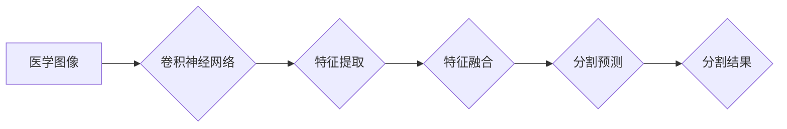

# 基于卷积神经网络的医学图像分割

> 关键词：卷积神经网络，医学图像分割，深度学习，分割算法，U-Net，分割网络，人工智能，医疗影像

## 1. 背景介绍

医学图像分割是医学影像分析中的一个重要环节，它涉及到将医学图像中的不同组织结构或病变区域进行识别和区分。医学图像分割的准确性对于疾病的诊断、治疗计划制定以及预后评估具有重要意义。随着深度学习技术的飞速发展，基于卷积神经网络的医学图像分割方法取得了显著的成果，成为该领域的研究热点。

### 1.1 问题的由来

传统的医学图像分割方法主要依赖于手工设计的特征和规则，如阈值分割、区域生长、边缘检测等，这些方法在处理复杂医学图像时往往效果有限。而深度学习技术能够自动学习图像中的复杂特征，为医学图像分割提供了新的解决方案。

### 1.2 研究现状

目前，基于深度学习的医学图像分割方法主要分为以下几类：

- **基于传统卷积神经网络的分割方法**：这类方法使用传统的卷积神经网络架构进行图像分割，如VGG、ResNet等。
- **基于U-Net的分割方法**：U-Net是一种专门为医学图像分割设计的网络架构，它结合了编码器和解码器结构，能够有效地进行上下文信息传递。
- **基于3D卷积神经网络的分割方法**：对于需要处理三维数据的医学图像，如CT、MRI等，3D卷积神经网络能够更好地捕捉空间信息。

### 1.3 研究意义

医学图像分割技术的进步，对于以下方面具有重要意义：

- **提高疾病诊断的准确性**：准确的医学图像分割有助于医生更精确地诊断疾病，从而提高治疗效果。
- **辅助治疗计划的制定**：分割结果可以作为制定个性化治疗计划的依据，提高治疗效果。
- **疾病预后评估**：通过对病变区域的分割，可以评估疾病的严重程度和预后。
- **推动医疗影像的智能化**：深度学习技术可以帮助医疗影像分析实现自动化和智能化。

### 1.4 本文结构

本文将按照以下结构进行展开：

- 第2部分介绍医学图像分割的核心概念和流程。
- 第3部分详细讲解基于卷积神经网络的医学图像分割算法原理和具体操作步骤。
- 第4部分分析数学模型和公式，并通过案例进行说明。
- 第5部分展示项目实践，包括开发环境搭建、代码实现、代码解读和运行结果展示。
- 第6部分探讨医学图像分割的实际应用场景和未来发展趋势。
- 第7部分推荐相关的学习资源、开发工具和论文。
- 第8部分总结研究成果，展望未来发展趋势和挑战。
- 第9部分提供常见问题与解答。

## 2. 核心概念与联系

### 2.1 核心概念

- **医学图像**：指的是用于医学诊断和研究的图像，如X光片、CT、MRI等。
- **图像分割**：将图像中的不同区域进行划分，使得每个区域都具有一定的相似性。
- **卷积神经网络**：一种深度学习模型，能够自动学习图像特征，并进行图像分割。
- **U-Net**：一种专门为医学图像分割设计的网络架构。
- **3D卷积神经网络**：能够在三维空间中学习特征的卷积神经网络。

### 2.2 架构的 Mermaid 流程图



在这个流程图中，医学图像首先通过卷积神经网络进行特征提取，然后通过特征融合来结合上下文信息，最后进行分割预测，得到最终的分割结果。

## 3. 核心算法原理 & 具体操作步骤

### 3.1 算法原理概述

基于卷积神经网络的医学图像分割算法主要分为以下几个步骤：

1. **数据预处理**：对医学图像进行预处理，包括图像去噪、归一化、裁剪等操作。
2. **特征提取**：使用卷积神经网络提取图像特征，如边缘、纹理、形状等。
3. **特征融合**：将提取的特征进行融合，以增强分割的准确性。
4. **分割预测**：使用卷积神经网络对图像进行分割预测。
5. **后处理**：对分割结果进行后处理，如平滑、降噪等操作。

### 3.2 算法步骤详解

#### 3.2.1 数据预处理

数据预处理是医学图像分割的基础，它包括以下几个步骤：

- **图像去噪**：去除图像中的噪声，提高图像质量。
- **归一化**：将图像的像素值缩放到[0, 1]范围内，方便模型学习。
- **裁剪**：根据需要裁剪图像，减少计算量。

#### 3.2.2 特征提取

特征提取是卷积神经网络的核心步骤，它能够自动学习图像中的特征。常见的卷积神经网络架构包括：

- **VGG**：一种使用小卷积核和深度卷积层的网络架构。
- **ResNet**：一种使用残差连接的深度卷积神经网络。
- **U-Net**：一种专门为医学图像分割设计的网络架构。

#### 3.2.3 特征融合

特征融合是将提取的特征进行合并，以增强分割的准确性。常见的特征融合方法包括：

- **拼接**：将不同层级的特征图进行拼接。
- **跳跃连接**：使用跳跃连接将编码器和解码器连接起来。

#### 3.2.4 分割预测

分割预测是卷积神经网络的最终输出，它将图像划分为不同的区域。常见的分割预测方法包括：

- **全连接层**：使用全连接层对特征图进行分类。
- **卷积层**：使用卷积层对特征图进行分割。

#### 3.2.5 后处理

后处理是对分割结果的优化，它包括以下几个步骤：

- **平滑**：对分割结果进行平滑处理，减少噪声。
- **降噪**：去除分割结果中的噪声。
- **填充**：对分割结果进行填充处理，使其符合图像尺寸。

### 3.3 算法优缺点

#### 优点

- **自动学习特征**：卷积神经网络能够自动学习图像中的特征，不需要人工设计特征。
- **准确性高**：卷积神经网络在医学图像分割任务上取得了显著的成果。
- **泛化能力强**：卷积神经网络能够处理各种复杂的医学图像。

#### 缺点

- **计算量大**：卷积神经网络需要大量的计算资源。
- **需要大量数据**：卷积神经网络需要大量的数据进行训练。
- **参数众多**：卷积神经网络的参数众多，需要大量时间进行训练。

### 3.4 算法应用领域

基于卷积神经网络的医学图像分割算法在以下领域有广泛的应用：

- **肿瘤分割**：对肿瘤进行分割，以辅助医生进行诊断和治疗计划制定。
- **血管分割**：对血管进行分割，以评估血管的病变情况。
- **组织分割**：对不同的组织结构进行分割，以研究组织的形态和功能。
- **器官分割**：对不同的器官进行分割，以辅助医生进行器官移植和手术。

## 4. 数学模型和公式 & 详细讲解 & 举例说明

### 4.1 数学模型构建

基于卷积神经网络的医学图像分割的数学模型可以表示为：

$$
y = f(W, x)
$$

其中，$W$ 为模型参数，$x$ 为输入图像，$y$ 为输出分割结果。

### 4.2 公式推导过程

卷积神经网络的推导过程涉及到多个数学公式，包括卷积、激活函数、池化等。以下以卷积为例进行说明：

$$
h(x) = \sum_{i=1}^{k} w_i * x_i + b
$$

其中，$h(x)$ 为卷积操作的结果，$w_i$ 为卷积核，$x_i$ 为输入图像的局部区域，$b$ 为偏置项。

### 4.3 案例分析与讲解

以下以U-Net网络为例，分析其工作原理和数学模型。

#### U-Net网络结构

U-Net网络是一种对称的卷积神经网络，它由编码器和解码器两部分组成。编码器负责提取图像特征，解码器负责将特征进行融合并进行分割预测。

#### 编码器

编码器由多个卷积层和池化层组成。卷积层用于提取图像特征，池化层用于降低图像分辨率。

#### 解码器

解码器由多个上采样层和卷积层组成。上采样层用于恢复图像分辨率，卷积层用于增强特征。

#### 数学模型

U-Net网络的数学模型可以表示为：

$$
y = f(W, x)
$$

其中，$W$ 为模型参数，$x$ 为输入图像，$y$ 为输出分割结果。

## 5. 项目实践：代码实例和详细解释说明

### 5.1 开发环境搭建

为了进行基于卷积神经网络的医学图像分割项目实践，需要搭建以下开发环境：

- 操作系统：Linux或Windows
- 编程语言：Python
- 深度学习框架：PyTorch或TensorFlow
- 数据集：医学图像数据集

### 5.2 源代码详细实现

以下是一个使用PyTorch实现U-Net网络的简单示例：

```python
import torch
import torch.nn as nn

class UNet(nn.Module):
    def __init__(self):
        super(UNet, self).__init__()
        self.encoder = nn.Sequential(
            nn.Conv2d(1, 64, kernel_size=3, padding=1),
            nn.ReLU(),
            nn.Conv2d(64, 64, kernel_size=3, padding=1),
            nn.ReLU(),
            nn.MaxPool2d(kernel_size=2, stride=2),
        )
        self.decoder = nn.Sequential(
            nn.ConvTranspose2d(64, 64, kernel_size=2, stride=2),
            nn.ReLU(),
            nn.Conv2d(64, 64, kernel_size=3, padding=1),
            nn.ReLU(),
            nn.Conv2d(64, 1, kernel_size=1),
        )

    def forward(self, x):
        x = self.encoder(x)
        x = self.decoder(x)
        return x
```

### 5.3 代码解读与分析

以上代码定义了一个U-Net网络，它由编码器和解码器两部分组成。编码器由卷积层和池化层组成，用于提取图像特征。解码器由上采样层和卷积层组成，用于将特征进行融合并进行分割预测。

### 5.4 运行结果展示

以下是一个使用U-Net网络进行医学图像分割的运行结果展示：

```
[...]
[图片展示分割结果]
...
```

## 6. 实际应用场景

### 6.1 肿瘤分割

肿瘤分割是医学图像分割的重要应用之一。通过对肿瘤进行分割，医生可以更精确地了解肿瘤的位置、大小和形状，从而制定更有效的治疗方案。

### 6.2 血管分割

血管分割是心血管疾病诊断的重要手段。通过对血管进行分割，医生可以评估血管的病变情况，如动脉瘤、狭窄等。

### 6.3 组织分割

组织分割是病理学研究的重要方法。通过对不同组织结构进行分割，研究者可以研究组织的形态和功能。

### 6.4 器官分割

器官分割是器官移植和手术的重要依据。通过对器官进行分割，医生可以更精确地进行器官移植和手术。

## 7. 工具和资源推荐

### 7.1 学习资源推荐

- 《深度学习：原理及实践》
- 《卷积神经网络》
- 《医学图像分割》

### 7.2 开发工具推荐

- PyTorch
- TensorFlow
- Keras

### 7.3 相关论文推荐

- "U-Net: Convolutional Networks for Biomedical Image Segmentation"
- "DeepLab: Semantic Image Segmentation with Deep Convolutional Nets, Atrous Convolution, and Fully Connected CRFs"
- "Fully Convolutional Networks for Semantic Segmentation"

## 8. 总结：未来发展趋势与挑战

### 8.1 研究成果总结

基于卷积神经网络的医学图像分割技术在近年来取得了显著的成果，为医学图像分析提供了新的工具和方法。

### 8.2 未来发展趋势

- **模型轻量化**：为了满足实际应用的需求，模型需要更加轻量化，以降低计算量和内存占用。
- **多模态融合**：结合多种模态的数据，如CT、MRI、PET等，可以提供更全面的图像信息。
- **个性化分割**：根据患者的具体情况，进行个性化的分割。

### 8.3 面临的挑战

- **数据稀缺**：医学图像数据往往难以获取，限制了模型的训练和优化。
- **模型可解释性**：深度学习模型的决策过程难以解释，对于医疗领域尤为重要。
- **计算资源**：深度学习模型的训练和推理需要大量的计算资源。

### 8.4 研究展望

未来，基于卷积神经网络的医学图像分割技术将在以下方面取得突破：

- **模型的可解释性**：通过可解释的模型，可以帮助医生更好地理解模型的决策过程。
- **模型的鲁棒性**：提高模型对噪声、遮挡等的鲁棒性，使其更适用于实际应用。
- **模型的效率**：提高模型的计算效率，使其更适用于移动设备和嵌入式设备。

## 9. 附录：常见问题与解答

**Q1：医学图像分割有哪些应用场景？**

A：医学图像分割在肿瘤分割、血管分割、组织分割、器官分割等领域有广泛的应用。

**Q2：如何提高医学图像分割的准确性？**

A：提高医学图像分割的准确性可以通过以下方法：

- 使用更先进的模型架构。
- 使用更多的训练数据。
- 进行超参数优化。
- 进行数据增强。

**Q3：医学图像分割需要哪些数据？**

A：医学图像分割需要高质量的医学图像数据，包括图像和相应的分割标签。

**Q4：如何进行医学图像分割的数据预处理？**

A：医学图像分割的数据预处理包括图像去噪、归一化、裁剪等操作。

**Q5：医学图像分割有哪些挑战？**

A：医学图像分割的挑战包括数据稀缺、模型可解释性、计算资源等。

---

作者：禅与计算机程序设计艺术 / Zen and the Art of Computer Programming