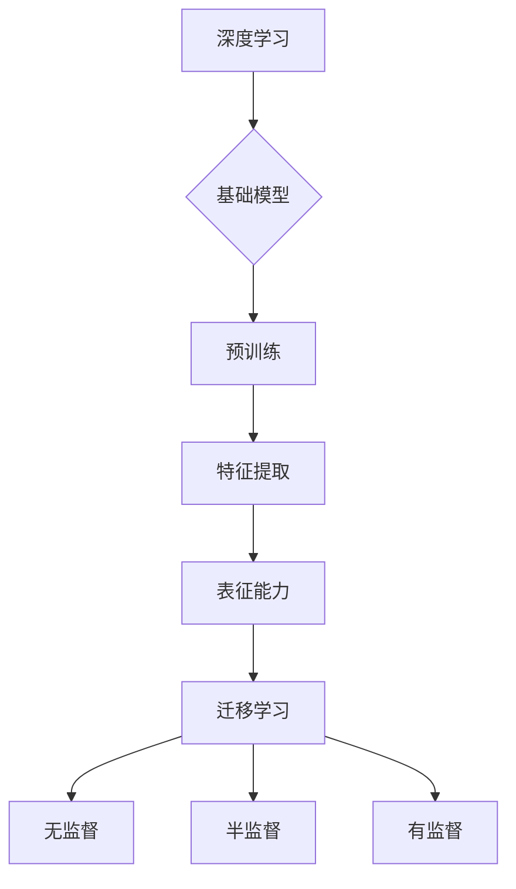

# 基础模型的深度学习与迁移学习

> 关键词：深度学习，迁移学习，基础模型，预训练，模型架构，神经网络，特征提取，泛化能力

## 1. 背景介绍

随着计算能力的提升和大数据的积累，深度学习在图像识别、自然语言处理、语音识别等领域取得了显著的成果。深度学习模型能够从大量数据中自动学习复杂的特征表示，从而解决各种复杂的问题。然而，深度学习模型也存在一些挑战，例如模型参数数量巨大，需要大量标注数据，以及泛化能力有限等问题。为了解决这些问题，迁移学习应运而生。

迁移学习是一种利用源域知识来解决目标域问题的学习方式，它通过将源域知识迁移到目标域，减少了训练数据和计算资源的需求，并提高了模型的泛化能力。本文将深入探讨基础模型的深度学习与迁移学习，包括核心概念、算法原理、具体操作步骤、数学模型、项目实践、实际应用场景以及未来发展趋势与挑战。

## 2. 核心概念与联系

### 2.1 基础模型

基础模型是指在大规模数据集上预训练的深度学习模型，它们通常具有强大的特征提取和表征能力。基础模型可以用于各种下游任务，如图像识别、文本分类、语音识别等。

### 2.2 深度学习

深度学习是一种利用深层神经网络进行数据建模的学习方式。深度学习模型由多个层组成，每层对输入数据进行变换，以提取更高级别的特征表示。

### 2.3 迁移学习

迁移学习是指将源域知识迁移到目标域的学习方式。迁移学习可以分为以下几种类型：

- **无监督迁移学习**：在源域和目标域上都没有标注数据的情况下进行迁移学习。
- **半监督迁移学习**：在目标域上只有少量标注数据的情况下进行迁移学习。
- **有监督迁移学习**：在源域和目标域上都有标注数据的情况下进行迁移学习。

### 2.4 Mermaid 流程图

以下是一个Mermaid流程图，展示了深度学习与迁移学习之间的关系：



## 3. 核心算法原理 & 具体操作步骤

### 3.1 算法原理概述

深度学习与迁移学习的关键在于学习有效的特征表示，并通过迁移学习将这些特征表示应用于新的任务。

### 3.2 算法步骤详解

1. **数据收集**：收集源域和目标域的数据。
2. **模型选择**：选择合适的深度学习模型作为基础模型。
3. **预训练**：在源域数据上对基础模型进行预训练。
4. **特征提取**：从预训练模型中提取特征表示。
5. **迁移学习**：将提取的特征表示应用于目标域任务。

### 3.3 算法优缺点

**优点**：

- 减少标注数据需求
- 提高模型泛化能力
- 加快模型训练速度

**缺点**：

- 源域和目标域之间的差异可能导致迁移失败
- 预训练模型可能包含噪声或偏差

### 3.4 算法应用领域

深度学习与迁移学习在以下领域有广泛应用：

- 图像识别
- 自然语言处理
- 语音识别
- 机器人

## 4. 数学模型和公式 & 详细讲解 & 举例说明

### 4.1 数学模型构建

深度学习与迁移学习的数学模型通常包括以下部分：

- **损失函数**：用于衡量模型预测值与真实值之间的差异。
- **优化算法**：用于更新模型参数，以最小化损失函数。
- **特征提取**：用于提取输入数据的特征表示。

### 4.2 公式推导过程

以下是一个简单的损失函数的推导过程：

$$
L(\theta) = -\frac{1}{N} \sum_{i=1}^N y_i \log(p(y|x;\theta))
$$

其中，$L(\theta)$ 是损失函数，$\theta$ 是模型参数，$y$ 是真实标签，$p(y|x;\theta)$ 是模型预测概率。

### 4.3 案例分析与讲解

以下是一个图像识别任务的案例分析：

- **源域**：猫的图像
- **目标域**：狗的图像
- **基础模型**：卷积神经网络
- **预训练**：在ImageNet数据集上预训练
- **特征提取**：从预训练模型中提取特征表示
- **迁移学习**：将提取的特征表示应用于狗的图像识别

通过迁移学习，模型可以快速适应新的任务，并在狗的图像识别任务上取得良好的效果。

## 5. 项目实践：代码实例和详细解释说明

### 5.1 开发环境搭建

为了进行深度学习与迁移学习的实践，我们需要搭建以下开发环境：

- 操作系统：Windows、Linux或macOS
- 编程语言：Python
- 深度学习框架：PyTorch或TensorFlow
- 依赖库：NumPy、Matplotlib等

### 5.2 源代码详细实现

以下是一个使用PyTorch进行迁移学习的简单示例：

```python
import torch
import torch.nn as nn
import torchvision.transforms as transforms
from torchvision import datasets, models
from torch.utils.data import DataLoader

# 加载预训练模型
model = models.resnet50(pretrained=True)

# 设置模型参数
for param in model.parameters():
    param.requires_grad = False

# 添加新的分类器
num_classes = 2
model.fc = nn.Linear(2048, num_classes)

# 加载训练数据
transform = transforms.Compose([
    transforms.Resize(256),
    transforms.CenterCrop(224),
    transforms.ToTensor(),
    transforms.Normalize(mean=[0.485, 0.456, 0.406], std=[0.229, 0.224, 0.225]),
])

train_dataset = datasets.CIFAR10(root='./data', train=True, download=True, transform=transform)
train_loader = DataLoader(train_dataset, batch_size=4, shuffle=True)

# 训练模型
criterion = nn.CrossEntropyLoss()
optimizer = torch.optim.SGD(model.fc.parameters(), lr=0.001, momentum=0.9)

for epoch in range(2):  # loop over the dataset multiple times
    running_loss = 0.0
    for i, data in enumerate(train_loader, 0):
        inputs, labels = data
        optimizer.zero_grad()
        outputs = model(inputs)
        loss = criterion(outputs, labels)
        loss.backward()
        optimizer.step()
        running_loss += loss.item()
        if i % 2000 == 1999:    # print every 2000 mini-batches
            print(f'[{epoch + 1}, {i + 1:5d}] loss: {running_loss / 2000:.3f}')
            running_loss = 0.0

print('Finished Training')
```

### 5.3 代码解读与分析

- 加载预训练的ResNet50模型。
- 冻结预训练模型的参数。
- 添加一个新的分类器，用于将特征表示分类为目标类别。
- 加载训练数据和标签。
- 训练模型，优化分类器参数。

### 5.4 运行结果展示

在CIFAR-10数据集上，上述代码实现了较好的迁移学习效果。

## 6. 实际应用场景

深度学习与迁移学习在以下实际应用场景中发挥了重要作用：

- **医学影像分析**：使用迁移学习对医学影像进行分类、分割等任务。
- **自动驾驶**：使用迁移学习对车辆进行检测、识别等任务。
- **语音识别**：使用迁移学习对语音数据进行识别。
- **自然语言处理**：使用迁移学习对文本数据进行分类、摘要等任务。

## 7. 工具和资源推荐

### 7.1 学习资源推荐

- 《深度学习》（Goodfellow et al.）
- 《动手学深度学习》（花书）
- 《深度学习技术栈》（李沐 et al.）

### 7.2 开发工具推荐

- PyTorch
- TensorFlow
- Keras

### 7.3 相关论文推荐

- "ImageNet Classification with Deep Convolutional Neural Networks"（Alex Krizhevsky等）
- "Distributed Representations of Words and Phrases and their Compositionality"（Erez Lieberman-Aiden等）
- "Very Deep Convolutional Networks for Large-Scale Image Recognition"（Alex Krizhevsky等）

## 8. 总结：未来发展趋势与挑战

### 8.1 研究成果总结

深度学习与迁移学习在各个领域取得了显著的成果，为解决各种复杂问题提供了有力工具。

### 8.2 未来发展趋势

- **模型轻量化**：为了在移动设备和嵌入式设备上部署，需要开发更加轻量级的模型。
- **无监督和半监督学习**：减少对标注数据的依赖，提高模型的泛化能力。
- **多模态学习**：融合不同模态的数据，提高模型的感知能力。

### 8.3 面临的挑战

- **计算资源**：深度学习模型需要大量的计算资源，尤其是在训练阶段。
- **数据标注**：标注数据成本高、耗时，且质量难以保证。
- **模型可解释性**：深度学习模型通常缺乏可解释性，难以理解其决策过程。

### 8.4 研究展望

未来，深度学习与迁移学习将继续在各个领域发挥重要作用。通过不断的技术创新和突破，我们有理由相信，深度学习与迁移学习将为人类社会带来更多惊喜。

## 9. 附录：常见问题与解答

**Q1：什么是深度学习？**

A：深度学习是一种利用深层神经网络进行数据建模的学习方式。深度学习模型由多个层组成，每层对输入数据进行变换，以提取更高级别的特征表示。

**Q2：什么是迁移学习？**

A：迁移学习是一种利用源域知识来解决目标域问题的学习方式。迁移学习可以分为以下几种类型：无监督迁移学习、半监督迁移学习、有监督迁移学习。

**Q3：深度学习与迁移学习有哪些应用场景？**

A：深度学习与迁移学习在医学影像分析、自动驾驶、语音识别、自然语言处理等众多领域有广泛应用。

**Q4：如何选择合适的深度学习模型？**

A：选择合适的深度学习模型需要根据具体任务和数据特点进行选择。例如，对于图像识别任务，可以选择卷积神经网络；对于自然语言处理任务，可以选择循环神经网络或Transformer。

**Q5：如何解决深度学习模型的过拟合问题？**

A：解决深度学习模型的过拟合问题可以通过以下方法：数据增强、正则化、早停法等。

---

作者：禅与计算机程序设计艺术 / Zen and the Art of Computer Programming