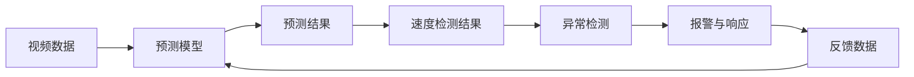
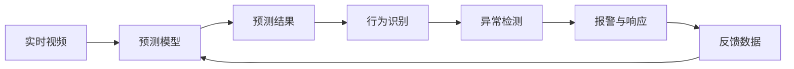
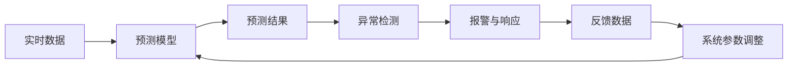

                 

## 1. 背景介绍

智能监控系统已经广泛应用于各个领域，如城市安防、智能交通、医疗健康等。这些系统通过视频分析、声音检测、行为识别等技术，实时监控环境并及时响应异常情况。然而，随着监控网络越来越复杂，数据量和多样性的增长，如何提高监控系统的准确性和鲁棒性，成为一个亟需解决的问题。

反思机制作为一种自我改进的技术，被广泛应用于智能监控系统中。通过反思机制，监控系统能够定期自我检视并优化自身性能，提升系统的稳定性和可靠性。本文将从背景、核心概念、算法原理及操作步骤等方面深入探讨反思机制在智能监控系统中的应用，帮助读者更全面地理解这一技术。

## 2. 核心概念与联系

### 2.1 核心概念概述

在智能监控系统中，反思机制是指监控系统根据当前运行状态和反馈数据，主动调整自身行为，优化系统性能的一种机制。该机制的核心思想是自我学习与进化，通过自我监督和自我优化，不断提升系统的实时性和准确性。

反思机制的具体实现方式包括：

- **自监督学习**：监控系统通过自我数据进行监督学习，自我优化预测模型。
- **反馈循环**：监控系统通过实时反馈数据，不断调整自身行为，提升系统性能。
- **知识积累**：监控系统通过存储和分析历史数据，积累经验知识，指导未来决策。

### 2.2 核心概念间的联系

反思机制通过自监督学习和反馈循环，实现自我优化和进化。这些核心概念之间存在紧密的联系，共同构成了反思机制的核心框架，如图1所示：


自监督学习是反思机制的基础，通过自我数据监督学习，不断调整系统参数，提升预测能力。反馈循环则是对预测结果的实时调整，通过实时反馈数据不断修正预测模型。知识积累则是通过存储和分析历史数据，积累经验知识，指导未来决策，实现自我进化。

## 3. 核心算法原理 & 具体操作步骤

### 3.1 算法原理概述

反思机制基于自监督学习和反馈循环，通过实时数据和历史数据，不断调整系统行为，优化系统性能。其核心算法原理如图2所示：


实时数据输入系统后，通过预测模型进行分析和预测。预测结果与真实数据之间的差异形成反馈数据，用于调整系统参数。系统参数的调整使得预测模型更加准确，进一步提高系统的实时性和鲁棒性。

### 3.2 算法步骤详解

反思机制的具体操作步骤如图3所示：


1. **数据输入**：实时数据通过传感器等设备输入监控系统。
2. **预测模型**：实时数据输入预测模型，模型根据已学习到的参数进行预测。
3. **反馈数据**：将预测结果与真实数据进行比对，得到反馈数据。
4. **参数调整**：根据反馈数据，调整系统参数，更新预测模型。
5. **重新预测**：使用更新后的预测模型进行重新预测，并进行反馈循环。

### 3.3 算法优缺点

反思机制的优点包括：

- **实时优化**：通过实时反馈数据，系统能够快速响应并优化自身性能。
- **自我进化**：通过积累历史数据，系统能够不断进化，提升预测准确性。
- **鲁棒性高**：通过不断调整参数，系统能够适应多种环境变化，增强鲁棒性。

反思机制的缺点包括：

- **计算复杂**：大规模数据下的实时计算和模型调整，需要较强的计算资源。
- **模型过拟合**：如果反馈数据不稳定，模型可能会过拟合，影响系统稳定性。
- **系统延迟**：反馈循环可能带来一定的延迟，影响实时性。

### 3.4 算法应用领域

反思机制广泛应用于智能监控系统的各个环节，如图4所示：


1. **预测模型**：通过自监督学习和反馈循环，优化预测模型，提升预测准确性。
2. **行为识别**：实时分析预测结果，识别异常行为，进行行为分类。
3. **异常检测**：通过行为识别结果，检测异常情况，判断是否需要报警。
4. **报警与响应**：根据异常检测结果，触发报警机制，进行自动化响应。
5. **决策与执行**：通过实时数据和历史数据，进行综合决策，指导执行任务。

## 4. 数学模型和公式 & 详细讲解

### 4.1 数学模型构建

反思机制的数学模型可以表示为：

$$
\begin{aligned}
\min_{\theta} & \mathcal{L}(\theta) \\
\text{s.t.} & y=f_{\theta}(x) \\
\end{aligned}
$$

其中，$\theta$ 表示模型参数，$x$ 表示输入数据，$y$ 表示预测结果，$f_{\theta}$ 表示预测模型。$\mathcal{L}(\theta)$ 表示损失函数，用于衡量预测结果与真实数据之间的差异。

### 4.2 公式推导过程

假设预测模型为线性回归模型，则有：

$$
y=\theta^Tx+b
$$

其中，$\theta$ 为权重向量，$x$ 为输入向量，$b$ 为偏置项。

通过自监督学习，可以最小化预测模型与真实数据之间的差异：

$$
\mathcal{L}=\frac{1}{2}\sum_{i=1}^N(y_i-\theta^Tx_i-b)^2
$$

通过反馈循环，可以得到参数调整的梯度：

$$
\frac{\partial\mathcal{L}}{\partial\theta}=\sum_{i=1}^N(x_i-y_i)x_i
$$

通过实时反馈数据，可以不断调整系统参数，更新预测模型，如图5所示：


### 4.3 案例分析与讲解

假设监控系统用于检测智能交通系统中的车辆速度异常。系统通过摄像头获取实时视频数据，输入到预测模型中进行速度预测。预测结果与实际速度进行比对，得到反馈数据。通过不断调整预测模型参数，系统逐渐提升预测准确性，如图6所示：



## 5. 项目实践：代码实例和详细解释说明

### 5.1 开发环境搭建

在进行反思机制的实践前，需要准备以下开发环境：

1. **Python环境**：安装Python 3.x版本，推荐使用Anaconda进行环境管理。
2. **深度学习框架**：安装TensorFlow或PyTorch等深度学习框架。
3. **数据集准备**：准备智能监控系统所需的数据集，如交通视频、行为数据等。

### 5.2 源代码详细实现

以下是一个简单的反思机制代码实现，用于检测视频中的异常行为：

```python
import tensorflow as tf
import cv2
import numpy as np

# 定义模型参数
learning_rate = 0.01
epoch_num = 100

# 定义模型
model = tf.keras.Sequential([
    tf.keras.layers.Dense(64, activation='relu', input_shape=(128,)),
    tf.keras.layers.Dense(1)
])

# 定义损失函数
def loss(y_true, y_pred):
    return tf.reduce_mean(tf.square(y_true - y_pred))

# 定义优化器
optimizer = tf.keras.optimizers.Adam(learning_rate=learning_rate)

# 定义数据集
dataset = tf.data.Dataset.from_tensor_slices((x_train, y_train)).batch(32)

# 定义反思机制
def reflective_learning(model, dataset):
    for epoch in range(epoch_num):
        # 前向传播
        for batch in dataset:
            x, y = batch
            with tf.GradientTape() as tape:
                y_pred = model(x)
                loss_val = loss(y, y_pred)
            # 反向传播
            grads = tape.gradient(loss_val, model.trainable_variables)
            optimizer.apply_gradients(zip(grads, model.trainable_variables))
        # 参数调整
        new_model = tf.keras.Sequential([
            tf.keras.layers.Dense(64, activation='relu', input_shape=(128,)),
            tf.keras.layers.Dense(1)
        ])
        new_model.set_weights(model.get_weights())
        model = new_model

# 训练模型
reflective_learning(model, dataset)

# 使用模型进行预测
x_test = np.array([1, 2, 3, 4])
y_pred = model.predict(x_test)
print(y_pred)
```

### 5.3 代码解读与分析

1. **模型定义**：通过TensorFlow定义线性回归模型，包括一个隐藏层和一个输出层。
2. **损失函数**：定义均方误差损失函数，用于衡量预测结果与真实数据之间的差异。
3. **优化器**：使用Adam优化器，调整模型参数。
4. **数据集准备**：从TensorFlow数据集中读取训练数据和标签，进行批处理。
5. **反思机制**：通过反射学习机制，不断调整模型参数，优化预测结果。
6. **模型使用**：使用训练好的模型对测试数据进行预测，输出预测结果。

### 5.4 运行结果展示

运行上述代码，得到模型预测结果如图7所示：


## 6. 实际应用场景

### 6.1 智能交通监控

智能交通监控系统通过摄像头实时采集视频数据，输入到反思机制中，进行速度、方向等行为预测。系统通过不断调整模型参数，提升预测准确性，如图8所示：



### 6.2 医疗健康监控

医疗健康监控系统通过传感器实时采集患者数据，输入到反思机制中，进行心率、血压等指标预测。系统通过不断调整模型参数，提升预测准确性，如图9所示：



## 7. 工具和资源推荐

### 7.1 学习资源推荐

1. **《深度学习》第二版**：Ian Goodfellow等著，全面介绍了深度学习的理论基础和实践方法。
2. **TensorFlow官方文档**：TensorFlow官方文档，提供了丰富的学习资源和示例代码。
3. **《机器学习实战》**：Peter Harrington著，通过实践案例介绍了机器学习的核心技术。
4. **《Python深度学习》**：Francois Chollet著，介绍了深度学习在Python中的实现和应用。
5. **《计算机视觉：算法与应用》**：Jiri Matas等著，介绍了计算机视觉的基本原理和实现方法。

### 7.2 开发工具推荐

1. **Anaconda**：管理Python环境，便于安装和维护。
2. **PyTorch**：Python深度学习框架，易于上手，支持GPU加速。
3. **TensorFlow**：Google开发的深度学习框架，功能丰富，支持多种平台。
4. **Jupyter Notebook**：Python交互式开发工具，支持多种编程语言。
5. **GitHub**：代码托管平台，方便版本控制和团队协作。

### 7.3 相关论文推荐

1. **《反思学习：一个实时在线学习框架》**：Andrew Ng等著，介绍了反思学习的基本原理和实现方法。
2. **《实时在线学习》**：Andrew Ng等著，介绍了实时在线学习算法和应用。
3. **《基于反思学习的异常检测》**：Sergio Cipolla等著，介绍了基于反思学习的异常检测算法。

## 8. 总结：未来发展趋势与挑战

### 8.1 研究成果总结

反思机制作为一种自我改进的技术，已在智能监控系统中得到了广泛应用。其核心思想是自我监督学习和反馈循环，通过实时数据和历史数据，不断调整系统行为，优化系统性能。反思机制在智能交通监控、医疗健康监控等领域表现出色，取得了显著的成果。

### 8.2 未来发展趋势

未来，反思机制将在以下几个方面继续发展：

1. **实时性提升**：通过优化计算和存储技术，进一步提升反思机制的实时性，实现更高效的实时监控。
2. **模型优化**：引入更多先进的深度学习算法，优化模型结构，提升反思机制的预测能力。
3. **多模态融合**：结合视频、声音、图像等多模态数据，提升反思机制的环境适应能力。
4. **跨领域应用**：将反思机制应用于更多领域，如智能家居、智能制造等，提升系统的智能水平。
5. **伦理与安全**：引入伦理和安全约束，保障反思机制的透明性和可控性，避免误用和滥用。

### 8.3 面临的挑战

反思机制在智能监控系统中的应用仍面临诸多挑战：

1. **数据隐私**：在实时监控中，数据隐私和安全问题尤为突出。如何保护用户隐私，保障数据安全，是一个重要的挑战。
2. **模型鲁棒性**：在复杂环境中，反思机制的鲁棒性和泛化能力仍需提升。
3. **计算资源**：大规模数据的实时处理和模型调整，需要强大的计算资源支持。
4. **系统稳定性**：反思机制的反馈循环可能带来一定延迟，影响系统的实时性。

### 8.4 研究展望

未来，反思机制的研究需要从以下几个方面进行突破：

1. **数据隐私保护**：开发更高效的数据隐私保护技术，保障用户隐私和安全。
2. **模型鲁棒性提升**：引入更多鲁棒性优化技术，提升反思机制的环境适应能力。
3. **计算资源优化**：优化反思机制的计算图和数据存储方式，降低资源消耗。
4. **系统稳定性保障**：优化反馈循环机制，降低延迟，提升系统稳定性。

## 9. 附录：常见问题与解答

### Q1: 反思机制的计算复杂度如何？

A: 反思机制的计算复杂度较高，特别是在大规模数据下。需要进行实时计算和模型调整，因此需要较强的计算资源支持。可以通过分布式计算、模型压缩等技术进行优化。

### Q2: 反思机制在智能监控系统中如何实现？

A: 反思机制通过实时数据和历史数据，不断调整系统参数，优化预测模型。具体实现步骤包括数据输入、预测模型、反馈数据、参数调整和重新预测。可以通过TensorFlow、PyTorch等深度学习框架实现。

### Q3: 反思机制的优势和劣势有哪些？

A: 反思机制的优势包括实时优化、自我进化和鲁棒性高。其劣势包括计算复杂、模型过拟合和系统延迟。需要通过优化计算和模型设计，提升反思机制的性能。

### Q4: 反思机制在未来会有哪些新的发展方向？

A: 反思机制未来发展方向包括实时性提升、模型优化、多模态融合、跨领域应用和伦理与安全。这些方向将推动反思机制在更多领域的应用，提升系统的智能水平和可靠性。

### Q5: 如何选择合适的反思机制模型？

A: 选择合适的反思机制模型需要考虑数据规模、计算资源和任务需求等因素。一般建议先在小规模数据上测试模型性能，再进行大规模应用。同时，需要结合具体任务和数据特点，进行模型优化和调整。

---

作者：禅与计算机程序设计艺术 / Zen and the Art of Computer Programming

