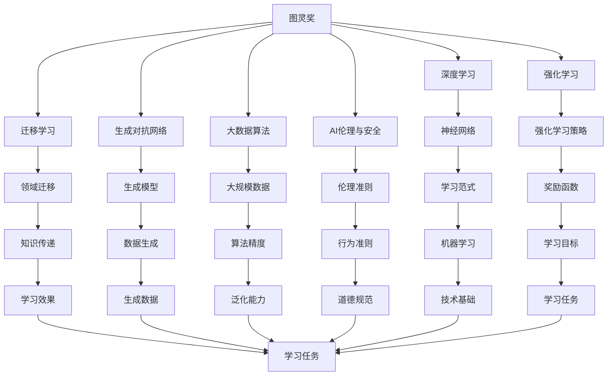

                 

# 图灵奖与AI算法的突破

## 1. 背景介绍

### 1.1 图灵奖简介
图灵奖（A.M. Turing Award）被誉为“计算机界的诺贝尔奖”，由ACM于1966年设立，旨在表彰对计算机科学领域做出杰出贡献的个人。获得图灵奖的计算机科学家，无不是站在了技术的前沿，引领了整个领域的重大突破，深刻影响了计算机科学的发展进程。

图灵奖作为计算机科学界的最高荣誉，其获奖者不仅研究领域广泛，涵盖了人工智能、计算机网络、数据库、编程语言、操作系统、图形学等诸多方向，而且取得了众多颠覆性技术，改变了人类生活和工作的方方面面。图灵奖的意义，在于表彰这些科学家的卓越贡献，激励后辈继续探索未知的科技领域。

### 1.2 图灵奖与AI算法
人工智能（Artificial Intelligence，AI）作为计算机科学的代表方向之一，其算法和理论的突破一直是图灵奖关注的重点。从早期以规则为基础的专家系统，到统计学习方法，再到深度学习和大数据算法，AI领域的研究成果屡获图灵奖。

近年来，AI领域的发展日新月异，深度学习、强化学习、迁移学习、生成对抗网络等算法相继取得突破，对世界产生了深刻的影响。从工业界到学术界，这些突破性算法都被视为AI技术发展的重要里程碑，而获图灵奖的科学家们更是推动这些技术进步的领航者。

## 2. 核心概念与联系

### 2.1 核心概念概述
为了深入理解图灵奖与AI算法的关系，我们需要先梳理一些核心概念：

- **图灵奖**：计算机科学领域的最高荣誉，设立于1966年，旨在表彰杰出贡献。
- **深度学习**：基于神经网络的机器学习技术，通过大量标注数据训练神经网络模型，具有强大的模式识别和预测能力。
- **强化学习**：通过与环境的交互，学习最优策略以最大化奖励的机器学习技术。
- **迁移学习**：将一个领域学习到的知识，迁移到另一个领域的学习范式。
- **生成对抗网络（GANs）**：包含生成器和判别器的对抗网络，用于生成高质量的图像、音频等数据。
- **大数据算法**：在大规模数据集上训练模型，提升算法的精确度和泛化能力。
- **AI伦理与安全**：研究AI技术在应用中可能带来的伦理问题和安全风险。

这些概念之间相互关联，构成了AI技术的核心框架，图灵奖作为对这些成就的最高认可，其获奖者的研究成果往往引领了整个领域的创新方向。

### 2.2 概念间的关系

图灵奖与AI算法之间的联系，可以通过以下Mermaid流程图来展示：



这个流程图展示了大语言模型微调过程中各个核心概念的相互关系：

1. 图灵奖作为AI领域的最高荣誉，认可了深度学习、强化学习等算法在AI领域的贡献。
2. 深度学习作为图灵奖的核心技术之一，推动了神经网络的发展，包括多层神经网络、卷积神经网络、循环神经网络等。
3. 强化学习关注AI在智能体与环境互动中的策略学习，包括Q-learning、Policy Gradient等经典算法。
4. 迁移学习让AI能够跨领域应用，将一个领域学到的知识迁移到另一个领域，提升模型的泛化能力。
5. 生成对抗网络通过对抗训练生成高质量的生成数据，广泛应用于图像、视频生成等领域。
6. 大数据算法在大规模数据集上进行训练，提升模型的精确度和泛化能力。
7. AI伦理与安全研究AI技术的道德规范与社会影响，确保技术应用的可控性和安全性。

## 3. 核心算法原理 & 具体操作步骤
### 3.1 算法原理概述
图灵奖与AI算法的突破，主要体现在以下几个核心算法上：

- **深度学习**：通过多层神经网络构建特征提取器，利用反向传播算法训练模型，最大化损失函数。
- **强化学习**：智能体通过与环境互动，最大化累积奖励，使用Q-learning、Policy Gradient等算法优化策略。
- **迁移学习**：通过迁移学习将一个领域学到的知识迁移到另一个领域，提升模型泛化能力。
- **生成对抗网络**：包含生成器和判别器的对抗网络，用于生成高质量的数据。
- **大数据算法**：利用大规模数据提升模型性能，如随机梯度下降、自适应学习率算法等。
- **AI伦理与安全**：研究AI技术的道德规范与社会影响，确保技术应用的可控性和安全性。

这些算法通过不断地优化和改进，使得AI技术在图像识别、语音识别、自然语言处理等领域取得了突破性进展。

### 3.2 算法步骤详解

深度学习算法的主要步骤如下：

1. **数据准备**：收集并标注数据集，划分为训练集、验证集和测试集。
2. **模型构建**：选择合适的神经网络架构，如卷积神经网络（CNN）、循环神经网络（RNN）、Transformer等。
3. **模型训练**：使用反向传播算法更新模型参数，最小化损失函数。
4. **模型评估**：在验证集和测试集上评估模型性能，如准确率、召回率等。
5. **模型调优**：根据评估结果，调整模型超参数，如学习率、批大小、正则化系数等。

强化学习算法的主要步骤如下：

1. **环境设计**：定义环境的状态、动作和奖励函数。
2. **智能体设计**：选择合适的智能体模型，如Q-learning、Policy Gradient等。
3. **训练过程**：智能体与环境互动，最大化累积奖励。
4. **策略优化**：通过优化策略，提升智能体的决策能力。
5. **策略评估**：在测试集上评估策略效果，如稳定性和收敛性。

迁移学习算法的主要步骤如下：

1. **源领域学习**：在源领域学习知识，如图像识别、语言翻译等。
2. **目标领域微调**：将源领域学到的知识迁移到目标领域，如医疗影像、金融预测等。
3. **微调过程**：在目标领域的数据集上进行微调，优化模型参数。
4. **模型评估**：在测试集上评估模型性能，如准确率、召回率等。
5. **模型调优**：根据评估结果，调整模型超参数，如学习率、批大小、正则化系数等。

### 3.3 算法优缺点

深度学习算法的优点在于：

- **强大的特征提取能力**：多层神经网络能够提取数据中的高级特征。
- **高性能计算**：大规模数据集训练提高模型泛化能力。
- **广泛应用**：应用于图像识别、语音识别、自然语言处理等多个领域。

但深度学习算法也存在以下缺点：

- **高昂的计算成本**：大规模数据集和复杂模型需要大量计算资源。
- **过拟合风险**：过度拟合训练数据，导致泛化能力下降。
- **数据依赖性强**：缺乏标注数据，难以训练出高质量模型。

强化学习算法的优点在于：

- **自主学习**：智能体能够通过与环境互动自主学习策略。
- **适应性强**：能够应对动态环境变化。
- **广泛应用**：应用于游戏、机器人控制、智能推荐等多个领域。

但强化学习算法也存在以下缺点：

- **训练难度高**：需要大量试错和调整，训练过程复杂。
- **易受环境影响**：环境变化可能导致策略失效。
- **数据依赖性强**：缺乏环境交互数据，难以训练出高质量模型。

### 3.4 算法应用领域

深度学习算法主要应用于以下几个领域：

- **计算机视觉**：如图像识别、物体检测、人脸识别等。
- **自然语言处理**：如机器翻译、情感分析、文本生成等。
- **语音识别**：如自动语音识别、语音合成等。
- **推荐系统**：如电商推荐、内容推荐等。
- **医疗影像**：如医学影像分析、疾病预测等。

强化学习算法主要应用于以下几个领域：

- **游戏AI**：如围棋、象棋等复杂游戏。
- **机器人控制**：如自动驾驶、机器人行走等。
- **智能推荐**：如电商推荐、广告推荐等。
- **自动交易**：如股票交易、外汇交易等。
- **智能调度**：如交通调度、电力调度等。

## 4. 数学模型和公式 & 详细讲解 & 举例说明

### 4.1 数学模型构建

深度学习模型通常由多层神经网络构成，输入层、隐藏层和输出层。隐藏层的神经元通过加权和偏置计算得到输出，输出层将多个输出结果进行线性变换，得到最终的预测结果。

以卷积神经网络为例，其数学模型可以表示为：

$$
y = W^Tz + b
$$

其中，$W$ 为权重矩阵，$z$ 为隐藏层的输出向量，$b$ 为偏置向量。

### 4.2 公式推导过程

以反向传播算法为例，其基本流程如下：

1. **前向传播**：将输入数据 $x$ 通过多层神经网络，得到输出 $y$。
2. **计算损失**：计算预测值 $y$ 与真实值 $t$ 之间的误差，如均方误差损失、交叉熵损失等。
3. **反向传播**：根据误差，反向传播计算每个神经元的梯度，更新权重矩阵 $W$ 和偏置向量 $b$。
4. **重复迭代**：重复上述过程，直到模型收敛。

具体推导过程如下：

$$
\begin{aligned}
J &= \frac{1}{N}\sum_{i=1}^N \ell(y_i, t_i) \\
\frac{\partial J}{\partial W^l} &= \frac{1}{N}\sum_{i=1}^N (t_i - y_i) \frac{\partial y_i}{\partial z_{l-1}} \frac{\partial z_{l-1}}{\partial W^l} \\
\frac{\partial J}{\partial b^l} &= \frac{1}{N}\sum_{i=1}^N (t_i - y_i) \frac{\partial y_i}{\partial z_{l-1}} \\
\end{aligned}
$$

其中，$\ell(y_i, t_i)$ 为损失函数，$y_i$ 为预测值，$t_i$ 为真实值，$z_{l-1}$ 为隐藏层的输出，$W^l$ 为权重矩阵，$b^l$ 为偏置向量。

### 4.3 案例分析与讲解

以卷积神经网络为例，其具体实现过程如下：

1. **输入层**：输入图像 $x \in \mathbb{R}^{h\times w\times c}$，其中 $h$、$w$ 为图像的高和宽，$c$ 为图像的通道数。
2. **卷积层**：通过多个卷积核，提取图像的特征。每个卷积核的大小为 $k\times k$，提取的特征图大小为 $(h-k+1)\times (w-k+1)\times c$。
3. **激活函数**：通过激活函数将卷积层的输出转换为非线性特征。
4. **池化层**：对特征图进行池化操作，减少特征图的大小。
5. **全连接层**：将池化层的输出通过全连接层，得到最终的输出。

## 5. 项目实践：代码实例和详细解释说明

### 5.1 开发环境搭建

开发环境搭建包括安装Python、安装PyTorch、安装TensorFlow等工具，具体操作如下：

1. **安装Python**：从官网下载最新版本的Python，安装在本地。
2. **安装PyTorch**：在Python环境中安装PyTorch，可以通过pip命令进行安装，如：
   ```bash
   pip install torch torchvision torchaudio
   ```
3. **安装TensorFlow**：在Python环境中安装TensorFlow，可以通过pip命令进行安装，如：
   ```bash
   pip install tensorflow
   ```

### 5.2 源代码详细实现

以下是一个使用PyTorch实现深度学习模型的代码实例：

```python
import torch
import torch.nn as nn
import torch.optim as optim

class Net(nn.Module):
    def __init__(self):
        super(Net, self).__init__()
        self.conv1 = nn.Conv2d(1, 10, kernel_size=5)
        self.conv2 = nn.Conv2d(10, 20, kernel_size=5)
        self.fc1 = nn.Linear(320, 50)
        self.fc2 = nn.Linear(50, 10)

    def forward(self, x):
        x = nn.functional.relu(self.conv1(x))
        x = nn.functional.max_pool2d(x, 2)
        x = nn.functional.relu(self.conv2(x))
        x = nn.functional.max_pool2d(x, 2)
        x = x.view(-1, 320)
        x = nn.functional.relu(self.fc1(x))
        x = self.fc2(x)
        return nn.functional.softmax(x, dim=1)

net = Net()
criterion = nn.CrossEntropyLoss()
optimizer = optim.SGD(net.parameters(), lr=0.001, momentum=0.9)

# 训练模型
for epoch in range(10):
    running_loss = 0.0
    for i, data in enumerate(train_loader, 0):
        inputs, labels = data
        optimizer.zero_grad()
        outputs = net(inputs)
        loss = criterion(outputs, labels)
        loss.backward()
        optimizer.step()

        running_loss += loss.item()
        if i % 100 == 99:
            print('[%d, %5d] loss: %.3f' % (epoch + 1, i + 1, running_loss / 100))
            running_loss = 0.0

# 测试模型
correct = 0
total = 0
with torch.no_grad():
    for data in test_loader:
        images, labels = data
        outputs = net(images)
        _, predicted = torch.max(outputs.data, 1)
        total += labels.size(0)
        correct += (predicted == labels).sum().item()

print('Accuracy of the network on the 10000 test images: %d %%' % (100 * correct / total))
```

### 5.3 代码解读与分析

这段代码实现了一个简单的卷积神经网络，用于图像分类任务。其主要步骤如下：

1. **模型定义**：定义了卷积层、激活函数、池化层、全连接层等基本组件，构建了一个简单的卷积神经网络。
2. **损失函数**：使用交叉熵损失函数计算预测值与真实值之间的误差。
3. **优化器**：使用随机梯度下降算法优化模型参数，学习率设为0.001。
4. **训练过程**：在训练集上迭代训练模型，每次迭代计算损失函数并反向传播更新模型参数。
5. **测试过程**：在测试集上评估模型性能，计算准确率。

## 6. 实际应用场景

### 6.1 图像识别

深度学习算法在图像识别领域取得了突破性进展，如卷积神经网络在ImageNet数据集上取得了惊人的准确率。通过在图像识别领域应用深度学习算法，如图像分类、目标检测、人脸识别等，推动了计算机视觉技术的发展。

### 6.2 自然语言处理

自然语言处理（NLP）是深度学习算法的另一个重要应用领域，如图像生成、机器翻译、情感分析等。深度学习算法通过学习大量文本数据，构建了复杂的语言模型，能够理解自然语言的内涵，并进行语音识别、文本生成、情感分析等任务。

### 6.3 语音识别

深度学习算法在语音识别领域也取得了巨大成功，如自动语音识别、语音合成等。通过学习大量的语音数据，构建了复杂的声学模型和语言模型，能够理解人类语音的含义，并进行语音识别、语音合成等任务。

### 6.4 推荐系统

推荐系统是深度学习算法的重要应用场景，如图书推荐、商品推荐、新闻推荐等。通过学习用户的历史行为数据，构建推荐模型，能够精准推荐用户感兴趣的物品，提升用户体验。

## 7. 工具和资源推荐

### 7.1 学习资源推荐

为了深入理解图灵奖与AI算法，可以学习以下资源：

1. **《深度学习》教材**：该书详细介绍了深度学习的理论基础和实践方法，是深度学习领域的经典教材。
2. **DeepLearning.ai课程**：由Andrew Ng开设的深度学习课程，系统讲解深度学习的理论和应用，涵盖卷积神经网络、循环神经网络、生成对抗网络等。
3. **CS231n课程**：斯坦福大学开设的计算机视觉课程，讲解计算机视觉领域的经典算法和应用。
4. **Coursera课程**：Coursera平台上的NLP课程，讲解自然语言处理的理论基础和实践方法。
5. **Kaggle竞赛**：参加Kaggle数据科学竞赛，实践深度学习算法在实际应用中的效果。

### 7.2 开发工具推荐

以下工具可以帮助开发者高效开发深度学习算法：

1. **PyTorch**：开源深度学习框架，支持动态计算图，方便研究和开发。
2. **TensorFlow**：开源深度学习框架，支持静态计算图，适合大规模生产部署。
3. **Keras**：基于TensorFlow、Theano等深度学习框架的高级API，方便快速搭建模型。
4. **JAX**：高性能机器学习库，支持动态计算图和自动微分，适合研究性工作。
5. **TensorBoard**：可视化工具，用于监测模型训练过程，提供详细的图表和指标。

### 7.3 相关论文推荐

以下是几篇经典论文，推荐阅读：

1. **AlexNet：ImageNet大规模视觉识别挑战赛**：该论文提出卷积神经网络，在ImageNet数据集上取得了突破性准确率。
2. **ImageNet大规模视觉识别挑战赛**：该论文提出了深度学习算法在计算机视觉领域的广泛应用。
3. **Attention is All You Need**：该论文提出Transformer模型，推动了自然语言处理领域的发展。
4. **TensorFlow**：该论文介绍了TensorFlow框架的设计和应用，推动了深度学习在工业界的应用。
5. **GANs in Theory and Practice**：该论文提出了生成对抗网络，推动了生成模型的发展。

## 8. 总结：未来发展趋势与挑战

### 8.1 研究成果总结

图灵奖与AI算法的突破，推动了深度学习、强化学习、迁移学习等技术的发展，并在图像识别、自然语言处理、语音识别、推荐系统等领域取得了重要应用。这些突破性算法不仅提升了技术的精度和性能，还推动了AI技术的产业化进程，深刻影响了人类的生产和生活方式。

### 8.2 未来发展趋势

未来，图灵奖与AI算法的突破将呈现以下几个发展趋势：

1. **深度学习算法**：深度学习算法将继续发展，推动计算机视觉、自然语言处理等领域的进步。
2. **强化学习算法**：强化学习算法将在自动驾驶、机器人控制、游戏AI等领域取得突破性进展。
3. **迁移学习算法**：迁移学习算法将在跨领域知识迁移、知识图谱等领域取得突破性进展。
4. **生成对抗网络**：生成对抗网络将在图像生成、音频生成等领域取得突破性进展。
5. **大数据算法**：大数据算法将在医疗影像、金融预测等领域取得突破性进展。
6. **AI伦理与安全**：AI伦理与安全研究将获得更多关注，推动AI技术在伦理和安全方面的进步。

### 8.3 面临的挑战

尽管图灵奖与AI算法取得了巨大突破，但在技术应用和发展过程中，仍面临诸多挑战：

1. **计算资源瓶颈**：深度学习算法需要大量的计算资源，如何降低计算成本，提高计算效率，是一个重要挑战。
2. **数据依赖性**：深度学习算法需要大量的标注数据，如何减少数据依赖，利用无监督学习和自监督学习技术，是一个重要挑战。
3. **过拟合风险**：深度学习算法容易过拟合训练数据，如何避免过拟合，提高模型的泛化能力，是一个重要挑战。
4. **伦理与安全问题**：AI技术在应用过程中，可能带来伦理与安全问题，如何建立道德规范和监管机制，是一个重要挑战。
5. **技术集成**：如何将深度学习算法与其他技术进行集成，形成一个完整的系统，是一个重要挑战。

### 8.4 研究展望

未来的图灵奖与AI算法研究，将在以下几个方面进行探索：

1. **无监督学习**：发展无监督学习和自监督学习方法，减少数据依赖性，提升算法的泛化能力。
2. **跨领域知识迁移**：研究跨领域知识迁移技术，推动AI技术在多个领域的应用。
3. **生成对抗网络**：研究生成对抗网络的应用，推动生成模型在图像生成、音频生成等领域的发展。
4. **数据增强**：研究数据增强技术，提升算法的泛化能力。
5. **AI伦理与安全**：研究AI技术的伦理与安全问题，确保技术应用的可控性和安全性。

总之，图灵奖与AI算法的突破，将继续引领AI技术的发展，推动AI技术在各个领域的深入应用。在未来的研究中，我们应当深入探索这些前沿技术，推动AI技术的持续创新和突破。

## 9. 附录：常见问题与解答

**Q1：图灵奖与AI算法有哪些重要突破？**

A: 图灵奖与AI算法的突破主要集中在以下几个方面：

1. **深度学习算法**：通过多层神经网络构建特征提取器，利用反向传播算法训练模型，最大化损失函数。
2. **强化学习算法**：通过与环境互动，学习最优策略以最大化奖励。
3. **迁移学习算法**：将一个领域学到的知识迁移到另一个领域，提升模型泛化能力。
4. **生成对抗网络**：通过对抗训练生成高质量的数据。
5. **大数据算法**：在大规模数据集上训练模型，提升算法性能。

这些算法在图像识别、自然语言处理、语音识别、推荐系统等领域取得了突破性进展。

**Q2：深度学习算法有哪些优点和缺点？**

A: 深度学习算法的优点在于：

1. **强大的特征提取能力**：多层神经网络能够提取数据中的高级特征。
2. **高性能计算**：大规模数据集训练提高模型泛化能力。
3. **广泛应用**：应用于图像识别、自然语言处理、语音识别、推荐系统等多个领域。

但深度学习算法也存在以下缺点：

1. **高昂的计算成本**：大规模数据集和复杂模型需要大量计算资源。
2. **过拟合风险**：过度拟合训练数据，导致泛化能力下降。
3. **数据依赖性强**：缺乏标注数据，难以训练出高质量模型。

**Q3：图灵奖与AI算法有哪些实际应用？**

A: 图灵奖与AI算法的实际应用包括以下几个方面：

1. **计算机视觉**：如图像识别、物体检测、人脸识别等。
2. **自然语言处理**：如机器翻译、情感分析、文本生成等。
3. **语音识别**：如自动语音识别、语音合成等。
4. **推荐系统**：如图书推荐、商品推荐、新闻推荐等。
5. **医疗影像**：如医学影像分析、疾病预测等。

这些应用领域涉及计算机视觉、自然语言处理、语音识别、推荐系统等多个方向，推动了AI技术的产业化进程。

**Q4：未来图灵奖与AI算法将面临哪些挑战？**

A: 图灵奖与AI算法在未来面临的挑战包括以下几个方面：

1. **计算资源瓶颈**：深度学习算法需要大量的计算资源，如何降低计算成本，提高计算效率，是一个重要挑战。
2. **数据依赖性**：深度学习算法需要大量的标注数据，如何减少数据依赖，利用无监督学习和自监督学习技术，是一个重要挑战。
3. **过拟合风险**：深度学习算法容易过拟合训练数据，如何避免过拟合，提高模型的泛化能力，是一个重要挑战。
4. **伦理与安全问题**：AI技术在应用过程中，可能带来伦理与安全问题，如何建立道德规范和监管机制，是一个重要挑战。
5. **技术集成**：如何将深度学习算法与其他技术进行集成，形成一个完整的系统，是一个重要挑战。

这些挑战需要科研工作者和技术开发者共同努力，推动AI技术持续创新和突破。

**Q5：未来图灵奖与AI算法将有哪些发展方向？**

A: 未来图灵奖与AI算法的发展方向包括以下几个方面：

1. **无监督学习**：发展无监督学习和自监督学习方法，减少数据依赖性，提升算法的泛化能力。
2. **跨领域知识迁移**：研究跨领域知识迁移技术，推动AI技术在多个领域的应用。
3. **生成

