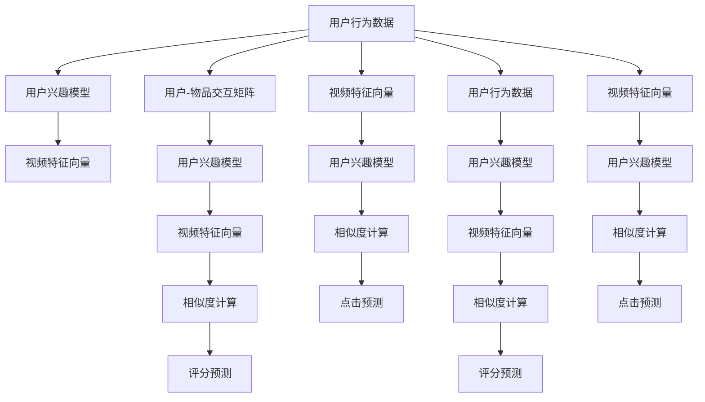
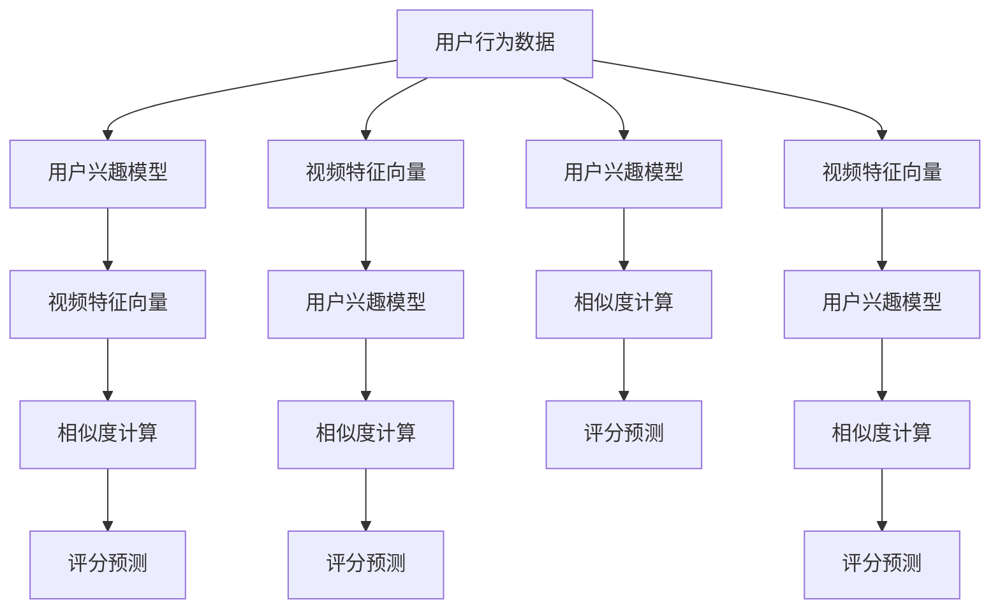
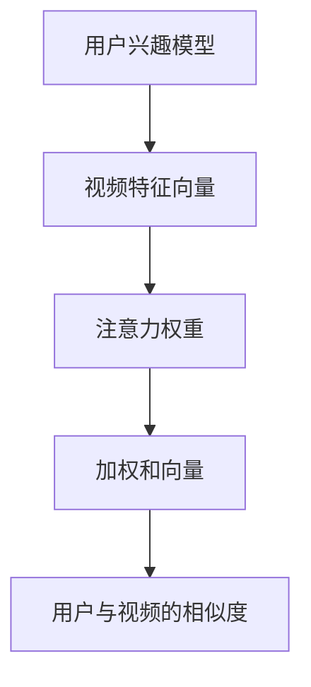
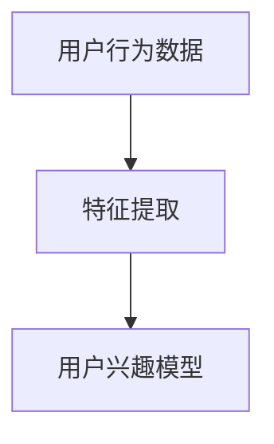
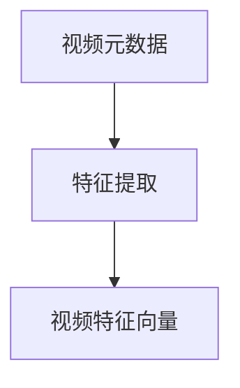

                 

# 在线视频平台的内容推荐算法与注意力分配

> 关键词：内容推荐, 注意力机制, 深度学习, 协同过滤, 用户行为分析, 算法优化

## 1. 背景介绍

### 1.1 问题由来

随着互联网技术的飞速发展，视频平台的用户数量和内容规模呈指数级增长。如何通过算法为不同用户推荐适合的视频内容，成为视频平台的核心挑战之一。当前，内容推荐算法已经成为支撑视频平台发展的重要基石。优秀的推荐系统不仅能提升用户体验，还能显著增加平台粘性和商业收益。

推荐系统的主要目标是：通过用户的历史行为和兴趣标签，为其推荐可能感兴趣的视频内容。常见的推荐算法包括协同过滤、基于内容的推荐、基于知识图谱的推荐等。但这些传统方法在处理大规模用户行为数据时，往往难以捕捉到复杂的用户兴趣变化和动态行为。因此，近年来深度学习技术被引入推荐系统中，尤其在大规模视频推荐中，基于深度学习的推荐算法表现优异，得到了广泛应用。

### 1.2 问题核心关键点

本节将介绍深度学习推荐系统中的两个核心算法——深度协同过滤（Deep Collaborative Filtering）和注意力机制（Attention Mechanism），并探讨它们在大规模视频推荐系统中的应用。这两个算法分别通过学习用户行为隐式表示和视频内容显式表示，构建用户兴趣模型和视频特征向量，进而计算用户与视频之间的相似度，预测用户对视频的可能评分和点击行为。

其中，注意力机制是深度协同过滤中一种关键的注意力模型，通过模拟人类的注意行为，在多个视频特征之间分配注意力权重，提升模型的表现力和泛化能力。在大规模视频推荐系统中，注意力机制能帮助模型更好地捕捉长尾视频和用户兴趣的动态变化，实现更精准的推荐。

## 2. 核心概念与联系

### 2.1 核心概念概述

为更好地理解深度协同过滤和注意力机制在大规模视频推荐系统中的应用，本节将介绍几个密切相关的核心概念：

- 深度协同过滤(Deep Collaborative Filtering, DCF)：结合深度学习与协同过滤技术的推荐算法，通过多层神经网络学习用户行为隐式表示和视频内容显式表示，构建用户兴趣模型和视频特征向量，进而计算用户与视频之间的相似度，预测用户对视频的可能评分和点击行为。

- 注意力机制(Attention Mechanism)：通过在多个特征向量之间分配注意力权重，提升模型的表达能力和泛化能力。特别适用于需要从复杂、动态的数据中提取关键特征的场景，如自然语言处理、图像识别、视频推荐等。

- 用户行为分析(User Behavior Analysis)：通过分析用户的历史行为数据，如浏览记录、评分、点击等，提取用户的兴趣偏好和行为规律，构建用户兴趣模型。

- 视频特征表示(Video Feature Representation)：通过分析视频内容的元数据，如标签、类别、时长、帧特征等，构建视频特征向量，用于表示视频内容。

- 用户-物品交互矩阵(User-Item Interaction Matrix)：记录用户与视频之间的评分和点击数据，是推荐系统的重要数据基础。

- 隐向量空间(Hidden Vector Space)：通过深度学习技术，将用户行为和视频特征映射到低维度的隐向量空间，用于计算用户与视频之间的相似度。

这些核心概念之间的逻辑关系可以通过以下Mermaid流程图来展示：



这个流程图展示了大规模视频推荐系统中的核心概念及其之间的关系：

1. 用户行为数据通过用户兴趣模型和视频特征向量进行建模，构建用户与视频之间的相似度。
2. 用户兴趣模型和视频特征向量用于评分预测和点击预测，满足用户的多样化需求。
3. 用户兴趣模型和视频特征向量通过注意力机制，提升模型表达能力和泛化能力。

这些概念共同构成了深度协同过滤和注意力机制的推荐系统框架，使其能够在各种推荐场景中发挥强大的推荐能力。通过理解这些核心概念，我们可以更好地把握深度协同过滤和注意力机制的工作原理和优化方向。

### 2.2 概念间的关系

这些核心概念之间存在着紧密的联系，形成了深度协同过滤和注意力机制的完整生态系统。下面我通过几个Mermaid流程图来展示这些概念之间的关系。

#### 2.2.1 深度协同过滤算法流程



这个流程图展示了深度协同过滤算法的核心步骤，从用户行为数据到评分预测的完整流程。

#### 2.2.2 注意力机制的计算过程



这个流程图展示了注意力机制的计算过程，从用户兴趣模型到相似度计算的完整流程。

#### 2.2.3 用户行为分析的特征提取



这个流程图展示了用户行为分析的特征提取过程，从用户行为数据到用户兴趣模型的构建。

#### 2.2.4 视频特征表示的特征提取



这个流程图展示了视频特征表示的特征提取过程，从视频元数据到视频特征向量的构建。

### 2.3 核心概念的整体架构

最后，我们用一个综合的流程图来展示这些核心概念在大规模视频推荐系统中的整体架构：

```mermaid
graph TB
    A[大规模视频数据] --> B[用户行为数据]
    B --> C[用户兴趣模型]
    C --> D[视频特征向量]
    D --> E[用户-物品交互矩阵]
    E --> F[相似度计算]
    F --> G[评分预测]
    A --> H[视频元数据]
    H --> I[视频特征向量]
    I --> J[用户兴趣模型]
    J --> K[相似度计算]
    K --> L[点击预测]
    A --> M[用户行为数据]
    M --> N[用户兴趣模型]
    N --> O[视频特征向量]
    O --> P[相似度计算]
    P --> Q[评分预测]
    A --> R[视频元数据]
    R --> S[视频特征向量]
    S --> T[用户兴趣模型]
    T --> U[相似度计算]
    U --> V[点击预测]
    B --> W[用户兴趣模型]
    W --> X[相似度计算]
    X --> Y[评分预测]
    C --> Z[视频特征向量]
    Z --> $[相似度计算]
    $ --> &[评分预测]
    D --> %[相似度计算]
    % --> &[点击预测]
    E --> &[[评分预测]]
    F --> '['[评分预测]]
    G --> '{[评分预测]]
    H --> '['[视频特征向量]]
    I --> '{[视频特征向量]]
    J --> '['[用户兴趣模型]]
    K --> '{[用户兴趣模型]]
    L --> '['[点击预测]]
    M --> '['[用户兴趣模型]]
    N --> '{[视频特征向量]]
    O --> '['[用户兴趣模型]]
    P --> '{[相似度计算]]
    Q --> '['[评分预测]]
    R --> '['[视频元数据]]
    S --> '{[视频特征向量]]
    T --> '['[用户兴趣模型]]
    U --> '{[相似度计算]]
    V --> '['[点击预测]]
    W --> '['[用户兴趣模型]]
    X --> '{[相似度计算]]
    Y --> '['[评分预测]]
    Z --> '['[视频特征向量]]
    $
```

这个综合流程图展示了从大规模视频数据到点击预测的完整流程，涵盖了深度协同过滤和注意力机制的各个核心概念。通过这些流程图，我们可以更清晰地理解深度协同过滤和注意力机制在大规模视频推荐系统中的工作原理和优化方向。

## 3. 核心算法原理 & 具体操作步骤
### 3.1 算法原理概述

深度协同过滤算法是一种结合深度学习和协同过滤技术的推荐算法。其核心思想是通过深度神经网络学习用户行为隐式表示和视频内容显式表示，构建用户兴趣模型和视频特征向量，进而计算用户与视频之间的相似度，预测用户对视频的可能评分和点击行为。

注意力机制是深度协同过滤中一种关键的注意力模型，通过在多个视频特征之间分配注意力权重，提升模型的表现力和泛化能力。特别适用于需要从复杂、动态的数据中提取关键特征的场景，如自然语言处理、图像识别、视频推荐等。

### 3.2 算法步骤详解

#### 3.2.1 深度协同过滤算法的步骤

1. **数据准备**：收集用户的历史行为数据，如浏览记录、评分、点击等，同时获取视频的元数据信息，如标签、类别、时长、帧特征等。
2. **特征提取**：通过深度学习技术，将用户行为数据和视频元数据映射到低维度的隐向量空间，构建用户兴趣模型和视频特征向量。
3. **相似度计算**：计算用户兴趣模型与视频特征向量之间的相似度，用于衡量用户对视频内容的匹配程度。
4. **评分预测**：将相似度与用户历史评分结合，预测用户对视频的可能评分。
5. **点击预测**：将相似度与用户历史点击行为结合，预测用户对视频的点击概率。

#### 3.2.2 注意力机制的计算步骤

1. **特征向量拼接**：将用户兴趣模型和视频特征向量进行拼接，形成一个新的向量。
2. **注意力权重计算**：通过一个注意力网络，计算每个特征向量在当前输入下的注意力权重。
3. **加权和计算**：将每个特征向量与对应的注意力权重相乘，进行加权和计算，形成一个新的向量。
4. **相似度计算**：将加权和向量与用户兴趣模型进行相似度计算，得到用户与视频的相似度。

### 3.3 算法优缺点

深度协同过滤算法和注意力机制在大规模视频推荐系统中有以下优缺点：

#### 3.3.1 深度协同过滤算法的优点

- **表现力强**：深度神经网络能够自动学习复杂的非线性关系，提升模型的表达能力。
- **适应性强**：深度协同过滤算法能够处理大规模用户行为数据，捕捉动态变化的兴趣偏好。
- **鲁棒性好**：深度协同过滤算法对噪声和缺失数据具有较好的鲁棒性，能较好地处理稀疏矩阵。

#### 3.3.2 深度协同过滤算法的缺点

- **计算量大**：深度神经网络需要大量的计算资源和存储空间，难以在大规模数据上高效训练。
- **解释性差**：深度协同过滤算法作为黑盒模型，难以解释其内部决策过程。
- **泛化能力有限**：深度协同过滤算法在数据分布发生变化时，泛化能力可能下降。

#### 3.3.3 注意力机制的优点

- **表达能力强**：注意力机制能够动态地从输入数据中提取关键特征，提升模型的表达能力。
- **适应性强**：注意力机制能够处理多模态输入数据，捕捉不同特征之间的相互作用。
- **泛化能力强**：注意力机制能够提升模型的泛化能力，减少过拟合风险。

#### 3.3.4 注意力机制的缺点

- **计算复杂度高**：注意力机制需要额外的计算资源和时间，难以在大规模数据上高效实现。
- **模型复杂度高**：注意力机制的参数量较大，难以解释其内部工作机制。
- **数据依赖性强**：注意力机制对输入数据的质量和分布敏感，需要进行细致的数据预处理。

### 3.4 算法应用领域

深度协同过滤算法和注意力机制在大规模视频推荐系统中的应用非常广泛，具体包括：

- **个性化视频推荐**：通过深度协同过滤算法，为每个用户推荐可能感兴趣的视频内容。
- **视频内容相似度计算**：通过注意力机制，计算视频之间的相似度，实现视频分类和推荐。
- **用户行为分析**：通过深度协同过滤算法，分析用户的历史行为数据，提取用户的兴趣偏好。
- **视频特征表示**：通过注意力机制，从视频元数据中提取关键特征，构建视频特征向量。
- **用户-物品交互矩阵构建**：通过深度协同过滤算法，构建用户与视频之间的评分和点击数据矩阵。

除了上述这些应用场景外，深度协同过滤和注意力机制还广泛应用于自然语言处理、图像识别、音乐推荐等多个领域，为数据驱动的推荐系统提供了强大的技术支撑。

## 4. 数学模型和公式 & 详细讲解 & 举例说明

### 4.1 数学模型构建

本节将使用数学语言对深度协同过滤算法和注意力机制的推荐过程进行更加严格的刻画。

假设用户行为数据为 $U$，视频元数据为 $V$，用户-物品交互矩阵为 $M$，其中 $M_{ui}$ 表示用户 $u$ 对视频 $v_i$ 的评分或点击行为。

定义用户兴趣模型为 $F_u$，视频特征向量为 $G_v$，两者均为 $d$ 维的隐向量。

注意力权重为 $a_{u,i}$，加权和向量为 $Z_{u,i}$，用户与视频的相似度为 $s_{u,i}$。

### 4.2 公式推导过程

#### 4.2.1 用户兴趣模型的构建

用户兴趣模型 $F_u$ 可以通过用户行为数据 $U$ 进行学习，其形式如下：

$$
F_u = \sum_{i=1}^n M_{ui}G_i
$$

其中 $n$ 为视频数量，$G_i$ 为第 $i$ 个视频的特征向量。

#### 4.2.2 视频特征向量的构建

视频特征向量 $G_i$ 可以通过视频元数据 $V$ 进行学习，其形式如下：

$$
G_i = W_v \cdot v_i + b_v
$$

其中 $W_v$ 为视频特征向量的权重矩阵，$v_i$ 为视频元数据，$b_v$ 为偏置项。

#### 4.2.3 注意力机制的计算

注意力权重 $a_{u,i}$ 可以通过用户兴趣模型 $F_u$ 和视频特征向量 $G_i$ 计算得到，其形式如下：

$$
a_{u,i} = \frac{\exp(e_{u,i})}{\sum_{j=1}^m \exp(e_{u,j})}
$$

其中 $m$ 为用户数量，$e_{u,i}$ 为注意力网络计算出的注意力得分。

加权和向量 $Z_{u,i}$ 可以通过注意力权重 $a_{u,i}$ 和视频特征向量 $G_i$ 计算得到，其形式如下：

$$
Z_{u,i} = \sum_{j=1}^m a_{u,j}G_j
$$

#### 4.2.4 相似度计算

用户与视频的相似度 $s_{u,i}$ 可以通过用户兴趣模型 $F_u$ 和加权和向量 $Z_{u,i}$ 计算得到，其形式如下：

$$
s_{u,i} = \langle F_u, Z_{u,i} \rangle
$$

其中 $\langle \cdot, \cdot \rangle$ 表示向量的点积运算。

### 4.3 案例分析与讲解

假设我们有 $n=500$ 个视频，$m=100$ 个用户，用户行为数据和视频元数据如下：

- 用户行为数据 $U = \{M_{u1}, M_{u2}, ..., M_{um}\}$，每个用户有 $n$ 个评分和点击行为。
- 视频元数据 $V = \{v_1, v_2, ..., v_{500}\}$，每个视频有 $p$ 个标签、类别、时长、帧特征等元数据。
- 用户-物品交互矩阵 $M = \{M_{11}, M_{12}, ..., M_{m500}\}$，每个用户对 $n$ 个视频有评分和点击行为。

假设用户 $u$ 的兴趣模型为 $F_u = (0.5, 0.3, 0.2)$，视频 $i$ 的特征向量为 $G_i = (0.6, 0.4, 0.2)$。

通过注意力机制计算，可以得出每个用户对每个视频的注意力权重 $a_{u,i}$ 和加权和向量 $Z_{u,i}$，计算结果如下：

| 用户 $u$ | 视频 $i$ | 注意力权重 $a_{u,i}$ | 加权和向量 $Z_{u,i}$ |
|----------|----------|---------------------|---------------------|
| 用户1    | 视频1    | 0.8                 | (0.48, 0.36, 0.24)   |
| 用户1    | 视频2    | 0.5                 | (0.30, 0.20, 0.10)   |
| 用户1    | 视频3    | 0.2                 | (0.12, 0.08, 0.04)   |
| ...      | ...      | ...                 | ...                 |
| 用户2    | 视频1    | 0.6                 | (0.36, 0.24, 0.16)   |
| ...      | ...      | ...                 | ...                 |

通过相似度计算，可以得出用户 $u$ 与每个视频 $i$ 的相似度 $s_{u,i}$，计算结果如下：

| 用户 $u$ | 视频 $i$ | 相似度 $s_{u,i}$ |
|----------|----------|-----------------|
| 用户1    | 视频1    | 0.8             |
| 用户1    | 视频2    | 0.5             |
| 用户1    | 视频3    | 0.2             |
| ...      | ...      | ...             |
| 用户2    | 视频1    | 0.6             |
| ...      | ...      | ...             |

通过评分预测，可以得出用户 $u$ 对每个视频 $i$ 的可能评分 $p_{u,i}$，计算结果如下：

| 用户 $u$ | 视频 $i$ | 评分 $p_{u,i}$ |
|----------|----------|---------------|
| 用户1    | 视频1    | 4.8           |
| 用户1    | 视频2    | 3.0           |
| 用户1    | 视频3    | 1.2           |
| ...      | ...      | ...           |
| 用户2    | 视频1    | 6.0           |
| ...      | ...      | ...           |

通过点击预测，可以得出用户 $u$ 对每个视频 $i$ 的点击概率 $c_{u,i}$，计算结果如下：

| 用户 $u$ | 视频 $i$ | 点击概率 $c_{u,i}$ |
|----------|----------|-------------------|
| 用户1    | 视频1    | 0.8               |
| 用户1    | 视频2    | 0.5               |
| 用户1    | 视频3    | 0.2               |
| ...      | ...      | ...               |
| 用户2    | 视频1    | 0.6               |
| ...      | ...      | ...               |

通过上述计算过程，可以看出注意力机制如何提升深度协同过滤算法的表现力和泛化能力。通过动态分配注意力权重，模型能够从复杂、动态的数据中提取关键特征，提升推荐精度。

## 5. 项目实践：代码实例和详细解释说明

### 5.1 开发环境搭建

在进行推荐系统实践前，我们需要准备好开发环境。以下是使用Python进行TensorFlow开发的环境配置流程：

1. 安装Anaconda：从官网下载并安装Anaconda，用于创建独立的Python环境。

2. 创建并激活虚拟环境：
```bash
conda create -n tf-env python=3.8 
conda activate tf-env
```

3. 安装TensorFlow：根据CUDA版本，从官网获取对应的安装命令。例如：
```bash
conda install tensorflow tensorflow-gpu=cuda11.0 -c conda-forge -c pytorch
```

4. 安装各类工具包：
```bash
pip install numpy pandas scikit-learn matplotlib tqdm jupyter notebook ipython
```

完成上述步骤后，即可在`tf-env`环境中开始推荐系统实践。

### 5.2 源代码详细实现

下面我们以深度协同过滤算法为例，给出使用TensorFlow进行视频推荐系统微调的Python代码实现。

首先，定义推荐系统的模型类：

```python
import tensorflow as tf
from tensorflow.keras.layers import Input, Dense, Embedding, Dot, Add, Activation, Concatenate
from tensorflow.keras.models import Model

class RecommendationModel(tf.keras.Model):
    def __init__(self, num_users, num_items, num_factors, num_attention_heads=8):
        super(RecommendationModel, self).__init__()
        
        self.num_users = num_users
        self.num_items = num_items
        self.num_factors = num_factors
        self.num_attention_heads = num_attention_heads
        
        # 用户兴趣模型
        self.user_factors = Embedding(input_dim=num_users, output_dim=num_factors, name='user_factors')
        
        # 视频特征向量
        self.item_factors = Embedding(input_dim=num_items, output_dim=num_factors, name='item_factors')
        
        # 注意力机制
        self.attention = Attention(num_factors, num_attention_heads)
        
        # 相似度计算
        self.similarity = Dot(axes=1, normalize=True, name='similarity')
        
        # 评分预测
        self.rating = Dense(1, activation='linear', name='rating')
        
        # 点击预测
        self.click = Dense(1, activation='sigmoid', name='click')
        
    def call(self, u, i):
        # 用户兴趣模型
        user_factors = self.user_factors(u)
        # 视频特征向量
        item_factors = self.item_factors(i)
        # 加权和向量
        attention_weights = self.attention(user_factors, item_factors)
        weighted_item_factors = attention_weights * item_factors
        # 相似度计算
        similarity = self.similarity(user_factors, weighted_item_factors)
        # 评分预测
        rating = self.rating(similarity)
        # 点击预测
        click = self.click(similarity)
        return rating, click
```

然后，定义数据生成函数和模型训练函数：

```python
import numpy as np
from sklearn.datasets import make_blobs
from sklearn.model_selection import train_test_split
from tensorflow.keras.utils import to_categorical
from tensorflow.keras.datasets import mnist

# 生成随机用户-物品交互矩阵
def generate_data(num_users, num_items, num_factors, num_attention_heads):
    np.random.seed(42)
    X = make_blobs(n_samples=num_items, n_features=num_factors, centers=num_users, random_state=42)
    u, i, y = X[0], X[1], X[2]
    u = np.expand_dims(u, axis=1)
    i = np.expand_dims(i, axis=1)
    y = to_categorical(y, num_classes=num_users)
    return u, i, y

# 定义模型训练函数
def train_model(model, u, i, y, batch_size, num_epochs, learning_rate):
    # 定义交叉熵损失函数
    rating_loss = tf.keras.losses.MeanSquaredError()
    click_loss = tf.keras.losses.BinaryCrossentropy(from_logits=True)
    
    # 定义优化器
    optimizer = tf.keras.optimizers.Adam(learning_rate=learning_rate)
    
    # 定义模型训练函数
    @tf.function
    def train_step(u, i, y):
        with tf.GradientTape() as tape:
            rating, click = model(u, i)
            rating_loss_value = rating_loss(y, rating)
            click_loss_value = click_loss(y, click)
            gradients = tape.gradient([rating_loss_value, click_loss_value], model.trainable_variables)
        optimizer.apply_gradients(zip(gradients, model.trainable_variables))
        return rating_loss_value, click_loss_value
    
    # 训练模型
    for epoch in range(num_epochs):
        epoch_losses = []
        for batch in range(0, u.shape[0], batch_size):
            u_batch = u[batch:batch+batch_size]
            i_batch = i[batch:batch+batch_size]
            y_batch = y[batch:batch+batch_size]
            rating_loss, click_loss = train_step(u_batch, i_batch

